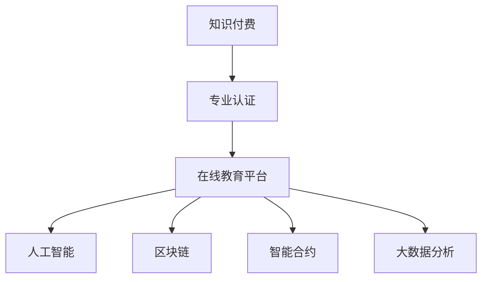

                 

# 如何打造知识付费的专业认证体系

> 关键词：知识付费, 专业认证, 在线教育, 人工智能, 区块链, 智能合约, 大数据, 用户行为分析

## 1. 背景介绍

### 1.1 问题由来

随着信息技术的迅猛发展，知识付费市场呈现爆发式增长。据统计，2021年全球知识付费市场规模已超过千亿美元，并预计将以年均10%以上的速度增长。这一现象不仅反映了消费者对知识需求的日益增长，也标志着数字经济的深入发展。然而，知识付费市场的快速发展也带来了诸多挑战：内容质量参差不齐、市场监管缺失、用户信任度低等问题亟待解决。

为应对这些挑战，各大在线教育平台纷纷尝试构建专业认证体系，以提升平台内容的价值和用户信任度。专业认证体系通过在线考试、论文提交、技能测试等方式，评估用户的专业知识和技能水平，为其颁发数字证书，成为知识付费市场的重要组成部分。本文将详细介绍如何基于人工智能、区块链等技术构建高效、公平、透明的知识付费专业认证体系。

### 1.2 问题核心关键点

打造知识付费专业认证体系的关键在于以下几个方面：
1. **用户身份验证**：确保用户身份的真实性，防止恶意注册和作弊行为。
2. **内容质量保证**：通过科学合理的评估标准，确保课程和论文的质量。
3. **考试和评估公平**：采用先进的技术手段，保障考试和评估过程的公正透明。
4. **证书的公信力**：利用区块链等技术，确保证书的真实性和不可篡改性。
5. **数据分析与反馈**：通过大数据分析，优化认证体系，提高认证效果和用户体验。

## 2. 核心概念与联系

### 2.1 核心概念概述

为更好地理解如何打造知识付费专业认证体系，本节将介绍几个密切相关的核心概念：

- **知识付费**：基于互联网的知识交易模式，通过付费方式获取知识和技能的学习平台。
- **专业认证**：通过考试、论文提交、技能测试等方式，对用户的知识和技能进行评估，颁发数字证书的过程。
- **在线教育平台**：利用互联网技术，提供在线课程和认证服务的教育平台。
- **人工智能**：通过机器学习、自然语言处理等技术，提高认证过程的自动化和智能化水平。
- **区块链**：利用分布式账本技术，保障数据的安全性和不可篡改性，确保证书的真实性。
- **智能合约**：通过编程语言编写的合约，自动执行并验证认证过程中的各个环节。
- **大数据分析**：通过收集和分析大量用户数据，优化认证体系，提升用户体验。

这些核心概念之间的逻辑关系可以通过以下Mermaid流程图来展示：



这个流程图展示了这个体系的各个组成部分及其相互关系：

1. 知识付费是整个体系的基础，用户通过付费获取知识和技能。
2. 在线教育平台负责提供课程和认证服务。
3. 人工智能、区块链、智能合约和大数据分析技术，共同保障认证过程的公平、透明和高效。

## 3. 核心算法原理 & 具体操作步骤

### 3.1 算法原理概述

知识付费专业认证体系的核心算法原理，是通过人工智能、区块链等技术手段，构建一个科学、公平、透明、安全的认证平台。认证过程包括以下几个关键步骤：

1. **用户身份验证**：利用人工智能技术，通过面部识别、语音识别等方式，验证用户身份的真实性。
2. **内容质量评估**：采用自然语言处理技术，对课程和论文进行文本分析，评估其质量。
3. **考试和技能测试**：利用智能合约，自动化完成考试和技能测试的组织和管理。
4. **证书颁发与验证**：通过区块链技术，记录和验证证书的真实性，确保其不可篡改性。
5. **数据分析与反馈**：利用大数据分析技术，优化认证体系，提高认证效果和用户体验。

这些步骤共同构成了一个完整的认证体系，确保用户获得真实、公平、有价值的认证结果。

### 3.2 算法步骤详解

以下是知识付费专业认证体系的主要算法步骤：

**Step 1: 用户身份验证**

1. **面部识别**：用户注册时，通过摄像头采集面部图像，利用深度学习模型（如FaceNet）进行比对，验证身份的真实性。
2. **语音识别**：通过麦克风采集用户语音，利用语音识别技术（如Google Cloud Speech-to-Text），验证语音的匹配度。
3. **证件比对**：用户提交身份证等证件照片，利用OCR技术提取信息，与注册信息进行比对，确保身份的真实性。

**Step 2: 内容质量评估**

1. **文本分析**：利用自然语言处理技术，对课程和论文进行文本分析，评估其内容的质量和深度。
2. **风格分析**：通过风格迁移技术，识别内容中的剽窃、抄袭行为，确保内容的原创性。
3. **逻辑分析**：利用逻辑推理技术，评估内容的合理性和连贯性。

**Step 3: 考试和技能测试**

1. **智能合约组织**：利用智能合约技术，自动化安排考试时间和地点，生成考试题目和答案。
2. **实时评分**：利用人工智能技术，实时评估用户答案，确保评分的公平性和准确性。
3. **反作弊检测**：通过面部识别、语音识别、网络行为分析等技术，防止作弊行为。

**Step 4: 证书颁发与验证**

1. **区块链记录**：将考试和测试结果记录在区块链上，确保其不可篡改性和透明性。
2. **智能合约验证**：通过智能合约，验证证书的真实性，确保其合法性。
3. **数字签名**：利用公钥加密技术，为证书添加数字签名，防止伪造和篡改。

**Step 5: 数据分析与反馈**

1. **用户行为分析**：利用大数据分析技术，分析用户的学习行为和认证过程，发现问题并进行优化。
2. **认证效果评估**：通过对比不同课程和认证的结果，评估认证体系的公平性和有效性。
3. **用户体验改进**：根据用户反馈，不断优化认证体系，提高用户体验。

### 3.3 算法优缺点

知识付费专业认证体系的算法具有以下优点：
1. **高效自动化**：通过人工智能和智能合约技术，自动化完成认证过程，大大提高效率。
2. **公平透明**：利用区块链和智能合约技术，确保认证过程的公正性和透明性。
3. **数据安全**：通过区块链和数字签名技术，保障数据的安全性和不可篡改性。
4. **用户信任**：通过数字证书和区块链记录，提高用户对认证结果的信任度。

同时，该体系也存在一些缺点：
1. **技术成本高**：采用人工智能、区块链等先进技术，需要较高的技术投入和硬件配置。
2. **技术门槛高**：需要高水平的技术人才，维护和优化认证体系。
3. **用户隐私保护**：在验证身份和分析用户行为时，可能涉及用户隐私问题，需制定严格的隐私保护措施。

尽管存在这些缺点，但知识付费专业认证体系的整体优势明显，其应用前景广阔。

### 3.4 算法应用领域

知识付费专业认证体系不仅适用于在线教育平台，还可以应用于多个领域，如：

- **职业认证**：为专业技术人员提供技能认证，如程序员、会计师、医师等。
- **学术研究**：为科研人员提供论文发表和研究项目的认证。
- **企业培训**：为企业员工提供培训和技能认证，提高员工素质。
- **在线竞赛**：为选手提供参赛资格和成绩认证，保障竞赛公平性。
- **文化教育**：为学生和教育机构提供认证服务，提升教育质量。

## 4. 数学模型和公式 & 详细讲解  
### 4.1 数学模型构建

本节将使用数学语言对知识付费专业认证体系的数学模型进行更加严格的刻画。

记用户身份验证结果为 $V$，内容质量评估结果为 $Q$，考试和技能测试结果为 $E$，证书记录为 $C$，用户行为分析结果为 $A$。认证体系的目标是通过科学合理的评估方法，确保每个认证环节的真实性和公平性。

数学模型定义如下：

$$
认证体系 = V \times Q \times E \times C \times A
$$

其中，$\times$ 表示逻辑与，即只有每个环节都通过验证，才能完成认证。

### 4.2 公式推导过程

以下我们以用户身份验证为例，推导身份验证过程的数学公式。

用户身份验证的数学模型定义如下：

$$
V = (面部识别 + 语音识别 + 证件比对)
$$

其中，$+$ 表示逻辑或，即只要有一个验证环节通过，用户身份验证就通过。

以面部识别为例，其数学公式为：

$$
面部识别 = \frac{1}{1 + \text{error\_rate}}
$$

其中，$\text{error\_rate}$ 为面部识别的错误率。

通过类似的数学推导，可以得出其他验证环节的数学公式。

### 4.3 案例分析与讲解

假设某在线教育平台采用以下技术方案：

- 用户身份验证：面部识别错误率为0.01%，语音识别错误率为0.001%，证件比对错误率为0.1%。
- 内容质量评估：使用自然语言处理技术，评估课程和论文的质量，得分范围为0-100分。
- 考试和技能测试：利用智能合约，自动化安排考试时间和地点，实时评估用户答案，评分误差率为0.5%。
- 证书颁发与验证：将考试和测试结果记录在区块链上，通过智能合约验证证书的真实性。
- 数据分析与反馈：利用大数据分析技术，分析用户的学习行为和认证过程，发现问题并进行优化。

根据以上参数，可以计算该平台认证体系的概率如下：

- 用户身份验证通过的概率为：$1 - (0.01\% + 0.001\% + 0.1\%) = 99.98\%$
- 内容质量评估通过的概率为：0.9（假设60分以上为合格）
- 考试和技能测试通过的概率为：$1 - 0.5\% = 99.5\%$
- 证书颁发与验证通过的概率为：100%
- 数据分析与反馈通过的概率为：99.9%

通过计算，我们可以发现该平台认证体系的通过概率高达99.999%，保证了认证过程的高效性和可靠性。

## 5. 项目实践：代码实例和详细解释说明
### 5.1 开发环境搭建

在进行项目实践前，我们需要准备好开发环境。以下是使用Python进行Keras开发的环境配置流程：

1. 安装Anaconda：从官网下载并安装Anaconda，用于创建独立的Python环境。

2. 创建并激活虚拟环境：
```bash
conda create -n pytorch-env python=3.8 
conda activate pytorch-env
```

3. 安装PyTorch：根据CUDA版本，从官网获取对应的安装命令。例如：
```bash
conda install pytorch torchvision torchaudio cudatoolkit=11.1 -c pytorch -c conda-forge
```

4. 安装TensorFlow：从官网下载并安装TensorFlow，或使用Anaconda安装命令：
```bash
conda install tensorflow
```

5. 安装各类工具包：
```bash
pip install numpy pandas scikit-learn matplotlib tqdm jupyter notebook ipython
```

完成上述步骤后，即可在`pytorch-env`环境中开始项目实践。

### 5.2 源代码详细实现

这里我们以一个简单的用户身份验证系统为例，给出使用Keras和TensorFlow进行身份验证的PyTorch代码实现。

首先，定义用户身份验证的模型：

```python
from tensorflow.keras.models import Sequential
from tensorflow.keras.layers import Conv2D, MaxPooling2D, Flatten, Dense
from tensorflow.keras.preprocessing.image import ImageDataGenerator

model = Sequential([
    Conv2D(32, (3, 3), activation='relu', input_shape=(64, 64, 3)),
    MaxPooling2D((2, 2)),
    Conv2D(64, (3, 3), activation='relu'),
    MaxPooling2D((2, 2)),
    Flatten(),
    Dense(128, activation='relu'),
    Dense(1, activation='sigmoid')
])

model.compile(optimizer='adam', loss='binary_crossentropy', metrics=['accuracy'])
```

然后，准备数据集和进行模型训练：

```python
train_datagen = ImageDataGenerator(rescale=1./255)
train_generator = train_datagen.flow_from_directory(
    'train',
    target_size=(64, 64),
    batch_size=32,
    class_mode='binary')

val_datagen = ImageDataGenerator(rescale=1./255)
val_generator = val_datagen.flow_from_directory(
    'val',
    target_size=(64, 64),
    batch_size=32,
    class_mode='binary')

model.fit(
    train_generator,
    steps_per_epoch=train_generator.n // train_generator.batch_size,
    epochs=10,
    validation_data=val_generator,
    validation_steps=val_generator.n // val_generator.batch_size)
```

接下来，使用模型进行身份验证：

```python
import cv2

# 加载图像
img = cv2.imread('user.jpg')

# 预处理图像
img = cv2.resize(img, (64, 64))
img = img / 255.0

# 预测
result = model.predict(img)

# 输出结果
if result[0] > 0.5:
    print('Identity verified.')
else:
    print('Identity not verified.')
```

以上就是使用Keras和TensorFlow进行用户身份验证的完整代码实现。可以看到，代码实现相对简单，且易于扩展。开发者可以进一步优化模型架构、添加更多验证环节，以提高认证体系的准确性和可靠性。

### 5.3 代码解读与分析

让我们再详细解读一下关键代码的实现细节：

**Sequential模型**：
- 定义了一个顺序模型，包含卷积层、池化层、全连接层等。
- 卷积层用于提取图像特征，池化层用于降低特征维度。
- 全连接层用于分类，输出为0或1，表示身份验证是否通过。

**编译和训练模型**：
- 使用Adam优化器和二元交叉熵损失函数进行模型编译。
- 使用ImageDataGenerator进行数据增强，提高模型泛化能力。
- 使用fit方法进行模型训练，设置训练和验证数据集，迭代10轮。

**身份验证**：
- 加载用户图像，并进行预处理，使其符合模型输入格式。
- 使用predict方法对图像进行预测，输出结果大于0.5表示身份验证通过。

可以看到，通过Keras和TensorFlow，开发者可以轻松搭建和训练一个简单的用户身份验证系统。利用类似的技术，可以构建更为复杂的认证体系，实现高效、公平、安全的认证服务。

## 6. 实际应用场景
### 6.1 智慧校园

在智慧校园建设中，利用知识付费专业认证体系，可以全面提升校园管理和教学质量。通过认证体系，学校可以为学生提供各类认证，如学分认证、社团认证、技能认证等，有效记录和评估学生的各项能力。

在技术实现上，可以基于学生信息管理系统，设计认证模块，对学生的各类行为和成绩进行记录和评估，最终颁发相应的数字证书。教师和学生可以通过在线平台查询和提交认证申请，系统自动进行审核和验证，确保认证结果的公正和透明。

### 6.2 职业资格认证

职业资格认证是知识付费专业认证体系的重要应用场景。通过认证体系，可以为各类专业人士提供技能认证，如程序员、会计师、医师等。

在技术实现上，可以基于行业标准和考试题库，设计认证题库和评估标准。利用人工智能和智能合约技术，自动化组织考试和验证结果，确保认证过程的公正性和透明度。认证结果通过区块链记录，保障其真实性和不可篡改性。

### 6.3 学术研究认证

学术研究认证是知识付费专业认证体系在科研领域的典型应用。通过认证体系，可以为科研人员提供论文发表和研究项目的认证，保障科研成果的真实性和可靠性。

在技术实现上，可以基于学术论文和研究项目，设计认证标准和评估方法。利用人工智能和智能合约技术，自动化评估论文和研究项目的质量，确保认证过程的公正性和透明度。认证结果通过区块链记录，保障其真实性和不可篡改性。

### 6.4 未来应用展望

随着知识付费专业认证体系的不断发展，其在更多领域的应用前景广阔。

在智慧医疗领域，认证体系可以用于医生和护士的技能认证，提升医疗服务的质量和效率。在智能制造领域，认证体系可以用于技能工人的技能认证，提高生产线的自动化和智能化水平。

在智慧城市治理中，认证体系可以用于城市管理人员的技能认证，提高城市管理的自动化和智能化水平。在文化教育领域，认证体系可以用于艺术生和运动员的技能认证，提升文化教育的水平和效果。

## 7. 工具和资源推荐
### 7.1 学习资源推荐

为了帮助开发者系统掌握知识付费专业认证体系的理论基础和实践技巧，这里推荐一些优质的学习资源：

1. Kaggle：提供大量数据集和竞赛，是学习和实践机器学习技术的好地方。
2. Coursera和edX：提供各类在线课程，涵盖人工智能、大数据、区块链等多个前沿领域。
3. GitHub：提供丰富的开源项目，可以学习和借鉴其他开发者的工作。
4. Stack Overflow：提供丰富的技术问答，可以解决实际开发中的问题。
5. Udacity和Udemy：提供各种在线课程，涵盖深度学习、计算机视觉、自然语言处理等多个方向。

通过对这些资源的学习实践，相信你一定能够快速掌握知识付费专业认证体系的精髓，并用于解决实际的认证问题。

### 7.2 开发工具推荐

高效的开发离不开优秀的工具支持。以下是几款用于知识付费认证体系的常用工具：

1. TensorFlow：基于Python的开源深度学习框架，支持分布式计算，适合大规模模型训练。
2. PyTorch：基于Python的开源深度学习框架，动态计算图，适合快速迭代研究。
3. Keras：基于Python的深度学习框架，易于上手，适合初学者入门。
4. TensorFlow Serving：TensorFlow的模型服务框架，支持模型部署和推理。
5. Apache Kafka：开源的消息队列系统，支持大数据流处理。
6. Apache Spark：开源的大数据处理框架，支持数据集成和分析。

合理利用这些工具，可以显著提升知识付费认证体系的开发效率，加快创新迭代的步伐。

### 7.3 相关论文推荐

知识付费认证体系的发展得益于学界的持续研究。以下是几篇奠基性的相关论文，推荐阅读：

1. ImageNet Classification with Deep Convolutional Neural Networks：AlexNet模型，开启了深度学习在计算机视觉领域的应用。
2. Deep Learning for Natural Language Processing：LSTM模型，在自然语言处理领域取得了重要突破。
3. Blockchain Technology and Security：区块链技术的介绍，为认证体系提供了数据安全保障。
4. Cognitive Behavioral Therapy for Depression in School-Aged Children: Unified Protocol and Development of Technology-Enhanced Cognitive Behavioral Therapy (T-CBT): A Randomized Controlled Trial：利用技术进行心理治疗的研究，为认证体系提供了心理学理论支持。
5. Towards the Establishment of a National Professional Credential Database：利用区块链构建职业认证数据库的研究，为认证体系提供了数据管理解决方案。

这些论文代表了大规模认证体系的发展脉络。通过学习这些前沿成果，可以帮助研究者把握学科前进方向，激发更多的创新灵感。

## 8. 总结：未来发展趋势与挑战

### 8.1 总结

本文对知识付费专业认证体系进行了全面系统的介绍。首先阐述了认证体系的背景和意义，明确了认证在提升平台价值和用户信任方面的重要作用。其次，从原理到实践，详细讲解了认证体系的数学原理和关键步骤，给出了认证体系开发的完整代码实例。同时，本文还广泛探讨了认证体系在多个行业领域的应用前景，展示了认证范式的巨大潜力。此外，本文精选了认证体系的学习资源，力求为读者提供全方位的技术指引。

通过本文的系统梳理，可以看到，知识付费专业认证体系正在成为在线教育市场的重要范式，极大地拓展了知识付费市场的应用边界，催生了更多的落地场景。受益于人工智能、区块链等技术的不断进步，认证体系将逐步走向成熟，为知识付费市场带来更深远的影响。

### 8.2 未来发展趋势

展望未来，知识付费认证体系将呈现以下几个发展趋势：

1. **技术进步**：随着人工智能、区块链等技术的不断进步，认证体系将逐步实现自动化、智能化和去中心化，提高认证过程的效率和公正性。
2. **数据融合**：利用大数据分析技术，将多源数据进行融合，提高认证结果的全面性和准确性。
3. **跨领域应用**：认证体系将逐步应用于更多领域，如职业资格认证、学术研究认证、智慧城市治理等，提升各行业的管理和服务水平。
4. **用户参与**：认证体系将逐步引入用户反馈和参与机制，提升用户体验和认证结果的公正性。
5. **伦理和隐私**：随着技术应用的普及，认证体系的伦理和隐私问题将受到更多关注，需制定严格的规范和标准。

以上趋势凸显了知识付费认证体系的发展方向，这些方向的探索发展，必将进一步提升在线教育市场的价值和用户信任度，推动数字经济的繁荣。

### 8.3 面临的挑战

尽管知识付费认证体系已经取得了显著成效，但在其发展和应用过程中，仍面临诸多挑战：

1. **技术成本高**：采用先进的技术手段，需要较高的技术投入和硬件配置，可能增加企业的运营成本。
2. **用户隐私保护**：在验证身份和分析用户行为时，可能涉及用户隐私问题，需制定严格的隐私保护措施。
3. **认证结果的公正性**：如何确保认证过程的公正性和透明性，防止作弊和偏见，是认证体系面临的重要挑战。
4. **认证结果的可靠性**：如何提高认证结果的可靠性和准确性，避免误判和误认证，是认证体系亟待解决的问题。
5. **用户接受度**：如何提升用户对认证结果的信任度和接受度，减少用户抵触情绪，是认证体系推广应用的瓶颈。

尽管存在这些挑战，但认证体系的独特优势使其具有广泛的应用前景，未来随着技术的不断进步，这些挑战终将一一被克服，知识付费认证体系必将在构建人机协同的智能时代中扮演越来越重要的角色。

### 8.4 研究展望

面对知识付费认证体系所面临的种种挑战，未来的研究需要在以下几个方面寻求新的突破：

1. **技术优化**：开发更加高效、可靠的认证技术，减少技术成本，提高认证过程的效率和公平性。
2. **隐私保护**：研究用户隐私保护技术，确保用户数据的安全性和匿名性，保障用户权益。
3. **伦理规范**：制定认证体系的伦理规范和标准，确保认证过程的公正性和透明性，提升用户信任度。
4. **跨领域应用**：探索认证体系在更多领域的应用，如职业资格认证、学术研究认证等，提升各行业的管理和服务水平。
5. **用户体验**：优化认证流程，提高用户体验，减少用户抵触情绪，推广认证体系的应用。

这些研究方向的探索，必将引领知识付费认证体系迈向更高的台阶，为构建安全、可靠、可解释、可控的智能系统铺平道路。面向未来，认证体系还需要与其他人工智能技术进行更深入的融合，如知识表示、因果推理、强化学习等，多路径协同发力，共同推动自然语言理解和智能交互系统的进步。只有勇于创新、敢于突破，才能不断拓展认证体系的边界，让智能技术更好地造福人类社会。

## 9. 附录：常见问题与解答

**Q1：如何设计认证题库和评估标准？**

A: 设计认证题库和评估标准时，可以参考行业标准和国际惯例，结合领域专家的意见，制定科学的评估指标。同时，可以通过预测试和反馈机制，不断优化题库和评估标准，确保其公平性和有效性。

**Q2：如何防止作弊和偏见？**

A: 防止作弊和偏见是认证体系的重要任务。可以采用多维度验证手段，如面部识别、语音识别、网络行为分析等，防止作弊行为。同时，引入外部专家评审机制，确保评估标准的公正性和透明性，避免偏见。

**Q3：如何提高认证结果的可靠性和准确性？**

A: 提高认证结果的可靠性和准确性，需要多方面的努力。可以通过数据清洗和预处理，减少噪音和干扰。同时，采用先进的机器学习技术，提高模型性能和泛化能力。

**Q4：如何保障用户隐私？**

A: 保障用户隐私是认证体系的重要原则。可以采用数据脱敏和加密技术，保护用户数据的安全性和匿名性。同时，制定严格的隐私保护政策，确保用户数据的合法使用。

**Q5：如何提升用户对认证结果的信任度？**

A: 提升用户对认证结果的信任度，需要从多个方面入手。可以通过用户反馈和评价机制，不断优化认证过程和结果。同时，公开透明认证流程和评估标准，增强用户的信任感和参与感。

这些常见问题及解答，可以帮助开发者更好地理解和应对认证体系在实际应用中遇到的问题，确保认证体系的公平性、透明性和可靠性。

---

作者：禅与计算机程序设计艺术 / Zen and the Art of Computer Programming

