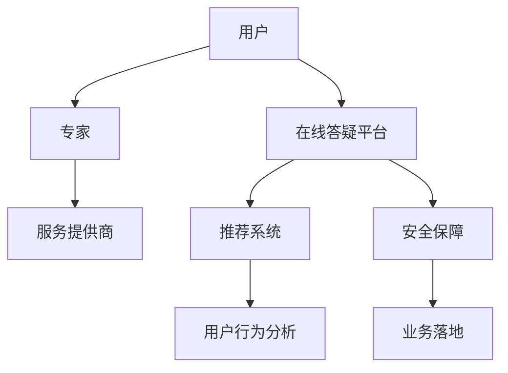

                 

# 如何打造知识付费的在线答疑平台

> 关键词：知识付费,在线答疑平台,技术架构,推荐系统,用户行为分析,安全保障,业务落地

## 1. 背景介绍

### 1.1 问题由来
随着互联网的发展，知识付费市场蓬勃兴起。在线答疑平台作为知识付费的重要形式，深受广大用户的喜爱。与传统的线下咨询相比，在线答疑平台打破了时间和空间的限制，提供便捷、高效、高质量的咨询服务。

然而，当前的在线答疑平台普遍存在一些问题：

- 用户获取优质答疑的难度较大，存在信息不对称和匹配困难的问题。
- 用户缺乏有效的反馈机制，难以持续优化答疑体验。
- 平台无法保障用户隐私和数据安全，存在潜在的隐私泄露风险。

为了解决上述问题，本文将从技术架构、推荐系统、用户行为分析、安全保障等方面出发，探讨如何打造高品质的在线答疑平台。

## 2. 核心概念与联系

### 2.1 核心概念概述

为更好地理解在线答疑平台的建设，本节将介绍几个密切相关的核心概念：

- 知识付费：基于互联网平台的付费知识获取方式，用户通过购买服务，获得专业的咨询、学习、技能培训等服务。

- 在线答疑平台：利用互联网技术，为用户提供随时、随地、随需的咨询服务。答疑平台通常由用户、专家、服务提供商三方构成。

- 技术架构：指系统构建时的技术组件选择、数据流、通信方式等架构设计，是确保系统性能、稳定性、可扩展性的基础。

- 推荐系统：通过用户行为数据和专家标签等，为用户推荐最合适的答疑专家和服务内容。推荐系统的准确度直接影响平台的用户体验。

- 用户行为分析：利用数据分析技术，挖掘用户的搜索行为、咨询偏好、评价反馈等信息，为系统优化提供依据。

- 安全保障：指通过技术手段保障用户隐私、数据安全，防止数据泄露、攻击等安全问题。

- 业务落地：指将技术成果转化为实际业务应用，解决实际问题，提升平台的用户黏性和市场竞争力。

这些核心概念之间的逻辑关系可以通过以下Mermaid流程图来展示：



这个流程图展示出在线答疑平台的各个组成部分及其相互关系：

1. 用户通过平台与专家进行交流。
2. 专家为用户提供咨询服务。
3. 服务提供商提供技术支持。
4. 推荐系统根据用户偏好推荐专家和服务。
5. 用户行为分析提供数据支持，指导平台优化。
6. 安全保障确保用户和数据安全。
7. 业务落地将技术成果转化为实际应用。

## 3. 核心算法原理 & 具体操作步骤

### 3.1 算法原理概述

在线答疑平台的核心算法主要包括推荐系统、用户行为分析以及安全保障。

- **推荐系统**：利用机器学习算法，根据用户历史行为数据和专家标签，计算相似度，为用户推荐最合适的答疑专家和服务内容。

- **用户行为分析**：通过分析用户的搜索历史、咨询记录、评价反馈等信息，了解用户需求和偏好，优化推荐算法，提升用户体验。

- **安全保障**：采用数据加密、访问控制、异常检测等技术，防止数据泄露、攻击等安全问题。

### 3.2 算法步骤详解

#### 3.2.1 推荐系统

1. **数据收集**：收集用户的历史查询记录、浏览历史、评分数据、评价反馈等。
2. **专家标签**：通过人工标注或自动化算法提取专家标签，如专业领域、认证资质、用户评价等。
3. **特征构建**：将用户和专家数据映射为向量，提取特征，如用户的兴趣标签、专家的擅长领域等。
4. **相似度计算**：使用余弦相似度、协同过滤等算法，计算用户与专家之间的相似度。
5. **推荐排序**：根据相似度排序，将最匹配的专家和服务推荐给用户。

#### 3.2.2 用户行为分析

1. **行为数据收集**：收集用户的行为数据，包括搜索记录、浏览时长、评分、评价等。
2. **行为建模**：使用协同过滤、关联规则、序列模型等方法，构建用户行为模型。
3. **用户画像**：根据行为数据，刻画用户画像，如兴趣爱好、咨询偏好等。
4. **画像更新**：定期更新用户画像，反映最新行为变化。
5. **推荐优化**：根据用户画像，优化推荐算法，提升推荐精准度。

#### 3.2.3 安全保障

1. **数据加密**：采用AES、RSA等加密算法，对用户数据进行加密存储。
2. **访问控制**：使用OAuth、JWT等技术，限制对敏感数据的访问权限。
3. **异常检测**：利用异常检测算法，检测数据访问、操作等异常行为，防止攻击。
4. **隐私保护**：采用匿名化、去标识化等技术，保护用户隐私。

### 3.3 算法优缺点

#### 3.3.1 推荐系统

**优点**：

- 能够有效解决信息不对称问题，提升用户满意度和留存率。
- 提升平台匹配效率，降低人工匹配成本。

**缺点**：

- 需要大量数据支持，存在冷启动问题。
- 推荐算法复杂，对技术要求高。

#### 3.3.2 用户行为分析

**优点**：

- 精准识别用户需求，优化推荐服务。
- 提升用户体验，增加平台黏性。

**缺点**：

- 数据隐私问题，需要严格遵守相关法律法规。
- 数据量庞大，计算复杂。

#### 3.3.3 安全保障

**优点**：

- 保障用户隐私和数据安全，防止数据泄露和攻击。
- 提升平台可信度，增加用户信任。

**缺点**：

- 技术复杂，需要专业团队支持。
- 安全漏洞可能带来潜在风险。

## 4. 数学模型和公式 & 详细讲解 & 举例说明

### 4.1 数学模型构建

在线答疑平台的核心算法基于机器学习和数据分析技术，以下对核心算法涉及的数学模型进行详细构建。

#### 4.1.1 推荐系统

推荐系统涉及的数学模型主要包括协同过滤和内容推荐算法。

- **协同过滤**：基于用户行为数据的相似度计算，推荐相似用户喜欢的专家和服务。公式如下：

$$
\text{similarity}(u,v) = \text{similarity}(X_u, X_v) = \frac{X_u \cdot X_v}{\|X_u\| \cdot \|X_v\|}
$$

其中，$X_u$ 和 $X_v$ 分别为用户 $u$ 和 $v$ 的兴趣向量，$\cdot$ 为点积，$\|X_u\|$ 为向量的模长。

- **内容推荐**：基于专家标签和用户兴趣标签的相似度计算，推荐最合适的专家和服务。公式如下：

$$
\text{similarity}(u,e) = \frac{w_e^T X_u}{\|w_e\| \cdot \|X_u\|}
$$

其中，$w_e$ 为专家 $e$ 的标签向量，$X_u$ 为用户 $u$ 的兴趣向量。

#### 4.1.2 用户行为分析

用户行为分析涉及的数学模型包括协同过滤、关联规则和序列模型等。

- **协同过滤**：利用用户行为数据计算相似度，推荐相似用户喜欢的专家和服务。公式与协同过滤相同。

- **关联规则**：通过挖掘用户行为数据中的关联规则，发现用户的兴趣模式。公式如下：

$$
\text{Support}(\{A, B\}) = \frac{\text{Number of Transactions}(A \cup B)}{\text{Total Number of Transactions}}
$$

其中，$\text{Support}(\{A, B\})$ 为关联规则 $\{A, B\}$ 的支持度，$\text{Number of Transactions}(A \cup B)$ 为包含 $\{A, B\}$ 的频繁交易数量，$\text{Total Number of Transactions}$ 为总交易数量。

- **序列模型**：基于用户行为序列，预测用户未来的行为。公式如下：

$$
\text{Next}(t) = \text{Next}(t-1) \cdot \mathbf{W} + \mathbf{b}
$$

其中，$\text{Next}(t)$ 为第 $t$ 时刻的行为预测值，$\text{Next}(t-1)$ 为上一时刻的行为值，$\mathbf{W}$ 和 $\mathbf{b}$ 分别为权重矩阵和偏置向量。

#### 4.1.3 安全保障

安全保障涉及的数学模型包括数据加密、访问控制和异常检测等。

- **数据加密**：采用AES、RSA等加密算法，对数据进行加密存储和传输。公式如下：

$$
\text{EncryptedData} = \text{Encrypt}(plaintext, key)
$$

其中，$\text{EncryptedData}$ 为加密后的数据，$\text{Encrypt}$ 为加密算法，$plaintext$ 为明文数据，$key$ 为加密密钥。

- **访问控制**：使用OAuth、JWT等技术，限制对敏感数据的访问权限。公式如下：

$$
\text{AccessPermitted} = \text{OAuth}(token, permission)
$$

其中，$\text{AccessPermitted}$ 为访问是否允许，$\text{OAuth}$ 为OAuth验证算法，$token$ 为OAuth令牌，$permission$ 为访问权限。

- **异常检测**：利用异常检测算法，检测数据访问、操作等异常行为。公式如下：

$$
\text{AnomalyScore} = \text{AnomalyDetection}(activity)
$$

其中，$\text{AnomalyScore}$ 为异常得分，$\text{AnomalyDetection}$ 为异常检测算法，$activity$ 为行为数据。

### 4.2 公式推导过程

#### 4.2.1 推荐系统

推荐系统的核心在于计算用户和专家之间的相似度，以下推导协同过滤和内容推荐算法的公式。

- **协同过滤**：

$$
\text{similarity}(u,v) = \frac{X_u \cdot X_v}{\|X_u\| \cdot \|X_v\|}
$$

其中，$X_u$ 和 $X_v$ 分别为用户 $u$ 和 $v$ 的兴趣向量，$\cdot$ 为点积，$\|X_u\|$ 为向量的模长。

- **内容推荐**：

$$
\text{similarity}(u,e) = \frac{w_e^T X_u}{\|w_e\| \cdot \|X_u\|}
$$

其中，$w_e$ 为专家 $e$ 的标签向量，$X_u$ 为用户 $u$ 的兴趣向量。

#### 4.2.2 用户行为分析

用户行为分析涉及协同过滤、关联规则和序列模型，以下推导公式。

- **协同过滤**：

$$
\text{similarity}(u,v) = \frac{X_u \cdot X_v}{\|X_u\| \cdot \|X_v\|}
$$

其中，$X_u$ 和 $X_v$ 分别为用户 $u$ 和 $v$ 的兴趣向量，$\cdot$ 为点积，$\|X_u\|$ 为向量的模长。

- **关联规则**：

$$
\text{Support}(\{A, B\}) = \frac{\text{Number of Transactions}(A \cup B)}{\text{Total Number of Transactions}}
$$

其中，$\text{Support}(\{A, B\})$ 为关联规则 $\{A, B\}$ 的支持度，$\text{Number of Transactions}(A \cup B)$ 为包含 $\{A, B\}$ 的频繁交易数量，$\text{Total Number of Transactions}$ 为总交易数量。

- **序列模型**：

$$
\text{Next}(t) = \text{Next}(t-1) \cdot \mathbf{W} + \mathbf{b}
$$

其中，$\text{Next}(t)$ 为第 $t$ 时刻的行为预测值，$\text{Next}(t-1)$ 为上一时刻的行为值，$\mathbf{W}$ 和 $\mathbf{b}$ 分别为权重矩阵和偏置向量。

#### 4.2.3 安全保障

安全保障涉及数据加密、访问控制和异常检测，以下推导公式。

- **数据加密**：

$$
\text{EncryptedData} = \text{Encrypt}(plaintext, key)
$$

其中，$\text{EncryptedData}$ 为加密后的数据，$\text{Encrypt}$ 为加密算法，$plaintext$ 为明文数据，$key$ 为加密密钥。

- **访问控制**：

$$
\text{AccessPermitted} = \text{OAuth}(token, permission)
$$

其中，$\text{AccessPermitted}$ 为访问是否允许，$\text{OAuth}$ 为OAuth验证算法，$token$ 为OAuth令牌，$permission$ 为访问权限。

- **异常检测**：

$$
\text{AnomalyScore} = \text{AnomalyDetection}(activity)
$$

其中，$\text{AnomalyScore}$ 为异常得分，$\text{AnomalyDetection}$ 为异常检测算法，$activity$ 为行为数据。

### 4.3 案例分析与讲解

#### 4.3.1 推荐系统案例

某在线答疑平台使用协同过滤推荐算法，推荐用户感兴趣的内容。平台收集了用户的历史查询记录和浏览历史，计算用户之间的相似度，并推荐相似用户喜欢的专家和服务。具体步骤如下：

1. 收集用户的历史查询记录和浏览历史，构造用户行为向量 $X_u$。
2. 收集专家标签，构造专家标签向量 $w_e$。
3. 计算用户与专家的相似度，排序并推荐最匹配的专家和服务。

#### 4.3.2 用户行为分析案例

某在线答疑平台使用关联规则算法，发现用户的兴趣模式。平台收集了用户的搜索历史和咨询记录，使用Apriori算法发现频繁出现的查询组合，挖掘出用户的兴趣模式。具体步骤如下：

1. 收集用户的搜索历史和咨询记录，构造用户行为数据集。
2. 使用Apriori算法发现频繁出现的查询组合，生成关联规则。
3. 根据关联规则，发现用户的兴趣模式，并优化推荐算法。

#### 4.3.3 安全保障案例

某在线答疑平台使用OAuth访问控制，保护用户数据安全。平台使用OAuth 2.0协议，通过令牌验证访问用户数据。具体步骤如下：

1. 用户登录平台，通过OAuth 2.0协议获取令牌。
2. 平台验证令牌，根据权限返回访问结果。
3. 定期检查令牌是否过期，防止非法访问。

## 5. 项目实践：代码实例和详细解释说明

### 5.1 开发环境搭建

在进行项目开发前，需要准备好开发环境。以下是使用Python进行Flask开发的环境配置流程：

1. 安装Anaconda：从官网下载并安装Anaconda，用于创建独立的Python环境。

2. 创建并激活虚拟环境：
```bash
conda create -n flask-env python=3.8 
conda activate flask-env
```

3. 安装Flask：
```bash
pip install Flask
```

4. 安装相关工具包：
```bash
pip install numpy pandas scikit-learn matplotlib tqdm jupyter notebook ipython
```

完成上述步骤后，即可在`flask-env`环境中开始项目开发。

### 5.2 源代码详细实现

这里我们以推荐系统为例，给出使用Flask框架对推荐系统进行开发的PyTorch代码实现。

首先，定义推荐系统的数据处理函数：

```python
import pandas as pd
from sklearn.neighbors import NearestNeighbors
from sklearn.metrics.pairwise import cosine_similarity

def load_data(file_path):
    data = pd.read_csv(file_path)
    return data

def preprocess_data(data):
    # 处理缺失值
    data = data.dropna()
    # 特征编码
    data = pd.get_dummies(data, columns=['gender', 'age'])
    return data

def train_model(data):
    # 训练模型
    X = data[['gender', 'age']]
    y = data['interest']
    model = NearestNeighbors(n_neighbors=5)
    model.fit(X, y)
    return model

def predict(user_data, model):
    # 预测推荐结果
    user_features = user_data.drop(['gender', 'age', 'interest'], axis=1)
    user_features = pd.get_dummies(user_features, columns=['gender', 'age'])
    X = user_features
    y = user_data['interest']
    scores = model.kneighbors(X, return_distance=False)
    return scores

# 数据处理函数
data = load_data('data.csv')
data = preprocess_data(data)
model = train_model(data)
```

然后，定义推荐接口：

```python
from flask import Flask, request, jsonify

app = Flask(__name__)

@app.route('/recommend', methods=['POST'])
def recommend():
    user_data = request.get_json(force=True)
    scores = predict(user_data, model)
    results = data.loc[data['user_id'].isin(scores)]
    return jsonify(results)

if __name__ == '__main__':
    app.run(debug=True)
```

最后，启动Flask服务器：

```bash
python app.py
```

在运行后，可以通过`http://127.0.0.1:5000/recommend`接口，使用POST方法提交用户数据，获取推荐结果。

### 5.3 代码解读与分析

让我们再详细解读一下关键代码的实现细节：

**load_data函数**：
- 加载推荐系统所需的数据文件，返回DataFrame对象。

**preprocess_data函数**：
- 处理缺失值，并对性别、年龄等分类特征进行独热编码。

**train_model函数**：
- 训练基于欧式距离的近邻模型，用于计算用户之间的相似度。

**predict函数**：
- 预测用户推荐结果，返回与用户最匹配的专家和服务。

**recommend接口**：
- 定义Flask接口，接收用户数据，返回推荐结果。

可以看到，Flask框架使得推荐系统的开发变得简洁高效。开发者可以将更多精力放在模型实现和数据处理上，而不必过多关注Web应用的细节。

当然，实际的推荐系统还需要考虑更多因素，如冷启动、多样性控制、推荐结果的动态更新等。但核心的推荐范式基本与此类似。

## 6. 实际应用场景

### 6.1 智能客服系统

基于在线答疑平台的智能客服系统可以大大提升客户服务效率。传统的客服系统需要配备大量人力，高峰期响应缓慢，且无法提供全天候服务。而使用智能客服系统，可以7x24小时不间断服务，快速响应客户咨询，提升客户满意度。

在技术实现上，可以结合推荐系统，根据用户的历史查询记录，推荐最匹配的客服人员和常见问题解答。对于复杂的咨询，系统可以转接给人工客服，确保客户问题得到快速解决。

### 6.2 金融咨询平台

在线答疑平台在金融咨询领域同样具有广泛应用。金融机构需要提供快速、准确、专业的咨询服务，帮助客户解决问题。基于在线答疑平台的金融咨询平台，可以提供实时咨询、智能推荐等多样化服务，提升客户体验。

平台可以结合推荐系统和用户行为分析，为用户推荐最适合的金融专家和理财建议。同时，平台还可以集成金融数据分析工具，为用户提供实时行情、市场动态等相关信息，帮助客户做出更明智的投资决策。

### 6.3 教育辅导系统

在线答疑平台在教育领域也有着广泛的应用。学生在学习过程中会遇到各种问题，需要及时解答。基于在线答疑平台的教育辅导系统，可以提供全天候的学习支持，帮助学生解决学习难题。

平台可以结合推荐系统，根据学生的学习历史和行为数据，推荐最适合的辅导专家和练习题。同时，平台还可以集成学习数据分析工具，帮助学生分析学习进度，制定个性化学习计划，提升学习效果。

### 6.4 未来应用展望

随着在线答疑平台的发展，未来的应用场景将更加广泛。以下是一些可能的应用方向：

- 医疗咨询平台：结合医疗知识库和专家标签，提供专业的医疗咨询和健康建议。
- 法律咨询平台：提供法律咨询、合同审查等法律服务，提升法律咨询效率。
- 个人助理平台：结合推荐系统和知识图谱，为用户提供个性化的生活助手服务，如日程管理、生活建议等。
- 企业培训平台：结合专家知识库和用户行为分析，为企业员工提供个性化的培训课程和职业发展规划。

总之，在线答疑平台凭借其灵活、高效、个性化的特点，必将在更多领域得到应用，为各行各业带来便利和效率提升。

## 7. 工具和资源推荐

### 7.1 学习资源推荐

为了帮助开发者掌握在线答疑平台的技术架构和推荐系统，这里推荐一些优质的学习资源：

1. 《推荐系统实践》一书：系统介绍了推荐系统的原理和实现方法，涵盖协同过滤、内容推荐、知识图谱等经典算法。

2. Coursera《推荐系统》课程：由斯坦福大学开设的推荐系统课程，讲解推荐系统的理论基础和实际应用。

3. Kaggle推荐系统竞赛：通过参加Kaggle竞赛，实战练习推荐算法，提升实践能力。

4. GitHub推荐系统开源项目：参考开源项目代码，学习推荐系统的实际应用。

通过对这些资源的学习实践，相信你一定能够掌握在线答疑平台的技术架构和推荐系统，并将这些技术应用到实际项目中。

### 7.2 开发工具推荐

高效的开发离不开优秀的工具支持。以下是几款用于在线答疑平台开发的常用工具：

1. Flask：轻量级Web框架，适合快速开发小规模应用。

2. PyTorch：基于Python的深度学习框架，支持高效的矩阵运算和模型训练。

3. TensorFlow：由Google主导的深度学习框架，支持分布式训练和模型部署。

4. Scikit-learn：Python的机器学习库，提供丰富的分类、聚类、回归等算法。

5. Pandas：Python的数据处理库，支持快速、灵活的数据分析。

6. Jupyter Notebook：交互式的编程环境，支持代码编写、数据可视化、报告生成等功能。

合理利用这些工具，可以显著提升在线答疑平台的开发效率，加快创新迭代的步伐。

### 7.3 相关论文推荐

在线答疑平台的发展源于学界的持续研究。以下是几篇奠基性的相关论文，推荐阅读：

1. "A Survey of Recent Trends in Recommendation Systems"：综述推荐系统的发展历程和前沿技术。

2. "Collaborative Filtering for Implicit Feedback Datasets"：介绍协同过滤算法的原理和实现方法。

3. "Apriori Algorithms for Market Basket Analysis"：介绍关联规则算法的原理和实现方法。

4. "Sequence Models"：介绍序列模型的原理和实现方法。

5. "Authentication and Access Control Technologies"：介绍OAuth和JWT等访问控制技术的原理和实现方法。

这些论文代表了大语言模型微调技术的最新进展，通过学习这些前沿成果，可以帮助研究者把握学科前进方向，激发更多的创新灵感。

## 8. 总结：未来发展趋势与挑战

### 8.1 总结

本文对在线答疑平台的建设进行了全面系统的介绍。首先阐述了在线答疑平台的研究背景和应用前景，明确了推荐系统、用户行为分析和安全保障的核心技术。其次，从算法原理到具体操作步骤，详细讲解了在线答疑平台的关键技术，给出了具体的代码实现和分析。最后，探讨了在线答疑平台的实际应用场景和未来发展趋势，为开发人员提供了技术参考和实践指导。

通过本文的系统梳理，可以看到，在线答疑平台的技术架构设计复杂，涉及多种机器学习和数据分析技术，但核心的推荐范式基本与此类似。掌握这些核心技术，将为开发人员提供坚实的技术基础。

### 8.2 未来发展趋势

展望未来，在线答疑平台的发展趋势如下：

1. 推荐系统将更加个性化和高效。基于用户行为数据的深度学习和强化学习，将提升推荐精准度和用户满意度。

2. 安全保障技术将更加严密和智能。结合人工智能和大数据分析，构建全面的安全防护体系，防范潜在风险。

3. 用户行为分析将更加全面和深入。结合自然语言处理和图像识别技术，提升用户画像的全面性和准确性，优化推荐算法。

4. 跨平台、跨设备的应用将更加普及。结合移动应用和智能家居等设备，构建无缝的用户体验。

5. 数据驱动的智能决策将更加普及。结合知识图谱和专家系统，提升智能决策的精准度和可靠性。

6. 平台的多样化服务将更加丰富。结合其他智能应用，如医疗、法律、教育等，构建多领域的服务生态。

以上趋势凸显了在线答疑平台的广阔前景。这些方向的探索发展，必将进一步提升在线答疑平台的性能和应用范围，为各行各业带来便利和效率提升。

### 8.3 面临的挑战

尽管在线答疑平台已经取得了显著成就，但在迈向更加智能化、普适化应用的过程中，它仍面临诸多挑战：

1. 数据隐私问题。在线答疑平台涉及大量用户隐私数据，需要严格遵守相关法律法规，防止数据泄露和滥用。

2. 推荐算法复杂。推荐系统需要处理海量数据，计算复杂，难以在大规模系统中高效运行。

3. 安全防护难度。在线答疑平台面临多方面的安全威胁，需要持续优化安全防护技术，保障用户数据安全。

4. 用户体验不足。平台需要不断优化用户界面和交互体验，提升用户体验，增加用户黏性。

5. 技术资源不足。平台开发和运营需要大量技术资源，如高性能计算设备、数据存储等，增加了平台的运营成本。

6. 市场竞争激烈。在线答疑平台面临激烈的市场竞争，需要不断创新和优化，提升竞争力。

### 8.4 研究展望

面对在线答疑平台所面临的挑战，未来的研究需要在以下几个方面寻求新的突破：

1. 探索无监督和半监督推荐方法。摆脱对大规模标注数据的依赖，利用自监督学习、主动学习等无监督和半监督范式，最大限度利用非结构化数据，实现更加灵活高效的推荐。

2. 研究参数高效和计算高效的推荐算法。开发更加参数高效的推荐算法，在固定大部分推荐参数的同时，只更新极少量的任务相关参数。同时优化推荐模型的计算图，减少前向传播和反向传播的资源消耗，实现更加轻量级、实时性的部署。

3. 结合因果分析和博弈论工具。将因果分析方法引入推荐模型，识别出模型决策的关键特征，增强推荐结果的因果性和逻辑性。借助博弈论工具刻画人机交互过程，主动探索并规避模型的脆弱点，提高系统稳定性。

4. 纳入伦理道德约束。在推荐系统目标中引入伦理导向的评估指标，过滤和惩罚有害的推荐内容，确保推荐结果符合人类价值观和伦理道德。

这些研究方向的探索，必将引领在线答疑平台技术迈向更高的台阶，为构建安全、可靠、可解释、可控的智能系统铺平道路。面向未来，在线答疑平台需要与其他人工智能技术进行更深入的融合，如知识表示、因果推理、强化学习等，多路径协同发力，共同推动自然语言理解和智能交互系统的进步。

## 9. 附录：常见问题与解答

**Q1：在线答疑平台的推荐系统如何保证准确性？**

A: 在线答疑平台的推荐系统主要通过协同过滤、内容推荐和用户行为分析等算法实现推荐。保证推荐系统准确性的关键在于数据的质量和算法的优化。

1. **数据质量**：收集高质量的用户行为数据和专家标签，避免噪声和偏差。
2. **算法优化**：采用先进的推荐算法，如协同过滤、基于内容的推荐、深度学习等，不断优化推荐模型。
3. **多模态融合**：结合文本、图片、语音等多模态信息，提升推荐精准度。
4. **动态更新**：定期更新推荐算法，及时反映用户行为变化。

**Q2：在线答疑平台如何保障用户隐私？**

A: 在线答疑平台需要严格保障用户隐私和数据安全，以下是一些具体措施：

1. **数据加密**：使用AES、RSA等加密算法，对用户数据进行加密存储和传输。
2. **访问控制**：使用OAuth、JWT等技术，限制对敏感数据的访问权限。
3. **匿名化处理**：对用户数据进行匿名化处理，防止数据泄露。
4. **审计机制**：建立数据访问日志，定期审计数据使用情况，发现并处理潜在风险。

**Q3：在线答疑平台如何提升用户体验？**

A: 在线答疑平台需要不断优化用户体验，提升用户满意度和留存率，以下是一些具体措施：

1. **推荐系统优化**：利用用户行为数据分析，提升推荐精准度，增加用户黏性。
2. **界面设计**：设计简洁、美观、易用的用户界面，提升用户体验。
3. **互动体验**：增加用户互动，如即时聊天、实时反馈等，提升用户参与度。
4. **多渠道服务**：支持多种终端设备，如PC、手机、智能家居等，提供无缝的用户体验。

**Q4：在线答疑平台如何提升安全性？**

A: 在线答疑平台需要建立全面的安全防护体系，以下是一些具体措施：

1. **数据加密**：使用AES、RSA等加密算法，对用户数据进行加密存储和传输。
2. **访问控制**：使用OAuth、JWT等技术，限制对敏感数据的访问权限。
3. **异常检测**：利用异常检测算法，检测数据访问、操作等异常行为，防止攻击。
4. **审计机制**：建立数据访问日志，定期审计数据使用情况，发现并处理潜在风险。

**Q5：在线答疑平台如何构建多领域服务生态？**

A: 在线答疑平台可以通过以下方式构建多领域服务生态：

1. **跨平台集成**：集成其他智能应用，如医疗、法律、教育等，提供多领域的服务。
2. **专家知识库**：构建专家知识库，吸引和培养专业领域的专家，提升服务质量。
3. **用户画像**：结合自然语言处理和图像识别技术，构建全面的用户画像，个性化推荐服务。
4. **用户体验优化**：优化用户界面和交互体验，提升用户体验，增加用户黏性。

通过构建多领域服务生态，在线答疑平台可以提供更加丰富和全面的服务，满足不同领域用户的需求，提升平台的市场竞争力。

---

作者：禅与计算机程序设计艺术 / Zen and the Art of Computer Programming

