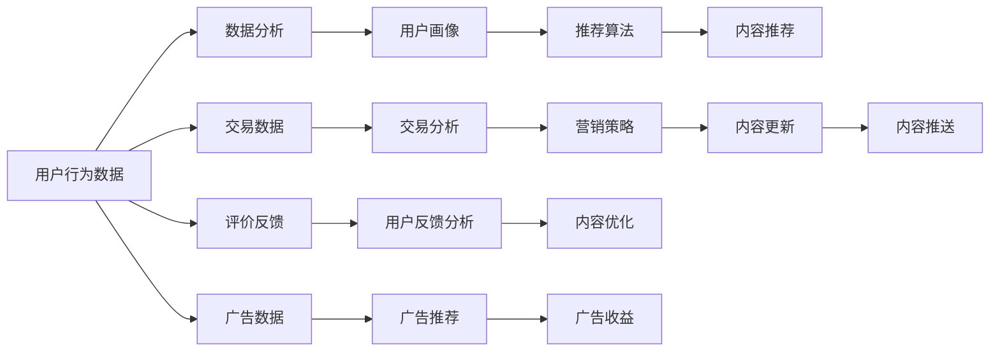

                 

# 如何打造知识付费的微信小程序

## 1. 背景介绍

### 1.1 问题由来
随着移动互联网的发展，知识付费成为一种新的消费模式，市场规模持续扩大。用户对于高效、便捷的学习方式有巨大需求，而传统的视频、音频内容形式虽然丰富，但在碎片化的时间段内难以维持学习效果。相比之下，精炼的文本形式更为适合用户快速浏览和掌握知识点。因此，在知识付费领域，微信小程序凭借其轻量级、高频率访问等特性，成为一款极具潜力的学习工具。

本文将探讨如何通过微信小程序构建一个知识付费平台，详细阐述平台设计思路和技术实现。借助微信小程序的便捷性和在微信生态中的先天优势，用户能够随时随地访问学习资源，实现知识的高效传递。

### 1.2 问题核心关键点
打造知识付费小程序的关键点在于：
- 平台内容设计：如何设计合理的内容体系，覆盖用户的学习需求。
- 技术实现：如何用最先进的技术架构搭建一个稳定可靠的小程序，保证用户的学习体验。
- 用户体验：如何打造一个用户友好、界面美观的小程序，使用户愿意持续使用。
- 运营模式：如何制定合理的定价策略和激励机制，保证平台盈利和用户满意度。

通过全面剖析这些核心关键点，本文旨在为读者提供详尽的指南，指导其实现一个完整、高效、可持续的知识付费小程序。

## 2. 核心概念与联系

### 2.1 核心概念概述
- **知识付费**：指用户支付一定费用，获取特定知识或信息服务。平台通常提供丰富的课程、书籍、论文等资源，用户可以按需选择和学习。
- **微信小程序**：一种基于微信平台的应用程序，用户在微信中可以直接访问，无需下载和安装，支持富文本、图片、视频等多媒体内容展示。
- **推荐算法**：利用机器学习技术，根据用户行为和偏好，动态推荐相关内容，提升用户体验。
- **支付集成**：通过第三方支付平台，如微信支付，实现线上支付功能，方便用户完成交易。
- **数据分析**：使用大数据分析技术，对用户行为数据进行挖掘和分析，辅助内容推荐和营销策略制定。

### 2.2 核心概念原理和架构的 Mermaid 流程图


这个流程图展示了知识付费小程序的多个关键组件及其相互关系。其中，用户行为数据经过数据分析生成用户画像，并通过推荐算法生成内容推荐；交易数据用于分析用户购买行为，指导营销策略的制定；评价反馈和用户画像可以用于内容优化，广告数据用于辅助广告推荐。

## 3. 核心算法原理 & 具体操作步骤

### 3.1 算法原理概述
知识付费小程序的核心算法包括推荐算法、支付集成和数据分析等。这些算法共同构成了一个高效、互动的学习平台，保证了用户体验的流畅性和个性化。

- **推荐算法**：基于协同过滤、内容过滤和混合过滤等算法，对用户行为和内容特征进行建模，实现个性化内容推荐。
- **支付集成**：通过微信支付等第三方支付平台，实现安全、便捷的支付功能，满足用户购买需求。
- **数据分析**：通过大数据分析技术，挖掘用户行为和内容访问规律，辅助推荐算法和营销策略的优化。

### 3.2 算法步骤详解
以下是各个核心算法步骤的详细讲解：

#### 推荐算法
1. **用户行为数据收集**：在小程序中记录用户浏览、点击、购买等行为，形成数据集。
2. **用户画像构建**：通过K-means聚类、TF-IDF等方法，将用户行为数据转化为用户画像。
3. **内容特征提取**：利用自然语言处理（NLP）技术，提取课程、书籍等内容的关键词和标签。
4. **协同过滤**：根据用户行为和内容特征，利用余弦相似度等方法，计算用户与内容的相似度。
5. **内容推荐**：基于协同过滤结果，选择相关度高的内容进行推荐。

#### 支付集成
1. **选择支付平台**：选择微信支付、支付宝等支付平台，并集成API接口。
2. **接口封装**：封装支付接口，并提供前端调用方法。
3. **交易数据记录**：在小程序中记录交易数据，包括订单号、金额、支付方式等。
4. **交易分析**：对交易数据进行分析，了解用户购买行为和趋势。

#### 数据分析
1. **数据收集**：收集用户行为数据、交易数据和评价反馈等。
2. **数据清洗**：清洗数据，去除异常值和噪音。
3. **数据建模**：使用回归分析、时间序列预测等方法，建模用户行为和内容访问规律。
4. **结果应用**：将分析结果应用于内容推荐、营销策略和用户画像优化。

### 3.3 算法优缺点
- **推荐算法**：优点在于能够实现个性化推荐，提升用户体验；缺点在于算法复杂，需要大量标注数据和计算资源。
- **支付集成**：优点在于方便快捷，兼容性好；缺点在于安全性需保障，需防范欺诈风险。
- **数据分析**：优点在于可以辅助决策，提升运营效率；缺点在于数据隐私需保护，需符合法律法规。

### 3.4 算法应用领域
推荐算法广泛应用于电商、音乐、视频等领域，为用户提供个性化的内容推荐；支付集成是现代互联网应用的基础，广泛应用于各类线上交易；数据分析在金融、医疗、电商等多个领域有广泛应用，辅助决策和优化运营。

## 4. 数学模型和公式 & 详细讲解

### 4.1 数学模型构建

构建推荐算法的数学模型通常包括用户-物品评分矩阵、用户画像和内容特征矩阵等。设用户集为 $U$，物品集为 $I$，用户对物品的评分矩阵为 $R \in \mathbb{R}^{m \times n}$，其中 $m$ 为物品数，$n$ 为用户数。用户画像表示为 $\mathbf{u} \in \mathbb{R}^d$，内容特征表示为 $\mathbf{v} \in \mathbb{R}^d$，其中 $d$ 为特征维度。

### 4.2 公式推导过程

#### 协同过滤推荐算法
协同过滤算法基于用户-物品评分矩阵，通过计算用户与物品之间的相似度，推荐用户可能感兴趣的物品。其公式如下：

$$
\hat{R}_{ui} = \frac{\sum_{j=1}^n R_{uj} \cdot \alpha(u_i, u_j)}{\sqrt{\sum_{j=1}^n \alpha(u_i, u_j)^2 + \epsilon}
$$

其中，$\alpha(u_i, u_j)$ 表示用户 $u_i$ 和用户 $u_j$ 之间的相似度，$\epsilon$ 为平滑因子。

#### 支付集成
微信支付接口的调用流程如下：

1. 用户点击支付按钮，小程序调用支付API。
2. API返回支付结果，小程序展示支付成功或失败信息。
3. 支付平台记录交易数据，向小程序发送通知。

### 4.3 案例分析与讲解

**案例：基于协同过滤的推荐算法**

某知识付费小程序在用户访问某一课程时，收集用户行为数据 $R_{ui}$，用户画像 $\mathbf{u}$，内容特征 $\mathbf{v}$。通过余弦相似度计算用户与课程之间的相似度，计算公式如下：

$$
\alpha(u_i, v_j) = \frac{\mathbf{u} \cdot \mathbf{v}_j}{\|\mathbf{u}\| \cdot \|\mathbf{v}_j\|}
$$

计算出相似度后，对每个课程的评分矩阵 $R_{uj}$ 进行加权平均，得到推荐评分 $\hat{R}_{ui}$，选择评分最高的课程进行推荐。

**案例：微信支付集成**

用户点击购买按钮，小程序调用微信支付API，发送订单信息。API返回支付结果，小程序展示支付成功或失败信息。支付平台记录交易数据，向小程序发送通知。小程序更新订单状态，完成交易流程。

## 5. 项目实践：代码实例和详细解释说明

### 5.1 开发环境搭建

1. 安装Node.js和npm。
2. 安装微信小程序开发工具（如微信Web开发者工具）。
3. 配置微信小程序开发环境，进行项目初始化。
4. 安装微信小程序相关依赖库，如wxml、wxss、wxapi等。

### 5.2 源代码详细实现

**wxml**

```html
<view id="content">
  <block wx:for="{{items}}" wx:key="{{item.id}}" class="{{item.category}}">
    <view class="item">
      
      <view class="info">
        <text>{{item.title}}</text>
        <text>{{item.price}}</text>
      </view>
      <button bindtap="purchaseItem" data-item="{{item}}">购买</button>
    </view>
  </block>
</view>
```

**wxss**

```css
.item {
  display: flex;
  align-items: center;
  padding: 10px;
  border-bottom: 1px solid #eee;
}

.info {
  display: flex;
  flex-direction: column;
  margin-left: 10px;
}

.info .title {
  font-weight: bold;
  margin-bottom: 5px;
}

.info .price {
  font-size: 14px;
  color: #999;
}
```

**JavaScript**

```javascript
// 获取推荐课程列表
Page({
  data: {
    items: []
  },
  onLoad() {
    wx.request({
      url: '/api/recommend',
      success: (res) => {
        this.setData({
          items: res.data
        });
      }
    });
  },
  purchaseItem(e) {
    const item = e.detail.data;
    wx.request({
      url: '/api/purchase',
      data: {
        id: item.id
      },
      success: (res) => {
        wx.showToast({
          title: '购买成功！'
        });
      }
    });
  }
});
```

**api/recommend**

```javascript
const { getUserProfile, getItems } = require('../services');
module.exports = async function getRecommend(req, res) {
  const user = await getUserProfile(req);
  const items = await getItems(user);
  res.send(items);
};
```

### 5.3 代码解读与分析

**wxml**

- `block wx:for="{{items}}" wx:key="{{item.id}}" class="{{item.category}}"`：循环显示课程列表，根据类别分组。
- ``：显示课程图片。
- `view class="info"`：显示课程信息，包括标题和价格。
- `button bindtap="purchaseItem" data-item="{{item}}"`：绑定购买按钮的点击事件，传递课程信息。

**wxss**

- `.item`：课程列表项的样式。
- `.info`：课程信息样式。
- `.info .title`：课程标题样式。
- `.info .price`：课程价格样式。

**JavaScript**

- `getRecommend`：获取推荐课程列表。
- `purchaseItem`：处理购买逻辑。

## 6. 实际应用场景

### 6.1 场景一：课程推荐
用户登录小程序后，会显示个性化的课程推荐。根据用户浏览历史、评价记录等数据，推荐用户可能感兴趣的新课程。推荐算法可以采用协同过滤、内容过滤等方法，提升推荐效果。

**流程图**：


### 6.2 场景二：即时搜索
用户在小程序内可以即时搜索课程内容，快速获取相关资料。搜索功能结合自然语言处理技术，实现关键词匹配、相关性排序等功能，提升搜索效率。

### 6.3 场景三：互动讨论
用户可以在课程页面内进行互动讨论，分享学习心得，促进知识传播。讨论功能结合社区管理技术，提供用户互动平台，增加用户粘性。

### 6.4 场景四：个性化学习计划
用户根据自身学习需求，定制个性化学习计划。平台基于用户画像和推荐算法，推荐课程和学习路径，帮助用户高效学习。

## 7. 工具和资源推荐

### 7.1 学习资源推荐

1. **《微信小程序开发教程》**：详细介绍了微信小程序的开发流程和技术要点，适合初学者入门。
2. **《微信小程序官方文档》**：微信官方提供的开发文档，提供丰富的API和示例代码。
3. **《推荐算法原理与实现》**：讲解推荐算法的原理和实现细节，适合深入学习推荐技术。
4. **《机器学习实战》**：结合实际案例，讲解机器学习算法的应用，适合解决实际问题。
5. **《深度学习与Python》**：介绍深度学习技术和Python编程，适合快速上手深度学习项目。

### 7.2 开发工具推荐

1. **微信Web开发者工具**：集成开发环境，支持前端代码调试和测试。
2. **Visual Studio Code**：轻量级代码编辑器，支持多种语言和插件。
3. **Sublime Text**：高级文本编辑器，支持代码高亮和快速搜索。
4. **Postman**：HTTP请求调试工具，支持自动化测试和接口文档生成。

### 7.3 相关论文推荐

1. **《协同过滤推荐算法》**：介绍协同过滤算法的基本原理和应用，适合理解推荐算法的核心思想。
2. **《深度学习在推荐系统中的应用》**：讲解深度学习在推荐系统中的实现和效果，适合了解深度学习算法的应用。
3. **《基于深度学习的用户行为分析》**：介绍深度学习在用户行为分析中的应用，适合理解用户画像的构建和应用。

## 8. 总结：未来发展趋势与挑战

### 8.1 总结

本文介绍了如何通过微信小程序构建知识付费平台，涉及推荐算法、支付集成和数据分析等核心技术。通过详尽的实例和案例分析，展示了知识付费小程序的开发流程和技术实现。微信小程序的便捷性和在微信生态中的天然优势，为知识付费的推广和应用提供了强有力的支持。

### 8.2 未来发展趋势

未来，知识付费小程序将呈现以下几个发展趋势：

1. **智能化推荐**：结合深度学习和NLP技术，实现更加精准和个性化的内容推荐。
2. **多渠道分发**：通过微信、微博、抖音等平台，多渠道分发课程内容，扩大用户覆盖面。
3. **社区化互动**：构建知识社区，增加用户互动和讨论，提升用户粘性和参与度。
4. **个性化学习**：结合用户画像和学习计划，实现个性化的学习路径，提升学习效率。
5. **实时化更新**：实现内容的实时更新和迭代，保持课程的时效性和知识的前沿性。

### 8.3 面临的挑战

尽管知识付费小程序具有巨大的市场潜力，但在实际应用中仍面临以下挑战：

1. **内容版权问题**：课程内容涉及版权问题，需严格遵守相关法律法规。
2. **用户体验优化**：小程序的UI设计和用户体验需进一步优化，提升用户满意度。
3. **安全性保障**：支付安全和数据安全需高度重视，防止欺诈和信息泄露。
4. **内容审核**：需建立有效的内容审核机制，防止不良信息和内容传播。
5. **营销策略优化**：需不断优化营销策略，提高用户转化率和平台盈利能力。

### 8.4 研究展望

未来，知识付费小程序的研究将从以下几个方向进行探索：

1. **智能推荐算法**：结合深度学习和NLP技术，实现更加精准和个性化的内容推荐。
2. **多模态融合**：结合视觉、音频等多模态信息，丰富课程内容，提升用户体验。
3. **社区化互动**：构建知识社区，增加用户互动和讨论，提升用户粘性和参与度。
4. **个性化学习**：结合用户画像和学习计划，实现个性化的学习路径，提升学习效率。
5. **实时化更新**：实现内容的实时更新和迭代，保持课程的时效性和知识的前沿性。

综上所述，微信小程序作为一种新兴的学习工具，具有巨大的市场潜力和应用前景。结合推荐算法、支付集成和数据分析等核心技术，知识付费小程序有望成为用户获取知识的重要平台，推动学习方式的变革和社会的进步。

---

作者：禅与计算机程序设计艺术 / Zen and the Art of Computer Programming

