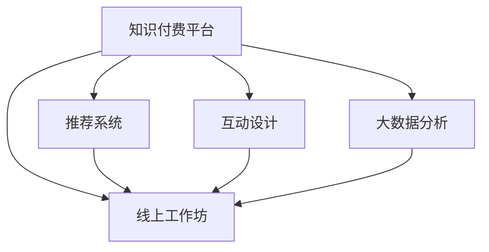

                 

# 如何打造知识付费的线上工作坊

> 关键词：知识付费, 线上工作坊, 人工智能, 技术教育, 平台构建, 数据驱动

## 1. 背景介绍

### 1.1 问题由来

在数字化、信息化快速发展的今天，知识付费已成为一种重要的信息获取和知识分享方式。在线教育、技术论坛、专业培训等平台层出不穷，满足了各类人群对高质量知识的需求。然而，随着内容供应的不断增加，如何高效地分发、推荐和引导用户消费，成为在线知识付费平台的最大挑战。

面对这一挑战，打造线上工作坊模式的知识付费平台成为一种创新尝试。线上工作坊以其高互动性、高参与度、高知识密度等特点，能够更好地吸引用户关注，提高学习效果。结合人工智能和大数据分析技术，该模式还能实现更精准的课程推荐和个性化学习路径规划，提升平台的用户粘性和活跃度。

### 1.2 问题核心关键点

线上工作坊模式的核心在于通过高互动和个性化推荐，提升知识付费平台的竞争力。其关键点包括：
- **内容制作**：高质量的课程内容是工作坊成功的基石。
- **推荐系统**：利用人工智能和大数据分析技术，实现课程的个性化推荐。
- **互动设计**：通过设计良好的互动环节，提升用户的参与度和满意度。
- **技术架构**：构建高效、稳定、可扩展的平台技术架构。
- **数据驱动**：通过大数据分析，实时监控和优化工作坊的效果。

本文将从这些关键点出发，深入探讨如何打造知识付费的线上工作坊。

## 2. 核心概念与联系

### 2.1 核心概念概述

为更好地理解线上工作坊的构建过程，本节将介绍几个关键概念：

- **知识付费平台**：以知识服务为主线的在线平台，通过付费模式向用户提供高质量的课程内容和学习资源。
- **线上工作坊**：一种线上课程形式，通过视频、直播、互动问答等方式，吸引用户参与学习，提升学习效果。
- **推荐系统**：利用人工智能技术，对用户行为进行分析和预测，实现内容的个性化推荐。
- **互动设计**：通过互动环节，如实时问答、小组讨论、项目实践等，提升用户的参与度和学习体验。
- **大数据分析**：对用户行为、课程数据等进行收集和分析，指导课程内容和推荐策略的优化。

这些概念之间的逻辑关系可以通过以下Mermaid流程图来展示：



这个流程图展示了几大核心概念之间的联系：

1. **知识付费平台**：提供线上工作坊的基础平台和资源。
2. **线上工作坊**：知识付费平台的特色应用，吸引用户参与并提高平台黏性。
3. **推荐系统**：辅助用户发现感兴趣的工作坊，提高平台的用户活跃度。
4. **互动设计**：增强用户参与感，提升学习效果。
5. **大数据分析**：实时监控和优化工作坊的效果，指导平台的改进。

## 3. 核心算法原理 & 具体操作步骤

### 3.1 算法原理概述

线上工作坊的成功构建，离不开高质量的课程内容、精准的个性化推荐和良好的用户体验。以下将从这三个方面介绍相关算法原理。

#### 3.1.1 内容制作

内容制作是线上工作坊的核心，包括课程的规划、设计、录制和发布。高质量的课程内容应具备以下特点：
- **专业性**：由领域内的专家或权威人士授课，保证内容的权威性和专业性。
- **互动性**：包含实时问答、小组讨论、项目实践等互动环节，提高用户的参与度。
- **知识性**：注重基础知识的讲授和实际应用，帮助用户掌握实用技能。

#### 3.1.2 个性化推荐

推荐系统是提高用户满意度的关键。通过分析用户的历史行为、兴趣偏好，实现课程的个性化推荐，具体算法原理如下：

**用户行为分析**：
- **浏览历史**：记录用户浏览过的课程、文章、视频等。
- **互动记录**：记录用户参与的互动环节，如问答、讨论、实践等。
- **购买记录**：记录用户的购买和消费行为。

**课程特征提取**：
- **课程内容**：课程的标题、简介、大纲、讲义等。
- **讲师信息**：讲师的专业背景、资质、授课风格等。
- **用户评价**：用户的课程评价、反馈和评分。

**推荐算法**：
- **协同过滤**：通过分析用户之间的相似度，推荐相似用户喜欢的课程。
- **内容过滤**：根据课程内容与用户兴趣的匹配度，推荐相关课程。
- **混合推荐**：结合协同过滤和内容过滤，实现更精准的推荐。

#### 3.1.3 互动设计

互动设计是提升用户参与度的重要手段。通过设计良好的互动环节，可以增强用户的学习体验和满意度。

**实时问答**：在课程直播或录播中，设置实时问答环节，讲师实时解答用户疑问，提高学习的即时性。

**小组讨论**：将用户分组讨论，分享观点和经验，增加互动性和参与感。

**项目实践**：通过项目实战，将理论知识转化为实践技能，增强学习的实用性。

### 3.2 算法步骤详解

线上工作坊的构建分为以下几个步骤：

**Step 1: 准备课程内容**
- 确定课程目标和主题，邀请专家授课。
- 设计课程大纲和互动环节，录制课程视频。

**Step 2: 用户行为分析**
- 收集用户的历史行为数据，如浏览、互动、购买记录。
- 对用户兴趣和行为进行分析和建模。

**Step 3: 构建推荐系统**
- 基于协同过滤和内容过滤算法，实现个性化推荐。
- 实时监控推荐效果，根据用户反馈进行优化。

**Step 4: 互动设计**
- 设计实时问答、小组讨论、项目实践等互动环节。
- 在课程中穿插互动环节，提升用户参与度。

**Step 5: 发布与反馈**
- 将课程发布到平台上，收集用户反馈和评价。
- 根据用户反馈优化课程内容和推荐策略。

### 3.3 算法优缺点

线上工作坊模式的优势在于其高互动性和个性化推荐，能够更好地吸引用户参与和提升学习效果。其缺点在于：
- **内容制作成本高**：高质量的课程内容制作成本较高，需要耗费大量时间和资源。
- **技术要求高**：推荐系统和互动设计需要复杂的算法和大数据处理，对平台的技术要求较高。
- **用户参与门槛高**：需要用户主动参与互动环节，部分用户可能缺乏积极性。

尽管存在这些局限性，但线上工作坊模式仍是大数据时代知识付费平台的重要创新方向，其通过高互动性和个性化推荐，能够显著提升用户的学习效果和平台的用户粘性。

### 3.4 算法应用领域

线上工作坊模式主要应用于以下领域：

- **在线教育**：如Coursera、Udemy等平台，通过线上工作坊模式提升课程质量和用户参与度。
- **技术培训**：如企业内训、软件开发、数据分析等领域，通过工作坊模式提高培训效果。
- **职业认证**：如PMP、CFA等职业认证考试，通过工作坊模式辅助用户备考。
- **兴趣课程**：如编程、音乐、艺术等兴趣领域，通过工作坊模式吸引用户参与和分享。

## 4. 数学模型和公式 & 详细讲解 & 举例说明

### 4.1 数学模型构建

在推荐系统中，我们可以使用协同过滤算法来对用户进行相似性度量和推荐。假设有$N$个用户和$M$门课程，用户$u$对课程$c$的评分$R_{uc}$，可以构建如下用户-课程评分矩阵：

$$
R = \begin{bmatrix}
    R_{11} & R_{12} & \cdots & R_{1M} \\
    R_{21} & R_{22} & \cdots & R_{2M} \\
    \vdots & \vdots & \ddots & \vdots \\
    R_{N1} & R_{N2} & \cdots & R_{NM}
\end{bmatrix}
$$

其中$R_{uc}$表示用户$u$对课程$c$的评分，$R_{uc}=0$表示用户$u$未评分课程$c$。

### 4.2 公式推导过程

在协同过滤算法中，常用的方法是基于用户相似度的推荐。设用户$u$和用户$v$的相似度为$\sigma(u,v)$，可以通过余弦相似度计算得到：

$$
\sigma(u,v) = \frac{\sum_{i=1}^M R_{ui}R_{vi}}{\sqrt{\sum_{i=1}^M R_{ui}^2} \sqrt{\sum_{i=1}^M R_{vi}^2}}
$$

根据用户$v$的评分和相似度，对课程$c$进行推荐，可以使用如下公式：

$$
\hat{R}_{uc} = \sigma(u,v) \sum_{i=1}^M R_{vi} - \sum_{i=1}^M R_{ui}
$$

该公式表示用户$u$对课程$c$的预测评分，其中$R_{vi}$表示用户$v$对课程$c$的评分，$\sigma(u,v)$表示用户$u$和用户$v$的相似度，$\hat{R}_{uc}$表示用户$u$对课程$c$的预测评分。

### 4.3 案例分析与讲解

以一个简单的案例来解释上述推荐算法的使用：

假设有三个用户$u1, u2, u3$和四门课程$c1, c2, c3, c4$，他们的评分矩阵为：

$$
R = \begin{bmatrix}
    3 & 0 & 2 & 5 \\
    0 & 4 & 0 & 0 \\
    2 & 0 & 0 & 1
\end{bmatrix}
$$

设用户$u1$和用户$u2$的相似度为$\sigma(u1, u2) = 0.8$，则根据上述公式，用户$u1$对课程$c2$的预测评分$\hat{R}_{c2}$为：

$$
\hat{R}_{c2} = \sigma(u1, u2) \cdot 4 - 0 = 0.8 \cdot 4 - 0 = 3.2
$$

这表明用户$u1$可能对课程$c2$感兴趣，预测评分为3.2。根据预测评分，平台可以推荐相关课程给用户$u1$。

## 5. 项目实践：代码实例和详细解释说明

### 5.1 开发环境搭建

在进行线上工作坊构建之前，我们需要准备相应的开发环境。以下是使用Python进行Django开发的流程：

1. 安装Anaconda：从官网下载并安装Anaconda，用于创建独立的Python环境。

2. 创建并激活虚拟环境：
```bash
conda create -n work坊-env python=3.8 
conda activate work坊-env
```

3. 安装Django：
```bash
pip install django
```

4. 安装其他依赖包：
```bash
pip install numpy pandas django-templates django-queryset-views django-cors-headers
```

5. 创建Django项目和应用：
```bash
django-admin startproject work坊平台
cd work坊平台
python manage.py startapp 课程系统
```

6. 配置数据库：
```bash
vi settings.py
```

修改`DATABASES`设置：
```python
DATABASES = {
    'default': {
        'ENGINE': 'django.db.backends.mysql',
        'NAME': 'work坊平台',
        'USER': 'root',
        'PASSWORD': 'password',
        'HOST': 'localhost',
        'PORT': '3306',
    }
}
```

完成以上步骤后，即可在`work坊平台`环境中开始工作坊构建。

### 5.2 源代码详细实现

这里我们以一个简单的线上工作坊为例，给出使用Django构建课程系统的工作坊构建代码。

首先，定义工作坊的课程模型和用户模型：

```python
from django.db import models

class 用户(models.Model):
    username = models.CharField(max_length=50)
    email = models.EmailField(unique=True)
    pass

class 课程(models.Model):
    title = models.CharField(max_length=100)
    讲义 = models.TextField()
    视频链接 = models.URLField()
    互动设计 = models.TextField()
    发布时间 = models.DateTimeField(auto_now_add=True)
```

然后，定义课程系统的视图和模板：

```python
from django.shortcuts import render
from .models import 课程

def 课程列表(request):
    courses = 课程.objects.all()
    return render(request, 'course_list.html', {'courses': courses})

def 课程详情(request, course_id):
    course = 课程.objects.get(id=course_id)
    return render(request, 'course_detail.html', {'course': course})
```

创建对应的HTML模板：

```html
<!-- course_list.html -->



    <h1>课程列表</h1>
    <ul>
        
            <li><a href="">{{ course.title }}</a></li>
        
    </ul>

```

```html
<!-- course_detail.html -->



    <h1>{{ course.title }}</h1>
    <p>{{ course.讲义 }}</p>
    <a href="">查看详情</a>

```

最后，启动Django服务器并访问工作坊页面：

```bash
python manage.py runserver
```

在浏览器中访问`http://127.0.0.1:8000/course_list`，即可显示课程列表和工作坊详情。

### 5.3 代码解读与分析

让我们再详细解读一下关键代码的实现细节：

**课程模型**：
- `username`和`email`字段用于存储用户信息。
- `title`字段存储课程标题。
- `讲义`字段存储课程讲义文本。
- `视频链接`字段存储课程视频链接。
- `互动设计`字段存储课程互动设计细节。
- `发布时间`字段记录课程发布时间。

**课程系统视图**：
- `课程列表`视图：查询所有课程，渲染课程列表模板。
- `课程详情`视图：根据课程ID查询课程详情，渲染课程详情模板。

**HTML模板**：
- `course_list.html`：展示课程列表，通过循环渲染每个课程的标题和链接。
- `course_detail.html`：展示课程详情，包括课程标题、讲义和视频链接。

**Django服务器**：
- `runserver`命令启动Django开发服务器，监听本地8000端口。

通过以上代码实现，我们展示了如何使用Django构建一个简单的线上工作坊平台。

## 6. 实际应用场景

### 6.1 企业培训

企业培训是线上工作坊模式的重要应用场景之一。在企业内部，定期组织培训课程，提升员工的技能和知识水平，已成为人力资源管理的重要组成部分。通过线上工作坊模式，企业可以灵活安排培训时间和地点，节省人力和物力成本，提高培训效果。

具体而言，企业可以邀请内部专家或外部讲师录制课程，在企业内部的工作坊平台上发布，并根据员工的反馈和需求进行优化。平台还可以根据员工的职业发展和兴趣爱好，推荐相关的培训课程，实现个性化的学习路径规划。

### 6.2 高校课程

高校课程也是线上工作坊模式的重要应用场景之一。在高等教育中，线上课程已成为教学的重要补充形式，为学生提供了更多的学习选择和便利。通过线上工作坊模式，高校可以灵活安排课程时间和内容，提升课程的互动性和实践性。

具体而言，高校可以邀请知名教授和业界专家录制课程，在平台发布，并通过互动环节，如在线问答、小组讨论、项目实践等，提升学生的学习效果。平台还可以根据学生的学习行为和成绩，推荐相关课程和资源，实现个性化的学习路径规划。

### 6.3 职业认证

职业认证也是线上工作坊模式的重要应用场景之一。在职业资格认证考试中，考生需要掌握大量理论知识和实践技能，传统的培训方式难以满足其需求。通过线上工作坊模式，考生可以在线上完成课程学习，并通过互动环节，如在线测试、模拟考试等，进行实战演练和巩固提升。

具体而言，平台可以邀请权威机构和专家录制课程，并在平台上发布。考生可以根据自身情况，选择适合的课程进行学习。平台还可以根据考生的学习进度和成绩，推荐相关课程和资源，实现个性化的学习路径规划。

### 6.4 未来应用展望

随着人工智能和大数据技术的发展，线上工作坊模式将在更多领域得到应用，为教育、培训、认证等领域带来变革性影响。

在智慧医疗领域，在线医疗课程和工作坊模式可以帮助医护人员掌握最新医学知识和技能，提升医疗服务质量。在智能教育领域，线上工作坊模式可以提供更多个性化、互动性强的学习体验，促进教育公平和高质量教育资源的普及。

在智慧城市治理中，在线工作坊模式可以帮助城市管理者提升公共管理能力和服务水平，构建更安全、高效的未来城市。在工业制造、金融服务、文化娱乐等众多领域，线上工作坊模式也将带来新的应用场景，推动各行业向智能化、数字化的方向发展。

## 7. 工具和资源推荐

### 7.1 学习资源推荐

为帮助开发者系统掌握线上工作坊的开发流程和技术细节，这里推荐一些优质的学习资源：

1. Django官方文档：Django是Python开发中最流行的Web框架之一，其官方文档详细介绍了Django的架构和开发流程，是线上工作坊开发的基础。

2. Flask官方文档：Flask是另一种流行的Python Web框架，其简洁、灵活的特点，使其成为构建小规模工作坊平台的首选。

3. Udacity在线课程：Udacity提供了多门关于Web开发和数据分析的课程，包括Django、Flask、Python数据科学等，能够帮助开发者掌握线上工作坊开发所需的技术技能。

4. Coursera在线课程：Coursera提供了多门关于人工智能、机器学习、大数据的课程，能够帮助开发者理解在线工作坊推荐系统的算法原理。

5. Kaggle竞赛：Kaggle是数据科学竞赛平台，通过参与数据集分析和模型优化竞赛，开发者可以积累实战经验，提升线上工作坊平台的数据处理和推荐能力。

通过对这些资源的学习实践，相信你一定能够快速掌握线上工作坊的开发流程和技术细节，并将其应用到实际项目中。

### 7.2 开发工具推荐

高效的开发离不开优秀的工具支持。以下是几款用于线上工作坊开发的常用工具：

1. Django：Python开发中最流行的Web框架之一，具有强大的模板系统、ORM和中间件支持，适合构建功能丰富的工作坊平台。

2. Flask：轻量级的Web框架，简洁、灵活、高效，适合构建小规模工作坊平台。

3. Bootstrap和Tailwind CSS：现代前端框架，提供丰富的UI组件和样式库，方便开发者构建美观的线上工作坊页面。

4. Vue.js和React：流行的前端开发框架，支持动态组件和双向数据绑定，适合构建交互式的工作坊应用。

5. PostgreSQL和MySQL：流行的关系型数据库，支持事务处理和复杂查询，适合存储线上工作坊的数据。

6. Redis和Memcached：流行的内存数据库和缓存系统，支持高性能的数据读写和访问，适合缓存线上工作坊的交互数据。

7. ELK Stack和Grafana：流行的日志分析和可视化工具，支持实时监控和分析线上工作坊的运行状态和用户行为。

合理利用这些工具，可以显著提升线上工作坊开发的效率和质量，确保平台的稳定性和用户体验。

### 7.3 相关论文推荐

线上工作坊模式的研究源于学界的持续探索。以下是几篇奠基性的相关论文，推荐阅读：

1. *Collaborative Filtering*：Introduction（Achim Tam and Thomas Hofmann）：介绍了协同过滤算法的原理和应用，是推荐系统研究的基础。

2. *A Theoretical Framework for Collaborative Filtering*（Bruce M. Olson and Daniel J. Warnock）：从理论角度分析了协同过滤算法的性质和局限性，为推荐系统的优化提供了理论支持。

3. *Introduction to the Theory of Recommender Systems*（Stefan Holzmann）：介绍了推荐系统的基本概念和算法，对协同过滤和内容过滤等技术进行了详细介绍。

4. *Adaptive Recommendations*（Joachim Duschka and Philipp Berens）：介绍了自适应推荐算法的基本原理和实现方法，探讨了推荐系统的个性化和动态化设计。

5. *Evaluating Recommender Systems Using Coverage*（Jude Shavitt and Daniel Hirschberg）：介绍了推荐系统的评价指标和方法，对线上工作坊推荐系统的效果评估提供了参考。

这些论文代表了大数据时代推荐系统的发展脉络，对线上工作坊模式的研究具有重要的参考价值。

## 8. 总结：未来发展趋势与挑战

### 8.1 总结

本文对线上工作坊模式的知识付费平台构建过程进行了详细阐述。首先，阐述了线上工作坊模式的优势和适用场景，明确了其在教育、培训、认证等领域的重要价值。其次，从内容制作、个性化推荐和互动设计三个方面，详细介绍了推荐系统的工作原理和具体实现。最后，通过Django框架，给出了一个简单的线上工作坊平台构建流程和代码实现。

通过本文的系统梳理，可以看到，线上工作坊模式作为知识付费平台的重要创新方向，其通过高互动性和个性化推荐，能够显著提升用户的学习效果和平台的用户粘性。

### 8.2 未来发展趋势

展望未来，线上工作坊模式将在更多领域得到应用，为教育、培训、认证等领域带来变革性影响。

1. **技术进步**：随着深度学习和大数据分析技术的进步，线上工作坊模式将更加智能化和个性化，能够提供更加精准的推荐和互动体验。

2. **平台创新**：线上工作坊平台将不断进行创新和优化，支持更多丰富的互动环节和数据驱动的推荐策略，提升用户的参与度和满意度。

3. **服务扩展**：平台将向更多领域扩展，如企业培训、职业认证、技能提升等，成为知识付费的重要载体。

4. **国际化**：随着全球化趋势的推进，线上工作坊模式将逐步国际化，支持多语言和跨文化的学习体验。

### 8.3 面临的挑战

尽管线上工作坊模式具有显著的优势，但在实现过程中，也面临诸多挑战：

1. **内容制作成本高**：高质量的课程内容制作成本较高，需要耗费大量时间和资源。

2. **技术要求高**：推荐系统和互动设计需要复杂的算法和大数据处理，对平台的技术要求较高。

3. **用户参与门槛高**：需要用户主动参与互动环节，部分用户可能缺乏积极性。

4. **数据隐私和安全**：用户数据的收集和处理需要遵守隐私保护和数据安全法规，平台需确保数据的安全和用户的隐私。

### 8.4 研究展望

面对线上工作坊模式面临的挑战，未来的研究需要在以下几个方面寻求新的突破：

1. **自动化内容制作**：利用自然语言生成技术和数据挖掘技术，实现课程内容的自动化生成和优化。

2. **个性化推荐优化**：引入更多先验知识，如知识图谱、逻辑规则等，提升推荐系统的准确性和鲁棒性。

3. **互动环节设计**：设计更多多样化和个性化的互动环节，增强用户的参与度和学习体验。

4. **数据隐私保护**：采用差分隐私和联邦学习等技术，保护用户数据隐私，确保数据安全。

通过这些研究方向的探索，相信线上工作坊模式将在未来更加智能化、普适化和可控化，为知识付费平台带来更多的创新和突破。

## 9. 附录：常见问题与解答

**Q1：线上工作坊模式和传统线下工作坊有哪些不同？**

A: 线上工作坊模式和传统线下工作坊在教学方式、互动环节和用户体验上存在显著差异。线上工作坊模式具有以下特点：

- **灵活性**：时间地点灵活，可以根据用户需求安排课程。
- **互动性**：通过实时问答、小组讨论、项目实践等互动环节，提高用户的参与度。
- **技术性**：利用技术手段，如视频录制、在线测试、项目提交等，增强学习效果。
- **个性化**：根据用户行为和兴趣，推荐相关课程，实现个性化学习路径规划。

**Q2：如何设计高质量的线上工作坊课程？**

A: 设计高质量的线上工作坊课程需要从以下几个方面入手：

- **目标明确**：明确课程的目标和内容，确保课程具有明确的教学目标和实用的学习内容。
- **内容丰富**：课程内容应包括理论知识、实践技能和案例分析，帮助用户全面掌握相关技能。
- **互动性强**：设计多样化的互动环节，如在线问答、小组讨论、项目实践等，增强用户的参与度。
- **技术支持**：利用技术手段，如视频录制、在线测试、项目提交等，提升学习效果。
- **反馈机制**：设置反馈机制，收集用户的意见和建议，持续改进课程内容。

**Q3：线上工作坊模式需要哪些技术支持？**

A: 线上工作坊模式需要以下技术支持：

- **Web框架**：如Django、Flask等，用于构建和管理线上工作坊平台。
- **数据库**：如MySQL、PostgreSQL等，用于存储线上工作坊的数据。
- **缓存系统**：如Redis、Memcached等，用于缓存线上工作坊的交互数据。
- **推荐系统**：利用协同过滤、内容过滤等算法，实现个性化推荐。
- **互动设计**：如实时问答、小组讨论、项目实践等，提高用户的参与度和学习效果。

**Q4：线上工作坊模式面临哪些安全风险？**

A: 线上工作坊模式面临以下安全风险：

- **数据泄露**：用户数据的收集和处理需要遵守隐私保护和数据安全法规，防止数据泄露。
- **网络攻击**：平台需采取措施，防止DDoS攻击、SQL注入等网络攻击。
- **恶意内容**：需对用户上传的内容进行审核和过滤，防止恶意内容的传播。

**Q5：如何评估线上工作坊的效果？**

A: 线上工作坊的效果评估可以从以下几个方面入手：

- **用户满意度**：通过问卷调查、评分等方式，收集用户对课程的满意度。
- **学习效果**：通过在线测试、项目提交等方式，评估用户的学习效果。
- **互动参与度**：通过分析用户互动数据，评估课程的互动效果。
- **平台活跃度**：通过分析平台的用户行为数据，评估平台的活跃度和用户粘性。

通过以上措施，可以全面评估线上工作坊的效果，并据此进行优化和改进。

---

作者：禅与计算机程序设计艺术 / Zen and the Art of Computer Programming

