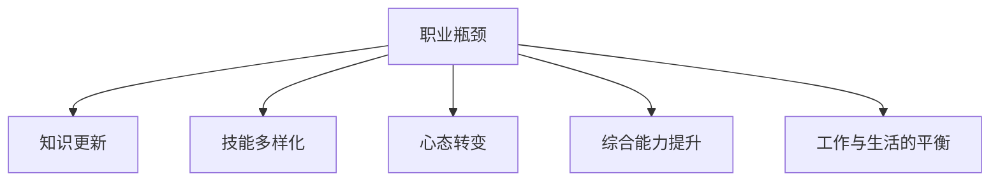

                 

# 如何突破职业瓶颈达到巅峰

## 1. 背景介绍

在当今快速变化的技术和商业环境中，职业瓶颈成为了众多IT从业人员所面临的重大挑战。职业瓶颈不仅意味着技术能力的停滞，更可能引发职业发展中的困惑与焦虑。面对这一挑战，本文将深入探讨职业瓶颈的原因，并提出具体的策略来突破瓶颈，迈向职业生涯的新高度。

### 1.1 问题由来

职业瓶颈往往在职业生涯的中后期出现。这一阶段，技术的快速迭代、商业模式的变革以及个人工作与生活的平衡，使得职业发展面临多重压力。这些因素交织在一起，导致技术人员的知识更新停滞，创新能力下降，工作热情衰退。

### 1.2 问题核心关键点

面对职业瓶颈，核心问题可以归纳为以下几点：

- **知识老化**：技术更新迅速，原有知识体系逐渐失效。
- **创新乏力**：缺乏新项目、新技术的刺激，无法激发创意。
- **心态固化**：长期在某个技术栈或项目中工作，形成思维定式。
- **角色单一**：技术栈狭窄，缺乏跨领域技能和复合型能力。
- **生活压力**：工作与家庭、个人发展之间的平衡失衡。

### 1.3 问题研究意义

突破职业瓶颈对于个人职业发展和企业竞争力提升都具有重要意义：

- **个人成长**：提升技术水平，拓展职业生涯。
- **组织创新**：激发团队活力，增强企业创新能力。
- **市场竞争力**：保持企业技术领先，赢得市场竞争。
- **社会影响**：通过职业发展，传递正能量，引领行业趋势。

## 2. 核心概念与联系

### 2.1 核心概念概述

为更好地理解突破职业瓶颈的方法，本节将介绍几个关键概念：

- **职业瓶颈**：指职业发展过程中遇到阻碍，无法进一步提升的阶段。
- **知识更新**：通过学习新知识，弥补原有知识体系的不足。
- **技能多样化**：从单一技能向多样化技能发展，提高适应性。
- **心态转变**：改变固化思维，拥抱新事物，保持开放心态。
- **综合能力提升**：在技术、管理、沟通等多方面综合提升。
- **工作与生活的平衡**：在职业生涯中实现工作与生活的和谐。

这些核心概念之间的逻辑关系可以通过以下Mermaid流程图来展示：



这个流程图展示了突破职业瓶颈的关键路径：

1. 突破职业瓶颈的第一步，是了解和认识到自身的瓶颈所在。
2. 通过持续学习，更新知识体系。
3. 拓展技能领域，适应多种角色和场景。
4. 调整心态，保持积极进取的态度。
5. 全面提升综合能力，包括技术、管理、沟通等。
6. 实现工作与生活的平衡，追求全面发展。

## 3. 核心算法原理 & 具体操作步骤
### 3.1 算法原理概述

突破职业瓶颈的本质是一种自我超越的持续学习过程，涉及技术技能、项目管理、人际关系等多个维度。其核心算法原理可以概括为以下几点：

- **终身学习**：通过不断学习新知识，保持技术敏锐度。
- **跨领域技能**：从单一技能向多样化技能发展，适应更多领域。
- **心态调整**：通过心态转变，摆脱固化思维，保持开放心态。
- **全面能力**：在技术、管理、沟通等方面综合提升，形成全方位的能力。
- **工作与生活平衡**：在追求职业发展的同时，关注个人生活，保持身心健康。

### 3.2 算法步骤详解

基于上述原理，以下是突破职业瓶颈的具体操作步骤：

**Step 1: 自我评估与目标设定**

- **评估现状**：了解自身技能水平、知识体系、职业成就与不足。
- **设定目标**：根据自身情况，设定短期和长期的职业发展目标。

**Step 2: 持续学习与知识更新**

- **选择课程**：根据目标选择合适的在线课程、培训或认证。
- **实践练习**：将所学知识通过项目实践，巩固技能。
- **社区交流**：参加技术社区、行业会议，与同行交流经验。

**Step 3: 技能多样化与角色拓展**

- **技能拓展**：学习新领域知识，如数据科学、人工智能、区块链等。
- **角色尝试**：在不同角色和岗位上尝试，积累多样化的经验。
- **跨领域合作**：与不同领域的同事合作，拓宽视野。

**Step 4: 心态调整与心态转变**

- **接受变化**：适应技术、市场、个人生活的新变化。
- **积极进取**：主动寻求新的挑战和机会，保持创新激情。
- **开放心态**：保持对新事物的好奇心，不畏挑战。

**Step 5: 综合能力提升与全面发展**

- **技术能力**：提升编程、设计、架构等技术能力。
- **项目管理**：学习项目管理和敏捷开发方法。
- **沟通协作**：提升沟通、团队协作、跨部门合作能力。

**Step 6: 工作与生活平衡**

- **时间管理**：合理安排工作时间，留出时间休息与学习。
- **家庭关注**：平衡工作与家庭，关注家庭成员的健康与幸福。
- **个人兴趣**：培养个人兴趣爱好，丰富生活。

### 3.3 算法优缺点

**优点**：

- **系统性**：通过多维度的方法，全面提升个人能力。
- **实践性强**：通过具体步骤指导，易于操作。
- **灵活性**：结合个人情况，定制化发展路径。

**缺点**：

- **耗时较长**：持续学习和技能拓展需要时间和精力。
- **资源投入**：可能需要一定的经济投入，如课程费用、学习工具等。
- **初期阻力**：改变习惯和心态需要一定时间和努力。

### 3.4 算法应用领域

突破职业瓶颈的方法适用于多种职业场景，包括但不限于：

- **技术岗位**：如软件开发、系统架构、数据分析等。
- **管理岗位**：如项目经理、产品经理、技术主管等。
- **研发岗位**：如科学家、研究员、工程师等。
- **产品设计**：如UI/UX设计师、产品经理等。

## 4. 数学模型和公式 & 详细讲解 & 举例说明

### 4.1 数学模型构建

在技术职业发展中，虽然算法原理以实践为主，但数学模型在量化分析、优化决策等方面也有其应用。

记职业瓶颈为 $B$，技能更新为 $S$，心态调整为 $A$，综合能力提升为 $C$，工作与生活平衡为 $W$。职业发展的目标函数为 $F(B, S, A, C, W)$。假设目标函数为最大值优化，则目标函数可以表示为：

$$
F(B, S, A, C, W) = \max_{B, S, A, C, W}
$$

其中，目标函数中的各项指标相互独立，可以通过线性加权组合表示为：

$$
F = \alpha_B B + \alpha_S S + \alpha_A A + \alpha_C C + \alpha_W W
$$

其中，$\alpha$ 为各项指标的权重系数，需根据个人实际情况设定。

### 4.2 公式推导过程

以技能更新 $S$ 为例，假设现有技能为 $S_0$，新学习技能为 $S_1$，则技能更新可以通过数学模型表示为：

$$
S = S_0 + S_1
$$

其中，$S_1$ 可以进一步细分为多个子技能，如编程语言、框架、算法等，可以表示为：

$$
S_1 = \sum_{i=1}^{n} \beta_i S_{1,i}
$$

其中，$n$ 为新学习技能的数量，$\beta_i$ 为各项技能的学习权重。

对于心态调整 $A$ 和综合能力提升 $C$，同样可以引入类似的数学模型进行量化分析。

### 4.3 案例分析与讲解

假设某技术工程师现有技能 $S_0$ 在Java领域，目标职业发展为在人工智能领域。通过数学模型计算，可以设定技能更新 $S_1$ 为Python和深度学习，心态调整 $A$ 为积极应对新挑战，综合能力提升 $C$ 为项目管理能力和团队协作能力。通过设定相应的权重 $\alpha_S$、$\alpha_A$、$\alpha_C$，可以计算出综合职业发展目标函数 $F$。

**案例分析**：

- **目标设定**：在2年内掌握Python和深度学习，提升项目管理能力和团队协作能力，积极应对新挑战。
- **技能更新**：通过在线课程、项目实践、行业会议等途径学习Python和深度学习。
- **心态调整**：转变思维方式，接受新技术，积极参与团队合作，寻求反馈。
- **综合能力**：参加敏捷开发培训，提升项目管理技能；参加团队建设活动，提升沟通协作能力。
- **工作与生活平衡**：合理安排工作时间，确保家庭与个人生活的平衡。

通过上述步骤，可以有效地突破职业瓶颈，实现职业发展目标。

## 5. 项目实践：代码实例和详细解释说明

### 5.1 开发环境搭建

在进行职业瓶颈突破的实践前，我们需要准备好开发环境。以下是使用Python进行配置的流程：

1. 安装Python：从官网下载并安装Python，建议选择最新版本。
2. 安装pip：pip是Python的包管理工具，用于安装第三方库。
3. 安装相关库：
   - 选择并安装在线课程平台（如Coursera、Udacity）提供的学习工具。
   - 安装项目管理工具（如JIRA、Trello）。
   - 安装协作工具（如Slack、Zoom）。
4. 设置环境变量：设置PYTHONPATH、PATH等环境变量，确保所有工具在环境内可以访问。

### 5.2 源代码详细实现

以下是使用Python代码实现持续学习与技能拓展的具体步骤：

**1. 课程选择**

```python
import requests
from bs4 import BeautifulSoup

# 查询Coursera上的课程信息
url = "https://www.coursera.org/courses"
response = requests.get(url)
soup = BeautifulSoup(response.text, 'html.parser')
courses = soup.find_all('div', class_='course-card-body')

# 根据课程标题筛选符合条件的课程
selected_courses = []
for course in courses:
    title = course.find('h3', class_='title').text.strip()
    if "Python" in title or "Deep Learning" in title:
        selected_courses.append(title)
        
# 输出选择到的课程
for course in selected_courses:
    print(course)
```

**2. 学习进度记录**

```python
import pandas as pd

# 创建一个学习进度记录表
df = pd.DataFrame(columns=['Course', 'Progress'])

# 填充表中的数据
for course in selected_courses:
    df = df.append({'Course': course, 'Progress': 0}, ignore_index=True)
    
# 更新学习进度
for i in range(len(df)):
    course = df['Course'].iloc[i]
    progress = i / len(df) * 100
    df.loc[i, 'Progress'] = progress

# 输出学习进度表
df
```

**3. 项目实践**

```python
import requests
from bs4 import BeautifulSoup

# 查询GitHub上的项目信息
url = "https://github.com/search?q=Python+deep+learning"
response = requests.get(url)
soup = BeautifulSoup(response.text, 'html.parser')
projects = soup.find_all('div', class_='card-body')

# 记录项目信息
projects_list = []
for project in projects:
    title = project.find('h3', class_='title').text.strip()
    description = project.find('p', class_='project-link-description').text.strip()
    url = project.find('a', class_='project-link')['href']
    date = project.find('span', class_='project-link-date').text.strip()
    # 将项目信息添加到列表中
    project_info = {
        'Title': title,
        'Description': description,
        'URL': url,
        'Date': date
    }
    projects_list.append(project_info)

# 输出项目信息
for project in projects_list:
    print(f"{project['Title']}: {project['Description']} (发布时间: {project['Date']})")
```

### 5.3 代码解读与分析

上述代码实现中，我们首先通过爬虫技术获取了Coursera和GitHub上的课程和项目信息，然后对课程和项目进行了筛选，最后记录了学习进度和项目信息。通过这些具体的代码实例，可以帮助理解持续学习与技能拓展的实现方式。

## 6. 实际应用场景

### 6.1 技术岗位

**案例**：某Java开发工程师希望在2年内转型为AI工程师。

**具体步骤**：

- **学习新技能**：通过Coursera和Udacity平台学习Python和深度学习。
- **实践项目**：在GitHub上找到相关项目，进行代码贡献和实践。
- **心态转变**：积极参与社区交流，学习新领域的最新进展。
- **能力提升**：参加相关培训，提升项目管理能力和团队协作能力。
- **生活平衡**：合理安排时间，确保家庭与工作的平衡。

### 6.2 管理岗位

**案例**：某产品经理希望提升项目管理能力，转变为技术型管理人才。

**具体步骤**：

- **学习新知识**：参加敏捷开发培训，学习项目管理方法。
- **实践管理**：通过实际项目，应用敏捷方法论，提升项目管理能力。
- **心态转变**：接受技术变化，积极与技术团队沟通协作。
- **能力提升**：参加团队建设活动，提升沟通协作能力。
- **生活平衡**：合理安排时间，确保家庭与工作的平衡。

### 6.3 研发岗位

**案例**：某研究员希望拓展研究领域，从人工智能转向数据科学。

**具体步骤**：

- **学习新技能**：通过在线课程学习数据科学相关知识。
- **实践项目**：在GitHub上找到相关项目，进行代码贡献和实践。
- **心态转变**：接受新领域挑战，积极与数据科学团队交流合作。
- **能力提升**：参加数据科学培训，提升数据处理和建模能力。
- **生活平衡**：合理安排时间，确保家庭与工作的平衡。

### 6.4 产品设计

**案例**：某UI/UX设计师希望提升跨领域技能，转变为产品设计师。

**具体步骤**：

- **学习新技能**：参加用户体验设计培训，学习产品设计方法。
- **实践项目**：通过实际项目，应用产品设计方法，提升设计能力。
- **心态转变**：接受新技术变化，积极与开发团队沟通协作。
- **能力提升**：参加跨部门合作活动，提升沟通协作能力。
- **生活平衡**：合理安排时间，确保家庭与工作的平衡。

## 7. 工具和资源推荐

### 7.1 学习资源推荐

为了帮助从业人员系统掌握职业瓶颈突破的方法，以下是推荐的几类资源：

- **在线课程平台**：Coursera、Udacity、edX等提供大量职业发展课程。
- **技术博客**：Medium、TechCrunch等平台上的技术文章，帮助了解行业动态。
- **专业书籍**：如《代码大全》、《编程珠玑》等经典技术书籍。
- **技术社区**：Stack Overflow、GitHub等平台，帮助解决实际问题。
- **学术期刊**：ACM Transactions on Software Engineering and Methodology等期刊，提供前沿技术研究。

### 7.2 开发工具推荐

高效的开发工具是职业瓶颈突破的重要保障。以下是推荐的工具：

- **编程工具**：Visual Studio Code、PyCharm、IntelliJ IDEA等，支持多种编程语言。
- **项目管理工具**：JIRA、Trello、Asana等，帮助管理项目进度。
- **协作工具**：Slack、Zoom、Microsoft Teams等，支持团队沟通协作。
- **文档工具**：Confluence、Notion等，帮助记录工作内容和知识。
- **云服务**：AWS、Google Cloud、Azure等，提供云存储和计算资源。

### 7.3 相关论文推荐

职业瓶颈突破涉及多学科知识，以下是推荐的几篇相关论文：

- **《编程珠玑》**：Jon Bentley著作，涵盖多种编程技巧和算法思想。
- **《代码大全》**：Steve McConnell著作，详细讲解软件开发的实践经验。
- **《敏捷软件开发实践》**：Robert C. Martin著作，介绍敏捷开发方法论。
- **《数据科学导论》**：Joel Grus著作，涵盖数据科学的基本原理和工具。
- **《用户体验设计原理》**：Jesse James Garrett著作，详细介绍用户体验设计的理论和实践。

## 8. 总结：未来发展趋势与挑战

### 8.1 总结

本文对职业瓶颈突破进行了全面的探讨，从理论到实践，系统讲解了突破职业瓶颈的关键步骤和方法。通过持续学习、技能多样化、心态调整、综合能力提升和工作生活平衡等多方面的努力，从业人员可以有效地突破职业瓶颈，实现职业生涯的新高度。

### 8.2 未来发展趋势

未来职业瓶颈突破的发展趋势如下：

- **个性化学习**：根据个人情况，定制化职业发展路径。
- **跨领域融合**：技术、管理、设计等领域的深度融合。
- **终身学习**：持续学习成为职业发展的常态。
- **虚拟现实**：利用VR技术，提供沉浸式学习体验。
- **自适应学习**：结合人工智能技术，实现学习过程的智能化。

### 8.3 面临的挑战

在职业瓶颈突破的实践中，仍面临以下挑战：

- **时间管理**：平衡工作与学习，需要有效的规划和执行。
- **资源投入**：需要投入一定的经济和时间成本，获取高质量的学习资源。
- **心态转变**：改变固有思维模式，接受新事物，需要心理调适。
- **社会压力**：面对工作和生活压力，保持平衡，需要良好的自我调节能力。

### 8.4 研究展望

未来，职业瓶颈突破的研究方向可能包括：

- **心理干预**：研究心理调适方法，帮助从业人员应对职业压力。
- **技术创新**：探索新技术在职业发展中的应用，如VR、AR等。
- **跨领域研究**：结合多学科知识，进行跨领域融合研究。
- **数据驱动**：利用大数据分析，优化职业发展路径。
- **社会支持**：提供企业和社会层面的支持，帮助从业人员突破瓶颈。

## 9. 附录：常见问题与解答

**Q1: 如何设定职业发展目标？**

A: 设定职业发展目标时，可以从短期和长期两个维度进行考虑。短期目标通常为3-6个月，明确具体的技能提升和项目实践目标。长期目标通常为1-3年，设定更高层次的成就和能力提升目标。目标设定应结合自身情况，考虑实际可行性。

**Q2: 如何管理时间？**

A: 时间管理可以通过以下步骤实现：

1. 制定计划：每天早上或前一天晚上制定当天的计划。
2. 优先级排序：根据任务的紧急程度和重要程度进行排序。
3. 专注时间管理：使用番茄工作法等专注技巧，提高工作效率。
4. 休息与放松：合理安排休息时间，避免疲劳。
5. 定期回顾：每周或每月进行时间管理回顾，调整计划。

**Q3: 如何保持学习动力？**

A: 保持学习动力可以从以下几个方面入手：

1. 明确目标：设定清晰的学习目标，了解学习的意义。
2. 逐步进展：将大目标分解成小目标，逐步完成。
3. 反馈激励：定期评估学习进展，给予自己正向反馈。
4. 学习社区：加入学习社区，与他人交流经验。
5. 兴趣驱动：选择感兴趣的学习内容，提高学习积极性。

**Q4: 如何应对工作压力？**

A: 应对工作压力可以采取以下方法：

1. 时间管理：合理安排时间，避免过度加班。
2. 健康生活：保持健康的生活习惯，均衡饮食、适量运动。
3. 心理调节：学会放松技巧，如冥想、深呼吸等。
4. 支持系统：与家人、朋友、同事沟通，寻求支持。
5. 职业规划：制定清晰的职业规划，明确发展方向。

---

作者：禅与计算机程序设计艺术 / Zen and the Art of Computer Programming

