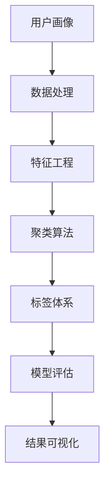

                 

# 如何进行有效的用户分群管理

> 关键词：用户分群、用户画像、聚类算法、标签体系、数据处理、特征工程

## 1. 背景介绍

在数字化转型的浪潮下，企业对于用户数据的重视程度不断提高。用户数据不仅是企业决策的重要依据，也是个性化服务的基础。通过对用户数据进行深入分析，企业可以更好地了解用户需求，制定更加精准的营销策略，提升用户体验和运营效率。而用户分群管理正是其中重要的一环。通过将用户进行科学的分类，企业能够更高效地管理和利用用户数据，实现个性化的服务和精准的营销。

### 1.1 用户分群管理的意义
用户分群管理是企业通过数据分析和机器学习技术，将用户按照一定的特征进行分类，形成不同用户群体的过程。通过对用户进行分群，企业可以实现以下目标：

1. **精准营销**：根据不同用户群体的特征，制定有针对性的营销策略，提升广告和促销的效果。
2. **个性化服务**：为不同用户群体提供更加个性化、定制化的服务，提升用户满意度和忠诚度。
3. **需求分析**：通过分析不同用户群体的行为和偏好，深入了解用户需求，指导产品开发和市场策略。
4. **运营优化**：根据不同用户群体的特点，优化资源配置和运营策略，提高企业运营效率。

用户分群管理已经成为企业数字化转型中的关键环节，其应用场景广泛，包括电商、金融、保险、医疗、教育等多个领域。

### 1.2 用户分群管理的挑战
尽管用户分群管理有诸多优势，但在实际操作中仍面临不少挑战：

1. **数据多样性**：用户数据来源多样，包括结构化数据、非结构化数据、实时数据等，数据格式和结构复杂，难以统一处理。
2. **数据质量问题**：用户数据质量参差不齐，存在缺失、噪声、异常值等问题，影响分群结果的准确性。
3. **特征工程复杂**：需要从大量数据中提取有意义的特征，特征选择和工程过程复杂且耗时。
4. **模型选择与调优**：分群模型的选择和参数调优是一个复杂的过程，需要大量的实验和经验积累。
5. **解释性和可操作性**：用户分群结果需要具备较强的解释性和可操作性，能够为企业决策提供实际价值。

面对这些挑战，企业需要构建科学的工具和方法，才能有效实施用户分群管理。

## 2. 核心概念与联系

### 2.1 核心概念概述

用户分群管理的核心概念包括用户画像、聚类算法、标签体系、数据处理、特征工程等。

- **用户画像**：用户画像是指对用户进行详细的描述，包括用户的基本信息、行为特征、兴趣偏好等。用户画像是用户分群的基础，有助于更准确地理解用户需求和行为。
- **聚类算法**：聚类算法是一种无监督学习方法，通过将用户按照相似性进行分组，形成不同的用户群体。常见的聚类算法包括K-Means、层次聚类、DBSCAN等。
- **标签体系**：标签体系是将用户按照特定的维度进行分类，形成结构化的用户分群方式。标签体系能够使分群结果更具备解释性和可操作性。
- **数据处理**：数据处理包括数据清洗、数据转换、数据增强等环节，目的是将原始数据转化为可用于分群分析的格式。
- **特征工程**：特征工程是从原始数据中提取有意义的特征，通过特征选择和特征构建，提升分群模型的表现。

这些核心概念之间存在紧密的联系，形成了一个完整的用户分群管理框架。

### 2.2 核心概念原理和架构的 Mermaid 流程图



**解释**：
- 用户画像从数据处理环节开始，通过数据清洗和转换，形成可用于特征工程的数据集。
- 特征工程从原始数据中提取有意义的特征，提升聚类算法的表现。
- 聚类算法根据特征相似性，将用户进行分组，形成不同的用户群体。
- 标签体系对聚类结果进行结构化处理，增强结果的解释性和可操作性。
- 模型评估通过评估指标，检验聚类结果的质量。
- 结果可视化将聚类结果以图形形式展示，便于理解和应用。

## 3. 核心算法原理 & 具体操作步骤

### 3.1 算法原理概述

用户分群管理的核心算法原理主要基于聚类算法和特征工程。其核心思想是通过数据分析和机器学习技术，将用户按照一定的特征进行分类，形成不同用户群体。

用户分群的一般流程包括数据处理、特征工程、聚类算法、标签体系、模型评估、结果可视化等环节。

### 3.2 算法步骤详解

#### 3.2.1 数据处理

数据处理是用户分群管理的第一步，目的是将原始数据转化为可用于分群分析的格式。数据处理包括数据清洗、数据转换、数据增强等环节。

- **数据清洗**：清洗数据中的缺失值、噪声、异常值等，保证数据的质量和完整性。
- **数据转换**：将数据从原始格式转化为可用于分析的格式，如将字符串类型转化为数值类型。
- **数据增强**：通过数据增强技术，扩充训练集的多样性，提升分群模型的泛化能力。

#### 3.2.2 特征工程

特征工程是从原始数据中提取有意义的特征，通过特征选择和特征构建，提升聚类算法的表现。

- **特征选择**：从原始数据中筛选出有意义的特征，去除冗余和无用的特征。
- **特征构建**：通过数据转换和计算，构造新的特征，提升模型的表现。

#### 3.2.3 聚类算法

聚类算法是用户分群管理的核心算法，通过将用户按照相似性进行分组，形成不同的用户群体。常见的聚类算法包括K-Means、层次聚类、DBSCAN等。

- **K-Means算法**：K-Means是一种基于距离的聚类算法，通过计算用户之间的距离，将用户分为K个簇。
- **层次聚类算法**：层次聚类算法通过逐步合并簇，形成一个树状结构，直到所有用户都被分配到同一个簇中。
- **DBSCAN算法**：DBSCAN算法是一种基于密度的聚类算法，通过计算用户之间的密度，将用户分为核心点、边界点、噪声点等不同类型。

#### 3.2.4 标签体系

标签体系是将用户按照特定的维度进行分类，形成结构化的用户分群方式。标签体系能够使分群结果更具备解释性和可操作性。

- **标签定义**：定义分群的具体维度，如年龄、性别、消费水平等。
- **标签计算**：根据聚类结果和标签定义，计算每个用户对应的标签值。

#### 3.2.5 模型评估

模型评估通过评估指标，检验聚类结果的质量。常用的评估指标包括轮廓系数、Fowlkes-Mallows系数等。

- **轮廓系数**：轮廓系数用于衡量聚类结果的紧凑度和分离度，值越大表示聚类结果越好。
- **Fowlkes-Mallows系数**：Fowlkes-Mallows系数用于衡量聚类结果的准确率和召回率，值越高表示聚类结果越准确。

#### 3.2.6 结果可视化

结果可视化将聚类结果以图形形式展示，便于理解和应用。常用的可视化工具包括Matplotlib、Seaborn、Tableau等。

- **聚类结果可视化**：通过散点图、热力图等形式展示聚类结果，便于理解不同簇的特点。
- **标签体系可视化**：通过条形图、饼图等形式展示标签体系的分布情况，便于分析用户群体的特征。

### 3.3 算法优缺点

#### 3.3.1 优点

用户分群管理的优点包括：

1. **个性化服务**：根据不同用户群体的特征，制定有针对性的营销策略，提升广告和促销的效果。
2. **精准营销**：通过分群分析，了解用户需求和行为，制定更加精准的营销策略，提升用户满意度和忠诚度。
3. **需求分析**：通过分析不同用户群体的行为和偏好，深入了解用户需求，指导产品开发和市场策略。
4. **运营优化**：根据不同用户群体的特点，优化资源配置和运营策略，提高企业运营效率。

#### 3.3.2 缺点

用户分群管理也存在一些缺点：

1. **数据质量问题**：用户数据质量参差不齐，存在缺失、噪声、异常值等问题，影响分群结果的准确性。
2. **特征工程复杂**：需要从大量数据中提取有意义的特征，特征选择和工程过程复杂且耗时。
3. **模型选择与调优**：分群模型的选择和参数调优是一个复杂的过程，需要大量的实验和经验积累。
4. **解释性和可操作性**：用户分群结果需要具备较强的解释性和可操作性，能够为企业决策提供实际价值。

### 3.4 算法应用领域

用户分群管理的应用领域广泛，包括电商、金融、保险、医疗、教育等多个领域。

#### 3.4.1 电商

电商领域可以利用用户分群管理进行个性化推荐、营销策略优化、用户行为分析等。例如，通过分群分析，电商企业可以了解不同用户群体的消费偏好，制定更加精准的推荐策略，提升用户购买率和满意度。

#### 3.4.2 金融

金融领域可以利用用户分群管理进行风险评估、用户画像分析、产品开发等。例如，通过分群分析，金融机构可以了解不同用户群体的风险偏好，制定差异化的产品和服务，提升用户体验和忠诚度。

#### 3.4.3 保险

保险领域可以利用用户分群管理进行风险定价、理赔流程优化、客户服务改进等。例如，通过分群分析，保险公司可以了解不同用户群体的风险特征，制定更加合理的保费策略，提升保单购买率和理赔效率。

#### 3.4.4 医疗

医疗领域可以利用用户分群管理进行健康管理、疾病预测、医疗服务优化等。例如，通过分群分析，医疗机构可以了解不同用户群体的健康状况，制定个性化的健康管理方案，提升医疗服务质量和患者满意度。

#### 3.4.5 教育

教育领域可以利用用户分群管理进行学习行为分析、个性化推荐、课程开发等。例如，通过分群分析，教育机构可以了解不同用户群体的学习偏好，制定更加精准的个性化推荐方案，提升学习效果和用户满意度。

## 4. 数学模型和公式 & 详细讲解 & 举例说明

### 4.1 数学模型构建

用户分群管理的数学模型主要基于聚类算法和特征工程。其核心思想是通过数据分析和机器学习技术，将用户按照一定的特征进行分类，形成不同用户群体。

假设用户数据集为 $D=\{(x_i, y_i)\}_{i=1}^N$，其中 $x_i$ 为用户的特征向量，$y_i$ 为用户的标签。用户分群的目标是找到一个聚类函数 $f$，将用户数据 $D$ 映射到不同的用户群体中，形成聚类结果 $C=\{c_j\}_{j=1}^K$。

### 4.2 公式推导过程

#### 4.2.1 K-Means算法

K-Means算法的公式推导如下：

设用户数据集 $D=\{(x_1, x_2, ..., x_N)\}$，聚类中心为 $\mu_1, \mu_2, ..., \mu_K$，聚类函数为 $f: D \rightarrow C$，则K-Means算法的目标函数为：

$$
\min_{\mu_1, \mu_2, ..., \mu_K} \sum_{i=1}^N \sum_{j=1}^K ||x_i - \mu_j||^2
$$

其中，$||\cdot||$ 表示欧几里得距离。

K-Means算法通过不断迭代聚类中心 $\mu_j$，使得目标函数达到最小值。具体步骤如下：

1. 随机初始化聚类中心 $\mu_1, \mu_2, ..., \mu_K$。
2. 对于每个用户 $x_i$，计算其最近的聚类中心 $\mu_j$，并将其分配到该聚类中。
3. 对于每个聚类 $c_j$，计算新的聚类中心 $\mu_j = \frac{1}{|c_j|}\sum_{x_i \in c_j} x_i$。
4. 重复步骤2和步骤3，直到聚类中心不再变化或达到预设的迭代次数。

#### 4.2.2 层次聚类算法

层次聚类算法的公式推导如下：

设用户数据集 $D=\{(x_1, x_2, ..., x_N)\}$，聚类树 $T=\{C_1, C_2, ..., C_K\}$，聚类函数为 $f: D \rightarrow C$，则层次聚类算法的目标函数为：

$$
\min_{C_1, C_2, ..., C_K} \sum_{i=1}^N \sum_{j=1}^K d(c_i, c_j)
$$

其中，$d$ 表示聚类之间的距离。

层次聚类算法通过不断合并聚类，形成一颗聚类树。具体步骤如下：

1. 将每个用户单独作为一个聚类 $C_i$。
2. 计算相邻聚类 $C_i$ 和 $C_j$ 之间的距离 $d(C_i, C_j)$。
3. 选择距离最近的两个聚类 $C_i$ 和 $C_j$，合并为一个新的聚类 $C_{i,j}$。
4. 重复步骤2和步骤3，直到所有用户都被分配到同一个聚类中。

### 4.3 案例分析与讲解

#### 4.3.1 电商领域案例

假设某电商平台拥有大量用户数据，包括用户的年龄、性别、消费金额、购买频率等特征。通过用户分群管理，电商平台可以了解不同用户群体的特征，制定更加精准的营销策略。

具体步骤如下：

1. **数据处理**：清洗用户数据，去除缺失值和噪声。
2. **特征工程**：从用户数据中提取有意义的特征，如年龄、性别、消费金额、购买频率等。
3. **聚类算法**：使用K-Means算法，将用户分为若干个聚类。
4. **标签体系**：定义标签维度，如年龄、性别、消费水平等。
5. **模型评估**：使用轮廓系数和Fowlkes-Mallows系数评估聚类结果。
6. **结果可视化**：使用散点图和热力图展示聚类结果和标签体系。

最终，电商平台可以根据不同用户群体的特征，制定个性化的营销策略，提升用户购买率和满意度。

## 5. 项目实践：代码实例和详细解释说明

### 5.1 开发环境搭建

在进行用户分群管理实践前，我们需要准备好开发环境。以下是使用Python进行Scikit-learn开发的环境配置流程：

1. 安装Anaconda：从官网下载并安装Anaconda，用于创建独立的Python环境。

2. 创建并激活虚拟环境：
```bash
conda create -n user-segmentation python=3.8 
conda activate user-segmentation
```

3. 安装Scikit-learn：
```bash
conda install scikit-learn
```

4. 安装各类工具包：
```bash
pip install numpy pandas scikit-learn matplotlib tqdm jupyter notebook ipython
```

完成上述步骤后，即可在`user-segmentation`环境中开始用户分群管理的开发实践。

### 5.2 源代码详细实现

这里我们以电商领域为例，给出使用Scikit-learn进行用户分群管理的Python代码实现。

首先，定义数据处理函数：

```python
import pandas as pd
import numpy as np
from sklearn.preprocessing import StandardScaler

def preprocess_data(df):
    # 数据清洗
    df = df.dropna(subset=['age', 'gender', 'purchase_amount', 'purchase_frequency'])
    
    # 数据转换
    df['age'] = df['age'].astype('int')
    df['gender'] = df['gender'].astype('category')
    df['purchase_amount'] = df['purchase_amount'].astype('float')
    df['purchase_frequency'] = df['purchase_frequency'].astype('int')
    
    # 数据标准化
    scaler = StandardScaler()
    df = pd.DataFrame(scaler.fit_transform(df[['age', 'purchase_amount', 'purchase_frequency']]), columns=['age', 'purchase_amount', 'purchase_frequency'])
    
    return df
```

然后，定义特征工程函数：

```python
from sklearn.feature_extraction.text import TfidfVectorizer

def feature_engineering(df):
    # 构建特征
    tfidf = TfidfVectorizer(stop_words='english')
    X = tfidf.fit_transform(df['comments'])
    
    return X, tfidf.get_feature_names_out()
```

接着，定义聚类函数：

```python
from sklearn.cluster import KMeans

def clustering(X, num_clusters):
    # 聚类
    kmeans = KMeans(n_clusters=num_clusters, random_state=42)
    kmeans.fit(X)
    
    # 标签计算
    labels = kmeans.labels_
    
    return labels
```

最后，定义可视化函数：

```python
import matplotlib.pyplot as plt
import seaborn as sns

def visualize_clusters(df, labels, title):
    # 可视化聚类结果
    plt.figure(figsize=(10, 6))
    sns.scatterplot(x='age', y='purchase_amount', hue='purchase_frequency', data=df, s=100, alpha=0.5)
    plt.title(title)
    plt.show()
    
    # 可视化标签体系
    plt.figure(figsize=(10, 6))
    sns.countplot(x='labels', data=df)
    plt.title(title)
    plt.show()
```

完成上述步骤后，即可在`user-segmentation`环境中启动用户分群管理的开发实践。

### 5.3 代码解读与分析

让我们再详细解读一下关键代码的实现细节：

**preprocess_data函数**：
- `dropna`方法：去除数据中的缺失值。
- `astype`方法：将数据类型转换为可处理的形式，如将字符串类型转换为数值类型。
- `StandardScaler`：对数值型特征进行标准化处理，提升聚类算法的表现。

**feature_engineering函数**：
- `TfidfVectorizer`：将文本特征转换为数值型特征，方便聚类算法处理。
- `fit_transform`方法：计算TF-IDF值，并转换为数值型特征矩阵。

**clustering函数**：
- `KMeans`：使用K-Means算法进行聚类。
- `labels_`属性：获取聚类结果。

**visualize_clusters函数**：
- `scatterplot`方法：绘制散点图，展示聚类结果。
- `countplot`方法：绘制柱状图，展示标签体系的分布情况。

## 6. 实际应用场景

### 6.1 智能客服系统

基于用户分群管理的智能客服系统，可以为用户提供更加个性化、高效的服务。通过分析用户的年龄、性别、消费水平等特征，智能客服系统可以了解不同用户的需求和行为，自动匹配最合适的客服人员，提供针对性的服务。

在技术实现上，可以将用户分群管理的结果应用于客服系统的任务分配和人员调度中，提升客服系统的工作效率和用户满意度。

### 6.2 金融舆情监测

金融机构可以利用用户分群管理进行舆情监测和风险评估。通过分析用户的年龄、性别、投资水平等特征，金融机构可以了解不同用户群体的风险偏好和行为模式，制定差异化的风险管理策略，提升金融产品的市场竞争力。

在技术实现上，可以将用户分群管理的结果应用于舆情监测系统和风险评估模型中，及时发现和应对潜在的风险。

### 6.3 个性化推荐系统

个性化推荐系统可以根据用户的年龄、性别、消费水平等特征，为用户推荐个性化的产品和服务。通过分析用户的购买历史、浏览记录、评价反馈等数据，推荐系统可以了解不同用户群体的需求和偏好，提供更加精准的推荐方案。

在技术实现上，可以将用户分群管理的结果应用于推荐系统的用户画像和推荐策略中，提升推荐系统的个性化程度和用户满意度。

### 6.4 未来应用展望

随着用户分群管理的不断发展，未来将在更多领域得到应用，为各行各业带来变革性影响。

在智慧医疗领域，医疗机构可以利用用户分群管理进行健康管理、疾病预测、医疗服务优化等。通过分析用户的健康数据，医疗机构可以了解不同用户群体的健康状况，制定个性化的健康管理方案，提升医疗服务质量和患者满意度。

在智能教育领域，教育机构可以利用用户分群管理进行学习行为分析、个性化推荐、课程开发等。通过分析学生的学习数据，教育机构可以了解不同学生群体的学习需求和行为，制定个性化的学习方案，提升学习效果和学生满意度。

在智慧城市治理中，城市管理部门可以利用用户分群管理进行交通管理、环境监测、公共服务优化等。通过分析市民的出行数据、生活数据等，城市管理部门可以了解不同市民群体的需求和行为，优化城市资源的配置和管理，提升市民的生活质量和满意度。

此外，在企业生产、社会治理、文娱传媒等众多领域，用户分群管理也将不断涌现新的应用场景，为各行各业带来新的价值。

## 7. 工具和资源推荐

### 7.1 学习资源推荐

为了帮助开发者系统掌握用户分群管理的理论基础和实践技巧，这里推荐一些优质的学习资源：

1. 《Python数据科学手册》：这是一本详细讲解Python数据科学的书籍，涵盖数据处理、特征工程、聚类算法等内容，适合初学者入门。
2. 《机器学习实战》：这是一本实用的机器学习实战书籍，通过大量实例讲解机器学习算法和应用，适合读者实践和应用。
3. 《用户分群管理实战》：这是一本专门讲解用户分群管理的书籍，涵盖数据处理、特征工程、聚类算法、标签体系等内容，适合行业从业者学习。
4. Kaggle：Kaggle是一个数据科学竞赛平台，提供大量的数据集和竞赛任务，可以帮助读者实践和提高数据处理和模型优化能力。
5. Scikit-learn官方文档：Scikit-learn是Python中最流行的机器学习库之一，其官方文档详细讲解了各类算法和应用，适合读者学习和实践。

通过对这些资源的学习实践，相信你一定能够快速掌握用户分群管理的精髓，并用于解决实际的业务问题。

### 7.2 开发工具推荐

高效的开发离不开优秀的工具支持。以下是几款用于用户分群管理开发的常用工具：

1. Python：Python是一种广泛使用的编程语言，具有丰富的数据处理和机器学习库，适合用户分群管理的开发。
2. Scikit-learn：Scikit-learn是一个Python机器学习库，提供了丰富的聚类算法和特征工程工具，适合用户分群管理的开发。
3. Jupyter Notebook：Jupyter Notebook是一个交互式的Python开发环境，支持代码编写、数据可视化、结果展示等，适合用户分群管理的开发和实践。
4. Matplotlib：Matplotlib是一个Python数据可视化库，支持绘制各种图表，适合用户分群管理结果的展示和分析。
5. Seaborn：Seaborn是一个基于Matplotlib的数据可视化库，支持绘制更复杂、美观的图表，适合用户分群管理结果的展示和分析。

合理利用这些工具，可以显著提升用户分群管理的开发效率，加快创新迭代的步伐。

### 7.3 相关论文推荐

用户分群管理的发展源于学界的持续研究。以下是几篇奠基性的相关论文，推荐阅读：

1. K-Means算法：由MacQueen在1967年提出的K-Means算法，是一种经典的聚类算法，广泛应用于用户分群管理中。
2. 层次聚类算法：由Ward在1963年提出的层次聚类算法，是一种逐步合并聚类的聚类算法，适用于大规模数据集。
3. DBSCAN算法：由Ester等人在1996年提出的DBSCAN算法，是一种基于密度的聚类算法，适用于发现异常点和噪声点。
4. 用户分群管理的深度学习算法：近年来，深度学习在用户分群管理中得到了广泛应用，如神经网络聚类、变分自编码器等。
5. 用户分群管理的数据处理和特征工程：许多研究论文探讨了用户分群管理的数据处理和特征工程方法，如缺失值处理、特征选择、特征构建等。

这些论文代表了大用户分群管理技术的发展脉络。通过学习这些前沿成果，可以帮助研究者把握学科前进方向，激发更多的创新灵感。

## 8. 总结：未来发展趋势与挑战

### 8.1 总结

本文对用户分群管理的理论和实践进行了全面系统的介绍。首先阐述了用户分群管理的意义和挑战，明确了分群在个性化服务、精准营销、需求分析等方面的优势。其次，从原理到实践，详细讲解了用户分群管理的数学模型和算法步骤，给出了用户分群管理的完整代码实例。同时，本文还广泛探讨了用户分群管理在电商、金融、保险、医疗、教育等多个领域的应用前景，展示了用户分群管理的广阔应用空间。

通过本文的系统梳理，可以看到，用户分群管理是实现个性化服务和精准营销的重要手段，能够显著提升企业的运营效率和用户满意度。用户分群管理在多个领域的应用，展现了其强大的实用价值和广阔的发展前景。

### 8.2 未来发展趋势

展望未来，用户分群管理将呈现以下几个发展趋势：

1. **数据质量提升**：随着数据采集和处理技术的进步，用户数据的完整性和准确性将不断提高，为分群分析提供更可靠的数据基础。
2. **聚类算法优化**：聚类算法的发展将更加多样化和高效化，如基于深度学习的聚类算法、基于迁移学习的聚类算法等，提升分群结果的精确性和稳定性。
3. **特征工程自动化**：特征工程的过程将更加自动化和智能化，通过机器学习模型自动提取和构建特征，降低特征工程的复杂度和耗时。
4. **标签体系丰富化**：标签体系的设计将更加精细化和结构化，涵盖更多维度的用户特征，增强分群结果的解释性和可操作性。
5. **模型评估多元化**：分群模型的评估将更加多样化，结合多种评估指标和方法，提升分群结果的全面性和可靠性。
6. **结果可视化智能化**：用户分群管理的结果可视化将更加智能化和交互化，通过自然语言解释、动态展示等方式，增强分群结果的解释性和可操作性。

这些趋势将进一步提升用户分群管理的效率和效果，为各行各业带来更多的应用价值。

### 8.3 面临的挑战

尽管用户分群管理在各个领域都有广泛应用，但其在实际落地中也面临诸多挑战：

1. **数据隐私和安全**：用户数据的隐私和安全问题是一个重要挑战，需要在数据处理和存储过程中采取严格的安全措施。
2. **模型解释性和透明性**：用户分群模型的解释性和透明性问题是一个重要挑战，需要开发可解释的模型，提高分群结果的可信度和可信性。
3. **多维度数据融合**：用户数据的维度和来源多样，不同数据之间的融合和处理是一个复杂的问题，需要开发更加复杂的数据处理和融合技术。
4. **算法复杂度**：聚类算法的复杂度和计算资源消耗是一个重要挑战，需要开发更加高效的算法和优化方法。
5. **实时性和动态性**：用户分群管理的结果需要具备实时性和动态性，能够及时更新和调整，适应市场和用户的变化。

这些挑战将促使用户分群管理技术不断进步和完善，推动其在更多领域的应用。

### 8.4 研究展望

面对用户分群管理所面临的诸多挑战，未来的研究需要在以下几个方面寻求新的突破：

1. **数据隐私保护**：开发更加高效和安全的数据隐私保护技术，保障用户数据的隐私和安全。
2. **模型解释性和透明性**：开发可解释的机器学习模型，增强分群结果的可信度和透明性。
3. **多维度数据融合**：开发更加复杂和高效的数据融合技术，提升数据处理和分析的效率和效果。
4. **算法优化**：开发更加高效和稳定的聚类算法，提升分群结果的精确性和稳定性。
5. **实时性和动态性**：开发实时更新和动态调整的用户分群管理技术，适应市场和用户的变化。

这些研究方向将引领用户分群管理技术迈向更高的台阶，为构建更加智能化、普适化的个性化服务系统铺平道路。面向未来，用户分群管理技术还需要与其他人工智能技术进行更深入的融合，如知识表示、因果推理、强化学习等，多路径协同发力，共同推动人工智能技术在垂直行业的规模化落地。总之，用户分群管理技术需要不断地进行优化和创新，才能在实际应用中取得更好的效果。

## 9. 附录：常见问题与解答

**Q1：用户分群管理的核心步骤是什么？**

A: 用户分群管理的核心步骤包括数据处理、特征工程、聚类算法、标签体系、模型评估、结果可视化等。具体步骤如下：

1. **数据处理**：清洗数据、转换数据、增强数据。
2. **特征工程**：提取特征、选择特征、构建特征。
3. **聚类算法**：选择合适的聚类算法，对数据进行聚类。
4. **标签体系**：定义标签维度，对聚类结果进行结构化处理。
5. **模型评估**：选择评估指标，评估聚类结果的质量。
6. **结果可视化**：将聚类结果和标签体系以图形形式展示。

**Q2：用户分群管理的主要难点是什么？**

A: 用户分群管理的主要难点包括数据质量问题、特征工程复杂、模型选择与调优、解释性和可操作性等。具体如下：

1. **数据质量问题**：用户数据质量参差不齐，存在缺失、噪声、异常值等问题，影响分群结果的准确性。
2. **特征工程复杂**：需要从大量数据中提取有意义的特征，特征选择和工程过程复杂且耗时。
3. **模型选择与调优**：分群模型的选择和参数调优是一个复杂的过程，需要大量的实验和经验积累。
4. **解释性和可操作性**：用户分群结果需要具备较强的解释性和可操作性，能够为企业决策提供实际价值。

**Q3：用户分群管理有哪些应用场景？**

A: 用户分群管理的应用场景广泛，包括电商、金融、保险、医疗、教育等多个领域。具体如下：

1. **电商**：个性化推荐、营销策略优化、用户行为分析等。
2. **金融**：风险评估、用户画像分析、产品开发等。
3. **保险**：风险定价、理赔流程优化、客户服务改进等。
4. **医疗**：健康管理、疾病预测、医疗服务优化等。
5. **教育**：学习行为分析、个性化推荐、课程开发等。

这些应用场景展示了用户分群管理在实际业务中的广泛应用和重要价值。

**Q4：用户分群管理的未来发展方向是什么？**

A: 用户分群管理的未来发展方向包括数据质量提升、聚类算法优化、特征工程自动化、标签体系丰富化、模型评估多元化、结果可视化智能化等。具体如下：

1. **数据质量提升**：随着数据采集和处理技术的进步，用户数据的完整性和准确性将不断提高，为分群分析提供更可靠的数据基础。
2. **聚类算法优化**：聚类算法的发展将更加多样化和高效化，如基于深度学习的聚类算法、基于迁移学习的聚类算法等，提升分群结果的精确性和稳定性。
3. **特征工程自动化**：特征工程的过程将更加自动化和智能化，通过机器学习模型自动提取和构建特征，降低特征工程的复杂度和耗时。
4. **标签体系丰富化**：标签体系的设计将更加精细化和结构化，涵盖更多维度的用户特征，增强分群结果的解释性和可操作性。
5. **模型评估多元化**：分群模型的评估将更加多样化，结合多种评估指标和方法，提升分群结果的全面性和可靠性。
6. **结果可视化智能化**：用户分群管理的结果可视化将更加智能化和交互化，通过自然语言解释、动态展示等方式，增强分群结果的解释性和可操作性。

这些趋势将进一步提升用户分群管理的效率和效果，为各行各业带来更多的应用价值。

---

作者：禅与计算机程序设计艺术 / Zen and the Art of Computer Programming

