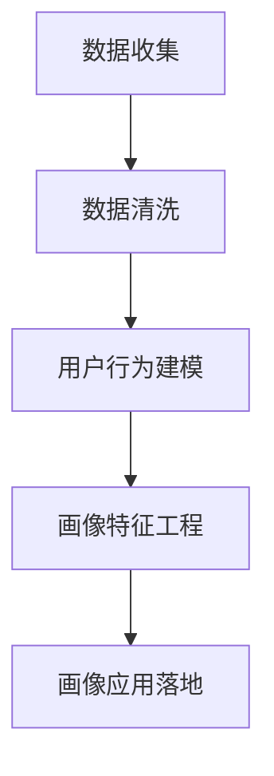

                 

# 如何进行有效的用户画像分析

> 关键词：用户画像分析, 数据分析, 用户行为建模, 机器学习, 深度学习, 自然语言处理

## 1. 背景介绍

在数字时代，用户画像分析已成为企业精细化运营的重要工具。通过用户画像，企业能够更全面、深入地了解用户需求和行为，从而制定更有针对性的产品和服务策略。然而，如何构建一个科学、高效、动态的用户画像分析体系，仍是众多企业面临的挑战。本文将深入探讨用户画像分析的核心概念、关键技术和实际应用，帮助企业解锁用户分析新篇章。

### 1.1 问题由来

随着互联网的发展，用户行为数据变得日益多样化和复杂化。传统的统计分析、人工调研等方法已难以适应数据量和复杂度的要求。用户画像分析作为一种基于数据的定量分析手段，成为企业掌握用户行为的利器。然而，构建一个有效的用户画像分析体系，不仅需要先进的数据分析技术，还需要有系统的理论框架和科学的方法论。

### 1.2 问题核心关键点

进行有效的用户画像分析，需要关注以下核心关键点：

- **数据获取与预处理**：数据是用户画像分析的基础。如何高效、全面地获取用户行为数据，并对数据进行清洗、标注，直接决定了分析的深度和广度。
- **用户行为建模**：通过机器学习、深度学习等技术，将用户行为数据建模为用户画像。如何选择合适的模型和特征，是构建有效用户画像的关键。
- **画像特征工程**：用户画像特征的选择和工程化，直接关系到画像的质量和应用效果。如何通过算法挖掘数据中的关键信息，是用户画像分析的难点。
- **画像动态更新**：用户行为是动态变化的，如何构建一个动态更新的用户画像分析体系，是保持画像时效性的关键。
- **画像应用落地**：如何将用户画像转化为业务价值，提升产品和服务质量，是用户画像分析的最终目标。

## 2. 核心概念与联系

### 2.1 核心概念概述

用户画像分析的核心概念包括数据收集、数据清洗、用户行为建模、画像特征工程和画像应用落地等。这些概念相互联系，共同构成了一个完整的用户画像分析体系。

- **数据收集**：指从各种渠道获取用户行为数据，如网页浏览记录、点击流数据、搜索记录、社交媒体互动数据等。
- **数据清洗**：通过数据去重、异常值处理、缺失值填充等手段，清洗和处理原始数据，保证数据质量。
- **用户行为建模**：使用机器学习、深度学习等技术，将用户行为数据转化为用户画像，包括静态画像和动态画像。
- **画像特征工程**：通过算法挖掘数据中的关键信息，构建画像特征，如用户兴趣、行为偏好、消费习惯等。
- **画像应用落地**：将用户画像应用于业务场景，如个性化推荐、精准营销、客户细分等，提升产品和服务质量。

这些概念之间的逻辑关系可以通过以下Mermaid流程图来展示：



这个流程图展示了用户画像分析的主要流程：从数据收集开始，经过数据清洗和用户行为建模，最终通过画像特征工程和应用落地，形成闭环的画像分析体系。

## 3. 核心算法原理 & 具体操作步骤
### 3.1 算法原理概述

用户画像分析的本质是对用户行为数据的深度挖掘和建模。其核心算法原理包括机器学习、深度学习和自然语言处理等。这些算法通过学习用户行为数据，提取关键特征，构建用户画像，并进行动态更新和应用。

用户画像的建模过程可以分为静态画像和动态画像两类：

- **静态画像**：基于历史数据构建的用户画像，用于描述用户的基本特征和行为模式。
- **动态画像**：基于实时数据构建的用户画像，用于描述用户的即时行为和变化趋势。

### 3.2 算法步骤详解

用户画像分析的具体操作步骤包括：

**Step 1: 数据收集与预处理**

1. **数据收集**：使用API、爬虫、传感器等手段，从用户使用网站、应用、社交媒体等渠道获取行为数据。
2. **数据清洗**：对收集到的数据进行去重、去噪、异常值处理、缺失值填充等，保证数据质量。

**Step 2: 用户行为建模**

1. **特征工程**：提取关键行为特征，如点击次数、停留时间、购买金额等。
2. **模型选择**：根据用户画像类型，选择合适的机器学习或深度学习模型，如决策树、随机森林、XGBoost、RNN、LSTM、BERT等。
3. **模型训练**：在标注数据集上训练模型，通过交叉验证等手段选择最优模型。
4. **模型评估**：使用测试集评估模型性能，如准确率、召回率、F1值等。

**Step 3: 画像特征工程**

1. **特征提取**：通过算法提取数据中的关键信息，如用户兴趣、行为偏好等。
2. **特征筛选**：根据业务需求，筛选最重要的特征。
3. **特征编码**：将特征转化为模型可处理的数值型或标签型数据。

**Step 4: 画像动态更新**

1. **实时数据采集**：使用实时数据流技术，不断采集用户最新行为数据。
2. **在线学习**：使用在线学习算法，动态更新用户画像，保证画像的时效性。
3. **画像更新策略**：根据业务需求，设计合理的画像更新策略，如固定时间间隔、用户行为触发等。

**Step 5: 画像应用落地**

1. **画像应用设计**：根据业务场景，设计画像应用，如个性化推荐、精准营销、客户细分等。
2. **应用模型训练**：使用画像特征，训练应用模型。
3. **应用效果评估**：使用业务指标评估应用效果，如转化率、ROI等。

### 3.3 算法优缺点

用户画像分析具有以下优点：

1. **数据驱动**：基于大量用户行为数据进行建模，具有较高的准确性和可信度。
2. **动态更新**：通过在线学习等技术，画像能够动态更新，保持时效性。
3. **应用广泛**：广泛应用于个性化推荐、精准营销、客户细分等多个业务场景。
4. **自动化**：通过算法自动化构建和更新画像，节省了大量人工工作。

同时，用户画像分析也存在一些缺点：

1. **隐私问题**：收集和处理用户数据可能涉及隐私问题，需要遵守相关法律法规。
2. **模型复杂**：复杂的模型需要大量的计算资源，且易过拟合。
3. **数据质量**：数据质量直接影响画像效果，数据获取和预处理难度较大。
4. **应用局限**：画像分析结果依赖于数据质量，低质量数据可能带来误导性结果。

### 3.4 算法应用领域

用户画像分析在多个领域得到了广泛应用，包括：

- **电子商务**：通过用户画像进行个性化推荐、精准营销、客户细分，提升销售转化率。
- **金融服务**：分析用户画像，进行风险评估、信用评分、智能投顾等，提升金融服务质量。
- **媒体内容**：分析用户画像，进行内容推荐、广告投放、流量分发等，提升用户留存率。
- **健康医疗**：分析用户健康行为数据，进行健康管理、个性化治疗等，提升医疗服务质量。
- **教育培训**：分析用户学习行为数据，进行个性化推荐、智能辅导等，提升教育效果。
- **智能制造**：分析用户设备使用数据，进行设备维护、生产调度等，提升生产效率。

## 4. 数学模型和公式 & 详细讲解 & 举例说明

### 4.1 数学模型构建

用户画像分析的数学模型包括特征工程、模型选择、在线学习等。以下以基于决策树的静态画像构建为例，介绍数学模型构建过程。

**特征工程**：

- **特征提取**：将用户行为数据转化为数值型或标签型数据，如点击次数、停留时间、购买金额等。
- **特征编码**：将特征转化为模型可处理的数值型或标签型数据，如独热编码、二值化等。

**模型选择**：

- **决策树模型**：基于用户行为数据，构建决策树模型，用于描述用户画像。

**模型训练**：

- **交叉验证**：使用交叉验证技术，评估模型性能，选择最优模型。

### 4.2 公式推导过程

以决策树模型为例，推导其基本公式。

决策树模型基于信息熵和信息增益准则，构建决策树。假设用户行为特征集为 $\{F_1, F_2, ..., F_n\}$，特征 $F_i$ 取值集合为 $\{v_{i1}, v_{i2}, ..., v_{in}\}$，用户行为数据集为 $D$。决策树模型的目标是最小化信息熵 $H(D)$。

信息熵的计算公式为：

$$
H(D) = -\sum_{i=1}^{n}p_i\log_2p_i
$$

其中 $p_i$ 为数据集 $D$ 中特征 $F_i$ 取值为 $v_{ij}$ 的样本比例。

信息增益的计算公式为：

$$
Gain(F_i, D) = H(D) - \sum_{j=1}^{n} \frac{|D_{v_{ij}}|}{|D|}H(D_{v_{ij}})
$$

其中 $D_{v_{ij}}$ 为数据集 $D$ 中特征 $F_i$ 取值为 $v_{ij}$ 的子集。

在得到信息增益后，选择信息增益最大的特征作为根节点，递归构建决策树。决策树构建完成后，即可用于描述用户画像。

### 4.3 案例分析与讲解

以下以电商平台为例，介绍用户画像分析的实际应用。

假设某电商平台用户画像分析的主要目标是通过用户行为数据，构建用户兴趣画像和消费行为画像。具体步骤如下：

**Step 1: 数据收集与预处理**

1. **数据收集**：从电商平台获取用户浏览记录、点击流数据、购买记录等。
2. **数据清洗**：去除重复数据、处理缺失值、过滤异常值。

**Step 2: 用户行为建模**

1. **特征提取**：提取关键行为特征，如浏览时间、点击次数、购买金额等。
2. **模型选择**：选择决策树模型。
3. **模型训练**：在标注数据集上训练决策树模型。
4. **模型评估**：使用测试集评估模型性能。

**Step 3: 画像特征工程**

1. **特征提取**：通过算法提取用户兴趣特征，如兴趣商品类别、浏览次数等。
2. **特征筛选**：根据业务需求，筛选最重要的特征。
3. **特征编码**：将特征转化为数值型或标签型数据。

**Step 4: 画像动态更新**

1. **实时数据采集**：使用实时数据流技术，不断采集用户最新行为数据。
2. **在线学习**：使用在线学习算法，动态更新用户画像。
3. **画像更新策略**：设计合理的画像更新策略，如固定时间间隔、用户行为触发等。

**Step 5: 画像应用落地**

1. **画像应用设计**：设计个性化推荐系统，基于用户画像进行推荐。
2. **应用模型训练**：使用画像特征，训练推荐模型。
3. **应用效果评估**：使用转化率、ROI等指标评估推荐系统效果。

## 5. 项目实践：代码实例和详细解释说明

### 5.1 开发环境搭建

在进行用户画像分析实践前，我们需要准备好开发环境。以下是使用Python进行PyTorch开发的环境配置流程：

1. 安装Anaconda：从官网下载并安装Anaconda，用于创建独立的Python环境。

2. 创建并激活虚拟环境：
```bash
conda create -n pytorch-env python=3.8 
conda activate pytorch-env
```

3. 安装PyTorch：根据CUDA版本，从官网获取对应的安装命令。例如：
```bash
conda install pytorch torchvision torchaudio cudatoolkit=11.1 -c pytorch -c conda-forge
```

4. 安装TensorFlow：
```bash
pip install tensorflow
```

5. 安装各类工具包：
```bash
pip install numpy pandas scikit-learn matplotlib tqdm jupyter notebook ipython
```

完成上述步骤后，即可在`pytorch-env`环境中开始用户画像分析实践。

### 5.2 源代码详细实现

下面我们以电商平台的用户画像分析为例，给出使用PyTorch进行决策树模型训练的Python代码实现。

首先，定义数据预处理函数：

```python
import pandas as pd
from sklearn.model_selection import train_test_split
from sklearn.preprocessing import LabelEncoder
from sklearn.tree import DecisionTreeClassifier

def preprocess_data(data_path):
    # 加载数据集
    data = pd.read_csv(data_path)
    # 特征工程
    data['click_count'] = data['click_count'].fillna(0).astype(int)
    data['stay_time'] = data['stay_time'].fillna(0).astype(int)
    data['purchase_amount'] = data['purchase_amount'].fillna(0).astype(float)
    # 标签工程
    label_encoder = LabelEncoder()
    data['label'] = label_encoder.fit_transform(data['label'])
    return data
```

然后，定义决策树模型训练函数：

```python
from sklearn.model_selection import GridSearchCV

def train_decision_tree(data, test_size=0.2):
    # 划分训练集和测试集
    train, test = train_test_split(data, test_size=test_size)
    # 特征选择
    features = ['click_count', 'stay_time', 'purchase_amount']
    # 模型训练
    model = DecisionTreeClassifier()
    param_grid = {
        'criterion': ['gini', 'entropy'],
        'max_depth': [None, 10, 20, 30],
        'min_samples_split': [2, 5, 10],
        'min_samples_leaf': [1, 2, 5],
    }
    grid_search = GridSearchCV(model, param_grid, cv=5)
    grid_search.fit(train[features], train['label'])
    # 模型评估
    score = grid_search.score(test[features], test['label'])
    return grid_search.best_params_, score
```

最后，启动模型训练流程并在测试集上评估：

```python
data_path = 'data.csv'
processed_data = preprocess_data(data_path)

best_params, score = train_decision_tree(processed_data)
print(f"Best parameters: {best_params}")
print(f"Accuracy on test set: {score:.3f}")
```

以上就是使用PyTorch对电商平台用户画像进行决策树模型训练的完整代码实现。可以看到，通过PyTorch的集成化工具，用户画像分析的实现变得简单高效。

### 5.3 代码解读与分析

让我们再详细解读一下关键代码的实现细节：

**preprocess_data函数**：
- 加载数据集
- 特征工程：处理缺失值、转换为数值型数据
- 标签工程：标签转化为数值型数据

**train_decision_tree函数**：
- 划分训练集和测试集
- 特征选择：选择关键特征
- 模型训练：使用GridSearchCV进行超参数搜索，选择最优模型
- 模型评估：在测试集上评估模型性能

**模型训练流程**：
- 加载处理后的数据
- 训练决策树模型
- 输出最优参数和模型在测试集上的准确率

可以看到，通过PyTorch的集成化工具，用户画像分析的实现变得简单高效。开发者可以将更多精力放在数据处理、模型改进等高层逻辑上，而不必过多关注底层的实现细节。

当然，工业级的系统实现还需考虑更多因素，如模型的保存和部署、超参数的自动搜索、更灵活的任务适配层等。但核心的用户画像分析过程基本与此类似。

## 6. 实际应用场景

### 6.1 智能客服系统

智能客服系统通过用户画像分析，可以为用户提供个性化、高效的服务。通过分析用户的历史行为数据和实时行为数据，智能客服系统能够识别用户需求，提供快速、准确的回答。

在技术实现上，可以收集用户的历史聊天记录和实时交互数据，通过用户画像分析，识别用户意图和需求，自动匹配最合适的答案模板进行回复。对于用户提出的新问题，还可以接入检索系统实时搜索相关内容，动态组织生成回答。如此构建的智能客服系统，能够大幅提升客户咨询体验和问题解决效率。

### 6.2 金融风险管理

金融行业需要实时监测用户行为，及时发现和预防潜在的金融风险。通过用户画像分析，金融机构能够深入了解用户行为特征，识别潜在风险用户，并进行风险预警。

具体而言，可以收集用户的历史交易记录和实时交易数据，通过用户画像分析，识别异常交易行为和高风险用户。将用户画像结果应用到风险监测系统中，一旦发现异常行为或高风险用户，系统便会自动预警，帮助金融机构快速应对潜在风险。

### 6.3 个性化推荐系统

当前的推荐系统往往只依赖用户的历史行为数据进行物品推荐，无法深入理解用户的真实兴趣偏好。通过用户画像分析，个性化推荐系统可以更好地挖掘用户行为背后的语义信息，从而提供更精准、多样的推荐内容。

在技术实现上，可以收集用户浏览、点击、评论、分享等行为数据，提取和用户交互的物品标题、描述、标签等文本内容。将文本内容作为模型输入，用户的后续行为（如是否点击、购买等）作为监督信号，在此基础上训练用户画像模型。用户画像模型能够从文本内容中准确把握用户的兴趣点。在生成推荐列表时，先用候选物品的文本描述作为输入，由用户画像模型预测用户的兴趣匹配度，再结合其他特征综合排序，便可以得到个性化程度更高的推荐结果。

### 6.4 未来应用展望

随着用户画像分析技术的不断发展，其在更多领域将得到应用，为传统行业带来变革性影响。

在智慧医疗领域，通过用户画像分析，医疗服务能够更加精准高效。通过分析用户健康行为数据，能够提供个性化的健康管理、精准的疾病预测和治疗建议，提升医疗服务的质量和效率。

在智能教育领域，用户画像分析能够帮助教育机构制定更加科学的教学策略。通过分析学生的学习行为数据，能够提供个性化的学习内容、智能辅导和评估反馈，提升教育效果和学习体验。

在智慧城市治理中，用户画像分析能够提高城市管理的自动化和智能化水平。通过分析市民的行为数据，能够提供智能交通管理、精准公共服务、应急指挥等，提升城市运行效率和居民生活质量。

此外，在企业生产、社会治理、文娱传媒等众多领域，用户画像分析也将不断涌现，为经济社会发展注入新的动力。相信随着技术的日益成熟，用户画像分析必将在构建人机协同的智能时代中扮演越来越重要的角色。

## 7. 工具和资源推荐

### 7.1 学习资源推荐

为了帮助开发者系统掌握用户画像分析的理论基础和实践技巧，这里推荐一些优质的学习资源：

1. 《用户画像分析与数据驱动的运营决策》系列博文：由大模型技术专家撰写，深入浅出地介绍了用户画像分析的基本概念和关键技术。

2. Coursera《数据分析与机器学习》课程：斯坦福大学开设的数据科学课程，涵盖数据分析、机器学习等多个主题，适合入门学习和进阶提升。

3. 《User Profiling and Recommendation Systems》书籍：全面介绍了用户画像和推荐系统的方法和技术，提供了丰富的案例和代码实现。

4. Kaggle开源项目：涵盖了用户画像分析的多个经典竞赛项目，提供了大量的数据集和竞赛经验，适合实战练习。

5. 《Data-Driven User Profiling for Recommendation Systems》论文：介绍了用户画像分析在推荐系统中的应用，提出了多种用户画像构建方法。

通过对这些资源的学习实践，相信你一定能够快速掌握用户画像分析的精髓，并用于解决实际的业务问题。

### 7.2 开发工具推荐

高效的开发离不开优秀的工具支持。以下是几款用于用户画像分析开发的常用工具：

1. Python：作为数据科学和机器学习的主流语言，Python的库资源丰富，支持多种数据处理和建模工具。

2. R语言：适合统计分析和数据可视化，拥有丰富的数据分析库和数据可视化工具。

3. PyTorch和TensorFlow：流行的深度学习框架，支持多种模型和算法，适合大规模数据处理和复杂模型训练。

4. Weights & Biases：模型训练的实验跟踪工具，可以记录和可视化模型训练过程中的各项指标，方便对比和调优。

5. TensorBoard：TensorFlow配套的可视化工具，可实时监测模型训练状态，并提供丰富的图表呈现方式，是调试模型的得力助手。

6. Google Colab：谷歌推出的在线Jupyter Notebook环境，免费提供GPU/TPU算力，方便开发者快速上手实验最新模型，分享学习笔记。

合理利用这些工具，可以显著提升用户画像分析的开发效率，加快创新迭代的步伐。

### 7.3 相关论文推荐

用户画像分析的发展得益于学界的持续研究。以下是几篇奠基性的相关论文，推荐阅读：

1. 《User Profiling: Data, Models, and Algorithms》：介绍了用户画像分析的基本概念和常用技术，提供了多种用户画像构建方法。

2. 《Deep Learning for Personalized Recommendation Systems》：介绍了深度学习在推荐系统中的应用，提出了多种用户画像建模方法。

3. 《User-Profile-Based Recommendation Systems: An Overview》：综述了用户画像在推荐系统中的应用，分析了不同用户画像方法的优势和局限。

4. 《Collaborative Filtering for Implicit Feedback Datasets》：介绍了协同过滤推荐系统的基本原理和算法，适合了解推荐系统的基础知识。

5. 《Hybrid Recommender Systems for Personalized User Profiles》：提出了混合推荐系统，结合协同过滤和内容推荐，提升推荐效果。

这些论文代表了大规模用户画像分析技术的发展脉络。通过学习这些前沿成果，可以帮助研究者把握学科前进方向，激发更多的创新灵感。

## 8. 总结：未来发展趋势与挑战

### 8.1 总结

本文对用户画像分析的核心概念、关键技术和实际应用进行了全面系统的介绍。首先阐述了用户画像分析的研究背景和意义，明确了用户画像分析在企业精细化运营中的独特价值。其次，从原理到实践，详细讲解了用户画像的构建、特征工程、动态更新和应用落地等关键步骤，给出了用户画像分析的完整代码实现。同时，本文还广泛探讨了用户画像分析在多个行业领域的应用前景，展示了其在提升企业运营效率和用户满意度方面的巨大潜力。

通过本文的系统梳理，可以看到，用户画像分析作为一种基于数据的定量分析手段，已成为企业掌握用户行为的利器。未来，伴随数据量、计算力的不断提升，用户画像分析将进一步拓展其应用范围和深度，为传统行业带来更多的变革和机遇。

### 8.2 未来发展趋势

展望未来，用户画像分析将呈现以下几个发展趋势：

1. **数据质量提升**：随着数据采集技术的进步，数据质量和多样性将显著提升，用户画像分析的准确性和深度也将随之提高。

2. **模型复杂化**：复杂的深度学习模型和大规模并行计算技术的应用，将使得用户画像分析的精度和泛化能力进一步增强。

3. **实时性增强**：随着实时数据流技术的不断发展，用户画像分析将能够实现动态更新和实时分析，保持画像的时效性。

4. **跨领域应用扩展**：用户画像分析将在更多领域得到应用，如医疗、金融、教育、城市治理等，带来多领域的智能化转型。

5. **多模态融合**：结合多模态数据，如文本、图像、视频等，将进一步提升用户画像分析的全面性和深入性。

6. **隐私保护强化**：随着隐私保护意识的提升，用户画像分析将更加注重数据隐私和安全，采用联邦学习、差分隐私等技术，确保用户数据的安全性。

### 8.3 面临的挑战

尽管用户画像分析已经取得了瞩目成就，但在其发展过程中仍面临诸多挑战：

1. **隐私保护**：收集和处理用户数据可能涉及隐私问题，需要遵守相关法律法规，确保用户数据的安全性。

2. **数据质量**：数据质量直接影响用户画像分析的效果，数据获取和预处理难度较大，且易受噪音和偏差的影响。

3. **模型复杂性**：复杂的深度学习模型需要大量的计算资源，且易过拟合，如何平衡模型复杂度和训练效率是一个重要挑战。

4. **动态更新**：用户行为是动态变化的，如何构建一个动态更新的用户画像分析体系，确保画像的时效性，是一个重要问题。

5. **跨领域应用**：不同领域的用户画像分析方法需要适配不同业务场景，需要丰富的领域知识和经验。

6. **可解释性**：用户画像分析结果往往较为复杂，如何增强模型的可解释性，确保其决策过程透明和可信，是一个重要的研究方向。

### 8.4 研究展望

面对用户画像分析所面临的挑战，未来的研究需要在以下几个方面寻求新的突破：

1. **多源数据融合**：结合多种数据源，如用户行为数据、社交媒体数据、传感器数据等，提升用户画像的全面性和深度。

2. **在线学习算法**：采用在线学习算法，实现用户画像的动态更新和实时分析，保持画像的时效性。

3. **隐私保护技术**：结合联邦学习、差分隐私等技术，保护用户数据隐私，确保用户画像的安全性。

4. **模型简化**：采用模型简化技术，如特征选择、降维等，减少模型复杂度，提高训练效率和泛化能力。

5. **多领域适配**：研究不同领域的用户画像分析方法，提升跨领域的应用能力。

6. **可解释性增强**：结合因果分析、博弈论等工具，增强用户画像分析的可解释性，确保其决策过程透明和可信。

这些研究方向的探索，必将引领用户画像分析技术迈向更高的台阶，为构建安全、可靠、可解释、可控的智能系统铺平道路。面向未来，用户画像分析技术还需要与其他人工智能技术进行更深入的融合，如知识表示、因果推理、强化学习等，多路径协同发力，共同推动智能交互系统的进步。只有勇于创新、敢于突破，才能不断拓展用户画像分析的边界，让智能技术更好地造福人类社会。

## 9. 附录：常见问题与解答

**Q1：用户画像分析是否适用于所有业务场景？**

A: 用户画像分析在大多数业务场景中都能取得不错的效果，特别是对于数据量较大的业务场景。但对于一些需要高精度和复杂建模的场景，如金融风险管理、医疗健康等，可能需要结合更多领域的专家知识进行辅助。

**Q2：用户画像分析如何处理隐私问题？**

A: 用户画像分析在处理隐私问题时需要遵守相关法律法规，如GDPR、CCPA等。具体处理方式包括：
1. 数据匿名化：将用户数据去标识化，确保无法直接识别用户身份。
2. 数据加密：对用户数据进行加密处理，确保数据传输和存储的安全性。
3. 隐私保护技术：结合差分隐私、联邦学习等技术，确保用户数据在分析过程中不被泄露。

**Q3：用户画像分析如何进行动态更新？**

A: 用户画像分析可以通过在线学习等技术实现动态更新，具体步骤如下：
1. 实时数据采集：使用实时数据流技术，不断采集用户最新行为数据。
2. 在线学习算法：采用在线学习算法，如在线随机梯度下降，动态更新用户画像。
3. 更新策略设计：根据业务需求，设计合理的画像更新策略，如固定时间间隔、用户行为触发等。

**Q4：用户画像分析如何处理数据质量问题？**

A: 用户画像分析的数据质量直接影响分析效果，具体处理方式包括：
1. 数据清洗：去除重复数据、处理缺失值、过滤异常值。
2. 特征选择：选择重要的特征，去除无关或冗余特征。
3. 数据增强：通过数据增强技术，如回译、近义替换等，扩充训练集，提升数据质量。

**Q5：用户画像分析如何提升模型可解释性？**

A: 用户画像分析的模型可解释性可以通过以下方式提升：
1. 特征重要性分析：使用特征重要性分析技术，如SHAP、LIME等，解释模型的决策过程。
2. 模型可视化：通过模型可视化工具，如TensorBoard、SHAP等，可视化模型的输出和特征权重，帮助理解模型决策逻辑。
3. 业务规则结合：将业务规则与模型结果结合，提升模型的可解释性和可信度。

通过上述方式的结合，用户画像分析的模型可解释性将得到显著提升，增强决策过程的透明性和可信度。

---

作者：禅与计算机程序设计艺术 / Zen and the Art of Computer Programming

