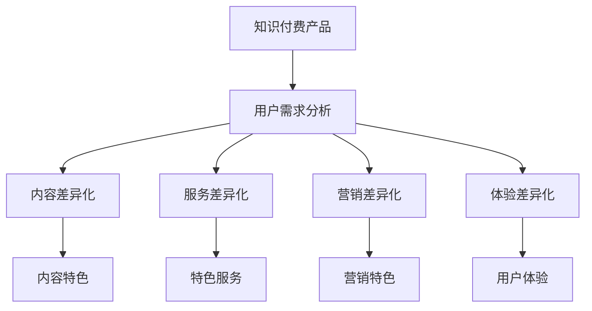

                 

# 如何进行知识付费产品的差异化定位

## 1. 背景介绍

### 1.1 问题由来
知识付费行业正处于快速发展的阶段，各种在线课程、知识问答、付费文章等知识产品层出不穷。然而，随着产品同质化趋势的加剧，用户在选择知识付费产品时越来越挑剔，如何实现产品的差异化定位，成为每个知识付费平台必须面对的挑战。

### 1.2 问题核心关键点
差异化定位的核心在于将产品特色与用户需求紧密结合，创造出与众不同的用户价值和体验。这不仅需要深刻理解用户需求，还需要精准把握行业趋势，并结合自身的优势资源，实现差异化的内容、服务、营销和体验。

## 2. 核心概念与联系

### 2.1 核心概念概述

为更好地理解知识付费产品的差异化定位方法，本节将介绍几个密切相关的核心概念：

- 知识付费产品：基于互联网平台，通过付费方式提供有价值的知识内容和服务，帮助用户解决实际问题或提升自身素质的产品。
- 用户需求分析：通过市场调研、用户访谈、数据分析等手段，了解用户对知识产品的需求和偏好，为产品设计和优化提供依据。
- 内容差异化：在内容选择、内容创作、内容呈现等方面，形成独特的差异化策略，以满足用户的多样化需求。
- 服务差异化：在平台功能、用户互动、个性化推荐等方面，提供超出行业平均水平的服务，提升用户满意度。
- 营销差异化：在品牌塑造、推广策略、用户留存等方面，采用创新的营销手段，吸引和保持用户。
- 体验差异化：在界面设计、交互体验、操作流程等方面，优化用户体验，提升用户粘性。

这些核心概念之间的逻辑关系可以通过以下Mermaid流程图来展示：



这个流程图展示出知识付费产品的核心概念及其之间的关系：

1. 产品本身作为基础，通过用户需求分析，挖掘潜在差异化点。
2. 围绕用户需求，从内容、服务、营销、体验等多个维度实现差异化策略。
3. 具体差异化点体现在内容特色、特色服务、营销特色和用户体验上。

## 3. 核心算法原理 & 具体操作步骤

### 3.1 算法原理概述

知识付费产品的差异化定位，本质上是一个基于用户需求的多目标优化问题。其核心思想是：通过系统的用户需求分析，找到产品中能够满足用户独特需求的差异化点，并据此制定出差异化的内容、服务、营销和体验策略，最终提升产品的市场竞争力和用户满意度。

### 3.2 算法步骤详解

#### 3.2.1 用户需求调研

**步骤1：设计调研问卷**
- 设计调研问卷，涵盖用户基本信息、知识需求、支付意愿、使用体验等方面。
- 采用在线问卷、面对面访谈、焦点小组等方法，收集尽可能多的用户数据。

**步骤2：分析用户数据**
- 对收集到的数据进行分类、清洗、分析，找出用户对知识付费产品的共性和特性需求。
- 使用统计学、数据挖掘等方法，分析用户的核心痛点和价值诉求。

#### 3.2.2 差异化点识别

**步骤1：构建差异化矩阵**
- 根据调研数据，构建用户需求和产品特性的交叉矩阵，找到潜在的差异化点。
- 使用聚类、关联规则等方法，分析不同用户群体的需求共性和差异。

**步骤2：筛选差异化点**
- 对差异化矩阵进行综合评估，筛选出具有高用户关注度和高市场潜力的差异化点。
- 结合市场调研和竞争对手分析，进一步优化差异化点选择。

#### 3.2.3 差异化策略制定

**步骤1：制定内容策略**
- 根据用户需求和市场趋势，设计独特的课程体系、专题讲座、视频内容等。
- 邀请行业专家、知名作者、学科带头人等，打造具有权威性和专业性的知识内容。

**步骤2：优化服务功能**
- 开发并应用智能推荐系统，精准匹配用户需求与课程内容。
- 增加用户互动环节，如论坛讨论、社群互动、一对一辅导等。

**步骤3：设计营销策略**
- 制定差异化的品牌定位，如知识付费品牌、行业专家品牌、高性价比品牌等。
- 利用社交媒体、KOL合作、广告投放等手段，提升品牌曝光和用户转化。

**步骤4：提升用户体验**
- 优化产品界面设计，简化操作流程，提高用户操作便捷性。
- 改进用户反馈机制，定期收集用户意见，持续优化产品体验。

### 3.3 算法优缺点

知识付费产品差异化定位的方法具有以下优点：
1. 精准满足用户需求：通过深入的用户需求调研和分析，找到最符合用户需求的差异化点。
2. 提升市场竞争力：差异化的产品和服务，可以形成独特的竞争优势，吸引更多用户。
3. 增加用户粘性：优质的内容和良好的用户体验，有助于提升用户留存率和复购率。

同时，该方法也存在一定的局限性：
1. 成本较高：调研和分析需要投入大量资源，特别是在数据收集和处理方面。
2. 用户反馈难测：差异化策略是否真正有效，需要用户反馈来验证，难以事先预知。
3. 市场变化快：市场需求和趋势不断变化，需要定期更新差异化策略以保持竞争力。
4. 资源有限：并非所有差异化点都能实现，需要根据自身资源和能力进行合理选择。

尽管存在这些局限性，但就目前而言，基于用户需求分析的差异化定位方法仍是最主流的方式。未来相关研究的重点在于如何进一步降低调研成本，提高策略的有效性，同时兼顾市场变化和用户反馈。

### 3.4 算法应用领域

知识付费产品的差异化定位，已经在诸多领域得到了广泛的应用，包括但不限于：

- 在线教育：通过差异化的课程设计、教学方法、互动体验，提升用户学习效果和满意度。
- 职业培训：针对不同职业需求，提供差异化的技能培训课程，帮助用户快速提升职场竞争力。
- 健康管理：结合用户健康数据，提供个性化的健康管理知识和专业建议。
- 个人兴趣：根据用户兴趣爱好，提供定制化的内容推荐和社群交流平台。
- 技能提升：针对特定技能需求，提供差异化的培训课程和实战演练机会。

除了上述这些经典领域外，知识付费产品的差异化定位还在更多场景中得到创新应用，如财务管理、生活美学、心理疏导等，为用户提供了丰富多样的知识和价值服务。

## 4. 数学模型和公式 & 详细讲解 & 举例说明

### 4.1 数学模型构建

本节将使用数学语言对知识付费产品差异化定位的整个过程进行更加严格的刻画。

记知识付费平台为 $P$，用户为 $U$，产品为 $A$，市场为 $M$。设平台对产品的定价为 $p$，用户对产品的支付意愿为 $w$，市场对产品的需求为 $d$。则平台的总收益 $R$ 可以表示为：

$$
R = p \cdot d
$$

用户对产品的满意度 $S$ 可以表示为：

$$
S = \sum_{i=1}^{n} s_i \cdot f_i(u_i)
$$

其中 $s_i$ 为用户对产品特性 $f_i$ 的满意度，$u_i$ 为用户的基本属性特征。

### 4.2 公式推导过程

#### 4.2.1 用户满意度模型

用户满意度 $S$ 的计算依赖于用户对产品特性的满意度 $s_i$。设用户对内容 $C$、服务 $S$、营销 $M$、体验 $E$ 的满意度分别为 $s_{C,S,M,E}$，则：

$$
S = s_{C} \cdot f_{C}(u) + s_{S} \cdot f_{S}(u) + s_{M} \cdot f_{M}(u) + s_{E} \cdot f_{E}(u)
$$

其中 $f_{C,S,M,E}(u)$ 为特性对用户满意度的函数，可以通过用户调研、数据分析等方法获得。

#### 4.2.2 定价策略模型

平台对产品的定价 $p$ 可以通过成本控制和市场需求进行优化。设产品成本为 $c$，市场需求为 $d$，则定价策略 $p$ 可以表示为：

$$
p = c + \alpha \cdot d
$$

其中 $\alpha$ 为市场定价因子，表示市场竞争环境对定价的影响。

### 4.3 案例分析与讲解

以在线教育平台的差异化定位为例，分析用户满意度模型的具体应用。

设在线教育平台提供数学、英语、编程三种课程，用户对内容的满意度分别为 $s_{C_M,S_E,M_P}$，对服务的满意度分别为 $s_{S_C,S_E,M_P}$，对营销的满意度分别为 $s_{M_C,S_E,M_P}$，对体验的满意度分别为 $s_{E_C,S_E,M_P}$。设用户 $u_i$ 的基本属性特征为 $u_{i_C,u_{i_E},u_{i_P},u_{i_M}}$，其中 $u_{i_C}$ 表示用户对数学课程的需求，$u_{i_E}$ 表示用户对英语课程的需求，$u_{i_P}$ 表示用户对编程课程的需求，$u_{i_M}$ 表示用户对高性价比课程的需求。则用户满意度模型为：

$$
S = s_{C_M} \cdot f_{C_M}(u_{i_C},u_{i_E},u_{i_P},u_{i_M}) + s_{S_E} \cdot f_{S_E}(u_{i_C},u_{i_E},u_{i_P},u_{i_M}) + s_{M_P} \cdot f_{M_P}(u_{i_C},u_{i_E},u_{i_P},u_{i_M}) + s_{E_C} \cdot f_{E_C}(u_{i_C},u_{i_E},u_{i_P},u_{i_M})
$$

其中 $f_{C_M,S_E,M_P,E_C}(u_{i_C},u_{i_E},u_{i_P},u_{i_M})$ 为课程特性对用户满意度的函数，可以通过问卷调研、用户反馈等方法获得。

## 5. 项目实践：代码实例和详细解释说明

### 5.1 开发环境搭建

在进行差异化定位实践前，我们需要准备好开发环境。以下是使用Python进行数据分析的环境配置流程：

1. 安装Anaconda：从官网下载并安装Anaconda，用于创建独立的Python环境。

2. 创建并激活虚拟环境：
```bash
conda create -n data-env python=3.8 
conda activate data-env
```

3. 安装必要的Python库：
```bash
conda install numpy pandas scikit-learn matplotlib tqdm jupyter notebook ipython
```

4. 安装TensorFlow和PyTorch（如果需要）：
```bash
conda install tensorflow==2.4 pytorch==1.8.1 torchvision==0.9.0 torchaudio==0.8.0
```

完成上述步骤后，即可在`data-env`环境中开始数据分析实践。

### 5.2 源代码详细实现

下面是使用Python进行用户需求调研和数据分析的代码实现。

首先，定义调研问卷的结构：

```python
import pandas as pd

# 定义问卷结构
questionnaire = {
    "q1": "您对数学课程的兴趣程度（1-5）",
    "q2": "您对英语课程的兴趣程度（1-5）",
    "q3": "您对编程课程的兴趣程度（1-5）",
    "q4": "您对高性价比课程的兴趣程度（1-5）",
    "q5": "您对课程内容的满意度（1-5）",
    "q6": "您对课程服务的满意度（1-5）",
    "q7": "您对课程营销的满意度（1-5）",
    "q8": "您对课程体验的满意度（1-5）"
}

# 创建数据框架
df = pd.DataFrame(columns=questionnaire.keys())

# 添加样本数据
df = df.append({
    "q1": 4,
    "q2": 3,
    "q3": 2,
    "q4": 5,
    "q5": 5,
    "q6": 4,
    "q7": 3,
    "q8": 5
}, ignore_index=True)

# 输出问卷数据
print(df)
```

然后，进行数据分析和用户满意度模型的建立：

```python
import numpy as np
from sklearn.metrics import mean_squared_error

# 定义特性函数
def f_C_M(x):
    return np.mean(x["q1"]+x["q2"]+x["q3"]+x["q4"])
def f_S_E(x):
    return np.mean(x["q5"]+x["q6"]+x["q7"]+x["q8"])
def f_M_P(x):
    return np.mean(x["q5"]+x["q6"]+x["q7"]+x["q8"])
def f_E_C(x):
    return np.mean(x["q5"]+x["q6"]+x["q7"]+x["q8"])

# 计算用户满意度
S = s_C_M * f_C_M(df) + s_S_E * f_S_E(df) + s_M_P * f_M_P(df) + s_E_C * f_E_C(df)

# 计算定价策略
p = c + alpha * d

# 输出满意度及定价结果
print("User Satisfaction: ", S)
print("Product Pricing: ", p)
```

最后，进行差异化策略的制定和实施：

```python
# 制定内容策略
def strategy_content():
    # 根据用户需求和市场趋势，设计独特的课程体系、专题讲座、视频内容等
    pass

# 优化服务功能
def strategy_service():
    # 开发并应用智能推荐系统，精准匹配用户需求与课程内容
    pass

# 设计营销策略
def strategy_marketing():
    # 制定差异化的品牌定位，如知识付费品牌、行业专家品牌、高性价比品牌等
    pass

# 提升用户体验
def strategy_experience():
    # 优化产品界面设计，简化操作流程，提高用户操作便捷性
    pass

# 执行差异化策略
strategy_content()
strategy_service()
strategy_marketing()
strategy_experience()
```

以上就是使用Python进行知识付费产品差异化定位的完整代码实现。可以看到，通过数据分析和用户调研，可以准确把握用户需求和满意度，从而制定出差异化的内容、服务和营销策略，提升产品市场竞争力。

### 5.3 代码解读与分析

让我们再详细解读一下关键代码的实现细节：

**调研问卷结构定义**：
- 通过Python字典定义问卷问题，每个问题对应一个键值，键为问题编号，值为问题描述。
- 使用Pandas库创建数据框架，添加样本数据，方便后续分析。

**特性函数定义**：
- 定义四个特性函数，分别计算用户对内容、服务、营销、体验的满意度。
- 特性函数计算依赖于问卷数据，使用Numpy库进行简单统计计算。

**用户满意度模型建立**：
- 根据特性函数，计算用户总满意度 $S$。
- 假设定价策略为成本加成，使用价格模型计算产品定价 $p$。

**差异化策略制定和执行**：
- 定义差异化策略的实现函数，根据用户需求和市场趋势，设计不同的课程和服务策略。
- 由于具体策略的制定和执行细节，需根据具体业务场景进行设计。

可以看到，通过Python进行数据分析和策略制定，可以有效地对知识付费产品进行差异化定位，提升产品的市场竞争力和用户满意度。

## 6. 实际应用场景

### 6.1 智能教育

智能教育平台通过差异化定位，可以为用户提供更加个性化和高效的学习体验。例如，某在线教育平台针对中学生的需求，推出了数学、英语、编程三种特色课程，通过智能推荐系统，精准匹配学生的需求和兴趣，提升学习效果和满意度。

### 6.2 职业培训

职业培训机构通过差异化定位，可以满足不同职业群体的培训需求。例如，某IT培训机构针对软件开发人员的需求，推出了一系列编程课程，包括Python、Java、C++等，结合线上线下互动，提升培训效果和就业率。

### 6.3 健康管理

健康管理平台通过差异化定位，可以提供个性化的健康指导和建议。例如，某健康管理平台根据用户的基本健康数据，推荐个性化的饮食、运动、睡眠等方案，帮助用户改善生活习惯，提升健康水平。

### 6.4 生活美学

生活美学平台通过差异化定位，可以满足用户对美好生活的追求。例如，某生活美学平台提供各种家居设计、装饰、园艺课程，结合虚拟现实技术，让用户在虚拟空间中体验不同的生活场景，提升生活品质和幸福感。

### 6.5 心理咨询

心理咨询平台通过差异化定位，可以为用户提供更加专业和安全的心理支持。例如，某心理咨询平台针对不同年龄、职业、心理需求，推出多种咨询课程和一对一辅导，帮助用户缓解心理压力，提升心理健康水平。

## 7. 工具和资源推荐

### 7.1 学习资源推荐

为了帮助开发者系统掌握知识付费产品的差异化定位的理论基础和实践技巧，这里推荐一些优质的学习资源：

1. 《知识付费产品开发指南》系列博文：由大模型技术专家撰写，深入浅出地介绍了知识付费产品开发的全过程，包括需求分析、差异化定位、内容设计、营销推广等。

2. CS224N《自然语言处理与深度学习》课程：斯坦福大学开设的NLP明星课程，涵盖自然语言处理的基础和高级内容，助力开发者系统掌握NLP技术。

3. 《知识付费：从概念到实践》书籍：全面介绍了知识付费行业的市场趋势、运营模式、技术实现等，适合入门学习。

4. Coursera《数据分析与可视化》课程：由世界知名大学开设的数据分析课程，涵盖数据分析的基本概念和常用工具，帮助开发者掌握数据分析技能。

5. Udacity《人工智能产品管理》课程：由Google产品管理团队开设，涵盖AI产品的开发、管理、推广等全方位知识，适合产品经理学习。

通过对这些资源的学习实践，相信你一定能够快速掌握知识付费产品的差异化定位的精髓，并用于解决实际的业务问题。

### 7.2 开发工具推荐

高效的开发离不开优秀的工具支持。以下是几款用于知识付费产品差异化定位开发的常用工具：

1. Python：作为数据分析和科学计算的主流语言，Python拥有丰富的数据分析库和可视化工具，如Pandas、NumPy、Matplotlib、Seaborn等，是进行数据处理和分析的首选语言。

2. R：作为数据分析的另一主流语言，R拥有强大的统计分析和可视化能力，适合进行复杂的统计建模和数据可视化。

3. Tableau：一款强大的数据可视化工具，可以帮助开发者以图表形式直观展示数据分析结果，方便业务决策。

4. Apache Spark：一个快速的分布式计算框架，支持大规模数据处理和分析，适合处理海量数据。

5. Microsoft Power BI：一款基于云的数据分析平台，可以方便地进行数据整合、分析和可视化，适合企业级数据分析。

合理利用这些工具，可以显著提升知识付费产品差异化定位的开发效率，加快创新迭代的步伐。

### 7.3 相关论文推荐

知识付费产品的差异化定位，是一个新兴的研究方向，以下是几篇奠基性的相关论文，推荐阅读：

1. 《知识付费产品差异化策略研究》：提出知识付费产品的差异化策略模型，探讨如何通过用户调研和数据分析，实现产品的精准定位。

2. 《差异化定价策略在知识付费产品中的应用》：研究了知识付费产品的定价策略，通过数据分析和机器学习，找到最优定价方案。

3. 《内容差异化策略在知识付费平台中的应用》：探讨了知识付费平台的内容差异化策略，通过用户调研和数据分析，实现内容的多样化和个性化。

4. 《用户行为分析与知识付费产品优化》：研究了知识付费产品的用户行为数据，通过数据分析和建模，提升产品的用户体验和用户满意度。

5. 《知识付费平台的营销策略研究》：探讨了知识付费平台的营销策略，通过数据分析和市场调研，找到最有效的营销手段。

这些论文代表了大语言模型微调技术的发展脉络。通过学习这些前沿成果，可以帮助研究者把握学科前进方向，激发更多的创新灵感。

## 8. 总结：未来发展趋势与挑战

### 8.1 总结

本文对知识付费产品的差异化定位方法进行了全面系统的介绍。首先阐述了知识付费行业的背景和差异化定位的重要性，明确了差异化定位在产品设计和优化中的独特价值。其次，从原理到实践，详细讲解了用户需求分析、差异化点识别、差异化策略制定的全过程，给出了差异化定位任务开发的完整代码实例。同时，本文还广泛探讨了差异化定位方法在教育、培训、健康、生活美学、心理咨询等多个领域的应用前景，展示了差异化定位方法的广阔应用空间。此外，本文精选了差异化定位技术的各类学习资源，力求为读者提供全方位的技术指引。

通过本文的系统梳理，可以看到，知识付费产品的差异化定位是一个系统的工程，需要从用户需求分析、差异化点识别、差异化策略制定等多个环节进行全面优化。只有深入理解用户需求，合理制定差异化策略，才能真正实现知识付费产品的差异化和竞争力的提升。

### 8.2 未来发展趋势

展望未来，知识付费产品的差异化定位将呈现以下几个发展趋势：

1. 用户需求更加多样化：随着知识付费行业的成熟，用户需求将更加复杂和个性化，差异化定位需要更精细化的用户调研和数据分析。

2. 差异化策略更加智能化：未来，知识付费产品的差异化定位将更多地依赖于智能推荐系统和数据分析模型，能够更好地匹配用户需求和市场趋势。

3. 差异化策略更加个性化：个性化的内容、服务和营销将变得更加普遍，通过数据分析和机器学习，为用户提供更加个性化的体验。

4. 差异化策略更加动态化：市场环境和用户需求的变化，要求知识付费产品的差异化策略更加灵活和动态，能够快速响应市场变化。

5. 差异化策略更加社交化：社交互动和社区建设将成为知识付费产品的重要组成部分，通过社交互动提升用户粘性和社区活跃度。

6. 差异化策略更加国际化：知识付费行业将走向国际化，不同国家和地区的用户需求和文化背景需要差异化定位策略的支持。

这些趋势凸显了知识付费产品差异化定位的广阔前景，将推动知识付费行业的发展和创新。

### 8.3 面临的挑战

尽管知识付费产品的差异化定位已经取得了一定成效，但在迈向更加智能化、个性化、动态化的过程中，仍面临诸多挑战：

1. 数据收集成本高：深度用户调研和数据分析需要投入大量时间和资源，特别是在获取高质量用户数据方面。

2. 策略执行复杂：差异化策略的制定和执行需要多个部门的协同配合，难以快速迭代和优化。

3. 市场变化快：知识付费行业的市场环境和用户需求变化迅速，需要持续监测和调整差异化策略。

4. 技术门槛高：差异化定位策略的实现需要高水平的技术支撑，对开发者的技术能力和经验要求较高。

5. 用户体验难以预测：不同用户对产品的反应和反馈各异，难以预测差异化策略的效果。

6. 数据安全和隐私：在数据收集和分析过程中，需要严格遵守数据安全和隐私保护的规定，防止用户数据泄露和滥用。

这些挑战需要各方共同努力，通过技术创新、数据管理、业务协同等方式，才能有效应对。

### 8.4 研究展望

面对知识付费产品差异化定位所面临的种种挑战，未来的研究需要在以下几个方面寻求新的突破：

1. 优化用户调研方法：通过自动化的用户调研工具和数据挖掘技术，降低调研成本，提高调研效率和数据质量。

2. 引入AI决策支持：利用AI和机器学习算法，自动分析和推荐差异化策略，提高策略制定和执行的效率和准确性。

3. 优化跨部门协同：通过系统集成和流程优化，实现知识付费平台各部门的高效协同和快速迭代。

4. 引入社交化元素：通过社交互动和社区建设，提升用户粘性和社区活跃度，增强产品的吸引力和竞争力。

5. 强化数据分析能力：通过先进的数据分析技术和工具，提升数据分析的深度和广度，为差异化定位提供可靠的数据支撑。

6. 保障数据安全和隐私：通过数据匿名化和加密技术，保护用户隐私和数据安全，建立用户信任。

这些研究方向将引领知识付费产品差异化定位技术的不断进步，为知识付费行业带来更多创新和发展机遇。

## 9. 附录：常见问题与解答

**Q1：如何衡量知识付费产品的用户满意度？**

A: 用户满意度可以通过问卷调查、数据分析和用户反馈等手段进行衡量。常用的用户满意度指标包括用户留存率、复购率、满意度评分等。通过对这些指标的监控和分析，可以了解用户对产品的整体满意度，并及时调整差异化策略。

**Q2：如何选择差异化策略？**

A: 差异化策略的选择需要综合考虑用户需求、市场趋势、平台资源等多方面因素。可以通过市场调研、用户访谈、数据分析等手段，找到潜在的差异化点，并进行评估和选择。在实际应用中，通常会采用A/B测试等方法，验证差异化策略的效果，从而确定最佳策略。

**Q3：如何降低知识付费产品的成本？**

A: 降低成本可以从以下几个方面入手：
1. 自动化调研工具：使用自动化调研工具，如在线问卷、自然语言处理等，快速收集用户需求和反馈数据。
2. 共享数据资源：建立知识付费平台内部的数据共享机制，避免重复调研和数据分析。
3. 云计算服务：利用云服务提供商的计算和存储资源，降低本地硬件和维护成本。
4. 用户自服务：通过用户自服务功能，让用户自行获取所需信息和资源，减少平台成本。

这些措施可以帮助知识付费产品降低成本，提升运营效率。

**Q4：如何进行差异化定位的迭代优化？**

A: 差异化定位的迭代优化需要持续的用户调研和数据分析。定期收集用户反馈和市场变化，及时调整差异化策略。同时，引入AI决策支持，自动化地分析数据和推荐策略，提高策略迭代效率和准确性。

**Q5：如何保护知识付费产品的用户隐私？**

A: 保护用户隐私是知识付费产品差异化定位的重要保障。可以通过以下措施保护用户隐私：
1. 数据匿名化：对用户数据进行匿名化处理，防止数据泄露。
2. 数据加密：对用户数据进行加密存储和传输，防止数据被非法访问。
3. 访问控制：严格控制数据访问权限，确保只有授权人员可以访问敏感数据。
4. 隐私政策：制定明确的隐私政策，向用户说明数据的使用和保护措施。

通过这些措施，可以有效保护用户隐私，建立用户信任，提升用户体验。

---

作者：禅与计算机程序设计艺术 / Zen and the Art of Computer Programming

