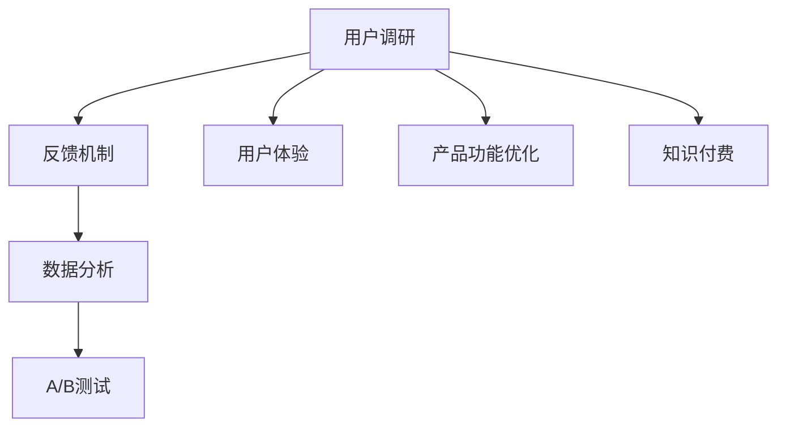

                 

# 如何进行知识付费的用户调研与反馈

> 关键词：知识付费, 用户调研, 反馈机制, 用户体验, 数据分析

## 1. 背景介绍

### 1.1 问题由来

知识付费作为一种新兴的学习方式，近年来在全球范围内迅速崛起。然而，尽管知识付费平台数量众多，但真正能满足用户需求的平台却屈指可数。用户流失率高、付费转化率低等问题普遍存在，导致大量平台陷入困境。如何通过有效的用户调研与反馈机制，提升用户体验，提高平台粘性，成为了知识付费领域亟需解决的痛点问题。

### 1.2 问题核心关键点

面对知识付费领域这一核心问题，我们的调研重点主要包括：
1. 用户真实需求：了解用户对知识付费平台的具体需求和痛点。
2. 用户使用体验：分析用户在使用平台时的各项行为数据，找出问题所在。
3. 产品功能优化：针对调研发现的问题，提出优化建议，改进产品功能。
4. 用户满意度提升：通过持续的反馈机制，不断调整产品策略，提升用户满意度。
5. 数据驱动决策：利用数据分析技术，制定精准的市场策略，指导产品迭代。

## 2. 核心概念与联系

### 2.1 核心概念概述

为更好地理解如何进行知识付费的用户调研与反馈，本节将介绍几个密切相关的核心概念：

- 知识付费：用户支付一定的费用，获取知识产品（如课程、文章、音频、视频等）的消费模式。知识付费旨在通过付费机制，筛选出有支付意愿的真正学习用户，提升学习效率和质量。

- 用户调研：通过问卷调查、访谈、焦点小组等形式，获取用户关于产品体验、需求和反馈的信息，用于指导产品设计和优化。

- 反馈机制：构建用户反馈渠道，及时收集用户使用平台过程中遇到的问题和建议，并进行改进优化。

- 用户体验：用户在使用产品过程中产生的整体体验感受，包括使用便捷性、内容质量、支付安全等方面。

- 数据分析：通过收集、整理和分析用户行为数据，发现用户使用习惯和需求变化，为产品优化提供依据。

- A/B测试：通过对比不同版本的产品，获取用户的反馈，优化产品功能。

这些核心概念之间的逻辑关系可以通过以下Mermaid流程图来展示：



这个流程图展示了几大核心概念之间的关系：

1. 用户调研通过收集用户信息，分析用户体验，指导产品功能优化和改进。
2. 反馈机制构建用户反馈渠道，实时收集用户使用中的问题和建议。
3. 数据分析通过分析用户行为数据，发现用户需求变化，优化产品策略。
4. A/B测试通过对比不同版本的产品，获取用户反馈，进一步改进产品。
5. 产品功能优化根据调研和数据分析结果，调整产品功能，提升用户体验。
6. 知识付费是用户调研和反馈机制的应用场景，需要通过用户调研和反馈不断优化，才能取得良好的效果。

## 3. 核心算法原理 & 具体操作步骤

### 3.1 算法原理概述

知识付费领域用户调研与反馈的原理可以归纳为以下几个步骤：

1. 定义调研目标：明确调研的具体目标，如了解用户需求、评估产品体验、收集用户反馈等。
2. 设计调研方法：选择适合的调研方法，如问卷调查、用户访谈、A/B测试等。
3. 收集数据：使用设计好的方法，广泛收集用户数据，包括定量数据（如用户数量、使用频率等）和定性数据（如用户反馈、意见等）。
4. 分析数据：对收集到的数据进行分析，提取有用信息，形成分析报告。
5. 制定优化策略：根据分析报告，制定产品优化和改进策略。
6. 实施反馈机制：构建并实施反馈渠道，收集用户持续反馈，实时调整产品策略。
7. 持续优化产品：根据用户反馈，不断迭代产品功能，提高用户体验和满意度。

### 3.2 算法步骤详解

#### 3.2.1 调研目标定义

调研目标应具体明确，根据不同阶段的需求进行设定。例如：

- 初期调研目标：了解用户对平台的整体认知和需求，评估产品的市场竞争力。
- 功能优化调研目标：收集用户对具体功能模块的反馈，指导功能改进和迭代。
- 用户体验调研目标：分析用户在特定场景下的使用体验，找出优化方向。

#### 3.2.2 调研方法设计

调研方法应根据调研目标进行选择，常见的方法包括：

- 问卷调查：设计在线问卷，通过定量形式收集用户数据。
- 用户访谈：通过面对面的深度访谈，获取用户的详细反馈。
- 焦点小组：组织一组用户进行小组讨论，获取广泛而深入的意见。
- A/B测试：设计不同版本的产品，进行对比测试，评估不同版本的效果。

#### 3.2.3 数据收集

调研方法设计好后，应广泛收集用户数据。常见的数据收集方式包括：

- 问卷调查：通过在线平台或社交媒体发布问卷，获取用户响应数据。
- 用户访谈：在特定时间段内组织访谈，面对面获取用户反馈。
- 焦点小组：邀请目标用户参加焦点小组，进行讨论和记录。
- A/B测试：在线平台上随机分配用户，测试不同版本的效果。

#### 3.2.4 数据分析

数据收集完成后，需要对数据进行整理和分析。常见的数据分析方法包括：

- 统计分析：对问卷调查结果进行统计分析，找出用户需求和痛点。
- 文本分析：对用户反馈文本进行情感分析，评估用户情绪和满意度。
- 数据可视化：使用数据可视化工具，展示用户行为和需求变化。

#### 3.2.5 制定优化策略

数据分析完成后，根据分析结果制定产品优化策略。常见策略包括：

- 功能改进：根据用户需求和反馈，调整和优化产品功能。
- 用户体验优化：提升产品使用便捷性和内容质量，增强用户粘性。
- 安全措施：加强平台安全性和隐私保护，提升用户信任感。

#### 3.2.6 实施反馈机制

制定优化策略后，应构建并实施用户反馈渠道。常见方式包括：

- 在线反馈平台：在平台上设置反馈按钮或渠道，方便用户随时提交意见和建议。
- 定期访谈：定期与部分用户进行深度访谈，获取详细信息。
- 社交媒体：通过社交媒体平台收集用户反馈，并及时回复和处理。

#### 3.2.7 持续优化产品

反馈机制实施后，应持续收集用户反馈，不断迭代优化产品。常见方法包括：

- 定期调研：定期进行用户调研，了解用户需求和体验变化。
- 数据分析：利用数据分析技术，实时监测用户行为变化，及时调整策略。
- 功能迭代：根据用户反馈和数据分析结果，进行产品功能的迭代优化。

### 3.3 算法优缺点

知识付费领域用户调研与反馈方法的优势包括：

1. 目标明确：调研目标设定清晰，针对性强，能够有效获取用户真实需求。
2. 数据丰富：通过多种调研方法，收集大量定量定性数据，提高分析准确性。
3. 反馈及时：实时收集用户反馈，快速响应和调整产品策略，提升用户体验。
4. 数据驱动：数据分析和反馈机制的结合，使产品优化更精准，更具科学性。

但该方法也存在以下局限性：

1. 成本较高：调研和数据收集需要投入大量人力和物力资源，成本较高。
2. 用户参与度有限：用户参与调研的意愿和积极性有限，可能影响调研结果的代表性。
3. 调研方法单一：调研方法的选择可能受限于实际情况，难以全面覆盖所有用户。
4. 数据质量问题：数据收集和分析过程中可能存在数据不完整、不规范等问题。
5. 反馈渠道单一：反馈渠道的实施和维护需要持续投入，可能存在响应不及时的问题。

尽管如此，通过科学设计和合理实施用户调研与反馈机制，依然能够有效提升知识付费平台的用户体验和满意度，为平台的发展奠定坚实基础。

### 3.4 算法应用领域

知识付费领域用户调研与反馈方法的应用场景广泛，涉及多个方面，例如：

- 产品功能设计：通过用户调研了解用户需求，指导产品功能设计。
- 用户体验优化：收集用户反馈，改进产品界面和使用流程，提升用户体验。
- 市场策略调整：通过数据分析和用户调研，制定精准的市场推广策略。
- 服务质量提升：实时收集用户反馈，优化服务质量，提升用户满意度。
- 技术改进：通过用户调研和反馈，发现技术问题，指导技术优化和改进。

## 4. 数学模型和公式 & 详细讲解 & 举例说明

### 4.1 数学模型构建

知识付费领域用户调研与反馈的数学模型可以构建为以下形式：

设用户调研目标为 $T$，调研方法为 $M$，数据收集方法为 $C$，数据分析方法为 $A$，优化策略为 $S$，反馈机制为 $F$，产品优化效果为 $P$。

则调研与反馈过程可以表示为：

$$
P = f(T, M, C, A, S, F)
$$

其中 $f$ 为函数映射关系，表示通过调研目标、调研方法、数据收集、数据分析、优化策略和反馈机制，映射出产品优化效果。

### 4.2 公式推导过程

#### 4.2.1 调研目标 $T$

调研目标 $T$ 可以细分为多个具体目标，如用户需求分析、产品功能评估、用户体验优化等。假设调研目标为 $T$，则可以表示为：

$$
T = \{需求分析, 功能评估, 用户体验优化\}
$$

#### 4.2.2 调研方法 $M$

调研方法 $M$ 有多种，如问卷调查、用户访谈、焦点小组等。假设调研方法为 $M$，则可以表示为：

$$
M = \{问卷调查, 用户访谈, 焦点小组\}
$$

#### 4.2.3 数据收集方法 $C$

数据收集方法 $C$ 主要依赖于调研方法 $M$。假设数据收集方法为 $C$，则可以表示为：

$$
C = M \rightarrow \{问卷数据, 访谈记录, 焦点小组讨论记录\}
$$

#### 4.2.4 数据分析方法 $A$

数据分析方法 $A$ 主要依赖于数据收集方法 $C$。假设数据分析方法为 $A$，则可以表示为：

$$
A = C \rightarrow \{统计分析, 文本分析, 数据可视化\}
$$

#### 4.2.5 优化策略 $S$

优化策略 $S$ 主要依赖于数据分析结果 $A$。假设优化策略为 $S$，则可以表示为：

$$
S = A \rightarrow \{功能改进, 用户体验优化, 安全措施加强\}
$$

#### 4.2.6 反馈机制 $F$

反馈机制 $F$ 主要依赖于优化策略 $S$ 和产品优化效果 $P$。假设反馈机制为 $F$，则可以表示为：

$$
F = S \rightarrow \{在线反馈平台, 定期访谈, 社交媒体\}
$$

#### 4.2.7 产品优化效果 $P$

产品优化效果 $P$ 主要依赖于优化策略 $S$ 和反馈机制 $F$。假设产品优化效果为 $P$，则可以表示为：

$$
P = S \rightarrow \{用户满意度提升, 产品功能优化, 用户体验改善\}
$$

### 4.3 案例分析与讲解

#### 4.3.1 用户调研案例

某知识付费平台通过问卷调查、用户访谈和焦点小组等方式，收集了大量用户数据。问卷调查结果显示，用户对平台的整体满意度较低，主要集中在课程内容质量和服务体验上。用户访谈和焦点小组讨论进一步发现，课程内容不够实用，缺乏系统性和深度，服务体验也不够顺畅，用户体验整体较差。

#### 4.3.2 数据分析案例

通过对问卷调查、访谈记录和焦点小组讨论数据的分析，平台发现以下问题：

1. 课程内容质量：用户对课程内容的实用性、深度和系统性均有较高要求，现有课程难以满足。
2. 服务体验问题：用户在使用过程中遇到支付失败、课程播放卡顿等问题，影响用户体验。
3. 用户反馈处理：用户对平台提供的反馈渠道满意度较低，反馈信息处理不及时。

#### 4.3.3 优化策略案例

针对数据分析结果，平台制定了以下优化策略：

1. 内容优化：增加课程内容的质量和深度，引入更多行业专家授课，提高课程的实用性和系统性。
2. 用户体验改进：优化支付和播放流程，提升平台的服务质量，增加人工客服支持，改善用户体验。
3. 反馈机制加强：建立更加及时、有效的用户反馈机制，增加用户满意度，提升平台的用户粘性。

#### 4.3.4 反馈机制案例

平台实施了以下反馈机制：

1. 在线反馈平台：在平台上增加用户反馈按钮，方便用户随时提交意见和建议。
2. 定期访谈：每月邀请部分用户进行深度访谈，获取详细信息。
3. 社交媒体：通过社交媒体平台收集用户反馈，并及时回复和处理。

## 5. 项目实践：代码实例和详细解释说明

### 5.1 开发环境搭建

在进行知识付费用户调研与反馈的项目实践前，我们需要准备好开发环境。以下是使用Python进行项目实践的环境配置流程：

1. 安装Anaconda：从官网下载并安装Anaconda，用于创建独立的Python环境。

2. 创建并激活虚拟环境：
```bash
conda create -n knowledge-env python=3.8 
conda activate knowledge-env
```

3. 安装必要的Python库：
```bash
pip install pandas numpy matplotlib
```

4. 安装数据分析工具：
```bash
pip install scikit-learn statsmodels
```

5. 安装数据可视化工具：
```bash
pip install matplotlib seaborn
```

完成上述步骤后，即可在`knowledge-env`环境中开始项目实践。

### 5.2 源代码详细实现

下面是使用Python进行知识付费用户调研与反馈项目的代码实现：

首先，定义用户调研数据收集函数：

```python
import pandas as pd

def collect_data():
    # 问卷调查数据
    questionnaire_data = pd.read_csv('questionnaire_data.csv')
    
    # 用户访谈数据
    interview_data = pd.read_csv('interview_data.csv')
    
    # 焦点小组讨论数据
    focus_group_data = pd.read_csv('focus_group_data.csv')
    
    # 数据清洗和整合
    combined_data = pd.concat([questionnaire_data, interview_data, focus_group_data])
    combined_data = combined_data.drop_duplicates().reset_index(drop=True)
    
    return combined_data
```

然后，定义数据分析函数：

```python
def analyze_data(data):
    # 统计分析
    group_by_age = data.groupby('age').describe()
    group_by_age.to_csv('age_analysis.csv')
    
    # 文本分析
    sentiment_analysis(data['feedback'])
    
    # 数据可视化
    data['age'].hist(bins=10, figsize=(10, 6))
    plt.title('User Age Distribution')
    plt.xlabel('Age')
    plt.ylabel('Count')
    plt.show()
```

接着，定义优化策略制定函数：

```python
def optimize_strategy(data):
    # 需求分析
    demand_analysis = data.groupby('demand_type')['demand'].value_counts()
    demand_analysis.to_csv('demand_analysis.csv')
    
    # 功能评估
    function_assessment = data.groupby('function_type')['function'].value_counts()
    function_assessment.to_csv('function_analysis.csv')
    
    # 用户体验优化
    ux_optimization = data.groupby('ux_type')['ux'].value_counts()
    ux_optimization.to_csv('ux_analysis.csv')
    
    # 安全措施加强
    security_strengthen = data.groupby('security_type')['security'].value_counts()
    security_strengthen.to_csv('security_analysis.csv')
    
    return demand_analysis, function_assessment, ux_optimization, security_strengthen
```

最后，定义反馈机制实施函数：

```python
def implement_feedback(data):
    # 在线反馈平台
    online_feedback_platform(data['feedback'])
    
    # 定期访谈
    scheduled_interviews(data['feedback'])
    
    # 社交媒体
    social_media_feedback(data['feedback'])
```

完成上述步骤后，即可在`knowledge-env`环境中开始项目实践。

### 5.3 代码解读与分析

让我们再详细解读一下关键代码的实现细节：

**数据收集函数**：
- 定义了问卷调查、用户访谈和焦点小组讨论的数据收集函数。
- 将收集到的数据进行清洗和整合，形成最终的调研数据集。

**数据分析函数**：
- 对调研数据进行统计分析，如按年龄分组统计用户需求。
- 对用户反馈进行文本情感分析，评估用户满意度。
- 使用数据可视化工具，展示用户年龄分布等数据。

**优化策略制定函数**：
- 对调研数据进行需求、功能、用户体验和安全措施的统计分析。
- 生成需求分析、功能评估、用户体验优化和安全措施加强的报告。

**反馈机制实施函数**：
- 在平台上设置在线反馈按钮。
- 定期邀请部分用户进行深度访谈。
- 通过社交媒体平台收集用户反馈。

以上代码实现展示了从数据收集到反馈机制实施的完整流程，开发者可以根据具体需求进行进一步优化和扩展。

## 6. 实际应用场景

### 6.1 智能客服系统

知识付费平台可以结合智能客服系统，提升用户体验和满意度。通过用户调研与反馈机制，平台可以了解用户对智能客服的实际需求和体验，针对性地改进和优化客服系统。例如：

- 调研发现用户对智能客服的语音识别准确率低，可以通过改进模型和算法，提高语音识别准确率。
- 访谈发现用户对客服机器人的回答不够智能，可以通过增加自然语言处理能力，提升客服机器人的人性化水平。

### 6.2 金融知识服务

金融知识服务作为知识付费的一个重要方向，需要结合用户调研与反馈机制，优化产品体验和内容质量。通过用户调研，平台可以了解用户对金融知识的实际需求，针对性地设计课程和内容。例如：

- 调研发现用户对股票投资课程的需求较高，可以通过增加股市投资相关的课程，满足用户需求。
- 访谈发现用户对金融知识的实用性要求较高，可以通过增加实战案例和操作技巧，提高课程的实用性。

### 6.3 在线教育平台

在线教育平台也需要通过用户调研与反馈机制，提升课程质量和用户体验。通过用户调研，平台可以了解用户对课程内容的实际需求，针对性地优化课程设计。例如：

- 调研发现用户对编程课程的需求较高，可以通过增加编程相关的课程，满足用户需求。
- 访谈发现用户对编程课程的实用性要求较高，可以通过增加实战项目和案例，提高课程的实用性。

## 7. 工具和资源推荐

### 7.1 学习资源推荐

为了帮助开发者系统掌握知识付费领域用户调研与反馈的理论基础和实践技巧，这里推荐一些优质的学习资源：

1. 《用户体验设计》系列书籍：深入浅出地介绍了用户体验设计的核心概念和方法。
2. 《用户需求分析》课程：斯坦福大学开设的用户需求分析课程，介绍了用户调研的基本方法和技巧。
3. 《数据分析与统计》课程：Coursera上的数据分析课程，帮助用户掌握数据处理和统计分析的基本技能。
4. 《A/B测试》课程：Coursera上的A/B测试课程，介绍了A/B测试的原理和方法。
5. 《Python数据分析》书籍：全面介绍Python数据分析的基本工具和方法，适合初学者学习。

通过这些资源的学习，相信你一定能够快速掌握知识付费领域用户调研与反馈的精髓，并用于解决实际的业务问题。

### 7.2 开发工具推荐

高效的开发离不开优秀的工具支持。以下是几款用于知识付费用户调研与反馈开发的常用工具：

1. Python：开源且功能强大的编程语言，适合数据分析和算法开发。
2. Pandas：Python数据分析库，适合数据处理和统计分析。
3. NumPy：Python科学计算库，适合高效数学运算。
4. Scikit-learn：Python机器学习库，适合建模和预测分析。
5. Matplotlib：Python数据可视化库，适合制作图表和数据展示。
6. Jupyter Notebook：交互式编程环境，适合数据分析和模型开发。

合理利用这些工具，可以显著提升知识付费用户调研与反馈项目的开发效率，加快创新迭代的步伐。

### 7.3 相关论文推荐

知识付费领域用户调研与反馈技术的发展源于学界的持续研究。以下是几篇奠基性的相关论文，推荐阅读：

1. "A Framework for Conducting User Research in AI Applications"：介绍如何通过用户调研构建AI应用，提高用户满意度。
2. "A/B Testing for Better Business Decisions"：介绍A/B测试在产品优化中的重要性，如何通过A/B测试获得用户反馈。
3. "Understanding User Experience Through Qualitative Research"：介绍如何通过定性研究理解用户体验，发现用户需求。
4. "Data-Driven User Experience Design"：介绍如何通过数据分析提升用户体验，优化产品设计。
5. "User Feedback Management in AI Products"：介绍如何通过反馈机制管理用户反馈，持续优化产品。

这些论文代表了大语言模型微调技术的发展脉络。通过学习这些前沿成果，可以帮助研究者把握学科前进方向，激发更多的创新灵感。

## 8. 总结：未来发展趋势与挑战

### 8.1 总结

本文对知识付费领域用户调研与反馈方法进行了全面系统的介绍。首先阐述了知识付费领域用户调研与反馈的研究背景和意义，明确了调研和反馈在提升用户体验、提高平台粘性方面的独特价值。其次，从原理到实践，详细讲解了调研和反馈的数学原理和关键步骤，给出了用户调研与反馈项目开发的完整代码实例。同时，本文还广泛探讨了调研和反馈方法在智能客服、金融知识服务、在线教育等多个行业领域的应用前景，展示了调研和反馈范式的巨大潜力。此外，本文精选了调研和反馈技术的各类学习资源，力求为读者提供全方位的技术指引。

通过本文的系统梳理，可以看到，知识付费领域用户调研与反馈方法正在成为产品设计和优化的重要手段，极大地拓展了产品设计的思路和方向。尽管调研和反馈过程中面临诸多挑战，但只要合理设计和实施，依然能够有效提升用户满意度，为知识付费平台的发展奠定坚实基础。未来，伴随调研和反馈方法的不断演进，相信知识付费平台的用户体验和满意度将得到更大提升，为平台的发展注入新的动力。

### 8.2 未来发展趋势

展望未来，知识付费领域用户调研与反馈技术将呈现以下几个发展趋势：

1. 自动化调研：通过AI技术自动化进行用户调研，减少人力成本，提高调研效率。
2. 多渠道反馈：整合多种反馈渠道，如在线反馈、社交媒体、问卷调查等，获取更全面的用户反馈。
3. 实时分析：利用大数据和实时分析技术，实时监测用户行为变化，快速调整产品策略。
4. 用户画像构建：通过数据分析和调研，构建用户画像，实现个性化推荐和服务。
5. 深度情感分析：通过深度情感分析技术，深入理解用户情绪和满意度，优化用户体验。

这些趋势凸显了用户调研与反馈技术的广阔前景。这些方向的探索发展，必将进一步提升知识付费平台的用户体验和满意度，为平台的发展注入新的动力。

### 8.3 面临的挑战

尽管知识付费领域用户调研与反馈技术已经取得了不小的成就，但在迈向更加智能化、普适化应用的过程中，仍面临诸多挑战：

1. 用户参与度有限：用户参与调研的意愿和积极性有限，可能影响调研结果的代表性。
2. 数据质量和数量：调研和反馈数据的数量和质量存在不确定性，可能影响分析结果的准确性。
3. 调研成本高：调研和反馈过程中需要投入大量人力和物力资源，成本较高。
4. 反馈处理难度：用户反馈数量庞大，处理和分析工作量较大，可能影响反馈效率。
5. 数据隐私和安全：调研和反馈过程中涉及大量用户数据，数据隐私和安全问题需要高度重视。

尽管如此，通过科学设计和合理实施用户调研与反馈机制，依然能够有效提升知识付费平台的用户体验和满意度，为平台的发展奠定坚实基础。

### 8.4 研究展望

面对知识付费领域用户调研与反馈所面临的挑战，未来的研究需要在以下几个方面寻求新的突破：

1. 自动化调研技术：开发自动化调研工具，减少人力成本，提高调研效率。
2. 多渠道反馈整合：构建多渠道反馈整合平台，实时监测用户反馈，快速响应和处理。
3. 实时数据分析：利用实时分析技术，实时监测用户行为变化，快速调整产品策略。
4. 用户画像构建：通过数据分析和调研，构建更加全面和精细的用户画像，实现个性化推荐和服务。
5. 深度情感分析：引入深度情感分析技术，深入理解用户情绪和满意度，优化用户体验。

这些研究方向的探索，必将引领知识付费领域用户调研与反馈技术迈向更高的台阶，为知识付费平台的发展提供更加坚实的技术保障。面向未来，知识付费领域用户调研与反馈技术还需要与其他人工智能技术进行更深入的融合，如自然语言处理、机器学习等，多路径协同发力，共同推动知识付费平台的进步。

## 9. 附录：常见问题与解答

**Q1：如何进行知识付费的用户调研？**

A: 知识付费领域用户调研可以通过多种方式进行，包括问卷调查、用户访谈、焦点小组等。在调研过程中，应确保调研目标明确，调研方法多样，调研数据全面。具体步骤包括：
1. 定义调研目标：明确调研的具体目标，如了解用户需求、评估产品体验、收集用户反馈等。
2. 设计调研方法：选择适合的调研方法，如问卷调查、用户访谈、焦点小组等。
3. 收集数据：使用设计好的方法，广泛收集用户数据，包括定量数据（如用户数量、使用频率等）和定性数据（如用户反馈、意见等）。
4. 分析数据：对收集到的数据进行分析，提取有用信息，形成分析报告。

**Q2：如何进行知识付费的用户反馈收集？**

A: 知识付费领域用户反馈收集可以通过在线反馈平台、定期访谈和社交媒体等方式进行。在反馈收集过程中，应确保反馈渠道畅通，反馈处理及时。具体步骤包括：
1. 设置反馈按钮：在平台上设置反馈按钮，方便用户随时提交意见和建议。
2. 定期访谈：每月邀请部分用户进行深度访谈，获取详细信息。
3. 社交媒体：通过社交媒体平台收集用户反馈，并及时回复和处理。

**Q3：如何通过数据分析优化产品？**

A: 通过数据分析优化产品需遵循以下步骤：
1. 收集数据：通过问卷调查、访谈记录和焦点小组讨论等方法，收集用户数据。
2. 数据分析：对收集到的数据进行整理和分析，找出用户需求和痛点。
3. 制定优化策略：根据数据分析结果，制定产品优化策略，如功能改进、用户体验优化、安全措施加强等。
4. 实施反馈机制：构建并实施用户反馈渠道，收集用户持续反馈，实时调整产品策略。
5. 持续优化产品：根据用户反馈和数据分析结果，进行产品功能的迭代优化。

**Q4：如何进行知识付费产品的A/B测试？**

A: 知识付费领域产品A/B测试需遵循以下步骤：
1. 确定测试目标：明确A/B测试的具体目标，如提升用户注册率、提高课程完成率等。
2. 设计测试版本：设计不同版本的产品，如不同页面布局、不同课程推荐算法等。
3. 随机分配用户：在线平台上随机分配用户，测试不同版本的效果。
4. 收集测试数据：收集用户行为数据，如页面访问量、课程完成率等。
5. 分析测试结果：对比不同版本的效果，评估版本优劣，决定是否采用。

**Q5：如何处理用户反馈中的负面情绪？**

A: 处理用户反馈中的负面情绪需遵循以下步骤：
1. 认真对待负面情绪：对用户反馈中的负面情绪进行认真对待，及时回应和处理。
2. 分析负面情绪原因：对负面情绪进行深入分析，找出原因和症结。
3. 制定改进方案：根据分析结果，制定改进方案，优化产品功能。
4. 持续关注改进效果：持续关注改进效果，及时调整和优化。

以上回答针对知识付费领域用户调研与反馈中的常见问题，希望对你有所帮助。

