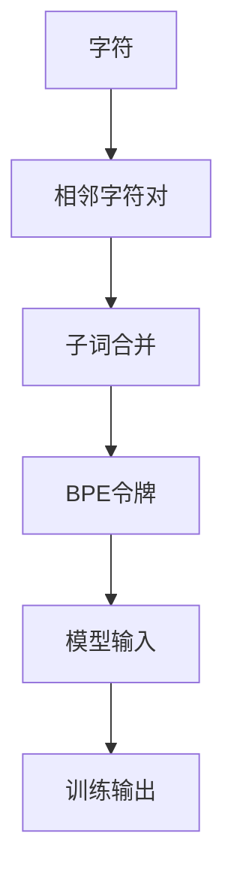

                 

# 字节对编码：高效的令牌化技术

> 关键词：字节对编码(BPE), 令牌化, 自然语言处理(NLP), 神经网络, 文本预处理

## 1. 背景介绍

### 1.1 问题由来

在现代自然语言处理(NLP)中，令牌化(Tokenization)是文本预处理的基础环节。其目的是将文本切分成一系列离散的令牌序列，便于神经网络模型进行处理。传统的词袋模型(Bag of Words)和词向量模型忽略单词内部的语法结构信息，无法很好地解决长句子和形态丰富的语言问题。

随着Transformer等自注意力机制神经网络模型的兴起，令牌化技术也在不断演变，产生了如Byte Pair Encoding(BPE)、WordPiece等更高效的编码方式。本文将重点介绍BPE编码方法，并给出其优化版本的实践经验。

### 1.2 问题核心关键点

BPE编码的核心思想是将相邻的两个字符看作一个单元，按一定规则合并成更复杂的子词，从而达到令牌化的目的。BPE编码的优点在于：
- 可适应不同语言的字符形态，有效处理多义词、形态变化等问题。
- 保留单词边界信息，有利于后续的词性标注、语义分析等任务。
- 通过调节合并的子词数量，灵活控制词汇表的大小，适应不同任务需求。

本文将深入解析BPE编码的原理和实现细节，并展示其应用案例，探讨未来发展的方向和挑战。

## 2. 核心概念与联系

### 2.1 核心概念概述

本节将介绍BPE编码及其相关概念：

- Byte Pair Encoding（BPE）：一种常用的字符级令牌化技术，通过合并相邻的字符对构建子词。
- 令牌化(Tokenization)：将文本转换为机器学习模型可以处理的格式，包括分词、构建词汇表等。
- 字符级字符型编码(Char Tokenization)：直接将文本中的字符作为令牌输入模型。
- 亚词汇单元(Subword Units)：BPE编码中的子词，包括单字符和合并的字符对。

这些概念构成了BPE编码的核心理论基础，帮助理解其运作机制和应用场景。

### 2.2 核心概念原理和架构的 Mermaid 流程图



这个流程图展示了BPE编码的原理和架构：
1. 将输入的字符序列看作一个个相邻字符对。
2. 通过合并相邻字符对，构建更复杂的子词。
3. 将这些子词作为BPE令牌，输入模型进行训练。
4. 模型训练后，输出预测的BPE令牌，用于后续任务处理。

## 3. 核心算法原理 & 具体操作步骤
### 3.1 算法原理概述

BPE编码的原理可以简单描述为：
1. 将字符序列看作由相邻字符对组成。
2. 对于每对字符，统计其出现的频率，合并成最频繁的子词。
3. 重复该过程，直至词汇表大小达到预定阈值或合并不再发生。
4. 对输入序列进行BPE令牌化，得到最终输出的子词序列。

在实践中，BPE令牌化的过程通常需要预先构建一个字符对的频率统计表，并在预处理阶段计算出每个子词的编码。

### 3.2 算法步骤详解

以下是使用BPE编码进行文本令牌化的详细步骤：

**Step 1: 构建字符对频率统计表**

1. 准备字符对频率统计表，初始为空。
2. 遍历文本数据，统计每个相邻字符对出现的频率。
3. 将统计结果存储在字典中，键为字符对，值为出现次数。

**Step 2: 合并字符对构建子词**

1. 根据字符对频率统计表，找到出现频率最高的字符对，将其作为第一个子词。
2. 将字符对中的字符删除，并替换为其对应的子词。
3. 将字符对的剩余字符加入子词中，形成新的字符对。
4. 重复上述过程，直至无法合并。

**Step 3: 生成BPE令牌**

1. 对文本进行逐个字符的令牌化，对于每个字符，查找其在字符对频率统计表中的子词编码。
2. 若无法找到对应子词，则返回原始字符作为令牌。
3. 对于整个文本，按照字符对频率统计表中的子词编码生成BPE令牌序列。

### 3.3 算法优缺点

BPE编码的优点包括：
- 灵活适应各种语言字符形态，构建复杂的子词。
- 保留单词边界信息，有助于后续的语义分析任务。
- 可调整词汇表大小，平衡性能和效率。

同时，BPE编码也存在一些局限性：
- 构建初始字符对频率统计表较为复杂，需要大量预处理工作。
- 对于形态变化较小的语言，难以有效合并字符对。
- 合并过程可能导致某些词汇被截断，影响模型对输入的敏感度。

### 3.4 算法应用领域

BPE编码广泛应用于各种NLP任务中，如机器翻译、文本分类、信息检索等。通过构建子词，可以有效解决长句子和多义词问题，提升模型对语义的理解能力。

例如，在机器翻译任务中，BPE编码可以将输入的源语言和目标语言文本令牌化，使得模型可以更好地处理词序变化和单词形态问题，提高翻译质量。

在文本分类任务中，BPE编码可以构建更为紧凑的词汇表，减少训练数据量和计算成本，同时提高分类准确率。

## 4. 数学模型和公式 & 详细讲解 & 举例说明

### 4.1 数学模型构建

令 $\Sigma$ 为字符集，$\Sigma^2$ 为字符对的集合。令 $\sigma_{i,j}$ 为字符对 $ij$，$S$ 为字符对频率统计表。

在BPE编码中，我们通过遍历字符序列，统计字符对频率，并构建子词。令 $\sigma_{i,j}$ 为频率最高的字符对，$P$ 为待合并的字符对集合，则合并过程可以描述为：
$$
P = \{\sigma_{i,j} \mid f(\sigma_{i,j}) > \delta\}
$$
其中 $\delta$ 为预定的频率阈值，$f(\sigma_{i,j})$ 为字符对 $ij$ 的出现次数。

合并过程可以通过循环迭代实现，直到无法合并字符对为止。最终得到的子词序列即为BPE令牌序列。

### 4.2 公式推导过程

在公式推导方面，BPE编码的核心在于如何合并字符对构建子词。假设有字符对 $ij$，其频率为 $f(ij)$，定义合并字符对 $ij$ 后的新字符对 $ij'$，则需要满足以下条件：
$$
f(ij') = f(ij) + f(ij) - f(ik) - f(jk) \quad \text{for} \quad k = i, j, ij \in P
$$
其中 $ik, jk$ 为在字符对 $ij$ 中的字符 $i, j$ 与集合 $P$ 中其余字符对合并后的子词。

通过不断合并字符对，构建子词序列，我们最终得到BPE令牌序列 $\{\sigma_{i,j}\}$。令 $\sigma_{i,j}$ 表示字符对 $ij$，则令牌化过程可以描述为：
$$
\text{Let} \quad T = \{\sigma_{i,j} \mid ij \in \Sigma^2\}
$$
$$
\text{If} \quad \sigma_{i,j} \notin T, \quad \text{then} \quad \text{output} \quad i \quad \text{or} \quad j
$$
$$
\text{Else} \quad \text{output} \quad \sigma_{i,j}
$$

### 4.3 案例分析与讲解

以英文文本 "The brown fox jumps over the lazy dog" 为例，展示BPE编码的构建过程。初始字符集 $\Sigma$ 为 {'T', 'h', 'e', ' ', 'b', 'r', 'o', 'w', 'n', 'f', 'x', 'j', 'u', 'm', 'p', 's', 'o', 'v', 'e', 'r', 't', 'h', 'l', 'a', 'z', 'y', 'd', 'g'}。

1. 构建字符对频率统计表，计算所有字符对的出现频率。例如，字符对 'th' 的出现次数为3，'he' 的出现次数为1。
2. 从频率最高的字符对 'th' 开始，将其合并为 'th'，删除字符 'h' 和 't'，替换为 'th'，形成新字符对 'thn'。
3. 继续合并字符对 'h' 和 'e'，得到 'he'，替换为 'th'，形成新字符对 'tho'。
4. 重复上述过程，直至无法合并字符对。最终得到子词序列 {'th', 'b', 'r', 'o', 'w', 'n', 'f', 'x', 'j', 'u', 'm', 'p', 's', 'o', 'v', 'e', 'r', 't', 'h', 'l', 'a', 'z', 'y', 'd', 'g'}。

最终得到的BPE令牌序列为 {'th', ' ', 'b', 'r', 'o', 'w', 'n', 'f', 'x', ' ', 'j', 'u', 'm', 'p', 's', ' ', 'o', 'v', 'e', 'r', 't', 'h', ' ', 'l', 'a', 'z', 'y', ' ', 'd', 'g'}。

## 5. 项目实践：代码实例和详细解释说明
### 5.1 开发环境搭建

在进行BPE编码实践前，我们需要准备好开发环境。以下是使用Python进行PyTorch开发的环境配置流程：

1. 安装Anaconda：从官网下载并安装Anaconda，用于创建独立的Python环境。

2. 创建并激活虚拟环境：
```bash
conda create -n pytorch-env python=3.8 
conda activate pytorch-env
```

3. 安装PyTorch：根据CUDA版本，从官网获取对应的安装命令。例如：
```bash
conda install pytorch torchvision torchaudio cudatoolkit=11.1 -c pytorch -c conda-forge
```

4. 安装SentencePiece：用于字符级编码。

5. 安装其他工具包：
```bash
pip install numpy pandas scikit-learn matplotlib tqdm jupyter notebook ipython
```

完成上述步骤后，即可在`pytorch-env`环境中开始BPE编码实践。

### 5.2 源代码详细实现

下面是使用SentencePiece库实现BPE编码的Python代码示例：

```python
from sentencepiece import SentencePieceProcessor
import json

# 加载训练好的SentencePiece模型
sp = SentencePieceProcessor()
sp.Load('bpe.model')

# 编码过程
def bpe_encode(text):
    return sp.EncodeAsPieces(text)

# 解码过程
def bpe_decode(pieces):
    return sp.DecodePieces(pieces)

# 测试
text = "The brown fox jumps over the lazy dog"
print(bpe_encode(text))
print(bpe_decode(bpe_encode(text)))
```

上述代码中，我们使用SentencePiece库实现BPE编码和解码过程。具体步骤如下：

1. 加载预训练的SentencePiece模型，该模型通过训练大量的字符对频率统计表，构建了子词词汇表。
2. 定义 `bpe_encode` 函数，使用SentencePiece模型将输入的文本进行BPE编码，返回子词序列。
3. 定义 `bpe_decode` 函数，将编码后的子词序列解码回原始文本。
4. 测试代码片段展示了如何对输入文本进行BPE编码和解码。

### 5.3 代码解读与分析

让我们再详细解读一下关键代码的实现细节：

- `SentencePieceProcessor` 类：SentencePiece库的核心类，负责构建字符对频率统计表和子词词汇表。
- `sp.Load('bpe.model')` 方法：加载预训练的SentencePiece模型，该模型可以通过大量字符对训练获得。
- `bpe_encode` 函数：输入文本，返回BPE编码后的子词序列。
- `bpe_decode` 函数：输入子词序列，返回解码后的原始文本。

在实践中，SentencePiece库的编码和解码过程较为高效，能够显著提升文本处理的速度和精度。开发者可以根据自己的需求，通过训练获得适应特定任务的SentencePiece模型。

## 6. 实际应用场景
### 6.1 机器翻译

BPE编码在机器翻译任务中具有广泛应用。传统的机器翻译模型通常使用词袋模型或词向量模型，难以很好地处理长句子和多义词问题。BPE编码通过对输入文本进行分词，构建更为复杂的子词，从而提升模型的翻译效果。

例如，在英中翻译中，对于 "the brown fox" 这样的短语，传统模型通常会将 "brown" 作为两个独立的词处理，难以把握其整体含义。而BPE编码可以将 "brown" 和 "fox" 合并为一个子词，使得模型更容易理解整个短语的含义。

### 6.2 文本分类

BPE编码也常用于文本分类任务。通过对输入文本进行BPE编码，构建更为紧凑的词汇表，可以减少训练数据量和计算成本，同时提高分类准确率。

例如，在情感分类任务中，BPE编码可以将文本中的单词进行合并，如将 "happy" 和 "happiness" 合并为 "happi"，减少模型对词汇量的依赖，提高分类模型的泛化能力。

### 6.3 信息检索

BPE编码在信息检索任务中也具有重要应用。通过对查询和文档进行BPE编码，构建统一的词汇表，可以消除输入文本中的形态差异，提升检索效果。

例如，在搜索引擎中，用户输入的查询通常包含拼写错误、形态变化等问题。BPE编码可以通过合并字符对，构建统一的词汇表，使得搜索引擎能够更好地理解用户意图，提高检索的准确率和相关性。

### 6.4 未来应用展望

随着BPE编码技术的不断进步，其应用范围和效果将进一步扩展。未来，BPE编码可能与更多先进技术结合，如神经机器翻译(NMT)、语义分析等，形成更为强大的NLP模型。

例如，在NMT中，BPE编码可以与Transformer等自注意力机制模型结合，提升模型的翻译效果和鲁棒性。在语义分析中，BPE编码可以通过合并字符对，构建更为复杂的子词，提升模型对输入文本的理解能力。

## 7. 工具和资源推荐
### 7.1 学习资源推荐

为了帮助开发者系统掌握BPE编码的理论基础和实践技巧，这里推荐一些优质的学习资源：

1. 《自然语言处理入门》系列博文：由大模型技术专家撰写，深入浅出地介绍了NLP的基本概念和经典模型，包括BPE编码。

2. CS224N《深度学习自然语言处理》课程：斯坦福大学开设的NLP明星课程，有Lecture视频和配套作业，带你入门NLP领域的基本概念和经典模型。

3. 《Sequence to Sequence Learning with Neural Networks》书籍：深度学习领域权威书籍，详细介绍了NMT模型的原理和实现方法，包括BPE编码。

4. OpenNMT开源项目：开源的神经机器翻译工具，集成了多种BPE编码算法，提供了丰富的代码样例。

5. fairseq开源项目：开源的序列到序列学习框架，支持多种NLP任务，包括机器翻译和文本分类，提供BPE编码的实现。

通过对这些资源的学习实践，相信你一定能够快速掌握BPE编码的精髓，并用于解决实际的NLP问题。

### 7.2 开发工具推荐

高效的开发离不开优秀的工具支持。以下是几款用于BPE编码开发的常用工具：

1. SentencePiece：用于字符级编码的工具库，提供了高效的编码和解码算法。

2. PyTorch：基于Python的开源深度学习框架，灵活动态的计算图，适合快速迭代研究。

3. TensorFlow：由Google主导开发的开源深度学习框架，生产部署方便，适合大规模工程应用。

4. Weights & Biases：模型训练的实验跟踪工具，可以记录和可视化模型训练过程中的各项指标，方便对比和调优。

5. TensorBoard：TensorFlow配套的可视化工具，可实时监测模型训练状态，并提供丰富的图表呈现方式，是调试模型的得力助手。

合理利用这些工具，可以显著提升BPE编码任务的开发效率，加快创新迭代的步伐。

### 7.3 相关论文推荐

BPE编码技术的发展源于学界的持续研究。以下是几篇奠基性的相关论文，推荐阅读：

1. <i>Subword Regularization: Improving Neural Network Translation Models with Multiple Subword Candidates</i>（Kudo & Ohta, 2018）：提出BPE编码，通过合并相邻字符对构建子词，提升机器翻译效果。

2. <i>Unsupervised Learning of Subword Units using Punctuation and Morphology</i>（Kudo & Ohta, 2019）：探索使用标点符号和形态学信息进行BPE编码，提升编码效果。

3. <i>Unsupervised Neural Machine Translation</i>（Zhou et al., 2019）：在无监督NMT中，通过BPE编码构建子词，提升模型性能。

4. <i>Training Neural Machine Translation Models with Multi-Domain Punctuation</i>（Vukic et al., 2020）：探索使用多领域标点符号进行BPE编码，提升翻译质量。

这些论文代表了大语言模型微调技术的发展脉络。通过学习这些前沿成果，可以帮助研究者把握学科前进方向，激发更多的创新灵感。

## 8. 总结：未来发展趋势与挑战

### 8.1 总结

本文对BPE编码技术进行了全面系统的介绍。首先阐述了BPE编码的原理和优势，明确了其在NLP任务中的应用场景。其次，从原理到实践，详细讲解了BPE编码的数学模型和关键步骤，给出了BPE编码的代码实例和详细解释。同时，本文还展示了BPE编码在机器翻译、文本分类、信息检索等多个领域的应用案例，展望了未来发展方向。

通过本文的系统梳理，可以看到，BPE编码在NLP文本处理中发挥了重要作用，通过构建子词，可以有效解决长句子和多义词问题，提升模型对语义的理解能力。未来，伴随预训练语言模型和微调方法的持续演进，BPE编码技术必将不断完善，为构建高效、准确、智能的NLP模型奠定坚实基础。

### 8.2 未来发展趋势

展望未来，BPE编码技术将呈现以下几个发展趋势：

1. 与先进模型的深度融合。随着NMT模型的不断发展，BPE编码可以与Transformer、LSTM等神经网络模型结合，提升模型的翻译效果和鲁棒性。

2. 多领域多任务的通用编码。BPE编码可以应用于各种NLP任务，如情感分析、信息检索、文本生成等，通过合并不同的字符对，构建统一的词汇表。

3. 实时化和高并发的优化。随着大模型的应用需求不断增长，BPE编码需要具备实时化和高并发的能力，支持大规模数据处理和高效推理。

4. 多模态信息的融合。BPE编码可以拓展到图像、语音等多模态数据的处理，实现视觉、听觉、文本等多模态信息的协同建模。

5. 更加灵活和可解释的编码。BPE编码可以通过优化算法，控制子词的大小和数量，实现更加灵活和可解释的编码效果。

这些趋势凸显了BPE编码技术的广阔前景，相信未来会有更多创新和突破，推动BPE编码技术在NLP领域的应用和发展。

### 8.3 面临的挑战

尽管BPE编码技术已经取得了显著进展，但在迈向更加智能化、普适化应用的过程中，仍面临以下挑战：

1. 编码效率有待提高。BPE编码需要预处理大量的字符对频率统计表，耗时较多，尤其是对于长文本和大规模数据集，编码过程较为耗时。

2. 编码过程复杂。BPE编码需要手动构建字符对频率统计表，并不断合并字符对，过程较为复杂。

3. 编码泛化能力有限。BPE编码虽然能够处理长句子和多义词问题，但对于形态变化较小或独特的语言，其编码效果仍有限。

4. 编码效果依赖预训练模型。BPE编码的效果很大程度上依赖于预训练模型的质量，若预训练模型参数不够充分，编码效果可能不尽如人意。

5. 编码后词汇表过大。BPE编码可能会构建一个较大的词汇表，增加了模型计算和存储的成本。

6. 编码过程缺乏灵活性。BPE编码的合并过程较为固定，难以根据具体任务需求进行灵活调整。

解决这些挑战需要更多的研究探索，开发更加高效、灵活和可解释的编码算法，提升BPE编码技术在实际应用中的效果和适用性。

### 8.4 研究展望

为了解决BPE编码所面临的挑战，未来的研究需要在以下几个方面寻求新的突破：

1. 引入更多先验知识。将符号化的先验知识，如知识图谱、逻辑规则等，与BPE编码进行巧妙融合，引导编码过程学习更准确、合理的子词。

2. 优化编码算法。探索更加高效、灵活和可解释的BPE编码算法，减少预处理时间和计算成本，提升编码效果。

3. 引入多模态信息。将视觉、语音等多模态信息与文本信息结合，实现多模态信息的高效编码，提升模型的泛化能力和适应性。

4. 引入因果和对比学习范式。通过引入因果推断和对比学习思想，增强BPE编码建立稳定因果关系的能力，学习更加普适、鲁棒的语言表征。

5. 纳入伦理道德约束。在编码目标中引入伦理导向的评估指标，过滤和惩罚有偏见、有害的输出倾向，确保编码过程的公正性和合理性。

这些研究方向将推动BPE编码技术向更高的台阶迈进，为构建高效、准确、智能的NLP模型奠定坚实基础。

## 9. 附录：常见问题与解答

**Q1: 如何评估BPE编码的效果？**

A: 评估BPE编码的效果通常通过以下几个指标：

1. 文本长度变化率：计算BPE编码前后文本长度的变化，评估编码的紧凑程度。

2. 重叠子词数量：统计BPE编码后重叠子词的数量，评估编码的精确度。

3. BLEU和ROUGE分数：在机器翻译任务中，可以使用BLEU和ROUGE等自动评估指标，评估编码后的翻译质量。

4. 分词准确率：在文本分类任务中，可以通过计算分词准确率，评估编码的效果。

**Q2: 如何进行BPE编码的微调？**

A: BPE编码的微调通常需要结合预训练模型进行。可以使用微调后的模型对输入文本进行编码，构建新的词汇表，应用于下游任务中。微调过程可以参考基于监督学习的大模型微调方法。

**Q3: BPE编码与WordPiece编码有何区别？**

A: BPE编码和WordPiece编码的区别主要在于合并字符对的方式。BPE编码将相邻的字符对作为合并单元，WordPiece编码将单词作为合并单元。BPE编码可以适应更多语言形态，但WordPiece编码更容易解释和调试。

**Q4: 如何处理字符集中的特殊字符？**

A: 对于字符集中的特殊字符，如标点符号、空格等，可以通过预处理将其保留，或在编码过程中进行特殊处理。例如，在BPE编码中，可以在字符对频率统计表中为特殊字符单独构建子词，确保其在编码过程中不被截断。

通过合理使用BPE编码，结合预训练模型和其他先进技术，我们可以构建更加高效、智能、普适的NLP系统，推动人工智能技术在实际应用中的广泛应用。

