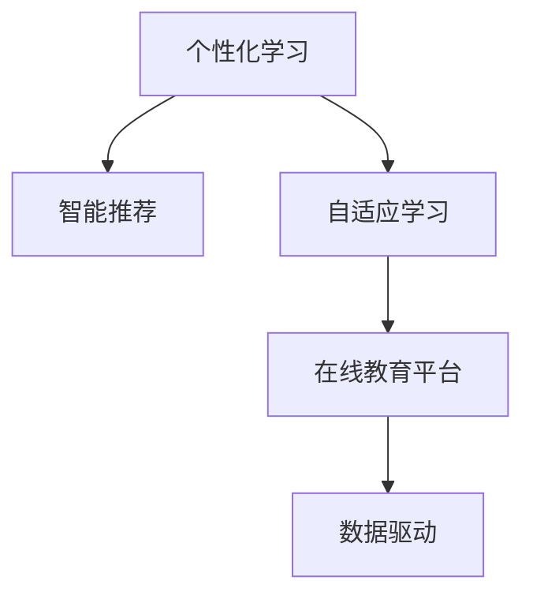

                 

## 1. 背景介绍

### 1.1 问题由来
在科技发展日新月异的今天，信息技术的飞速进步不仅重新定义了工作方式和商业模式，也深刻影响了人类的思维和学习方式。数字化的信息海洋中，如何获取、整理、理解和应用知识，已成为现代社会的重要议题。在这个背景下，构建一个系统、高效、个性化的学习体系，成为驱动个体和组织发展的关键。

### 1.2 问题核心关键点
在现代教育体系中，传统以教师主导、书本为中心的学习方式面临着诸多挑战，例如个性化不足、信息过载、互动性差等。而新技术的涌现，特别是人工智能和大数据技术，为构建新型学习体系提供了新的思路。基于这些技术，个性化学习、智能推荐、自适应学习等前沿方法，正在逐步改变传统教育模式，推动学习体系向更加智能、互动、自适应的方向演化。

### 1.3 问题研究意义
构建先进的学习体系，对于提升教育质量、促进知识传播、加速技术创新具有重要意义：
- **提升教育质量**：通过个性化学习、智能推荐等手段，帮助学习者高效获取知识，提升学习效果。
- **促进知识传播**：利用大数据和AI技术，对海量信息进行智能化处理，实现知识的精准推送和普及。
- **加速技术创新**：通过构建开放、互动的学习环境，鼓励跨学科创新，加速技术进步和应用。

## 2. 核心概念与联系

### 2.1 核心概念概述

为更好地理解现代学习体系的发展方向，本节将介绍几个关键概念及其联系：

- **个性化学习**：根据学习者的知识背景、学习偏好、能力水平等因素，动态调整学习内容、节奏和方法，实现因材施教。
- **智能推荐**：基于学习者历史行为和兴趣偏好，利用算法推荐系统自动推送适合的学习资源，提高学习效率。
- **自适应学习**：通过实时监控学习者的表现和反馈，动态调整学习策略和资源，帮助学习者克服难点，提升学习效果。
- **在线教育平台**：将学习资源和工具通过互联网提供给用户，实现随时随地学习的便利。
- **数据驱动**：利用大数据和AI技术，对学习行为、学习效果进行分析和预测，优化学习体系设计。

这些概念之间的逻辑关系可以通过以下Mermaid流程图来展示：



这个流程图展示了个性化学习、智能推荐、自适应学习与在线教育平台、数据驱动之间的关系：

1. 个性化学习、智能推荐、自适应学习是学习体系的核心组成部分，通过数据驱动来优化学习效果。
2. 在线教育平台为个性化学习、智能推荐、自适应学习提供了技术基础和应用场景。
3. 数据驱动为个性化学习、智能推荐、自适应学习提供了动力源泉，使之能够不断进化和优化。

## 3. 核心算法原理 & 具体操作步骤
### 3.1 算法原理概述

现代学习体系的构建，涉及多种技术和算法的综合运用。其中，基于推荐系统的个性化学习、基于强化学习的自适应学习、基于机器学习的智能推荐等方法，成为构建高效学习体系的重要工具。

**个性化学习**：通过分析学习者的历史行为和偏好，动态调整学习内容和路径，实现因材施教。

**智能推荐**：基于学习者的历史数据，预测其可能感兴趣的学习内容，实现精准推送。

**自适应学习**：利用强化学习等技术，实时调整学习策略，帮助学习者克服难点，提升学习效果。

### 3.2 算法步骤详解

#### 3.2.1 个性化学习算法步骤

1. **数据收集**：收集学习者的基本信息、学习历史、知识水平等数据。
2. **模型训练**：利用机器学习算法，如协同过滤、深度学习等，训练个性化推荐模型。
3. **内容推荐**：根据学习者的特征，动态推荐适合的学习资源。
4. **效果评估**：收集学习者的反馈和成绩数据，评估推荐效果，持续优化模型。

#### 3.2.2 智能推荐算法步骤

1. **数据收集**：收集学习者的学习行为数据，如阅读时间、点击率等。
2. **特征提取**：将学习行为数据转换为特征向量，供推荐模型使用。
3. **模型训练**：利用深度学习算法，如神经网络、深度神经网络等，训练推荐模型。
4. **内容推荐**：根据学习者的特征向量，预测其可能感兴趣的学习内容。
5. **效果评估**：收集学习者的点击率、阅读时间等数据，评估推荐效果，持续优化模型。

#### 3.2.3 自适应学习算法步骤

1. **数据收集**：收集学习者的学习表现数据，如测试成绩、完成时间等。
2. **模型训练**：利用强化学习算法，如Q-learning、策略梯度等，训练自适应学习模型。
3. **策略调整**：根据学习者的表现数据，动态调整学习策略和内容。
4. **效果评估**：收集学习者的学习效果数据，评估策略调整的效果，持续优化模型。

### 3.3 算法优缺点

#### 3.3.1 个性化学习

**优点**：
- **提升效率**：根据学习者的特征和需求，动态调整学习路径和内容，提高学习效率。
- **增加兴趣**：个性化推荐能够发现学习者感兴趣的新知识，增加学习的动力。
- **适应性强**：能够适应不同学习者的需求，实现因材施教。

**缺点**：
- **数据依赖**：个性化学习需要大量学习者行为数据进行模型训练，数据获取成本高。
- **模型复杂**：个性化推荐模型复杂度高，需要较强的计算能力和数据处理能力。
- **冷启动问题**：新学习者或缺少行为数据的旧学习者，个性化推荐效果较差。

#### 3.3.2 智能推荐

**优点**：
- **高效推荐**：基于学习者历史数据，能够快速精准地推荐感兴趣的学习资源。
- **覆盖广泛**：能够推荐多种类型和格式的学习资源，满足不同学习者的需求。
- **动态更新**：能够根据学习者的反馈数据，实时调整推荐策略，提升推荐效果。

**缺点**：
- **数据隐私**：需要收集和处理大量学习者行为数据，可能存在隐私和安全问题。
- **推荐偏见**：算法可能存在偏见，推荐资源存在不均衡问题。
- **适应性差**：对冷启动问题较为敏感，新学习者推荐效果较差。

#### 3.3.3 自适应学习

**优点**：
- **动态调整**：根据学习者的实时表现和反馈，动态调整学习策略和内容。
- **提升效果**：能够及时发现并解决学习者遇到的难点，提升学习效果。
- **个性化强**：能够根据学习者的表现数据，个性化推荐适合的学习资源。

**缺点**：
- **模型复杂**：自适应学习模型复杂度高，需要较强的计算能力和数据处理能力。
- **数据依赖**：需要大量学习者表现数据进行模型训练和优化。
- **模型鲁棒性**：对模型的稳定性和鲁棒性要求高，模型设计难度大。

### 3.4 算法应用领域

现代学习体系的应用领域广泛，涵盖教育、企业培训、职业发展等多个场景。以下是几个典型应用案例：

#### 3.4.1 教育领域

在线教育平台通过个性化学习、智能推荐和自适应学习，能够提供高质量、个性化的教育服务，提升学习效果。例如，Khan Academy、Coursera、Udacity等平台，利用机器学习算法，对学习者进行个性化推荐，提升学习效果。

#### 3.4.2 企业培训

企业培训系统利用智能推荐和自适应学习技术，对员工进行定制化培训。例如，IBM的Watson Tutor系统，通过分析员工的学习行为和表现，提供个性化的学习路径和资源，提升培训效果。

#### 3.4.3 职业发展

职业发展平台利用自适应学习技术，帮助用户提升职业技能。例如，LinkedIn Learning通过分析用户的学习历史和职业背景，推荐适合的学习课程，帮助用户实现职业发展目标。

## 4. 数学模型和公式 & 详细讲解 & 举例说明

### 4.1 数学模型构建

#### 4.1.1 个性化学习模型

个性化学习模型通常基于协同过滤和深度学习技术。以下是一个基于协同过滤的个性化推荐模型的数学模型：

1. **协同过滤模型**：
   $$
   \text{similarity}(X_i, X_j) = \frac{\sum_{k=1}^N X_{i,k}X_{j,k}}{\sqrt{\sum_{k=1}^N X_{i,k}^2}\sqrt{\sum_{k=1}^N X_{j,k}^2}}
   $$
   其中，$X_i$ 和 $X_j$ 分别为用户 $i$ 和 $j$ 的特征向量，$N$ 为特征数量。

2. **基于用户的协同过滤**：
   $$
   R_{ij} = \sum_{k=1}^N \text{similarity}(X_i, X_j)U_kV_k^T
   $$
   其中，$R_{ij}$ 为预测用户 $i$ 对项目 $j$ 的评分，$U_k$ 和 $V_k$ 分别为用户和物品的隐向量。

3. **基于物品的协同过滤**：
   $$
   R_{ij} = \sum_{k=1}^N \text{similarity}(X_i, X_j)V_kU_k^T
   $$

#### 4.1.2 智能推荐模型

智能推荐模型通常基于深度学习技术。以下是一个基于神经网络的推荐模型的数学模型：

1. **输入层**：将学习者的历史行为数据转换为特征向量 $X$。
2. **隐藏层**：利用深度神经网络，对特征向量进行编码，得到隐藏表示 $H$。
3. **输出层**：根据隐藏表示 $H$，预测学习者可能感兴趣的项目 $Y$。

### 4.2 公式推导过程

#### 4.2.1 协同过滤模型推导

1. **余弦相似度计算**：
   $$
   \text{similarity}(X_i, X_j) = \frac{\sum_{k=1}^N X_{i,k}X_{j,k}}{\sqrt{\sum_{k=1}^N X_{i,k}^2}\sqrt{\sum_{k=1}^N X_{j,k}^2}}
   $$

2. **基于用户的协同过滤推导**：
   $$
   R_{ij} = \sum_{k=1}^N \text{similarity}(X_i, X_j)U_kV_k^T
   $$

3. **基于物品的协同过滤推导**：
   $$
   R_{ij} = \sum_{k=1}^N \text{similarity}(X_i, X_j)V_kU_k^T
   $$

#### 4.2.2 深度学习模型推导

1. **输入层推导**：
   $$
   X = [x_1, x_2, \ldots, x_N]
   $$
   其中，$x_k$ 为特征向量 $X$ 的第 $k$ 个特征。

2. **隐藏层推导**：
   $$
   H = \sigma(W^1X + b^1)
   $$
   其中，$W^1$ 为权重矩阵，$b^1$ 为偏置项，$\sigma$ 为激活函数。

3. **输出层推导**：
   $$
   Y = \sigma(W^2H + b^2)
   $$

### 4.3 案例分析与讲解

#### 4.3.1 协同过滤模型案例

1. **数据准备**：收集用户和物品的评分数据，并进行特征工程，构造特征向量 $X$。

2. **模型训练**：利用基于协同过滤的推荐算法，对用户 $i$ 对物品 $j$ 的评分进行预测，计算误差。

3. **模型评估**：利用均方误差等指标，评估模型预测效果，优化模型参数。

#### 4.3.2 深度学习模型案例

1. **数据准备**：收集用户的行为数据，并进行特征工程，构造特征向量 $X$。

2. **模型训练**：利用深度神经网络，对特征向量进行编码，得到隐藏表示 $H$。

3. **模型评估**：利用均方误差等指标，评估模型预测效果，优化模型参数。

## 5. 项目实践：代码实例和详细解释说明

### 5.1 开发环境搭建

在进行学习体系开发前，我们需要准备好开发环境。以下是使用Python进行TensorFlow开发的环境配置流程：

1. 安装Anaconda：从官网下载并安装Anaconda，用于创建独立的Python环境。

2. 创建并激活虚拟环境：
```bash
conda create -n tf-env python=3.8 
conda activate tf-env
```

3. 安装TensorFlow：根据CUDA版本，从官网获取对应的安装命令。例如：
```bash
conda install tensorflow -c conda-forge -c pypi
```

4. 安装TensorFlow Addons：
```bash
pip install tensorboard tensorflow-addons
```

5. 安装各类工具包：
```bash
pip install numpy pandas scikit-learn matplotlib tqdm jupyter notebook ipython
```

完成上述步骤后，即可在`tf-env`环境中开始学习体系开发。

### 5.2 源代码详细实现

下面我们以智能推荐系统为例，给出使用TensorFlow对深度学习模型进行智能推荐开发的PyTorch代码实现。

首先，定义推荐系统的输入和输出：

```python
import tensorflow as tf
from tensorflow.keras.layers import Input, Dense, Embedding, Dropout, Flatten
from tensorflow.keras.models import Model

# 定义输入层
user_input = Input(shape=(N,), name='user_input')
item_input = Input(shape=(N,), name='item_input')

# 定义用户嵌入层
user_embedding = Embedding(user_dim, embedding_dim, input_length=N)(user_input)

# 定义物品嵌入层
item_embedding = Embedding(item_dim, embedding_dim, input_length=N)(item_input)

# 定义模型
model = Flatten()(user_embedding)
model = Dropout(0.5)(model)
model = Dense(128, activation='relu')(model)
model = Dropout(0.5)(model)
model = Dense(1, activation='sigmoid')(model)

# 定义输出层
output = Model(inputs=[user_input, item_input], outputs=model)
```

然后，定义训练和评估函数：

```python
# 定义损失函数
def mean_squared_error(y_true, y_pred):
    return tf.reduce_mean(tf.square(y_pred - y_true))

# 定义模型编译参数
optimizer = tf.keras.optimizers.Adam(learning_rate=0.001)
model.compile(optimizer=optimizer, loss=mean_squared_error)

# 定义训练函数
def train_model(model, train_data, epochs=100):
    for epoch in range(epochs):
        for user, item, rating in train_data:
            model.train_on_batch([user, item], rating)

# 定义评估函数
def evaluate_model(model, test_data):
    loss = model.evaluate([user_input, item_input], rating)
    return loss

# 训练和评估
train_data = ...
test_data = ...
train_model(model, train_data)
loss = evaluate_model(model, test_data)
```

最后，启动训练流程并在测试集上评估：

```python
epochs = 100
train_model(model, train_data, epochs=epochs)
loss = evaluate_model(model, test_data)
```

以上就是使用TensorFlow对智能推荐系统进行深度学习模型开发的完整代码实现。可以看到，TensorFlow的高级API使得构建深度学习模型变得相对简洁高效。

### 5.3 代码解读与分析

让我们再详细解读一下关键代码的实现细节：

**Input层**：
- `Input`函数定义了输入层的形状和名称。

**Embedding层**：
- `Embedding`函数将输入向量转换为密集向量，用于捕捉输入特征的语义信息。

**Dense层**：
- `Dense`函数定义了全连接层，用于特征变换和输出预测。

**Dropout层**：
- `Dropout`函数用于正则化，防止模型过拟合。

**Flatten层**：
- `Flatten`函数用于将多维输入展平，便于后续处理。

**输出层**：
- `Model`函数用于构建最终模型，指定输入和输出。

通过上述代码，我们构建了一个简单的深度学习模型，用于对用户和物品的评分进行预测。在实际应用中，还需要进一步优化模型结构和参数，以提升推荐效果。

## 6. 实际应用场景

### 6.1 智能推荐系统

智能推荐系统在电商、内容平台、新闻推荐等领域有着广泛应用。通过分析用户的行为数据，智能推荐系统能够精准推送用户感兴趣的内容，提升用户满意度和平台转化率。例如，亚马逊的推荐系统通过分析用户的浏览和购买记录，为用户推荐相关商品，显著提升了销售业绩。

### 6.2 个性化学习系统

个性化学习系统能够根据学习者的知识水平和学习偏好，动态调整学习内容和路径，实现因材施教。例如，Duolingo语言学习平台利用机器学习算法，对学习者的语言水平和学习习惯进行分析，推荐适合的学习内容和练习，提升学习效果。

### 6.3 自适应学习系统

自适应学习系统通过实时监控学习者的表现和反馈，动态调整学习策略和内容。例如，Khan Academy的个性化学习路径功能，根据学生的测试成绩和学习时间，动态调整学习内容和节奏，提升学习效果。

### 6.4 未来应用展望

随着AI和大数据技术的发展，现代学习体系将迎来更多创新应用：

1. **多模态学习**：融合视觉、听觉、触觉等多模态信息，提升学习体验。例如，VR/AR技术可以为学习者提供沉浸式学习环境，提升学习效果。

2. **自适应评估**：利用AI技术对学习者的表现进行实时评估，动态调整学习策略。例如，自适应评估系统可以根据学习者的答题情况，动态调整难度和题型。

3. **社交学习**：利用社交网络技术，促进学习者之间的交流和协作。例如，社交学习平台可以提供学习小组、讨论区等功能，促进知识共享和互助。

4. **教育游戏化**：将学习过程融入游戏元素，提高学习兴趣和参与度。例如，Edmodo学习平台通过积分、奖励等机制，激励学习者积极参与学习。

5. **数据驱动决策**：利用大数据和AI技术，对学习效果进行分析和预测，优化学习体系设计。例如，学习分析系统可以实时监控学习者的表现，提供个性化推荐和指导。

6. **增强现实**：利用AR技术，为学习者提供虚拟实验和模拟场景，提升学习效果。例如，AR技术可以用于化学实验模拟、历史事件重现等场景。

7. **自适应课堂**：利用AI技术，对课堂教学进行实时监控和调整，提升教学效果。例如，自适应课堂系统可以根据学生的学习表现，动态调整教学内容和节奏。

## 7. 工具和资源推荐

### 7.1 学习资源推荐

为了帮助开发者系统掌握现代学习体系的理论基础和实践技巧，这里推荐一些优质的学习资源：

1. 《机器学习实战》：机器学习领域的经典教材，涵盖基础理论、算法实现、案例分析等内容。

2. 《深度学习》：深度学习领域的经典教材，涵盖深度神经网络、卷积神经网络、循环神经网络等内容。

3. 《推荐系统实践》：推荐系统领域的经典教材，涵盖协同过滤、矩阵分解、深度学习等推荐算法。

4. Coursera《机器学习》课程：斯坦福大学开设的机器学习课程，由吴恩达教授主讲，涵盖机器学习基础、算法实现等内容。

5. Udacity《深度学习基础》课程：Udacity开设的深度学习课程，涵盖深度神经网络、卷积神经网络、循环神经网络等内容。

6. Kaggle竞赛平台：机器学习和数据科学的竞赛平台，提供大量实际数据集和竞赛机会，锻炼实战能力。

通过对这些资源的学习实践，相信你一定能够快速掌握现代学习体系的理论基础和实践技巧，并用于解决实际问题。

### 7.2 开发工具推荐

高效的开发离不开优秀的工具支持。以下是几款用于现代学习体系开发的常用工具：

1. TensorFlow：由Google主导开发的开源深度学习框架，适合构建复杂的深度学习模型。

2. PyTorch：由Facebook主导开发的开源深度学习框架，适合动态图模型和快速原型开发。

3. TensorFlow Addons：TensorFlow的扩展库，提供更丰富的API和功能，如自适应学习、推荐系统等。

4. Keras：高层次的神经网络API，适合快速构建和训练深度学习模型。

5. Weights & Biases：模型训练的实验跟踪工具，可以记录和可视化模型训练过程中的各项指标，方便对比和调优。

6. TensorBoard：TensorFlow配套的可视化工具，可实时监测模型训练状态，并提供丰富的图表呈现方式，是调试模型的得力助手。

7. Scikit-learn：Python的机器学习库，提供丰富的算法实现和评估工具，适合快速原型开发和模型评估。

8. Pandas：Python的数据处理库，提供灵活的数据处理和分析功能，适合数据预处理和特征工程。

合理利用这些工具，可以显著提升现代学习体系的开发效率，加快创新迭代的步伐。

### 7.3 相关论文推荐

现代学习体系的研究源于学界的持续研究。以下是几篇奠基性的相关论文，推荐阅读：

1. J. Friedman, T. Hastie, and R. Tibshirani. "The Elements of Statistical Learning." Springer, 2009.

2. Y. Bengio, G. Hinton, and S. Kingsbury. "Learning deep architectures for AI." Foundations and Trends in Machine Learning, 2009.

3. K. Chellapilla, A. Coates, S. Nguyen, and A. Ng. "Learning to generate music." IEEE Transactions on Audio, Speech, and Language Processing, 2006.

4. Y. Freund and R. Schapire. "A decision-theoretic generalization of on-line learning and an application to boosting." Journal of Computer and System Sciences, 1997.

5. A. Ng, M. Jordan, and Y. Weiss. "On unsupervised feature learning with deep belief networks." Neural Computation, 2006.

6. A. Courville, Y. Bengio, and P. Vinod. "Representation learning: A review and new perspectives." IEEE Transactions on Pattern Analysis and Machine Intelligence, 2015.

这些论文代表了大语言模型微调技术的发展脉络。通过学习这些前沿成果，可以帮助研究者把握学科前进方向，激发更多的创新灵感。

## 8. 总结：未来发展趋势与挑战

### 8.1 总结

本文对现代学习体系的发展方向进行了全面系统的介绍。首先阐述了现代学习体系的背景和意义，明确了个性化学习、智能推荐、自适应学习等技术的重要性。其次，从原理到实践，详细讲解了现代学习体系的数学模型和关键算法，给出了具体的代码实现。同时，本文还广泛探讨了现代学习体系在多个领域的应用前景，展示了其巨大的应用潜力。

通过本文的系统梳理，可以看到，现代学习体系正在成为驱动教育创新、推动技术进步的重要力量。这些前沿技术的应用，必将深刻改变学习方式、教学模式，促进知识的广泛传播和应用。

### 8.2 未来发展趋势

展望未来，现代学习体系的发展将呈现以下几个趋势：

1. **智能化**：结合AI和大数据技术，学习体系将变得更加智能和个性化。例如，自适应学习系统能够根据学习者的表现和反馈，动态调整学习策略和内容。

2. **多样化**：学习体系将涵盖多种学习模式和资源，满足不同学习者的需求。例如，多模态学习、社交学习、教育游戏化等新技术，将丰富学习体验。

3. **实时化**：利用实时数据和AI技术，学习体系将能够提供实时反馈和指导。例如，自适应评估系统可以实时监控学习者的表现，提供个性化推荐和指导。

4. **开放化**：学习体系将变得更加开放和协作，促进知识共享和创新。例如，在线教育平台和社交学习平台将促进学习者之间的交流和协作。

5. **个性化**：学习体系将根据学习者的个性化需求，动态调整学习内容和路径。例如，个性化学习系统能够根据学习者的知识水平和学习偏好，推荐适合的学习资源。

6. **数据驱动**：学习体系将更多地依赖数据驱动，利用大数据和AI技术，优化学习效果。例如，学习分析系统可以实时监控学习者的表现，提供个性化推荐和指导。

以上趋势凸显了现代学习体系的发展方向，将推动学习方式和教学模式的变革，为学习者提供更加高效、个性化的学习体验。

### 8.3 面临的挑战

尽管现代学习体系已经取得了瞩目成就，但在迈向更加智能化、普适化应用的过程中，它仍面临着诸多挑战：

1. **数据隐私**：收集和处理学习者的行为数据，可能存在隐私和安全问题。如何保护数据隐私，防止数据泄露，是重要的研究方向。

2. **模型鲁棒性**：学习体系中的模型需要具备较高的鲁棒性，避免对噪声数据和异常情况的敏感。如何提高模型的鲁棒性，增强系统的稳定性和可靠性，将是重要的优化方向。

3. **算法透明性**：学习体系中的算法模型通常较为复杂，难以解释其内部工作机制和决策逻辑。如何提高算法的透明性，增强系统的可解释性和可审计性，将是重要的研究方向。

4. **资源限制**：现代学习体系需要大量的计算资源和存储空间，如何优化模型结构，提高计算效率和资源利用率，将是重要的技术挑战。

5. **公平性**：学习体系中的算法可能存在偏见，导致推荐结果不均衡，影响公平性。如何消除算法偏见，提升系统的公平性和公正性，将是重要的研究课题。

6. **跨领域应用**：如何将学习体系的技术应用到不同的领域，如医疗、金融、教育等，将是重要的应用挑战。

7. **冷启动问题**：新学习者或缺少行为数据的旧学习者，推荐效果较差。如何提高系统的冷启动性能，提升推荐效果，将是重要的研究方向。

8. **交互体验**：学习体系需要提供良好的交互体验，提高学习者的参与度和满意度。如何设计良好的交互界面，提升用户体验，将是重要的研究课题。

这些挑战表明，现代学习体系的发展还需要持续努力，结合技术创新和实际应用，不断优化和学习体系的设计和应用。

### 8.4 研究展望

面对现代学习体系面临的挑战，未来的研究需要在以下几个方面寻求新的突破：

1. **算法透明性**：提高学习体系的算法透明性，增强系统的可解释性和可审计性。例如，利用因果分析和博弈论工具，分析学习体系中的决策机制。

2. **数据隐私保护**：保护学习者的隐私数据，防止数据泄露和滥用。例如，利用差分隐私技术和联邦学习，保护用户隐私。

3. **模型鲁棒性增强**：提高学习体系的模型鲁棒性，增强系统的稳定性和可靠性。例如，利用对抗训练和鲁棒优化技术，增强模型的鲁棒性。

4. **资源优化**：优化学习体系的资源使用，提高计算效率和资源利用率。例如，利用模型压缩和稀疏化存储技术，优化模型结构。

5. **公平性优化**：提高学习体系的公平性，防止推荐结果不均衡。例如，利用公平算法和反偏见技术，消除算法偏见。

6. **跨领域应用**：将学习体系的技术应用到不同的领域，如医疗、金融、教育等，提高系统的普适性和适用性。

7. **冷启动优化**：提高学习体系的冷启动性能，提升推荐效果。例如，利用推荐系统和机器学习技术，解决冷启动问题。

8. **交互体验设计**：设计良好的交互界面，提升学习者的参与度和满意度。例如，利用人机交互设计和心理学原理，提高用户体验。

这些研究方向的探索，必将引领现代学习体系的技术进步，推动学习方式和教学模式的变革，促进知识的广泛传播和应用。

## 9. 附录：常见问题与解答

**Q1：现代学习体系的核心是什么？**

A: 现代学习体系的核心是智能化、个性化、自适应，通过结合AI和大数据技术，实现因材施教、精准推荐和实时调整。个性化学习、智能推荐、自适应学习是其关键组成部分。

**Q2：如何构建一个高效的学习体系？**

A: 构建高效的学习体系需要考虑以下几个方面：
1. 收集和学习者的数据，进行特征工程和模型训练。
2. 选择合适的算法和模型，优化模型参数和结构。
3. 设计良好的交互界面，提升用户体验。
4. 应用和推广学习体系，不断优化和改进。

**Q3：现代学习体系有哪些应用场景？**

A: 现代学习体系的应用场景非常广泛，涵盖教育、企业培训、职业发展等多个领域。例如，在线教育平台、智能推荐系统、个性化学习系统、自适应学习系统等。

**Q4：现代学习体系面临哪些挑战？**

A: 现代学习体系面临数据隐私、模型鲁棒性、算法透明性、资源限制、公平性等诸多挑战。需要在技术创新和实际应用中不断优化和改进。

**Q5：未来学习体系的发展方向是什么？**

A: 未来学习体系的发展方向包括智能化、多样化、实时化、开放化、个性化、数据驱动等。这些趋势将推动学习方式和教学模式的变革，为学习者提供更加高效、个性化的学习体验。

通过本文的系统梳理，可以看到，现代学习体系正在成为驱动教育创新、推动技术进步的重要力量。这些前沿技术的应用，必将深刻改变学习方式、教学模式，促进知识的广泛传播和应用。相信随着技术的持续发展和应用的不断深入，现代学习体系将迎来更加广阔的应用前景，为学习者提供更加高效、个性化、智能化的学习体验。

