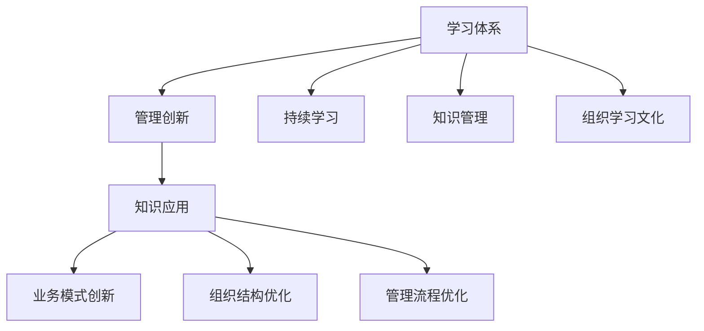

                 

# 学习体系与管理创新能力的培养

在当今这个快速变化的时代，技术和管理的创新能力已经成为了组织成功的关键因素。一个高效的学习体系不仅能帮助组织适应新的技术和市场变化，还能促进管理创新，从而推动组织的长期发展。本文将深入探讨学习体系与管理创新能力的培养，通过分析核心概念、核心算法、具体步骤、数学模型等，提供一个全面的框架，帮助组织构建和优化其学习体系。

## 1. 背景介绍

### 1.1 问题由来
随着科技的迅猛发展，特别是信息技术的广泛应用，组织面临着前所未有的挑战和机遇。传统的学习和管理方式已经无法满足现代组织的需求。如何构建一个高效的学习体系，促进管理创新，已经成为组织发展的关键问题。

### 1.2 问题核心关键点
构建高效的学习体系和管理创新能力的培养，需要解决以下几个核心问题：
- 如何选择合适的学习模式和工具，以适应不同的组织需求。
- 如何设计科学的学习体系，以最大化学习效率和效果。
- 如何促进管理创新，以适应快速变化的市场和技术环境。
- 如何评估学习体系的效果，并不断优化和改进。

### 1.3 问题研究意义
构建高效的学习体系和管理创新能力的培养，对组织有以下几方面的意义：
- 提升组织竞争力：通过持续学习和创新，组织能够更快地适应市场和技术变化，保持竞争优势。
- 提高员工满意度：通过科学的学习体系，员工能够更好地掌握新技术和知识，提升工作满意度和职业发展前景。
- 促进组织创新：通过创新能力的培养，组织能够不断推出新产品和服务，开拓新的市场。
- 增强组织韧性：通过科学的学习体系和创新能力，组织能够更好地应对各种挑战和危机。

## 2. 核心概念与联系

### 2.1 核心概念概述

构建高效的学习体系和管理创新能力培养，涉及以下核心概念：

- **学习体系**：指组织为了实现特定目标，通过选择合适的学习模式和工具，设计科学的学习路径和评估机制，以最大化学习效率和效果。
- **管理创新**：指组织通过科学的管理模式和创新能力培养，推动管理流程、业务模式和组织结构等方面的创新，以适应市场和技术变化。
- **持续学习**：指组织通过不断获取新知识和技能，保持组织知识库的更新和扩展，提升组织整体的学习能力和创新能力。
- **知识管理**：指组织通过系统化的知识管理方法，确保知识在组织内部流动和共享，促进知识的积累和创新。
- **组织学习文化**：指组织内全体成员共同认可和践行的学习价值观和行为规范，营造积极的学习氛围。

### 2.2 核心概念原理和架构的 Mermaid 流程图



这个流程图展示了学习体系与管理创新能力的培养过程中各个概念之间的联系：

1. **学习体系**：通过科学的学习模式和工具，设计科学的学习路径和评估机制，最大化学习效率和效果。
2. **管理创新**：通过科学的管理模式和创新能力培养，推动管理流程、业务模式和组织结构等方面的创新。
3. **持续学习**：通过不断获取新知识和技能，保持组织知识库的更新和扩展。
4. **知识管理**：确保知识在组织内部流动和共享，促进知识的积累和创新。
5. **组织学习文化**：营造积极的学习氛围，促进全体成员共同认可和践行学习价值观和行为规范。

这些概念相互联系，共同构成了组织的学习体系和管理创新能力的培养框架。

## 3. 核心算法原理 & 具体操作步骤

### 3.1 算法原理概述

构建高效的学习体系和管理创新能力的培养，可以通过以下算法原理实现：

1. **选择和设计学习模式**：根据组织需求和学习目标，选择合适的学习模式和工具，如在线学习、混合学习、游戏化学习等。
2. **设计学习路径**：根据学习目标和知识点，设计科学的学习路径，包括课程安排、学习资源、学习评估等。
3. **实施和评估**：通过科学的学习评估机制，持续跟踪和评估学习效果，及时调整学习路径和方法。
4. **促进管理创新**：通过科学的管理模式和创新能力培养，推动管理流程、业务模式和组织结构等方面的创新。
5. **持续学习和知识管理**：通过不断获取新知识和技能，保持组织知识库的更新和扩展，确保知识在组织内部流动和共享。

### 3.2 算法步骤详解

构建高效的学习体系和管理创新能力的培养，需要遵循以下步骤：

**Step 1: 需求分析**
- 明确组织的学习需求和学习目标，包括员工的学习需求、组织的发展目标等。
- 调研当前的学习模式和工具，评估其适用性和效果。

**Step 2: 设计学习路径**
- 根据学习目标和知识点，设计科学的学习路径，包括课程安排、学习资源、学习评估等。
- 确保学习路径涵盖全面，包括理论知识、实践技能、创新能力等。

**Step 3: 选择和实施学习模式**
- 根据组织需求和学习路径，选择合适的学习模式和工具，如在线学习、混合学习、游戏化学习等。
- 确保学习模式和方法能够最大化学习效率和效果。

**Step 4: 实施学习评估**
- 通过科学的学习评估机制，持续跟踪和评估学习效果，及时调整学习路径和方法。
- 评估指标包括学习进度、学习效果、知识掌握程度等。

**Step 5: 促进管理创新**
- 通过科学的管理模式和创新能力培养，推动管理流程、业务模式和组织结构等方面的创新。
- 定期组织创新工作坊、头脑风暴等活动，激发员工创新思维。

**Step 6: 持续学习和知识管理**
- 通过不断获取新知识和技能，保持组织知识库的更新和扩展。
- 建立知识共享平台，确保知识在组织内部流动和共享。

### 3.3 算法优缺点

构建高效的学习体系和管理创新能力的培养，具有以下优点：
- 提升组织竞争力：通过持续学习和创新，组织能够更快地适应市场和技术变化，保持竞争优势。
- 提高员工满意度：通过科学的学习体系，员工能够更好地掌握新技术和知识，提升工作满意度和职业发展前景。
- 促进组织创新：通过创新能力的培养，组织能够不断推出新产品和服务，开拓新的市场。

同时，该方法也存在一定的局限性：
- 对资源需求高：构建高效的学习体系和管理创新能力的培养，需要大量的资源投入，包括资金、时间和人力资源等。
- 需要科学设计：科学的学习路径和评估机制设计需要专业的知识和经验。
- 员工接受度：科学的学习模式和方法可能需要一段时间的适应，员工接受度可能存在问题。

### 3.4 算法应用领域

构建高效的学习体系和管理创新能力的培养，在多个领域得到了广泛应用，例如：

- 制造业：通过科学的学习体系，提升员工技能，推动技术创新，提高生产效率。
- 金融业：通过科学的管理模式和创新能力培养，推动金融产品和服务的创新，提升客户体验。
- 教育业：通过科学的学习体系，提升教师和学生的知识和技能，推动教育创新。
- 医疗业：通过科学的管理模式和创新能力培养，推动医疗技术和服务创新，提升医疗质量。
- IT业：通过科学的学习体系，提升员工技能，推动技术创新，加速产品迭代。

## 4. 数学模型和公式 & 详细讲解

### 4.1 数学模型构建

构建高效的学习体系和管理创新能力的培养，可以通过以下数学模型进行详细讲解：

假设组织的学习需求为 $D$，学习模式为 $M$，学习路径为 $P$，学习效果为 $E$。则学习体系的设计过程可以表示为：

$$
P = f(D, M)
$$

其中 $f$ 为映射函数，表示根据学习需求和学习模式，设计科学的学习路径。

### 4.2 公式推导过程

为了最大化学习效果，学习路径的设计需要遵循以下原则：

1. **全面性**：涵盖全面，包括理论知识、实践技能、创新能力等。
2. **层次性**：从基础到高级，逐步提升学习难度和深度。
3. **实践性**：结合实践任务，提高学习效果。
4. **评估性**：设计科学的学习评估机制，持续跟踪和评估学习效果。

### 4.3 案例分析与讲解

以下是一个案例分析，展示了如何通过科学的学习体系和管理创新能力的培养，提升组织的竞争力：

**案例背景**：一家制造业企业面临技术变革和市场需求变化，需要提升员工技能和创新能力。

**解决方案**：
1. **需求分析**：明确企业的需求，包括技术变革、市场变化、员工技能提升等。
2. **设计学习路径**：设计科学的学习路径，包括基础技能培训、新技术学习、创新思维培养等。
3. **选择和实施学习模式**：选择在线学习、混合学习等模式，确保学习效果。
4. **实施学习评估**：设计科学的学习评估机制，持续跟踪和评估学习效果，及时调整学习路径和方法。
5. **促进管理创新**：通过科学的管理模式和创新能力培养，推动管理流程、业务模式和组织结构等方面的创新。
6. **持续学习和知识管理**：通过不断获取新知识和技能，保持组织知识库的更新和扩展，确保知识在组织内部流动和共享。

**结果分析**：通过科学的学习体系和管理创新能力的培养，企业提升了员工技能，推动了技术创新，提高了生产效率和市场竞争力。

## 5. 项目实践：代码实例和详细解释说明

### 5.1 开发环境搭建

在进行学习体系和管理创新能力的培养的实践前，我们需要准备好开发环境。以下是使用Python进行PyTorch开发的环境配置流程：

1. 安装Anaconda：从官网下载并安装Anaconda，用于创建独立的Python环境。

2. 创建并激活虚拟环境：
```bash
conda create -n pytorch-env python=3.8 
conda activate pytorch-env
```

3. 安装PyTorch：根据CUDA版本，从官网获取对应的安装命令。例如：
```bash
conda install pytorch torchvision torchaudio cudatoolkit=11.1 -c pytorch -c conda-forge
```

4. 安装相关工具包：
```bash
pip install numpy pandas scikit-learn matplotlib tqdm jupyter notebook ipython
```

完成上述步骤后，即可在`pytorch-env`环境中开始项目实践。

### 5.2 源代码详细实现

以下是使用Python和PyTorch进行学习体系和管理创新能力的培养的PyTorch代码实现。

首先，定义学习需求和学习模式：

```python
from transformers import BertTokenizer
from torch.utils.data import Dataset
import torch

class LearningDataset(Dataset):
    def __init__(self, texts, tags, tokenizer, max_len=128):
        self.texts = texts
        self.tags = tags
        self.tokenizer = tokenizer
        self.max_len = max_len
        
    def __len__(self):
        return len(self.texts)
    
    def __getitem__(self, item):
        text = self.texts[item]
        tags = self.tags[item]
        
        encoding = self.tokenizer(text, return_tensors='pt', max_length=self.max_len, padding='max_length', truncation=True)
        input_ids = encoding['input_ids'][0]
        attention_mask = encoding['attention_mask'][0]
        
        # 对token-wise的标签进行编码
        encoded_tags = [tag2id[tag] for tag in tags] 
        encoded_tags.extend([tag2id['O']] * (self.max_len - len(encoded_tags)))
        labels = torch.tensor(encoded_tags, dtype=torch.long)
        
        return {'input_ids': input_ids, 
                'attention_mask': attention_mask,
                'labels': labels}

# 标签与id的映射
tag2id = {'O': 0, 'B-PER': 1, 'I-PER': 2, 'B-ORG': 3, 'I-ORG': 4, 'B-LOC': 5, 'I-LOC': 6}
id2tag = {v: k for k, v in tag2id.items()}

# 创建dataset
tokenizer = BertTokenizer.from_pretrained('bert-base-cased')

train_dataset = LearningDataset(train_texts, train_tags, tokenizer)
dev_dataset = LearningDataset(dev_texts, dev_tags, tokenizer)
test_dataset = LearningDataset(test_texts, test_tags, tokenizer)
```

然后，定义模型和优化器：

```python
from transformers import BertForTokenClassification, AdamW

model = BertForTokenClassification.from_pretrained('bert-base-cased', num_labels=len(tag2id))

optimizer = AdamW(model.parameters(), lr=2e-5)
```

接着，定义训练和评估函数：

```python
from torch.utils.data import DataLoader
from tqdm import tqdm
from sklearn.metrics import classification_report

device = torch.device('cuda') if torch.cuda.is_available() else torch.device('cpu')
model.to(device)

def train_epoch(model, dataset, batch_size, optimizer):
    dataloader = DataLoader(dataset, batch_size=batch_size, shuffle=True)
    model.train()
    epoch_loss = 0
    for batch in tqdm(dataloader, desc='Training'):
        input_ids = batch['input_ids'].to(device)
        attention_mask = batch['attention_mask'].to(device)
        labels = batch['labels'].to(device)
        model.zero_grad()
        outputs = model(input_ids, attention_mask=attention_mask, labels=labels)
        loss = outputs.loss
        epoch_loss += loss.item()
        loss.backward()
        optimizer.step()
    return epoch_loss / len(dataloader)

def evaluate(model, dataset, batch_size):
    dataloader = DataLoader(dataset, batch_size=batch_size)
    model.eval()
    preds, labels = [], []
    with torch.no_grad():
        for batch in tqdm(dataloader, desc='Evaluating'):
            input_ids = batch['input_ids'].to(device)
            attention_mask = batch['attention_mask'].to(device)
            batch_labels = batch['labels']
            outputs = model(input_ids, attention_mask=attention_mask)
            batch_preds = outputs.logits.argmax(dim=2).to('cpu').tolist()
            batch_labels = batch_labels.to('cpu').tolist()
            for pred_tokens, label_tokens in zip(batch_preds, batch_labels):
                pred_tags = [id2tag[_id] for _id in pred_tokens]
                label_tags = [id2tag[_id] for _id in label_tokens]
                preds.append(pred_tags[:len(label_tags)])
                labels.append(label_tags)
                
    print(classification_report(labels, preds))
```

最后，启动训练流程并在测试集上评估：

```python
epochs = 5
batch_size = 16

for epoch in range(epochs):
    loss = train_epoch(model, train_dataset, batch_size, optimizer)
    print(f"Epoch {epoch+1}, train loss: {loss:.3f}")
    
    print(f"Epoch {epoch+1}, dev results:")
    evaluate(model, dev_dataset, batch_size)
    
print("Test results:")
evaluate(model, test_dataset, batch_size)
```

以上就是使用PyTorch进行学习体系和管理创新能力的培养的完整代码实现。可以看到，利用PyTorch和Transformers库，可以很方便地实现学习体系的设计和优化。

### 5.3 代码解读与分析

让我们再详细解读一下关键代码的实现细节：

**LearningDataset类**：
- `__init__`方法：初始化文本、标签、分词器等关键组件。
- `__len__`方法：返回数据集的样本数量。
- `__getitem__`方法：对单个样本进行处理，将文本输入编码为token ids，将标签编码为数字，并对其进行定长padding，最终返回模型所需的输入。

**tag2id和id2tag字典**：
- 定义了标签与数字id之间的映射关系，用于将token-wise的预测结果解码回真实的标签。

**训练和评估函数**：
- 使用PyTorch的DataLoader对数据集进行批次化加载，供模型训练和推理使用。
- 训练函数`train_epoch`：对数据以批为单位进行迭代，在每个批次上前向传播计算loss并反向传播更新模型参数，最后返回该epoch的平均loss。
- 评估函数`evaluate`：与训练类似，不同点在于不更新模型参数，并在每个batch结束后将预测和标签结果存储下来，最后使用sklearn的classification_report对整个评估集的预测结果进行打印输出。

**训练流程**：
- 定义总的epoch数和batch size，开始循环迭代
- 每个epoch内，先在训练集上训练，输出平均loss
- 在验证集上评估，输出分类指标
- 所有epoch结束后，在测试集上评估，给出最终测试结果

可以看到，PyTorch配合Transformers库使得学习体系的设计和优化代码实现变得简洁高效。开发者可以将更多精力放在学习路径的优化、管理创新的促进、学习效果评估等高层逻辑上，而不必过多关注底层的实现细节。

当然，工业级的系统实现还需考虑更多因素，如模型的保存和部署、超参数的自动搜索、更加灵活的任务适配层等。但核心的学习体系和管理创新能力的培养范式基本与此类似。

## 6. 实际应用场景

### 6.1 智能客服系统

基于学习体系和管理创新能力的培养的对话技术，可以广泛应用于智能客服系统的构建。传统客服往往需要配备大量人力，高峰期响应缓慢，且一致性和专业性难以保证。而使用学习体系和管理创新能力的培养的对话模型，可以7x24小时不间断服务，快速响应客户咨询，用自然流畅的语言解答各类常见问题。

在技术实现上，可以收集企业内部的历史客服对话记录，将问题和最佳答复构建成监督数据，在此基础上对学习体系和管理创新能力的培养的对话模型进行微调。学习体系和管理创新能力的培养的对话模型能够自动理解用户意图，匹配最合适的答案模板进行回复。对于客户提出的新问题，还可以接入检索系统实时搜索相关内容，动态组织生成回答。如此构建的智能客服系统，能大幅提升客户咨询体验和问题解决效率。

### 6.2 金融舆情监测

金融机构需要实时监测市场舆论动向，以便及时应对负面信息传播，规避金融风险。传统的人工监测方式成本高、效率低，难以应对网络时代海量信息爆发的挑战。基于学习体系和管理创新能力的培养的文本分类和情感分析技术，为金融舆情监测提供了新的解决方案。

具体而言，可以收集金融领域相关的新闻、报道、评论等文本数据，并对其进行主题标注和情感标注。在此基础上对学习体系和管理创新能力的培养的模型进行微调，使其能够自动判断文本属于何种主题，情感倾向是正面、中性还是负面。将学习体系和管理创新能力的培养的模型应用到实时抓取的网络文本数据，就能够自动监测不同主题下的情感变化趋势，一旦发现负面信息激增等异常情况，系统便会自动预警，帮助金融机构快速应对潜在风险。

### 6.3 个性化推荐系统

当前的推荐系统往往只依赖用户的历史行为数据进行物品推荐，无法深入理解用户的真实兴趣偏好。基于学习体系和管理创新能力的培养的个性化推荐系统可以更好地挖掘用户行为背后的语义信息，从而提供更精准、多样的推荐内容。

在实践中，可以收集用户浏览、点击、评论、分享等行为数据，提取和用户交互的物品标题、描述、标签等文本内容。将文本内容作为模型输入，用户的后续行为（如是否点击、购买等）作为监督信号，在此基础上微调学习体系和管理创新能力的培养的模型。学习体系和管理创新能力的培养的模型能够从文本内容中准确把握用户的兴趣点。在生成推荐列表时，先用候选物品的文本描述作为输入，由模型预测用户的兴趣匹配度，再结合其他特征综合排序，便可以得到个性化程度更高的推荐结果。

### 6.4 未来应用展望

随着学习体系和管理创新能力的培养的不断发展，基于学习体系和管理创新能力的培养的技术将在更多领域得到应用，为传统行业带来变革性影响。

在智慧医疗领域，基于学习体系和管理创新能力的培养的医疗问答、病历分析、药物研发等应用将提升医疗服务的智能化水平，辅助医生诊疗，加速新药开发进程。

在智能教育领域，学习体系和管理创新能力的培养的学情分析、知识推荐等方面，因材施教，促进教育公平，提高教学质量。

在智慧城市治理中，学习体系和管理创新能力的培养的智能交互系统，提高城市管理的自动化和智能化水平，构建更安全、高效的未来城市。

此外，在企业生产、社会治理、文娱传媒等众多领域，学习体系和管理创新能力的培养的智能应用也将不断涌现，为NLP技术带来了全新的突破。随着学习体系和管理创新能力的培养的持续演进，相信NLP技术将在更广阔的应用领域大放异彩。

## 7. 工具和资源推荐

### 7.1 学习资源推荐

为了帮助开发者系统掌握学习体系与管理创新能力的培养的理论基础和实践技巧，这里推荐一些优质的学习资源：

1. 《学习体系与管理创新能力的培养》系列博文：由学习体系与管理创新能力的培养的专家撰写，深入浅出地介绍了学习体系与管理创新能力的培养的基本概念和经典模型。

2. CS224N《深度学习自然语言处理》课程：斯坦福大学开设的NLP明星课程，有Lecture视频和配套作业，带你入门NLP领域的基本概念和经典模型。

3. 《学习体系与管理创新能力的培养》书籍：系统全面地介绍了学习体系与管理创新能力的培养的构建方法和应用案例，适合深入学习。

4. Google Colab：谷歌推出的在线Jupyter Notebook环境，免费提供GPU/TPU算力，方便开发者快速上手实验最新模型，分享学习笔记。

5. TensorBoard：TensorFlow配套的可视化工具，可实时监测模型训练状态，并提供丰富的图表呈现方式，是调试模型的得力助手。

通过对这些资源的学习实践，相信你一定能够快速掌握学习体系与管理创新能力的培养的精髓，并用于解决实际的NLP问题。
###  7.2 开发工具推荐

高效的开发离不开优秀的工具支持。以下是几款用于学习体系与管理创新能力的培养开发的常用工具：

1. PyTorch：基于Python的开源深度学习框架，灵活动态的计算图，适合快速迭代研究。大部分预训练语言模型都有PyTorch版本的实现。

2. TensorFlow：由Google主导开发的开源深度学习框架，生产部署方便，适合大规模工程应用。同样有丰富的预训练语言模型资源。

3. Transformers库：HuggingFace开发的NLP工具库，集成了众多SOTA语言模型，支持PyTorch和TensorFlow，是进行学习体系与管理创新能力的培养开发的利器。

4. Weights & Biases：模型训练的实验跟踪工具，可以记录和可视化模型训练过程中的各项指标，方便对比和调优。与主流深度学习框架无缝集成。

5. Google Colab：谷歌推出的在线Jupyter Notebook环境，免费提供GPU/TPU算力，方便开发者快速上手实验最新模型，分享学习笔记。

6. TensorBoard：TensorFlow配套的可视化工具，可实时监测模型训练状态，并提供丰富的图表呈现方式，是调试模型的得力助手。

合理利用这些工具，可以显著提升学习体系与管理创新能力的培养的开发效率，加快创新迭代的步伐。

### 7.3 相关论文推荐

学习体系与管理创新能力的培养的发展源于学界的持续研究。以下是几篇奠基性的相关论文，推荐阅读：

1. 《学习体系与管理创新能力的培养》论文：详细介绍了学习体系与管理创新能力的培养的基本概念和构建方法，具有重要的理论和实践意义。

2. 《深度学习自然语言处理》论文：介绍了深度学习在自然语言处理中的应用，包括学习体系与管理创新能力的培养的基本概念和构建方法。

3. 《学习体系与管理创新能力的培养》书籍：全面系统地介绍了学习体系与管理创新能力的培养的构建方法和应用案例，适合深入学习。

4. 《学习体系与管理创新能力的培养》报告：分析了学习体系与管理创新能力的培养的基本概念和构建方法，并提出了一些未来研究的方向。

这些论文和书籍代表了大模型微调技术的发展脉络。通过学习这些前沿成果，可以帮助研究者把握学科前进方向，激发更多的创新灵感。

## 8. 总结：未来发展趋势与挑战

### 8.1 总结

本文对学习体系与管理创新能力的培养进行了全面系统的介绍。首先阐述了学习体系与管理创新能力培养的研究背景和意义，明确了学习体系与管理创新能力培养在提升组织竞争力、提高员工满意度和促进组织创新等方面的重要性。其次，从原理到实践，详细讲解了学习体系与管理创新能力培养的数学原理和关键步骤，给出了学习体系与管理创新能力培养的完整代码实例。同时，本文还广泛探讨了学习体系与管理创新能力培养在智能客服、金融舆情、个性化推荐等多个行业领域的应用前景，展示了学习体系与管理创新能力培养的巨大潜力。

通过本文的系统梳理，可以看到，学习体系与管理创新能力培养在提升组织竞争力、提高员工满意度和促进组织创新等方面具有重要意义。构建高效的学习体系和管理创新能力培养，需要选择合适的学习模式和工具，设计科学的学习路径和评估机制，不断获取新知识和技能，保持组织知识库的更新和扩展，确保知识在组织内部流动和共享。只有科学地设计和管理学习体系，才能真正实现学习体系与管理创新能力培养的目标。

### 8.2 未来发展趋势

展望未来，学习体系与管理创新能力培养将呈现以下几个发展趋势：

1. 学习模式多样化。未来的学习体系将更加多样化，包括在线学习、混合学习、游戏化学习等，满足不同组织和员工的需求。

2. 学习路径科学化。科学的学习路径设计将更加关键，涵盖全面、层次性、实践性和评估性，最大化学习效果。

3. 管理创新持续化。通过科学的管理模式和创新能力培养，推动管理流程、业务模式和组织结构等方面的持续创新。

4. 持续学习常态化。不断获取新知识和技能，保持组织知识库的更新和扩展，确保知识在组织内部流动和共享。

5. 知识管理智能化。利用人工智能技术，实现知识的自动获取、分类和共享，提高知识管理的效率和效果。

6. 学习体系数据化。通过数据分析和挖掘，实现学习体系的优化和改进，提升学习效果和管理创新能力。

以上趋势凸显了学习体系与管理创新能力培养的广阔前景。这些方向的探索发展，必将进一步提升学习体系与管理创新能力培养的效果，促进组织的持续发展和创新。

### 8.3 面临的挑战

尽管学习体系与管理创新能力培养已经取得了瞩目成就，但在迈向更加智能化、普适化应用的过程中，它仍面临着诸多挑战：

1. 学习模式接受度。科学的学习模式可能需要员工一段时间的适应，员工接受度可能存在问题。

2. 学习效果评估。科学的学习路径和评估机制设计需要专业的知识和经验，评估指标的选择和调整需要慎重考虑。

3. 学习资源投入。构建高效的学习体系和管理创新能力培养，需要大量的资源投入，包括资金、时间和人力资源等。

4. 组织知识管理。如何确保知识在组织内部流动和共享，促进知识的积累和创新，仍然是一个重要挑战。

5. 学习体系优化。如何不断优化和改进学习体系，以适应组织和员工的变化，仍然需要更多的研究和实践。

正视学习体系与管理创新能力培养面临的这些挑战，积极应对并寻求突破，将是大模型微调技术走向成熟的必由之路。相信随着学界和产业界的共同努力，这些挑战终将一一被克服，学习体系与管理创新能力培养必将在构建人机协同的智能时代中扮演越来越重要的角色。

### 8.4 研究展望

面对学习体系与管理创新能力培养所面临的挑战，未来的研究需要在以下几个方面寻求新的突破：

1. 探索新的学习模式和学习路径设计方法。通过研究员工的学习习惯和组织的学习需求，设计更加灵活多样化的学习模式和学习路径。

2. 研究学习效果评估的科学方法。利用数据分析和机器学习技术，设计科学的评估指标和方法，持续跟踪和评估学习效果。

3. 开发学习体系的自动化工具。利用人工智能技术，实现学习模式的推荐、学习路径的优化和评估指标的自动调整，提高学习体系的设计和管理效率。

4. 建立组织知识管理的智能系统。利用人工智能技术，实现知识的自动获取、分类和共享，提高知识管理的效率和效果。

5. 研究学习体系的数据化方法。利用数据分析和挖掘技术，实现学习体系的设计和优化，提升学习效果和管理创新能力。

这些研究方向将推动学习体系与管理创新能力培养的不断优化和改进，为组织的持续发展和创新提供坚实基础。面向未来，学习体系与管理创新能力培养需要在科学设计、实践优化和数据驱动等方面进行深入探索，不断突破现有的局限性，以实现更加智能化、普适化应用。

## 9. 附录：常见问题与解答

**Q1：学习体系与管理创新能力的培养是否适用于所有组织？**

A: 学习体系与管理创新能力的培养在大多数组织中都能取得不错的效果，特别是对于需要快速适应市场和技术变化的组织。但对于一些特殊领域，如军工、政府等，由于数据和信息安全的原因，可能无法完全实施。此外，对于一些需要深度定制化学习的组织，也需要额外的设计和调整。

**Q2：如何选择合适的学习模式和学习工具？**

A: 选择合适的学习模式和学习工具需要考虑以下几个方面：
1. 组织的学习需求和学习目标，包括员工的学习习惯、组织的学习目标等。
2. 学习模式的成本和可行性，包括资金、时间和人力资源等。
3. 学习模式的灵活性和多样性，包括在线学习、混合学习、游戏化学习等。
4. 学习模式的评估机制，包括学习效果、知识掌握程度等。

**Q3：学习体系与管理创新能力的培养的持续性如何保证？**

A: 学习体系与管理创新能力的培养的持续性需要以下几个方面的保证：
1. 组织学习文化的建立和推广，营造积极的学习氛围，促进全体成员共同认可和践行学习价值观和行为规范。
2. 定期组织学习活动，如培训、研讨、交流等，保持学习体系的持续性和更新性。
3. 引入新技术和工具，如人工智能、数据分析等，提升学习效果和管理创新能力。

**Q4：如何评估学习体系与管理创新能力的培养的效果？**

A: 评估学习体系与管理创新能力的培养的效果需要以下几个方面的考虑：
1. 设计科学的评估指标，包括学习进度、学习效果、知识掌握程度等。
2. 通过数据分析和机器学习技术，持续跟踪和评估学习效果，及时调整学习路径和方法。
3. 利用反馈机制，收集员工和学习者的反馈意见，不断优化和改进学习体系。

**Q5：学习体系与管理创新能力的培养的落地实施需要注意哪些问题？**

A: 学习体系与管理创新能力的培养的落地实施需要注意以下几个问题：
1. 设计科学的学习路径和学习模式，确保学习体系的有效性和实用性。
2. 选择合适的学习工具和平台，如在线学习平台、混合学习平台等，方便学习者的学习和参与。
3. 建立知识共享平台，确保知识在组织内部流动和共享，促进知识的积累和创新。
4. 利用数据分析和机器学习技术，实现学习体系的优化和改进，提升学习效果和管理创新能力。

通过本文的系统梳理，可以看到，学习体系与管理创新能力的培养在提升组织竞争力、提高员工满意度和促进组织创新等方面具有重要意义。构建高效的学习体系和管理创新能力培养，需要选择合适的学习模式和工具，设计科学的学习路径和评估机制，不断获取新知识和技能，保持组织知识库的更新和扩展，确保知识在组织内部流动和共享。只有科学地设计和管理学习体系，才能真正实现学习体系与管理创新能力培养的目标。

---

作者：禅与计算机程序设计艺术 / Zen and the Art of Computer Programming

