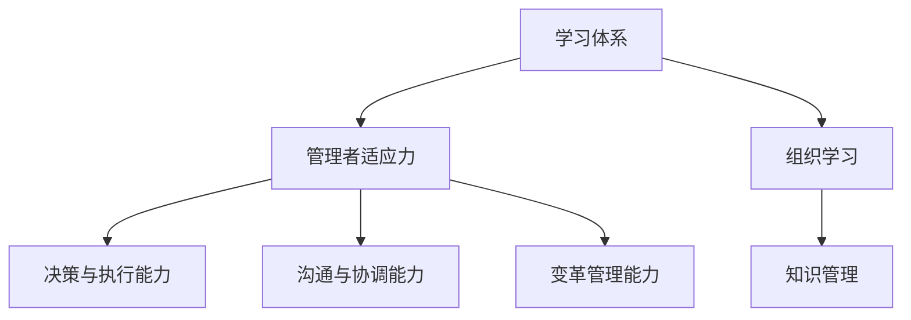

                 

# 学习体系对管理者适应力的影响

> 关键词：学习体系, 管理者适应力, 组织学习, 知识管理, 绩效提升

## 1. 背景介绍

### 1.1 问题由来
在当今快速变化的商业环境中，管理者面临的挑战日益增加。市场的瞬息万变、技术的快速迭代、行业的不断变革，要求管理者具备更强的适应力，以应对复杂多变的商业环境。适应力不足的管理者，往往难以敏锐捕捉市场机遇，及时做出决策，甚至可能陷入发展的泥潭。因此，提高管理者的适应力成为管理科学的重要课题。

### 1.2 问题核心关键点
适应力是指个体或团队应对外部环境变化的能力，能够快速调整和优化其内部结构与行为，以实现目标的最佳状态。管理者的适应力直接关系到组织的绩效和竞争力。具体而言，管理者适应力包括但不限于：

1. **学习与创新能力**：持续学习和吸收新知识，勇于创新，突破常规。
2. **决策与执行能力**：能够基于最新信息做出快速而有效的决策，并有效执行。
3. **沟通与协调能力**：能够与不同背景和视角的团队成员沟通协作，协调资源。
4. **变革管理能力**：能够领导组织进行战略性变革，推动组织向前发展。

近年来，随着学习科学和组织行为学的深入研究，越来越多的研究表明，通过建立系统化的学习体系，可以有效提升管理者的适应力。本文将详细探讨学习体系对管理者适应力的影响，并提出具体的方法和建议。

## 2. 核心概念与联系

### 2.1 核心概念概述

为更好地理解学习体系对管理者适应力的影响，本节将介绍几个密切相关的核心概念：

- **学习体系（Learning System）**：由学习策略、工具、资源和支持结构组成的系统，旨在促进持续学习和知识管理，提升组织和个人的适应力。
- **管理者适应力（Managerial Adaptive Capability）**：管理者在面对环境变化时，能够快速调整和优化其决策、行为和组织结构的能力。
- **组织学习（Organizational Learning）**：组织成员通过互动、反馈和反思，共享知识、改进流程和提升能力的过程。
- **知识管理（Knowledge Management）**：系统化地收集、存储、共享和使用组织内部和外部的知识，以提升组织绩效和个人能力。

这些核心概念之间的逻辑关系可以通过以下Mermaid流程图来展示：



这个流程图展示了几者之间的关系：

1. 学习体系通过组织学习过程，传递和扩散知识，从而提升管理者的适应力。
2. 组织学习是学习体系的核心环节，涉及知识的生成、共享和应用。
3. 知识管理通过优化知识流，促进组织学习和知识应用，进而提升管理者适应力。
4. 管理者适应力是学习体系和组织学习的最终目标，也是衡量学习体系效果的重要指标。

## 3. 核心算法原理 & 具体操作步骤
### 3.1 算法原理概述

学习体系对管理者适应力的提升，主要通过以下几个机制：

1. **知识共享与协作**：通过知识共享平台、工作坊、讨论会等形式，促进知识在组织内部的传播和应用。
2. **持续学习与反馈**：提供持续学习的资源和平台，并通过反馈机制，不断优化学习内容和方法。
3. **绩效评估与激励**：通过定期的绩效评估和激励机制，激发管理者的学习动机和适应力。

这些机制的协同作用，能够显著提升管理者的适应力，从而提升组织的整体绩效和竞争力。

### 3.2 算法步骤详解

学习体系对管理者适应力的提升，可以分为以下几个关键步骤：

**Step 1: 建立学习体系**
- 定义学习体系的目标和范围，明确知识管理的策略和框架。
- 选择适合的知识共享工具和技术，如LMS（学习管理系统）、知识管理系统等。

**Step 2: 实施知识共享**
- 建立知识共享平台，如内网、Wiki、论坛等，促进知识传播。
- 定期组织知识分享活动，如研讨会、工作坊、讲座等，增加知识应用的机会。

**Step 3: 开展持续学习**
- 提供持续学习的资源，如在线课程、图书、研究论文等。
- 建立学习社区，鼓励团队成员之间的互动和讨论，促进知识共享和创新。

**Step 4: 优化知识管理**
- 通过数据分析和反馈机制，优化知识管理策略。
- 定期评估知识管理效果，调整优化知识管理流程。

**Step 5: 绩效评估与激励**
- 定期进行绩效评估，识别管理者在适应力方面的改进空间。
- 设计激励机制，如奖励计划、晋升机会等，激励管理者的学习和适应行为。

### 3.3 算法优缺点

建立和实施学习体系，对提升管理者适应力具有显著的优势：

- **提升知识水平**：通过持续学习和知识共享，管理者能够掌握最新的行业趋势和技术，提升决策能力。
- **增强团队协作**：知识共享和协作机制，能够增强团队成员之间的沟通和合作，提升整体绩效。
- **促进创新与发展**：系统化的学习体系能够激发管理者的创新思维，推动组织变革和发展。

但同时，学习体系的建立和实施也存在一些局限性：

- **成本高**：知识管理系统和工具的采购、开发和维护需要一定的成本。
- **复杂度高**：学习体系的建立需要系统化的设计和实施，管理难度较大。
- **变革阻力**：部分管理者可能对新系统和新流程存在抵触情绪，影响推广效果。

尽管存在这些局限性，但学习体系对管理者适应力的提升效果不容忽视，因此在实施时应权衡利弊，选择合适的策略和方法。

### 3.4 算法应用领域

学习体系对管理者适应力的提升，在以下领域具有广泛的应用：

- **企业战略规划**：通过系统化的学习体系，提升管理者的战略洞察力和决策能力，推动企业长期发展。
- **产品创新与研发**：管理者通过学习新技术和新知识，提升创新能力，推动产品迭代和研发进程。
- **市场拓展与品牌建设**：管理者通过持续学习和市场分析，提升市场敏感度和品牌建设能力，拓展市场份额。
- **人力资源管理**：管理者通过学习最佳人力资源管理实践，提升人才吸引和培养能力，优化组织结构。

这些领域的学习体系设计和实施，都需要根据具体情境进行定制化设计，以充分发挥其作用。

## 4. 数学模型和公式 & 详细讲解  
### 4.1 数学模型构建

本节将使用数学语言对学习体系对管理者适应力的影响进行更加严格的刻画。

设 $M$ 为管理者集合，$E$ 为环境变化集合，$L$ 为学习体系，$A$ 为适应力提升模型。假设管理者的初始适应力为 $A_0$，通过学习体系 $L$ 的作用，在环境变化 $E$ 的影响下，管理者的适应力提升为 $A_t$。

定义适应力提升模型 $A_t = f(L, E, A_0)$，其中：

- $f$ 为适应力提升函数，描述学习体系 $L$ 和环境变化 $E$ 对适应力的影响。
- $L$ 为学习体系，包括知识管理、持续学习、绩效评估等组件。
- $E$ 为环境变化，包括市场变化、技术迭代、政策调整等。
- $A_0$ 为管理者的初始适应力。

### 4.2 公式推导过程

以二分类任务为例，推导学习体系对管理者适应力提升的公式。

假设管理者在初始状态下的适应力为 $A_0$，通过学习体系 $L$ 和环境变化 $E$ 的作用，适应力提升为 $A_t$。则适应力提升模型为：

$$
A_t = f(L, E, A_0)
$$

假设适应力提升函数 $f$ 为线性函数，则有：

$$
A_t = A_0 + \alpha * (L * E)
$$

其中 $\alpha$ 为适应力提升系数，$L$ 为学习体系的效能，$E$ 为环境变化的强度。

在实践中，学习体系和环境变化的具体形式可能非常复杂，需要根据实际情况进行具体建模和推导。

### 4.3 案例分析与讲解

以某跨国企业为例，探讨学习体系对管理者适应力的影响。

该企业通过建立知识共享平台，定期组织知识分享会，提供持续学习的在线课程，实施绩效评估和激励机制，成功地提升了管理者的适应力。具体来说：

- **知识共享平台**：企业建立了企业内网和Wiki，供员工上传和分享文档、项目进展、技术方案等。
- **知识分享会**：每月组织一次跨部门的知识分享会，邀请各部门专家分享最新知识和经验。
- **在线课程**：通过在线学习平台，为员工提供丰富的学习资源，包括内部培训、外部课程等。
- **绩效评估**：定期进行绩效评估，评估管理者的学习效果和适应力提升情况，并进行针对性的培训和辅导。
- **激励机制**：设计奖励计划，对在适应力提升方面表现突出的管理者进行表彰和奖励。

通过以上措施，企业管理者的适应力显著提升，能够更好地应对市场变化和环境挑战，推动企业持续发展。

## 5. 项目实践：代码实例和详细解释说明
### 5.1 开发环境搭建

在进行学习体系设计和实施前，我们需要准备好开发环境。以下是使用Python进行PyTorch开发的环境配置流程：

1. 安装Anaconda：从官网下载并安装Anaconda，用于创建独立的Python环境。

2. 创建并激活虚拟环境：
```bash
conda create -n pytorch-env python=3.8 
conda activate pytorch-env
```

3. 安装PyTorch：根据CUDA版本，从官网获取对应的安装命令。例如：
```bash
conda install pytorch torchvision torchaudio cudatoolkit=11.1 -c pytorch -c conda-forge
```

4. 安装各类工具包：
```bash
pip install numpy pandas scikit-learn matplotlib tqdm jupyter notebook ipython
```

完成上述步骤后，即可在`pytorch-env`环境中开始学习体系开发实践。

### 5.2 源代码详细实现

下面我们以知识共享平台为例，给出使用PyTorch代码实现的知识共享系统。

首先，定义知识共享平台的基本功能模块：

```python
from flask import Flask, request, jsonify

app = Flask(__name__)

# 定义知识库
knowledge_base = {}

# 定义知识分享接口
@app.route('/knowledge/share', methods=['POST'])
def share_knowledge():
    data = request.get_json()
    name = data['name']
    content = data['content']
    
    # 将知识添加到知识库
    knowledge_base[name] = content
    return jsonify({'message': '知识添加成功'})

# 定义知识查询接口
@app.route('/knowledge/query', methods=['GET'])
def query_knowledge():
    name = request.args.get('name')
    if name in knowledge_base:
        return jsonify({'content': knowledge_base[name]})
    else:
        return jsonify({'message': '知识不存在'})

# 定义知识搜索接口
@app.route('/knowledge/search', methods=['GET'])
def search_knowledge():
    query = request.args.get('query')
    results = []
    for name, content in knowledge_base.items():
        if query in content:
            results.append({'name': name, 'content': content})
    return jsonify({'results': results})
```

然后，启动知识共享平台的服务器：

```bash
if __name__ == '__main__':
    app.run(debug=True)
```

以上就是使用PyTorch对知识共享平台进行实现的完整代码实现。可以看到，通过简单的Flask框架，我们实现了一个基本的知识共享平台，能够支持知识的添加、查询和搜索功能。

### 5.3 代码解读与分析

让我们再详细解读一下关键代码的实现细节：

**Flask框架**：
- `Flask`：轻量级的Python Web框架，方便构建RESTful API。
- `@app.route`：装饰器，用于定义API接口和HTTP方法。
- `request`：处理HTTP请求的Python对象，提供了GET、POST等多种方法。
- `jsonify`：将Python对象转换为JSON格式，方便API响应。

**知识共享平台功能模块**：
- `knowledge_base`：字典，存储知识库，键为知识名称，值为知识内容。
- `share_knowledge`：添加知识的接口，接收JSON格式的请求数据，将知识添加到知识库中。
- `query_knowledge`：查询知识的接口，根据知识名称返回对应的知识内容。
- `search_knowledge`：搜索知识的接口，根据查询字符串返回所有包含查询关键字的知识。

**知识共享平台启动**：
- `if __name__ == '__main__'`：确保代码只在直接运行时启动，避免多进程并发访问时的冲突。
- `app.run(debug=True)`：启动Flask应用，监听本地的8080端口，开启调试模式，方便测试和调试。

通过Flask框架，我们可以快速构建一个基本的知识共享平台，支持知识的添加、查询和搜索功能。开发者可以根据具体需求，灵活定制和扩展平台功能。

当然，工业级的系统实现还需考虑更多因素，如安全性、性能优化、用户界面等。但核心的知识共享范式基本与此类似。

## 6. 实际应用场景
### 6.1 智慧城市治理

在智慧城市治理中，知识共享平台能够为城市管理者提供丰富的信息资源，提升决策的科学性和效率。具体而言，可以收集城市的各类数据，如交通流量、环境监测、公共服务数据等，并将这些数据整合到知识共享平台中。

城市管理者可以通过平台查询各类数据，分析城市运行状态，制定针对性的治理措施。例如，通过分析交通流量数据，可以优化交通信号灯的配置，提升交通流畅度。通过分析环境监测数据，可以预测污染趋势，提前采取应对措施。通过分析公共服务数据，可以优化资源分配，提高服务效率。

### 6.2 企业战略规划

在企业战略规划中，知识共享平台能够帮助管理层快速获取行业动态和技术趋势，制定战略决策。具体而言，企业可以通过平台收集和分析市场数据、竞争对手动态、技术专利等信息，并及时传递给管理层，提升战略规划的准确性和及时性。

管理层可以通过平台获取最新的行业信息和战略建议，做出更为科学和合理的战略决策。例如，通过分析市场数据，可以预测市场变化，调整产品策略。通过分析竞争对手动态，可以制定差异化战略，提升市场竞争力。通过分析技术专利，可以抓住技术创新机会，保持技术领先地位。

### 6.3 医疗健康管理

在医疗健康管理中，知识共享平台能够帮助医护人员获取最新的医疗知识和研究成果，提升诊疗水平。具体而言，医院可以将各类医疗资料、病例记录、研究成果等上传至平台，供医护人员查阅和学习。

医护人员可以通过平台获取最新的医疗知识和技术，提升诊疗水平。例如，通过查询最新的研究论文，可以掌握最新的诊疗技术和治疗方案。通过查询病例记录，可以学习成功的治疗经验和教训，提升诊疗效果。通过查询医疗资料，可以获取详细的疾病信息和诊疗指南，提供精准的医疗服务。

### 6.4 教育培训系统

在教育培训系统中，知识共享平台能够为教师和学生提供丰富的教育资源，提升教学和学习效果。具体而言，学校可以将各类课程资料、教学视频、习题库等上传到平台，供教师和学生查阅和学习。

教师可以通过平台获取最新的教学资源和教学方法，提升教学效果。例如，通过查询最新的课程资料，可以掌握最新的教学内容和方法。通过查询教学视频，可以学习先进的教学技巧和方法。通过查询习题库，可以获取各类习题和解答，提升教学质量。

学生可以通过平台获取丰富的学习资源和练习题目，提升学习效果。例如，通过查询各类课程资料，可以掌握课程内容和方法。通过查询教学视频，可以学习先进的教学技巧和方法。通过查询习题库，可以获取各类习题和解答，提升学习质量。

## 7. 工具和资源推荐
### 7.1 学习资源推荐

为了帮助开发者系统掌握学习体系的设计和实施方法，这里推荐一些优质的学习资源：

1. **《组织学习与知识管理》**：这是一本介绍组织学习和知识管理的经典书籍，系统介绍了相关理论和方法，适合管理者阅读。

2. **Coursera《组织学习与变革管理》**：斯坦福大学开设的在线课程，涵盖组织学习、知识管理、变革管理等主题，提供丰富的案例和视频资源。

3. **Knowledge Management Institute (KMI)**：专注于知识管理的研究和实践，提供大量的工具和资源，帮助企业建立知识管理框架。

4. **MIT Sloan Management Review**：麻省理工斯隆管理评论，提供大量的管理和组织学习研究论文和案例分析，适合管理者阅读。

5. **IBM Watson Knowledge Center**：IBM的知识管理平台，提供丰富的知识管理工具和实践案例，帮助企业提升知识管理能力。

通过对这些资源的学习实践，相信你一定能够快速掌握学习体系的设计和实施方法，并用于解决实际的管理问题。

### 7.2 开发工具推荐

高效的开发离不开优秀的工具支持。以下是几款用于学习体系开发和知识管理系统的常用工具：

1. **Confluence**：Atlassian开发的企业级知识管理工具，支持文档协作、知识共享、搜索等功能。

2. **SharePoint**：微软开发的企业级协作平台，提供文档管理、知识共享、协作讨论等功能。

3. **Notion**：Notion Labs开发的灵活文档管理工具，支持文档协作、知识共享、任务管理等功能。

4. **Slack**：Slack Technologies开发的企业级协作工具，支持即时消息、知识共享、项目管理等功能。

5. **JIRA**：Atlassian开发的项目管理工具，支持任务管理、进度跟踪、问题追踪等功能。

6. **Google Workspace**：谷歌提供的一站式办公套件，包括文档协作、知识共享、项目管理等功能。

合理利用这些工具，可以显著提升学习体系的开发效率，加快创新迭代的步伐。

### 7.3 相关论文推荐

学习体系和知识管理的理论研究取得了丰硕的成果，以下是几篇奠基性的相关论文，推荐阅读：

1. **Organizational Learning and Knowledge Management**：Deutsch, K.W. 1994年发表的论文，系统介绍了组织学习和知识管理的理论框架和实践方法。

2. **Learning Organizations**：Senge, P.M. 1990年发表的论文，提出了学习型组织的概念和实践方法，推动了组织学习的研究。

3. **Knowledge Sharing and Distributed Knowledge**：Davenport, T.H. 1998年发表的论文，探讨了知识共享和分布式知识管理的方法和挑战。

4. **Knowledge Management in Practice**：Nonaka, I. 1994年发表的论文，介绍了日本企业知识管理的成功经验，提供了实践借鉴。

5. **Knowledge Sharing and Collaboration in Social Media**：Wu, K.K. 2014年发表的论文，探讨了社交媒体在知识共享和协作中的应用和挑战。

这些论文代表了大数据、知识管理的研究方向，通过学习这些前沿成果，可以帮助研究者把握学科前进方向，激发更多的创新灵感。

## 8. 总结：未来发展趋势与挑战

### 8.1 总结

本文对学习体系对管理者适应力的影响进行了全面系统的介绍。首先阐述了学习体系在提高管理者适应力方面的重要性和关键机制，明确了学习体系对组织绩效和竞争力的提升作用。其次，从原理到实践，详细讲解了学习体系的构建和实施方法，提供了具体的代码实现和案例分析。同时，本文还广泛探讨了学习体系在智慧城市、企业战略、医疗健康、教育培训等多个领域的应用前景，展示了学习体系的多样化应用潜力。此外，本文精选了学习体系的各类学习资源，力求为读者提供全方位的技术指引。

通过本文的系统梳理，可以看到，学习体系在提高管理者适应力方面具有显著优势，是组织管理和学习的重要工具。学习体系通过知识共享、持续学习、绩效评估等机制，帮助管理者提升决策能力、团队协作能力和变革管理能力，从而推动组织持续发展和竞争力提升。

### 8.2 未来发展趋势

展望未来，学习体系的应用将呈现以下几个发展趋势：

1. **数据驱动的决策支持**：通过数据挖掘和分析，学习体系将提供更为精准的决策支持，提升管理者决策的科学性和及时性。
2. **智能化的知识管理**：结合人工智能和机器学习技术，学习体系将实现更为智能化的知识管理和应用，提升知识管理的效率和效果。
3. **跨领域的知识融合**：学习体系将融合不同领域和学科的知识，提升管理者的跨领域综合能力，推动组织创新和变革。
4. **移动化的学习体验**：学习体系将支持移动设备和平台，提供随时随地、便捷灵活的学习体验，提升管理者的学习和适应能力。
5. **社交化的知识共享**：学习体系将支持社交网络和协作工具，促进知识在组织内部和外部的广泛共享和应用。

以上趋势凸显了学习体系对管理者适应力的重要影响，未来将随着技术的发展和应用的推广，进一步提升学习体系的价值和应用范围。

### 8.3 面临的挑战

尽管学习体系在提高管理者适应力方面具有显著优势，但在推广和实施过程中，仍面临诸多挑战：

1. **数据质量与整合**：学习体系需要高质量的数据输入，但数据的获取、清洗和整合往往需要大量的时间和资源。
2. **技术复杂度**：学习体系的设计和实施需要先进的技术手段，对技术水平和实施能力提出了较高要求。
3. **用户接受度**：部分管理者可能对新系统和新流程存在抵触情绪，影响学习体系推广效果。
4. **资源投入**：学习体系的建设和维护需要大量的人力和财力投入，可能对中小型企业构成挑战。
5. **知识传递效果**：学习体系需要高效的沟通和协作机制，否则知识传递效果可能大打折扣。

尽管存在这些挑战，但学习体系对管理者适应力的提升效果不容忽视，因此在实施时应综合考虑技术、管理和资源等多方面因素，选择合适的策略和方法。

### 8.4 研究展望

面对学习体系面临的挑战，未来的研究需要在以下几个方面寻求新的突破：

1. **高效数据管理**：开发高效的数据获取、清洗和整合工具，提升数据质量，优化数据流。
2. **智能知识管理**：结合人工智能和机器学习技术，提升知识管理的智能化和自动化水平，降低管理难度。
3. **跨领域知识融合**：构建跨领域知识图谱和知识库，促进不同学科和领域的知识融合，提升跨领域综合能力。
4. **用户接受度提升**：设计更为灵活和人性化的系统界面，提升用户接受度和满意度。
5. **资源优化配置**：优化学习体系的资源配置和管理，降低实施成本，提升经济效益。

这些研究方向的探索，必将引领学习体系迈向更高的台阶，为管理者适应力的提升和组织发展的持续推进提供坚实的基础。总之，学习体系作为提高管理者适应力的重要工具，其应用前景广阔，但也需要多方面的协同努力，才能充分发挥其价值。

## 9. 附录：常见问题与解答

**Q1：学习体系是否适用于所有组织？**

A: 学习体系的设计和实施需要结合组织的实际情况，但其核心机制如知识共享、持续学习、绩效评估等，对绝大多数组织都是适用的。但对于高度保密或技术复杂性较高的组织，可能需要根据具体情况进行调整。

**Q2：如何设计适合组织的学习体系？**

A: 设计适合组织的学习体系，需要考虑以下关键因素：

1. **组织愿景和目标**：学习体系的设计应与组织愿景和目标相一致，明确学习体系的核心价值和目标。
2. **文化与价值观**：学习体系应与组织的文化价值观相契合，提升员工的认同感和参与度。
3. **关键流程与任务**：识别组织的关键流程和任务，设计相应的学习活动和工具，确保学习体系的有效性。
4. **技术和资源**：根据组织的资源和技术条件，选择合适的学习工具和技术平台，确保系统的稳定性和可扩展性。
5. **绩效评估与激励**：设计绩效评估和激励机制，激发员工的参与热情和主动性，促进学习体系的持续改进。

通过以上步骤，可以设计出符合组织实际情况的学习体系，提升管理者的适应力和组织的绩效。

**Q3：如何评估学习体系的效果？**

A: 评估学习体系的效果，需要考虑以下几个关键指标：

1. **知识共享与传播**：通过统计知识库的增长量和知识共享的频率，评估知识共享的效果。
2. **绩效提升**：通过对比学习前后的管理绩效指标，如决策质量、执行效率、变革速度等，评估学习体系的影响。
3. **用户满意度**：通过调查问卷和反馈机制，评估员工对学习体系的满意度和使用体验。
4. **成本与收益**：通过对比学习体系实施前后的成本和收益，评估学习体系的投入产出比。

通过多维度的评估，可以全面了解学习体系的效果和改进空间，持续优化学习体系的实施效果。

**Q4：学习体系实施的常见误区**

A: 在实施学习体系时，常见的误区包括：

1. **过分依赖技术**：学习体系的核心在于管理和优化知识流动，而不是依赖先进的技术手段。
2. **忽视文化与价值观**：学习体系需要与组织的文化价值观相契合，否则可能难以得到员工的认同和支持。
3. **缺乏绩效评估**：学习体系的设计和实施应包括绩效评估和激励机制，否则可能难以激发员工的参与热情。
4. **忽视数据质量**：学习体系需要高质量的数据输入，否则可能难以产生预期效果。
5. **缺乏持续改进**：学习体系的实施应是一个持续改进的过程，需要不断优化和调整。

避免以上误区，可以帮助组织更好地实施学习体系，提升管理者的适应力和组织绩效。

**Q5：如何保持学习体系的持续改进？**

A: 保持学习体系的持续改进，需要以下几个关键步骤：

1. **定期评估与反馈**：定期进行学习体系的效果评估，收集员工的反馈和建议，及时发现问题并改进。
2. **优化学习内容**：根据评估结果和学习需求，不断优化学习内容和工具，提升学习效果。
3. **引入新技术**：结合新技术和工具，提升学习体系的智能化和自动化水平，降低管理难度。
4. **持续激励**：设计持续的激励机制，激发员工的参与热情和主动性，促进学习体系的持续改进。
5. **文化建设**：通过文化建设，提升员工的学习意识和主动性，推动学习体系的全面落地。

通过以上步骤，可以保持学习体系的持续改进，提升管理者的适应力和组织绩效。

---

作者：禅与计算机程序设计艺术 / Zen and the Art of Computer Programming

