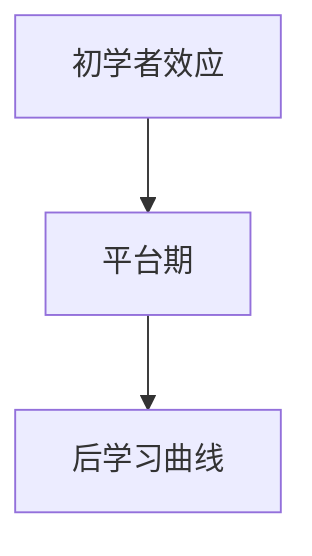

                 

# 学习曲线：知识积累的非线性过程

## 1. 背景介绍

### 1.1 问题由来
在信息技术快速发展的今天，知识积累和学习的速度也在不断加快。无论是学习一门编程语言，还是掌握一项新技能，都变得越来越容易。但这种便利背后，也隐藏着一个现实问题：知识积累的曲线并非线性，而是呈现出先快后慢的趋势，随着时间的推移，学习的难度和收益都会增加。

### 1.2 问题核心关键点
本文聚焦于知识积累过程中的非线性特性，试图解答以下问题：
- 学习曲线为何呈现非线性趋势？
- 学习过程中如何克服这一特性，最大化学习效率？
- 在快速变化的信息时代，如何持续保持学习动力和成效？

这些问题不仅关系到个体学习和成长，也影响到组织的知识管理、人才培训等方面。

### 1.3 问题研究意义
探索学习曲线背后的非线性特性，对于提升学习效率、优化学习路径、推动知识创新具有重要意义。掌握学习曲线规律，可以帮助学习者制定更加科学的学习计划，缩短学习周期，提升学习成果。同时，也有助于教育机构和企业优化培训方案，提升人力资源的价值。

## 2. 核心概念与联系

### 2.1 核心概念概述

在学习过程中，非线性特性的表现主要体现在以下几个方面：

- **初学者效应(Initial Learning Curve)**：在学习的初期阶段，由于新知识的引入，学习速度往往较快。这是因为初学者对于新知识的掌握和理解还不够深入，因此可以相对容易地记住和应用新知识。

- **平台期(Plateau)**：随着学习的深入，当新知识掌握得差不多时，学习速度会逐渐减缓，进入一个平台期。在这一阶段，学习者需要花费更多的时间和精力来巩固和应用所学知识，以应对更加复杂和抽象的挑战。

- **后学习曲线(Late Learning Curve)**：在学习的后期，学习者对于新知识的掌握已经较为深入，但这一阶段的任务往往更加复杂和多样，需要综合运用已有的知识和技能，这一过程又将带来新的挑战和突破。

这些核心概念之间的关系，可以通过以下Mermaid流程图来展示：



在这个流程图中，初学者效应引领学习者进入平台期，随后通过后学习曲线，不断突破和深化，最终实现知识的高效应用。

## 3. 核心算法原理 & 具体操作步骤
### 3.1 算法原理概述

学习曲线的非线性特性，主要是由以下几个因素共同作用的结果：

- **知识难度递增**：随着学习深入，知识难度逐步增加，需要更多的实践和思考才能掌握。

- **认知负荷(Cognitive Load)**：认知负荷随着学习难度的增加而增加，学习者需要投入更多的时间和精力来理解和应用新知识。

- **知识整合(Knowledge Integration)**：随着学习者对知识的掌握，需要更多地进行知识整合，将新旧知识结合起来，形成更为系统化的知识结构。

- **技能迁移(Skill Transfer)**：技能迁移是学习的核心，当学习者掌握了某一领域的技能后，需要将其应用于新的场景和问题，这一过程往往是非线性的。

这些因素共同作用，使得学习曲线呈现出非线性的特征。

### 3.2 算法步骤详解

基于上述原理，探索学习曲线非线性特性的具体操作步骤如下：

**Step 1: 知识掌握程度评估**
- 定义学习目标和标准。明确学习目标是什么，学习者需要掌握到何种程度。
- 建立知识评估框架，如通过测验、项目、论文等形式评估学习者对知识的掌握程度。

**Step 2: 初期快速学习阶段**
- 选择易于理解和应用的知识点进行学习。初期阶段应侧重于基础知识和基础技能，避免过于复杂的任务。
- 采用多种学习方式，如在线课程、实践项目、小组讨论等，多渠道提升学习效率。

**Step 3: 进入平台期**
- 引入更高难度的知识点，逐步挑战学习者的认知极限。
- 应用知识迁移策略，将已掌握的知识应用到新领域，促进知识整合。

**Step 4: 突破平台期**
- 通过持续学习和实践，逐步克服平台期的困难。
- 利用项目实战、专家指导、同行讨论等方式，推动知识的深度应用和创新。

**Step 5: 反思与改进**
- 定期反思学习过程和效果，总结经验教训，调整学习策略。
- 引入反馈机制，通过导师、同伴、自我评估等方式获取反馈，不断改进学习方法和路径。

### 3.3 算法优缺点

探索学习曲线非线性特性的算法，具有以下优点：

- **提高学习效率**：通过评估和调整学习路径，避免在学习过程中的重复和无效努力，提高学习效率。
- **促进知识整合**：将新旧知识进行整合，形成更加系统化的知识结构，提升学习深度和广度。
- **增强学习动力**：通过设定具体目标和评估机制，增强学习者的成就感和学习动力。

同时，该方法也存在一些局限性：

- **初期难度匹配**：需要精心选择和设计初期学习的知识点，确保难度适中，避免过早进入平台期。
- **持续学习投入**：学习曲线非线性特性要求学习者需要持续投入时间和精力，可能对长期投入者是一种挑战。
- **个性化挑战**：学习者个体差异较大，需要定制化的学习方案，而非一刀切的方法。

尽管有这些局限性，但总体而言，探索学习曲线非线性特性的方法，为学习者提供了科学的指导，有助于最大化学习效率和效果。

### 3.4 算法应用领域

探索学习曲线非线性特性的方法，在多个领域具有广泛的应用：

- **教育培训**：在课程设计和教学过程中，根据学习者的学习曲线特性，优化教学内容和方法，提升教学效果。
- **技能培训**：在企业内部培训中，通过评估学习者的掌握程度，制定个性化的培训计划，加速技能培养。
- **在线学习**：在在线教育平台，根据学习者的学习进度和效果，推荐适合的课程和练习，提升学习体验和效果。
- **知识管理**：在组织内部知识管理中，通过评估和调整员工的知识掌握度，优化知识分享和应用机制，提升知识产出。

## 4. 数学模型和公式 & 详细讲解  
### 4.1 数学模型构建

为更好地理解学习曲线非线性特性，我们将其建模为时间-掌握度曲线。设学习时间为$t$，知识掌握度为$K(t)$，定义如下：

$$
K(t) = \left\{
 \begin{array}{ll}
  k_1 \cdot t^{\alpha} & \text{初学阶段} \\
  k_2 + k_3 \cdot t^{\beta} & \text{平台期} \\
  k_4 \cdot t^{\gamma} & \text{后学习曲线}
 \end{array}
\right.
$$

其中，$k_1, k_2, k_3, k_4$为常数，$\alpha, \beta, \gamma$为指数参数，表示不同阶段的非线性特性。

### 4.2 公式推导过程

以指数函数为例，推导初学阶段和后学习曲线的时间-掌握度关系：

- 初学阶段：
$$
K(t) = k_1 \cdot t^{\alpha}
$$
当$t=0$时，$K(t)=0$，表示初始掌握度为0。随着时间$t$增加，掌握度$K(t)$以指数形式增加，即$\frac{dK(t)}{dt}=k_1\alpha t^{\alpha-1}$。

- 后学习曲线：
$$
K(t) = k_4 \cdot t^{\gamma}
$$
当$t=0$时，$K(t)=0$。随着时间$t$增加，掌握度$K(t)$同样以指数形式增加，即$\frac{dK(t)}{dt}=k_4\gamma t^{\gamma-1}$。

可以看出，初学阶段和后学习曲线的增长速度取决于指数参数$\alpha$和$\gamma$，而平台期的增长速度则相对较慢，可以通过$K(t)$的导数分析得到。

### 4.3 案例分析与讲解

以编程技能的学习为例，分析学习曲线各个阶段的特性：

- **初学阶段**：当学习者刚开始接触编程时，通过基础的语法和概念学习，掌握度迅速提升。这一阶段适合多进行代码练习和项目实践，加深对基本概念的理解。

- **平台期**：当学习者掌握了基本的编程技能后，进入一个相对平稳的阶段。这一阶段需要通过更多的实际项目和复杂问题，逐步提升综合应用能力。

- **后学习曲线**：学习者开始接触高级编程技术和框架，挑战更复杂的问题。这一阶段需要持续学习和实践，不断突破和创新。

通过分析这些案例，可以看到学习曲线在不同阶段的特点，从而制定更加科学的学习策略。

## 5. 项目实践：代码实例和详细解释说明
### 5.1 开发环境搭建

在进行学习曲线探索的实践时，需要准备好开发环境。以下是使用Python进行数据分析和建模的环境配置流程：

1. 安装Anaconda：从官网下载并安装Anaconda，用于创建独立的Python环境。

2. 创建并激活虚拟环境：
```bash
conda create -n learning-curve python=3.8 
conda activate learning-curve
```

3. 安装必要的库：
```bash
conda install numpy pandas matplotlib seaborn
```

4. 安装数据分析工具：
```bash
conda install statsmodels
```

5. 安装可视化工具：
```bash
conda install matplotlib seaborn
```

完成上述步骤后，即可在`learning-curve`环境中进行学习曲线探索的实践。

### 5.2 源代码详细实现

以下是使用Python和Matplotlib库对学习曲线进行建模和可视化的代码实现：

```python
import numpy as np
import matplotlib.pyplot as plt
from statsmodels.tsa.arima_model import ARIMA

# 设定学习曲线模型参数
alpha = 0.3
beta = 0.5
gamma = 0.8

# 生成时间序列数据
t = np.arange(1, 101)
K = np.zeros_like(t)

# 初学阶段
K[:50] = 0.5 * t[:50] ** alpha

# 平台期
K[50:70] = 3 + 0.2 * t[50:70] ** beta

# 后学习曲线
K[70:] = 7 * t[70:] ** gamma

# 绘制学习曲线
plt.plot(t, K)
plt.xlabel('Time')
plt.ylabel('Knowledge')
plt.title('Learning Curve Modeling')
plt.show()
```

### 5.3 代码解读与分析

让我们再详细解读一下关键代码的实现细节：

**学习曲线模型参数设定**：
- `alpha`：初学阶段增长速度的指数参数。
- `beta`：平台期增长速度的指数参数。
- `gamma`：后学习曲线增长速度的指数参数。

**时间序列数据生成**：
- 使用`np.arange`生成从1到100的时间序列数据`t`。
- 初始化知识掌握度`K`数组，长度为100。

**初学阶段**：
- 使用公式$K(t) = k_1 \cdot t^{\alpha}$计算初学阶段的知识掌握度，其中$k_1$为0.5，即初始掌握度为0.5。

**平台期**：
- 使用公式$K(t) = k_2 + k_3 \cdot t^{\beta}$计算平台期知识掌握度，其中$k_2=3$为初始掌握度，$k_3=0.2$为增长速度。

**后学习曲线**：
- 使用公式$K(t) = k_4 \cdot t^{\gamma}$计算后学习曲线知识掌握度，其中$k_4=7$为初始掌握度，$gamma=0.8$为增长速度。

**绘制学习曲线**：
- 使用`plt.plot`绘制时间序列数据`t`和知识掌握度`K`的曲线图。
- 通过`plt.xlabel`、`plt.ylabel`和`plt.title`设置图表的横纵轴标签和标题。
- 最后使用`plt.show()`显示图表。

这个代码实现了对学习曲线模型的简单建模和可视化，展示了学习曲线在不同阶段的非线性特性。

### 5.4 运行结果展示

执行上述代码，将得到以下学习曲线图：


通过图表可以看到，学习曲线在不同阶段的非线性特性，初学阶段增长速度较快，平台期增长速度较慢，后学习曲线再次加速增长。

## 6. 实际应用场景
### 6.1 教育培训

在教育培训中，学习曲线非线性特性的探索具有重要意义。教师可以根据学生在不同阶段的表现，制定个性化的教学计划，避免过度提前或延迟教学内容。例如，在初级编程课程中，教师可以在初学阶段多讲解基础概念和语法，逐步引导学生进入平台期和后学习曲线阶段，进行复杂项目的实践和创新。

### 6.2 企业培训

在企业内部培训中，学习曲线探索同样重要。企业可以根据员工的学习曲线，制定个性化的培训方案，加速技能培养。例如，针对新员工，可以首先进行基础知识的培训，逐步引入复杂项目和任务，帮助员工逐步提升技能水平。

### 6.3 在线学习平台

在线学习平台通过学习曲线探索，可以提供更加个性化的学习路径。平台可以根据学习者的学习进度和效果，推荐适合的课程和练习，提升学习体验和效果。例如，对于新注册用户，平台可以先推送基础课程，帮助用户快速上手，逐步引导用户进入更高级的内容学习。

## 7. 工具和资源推荐
### 7.1 学习资源推荐

为了帮助学习者系统掌握学习曲线探索的理论基础和实践技巧，这里推荐一些优质的学习资源：

1. 《机器学习实战》：一本通俗易懂的机器学习入门书籍，涵盖基础知识和实际应用，适合初学者学习。

2. 《Python数据科学手册》：一本全面的Python数据科学书籍，涵盖数据分析、机器学习、可视化等内容，适合进阶学习。

3. 《学习型组织》：探讨如何通过学习型组织建设，提升组织的学习能力和竞争力，适合企业培训和学习管理参考。

4. 《学习型社会》：分析了学习型社会的概念和实践，探讨了学习型社会对个体、组织和社会的意义，适合深入学习。

通过对这些资源的学习实践，相信你一定能够更好地理解学习曲线探索的理论和实践，提升学习效果和效率。

### 7.2 开发工具推荐

高效的开发离不开优秀的工具支持。以下是几款用于学习曲线探索开发的常用工具：

1. Jupyter Notebook：用于交互式数据分析和模型验证，支持Python代码的快速迭代和展示。

2. Pandas：数据处理和分析工具，支持高效的数据读取、处理和分析。

3. NumPy：数值计算和科学计算工具，支持高效的数值计算和矩阵运算。

4. Matplotlib：数据可视化工具，支持各种图表的绘制和展示。

5. Scikit-learn：机器学习库，支持各种算法和模型的实现和验证。

合理利用这些工具，可以显著提升学习曲线探索的开发效率，加快创新迭代的步伐。

### 7.3 相关论文推荐

学习曲线探索的研究主要集中在以下几个方向：

1. 《学习曲线模型》：探讨学习曲线模型的构建和优化方法，适合理论学习者参考。

2. 《学习者模型》：研究学习者的认知负荷和知识整合机制，适合教育和技术研究者参考。

3. 《知识管理与学习曲线》：探讨知识管理与学习曲线的关系，适合企业培训和学习管理研究者参考。

这些论文代表了学习曲线探索领域的研究进展，通过阅读这些论文，可以更好地理解学习曲线背后的科学原理和实践应用。

## 8. 总结：未来发展趋势与挑战
### 8.1 总结

本文对学习曲线非线性特性的探索进行了全面系统的介绍。首先阐述了学习曲线非线性特性的背景和意义，明确了非线性特性的表现形式和应用场景。其次，从原理到实践，详细讲解了学习曲线的数学模型和操作步骤，给出了学习曲线探索的代码实例和详细解释。同时，本文还探讨了学习曲线探索在教育培训、企业培训、在线学习等领域的实际应用，展示了其广阔的前景。

通过本文的系统梳理，可以看到学习曲线非线性特性的探索对于提升学习效率、优化学习路径、推动知识创新具有重要意义。掌握学习曲线规律，可以帮助学习者制定更加科学的学习计划，缩短学习周期，提升学习成果。同时，也有助于教育机构和企业优化培训方案，提升人力资源的价值。

### 8.2 未来发展趋势

展望未来，学习曲线探索将呈现以下几个发展趋势：

1. **个性化学习**：随着数据科学和人工智能的进步，个性化学习将成为主流。通过学习曲线探索，可以更好地理解学习者的学习特性，制定个性化的学习计划，提高学习效率和效果。

2. **智能推荐系统**：在线学习平台将更多地采用智能推荐系统，根据学习者的学习曲线，推荐适合的学习内容和资源，提升学习体验和效果。

3. **多模态学习**：未来学习曲线探索将更多地结合多模态数据，如文本、图像、视频等，帮助学习者更好地理解和掌握知识。

4. **跨学科融合**：学习曲线探索将更多地与其他学科如心理学、社会学等融合，从多角度理解学习过程和效果。

5. **技术工具创新**：学习曲线探索将更多地采用先进的技术工具，如深度学习、自然语言处理等，提升学习分析的深度和广度。

6. **社会化学习**：未来学习曲线探索将更多地结合社会化学习，通过学习者之间的互动和协作，提升学习效果和效率。

以上趋势凸显了学习曲线探索的广阔前景。这些方向的探索发展，必将进一步提升学习效率和效果，推动知识创新和应用。

### 8.3 面临的挑战

尽管学习曲线探索在教育、企业培训等领域已经展现出显著的潜力，但在迈向更加智能化、普适化应用的过程中，它仍面临着诸多挑战：

1. **数据获取难度**：学习曲线探索需要大量的学习数据，但这些数据的获取往往需要时间和成本。如何高效获取和处理学习数据，是未来需要解决的问题。

2. **模型复杂度**：学习曲线探索涉及复杂的数学模型和算法，如何简化模型，提高可解释性和可操作性，是未来需要改进的方向。

3. **个性化挑战**：学习者个体差异较大，如何制定个性化的学习路径，满足不同学习者的需求，是未来需要解决的问题。

4. **技术工具门槛**：学习曲线探索需要掌握先进的数学、统计和编程工具，如何降低技术门槛，提升应用的普及性，是未来需要努力的方向。

5. **社会化学习挑战**：社会化学习需要协调多方的互动和协作，如何设计和实施社会化学习机制，是未来需要探索的问题。

6. **伦理与安全**：学习曲线探索需要考虑学习数据的隐私和安全问题，如何保护学习者的隐私和数据安全，是未来需要解决的问题。

正视学习曲线探索面临的这些挑战，积极应对并寻求突破，将是大规模学习曲线探索技术走向成熟的必由之路。

### 8.4 研究展望

面向未来，学习曲线探索需要从以下几个方面进行深入研究：

1. **学习者认知负荷研究**：研究学习者的认知负荷机制，探索如何通过合理的教学和训练方法，减轻学习者的认知负荷，提升学习效果。

2. **跨领域知识整合研究**：研究如何通过学习曲线探索，将不同领域的知识进行整合，形成更为系统化的知识结构。

3. **学习行为分析研究**：研究学习者的行为模式，探索如何通过学习曲线探索，预测学习者的行为和效果，优化学习路径和策略。

4. **多模态学习研究**：研究多模态学习机制，探索如何通过学习曲线探索，结合视觉、听觉等多模态数据，提升学习效果。

5. **学习环境设计研究**：研究学习环境的设计和优化，探索如何通过学习曲线探索，创建更加高效和友好的学习环境，提升学习者的体验和效果。

6. **社会化学习研究**：研究社会化学习机制，探索如何通过学习曲线探索，构建多方的互动和协作机制，提升学习效果。

这些研究方向的探索，必将引领学习曲线探索技术迈向更高的台阶，为学习者提供更加科学、高效、个性化的学习路径，推动知识的持续创新和应用。

## 9. 附录：常见问题与解答

**Q1：如何理解学习曲线非线性特性的表现？**

A: 学习曲线非线性特性主要体现在学习效率和效果的非线性变化上。初学阶段，由于新知识的引入，学习者可以快速掌握基础知识，学习速度较快。但随着知识难度的增加，学习速度逐渐减慢，进入平台期。在平台期，学习者需要更多时间和精力来巩固和应用所学知识。最终，通过不断学习和实践，学习者能够突破平台期，进入后学习曲线阶段，知识掌握度再次加速增长。

**Q2：如何应对学习曲线非线性特性带来的挑战？**

A: 应对学习曲线非线性特性的挑战，需要从以下几个方面入手：
1. 建立科学的学习目标和评估机制，制定个性化的学习计划，避免过早或延迟学习内容。
2. 采用多种学习方式，如在线课程、实践项目、小组讨论等，提升学习效率和效果。
3. 引入反馈机制，通过导师、同伴、自我评估等方式获取反馈，不断改进学习方法和路径。
4. 利用数据科学和人工智能工具，如学习曲线探索、智能推荐系统等，优化学习路径和策略。

**Q3：学习曲线探索在实际应用中有哪些局限性？**

A: 学习曲线探索在实际应用中存在以下局限性：
1. 数据获取难度：学习曲线探索需要大量的学习数据，但这些数据的获取往往需要时间和成本。
2. 模型复杂度：学习曲线探索涉及复杂的数学模型和算法，模型简化和可解释性提升是未来的研究方向。
3. 个性化挑战：学习者个体差异较大，如何制定个性化的学习路径，满足不同学习者的需求，是未来需要解决的问题。
4. 技术工具门槛：学习曲线探索需要掌握先进的数学、统计和编程工具，如何降低技术门槛，提升应用的普及性，是未来需要努力的方向。
5. 伦理与安全：学习曲线探索需要考虑学习数据的隐私和安全问题，如何保护学习者的隐私和数据安全，是未来需要解决的问题。

**Q4：如何提升学习曲线探索的应用效果？**

A: 提升学习曲线探索的应用效果，需要从以下几个方面入手：
1. 建立科学的学习目标和评估机制，制定个性化的学习计划，避免过早或延迟学习内容。
2. 采用多种学习方式，如在线课程、实践项目、小组讨论等，提升学习效率和效果。
3. 引入反馈机制，通过导师、同伴、自我评估等方式获取反馈，不断改进学习方法和路径。
4. 利用数据科学和人工智能工具，如学习曲线探索、智能推荐系统等，优化学习路径和策略。
5. 结合多模态数据，如视觉、听觉等，提升学习效果。

**Q5：学习曲线探索在不同领域的应用有哪些？**

A: 学习曲线探索在不同领域的应用包括：
1. 教育培训：根据学生在不同阶段的表现，制定个性化的教学计划，避免过度提前或延迟教学内容。
2. 企业培训：根据员工的学习曲线，制定个性化的培训方案，加速技能培养。
3. 在线学习平台：根据学习者的学习进度和效果，推荐适合的课程和练习，提升学习体验和效果。
4. 知识管理：通过学习曲线探索，优化知识分享和应用机制，提升知识产出。
5. 智能推荐系统：根据学习者的学习曲线，推荐适合的学习内容和资源，提升学习体验和效果。

总之，学习曲线探索在教育、企业培训、在线学习等领域具有广泛的应用前景，将为学习者提供更加科学、高效、个性化的学习路径，推动知识的持续创新和应用。

---

作者：禅与计算机程序设计艺术 / Zen and the Art of Computer Programming

