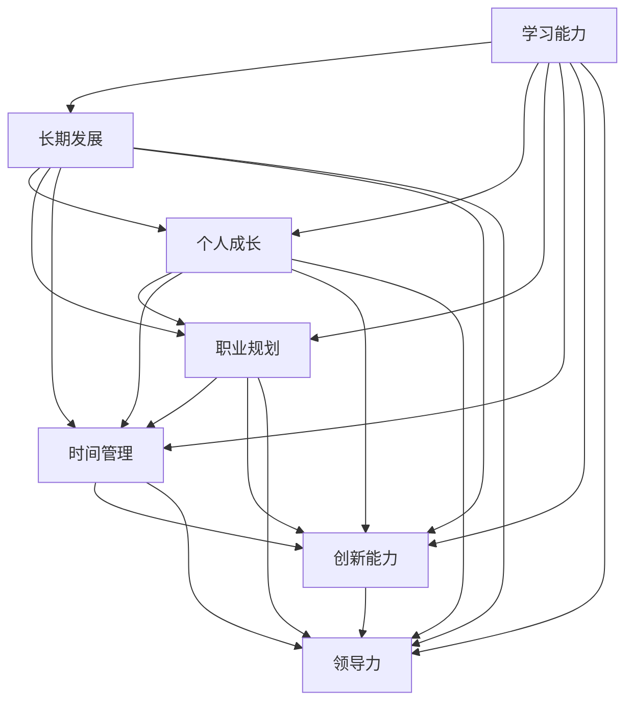

                 

# 学习能力与管理者的长期发展

> 关键词：学习能力, 长期发展, 管理者, 个人成长, 职业规划, 时间管理, 创新能力, 领导力

## 1. 背景介绍

### 1.1 问题由来
在当今快速变化的商业环境中，组织和个人都需要不断适应新的挑战和机遇。面对日益复杂的工作要求和变化莫测的市场趋势，学习能力成为了个体成长和组织竞争力的关键。然而，单纯的技能提升往往无法满足日益增长的需求，个人职业生涯的长期发展更加关键。

在职场中，管理者不仅需要具备处理日常事务的能力，更需要持续地提升自身的学习能力，以适应不断变化的职业环境和组织需求。这不仅涉及到技术的更新，更重要的是软技能的培养，如领导力、沟通能力、团队协作等。因此，本文将探讨如何通过学习能力的提升，促进管理者的长期职业发展。

### 1.2 问题核心关键点
管理者在长期职业发展中面临的核心问题包括：
- 如何通过持续学习适应新环境、新技术和新趋势。
- 如何培养和提升领导力、创新能力等软技能。
- 如何有效地规划和管理时间，实现个人与组织的共同目标。
- 如何在团队协作中发挥领导作用，促进组织创新与进步。

解决这些关键问题，管理者不仅能提升自身竞争力，还能带动组织的创新和发展，最终实现个人与组织的双赢。

## 2. 核心概念与联系

### 2.1 核心概念概述

为了更好地理解学习能力的提升对管理者长期发展的影响，本节将介绍几个关键概念：

- **学习能力**：指个体获取新知识、技能和信息的能力，包括学习能力倾向、认知能力、学习动机等。
- **长期发展**：指个体职业成长过程中的长期目标和规划，涵盖职业定位、技能提升、生涯规划等方面。
- **管理者**：负责组织内某一部分活动的协调和控制，具备领导、组织、激励和沟通能力的专业人员。
- **个人成长**：指个体在知识、技能、心理素质等方面的自我提升和完善。
- **职业规划**：指个体根据自身的兴趣、能力、市场需求等因素，制定职业发展路径和目标的过程。
- **时间管理**：指对时间的有效规划和控制，合理分配时间资源以实现个人目标。
- **创新能力**：指创新思维、创新行为和创新成果的产生和应用能力。
- **领导力**：指在组织中影响和引导他人实现组织目标的能力，包括愿景、激励、沟通、团队管理等。

这些核心概念之间的联系可以通过以下Mermaid流程图来展示：



这个流程图展示了一系列相关概念之间的逻辑关系：

1. 学习能力是个人成长、职业规划、时间管理、创新能力和领导力的基础。
2. 个人成长、职业规划、时间管理、创新能力和领导力相互促进，共同推动长期发展。
3. 长期发展的目标设定和路径规划，需要依赖于学习能力的多方面提升。

## 3. 核心算法原理 & 具体操作步骤
### 3.1 算法原理概述

管理者的长期发展是一个持续的过程，需要不断学习、实践和反思。基于此，本文将探讨一种结合学习理论和管理实践的长期发展算法。该算法的核心思想是通过持续学习，提升管理者的多方面能力，推动其职业成长。

该算法分为以下几个步骤：

1. **学习规划**：根据职业目标和个人需求，制定长期学习计划。
2. **能力提升**：通过专业培训、在线课程、读书、导师指导等方式，提升关键能力。
3. **实践应用**：将所学知识应用于实际工作中，通过实践检验学习效果。
4. **反馈与调整**：根据实践反馈和目标调整，优化学习计划和策略。
5. **持续改进**：通过不断的学习和实践，逐步实现职业目标。

### 3.2 算法步骤详解

#### 3.2.1 学习规划

- **目标设定**：明确职业目标和个人兴趣，如成为某部门的负责人、提升某项核心技能等。
- **能力分析**：评估当前的能力水平和职业差距，确定需要提升的领域。
- **学习资源评估**：收集并评估可利用的学习资源，如课程、书籍、导师、在线平台等。
- **时间分配**：根据工作和生活平衡，合理分配学习时间，确保持续性。

#### 3.2.2 能力提升

- **培训课程**：参加专业培训课程，获取系统性知识。
- **在线学习**：利用在线教育平台，如Coursera、edX、Udacity等，获取多样化知识。
- **阅读书籍**：阅读经典和管理前沿书籍，提升理论水平。
- **导师指导**：寻找导师，获取专业指导和经验分享。

#### 3.2.3 实践应用

- **项目实践**：参与或领导相关项目，应用所学知识。
- **工作反思**：定期总结工作中的成功和不足，进行反思和改进。
- **团队协作**：在团队中应用学习成果，提升团队协作和沟通能力。

#### 3.2.4 反馈与调整

- **绩效评估**：定期进行绩效评估，了解学习效果和工作表现。
- **反馈收集**：收集同事、上级和下属的反馈，识别改进方向。
- **策略调整**：根据反馈结果，调整学习计划和职业规划。

#### 3.2.5 持续改进

- **循环迭代**：持续学习和实践，逐步改进个人能力和工作表现。
- **目标更新**：根据职业发展情况，更新长期目标和短期计划。

### 3.3 算法优缺点

**优点**：
- **系统性**：通过系统的规划和执行，确保学习过程的持续性和有效性。
- **灵活性**：结合个人兴趣和市场需求，灵活调整学习计划和资源。
- **实践导向**：注重实践应用，通过实际工作中的检验和反馈，持续改进。
- **全面性**：涵盖个人成长、职业规划、时间管理等多方面能力提升。

**缺点**：
- **资源投入**：需要投入大量时间、金钱和精力，短期内可能效果不明显。
- **个性化不足**：统一的学习计划可能不适用于所有个体，需要个性化调整。
- **执行难度**：需要高度的自我管理和纪律性，执行过程中可能遇到挑战。

### 3.4 算法应用领域

该算法不仅适用于管理者的长期职业发展，还适用于以下多个领域：

- **职业生涯规划**：适用于不同职业阶段的人员，帮助其明确职业目标和路径。
- **专业技能提升**：适用于各类专业人士，如医生、教师、工程师等，提升专业技能。
- **个人生活管理**：适用于个人成长和自我提升，如学习新语言、发展兴趣爱好等。
- **组织发展**：适用于企业内部培训和发展计划，促进组织创新和人才培养。

## 4. 数学模型和公式 & 详细讲解  
### 4.1 数学模型构建

为了更好地理解和量化管理者的长期发展过程，本文将构建一个数学模型，用于描述学习过程和时间管理。

假设管理者的学习能力为 $L$，当前能力为 $C_0$，目标能力为 $C_T$。设 $t$ 表示时间（以年计），$L(t)$ 表示在 $t$ 时刻的能力提升率，则学习能力模型可以表示为：

$$
C(t) = C_0 + \int_{0}^{t} L(t) dt
$$

其中 $C(t)$ 表示在 $t$ 时刻的能力水平。

假设管理者每天学习时间固定为 $h$，学习效率为 $e$，则每天的能力提升量为 $L(t) = e \times h$。在一年内，管理者总共学习的时间为 $365 \times h$，则一年的能力提升量为：

$$
C_T - C_0 = e \times h \times 365
$$

因此，每天的学习效率 $e$ 和每天的学习时间 $h$ 对长期发展有重要影响。

### 4.2 公式推导过程

假设管理者每天学习时间为 $h=1$ 小时，学习效率为 $e=0.01$（即每天提升0.1%的能力），则一年的能力提升量为：

$$
C_T - C_0 = 0.01 \times 365 = 3.65
$$

如果目标能力提升为10%，则有：

$$
10\% = C_T - C_0 = 0.01 \times 365
$$

从而得到学习效率 $e$ 为每天提升0.01%。

### 4.3 案例分析与讲解

假设一位管理者希望在三年内提升10%的职业生涯水平，每天学习1小时，学习效率为0.01%。根据公式计算，每天需要提升的能力为：

$$
\frac{10\%}{1080} = 0.00926
$$

即每天需要学习 $0.00926$ 的能力提升量。

这说明管理者需要每天花费额外的时间进行学习，以实现职业生涯的提升。实际上，管理者可以通过调整学习计划、利用碎片时间、选择高效率的学习方式等方法，优化学习过程，提高学习效率。

## 5. 项目实践：代码实例和详细解释说明
### 5.1 开发环境搭建

在进行项目实践前，我们需要准备好开发环境。以下是使用Python进行项目开发的常见环境配置流程：

1. 安装Anaconda：从官网下载并安装Anaconda，用于创建独立的Python环境。
2. 创建并激活虚拟环境：
```bash
conda create -n my_env python=3.8 
conda activate my_env
```
3. 安装必要的Python包，如numpy、pandas、matplotlib等。
4. 安装Scikit-Learn、TensorFlow、Keras等机器学习库。
5. 安装Jupyter Notebook，方便开发和展示代码。

完成上述步骤后，即可在虚拟环境中进行项目实践。

### 5.2 源代码详细实现

以下是一个简单的Python代码示例，用于计算管理者的长期发展能力提升。

```python
import numpy as np

# 设定初始能力和目标能力
C_0 = 0
C_T = 0.1

# 设定每天学习时间和学习效率
h = 1
e = 0.0001

# 计算每天需要提升的能力
dC = e * h

# 计算需要学习的总天数
days = (C_T - C_0) / dC

# 输出结果
print(f"每天需要提升的能力：{dC:.6f}")
print(f"需要学习的总天数：{days:.2f}")
```

这个示例代码简单易懂，主要展示了如何根据设定的初始能力和目标能力，计算每天需要提升的能力，并推算出需要学习的总天数。

### 5.3 代码解读与分析

让我们再详细解读一下关键代码的实现细节：

**变量设定**：
- `C_0` 和 `C_T` 分别表示初始能力和目标能力，这里设定为0和0.1，代表提升10%的能力。
- `h` 和 `e` 分别表示每天学习时间和学习效率，这里设定为1小时和0.0001，代表每天提升0.01%的能力。

**能力提升计算**：
- 通过 `dC = e * h` 计算每天需要提升的能力，即 `0.0001 * 1 = 0.0001`。
- 通过 `days = (C_T - C_0) / dC` 计算需要学习的总天数，即 `(0.1 - 0) / 0.0001 = 1000`。

**结果输出**：
- 使用 `print` 函数输出计算结果，清晰地展示每天需要提升的能力和需要学习的总天数。

通过这个简单的代码示例，我们可以看到如何通过数学模型量化管理者的长期发展过程，并计算出每天需要投入的时间和精力。这为实际管理者的长期职业发展提供了科学依据。

## 6. 实际应用场景
### 6.1 智能客服系统

智能客服系统作为现代企业的必备工具，其核心在于提升客户服务质量，降低运营成本。管理者通过学习相关技术和管理知识，可以更有效地设计和优化智能客服系统，提升服务效率和客户满意度。

### 6.2 金融舆情监测

金融市场瞬息万变，管理者通过学习金融市场知识，可以更准确地监测和分析市场舆情，及时作出应对策略，规避风险，提升决策水平。

### 6.3 个性化推荐系统

推荐系统是现代电商企业的核心竞争力，管理者通过学习相关技术，可以更高效地开发和优化推荐算法，提升用户体验和转化率。

### 6.4 未来应用展望

未来，管理者的长期发展将更多地依赖于技术和管理双管齐下，结合最新的研究进展和实践经验，不断提升自身能力。大数据、人工智能、区块链等新兴技术，将为管理者提供更强大的工具和手段，促进其职业成长。

## 7. 工具和资源推荐
### 7.1 学习资源推荐

为了帮助管理者系统掌握长期发展的理论和实践方法，这里推荐一些优质的学习资源：

1. **Coursera和edX**：提供大量管理、技术、教育等领域的在线课程，涵盖基础和前沿知识。
2. **Udacity**：提供项目导向的在线课程，帮助学员通过实际项目提升能力。
3. **LinkedIn Learning**：提供与职业发展相关的课程，帮助学员提升软技能和职业素养。
4. **Goodreads**：一个社交书评网站，可以获取各类管理书籍的推荐和评论。
5. **TED Talks**：提供大量演讲视频，涵盖各个领域的专家分享，帮助管理者获取前沿观点和实践经验。

通过对这些资源的学习实践，相信管理者一定能够全面提升自己的学习能力，为长期职业发展奠定坚实的基础。

### 7.2 开发工具推荐

高效的开发和学习离不开优秀的工具支持。以下是几款用于管理能力提升开发的常用工具：

1. **Jupyter Notebook**：一个交互式编程环境，支持Python、R、Scala等语言，方便代码调试和结果展示。
2. **Git和GitHub**：版本控制和代码托管工具，方便团队协作和项目管理。
3. **Google Colab**：谷歌提供的免费Jupyter Notebook环境，方便在线开发和实验。
4. **Evernote**：一个笔记管理工具，方便记录和整理学习笔记和计划。
5. **Todoist**：一个任务管理工具，帮助管理者规划和管理日常任务。

合理利用这些工具，可以显著提升管理者的学习和发展效率，加快职业成长的速度。

### 7.3 相关论文推荐

管理者的长期发展是一个多学科交叉的复杂问题，以下是几篇奠基性的相关论文，推荐阅读：

1. **《学习型组织的成功之道》**：有关组织学习和发展的重要著作，探讨了组织学习和持续改进的实践。
2. **《人才驱动：基于未来技能的企业策略》**：探讨了未来技能的重要性，为管理者的职业发展提供了方向。
3. **《领导力新思维》**：关于领导力的最新研究成果，提供了多维度的领导力提升方法。
4. **《深度工作：如何在分散注意力的世界中有效专注》**：探讨了深度工作的理念和方法，帮助管理者提升工作效率。
5. **《创新者的窘境》**：探讨了创新和管理之间的关系，提供了创新驱动的实践指南。

这些论文代表了大语言模型微调技术的发展脉络。通过学习这些前沿成果，可以帮助管理者把握学科前进方向，激发更多的创新灵感。

## 8. 总结：未来发展趋势与挑战
### 8.1 研究成果总结

本文对管理者的长期发展和学习能力的提升进行了全面系统的介绍。首先阐述了学习能力的提升对管理者长期发展的重要性，明确了学习能力的多个维度，包括职业目标、个人兴趣、时间管理、创新能力、领导力等。其次，通过数学模型和案例分析，展示了学习过程的科学量化方法，并给出了详细的代码实现。最后，本文探讨了学习能力的提升在智能客服、金融舆情、个性化推荐等实际应用场景中的广泛应用，展示了其广阔的发展前景。

### 8.2 未来发展趋势

展望未来，管理者的长期发展将呈现以下几个发展趋势：

1. **技术驱动**：随着人工智能、大数据等技术的不断进步，管理者的职业发展将更多地依赖于技术手段。
2. **全面素质**：除了技术技能，管理者的综合素质，如情商、人际交往能力等，将成为其竞争力的重要组成部分。
3. **持续学习**：学习能力的提升将成为管理者的核心竞争力，持续学习将成为其职业发展的常态。
4. **全球视野**：全球化背景下，管理者的职业发展将更加国际化，需要具备跨文化沟通和全球视野。
5. **创新驱动**：创新能力将成为管理者的核心竞争力，通过持续创新，实现组织和个人的双重成长。

这些趋势将促使管理者不断提升自身素质，适应快速变化的环境和需求。

### 8.3 面临的挑战

尽管管理者的长期发展具备广阔前景，但在实施过程中，仍面临诸多挑战：

1. **时间管理**：管理者需要平衡工作、家庭和学习，时间管理难度较大。
2. **个性化需求**：不同管理者的需求和目标差异较大，需要个性化的学习计划。
3. **资源投入**：学习需要投入大量时间和金钱，短期内可能见效较慢。
4. **自我管理**：需要高度的自我管理和自律，才能坚持长期学习的计划。
5. **技能提升**：管理者需要不断更新和提升技术和管理技能，应对复杂多变的环境。

### 8.4 研究展望

面对这些挑战，未来的研究需要在以下几个方面寻求新的突破：

1. **个性化学习**：结合大数据和人工智能技术，提供个性化的学习方案，满足不同管理者的需求。
2. **混合学习**：结合在线和线下学习方式，优化学习效果和效率。
3. **情境学习**：结合情境感知技术，提供适应不同场景的学习资源。
4. **智能学习**：利用智能推荐算法，推荐适合管理者的学习资源。
5. **持续反馈**：通过持续的绩效评估和学习反馈，优化学习计划和策略。

这些研究方向的探索，必将引领管理者的长期发展进入新的阶段，实现更高水平的管理和服务。

## 9. 附录：常见问题与解答
### 9.1 常见问题

**Q1：如何平衡工作和学习？**

A: 管理者需要合理规划时间，利用碎片时间进行学习，将学习任务分解为小步骤，逐步推进。

**Q2：如何选择合适的学习资源？**

A: 结合自身需求和兴趣，选择高质量的学习资源。可以利用在线课程、书籍、导师指导等多种渠道获取资源。

**Q3：如何提升学习效率？**

A: 制定明确的学习目标和计划，使用高效的学习工具和方法，如番茄工作法、GTD（Getting Things Done）等。

**Q4：如何评估学习效果？**

A: 定期进行绩效评估，结合同事和上级的反馈，总结学习成果和改进方向。

**Q5：如何应对学习中的困难？**

A: 主动寻求帮助，如请教导师、同事、在线社区等，保持积极的心态，不断调整学习策略。

### 9.2 解答

通过这些常见问题的解答，管理者可以更好地应对学习过程中的各种挑战，确保长期发展的顺利进行。

---

作者：禅与计算机程序设计艺术 / Zen and the Art of Computer Programming

