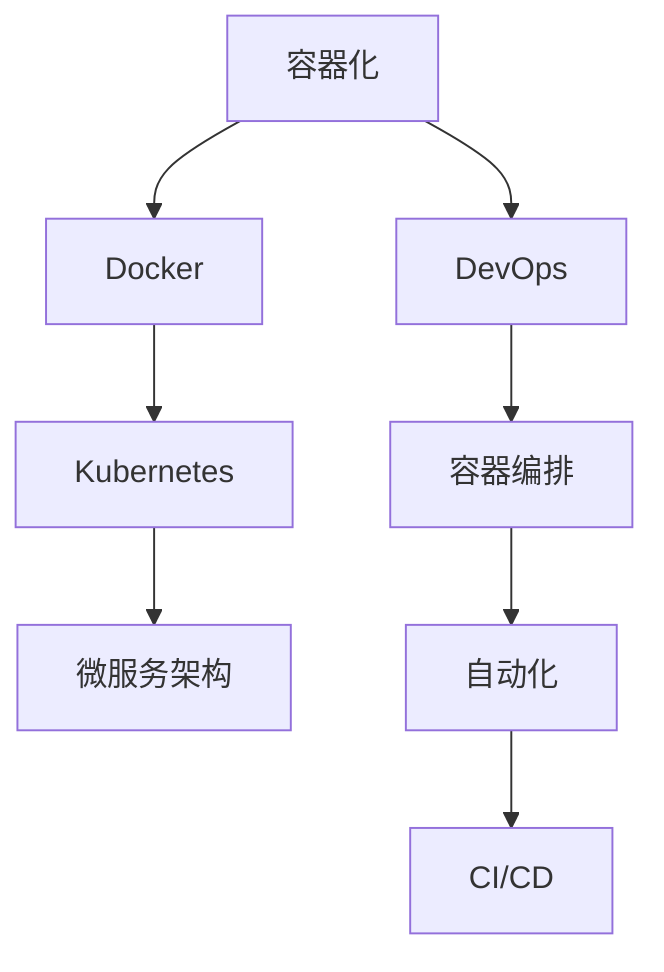

                 

# 容器化和 Kubernetes：管理应用程序部署

> 关键词：容器化，Kubernetes，Docker，应用程序部署，DevOps，微服务架构

## 1. 背景介绍

在现代软件开发和运维环境中，容器化（Containerization）和容器编排工具如Kubernetes（K8s）成为了不可或缺的技术栈组件。容器化技术提供了应用程序打包和部署的统一标准，而Kubernetes则提供了自动化、动态化、可扩展的容器编排解决方案。本文将系统性地介绍容器化和Kubernetes的基本概念、原理以及操作实践，帮助读者全面理解并掌握这一重要的技术栈。

## 2. 核心概念与联系

### 2.1 核心概念概述

为了更好地理解容器化和Kubernetes，我们需要先了解一些核心概念及其相互联系：

- **容器化（Containerization）**：通过将应用程序及其所有依赖打包到独立的、可移植的容器中，以确保应用程序在不同环境中的一致性和可移植性。

- **Docker**：一个开源的容器平台，提供了一种简单、高效的方式来实现容器化。

- **Kubernetes（K8s）**：一个开源的容器编排工具，用于自动化容器的部署、扩展和管理，支持大规模、复杂的微服务架构。

- **DevOps**：一种文化、流程和技术，旨在通过自动化和持续集成/持续部署（CI/CD）等实践来缩短开发和运营之间的周期。

- **微服务架构**：将应用程序拆分为多个小型、独立的服务，每个服务负责特定的业务功能，并能够独立部署和扩展。

- **容器编排**：自动化管理容器集群的过程，包括资源分配、负载均衡、服务发现、自动伸缩等。

这些概念构成了容器化和Kubernetes的核心，相互之间存在着密切的联系。容器化是Kubernetes的基础，而DevOps和微服务架构则是Kubernetes的应用场景。容器编排则是对容器化应用的管理和优化。

### 2.2 核心概念原理和架构的 Mermaid 流程图

以下是基于容器化和Kubernetes的核心概念构建的流程图：



### 2.3 核心概念之间的联系

容器化技术使得应用程序可以跨环境一致地运行，而Kubernetes则提供了自动化的容器编排和管理，使其能够在大规模、复杂的应用场景中有效运行。同时，DevOps和微服务架构是容器化和Kubernetes得以发挥其优势的应用环境，容器编排则进一步提升了DevOps和微服务架构的效率和可维护性。

## 3. 核心算法原理 & 具体操作步骤

### 3.1 算法原理概述

容器化和Kubernetes的核心原理主要涉及两个方面：容器打包和容器编排。

- **容器打包**：将应用程序及其所有依赖打包到容器中，确保其在任何环境中都能一致运行。
- **容器编排**：自动化管理容器集群，包括资源分配、负载均衡、服务发现、自动伸缩等。

### 3.2 算法步骤详解

#### 3.2.1 容器打包步骤

1. **选择基础镜像**：选择适合应用的基础镜像，如Docker Hub中的官方镜像或社区镜像。
2. **安装依赖**：在容器中安装应用程序所需的所有依赖和库。
3. **构建容器镜像**：使用Dockerfile定义容器构建步骤，并运行`docker build`命令构建容器镜像。
4. **存储镜像**：将构建好的镜像上传到Docker Hub或其他镜像仓库。

#### 3.2.2 容器编排步骤

1. **部署Kubernetes集群**：通过kubeadm等工具在本地或云平台部署Kubernetes集群。
2. **编写Kubernetes配置文件**：编写Pod、Service、Deployment、Ingress等Kubernetes资源配置文件。
3. **部署应用**：使用`kubectl apply`命令将配置文件部署到Kubernetes集群中。
4. **监控和管理**：使用`kubectl`工具监控和管理集群中的容器实例。

### 3.3 算法优缺点

#### 3.3.1 优点

- **一致性和可移植性**：容器化确保了应用程序在各种环境中的一致性。
- **自动化和可扩展性**：Kubernetes提供了自动化的容器编排和管理，支持大规模、复杂的微服务架构。
- **可维护性和易用性**：容器化和Kubernetes使得应用程序的部署、扩展和运维更加简单和高效。

#### 3.3.2 缺点

- **学习曲线较陡**：初次接触容器化和Kubernetes的用户可能需要较长时间的学习和实践。
- **资源消耗**：容器和Kubernetes自身的资源消耗可能较大，特别是在大规模集群中。
- **依赖管理复杂**：容器化中需要仔细管理依赖，避免版本冲突和依赖冲突。

### 3.4 算法应用领域

容器化和Kubernetes广泛应用于以下几个领域：

- **云计算**：在云平台中部署和管理应用程序。
- **DevOps**：自动化开发、测试和部署过程。
- **微服务架构**：管理和部署多个小型、独立的服务。
- **大数据**：管理和部署大数据应用。
- **机器学习和人工智能**：管理和部署机器学习和AI模型。

## 4. 数学模型和公式 & 详细讲解 & 举例说明

### 4.1 数学模型构建

容器化和Kubernetes的原理主要基于分布式系统和云计算的知识，不涉及复杂的数学模型。但为了更好地理解其工作原理，我们可以从网络通信和资源调度的角度来构建一些简化的数学模型。

#### 4.1.1 网络通信模型

在容器化环境中，应用程序通过容器进行网络通信。假设有两个容器A和B，它们之间的通信可以用以下模型来表示：

$$
T_{AB} = T_{A_{host}} + T_{B_{host}} + T_{network}
$$

其中：
- $T_{AB}$ 为容器A和B之间的通信时间。
- $T_{A_{host}}$ 和 $T_{B_{host}}$ 分别为容器A和B在宿主机上的处理时间。
- $T_{network}$ 为网络传输时间。

这个模型说明，通信时间不仅取决于容器本身，还受到网络传输的影响。

#### 4.1.2 资源调度模型

Kubernetes中的资源调度可以用以下模型来表示：

$$
C = \sum_{i=1}^n \frac{R_i}{C_i}
$$

其中：
- $C$ 为资源分配的总成本。
- $R_i$ 为第$i$个容器所需的资源（如CPU、内存）。
- $C_i$ 为第$i$个容器的执行成本（如物理机成本、虚拟化成本）。

这个模型说明，资源调度时，会考虑每个容器所需的资源及其执行成本，综合评估后的分配方案将使得总成本最小。

### 4.2 公式推导过程

在容器化和Kubernetes中，数学模型的推导涉及分布式系统和优化算法。以资源调度模型为例，推导过程如下：

1. **建立目标函数**：目标是最小化总成本。
2. **约束条件**：每个容器所需的资源不能超过物理机或虚拟机的容量。
3. **求解优化问题**：通过优化算法（如遗传算法、线性规划等）求解资源分配方案。

### 4.3 案例分析与讲解

以一个典型的微服务架构为例，假设有三个服务A、B、C，每个服务需要1CPU、2G内存。Kubernetes集群有5个节点，每个节点可以提供2CPU、4G内存。

- **网络通信模型**：服务A和B之间的通信时间为0.1s，服务A和C之间的通信时间为0.2s。

- **资源调度模型**：
  - 节点1分配服务A和B，总成本为$2 + \frac{1+2}{1+2} = 2.5$。
  - 节点2分配服务A和C，总成本为$2 + \frac{1+2}{1+2} = 2.5$。
  - 节点3分配服务B和C，总成本为$2 + \frac{2+1}{2+1} = 2.7$。
  - 节点4和节点5分别分配服务A和B，总成本为$2 + \frac{1+2}{1+2} = 2.5$。
  - 最小化总成本为$2.5$，分配方案为节点1、节点2和节点4分配服务A和B，节点3分配服务B和C。

通过以上分析，我们可以看到，Kubernetes在资源调度时，考虑了每个容器所需的资源及其执行成本，使得总成本最小化。

## 5. 项目实践：代码实例和详细解释说明

### 5.1 开发环境搭建

在进行容器化和Kubernetes实践前，我们需要准备好开发环境。以下是使用Docker和Kubernetes进行容器化部署的开发环境配置流程：

1. 安装Docker和Kubernetes：
```bash
sudo apt update
sudo apt install docker.io -y
sudo apt install kubelet -y
sudo apt install kubeadm -y
```

2. 启动Docker和Kubernetes：
```bash
sudo systemctl start docker
sudo systemctl start kubelet
sudo kubeadm join 10.0.0.1:6443 --token 123456
```

3. 测试Docker和Kubernetes：
```bash
docker run hello-world
kubectl get nodes
```

### 5.2 源代码详细实现

以下是一个简单的Node.js应用程序的容器化和Kubernetes部署示例：

#### 5.2.1 编写Dockerfile

```dockerfile
FROM node:latest
WORKDIR /app
COPY package*.json ./
RUN npm install
COPY . .
EXPOSE 3000
CMD [ "node", "app.js" ]
```

#### 5.2.2 构建Docker镜像

```bash
docker build -t myapp .
docker push myapp:latest
```

#### 5.2.3 编写Kubernetes配置文件

```yaml
apiVersion: v1
kind: Pod
metadata:
  name: myapp
spec:
  containers:
    - name: myapp
      image: myapp:latest
      ports:
        - containerPort: 3000
```

#### 5.2.4 部署应用

```bash
kubectl apply -f myapp.yaml
```

#### 5.2.5 获取Pod信息

```bash
kubectl get pods
```

### 5.3 代码解读与分析

**Dockerfile**：定义了应用程序的构建步骤，从Node.js运行环境到应用程序的代码、依赖和打包。

**Kubernetes配置文件**：定义了Pod、Container等资源，指定了应用的容器镜像、端口等配置。

**部署应用**：使用`kubectl apply`命令将配置文件部署到Kubernetes集群中。

**获取Pod信息**：使用`kubectl get pods`命令查看应用的Pod状态。

### 5.4 运行结果展示

通过上述步骤，应用程序已经成功部署到Kubernetes集群中。可以使用`curl`命令访问应用程序的端口：

```bash
curl http://myapp.10.0.0.1:3000
```

## 6. 实际应用场景

### 6.1 智能客服系统

基于容器化和Kubernetes的智能客服系统，可以快速部署、扩展和监控。智能客服系统需要处理大量实时请求，Kubernetes的自动化和可扩展性可以确保系统的高可用性和性能。

#### 6.1.1 部署和扩展

智能客服系统可以部署多个副本，使用Kubernetes的Horizontal Pod Autoscaler自动调整副本数量，以应对流量波动。

#### 6.1.2 监控和告警

Kubernetes的自动监控和告警机制可以帮助管理员及时发现系统问题，保证系统的高可用性和稳定性。

### 6.2 金融舆情监测系统

金融舆情监测系统需要实时处理海量数据，Kubernetes的集群管理和自动化部署可以满足其高可用性和高性能需求。

#### 6.2.1 数据采集

金融舆情监测系统需要采集大量实时数据，Kubernetes的资源调度和管理可以确保数据采集的稳定性和可靠性。

#### 6.2.2 数据处理

Kubernetes的容器编排可以帮助将数据处理任务分解为多个小的Pod，使用Docker容器化应用，以确保数据处理的稳定性和一致性。

### 6.3 个性化推荐系统

个性化推荐系统需要实时处理用户行为数据，Kubernetes的集群管理和自动化部署可以满足其高可用性和高性能需求。

#### 6.3.1 用户行为数据采集

Kubernetes的集群管理和资源调度可以确保用户行为数据的实时采集和处理。

#### 6.3.2 推荐模型部署

Kubernetes的自动化部署可以方便地部署和扩展推荐模型，确保其高性能和高可用性。

## 7. 工具和资源推荐

### 7.1 学习资源推荐

为了帮助开发者系统掌握容器化和Kubernetes的基本知识和实践技巧，这里推荐一些优质的学习资源：

1. **《Kubernetes：实战之路》**：一本系统介绍Kubernetes的书籍，涵盖了Kubernetes的核心概念和实践技巧。

2. **Docker官方文档**：Docker官方提供的详细文档，包含了Docker的基础知识和高级用法。

3. **Kubernetes官方文档**：Kubernetes官方提供的详细文档，涵盖了Kubernetes的核心概念和实践技巧。

4. **Docker和Kubernetes实践指南**：由社区贡献的实践指南，涵盖了Docker和Kubernetes的实践案例和最佳实践。

5. **Kubernetes微服务架构**：探讨Kubernetes在微服务架构中的应用和最佳实践。

通过这些学习资源，相信你一定能够快速掌握容器化和Kubernetes的精髓，并用于解决实际的IT问题。

### 7.2 开发工具推荐

高效的开发离不开优秀的工具支持。以下是几款用于容器化和Kubernetes开发的常用工具：

1. **Docker**：一个开源的容器平台，提供了一种简单、高效的方式来实现容器化。

2. **Kubernetes**：一个开源的容器编排工具，用于自动化容器的部署、扩展和管理。

3. **Docker Compose**：一个用于定义和运行Docker应用程序的工具，支持多容器编排。

4. **Helm**：一个Kubernetes包管理工具，用于简化Kubernetes应用的部署和管理。

5. **Jenkins**：一个开源的自动化工具，支持CI/CD流程自动化。

6. **GitLab CI/CD**：GitLab提供的CI/CD解决方案，支持自动化测试和部署。

合理利用这些工具，可以显著提升容器化和Kubernetes开发的效率，加快创新迭代的步伐。

### 7.3 相关论文推荐

容器化和Kubernetes技术的发展源于学界的持续研究。以下是几篇奠基性的相关论文，推荐阅读：

1. **《Containerization: A Survey of Technologies and Applications》**：一篇综述论文，介绍了容器化技术的现状和未来发展方向。

2. **《Kubernetes: Design and Implementation》**：Kubernetes的官方论文，介绍了Kubernetes的设计思想和实现细节。

3. **《Docker in Practice: A Practical Guide to Containerization》**：一本介绍Docker实际应用的书籍，涵盖了Docker的高级用法和最佳实践。

4. **《Microservices: Beyond Monolithic Design》**：探讨微服务架构的基本概念和实践技巧，介绍了Kubernetes在微服务架构中的应用。

这些论文代表了大规模容器化和Kubernetes技术的发展脉络。通过学习这些前沿成果，可以帮助研究者把握学科前进方向，激发更多的创新灵感。

## 8. 总结：未来发展趋势与挑战

### 8.1 研究成果总结

本文对容器化和Kubernetes的基本概念、原理以及操作实践进行了系统性的介绍。首先阐述了容器化和Kubernetes的研究背景和意义，明确了容器化在应用程序部署和运维中的核心地位，以及Kubernetes作为容器编排工具的自动化、可扩展性优势。其次，从原理到实践，详细讲解了容器化和Kubernetes的数学模型和公式推导，帮助读者深入理解其工作原理。同时，本文还给出了容器化和Kubernetes的开发环境搭建和代码实现示例，提供了实际操作案例。最后，探讨了容器化和Kubernetes在实际应用中的场景和未来发展趋势。

### 8.2 未来发展趋势

展望未来，容器化和Kubernetes技术将呈现以下几个发展趋势：

1. **容器化和微服务架构的融合**：容器化和微服务架构将进一步融合，以更好地支持大规模、复杂的微服务部署和管理。

2. **Kubernetes的自动化和智能化**：Kubernetes将进一步提升其自动化和智能化水平，支持更多的高级特性，如自动调度和弹性伸缩。

3. **容器化和DevOps的深度整合**：容器化和DevOps将深度整合，以实现更加高效的开发、测试和部署流程。

4. **容器化和云计算的融合**：容器化技术将进一步融入云计算平台，提供更加灵活、高效的云原生应用服务。

5. **容器化和边缘计算的融合**：容器化技术将进一步融入边缘计算环境，提供更加分布式、可靠的应用部署方案。

6. **容器化和区块链的融合**：容器化技术将进一步融入区块链领域，提供更加安全和可信的应用部署方案。

这些趋势凸显了容器化和Kubernetes技术的广阔前景，展示了其在未来IT架构中的重要地位。

### 8.3 面临的挑战

尽管容器化和Kubernetes技术已经取得了瞩目成就，但在迈向更加智能化、普适化应用的过程中，它仍面临着诸多挑战：

1. **学习曲线陡峭**：初次接触容器化和Kubernetes的用户可能需要较长时间的学习和实践。

2. **资源消耗较大**：容器和Kubernetes自身的资源消耗可能较大，特别是在大规模集群中。

3. **依赖管理复杂**：容器化中需要仔细管理依赖，避免版本冲突和依赖冲突。

4. **安全性问题**：容器化和Kubernetes自身的安全性问题，如镜像注入、攻击等，需要引起足够重视。

5. **兼容性问题**：不同容器化平台之间的兼容性问题，如Docker和Kubernetes之间的互操作性问题。

6. **性能问题**：容器化和Kubernetes在大规模集群中的应用，可能面临性能瓶颈，需要优化和改进。

### 8.4 研究展望

面对容器化和Kubernetes所面临的种种挑战，未来的研究需要在以下几个方面寻求新的突破：

1. **简化部署和运维**：开发更加简化、易用的容器化和Kubernetes工具和框架，降低学习曲线和操作复杂度。

2. **提高性能和可伸缩性**：优化容器化和Kubernetes的性能和可伸缩性，支持更大规模的微服务部署和管理。

3. **增强安全性**：改进容器化和Kubernetes的安全机制，提供更加安全、可靠的应用部署环境。

4. **提升兼容性**：开发更加兼容的容器化平台和工具，提升不同平台之间的互操作性。

5. **引入更多先进技术**：将先进的AI、区块链、边缘计算等技术引入容器化和Kubernetes领域，提供更加丰富、灵活的应用场景。

6. **推动标准化**：推动容器化和Kubernetes的标准化工作，提供更加统一、规范的应用开发和运维规范。

这些研究方向和突破，必将引领容器化和Kubernetes技术迈向更高的台阶，为构建安全、可靠、可扩展的IT系统铺平道路。面向未来，容器化和Kubernetes技术还需要与其他人工智能技术进行更深入的融合，共同推动自然语言理解和智能交互系统的进步。只有勇于创新、敢于突破，才能不断拓展容器化和Kubernetes的边界，让智能技术更好地造福人类社会。

## 9. 附录：常见问题与解答

**Q1：什么是容器化？**

A: 容器化是通过将应用程序及其所有依赖打包到独立的、可移植的容器中，以确保应用程序在不同环境中的一致性和可移植性。

**Q2：什么是Kubernetes？**

A: Kubernetes是一个开源的容器编排工具，用于自动化容器的部署、扩展和管理，支持大规模、复杂的微服务架构。

**Q3：容器化和Kubernetes有什么优点？**

A: 容器化和Kubernetes提供了自动化、可扩展性、一致性和可移植性等优点，可以更好地支持大规模、复杂的微服务部署和管理。

**Q4：容器化和Kubernetes有什么缺点？**

A: 容器化和Kubernetes的学习曲线较陡，资源消耗较大，依赖管理复杂，安全性问题需要引起足够重视。

**Q5：如何使用Kubernetes部署应用程序？**

A: 使用Kubernetes部署应用程序需要编写Kubernetes配置文件，定义Pod、Service、Deployment等资源，并使用`kubectl apply`命令将配置文件部署到Kubernetes集群中。

---

作者：禅与计算机程序设计艺术 / Zen and the Art of Computer Programming

