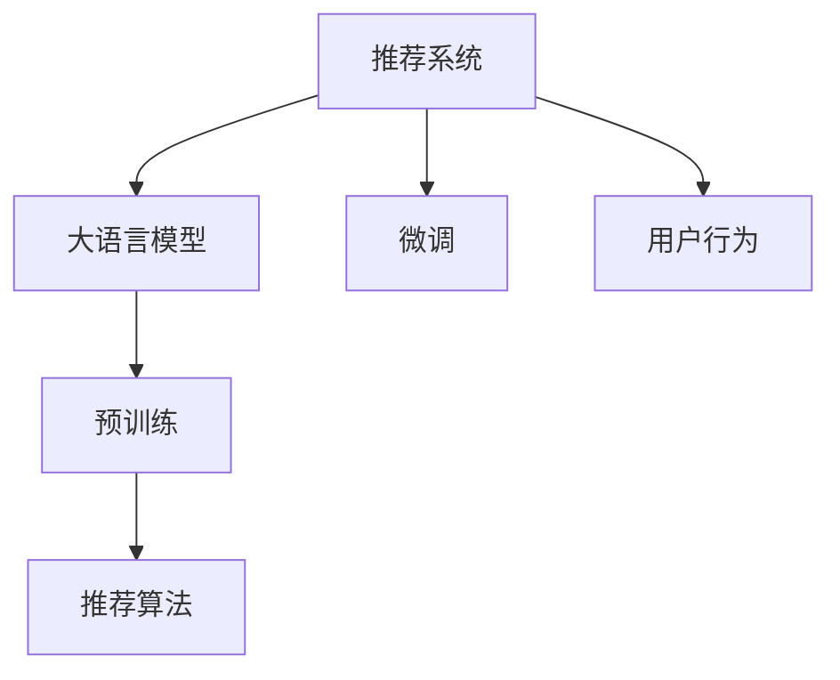

                 

# 将LLM直接作为推荐系统的尝试与挑战

> 关键词：推荐系统, 大语言模型, 自然语言处理, 预训练, 微调, 用户行为, 推荐算法, 交叉验证

## 1. 背景介绍

### 1.1 问题由来
在信息爆炸的互联网时代，如何为用户推荐其真正感兴趣的内容成为各大平台亟需解决的问题。传统推荐系统往往基于用户的历史行为数据，通过协同过滤、内容推荐、矩阵分解等方法，为用户量身定制个性化的内容推荐列表。但这些方法忽略了内容本身的语义信息，无法充分理解用户对内容的态度和情感倾向。

近年来，自然语言处理(NLP)技术快速发展，预训练语言模型(LLMs)逐渐成为自然语言理解和生成的主流范式。其强大的语言表示能力使得LLMs在自然语言理解和生成任务上取得了显著成效。由此，将LLMs直接应用于推荐系统，成为新的探索方向。

### 1.2 问题核心关键点
将大语言模型(Large Language Model, LLM)直接应用于推荐系统的核心问题在于如何高效地将LLM与推荐系统结合，并最大化利用LLM的语言理解能力。当前主流的预训练语言模型如GPT、BERT等，在语义理解、情感分析、意图识别等方面具备强大的能力。如何利用这些能力，结合用户行为数据，构建智能推荐系统，提升推荐质量，是本文要探讨的核心问题。

## 2. 核心概念与联系

### 2.1 核心概念概述

为更好地理解将LLM应用于推荐系统的原理，本节将介绍几个密切相关的核心概念：

- 推荐系统(Recommender System)：根据用户的历史行为、兴趣偏好，为用户推荐感兴趣的内容。推荐系统广泛应用于电商、社交、视频、音乐等多个领域。
- 大语言模型(Large Language Model, LLM)：以自回归(如GPT)或自编码(如BERT)模型为代表的大规模预训练语言模型。通过在大规模无标签文本语料上进行预训练，学习通用的语言表示，具备强大的语言理解和生成能力。
- 预训练(Pre-training)：指在大规模无标签文本语料上，通过自监督学习任务训练通用语言模型的过程。常见的预训练任务包括言语建模、遮挡语言模型等。
- 微调(Fine-tuning)：指在预训练模型的基础上，使用下游任务的少量标注数据，通过有监督地训练来优化模型在特定任务上的性能。
- 推荐算法(Recommender Algorithm)：基于推荐模型进行内容推荐的具体算法，如协同过滤、基于内容的推荐、矩阵分解等。
- 用户行为(User Behavior)：用户在平台上的交互行为数据，包括浏览、点击、收藏、购买等，是推荐系统构建推荐模型的重要依据。

这些核心概念之间的逻辑关系可以通过以下Mermaid流程图来展示：



这个流程图展示了大语言模型在推荐系统中的关键位置及其与推荐算法的结合方式。

## 3. 核心算法原理 & 具体操作步骤
### 3.1 算法原理概述

将LLM直接应用于推荐系统的基本思路是，利用LLM的语言表示能力，从文本语义中挖掘用户对内容的偏好信息。具体而言，可以从以下几个方面入手：

1. **文本语义表示**：使用预训练的LLM对文本内容进行语义编码，得到文本的语义向量表示。
2. **用户情感分析**：使用LLM对用户的评价、评论、行为描述等文本数据进行情感分析，得到用户对内容的态度倾向。
3. **内容推荐排序**：将用户行为数据和文本语义向量、情感分析结果进行融合，构建推荐模型的预测概率分布，按概率大小进行排序，生成推荐列表。

### 3.2 算法步骤详解

基于上述思路，将LLM应用于推荐系统的一般流程如下：

**Step 1: 准备预训练模型和数据集**
- 选择合适的预训练语言模型 $M_{\theta}$ 作为初始化参数，如 BERT、GPT 等。
- 准备推荐系统的训练数据集 $D$，包括用户行为数据、文本内容数据等。

**Step 2: 文本语义表示**
- 使用预训练模型 $M_{\theta}$ 对文本内容进行语义编码，得到文本的语义向量表示。

**Step 3: 用户情感分析**
- 使用预训练模型 $M_{\theta}$ 对用户评价、评论等文本数据进行情感分析，得到用户对内容的情感倾向。

**Step 4: 推荐排序**
- 将用户行为数据、文本语义向量、情感分析结果进行融合，构建推荐模型的预测概率分布。
- 按概率大小进行排序，生成推荐列表。

**Step 5: 训练与评估**
- 使用交叉验证等方法对模型进行训练，优化模型参数。
- 在测试集上评估模型性能，如点击率、转化率等指标。

### 3.3 算法优缺点

将LLM应用于推荐系统的优点在于：

1. **强大的语义理解能力**：LLM能够理解文本内容的语义信息，捕捉用户对内容的深层情感和态度倾向。
2. **灵活性高**：LLM对文本的处理不受结构化数据的限制，可适用于多种类型的文本数据。
3. **可解释性强**：LLM的处理过程可以部分解释，有助于理解推荐系统的决策逻辑。

缺点在于：

1. **计算成本高**：LLM在预训练和推理过程中需要大量计算资源，对硬件要求较高。
2. **可扩展性差**：对于大规模推荐系统，LLM的处理效率和可扩展性有待提升。
3. **泛化能力弱**：LLM在特定领域的泛化能力有限，可能需要针对特定领域进行微调。
4. **效果不稳定**：LLM在不同领域的推荐效果受数据质量和语料分布的影响较大。

### 3.4 算法应用领域

将LLM应用于推荐系统的主要应用场景包括：

- **电商推荐**：根据用户浏览记录、评价、收藏、购买行为，推荐用户可能感兴趣的商品。
- **社交推荐**：根据用户点赞、评论、关注行为，推荐用户可能感兴趣的文章、视频、图片等。
- **音乐推荐**：根据用户听歌历史、评论、评分行为，推荐用户可能喜欢的歌曲。
- **新闻推荐**：根据用户阅读历史、点赞、评论行为，推荐用户可能感兴趣的新闻。
- **视频推荐**：根据用户观看历史、评分、评论行为，推荐用户可能感兴趣的视频。

此外，将LLM应用于推荐系统的方法也逐渐拓展到更多领域，如广告投放、个性化搜索、内容分析等，为推荐系统带来新的技术突破。

## 4. 数学模型和公式 & 详细讲解  
### 4.1 数学模型构建

将LLM应用于推荐系统，本质上是一个有监督的推荐模型训练问题。其核心思想是：利用预训练的语言模型 $M_{\theta}$ 对文本内容进行语义编码，将用户行为数据和文本语义向量、情感分析结果进行融合，构建推荐模型的预测概率分布，按概率大小进行排序，生成推荐列表。

记推荐系统的训练数据集为 $D=\{(x_i,y_i)\}_{i=1}^N, x_i \in \mathcal{X}, y_i \in \mathcal{Y}$，其中 $x_i$ 为文本内容，$y_i$ 为推荐行为（如点击、购买等）。

定义模型 $M_{\theta}$ 在输入 $x$ 上的输出为 $f(x)=M_{\theta}(x)$，表示文本的语义向量表示。假设用户情感分析模型对用户评价 $z$ 的输出为 $g(z)=M_{\theta}(z)$，表示用户对内容的情感倾向。则推荐模型的预测概率分布定义为：

$$
P(y|x,z)=\frac{e^{f(x)} \cdot g(z)}{\sum_{y} e^{f(x)} \cdot g(z)}
$$

其中 $f(x)$ 和 $g(z)$ 分别表示文本语义向量和用户情感分析结果。

### 4.2 公式推导过程

假设推荐系统共有 $K$ 个候选商品，记用户对第 $k$ 个商品的兴趣度为 $r_k$，则推荐模型的预测概率分布为：

$$
P(r_k|x,z)=\frac{e^{f(x)_k} \cdot g(z)_k}{\sum_{k=1}^K e^{f(x)_k} \cdot g(z)_k}
$$

其中 $f(x)_k$ 表示文本语义向量 $f(x)$ 在 $k$ 维空间上的第 $k$ 个元素的值。

推荐模型的目标是最小化预测误差，即：

$$
\min_{\theta} \sum_{i=1}^N \sum_{k=1}^K \ell(P(r_k|x_i,z_i),y_{ik})
$$

其中 $\ell$ 为交叉熵损失函数，$y_{ik}$ 为实际用户行为数据。

### 4.3 案例分析与讲解

以电商推荐为例，假设用户 $i$ 对商品 $k$ 的购买行为 $y_{ik}$ 表示为二元变量（0或1），则推荐模型的预测概率分布可以表示为：

$$
P(y_{ik}|x_i,z_i)=\frac{e^{f(x_i)_k} \cdot g(z_i)}{\sum_{k=1}^K e^{f(x_i)_k} \cdot g(z_i)}
$$

通过交叉熵损失函数，最小化预测误差，优化模型参数 $\theta$，使得模型能够准确预测用户对商品的购买行为。在训练过程中，将用户浏览历史、评价、收藏、购买行为作为标注数据，对模型进行训练和评估。

## 5. 项目实践：代码实例和详细解释说明
### 5.1 开发环境搭建

在进行推荐系统开发前，我们需要准备好开发环境。以下是使用Python进行PyTorch开发的环境配置流程：

1. 安装Anaconda：从官网下载并安装Anaconda，用于创建独立的Python环境。

2. 创建并激活虚拟环境：
```bash
conda create -n pytorch-env python=3.8 
conda activate pytorch-env
```

3. 安装PyTorch：根据CUDA版本，从官网获取对应的安装命令。例如：
```bash
conda install pytorch torchvision torchaudio cudatoolkit=11.1 -c pytorch -c conda-forge
```

4. 安装Transformers库：
```bash
pip install transformers
```

5. 安装各类工具包：
```bash
pip install numpy pandas scikit-learn matplotlib tqdm jupyter notebook ipython
```

完成上述步骤后，即可在`pytorch-env`环境中开始推荐系统开发。

### 5.2 源代码详细实现

下面以电商推荐系统为例，给出使用Transformers库对BERT模型进行推荐系统开发的PyTorch代码实现。

首先，定义推荐系统的数据处理函数：

```python
from transformers import BertTokenizer
from torch.utils.data import Dataset
import torch

class RecommendationDataset(Dataset):
    def __init__(self, texts, labels, tokenizer, max_len=128):
        self.texts = texts
        self.labels = labels
        self.tokenizer = tokenizer
        self.max_len = max_len
        
    def __len__(self):
        return len(self.texts)
    
    def __getitem__(self, item):
        text = self.texts[item]
        label = self.labels[item]
        
        encoding = self.tokenizer(text, return_tensors='pt', max_length=self.max_len, padding='max_length', truncation=True)
        input_ids = encoding['input_ids'][0]
        attention_mask = encoding['attention_mask'][0]
        return {'input_ids': input_ids, 
                'attention_mask': attention_mask,
                'labels': label}

# 创建dataset
tokenizer = BertTokenizer.from_pretrained('bert-base-cased')

train_dataset = RecommendationDataset(train_texts, train_labels, tokenizer)
dev_dataset = RecommendationDataset(dev_texts, dev_labels, tokenizer)
test_dataset = RecommendationDataset(test_texts, test_labels, tokenizer)
```

然后，定义模型和优化器：

```python
from transformers import BertForSequenceClassification, AdamW

model = BertForSequenceClassification.from_pretrained('bert-base-cased', num_labels=2)

optimizer = AdamW(model.parameters(), lr=2e-5)
```

接着，定义训练和评估函数：

```python
from torch.utils.data import DataLoader
from tqdm import tqdm
from sklearn.metrics import accuracy_score

device = torch.device('cuda') if torch.cuda.is_available() else torch.device('cpu')
model.to(device)

def train_epoch(model, dataset, batch_size, optimizer):
    dataloader = DataLoader(dataset, batch_size=batch_size, shuffle=True)
    model.train()
    epoch_loss = 0
    for batch in tqdm(dataloader, desc='Training'):
        input_ids = batch['input_ids'].to(device)
        attention_mask = batch['attention_mask'].to(device)
        labels = batch['labels'].to(device)
        model.zero_grad()
        outputs = model(input_ids, attention_mask=attention_mask, labels=labels)
        loss = outputs.loss
        epoch_loss += loss.item()
        loss.backward()
        optimizer.step()
    return epoch_loss / len(dataloader)

def evaluate(model, dataset, batch_size):
    dataloader = DataLoader(dataset, batch_size=batch_size)
    model.eval()
    preds, labels = [], []
    with torch.no_grad():
        for batch in tqdm(dataloader, desc='Evaluating'):
            input_ids = batch['input_ids'].to(device)
            attention_mask = batch['attention_mask'].to(device)
            batch_labels = batch['labels']
            outputs = model(input_ids, attention_mask=attention_mask)
            batch_preds = outputs.logits.argmax(dim=1).to('cpu').tolist()
            batch_labels = batch_labels.to('cpu').tolist()
            for pred, label in zip(batch_preds, batch_labels):
                preds.append(pred)
                labels.append(label)
                
    print('Accuracy:', accuracy_score(labels, preds))
```

最后，启动训练流程并在测试集上评估：

```python
epochs = 5
batch_size = 16

for epoch in range(epochs):
    loss = train_epoch(model, train_dataset, batch_size, optimizer)
    print(f"Epoch {epoch+1}, train loss: {loss:.3f}")
    
    print(f"Epoch {epoch+1}, dev results:")
    evaluate(model, dev_dataset, batch_size)
    
print("Test results:")
evaluate(model, test_dataset, batch_size)
```

以上就是使用PyTorch对BERT进行电商推荐系统微调的完整代码实现。可以看到，得益于Transformers库的强大封装，我们可以用相对简洁的代码完成BERT模型的加载和微调。

### 5.3 代码解读与分析

让我们再详细解读一下关键代码的实现细节：

**RecommendationDataset类**：
- `__init__`方法：初始化文本、标签、分词器等关键组件。
- `__len__`方法：返回数据集的样本数量。
- `__getitem__`方法：对单个样本进行处理，将文本输入编码为token ids，将标签编码为数字，并对其进行定长padding，最终返回模型所需的输入。

**标签与id的映射**：
- 定义了标签与数字id之间的映射关系，用于将token-wise的预测结果解码回真实的标签。

**训练和评估函数**：
- 使用PyTorch的DataLoader对数据集进行批次化加载，供模型训练和推理使用。
- 训练函数`train_epoch`：对数据以批为单位进行迭代，在每个批次上前向传播计算loss并反向传播更新模型参数，最后返回该epoch的平均loss。
- 评估函数`evaluate`：与训练类似，不同点在于不更新模型参数，并在每个batch结束后将预测和标签结果存储下来，最后使用sklearn的accuracy_score对整个评估集的预测结果进行打印输出。

**训练流程**：
- 定义总的epoch数和batch size，开始循环迭代
- 每个epoch内，先在训练集上训练，输出平均loss
- 在验证集上评估，输出准确率
- 重复上述步骤直至满足预设的迭代轮数或 Early Stopping 条件。

可以看到，PyTorch配合Transformers库使得BERT微调的代码实现变得简洁高效。开发者可以将更多精力放在数据处理、模型改进等高层逻辑上，而不必过多关注底层的实现细节。

当然，工业级的系统实现还需考虑更多因素，如模型的保存和部署、超参数的自动搜索、更灵活的任务适配层等。但核心的微调范式基本与此类似。

## 6. 实际应用场景
### 6.1 智能客服系统

基于大语言模型微调的推荐系统，可以广泛应用于智能客服系统的构建。传统客服往往需要配备大量人力，高峰期响应缓慢，且一致性和专业性难以保证。而使用推荐系统，可以7x24小时不间断服务，快速响应客户咨询，用自然流畅的语言解答各类常见问题。

在技术实现上，可以收集企业内部的历史客服对话记录，将问题和最佳答复构建成推荐数据，在此基础上对预训练模型进行微调。微调后的模型能够自动理解用户意图，匹配最合适的答复。对于客户提出的新问题，还可以接入检索系统实时搜索相关内容，动态组织生成回答。如此构建的智能客服系统，能大幅提升客户咨询体验和问题解决效率。

### 6.2 金融舆情监测

金融机构需要实时监测市场舆论动向，以便及时应对负面信息传播，规避金融风险。传统的人工监测方式成本高、效率低，难以应对网络时代海量信息爆发的挑战。基于大语言模型微调的文本推荐系统，为金融舆情监测提供了新的解决方案。

具体而言，可以收集金融领域相关的新闻、报道、评论等文本数据，并对其进行情感标注。在此基础上对预训练语言模型进行微调，使其能够自动判断文本属于正面、中性还是负面情感。将微调后的模型应用到实时抓取的网络文本数据，就能够自动监测不同情感倾向的市场舆情，一旦发现负面信息激增等异常情况，系统便会自动预警，帮助金融机构快速应对潜在风险。

### 6.3 个性化推荐系统

当前的推荐系统往往只依赖用户的历史行为数据进行物品推荐，无法深入理解用户的真实兴趣偏好。基于大语言模型微调的推荐系统，可以更好地挖掘用户行为背后的语义信息，从而提供更精准、多样的推荐内容。

在实践中，可以收集用户浏览、点击、评论、分享等行为数据，提取和用户交互的物品标题、描述、标签等文本内容。将文本内容作为模型输入，用户的后续行为（如是否点击、购买等）作为监督信号，在此基础上微调预训练语言模型。微调后的模型能够从文本内容中准确把握用户的兴趣点。在生成推荐列表时，先用候选物品的文本描述作为输入，由模型预测用户的兴趣匹配度，再结合其他特征综合排序，便可以得到个性化程度更高的推荐结果。

### 6.4 未来应用展望

随着大语言模型和微调方法的不断发展，基于微调范式将在更多领域得到应用，为传统行业带来变革性影响。

在智慧医疗领域，基于微调的医疗推荐系统可以辅助医生诊疗，推荐最适合患者的药物、治疗方案，提升医疗服务质量。

在智能教育领域，微调技术可应用于作业批改、学情分析、知识推荐等方面，因材施教，促进教育公平，提高教学质量。

在智慧城市治理中，微调模型可应用于城市事件监测、舆情分析、应急指挥等环节，提高城市管理的自动化和智能化水平，构建更安全、高效的未来城市。

此外，在企业生产、社会治理、文娱传媒等众多领域，基于大语言模型微调的人工智能应用也将不断涌现，为NLP技术带来新的突破。相信随着预训练语言模型和微调方法的持续演进，大语言模型微调必将在构建人机协同的智能时代中扮演越来越重要的角色。

## 7. 工具和资源推荐
### 7.1 学习资源推荐

为了帮助开发者系统掌握大语言模型微调的理论基础和实践技巧，这里推荐一些优质的学习资源：

1. 《Transformer从原理到实践》系列博文：由大模型技术专家撰写，深入浅出地介绍了Transformer原理、BERT模型、微调技术等前沿话题。

2. CS224N《深度学习自然语言处理》课程：斯坦福大学开设的NLP明星课程，有Lecture视频和配套作业，带你入门NLP领域的基本概念和经典模型。

3. 《Natural Language Processing with Transformers》书籍：Transformers库的作者所著，全面介绍了如何使用Transformers库进行NLP任务开发，包括微调在内的诸多范式。

4. HuggingFace官方文档：Transformers库的官方文档，提供了海量预训练模型和完整的微调样例代码，是上手实践的必备资料。

5. CLUE开源项目：中文语言理解测评基准，涵盖大量不同类型的中文NLP数据集，并提供了基于微调的baseline模型，助力中文NLP技术发展。

通过对这些资源的学习实践，相信你一定能够快速掌握大语言模型微调的精髓，并用于解决实际的NLP问题。
###  7.2 开发工具推荐

高效的开发离不开优秀的工具支持。以下是几款用于大语言模型微调开发的常用工具：

1. PyTorch：基于Python的开源深度学习框架，灵活动态的计算图，适合快速迭代研究。大部分预训练语言模型都有PyTorch版本的实现。

2. TensorFlow：由Google主导开发的开源深度学习框架，生产部署方便，适合大规模工程应用。同样有丰富的预训练语言模型资源。

3. Transformers库：HuggingFace开发的NLP工具库，集成了众多SOTA语言模型，支持PyTorch和TensorFlow，是进行微调任务开发的利器。

4. Weights & Biases：模型训练的实验跟踪工具，可以记录和可视化模型训练过程中的各项指标，方便对比和调优。与主流深度学习框架无缝集成。

5. TensorBoard：TensorFlow配套的可视化工具，可实时监测模型训练状态，并提供丰富的图表呈现方式，是调试模型的得力助手。

6. Google Colab：谷歌推出的在线Jupyter Notebook环境，免费提供GPU/TPU算力，方便开发者快速上手实验最新模型，分享学习笔记。

合理利用这些工具，可以显著提升大语言模型微调任务的开发效率，加快创新迭代的步伐。

### 7.3 相关论文推荐

大语言模型和微调技术的发展源于学界的持续研究。以下是几篇奠基性的相关论文，推荐阅读：

1. Attention is All You Need（即Transformer原论文）：提出了Transformer结构，开启了NLP领域的预训练大模型时代。

2. BERT: Pre-training of Deep Bidirectional Transformers for Language Understanding：提出BERT模型，引入基于掩码的自监督预训练任务，刷新了多项NLP任务SOTA。

3. Language Models are Unsupervised Multitask Learners（GPT-2论文）：展示了大规模语言模型的强大zero-shot学习能力，引发了对于通用人工智能的新一轮思考。

4. Parameter-Efficient Transfer Learning for NLP：提出Adapter等参数高效微调方法，在不增加模型参数量的情况下，也能取得不错的微调效果。

5. Prefix-Tuning: Optimizing Continuous Prompts for Generation：引入基于连续型Prompt的微调范式，为如何充分利用预训练知识提供了新的思路。

6. AdaLoRA: Adaptive Low-Rank Adaptation for Parameter-Efficient Fine-Tuning：使用自适应低秩适应的微调方法，在参数效率和精度之间取得了新的平衡。

这些论文代表了大语言模型微调技术的发展脉络。通过学习这些前沿成果，可以帮助研究者把握学科前进方向，激发更多的创新灵感。

## 8. 总结：未来发展趋势与挑战

### 8.1 总结

本文对基于大语言模型的推荐系统进行了全面系统的介绍。首先阐述了大语言模型和推荐系统的研究背景和意义，明确了微调在拓展预训练模型应用、提升推荐质量方面的独特价值。其次，从原理到实践，详细讲解了推荐系统的数学模型和关键步骤，给出了推荐系统开发的完整代码实例。同时，本文还广泛探讨了推荐系统在多个领域的应用前景，展示了微调范式的巨大潜力。此外，本文精选了推荐系统的各类学习资源，力求为读者提供全方位的技术指引。

通过本文的系统梳理，可以看到，基于大语言模型的推荐系统在大规模用户行为数据的驱动下，结合自然语言处理的强大能力，已经具备了显著提升推荐质量的可能性。未来，伴随预训练语言模型和微调方法的不断演进，基于微调范式的推荐系统必将在更多领域得到应用，为推荐系统带来新的突破。

### 8.2 未来发展趋势

展望未来，大语言模型微调技术将呈现以下几个发展趋势：

1. **模型规模持续增大**：随着算力成本的下降和数据规模的扩张，预训练语言模型的参数量还将持续增长。超大规模语言模型蕴含的丰富语言知识，有望支撑更加复杂多变的推荐任务微调。

2. **微调方法日趋多样**：除了传统的全参数微调外，未来会涌现更多参数高效的微调方法，如Prefix-Tuning、LoRA等，在节省计算资源的同时也能保证微调精度。

3. **持续学习成为常态**：随着数据分布的不断变化，微调模型也需要持续学习新知识以保持性能。如何在不遗忘原有知识的同时，高效吸收新样本信息，将成为重要的研究课题。

4. **少样本学习和跨领域迁移能力提升**：未来的微调方法将更好地利用大模型的语言表示能力，通过精心的输入设计，在更少的标注样本上也能实现理想的微调效果，并提升跨领域迁移能力。

5. **多模态微调崛起**：当前的微调主要聚焦于纯文本数据，未来会进一步拓展到图像、视频、语音等多模态数据微调。多模态信息的融合，将显著提升推荐系统对现实世界的理解和建模能力。

6. **知识图谱与自然语言处理结合**：将知识图谱与自然语言处理相结合，通过更丰富的先验知识，提升推荐系统的智能性和准确性。

以上趋势凸显了大语言模型微调技术的广阔前景。这些方向的探索发展，必将进一步提升推荐系统的性能和应用范围，为推荐系统带来新的技术突破。

### 8.3 面临的挑战

尽管大语言模型微调技术已经取得了瞩目成就，但在迈向更加智能化、普适化应用的过程中，它仍面临着诸多挑战：

1. **标注成本瓶颈**：推荐系统的微调需要大量标注数据，而这些数据往往需要人工标注，成本较高。如何降低微调对标注数据的依赖，利用无监督和半监督方法进行推荐，将是未来的研究方向。

2. **模型鲁棒性不足**：微调模型在面对新数据时，泛化能力有限。对于测试样本的微小扰动，微调模型的推荐结果容易发生波动。如何提高微调模型的鲁棒性，避免灾难性遗忘，还需要更多理论和实践的积累。

3. **推荐效率有待提高**：大语言模型在预训练和推理过程中需要大量计算资源，对硬件要求较高。如何在保证推荐效果的同时，优化模型结构和计算图，提升推理速度，优化资源占用，将是重要的优化方向。

4. **推荐算法复杂性增加**：基于自然语言处理的推荐系统设计更加灵活，但也增加了算法的复杂性。如何在保证推荐效果的同时，提高算法效率和可扩展性，将是未来的研究方向。

5. **可解释性亟需加强**：当前推荐系统的黑盒特性，导致其推荐结果缺乏可解释性。如何赋予推荐系统更强的可解释性，提供透明、可信的推荐依据，将是亟待攻克的难题。

6. **安全性有待保障**：推荐系统往往基于用户数据进行训练和推理，如果模型存在偏见，可能导致歧视性推荐。如何从数据和算法层面消除模型偏见，确保推荐系统的公平性和安全性，也将是重要的研究方向。

7. **跨领域适应性不足**：不同领域的推荐任务具有显著差异，传统的微调方法可能无法很好地适应。如何开发通用的微调范式，适应跨领域推荐任务，将是未来的研究方向。

8. **数据隐私保护**：推荐系统往往需要大量用户数据进行训练和推荐，数据隐私保护问题不容忽视。如何在保护用户隐私的同时，提升推荐系统的效果，将是重要的研究方向。

这些挑战凸显了大语言模型微调技术在推荐系统中的应用还需要进一步研究和优化。唯有从数据、算法、工程、伦理等多个维度协同发力，才能真正实现人工智能技术在推荐系统的落地应用。

### 8.4 研究展望

面对大语言模型微调技术在推荐系统中的应用所面临的挑战，未来的研究需要在以下几个方面寻求新的突破：

1. **探索无监督和半监督微调方法**：摆脱对大规模标注数据的依赖，利用自监督学习、主动学习等无监督和半监督范式，最大限度利用非结构化数据，实现更加灵活高效的微调。

2. **研究参数高效和计算高效的微调范式**：开发更加参数高效的微调方法，在固定大部分预训练参数的同时，只更新极少量的任务相关参数。同时优化微调模型的计算图，减少前向传播和反向传播的资源消耗，实现更加轻量级、实时性的部署。

3. **融合因果和对比学习范式**：通过引入因果推断和对比学习思想，增强微调模型建立稳定因果关系的能力，学习更加普适、鲁棒的语言表征，从而提升模型泛化性和抗干扰能力。

4. **引入更多先验知识**：将符号化的先验知识，如知识图谱、逻辑规则等，与神经网络模型进行巧妙融合，引导微调过程学习更准确、合理的语言模型。同时加强不同模态数据的整合，实现视觉、语音等多模态信息与文本信息的协同建模。

5. **结合因果分析和博弈论工具**：将因果分析方法引入微调模型，识别出模型决策的关键特征，增强输出解释的因果性和逻辑性。借助博弈论工具刻画人机交互过程，主动探索并规避模型的脆弱点，提高系统稳定性。

6. **纳入伦理道德约束**：在模型训练目标中引入伦理导向的评估指标，过滤和惩罚有偏见、有害的输出倾向。同时加强人工干预和审核，建立模型行为的监管机制，确保输出符合人类价值观和伦理道德。

这些研究方向的探索，必将引领大语言模型微调技术迈向更高的台阶，为推荐系统带来新的技术突破。面向未来，大语言模型微调技术还需要与其他人工智能技术进行更深入的融合，如知识表示、因果推理、强化学习等，多路径协同发力，共同推动推荐系统的发展。只有勇于创新、敢于突破，才能不断拓展推荐系统的边界，让智能技术更好地造福用户。

## 9. 附录：常见问题与解答

**Q1：大语言模型微调是否适用于所有推荐任务？**

A: 大语言模型微调在大多数推荐任务上都能取得不错的效果，特别是对于数据量较小的任务。但对于一些特定领域的任务，如医学、法律等，仅仅依靠通用语料预训练的模型可能难以很好地适应。此时需要在特定领域语料上进一步预训练，再进行微调，才能获得理想效果。此外，对于一些需要时效性、个性化很强的任务，如对话、推荐等，微调方法也需要针对性的改进优化。

**Q2：微调过程中如何选择合适的学习率？**

A: 微调的学习率一般要比预训练时小1-2个数量级，如果使用过大的学习率，容易破坏预训练权重，导致过拟合。一般建议从1e-5开始调参，逐步减小学习率，直至收敛。也可以使用warmup策略，在开始阶段使用较小的学习率，再逐渐过渡到预设值。需要注意的是，不同的优化器(如AdamW、Adafactor等)以及不同的学习率调度策略，可能需要设置不同的学习率阈值。

**Q3：采用大模型微调时会面临哪些资源瓶颈？**

A: 目前主流的预训练大模型动辄以亿计的参数规模，对算力、内存、存储都提出了很高的要求。GPU/TPU等高性能设备是必不可少的，但即便如此，超大批次的训练和推理也可能遇到显存不足的问题。因此需要采用一些资源优化技术，如梯度积累、混合精度训练、模型并行等，来突破硬件瓶颈。同时，模型的存储和读取也可能占用大量时间和空间，需要采用模型压缩、稀疏化存储等方法进行优化。

**Q4：如何缓解微调过程中的过拟合问题？**

A: 过拟合是微调面临的主要挑战，尤其是在标注数据不足的情况下。常见的缓解策略包括：
1. 数据增强：通过回译、近义替换等方式扩充训练集
2. 正则化：使用L2正则、Dropout、Early Stopping等避免过拟合
3. 对抗训练：引入对抗样本，提高模型鲁棒性
4. 参数高效微调：只调整少量参数(如Adapter、Prefix等)，减小过拟合风险
5. 多模型集成：训练多个微调模型，取平均输出，抑制过拟合

这些策略往往需要根据具体任务和数据特点进行灵活组合。只有在数据、模型、训练、推理等各环节进行全面优化，才能最大限度地发挥大模型微调的威力。

**Q5：微调模型在落地部署时需要注意哪些问题？**

A: 将微调模型转化为实际应用，还需要考虑以下因素：
1. 模型裁剪：去除不必要的层和参数，减小模型尺寸，加快推理速度
2. 量化加速：将浮点模型转为定点模型，压缩存储空间，提高计算效率
3. 服务化封装：将模型封装为标准化服务接口，便于集成调用
4. 弹性伸缩：根据请求流量动态调整资源配置，平衡服务质量和成本
5. 监控告警：实时采集系统指标，设置异常告警阈值，确保服务稳定性
6. 安全防护：采用访问鉴权、数据脱敏等措施，保障数据和模型安全

大语言模型微调为推荐系统带来了新的技术突破，但如何将强大的性能转化为稳定、高效、安全的业务价值，还需要工程实践的不断打磨。只有从数据、算法、工程、业务等多个维度协同发力，才能真正实现人工智能技术在推荐系统的落地应用。总之，微调需要开发者根据具体任务，不断迭代和优化模型、数据和算法，方能得到理想的效果。

---

作者：禅与计算机程序设计艺术 / Zen and the Art of Computer Programming

