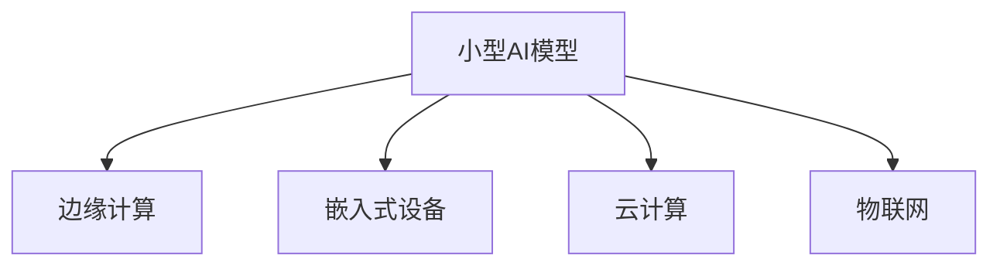

                 

# 小型AI模型的潜力：颠覆行业的可能

## 1. 背景介绍

### 1.1 问题由来

近年来，人工智能(AI)技术飞速发展，大规模的深度学习模型在图像识别、自然语言处理、语音识别等领域取得了巨大的突破。然而，这些模型通常具有高昂的计算资源需求和巨大的模型参数量，使得它们在实际应用中面临着诸多挑战。小型AI模型由于其计算资源需求低、参数量小、部署灵活等优点，逐渐受到广泛关注。

### 1.2 问题核心关键点

小型AI模型主要指的是那些参数量较小、计算资源需求低、能够在小型计算设备上部署的AI模型。与传统的深度学习模型相比，小型AI模型具有更轻量级、更高效、更灵活的特点。这些模型能够在资源受限的环境下运行，非常适合移动设备、嵌入式设备等场景。

此外，小型AI模型还具有更好的可解释性和易于维护的特点，能够更容易地部署到生产环境中，满足实际业务需求。例如，在物联网(IoT)领域，小型AI模型可以部署在传感器和边缘设备上，实时处理数据并作出决策，极大地提高了系统的响应速度和可靠性。

### 1.3 问题研究意义

研究小型AI模型的潜力，对于拓展AI技术的应用范围、提高资源利用率、降低计算成本、提升系统性能等方面具有重要意义：

1. **拓展应用场景**：小型AI模型能够灵活部署到各种资源受限的设备上，极大地拓展了AI技术的适用范围，使得更多行业能够受益于AI的智能转型。
2. **提高资源利用率**：小型AI模型在计算资源需求上更为经济，能够更好地利用计算资源，提高资源利用率。
3. **降低计算成本**：小型AI模型在训练和部署上更为经济，能够大幅降低AI技术应用的计算成本。
4. **提升系统性能**：小型AI模型能够实时处理数据并作出决策，提高了系统的响应速度和可靠性，提升了整体性能。

## 2. 核心概念与联系

### 2.1 核心概念概述

为更好地理解小型AI模型的潜力和应用，本节将介绍几个密切相关的核心概念：

- **小型AI模型**：指参数量较小、计算资源需求低、能够在小型计算设备上部署的AI模型。与传统的深度学习模型相比，小型AI模型具有更轻量级、更高效、更灵活的特点。
- **边缘计算**：指在靠近数据源的本地设备或网络边缘侧进行数据处理和计算，以减少延迟和带宽消耗，提升系统性能。
- **嵌入式设备**：指能够直接运行小型AI模型的计算设备，如智能家居设备、工业控制设备等。
- **云计算**：指利用网络基础设施提供可扩展的计算资源，支持大型AI模型的训练和部署。
- **物联网**：指通过互联网将各种传感器和设备连接起来，实现智能化和自动化的技术体系。

这些核心概念之间的逻辑关系可以通过以下Mermaid流程图来展示：



这个流程图展示了这个概念网络中各个概念之间的关系：

1. 小型AI模型是边缘计算、嵌入式设备和云计算技术的主要应用对象。
2. 边缘计算和嵌入式设备为小型AI模型的部署提供了物理基础，云计算则为大型AI模型的训练和部署提供了基础设施支持。
3. 物联网为小型AI模型提供了广泛的实际应用场景。

## 3. 核心算法原理 & 具体操作步骤

### 3.1 算法原理概述

小型AI模型的训练和部署过程与传统深度学习模型有所不同。由于计算资源有限，小型AI模型通常采用一些特殊的技术手段来优化训练和推理过程。

小型AI模型在训练时，通常使用一些优化算法，如随机梯度下降(SGD)、AdaGrad、Adam等，以快速收敛。在推理时，小型AI模型可以通过剪枝、量化等技术手段，减小模型的计算复杂度和内存占用，从而实现在资源受限的设备上高效运行。

### 3.2 算法步骤详解

小型AI模型的训练和部署过程一般包括以下几个关键步骤：

**Step 1: 准备数据集**

- 收集和标注适用于小型AI模型训练的数据集，数据集应尽可能地涵盖所需的任务领域。
- 对数据集进行预处理，包括数据清洗、归一化、分词等操作。

**Step 2: 设计模型架构**

- 根据任务的性质和数据特征，选择合适的模型架构。常见的模型包括卷积神经网络(CNN)、循环神经网络(RNN)、长短时记忆网络(LSTM)、Transformer等。
- 对于图像处理任务，可以使用轻量级的模型架构，如MobileNet、ShuffleNet等；对于自然语言处理任务，可以使用BERT、TinyBERT等模型。

**Step 3: 训练模型**

- 选择合适的优化算法和超参数，如学习率、批大小、迭代轮数等。
- 使用训练数据集进行模型训练，通过前向传播和反向传播更新模型参数。
- 使用验证数据集对模型进行评估，防止过拟合。

**Step 4: 模型部署**

- 将训练好的模型进行剪枝、量化等优化，减小模型的大小和计算复杂度。
- 将优化后的模型部署到目标设备上，如嵌入式设备、边缘设备等。
- 进行模型性能测试，确保模型在目标设备上能够稳定运行。

### 3.3 算法优缺点

小型AI模型具有以下优点：

1. **计算资源需求低**：小型AI模型可以在资源受限的设备上运行，减少了对计算资源的需求。
2. **部署灵活**：小型AI模型可以在各种设备上部署，提升了系统的灵活性。
3. **可解释性强**：小型AI模型通常结构简单，易于解释和调试，有利于提升系统的可解释性。
4. **训练时间短**：小型AI模型参数量小，训练时间较短，可以快速迭代开发。

同时，小型AI模型也存在一些局限性：

1. **性能有限**：小型AI模型的参数量有限，可能无法应对复杂任务。
2. **数据需求高**：由于模型参数量少，小型AI模型对标注数据的需求较高，可能难以在标注数据不足的场景中取得理想效果。
3. **迁移能力有限**：小型AI模型在迁移学习能力上较弱，可能难以适应新领域和新任务。

尽管存在这些局限性，但小型AI模型在特定场景下依然具备强大的潜力，能够为各行各业带来显著的变革。

### 3.4 算法应用领域

小型AI模型已经在多个领域取得了显著的应用成果：

- **智能家居**：小型AI模型可以部署在智能家居设备上，实现语音控制、场景识别、智能推荐等功能，提升用户体验。
- **工业自动化**：小型AI模型可以部署在工业设备上，实现质量检测、故障预测、设备维护等功能，提高生产效率和产品质量。
- **医疗健康**：小型AI模型可以部署在便携式医疗设备上，实现健康监测、疾病预测、智能问诊等功能，提供更便捷的医疗服务。
- **智慧交通**：小型AI模型可以部署在交通设施上，实现车辆识别、交通流量预测、智能导航等功能，提高交通管理水平。
- **农业生产**：小型AI模型可以部署在农业设备上，实现作物识别、病虫害预测、智能灌溉等功能，提升农业生产效率。

除了上述这些应用场景外，小型AI模型还在自动驾驶、安全监控、智慧物流等领域取得了重要进展，显示了其强大的应用潜力。

## 4. 数学模型和公式 & 详细讲解 & 举例说明

### 4.1 数学模型构建

在本节中，我们将以小型AI模型在图像分类任务中的应用为例，构建一个简化的数学模型。假设我们的任务是将输入的图像分为多个类别，模型架构为卷积神经网络(CNN)。

输入图像为 $x \in \mathbb{R}^{n_x}$，其中 $n_x$ 为图像像素数目。模型的输出层为 $y \in \mathbb{R}^k$，其中 $k$ 为类别数目。模型的参数为 $\theta$，包括卷积核、池化层、全连接层等。

定义模型 $M_{\theta}$ 在输入 $x$ 上的输出为 $\hat{y}=M_{\theta}(x)$，表示样本属于某一类别的概率。真实标签 $y \in \{0,1\}^k$。则二分类交叉熵损失函数定义为：

$$
\ell(M_{\theta}(x),y) = -\sum_{i=1}^k y_i \log M_{\theta}(x)_i
$$

### 4.2 公式推导过程

根据链式法则，损失函数对参数 $\theta$ 的梯度为：

$$
\frac{\partial \ell(M_{\theta}(x),y)}{\partial \theta} = -\sum_{i=1}^k \frac{y_i}{M_{\theta}(x)_i} \frac{\partial M_{\theta}(x)}{\partial \theta}
$$

在得到损失函数的梯度后，即可带入优化算法进行迭代优化。常用的优化算法包括随机梯度下降(SGD)、AdaGrad、Adam等，通过前向传播和反向传播更新模型参数。

在训练过程中，为了进一步优化模型的性能，可以采用一些额外的技术手段，如数据增强、正则化、剪枝、量化等。这些技术手段可以有效地提升模型的泛化能力和计算效率。

### 4.3 案例分析与讲解

假设我们使用MobileNetV2模型对CIFAR-10数据集进行图像分类。MobileNetV2是一种轻量级卷积神经网络，适用于移动设备等资源受限的场景。

**Step 1: 数据集准备**

- 收集CIFAR-10数据集，并对图像进行预处理，包括归一化和数据增强。
- 将数据集分为训练集、验证集和测试集。

**Step 2: 模型架构设计**

- 使用MobileNetV2模型架构，包含多个卷积层、池化层和全连接层。
- 设置模型的超参数，如学习率、批大小、迭代轮数等。

**Step 3: 模型训练**

- 使用训练集对模型进行训练，通过前向传播和反向传播更新模型参数。
- 使用验证集对模型进行评估，防止过拟合。
- 在训练过程中，使用数据增强和正则化等技术手段，提升模型的泛化能力。

**Step 4: 模型优化**

- 对训练好的模型进行剪枝、量化等优化，减小模型的大小和计算复杂度。
- 将优化后的模型部署到目标设备上，进行性能测试。

通过以上步骤，我们可以构建一个适用于移动设备的图像分类小型AI模型。该模型具有较低的计算资源需求，能够在各种资源受限的设备上高效运行。

## 5. 项目实践：代码实例和详细解释说明

### 5.1 开发环境搭建

在进行小型AI模型开发前，我们需要准备好开发环境。以下是使用Python进行TensorFlow开发的环境配置流程：

1. 安装Anaconda：从官网下载并安装Anaconda，用于创建独立的Python环境。

2. 创建并激活虚拟环境：
```bash
conda create -n tf-env python=3.8 
conda activate tf-env
```

3. 安装TensorFlow：根据CUDA版本，从官网获取对应的安装命令。例如：
```bash
pip install tensorflow-gpu==2.6
```

4. 安装TensorBoard：TensorFlow配套的可视化工具，用于实时监测模型训练状态和可视化模型性能。
```bash
pip install tensorboard
```

5. 安装各类工具包：
```bash
pip install numpy pandas scikit-learn matplotlib tqdm jupyter notebook ipython
```

完成上述步骤后，即可在`tf-env`环境中开始小型AI模型的开发。

### 5.2 源代码详细实现

这里我们以MobileNetV2模型为例，使用TensorFlow对CIFAR-10数据集进行图像分类。

```python
import tensorflow as tf
from tensorflow.keras.datasets import cifar10
from tensorflow.keras.preprocessing.image import ImageDataGenerator
from tensorflow.keras.applications.mobilenet_v2 import MobileNetV2
from tensorflow.keras.layers import Dense, GlobalAveragePooling2D
from tensorflow.keras.models import Model
from tensorflow.keras.optimizers import Adam

# 加载CIFAR-10数据集
(x_train, y_train), (x_test, y_test) = cifar10.load_data()

# 数据预处理
x_train = x_train / 255.0
x_test = x_test / 255.0

# 数据增强
train_datagen = ImageDataGenerator(width_shift_range=0.1, height_shift_range=0.1, horizontal_flip=True)
test_datagen = ImageDataGenerator()

# 构建模型
base_model = MobileNetV2(include_top=False, weights='imagenet', input_shape=(32, 32, 3), pooling='avg')
x = base_model.output
x = GlobalAveragePooling2D()(x)
x = Dense(1280, activation='relu')(x)
predictions = Dense(10, activation='softmax')(x)
model = Model(inputs=base_model.input, outputs=predictions)

# 编译模型
model.compile(optimizer=Adam(learning_rate=0.001), loss='categorical_crossentropy', metrics=['accuracy'])

# 训练模型
model.fit(train_datagen.flow(x_train, y_train, batch_size=64), epochs=10, validation_data=(x_test, y_test))
```

在上述代码中，我们首先加载CIFAR-10数据集，并对图像进行预处理和数据增强。然后，我们使用MobileNetV2模型作为基础架构，在顶层添加全局平均池化层和全连接层，构建一个适合移动设备的图像分类模型。最后，我们使用Adam优化器编译模型，并在训练集上训练模型。

### 5.3 代码解读与分析

让我们再详细解读一下关键代码的实现细节：

**加载CIFAR-10数据集**：
- `cifar10.load_data()`函数用于加载CIFAR-10数据集，包括训练集和测试集。
- 加载后，需要将像素值归一化到0到1之间。

**数据增强**：
- `ImageDataGenerator`用于数据增强，通过随机裁剪、旋转、翻转等操作扩充训练集。

**模型架构设计**：
- 使用MobileNetV2作为基础架构，通过添加全局平均池化层和全连接层，构建图像分类模型。
- MobileNetV2模型具有较少的参数和计算复杂度，适合移动设备等资源受限的场景。

**模型编译和训练**：
- `compile`函数用于编译模型，设置优化器、损失函数和评估指标。
- `fit`函数用于训练模型，使用`ImageDataGenerator`生成的批数据进行训练。

通过以上步骤，我们可以构建一个适用于移动设备的图像分类小型AI模型。该模型具有较低的计算资源需求，能够在各种资源受限的设备上高效运行。

## 6. 实际应用场景

### 6.1 智能家居

小型AI模型可以部署在智能家居设备上，实现语音控制、场景识别、智能推荐等功能，提升用户体验。例如，可以使用小型AI模型对用户语音指令进行识别和理解，然后控制智能灯光、温度、安防等设备。

**应用场景**：
- 语音助手：实时识别用户语音指令，并执行相应的设备控制操作。
- 场景识别：通过摄像头识别用户行为，自动调整家居环境，如亮度、温度等。
- 智能推荐：根据用户行为和偏好，推荐相关内容，如音乐、电影、天气预报等。

### 6.2 工业自动化

小型AI模型可以部署在工业设备上，实现质量检测、故障预测、设备维护等功能，提高生产效率和产品质量。例如，可以使用小型AI模型对生产线上采集的图像进行实时分析，检测产品质量缺陷，并进行故障预测和设备维护。

**应用场景**：
- 质量检测：实时分析生产线上的图像，检测产品缺陷，确保产品质量。
- 故障预测：通过分析设备运行数据，预测设备故障，提前进行维护。
- 设备维护：根据设备运行状态，自动调整维护计划，减少停机时间。

### 6.3 医疗健康

小型AI模型可以部署在便携式医疗设备上，实现健康监测、疾病预测、智能问诊等功能，提供更便捷的医疗服务。例如，可以使用小型AI模型对用户的心电图、血压、血糖等生理数据进行分析，提供个性化的健康建议。

**应用场景**：
- 健康监测：实时分析生理数据，提供健康建议和预警。
- 疾病预测：通过分析历史数据，预测疾病风险，提前进行干预。
- 智能问诊：根据用户症状，提供初步诊断建议，建议用户就医。

### 6.4 未来应用展望

随着小型AI模型的不断发展，其在各个领域的潜力将进一步得到释放。未来，小型AI模型将在以下方面取得更大的突破：

1. **更高效的数据处理**：小型AI模型能够在资源受限的设备上高效处理数据，提高数据处理的实时性和效率。
2. **更智能的设备控制**：小型AI模型能够实现更智能的设备控制，提升设备的自动化和智能化水平。
3. **更精准的健康监测**：小型AI模型能够提供更精准的健康监测和疾病预测，提升用户健康水平。
4. **更个性化的推荐服务**：小型AI模型能够提供更个性化的推荐服务，提升用户体验。

## 7. 工具和资源推荐

### 7.1 学习资源推荐

为了帮助开发者系统掌握小型AI模型的理论基础和实践技巧，这里推荐一些优质的学习资源：

1. **《TensorFlow实战》系列书籍**：详细介绍了TensorFlow的开发实践，包括模型训练、优化、部署等环节。
2. **《深度学习入门》课程**：入门级深度学习课程，涵盖了深度学习的基本概念和经典模型。
3. **《MobileNet：为移动和嵌入式视觉应用设计的卷积神经网络》论文**：介绍了MobileNet模型架构的设计和优化，适合学习小型AI模型开发。
4. **Kaggle竞赛**：参加Kaggle竞赛，实战演练小型AI模型开发，提升技术能力。
5. **TensorFlow官方文档**：包含丰富的API文档和样例代码，适合快速上手学习。

通过学习这些资源，相信你一定能够快速掌握小型AI模型的精髓，并用于解决实际的AI问题。

### 7.2 开发工具推荐

高效的开发离不开优秀的工具支持。以下是几款用于小型AI模型开发的工具：

1. **TensorFlow**：基于Python的开源深度学习框架，支持各种深度学习模型的开发和训练。
2. **Keras**：高层次的深度学习API，易于上手，适合快速原型开发。
3. **PyTorch**：灵活的深度学习框架，支持动态图和静态图，适合研究和实验。
4. **TensorBoard**：TensorFlow配套的可视化工具，用于实时监测模型训练状态和可视化模型性能。
5. **ONNX**：开源机器学习格式标准，支持多种深度学习框架的模型转换和部署。

合理利用这些工具，可以显著提升小型AI模型的开发效率，加快创新迭代的步伐。

### 7.3 相关论文推荐

小型AI模型的发展离不开学界的持续研究。以下是几篇奠基性的相关论文，推荐阅读：

1. **MobileNets for efficient image classification and transfer learning**：提出MobileNet系列模型，适合移动设备等资源受限的场景。
2. **ShuffleNet: an extremely efficient convolutional neural network for mobile devices and IoT**：提出ShuffleNet模型，具有极高的计算效率，适合移动设备等资源受限的场景。
3. **EfficientDet: Scalable and efficient object detection**：提出EfficientDet模型，具有极高的检测精度和计算效率，适合各种资源受限的设备。
4. **BERT: Pre-training of Deep Bidirectional Transformers for Language Understanding**：提出BERT模型，适合自然语言处理任务，具有高效的训练和推理性能。
5. **DygraphNet: A Dynamic Computational Graph Network for Efficient Model Training**：提出DygraphNet模型，适合动态图计算，具有高效的模型训练和推理性能。

这些论文代表小型AI模型发展的重要成果，通过学习这些前沿成果，可以帮助研究者把握学科前进方向，激发更多的创新灵感。

## 8. 总结：未来发展趋势与挑战

### 8.1 总结

本文对小型AI模型的潜力进行了全面系统的介绍。首先阐述了小型AI模型的背景和应用意义，明确了其在计算资源需求低、部署灵活等方面的优势。其次，从原理到实践，详细讲解了小型AI模型的数学模型和操作步骤，给出了小型AI模型开发的完整代码实例。同时，本文还广泛探讨了小型AI模型在智能家居、工业自动化、医疗健康等多个领域的应用前景，展示了小型AI模型的强大潜力。此外，本文精选了小型AI模型的各类学习资源，力求为读者提供全方位的技术指引。

通过本文的系统梳理，可以看到，小型AI模型具有广阔的应用前景，能够在资源受限的设备上高效运行，为各行各业带来显著的变革。未来，小型AI模型将在更多领域得到应用，为人类认知智能的进化带来深远影响。

### 8.2 未来发展趋势

展望未来，小型AI模型将呈现以下几个发展趋势：

1. **更高效的模型设计**：未来的小型AI模型将继续优化计算复杂度和内存占用，实现更高的计算效率和更小的模型大小。
2. **更广泛的应用场景**：小型AI模型将拓展到更多行业和领域，提升各行各业智能化水平。
3. **更智能的设备控制**：小型AI模型将实现更智能的设备控制，提升设备自动化和智能化水平。
4. **更精准的健康监测**：小型AI模型将提供更精准的健康监测和疾病预测，提升用户健康水平。
5. **更个性化的推荐服务**：小型AI模型将提供更个性化的推荐服务，提升用户体验。

### 8.3 面临的挑战

尽管小型AI模型已经取得了瞩目成就，但在迈向更加智能化、普适化应用的过程中，它仍面临诸多挑战：

1. **性能瓶颈**：小型AI模型在处理复杂任务时，可能存在性能瓶颈，需要进一步优化模型架构和算法。
2. **数据需求高**：小型AI模型对标注数据的需求较高，在标注数据不足的场景中可能难以取得理想效果。
3. **迁移能力弱**：小型AI模型在迁移学习能力上较弱，可能难以适应新领域和新任务。
4. **计算资源限制**：小型AI模型依赖于有限的计算资源，可能难以应对大规模数据集和高复杂度任务。
5. **可解释性不足**：小型AI模型的黑盒特性可能导致其决策过程难以解释，影响模型的可信度和可解释性。

尽管存在这些挑战，但小型AI模型在特定场景下依然具备强大的潜力，能够为各行各业带来显著的变革。

### 8.4 研究展望

面对小型AI模型所面临的挑战，未来的研究需要在以下几个方面寻求新的突破：

1. **更高效的模型优化**：开发更高效的模型优化算法，提升小型AI模型的性能和计算效率。
2. **更智能的任务适配**：设计更加智能的任务适配层，提升小型AI模型的泛化能力和迁移学习能力。
3. **更智能的数据处理**：引入更多先验知识和数据增强技术，提升小型AI模型的数据处理能力和泛化能力。
4. **更智能的决策过程**：引入因果推断和解释性方法，提升小型AI模型的决策过程的可解释性和可信度。
5. **更智能的资源管理**：开发更智能的资源管理系统，优化小型AI模型的资源利用效率。

这些研究方向的探索，必将引领小型AI模型技术迈向更高的台阶，为构建安全、可靠、可解释、可控的智能系统铺平道路。面向未来，小型AI模型需要与其他AI技术进行更深入的融合，如知识表示、因果推理、强化学习等，多路径协同发力，共同推动自然语言理解和智能交互系统的进步。只有勇于创新、敢于突破，才能不断拓展小型AI模型的边界，让智能技术更好地造福人类社会。

## 9. 附录：常见问题与解答

**Q1：小型AI模型和深度学习模型有何不同？**

A: 小型AI模型和深度学习模型的最大区别在于参数量和计算资源需求。小型AI模型通常参数量较小，计算资源需求低，能够在资源受限的设备上运行。而深度学习模型通常参数量大，计算资源需求高，适合在计算资源充足的环境中进行训练和推理。

**Q2：小型AI模型如何处理数据增强？**

A: 数据增强是小型AI模型中常用的技术手段，通过扩充训练集，提升模型的泛化能力。小型AI模型可以通过旋转、翻转、裁剪等操作，对图像和视频数据进行增强。对于文本数据，可以通过同义词替换、随机插入等操作进行增强。

**Q3：小型AI模型如何优化？**

A: 小型AI模型的优化通常包括剪枝、量化、蒸馏等技术手段。剪枝可以去除模型中冗余参数，减小模型大小。量化可以将浮点模型转换为定点模型，减小内存占用。蒸馏可以通过知识蒸馏技术，将大型模型的知识迁移到小型模型中。

**Q4：小型AI模型如何部署？**

A: 小型AI模型的部署通常包括模型优化和模型封装。模型优化可以通过剪枝、量化等技术手段，减小模型大小和计算复杂度。模型封装可以将模型转换为可执行文件或服务接口，方便部署和调用。

**Q5：小型AI模型和传统机器学习模型有何不同？**

A: 小型AI模型和传统机器学习模型的最大区别在于计算资源需求和参数量。小型AI模型通常参数量较小，计算资源需求低，适合在资源受限的设备上运行。而传统机器学习模型通常参数量较小，计算资源需求低，适合在资源受限的环境中进行训练和推理。

通过以上解答，希望能帮助读者更好地理解小型AI模型及其应用，为未来的小型AI模型开发和应用提供有价值的参考。

---

作者：禅与计算机程序设计艺术 / Zen and the Art of Computer Programming

