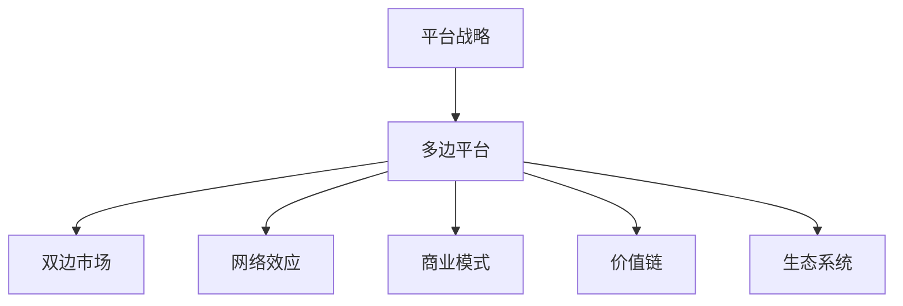

                 

# 平台战略：打造和管理多边平台业务

> 关键词：平台战略,多边平台,商业模式,网络效应,用户增长,价值链,生态系统

## 1. 背景介绍

### 1.1 问题由来
随着互联网技术的迅猛发展，平台经济已经成为了全球经济增长的新引擎。从Facebook到阿里巴巴，从Airbnb到滴滴出行，这些知名平台企业通过连接各方的需求和供给，不仅实现了自身业务的爆发式增长，也推动了整个产业生态的繁荣。然而，在平台经济大潮中，并非所有企业都能够复制成功。究其原因，平台商业模式独特且复杂，需要深入理解其运作机制和战略设计。

### 1.2 问题核心关键点
平台战略的核心在于构建一个多边平台，通过连接不同的用户群体，在平台上形成网络效应，最终实现整个生态系统的协同进化。在这个过程中，平台需要平衡各方利益，制定合理的商业模式和运营策略，以实现平台的可持续发展。

### 1.3 问题研究意义
理解平台战略对于希望构建或运营多边平台的企业具有重要意义：

1. **洞察平台商业模式**：掌握平台商业模式的本质和运作机制，避免盲目模仿，避免投入巨额资源却收效甚微。
2. **设计平台战略**：从平台生态系统的角度出发，设计出能实现互利共赢的平台战略，构建可持续发展的平台。
3. **优化平台运营**：了解平台的运营瓶颈和优化策略，提高平台的用户增长和盈利能力。
4. **应对竞争挑战**：在激烈的市场竞争中，通过战略布局和资源调配，构建平台的核心竞争优势，确保平台的长久发展。

## 2. 核心概念与联系

### 2.1 核心概念概述

为更好地理解平台战略，本节将介绍几个密切相关的核心概念：

- **平台战略(Platform Strategy)**：通过构建多边平台，连接不同用户群体，形成网络效应，实现生态系统协同进化的策略。
- **多边平台(Multiplex Platform)**：一个平台同时连接两个或两个以上不同的用户群体，通过双边或多边网络效应，实现多方共赢。
- **双边市场(Two-Sided Market)**：一种市场形态，其中平台需要同时吸引和平衡两个独立的用户群体，一个提供价值，另一个提供支付。
- **网络效应(Network Effect)**：平台中用户数量的增加会提升平台的价值，从而吸引更多用户加入，形成正反馈循环。
- **商业模式(Monetization Model)**：平台如何创造价值并实现盈利的过程，包括免费策略、订阅模式、交易抽成等。
- **价值链(Value Chain)**：平台中各参与者提供的价值环节，如平台方、商户、用户等。
- **生态系统(Ecosystem)**：平台内外部各利益相关者共同构成的生态网络，通过合作和竞争，共同推动平台的发展。

这些核心概念之间的逻辑关系可以通过以下Mermaid流程图来展示：



这个流程图展示平台战略的核心概念及其之间的关系：

1. 平台战略通过构建多边平台来连接不同用户群体，形成网络效应。
2. 多边平台通过双边市场吸引和平衡不同用户群体，通过网络效应实现多方共赢。
3. 平台通过商业模式创造价值，并通过价值链实现盈利。
4. 整个平台生态系统通过内部合作和外部竞争共同推动平台发展。

这些概念共同构成了平台战略的理论基础，使得平台企业能够更好地理解其商业模式和运营机制。

## 3. 核心算法原理 & 具体操作步骤
### 3.1 算法原理概述

平台战略的实现涉及复杂的算法和数据处理，其核心在于理解平台的价值创造和增长逻辑。以下将从平台的设计和运营两个角度，阐述核心算法原理及具体操作步骤：

### 3.2 算法步骤详解

**平台设计阶段**：

1. **需求分析**：通过市场调研和用户访谈，确定平台需要连接的用户群体及其需求。
2. **平台定位**：明确平台的定位和核心竞争力，设计平台的价值主张。
3. **平台架构设计**：确定平台的技术架构和数据架构，设计平台的网络结构，确保平台的高可用性和可扩展性。
4. **市场推广**：制定市场推广计划，吸引初期用户，形成平台的基础用户群体。

**平台运营阶段**：

1. **用户增长**：通过定向广告、推荐算法、激励机制等手段，促进平台的用户增长。
2. **价值创造**：通过优化平台算法、提升用户体验、提供增值服务等手段，创造平台价值。
3. **盈利模式**：探索平台盈利模式，如广告收入、交易抽成、会员费等，实现平台的可持续运营。
4. **生态系统建设**：通过合作和开放平台接口，吸引第三方应用和服务入驻平台，丰富平台的生态系统。

### 3.3 算法优缺点

平台战略具有以下优点：

1. **用户粘性高**：通过网络效应，平台能够形成用户依赖，提升用户粘性。
2. **协同效应**：平台连接的不同用户群体可以相互促进，提升平台的整体价值。
3. **市场壁垒高**：平台通过网络效应和用户粘性，形成强大的市场壁垒，难以被竞争对手轻易复制。

同时，该方法也存在一定的局限性：

1. **高投入风险**：平台的初期建设需要大量资金和资源投入，且在市场接受度不确定的情况下，存在高投入风险。
2. **复杂度高**：平台战略设计复杂，需要平衡各方利益，协调各方需求，难度较高。
3. **用户留存挑战**：平台需要通过持续的创新和优化，提升用户体验，防止用户流失。
4. **市场竞争激烈**：平台需要不断进行战略调整，应对激烈的市场竞争，保持竞争力。

尽管存在这些局限性，但就目前而言，平台战略仍是构建大型平台企业的关键途径，其成功与否很大程度上取决于平台战略的设计和执行。

### 3.4 算法应用领域

平台战略在多个行业和领域中得到了广泛应用，例如：

- **电子商务**：如淘宝、京东、亚马逊等电商平台，通过连接买家和卖家，形成双边市场，实现商业价值。
- **社交网络**：如Facebook、微信、Twitter等社交平台，通过连接用户和内容，实现用户粘性和网络效应。
- **共享经济**：如Airbnb、滴滴出行等共享平台，通过连接供需双方，形成多方共赢的生态系统。
- **金融科技**：如支付宝、PayPal等金融平台，通过连接用户和商户，实现支付和金融服务的增值。
- **教育科技**：如Coursera、Udemy等在线教育平台，通过连接教师和学生，实现教育资源的共享。

除了上述这些经典应用外，平台战略还被创新性地应用于更多场景中，如健康医疗、旅游出行、智能制造等，为各行业带来了全新的发展机会。

## 4. 数学模型和公式 & 详细讲解  
### 4.1 数学模型构建

平台战略的数学模型可以从多个角度进行构建，例如：

- **用户增长模型**：描述用户数量随时间变化的规律，如Logistic回归模型、指数增长模型等。
- **网络效应模型**：描述用户数量增加对平台价值的影响，如Gompertz曲线、S型曲线等。
- **价值链模型**：描述平台各参与者提供的价值环节，如成本效益分析、边际贡献分析等。
- **收益模型**：描述平台如何通过不同盈利模式实现收入，如固定费用模型、可变费用模型等。

### 4.2 公式推导过程

以用户增长模型为例，假设平台初期有 $u_0$ 个用户，用户增长率为 $g$，则 $t$ 时间后的用户数量 $u_t$ 可以表示为：

$$
u_t = u_0 \cdot (1+g)^t
$$

其中 $g$ 为年增长率，$t$ 为年数。在实际应用中，平台的用户增长率会受到市场环境、竞争状况、用户满意度的影响，需要根据具体情况进行模型选择和参数调整。

### 4.3 案例分析与讲解

以Airbnb平台为例，分析其用户增长和平台价值的关系。Airbnb通过连接房东和房客，形成双边市场，其用户增长模型和平台价值模型如下：

**用户增长模型**：
假设Airbnb的年增长率为 $g=20\%$，则其用户数量 $u_t$ 与时间 $t$ 的关系可以表示为：

$$
u_t = u_0 \cdot (1+0.2)^t
$$

**平台价值模型**：
Airbnb的价值主要来源于交易量（即订单量）和用户体验（即用户满意度）。假设交易量与用户数量成正比，即每增加一个用户，平台每天增加 $r$ 个订单，则平台价值 $V_t$ 与时间 $t$ 的关系可以表示为：

$$
V_t = u_t \cdot r \cdot (1-s)^t
$$

其中 $r$ 为平台每天新增的订单量，$s$ 为平台的用户满意度系数。平台通过提高用户满意度和增加订单量，提升平台价值。

## 5. 项目实践：代码实例和详细解释说明
### 5.1 开发环境搭建

在进行平台战略实践前，我们需要准备好开发环境。以下是使用Python进行平台战略研究的环境配置流程：

1. 安装Python：从官网下载并安装Python，并配置环境变量。
2. 安装相关库：如NumPy、Pandas、Matplotlib等，用于数据处理和可视化。
3. 安装Web框架：如Flask、Django等，用于构建和管理平台。
4. 安装数据处理库：如Scikit-learn、TensorFlow等，用于机器学习和深度学习。

完成上述步骤后，即可在开发环境中开始平台战略的实践。

### 5.2 源代码详细实现

以下是一个简单的平台用户增长模型和价值模型的代码实现。

```python
import numpy as np
import matplotlib.pyplot as plt

# 用户增长模型
u_0 = 1000
g = 0.2
t = np.arange(0, 10, 0.1)
u_t = u_0 * (1 + g)**t

# 平台价值模型
r = 100
s = 0.8
V_t = u_t * r * (1 - s)**t

# 绘制用户增长曲线和平台价值曲线
plt.plot(t, u_t, label='User Growth')
plt.plot(t, V_t, label='Platform Value')
plt.xlabel('Time (Years)')
plt.ylabel('Value')
plt.legend()
plt.show()
```

### 5.3 代码解读与分析

让我们再详细解读一下关键代码的实现细节：

**用户增长模型**：
- 使用NumPy库，计算t时刻的用户数量。

**平台价值模型**：
- 使用Matplotlib库，绘制用户增长曲线和平台价值曲线。

**代码实现分析**：
- 用户增长模型使用指数增长公式，平台价值模型使用复合增长公式，可以直观地反映用户数量对平台价值的影响。

## 6. 实际应用场景
### 6.1 电子商务平台

基于平台战略的电子商务平台，通过连接买家和卖家，实现信息流、商品流和资金流的无缝对接，提高了交易效率，降低了交易成本。例如，淘宝通过连接数亿的买家和数百万的卖家，形成庞大的双边市场，实现了商业价值的最大化。

在技术实现上，平台需要设计合理的价格机制、交易保障机制和用户评价机制，以平衡买家和卖家的利益。通过优化推荐算法、提供金融服务等手段，提升用户体验和平台价值。同时，平台还可以通过大数据分析，实现个性化推荐，提升用户粘性。

### 6.2 社交网络平台

社交网络平台通过连接用户和内容，实现信息的快速传播和用户的深度互动。例如，Facebook通过连接全球数十亿用户，形成强大的网络效应，用户依赖性高。

在技术实现上，平台需要设计有效的用户认证机制、隐私保护机制和内容审核机制，以保障用户的安全和平台的内容质量。通过推荐算法、社交图谱分析等手段，提升用户粘性和平台价值。同时，平台还可以通过开放平台接口，吸引第三方应用和服务入驻，丰富平台生态系统。

### 6.3 共享经济平台

共享经济平台通过连接供需双方，实现资源的共享和再利用。例如，Airbnb通过连接数百万的房东和房客，实现住宿资源的共享，提升了用户的出行体验和平台的盈利能力。

在技术实现上，平台需要设计高效匹配算法、订单管理和支付保障机制，以保障供需双方的权益。通过数据分析和用户反馈，优化服务流程，提升用户体验和平台价值。同时，平台还可以通过用户评价和激励机制，鼓励供需双方的良性互动。

### 6.4 未来应用展望

随着平台经济的持续发展，平台战略将在更多领域得到应用，为各行各业带来变革性影响。

在智慧医疗领域，基于平台战略的医疗平台，通过连接医生、医院、患者，实现医疗资源的共享和再利用，提升医疗服务的质量和效率。

在智能制造领域，基于平台战略的工业互联网平台，通过连接制造企业、供应商、客户，实现生产流程的优化和协同，提升制造业的智能化水平。

在智能家居领域，基于平台战略的智能家居平台，通过连接各种智能设备，实现家庭场景的智能控制和优化，提升用户的居家体验。

此外，在教育、金融、旅游等众多领域，基于平台战略的各类应用平台也将不断涌现，为各行业带来新的发展机会。

## 7. 工具和资源推荐
### 7.1 学习资源推荐

为了帮助开发者系统掌握平台战略的理论基础和实践技巧，这里推荐一些优质的学习资源：

1. **《平台革命：重新思考平台经济》**：该书系统阐述了平台经济的运作机制和战略设计，是理解平台战略的重要读物。
2. **Coursera上的《数字平台战略》课程**：由斯坦福大学开设，介绍了平台战略的核心概念和案例分析。
3. **《平台战略：从双边市场到多边平台》**：该书深入分析了平台战略的理论基础和实践方法。
4. **《平台经济学》**：该书详细介绍了平台经济学的理论框架和实践案例，是研究平台战略的重要参考资料。
5. **《平台战争：互联网时代的商业战略》**：该书通过分析平台企业的成功与失败，揭示了平台战略的关键要素。

通过对这些资源的学习实践，相信你一定能够快速掌握平台战略的精髓，并用于解决实际的商业问题。

### 7.2 开发工具推荐

高效的开发离不开优秀的工具支持。以下是几款用于平台战略开发的常用工具：

1. **Jupyter Notebook**：用于数据处理和算法实现的Python环境，支持代码块和数学公式的嵌入，适合快速迭代研究。
2. **Git**：版本控制系统，支持多人协作开发和代码版本控制，适合团队协作。
3. **Docker**：容器化技术，支持应用和环境的快速部署和迁移，适合云平台开发。
4. **Kubernetes**：容器编排技术，支持大规模分布式应用的自动扩展和管理，适合云平台开发。
5. **AWS/Google Cloud/GitLab**：云平台和持续集成工具，支持自动化测试、部署和监控，适合云平台开发。

合理利用这些工具，可以显著提升平台战略的开发效率，加快创新迭代的步伐。

### 7.3 相关论文推荐

平台战略的研究源于学界的持续研究。以下是几篇奠基性的相关论文，推荐阅读：

1. **《平台经济学：竞争策略和商业模式》**：由Rochet和Tirole合著，详细介绍了平台经济的理论框架和商业策略。
2. **《多边平台经济学：理论、设计和公共政策》**：由Cabral和Gabszewicz合著，深入分析了多边平台的经济学模型和公共政策。
3. **《双边市场：商业模式、价值和策略》**：由Rochet和Tirole合著，详细介绍了双边市场的理论框架和策略设计。
4. **《平台战争：互联网时代的商业战略》**：由Marcus合著，通过分析平台企业的成功与失败，揭示了平台战略的关键要素。
5. **《平台生态系统：竞争、合作与创新》**：由Levin和Taebel合著，详细介绍了平台生态系统的理论框架和实践案例。

这些论文代表了大平台战略的理论前沿，是深入研究平台战略的重要参考资料。

## 8. 总结：未来发展趋势与挑战
### 8.1 总结

本文对基于平台战略的商业模式和运营策略进行了全面系统的介绍。首先阐述了平台战略在多边平台构建中的核心地位，明确了平台战略在连接用户群体、形成网络效应、实现生态系统协同进化方面的重要作用。其次，从平台的设计和运营两个角度，详细讲解了平台战略的数学模型和核心算法，给出了平台战略的代码实例和解释分析。同时，本文还广泛探讨了平台战略在电子商务、社交网络、共享经济等多个行业领域的应用前景，展示了平台战略的巨大潜力。此外，本文精选了平台战略的学习资源、开发工具和相关论文，力求为读者提供全方位的理论指导。

通过本文的系统梳理，可以看到，平台战略作为构建多边平台企业的关键途径，已经广泛应用于各行业的数字化转型中。平台战略不仅能够连接用户，还能通过协同效应和网络效应，实现平台价值的最大化。未来，随着技术的不断进步和市场需求的日益多样化，平台战略将发挥更大的作用，推动平台经济的健康发展。

### 8.2 未来发展趋势

展望未来，平台战略将在以下方面呈现新的发展趋势：

1. **平台智能化**：平台通过引入人工智能技术，实现智能推荐、智能客服等功能，提升用户体验和平台价值。
2. **平台服务化**：平台通过开放平台接口，提供各种API和SDK，丰富平台服务功能，实现平台资源的深度开发和利用。
3. **平台国际化**：平台通过扩展到全球市场，实现跨文化、跨地域的用户互动，提升平台的全球竞争力。
4. **平台数据化**：平台通过大数据分析和人工智能技术，实现用户行为分析、需求预测等功能，提升平台的决策能力和市场响应速度。
5. **平台可持续发展**：平台通过社会责任和环境保护等措施，实现可持续发展，提升平台的品牌价值和用户信任度。

这些趋势凸显了平台战略在数字化转型中的重要作用，平台企业需要不断创新和优化，以应对未来的挑战和机遇。

### 8.3 面临的挑战

尽管平台战略已经取得了显著成就，但在迈向更加智能化、服务化、国际化、数据化、可持续化的过程中，平台企业仍面临诸多挑战：

1. **用户数据隐私和安全**：平台需要保护用户数据隐私，防止数据泄露和滥用，确保用户信任。
2. **平台竞争激烈**：平台需要应对来自其他平台和新兴企业的竞争，保持市场领先地位。
3. **平台治理复杂**：平台需要协调不同用户群体和合作伙伴的利益，处理各种纠纷和争议，确保平台稳定运营。
4. **平台用户粘性不足**：平台需要持续创新和优化，提升用户体验，防止用户流失。
5. **平台资源投入大**：平台需要持续投入大量资金和资源，支持平台的持续发展和创新。

面对这些挑战，平台企业需要从多个维度进行全面优化，确保平台的可持续发展。

### 8.4 研究展望

未来，平台战略的研究将从以下几个方向进行：

1. **平台生态系统研究**：深入研究平台生态系统的运作机制和协同效应，探索平台的生态化运营策略。
2. **平台治理机制研究**：研究平台的治理机制和政策设计，确保平台的公平性和透明度。
3. **平台智能化研究**：研究平台的智能化技术应用，如智能推荐、智能客服等，提升平台的用户体验和价值。
4. **平台服务化研究**：研究平台的服务化战略，通过开放平台接口，提供丰富的第三方服务。
5. **平台国际化研究**：研究平台的国际化战略，通过扩展全球市场，提升平台的全球竞争力。
6. **平台数据化研究**：研究平台的数据化战略，通过大数据分析和人工智能技术，提升平台的决策能力和市场响应速度。

这些研究方向将进一步推动平台战略的创新和发展，为平台企业提供更加全面和深入的理论指导。

## 9. 附录：常见问题与解答

**Q1：平台战略适用于所有行业吗？**

A: 平台战略适用于大部分行业，特别是在互联网和数字化领域。但平台战略的成功与否，取决于平台是否具备连接不同用户群体的能力，能否形成网络效应，以及平台运营是否高效。

**Q2：如何选择合适的平台商业模式？**

A: 选择合适的平台商业模式需要综合考虑平台的用户需求、市场环境、竞争状况等因素。常见的平台商业模式包括广告收入、交易抽成、会员费、增值服务等。平台需要在不同的阶段和市场环境中，灵活调整其商业模式，以满足用户和市场的变化。

**Q3：平台如何实现用户增长？**

A: 平台可以通过多种手段实现用户增长，如定向广告、推荐算法、激励机制、用户体验优化等。平台需要持续优化其运营策略，提升用户粘性和满意度，从而实现用户增长和平台价值的提升。

**Q4：平台如何实现平台价值最大化？**

A: 平台通过优化其价值链和盈利模式，实现平台价值的最大化。平台可以通过引入第三方应用和服务，丰富平台生态系统，提升平台的商业价值。同时，平台还需要不断优化其算法和服务流程，提升用户体验和平台价值。

**Q5：平台如何应对市场竞争？**

A: 平台需要持续创新和优化，以应对激烈的市场竞争。平台可以通过引入新功能、提高服务质量、优化用户体验等手段，提升其竞争力。同时，平台还需要加强市场情报，及时调整其运营策略，以应对市场变化。

---

作者：禅与计算机程序设计艺术 / Zen and the Art of Computer Programming

