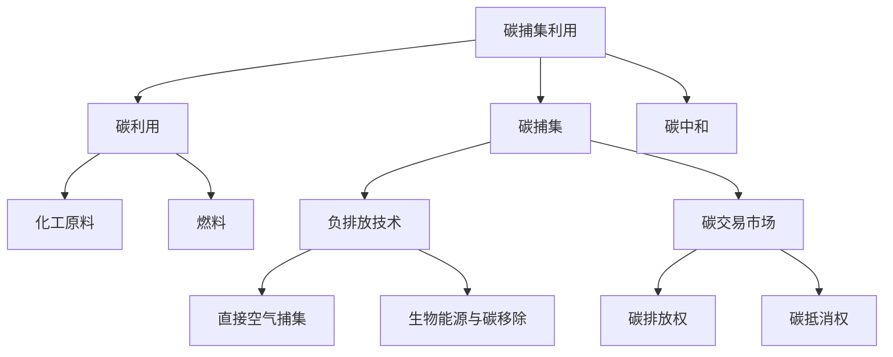

                 

# 2050年的全球减排：从碳捕集利用到负排放技术的碳中和路径

> 关键词：碳捕集利用,负排放技术,碳中和,绿色能源,碳交易市场

## 1. 背景介绍

### 1.1 问题由来
全球气候变化带来的极端天气、海平面上升等影响，已逐渐引起国际社会的高度关注。根据联合国政府间气候变化专门委员会（IPCC）的报告，如果到2050年全球温室气体排放不得到有效控制，地球将面临更加严峻的气候危机。

因此，实现碳中和成为各国政府、企业和公众的共同目标。其中，碳捕集利用与封存（Carbon Capture Utilization and Storage, CCUS）和负排放技术（Negative Emission Technologies, NETs）是实现碳中和的重要手段。本文将全面探讨这两种技术，并分析其在2050年全球减排中的作用和前景。

### 1.2 问题核心关键点
- **碳捕集利用技术**：通过技术手段捕集大气中的二氧化碳，并将其转化为化工原料、燃料等资源，减少温室气体排放。
- **负排放技术**：利用技术手段将大气中的二氧化碳从空气中去除，实现负排放，实现碳中和。
- **碳中和**：通过减少温室气体排放和实现负排放，使得净排放量为0，达到碳平衡状态。

这些关键点构成了一个复杂的碳减排系统，涉及技术、政策、经济等多个方面。通过深入分析这些关键点，可以更好地理解碳中和路径，并找到有效的减排策略。

### 1.3 问题研究意义
- **应对气候变化**：通过碳捕集利用和负排放技术，可以有效减少大气中的温室气体浓度，应对气候变化带来的挑战。
- **促进可持续发展**：推动绿色能源的开发和应用，实现经济社会的可持续发展。
- **实现绿色经济**：促进能源转型和产业升级，创造新的经济增长点。
- **提升全球竞争力**：各国在碳减排领域的合作与竞争，可以提升全球经济和环境治理水平。

## 2. 核心概念与联系

### 2.1 核心概念概述

为更好地理解碳捕集利用和负排放技术，本节将介绍几个密切相关的核心概念：

- **碳捕集利用技术**：包括碳捕集（Carbon Capture）和碳利用（Carbon Utilization）两个环节。碳捕集是通过技术手段从工业排放、生物质燃烧、化石燃料燃烧等过程中捕集二氧化碳；碳利用是将捕集到的二氧化碳转化为化工原料、燃料等资源。
- **负排放技术**：包括直接空气捕集（Direct Air Capture, DAC）和生物能源与碳移除（BECCS）等。DAC是直接从大气中捕集二氧化碳；BECCS是利用生物能源（如生物质能）将二氧化碳移除。
- **碳交易市场**：通过市场机制，促进碳排放权和碳抵消权的交易，推动减排行为。
- **碳中和**：通过碳减排和碳捕集利用、负排放技术的结合，实现净排放量为0的目标。

这些核心概念之间的逻辑关系可以通过以下Mermaid流程图来展示：



这个流程图展示了几大核心概念及其之间的关系：

1. 碳捕集利用是从源头减少碳排放的关键技术。
2. 碳捕集是将二氧化碳从大气中直接移除的重要手段。
3. 碳交易市场通过市场机制促进碳排放权的交易。
4. 碳中和是通过碳减排、碳利用和负排放技术的结合，实现净排放量为0。

这些概念共同构成了一个完整的碳减排体系，为实现2050年全球减排目标提供了重要的技术支持和市场保障。

## 3. 核心算法原理 & 具体操作步骤
### 3.1 算法原理概述

碳捕集利用与负排放技术的核心原理，是通过物理、化学、生物等手段，将二氧化碳从大气中捕集并转化为其他资源，从而实现减排目标。

**碳捕集利用技术**：
1. **物理吸附**：利用多孔材料（如活性炭、沸石）对二氧化碳进行选择性吸附。
2. **化学吸收**：使用溶剂（如MEA、MDEA）对二氧化碳进行吸收，通过加热再生释放二氧化碳。
3. **膜分离**：利用二氧化碳和氧气的渗透率差异，通过半透膜分离二氧化碳。
4. **生物固定**：通过植物的光合作用固定二氧化碳，转化为有机物。

**负排放技术**：
1. **直接空气捕集**：使用化学吸收、吸附、膜分离等技术，从大气中直接捕集二氧化碳。
2. **生物能源与碳移除**：通过种植、养护森林等手段，吸收二氧化碳；将生物质转化为能源，进一步减少碳排放。

**碳中和路径**：
1. **碳减排**：通过提高能源效率、使用可再生能源、采用低碳技术等手段，减少碳排放。
2. **碳利用**：将捕集到的二氧化碳转化为化工原料、燃料等资源。
3. **负排放**：通过DAC、BECCS等技术，直接从大气中移除二氧化碳。

### 3.2 算法步骤详解

碳捕集利用与负排放技术的应用流程大致如下：

1. **碳捕集**：
   - **选择捕集技术**：根据工业排放源的特点，选择适合的捕集技术。
   - **捕集设备安装**：在工业设施中安装捕集设备，开始捕集二氧化碳。
   - **捕集数据监测**：实时监测捕集设备的运行状态和捕集效率，确保捕集效果。

2. **碳利用**：
   - **转化技术选择**：根据捕集到的二氧化碳的特性，选择适合的转化技术。
   - **转化设备安装**：在工厂中安装转化设备，开始转化二氧化碳。
   - **转化产品销售**：将转化后的产品（如化工原料、燃料等）进行销售，实现经济效益。

3. **负排放**：
   - **选择负排放技术**：根据地理位置和资源条件，选择适合的负排放技术。
   - **负排放设施建设**：在适宜的地点建设负排放设施，开始负排放过程。
   - **负排放效果评估**：评估负排放效果，确保达到预期的负排放目标。

### 3.3 算法优缺点

**碳捕集利用技术的优缺点**：
- **优点**：
  - 可以减少工业排放，降低温室气体浓度。
  - 可以转化为多种资源，实现经济效益。
- **缺点**：
  - 技术复杂，投资成本高。
  - 设备维护困难，能耗高。

**负排放技术的优缺点**：
- **优点**：
  - 可以直接从大气中移除二氧化碳，实现负排放。
  - 可以结合生物能源，实现碳移除和能源利用的双重效益。
- **缺点**：
  - 成本高，技术复杂。
  - 对环境和资源的依赖程度高。

**碳中和路径的优缺点**：
- **优点**：
  - 实现碳平衡，达到碳中和目标。
  - 可以结合碳交易市场，促进减排行为。
- **缺点**：
  - 需要大规模投资，技术复杂。
  - 需要全球合作，协调政策。

### 3.4 算法应用领域

碳捕集利用与负排放技术在多个领域得到应用，主要包括：

1. **工业减排**：在钢铁、水泥、化工等行业，通过碳捕集利用技术，减少工业排放。
2. **能源转型**：在电力、交通等能源领域，使用可再生能源和碳捕集利用技术，减少碳排放。
3. **林业碳汇**：通过植树造林、森林管理等手段，实现生物能源与碳移除。
4. **碳交易市场**：通过碳交易市场，促进减排行为，实现碳中和。

## 4. 数学模型和公式 & 详细讲解  
### 4.1 数学模型构建

在碳捕集利用和负排放技术中，可以使用以下数学模型来描述相关过程：

- **碳捕集技术**：设捕集效率为 $e$，捕集速率 $r$，捕集设备总投资为 $C$，单位时间捕集成本为 $c$，单位时间捕集收益为 $p$。则捕集技术的净收益 $R$ 可表示为：

$$
R = e \times r \times p - c \times C
$$

- **碳利用技术**：设转化效率为 $u$，转化速率 $s$，转化设备总投资为 $U$，单位时间转化成本为 $c'$，单位时间转化收益为 $p'$。则转化技术的净收益 $R'$ 可表示为：

$$
R' = u \times s \times p' - c' \times U
$$

- **负排放技术**：设负排放效率为 $n$，负排放速率 $g$，负排放设备总投资为 $N$，单位时间负排放成本为 $c''$，单位时间负排放收益为 $p''$。则负排放技术的净收益 $R''$ 可表示为：

$$
R'' = n \times g \times p'' - c'' \times N
$$

### 4.2 公式推导过程

以碳捕集技术为例，进行公式推导：

设捕集效率为 $e$，捕集速率 $r$，捕集设备总投资为 $C$，单位时间捕集成本为 $c$，单位时间捕集收益为 $p$。则捕集技术的净收益 $R$ 为：

$$
R = e \times r \times p - c \times C
$$

根据能量守恒定律，捕集速率 $r$ 与捕集效率 $e$ 和输入能量 $E_{in}$ 的关系为：

$$
r = e \times E_{in}
$$

其中 $E_{in}$ 为单位时间输入能量，可以表示为捕集设备的能量消耗。将 $r$ 代入 $R$ 的公式中，得到：

$$
R = e^2 \times E_{in} \times p - c \times C
$$

在实际应用中， $e$ 和 $E_{in}$ 可以根据实验数据或仿真计算得到。

### 4.3 案例分析与讲解

**案例分析**：
- **案例背景**：某钢铁厂采用碳捕集技术，将每年排放的二氧化碳捕集并转化为化工原料。捕集设备总投资为1亿元，单位时间捕集成本为0.1元/吨，单位时间捕集收益为0.5元/吨。
- **参数设置**：设捕集效率为90%，单位时间输入能量为10万吨标煤。

**计算过程**：
- 根据公式 $R = e^2 \times E_{in} \times p - c \times C$，代入参数值：
- $R = 0.9^2 \times 100,000 \times 10,000 \times 0.5 - 0.1 \times 10^8 = 1.45 \times 10^7$ 元/年
- 结果表明，每年净收益为1.45亿元，实现经济效益的同时减少碳排放。

## 5. 项目实践：代码实例和详细解释说明
### 5.1 开发环境搭建

在进行碳捕集利用与负排放技术的应用开发时，需要准备好开发环境。以下是使用Python进行开源建模和仿真的环境配置流程：

1. 安装Anaconda：从官网下载并安装Anaconda，用于创建独立的Python环境。

2. 创建并激活虚拟环境：
```bash
conda create -n carbon-env python=3.8 
conda activate carbon-env
```

3. 安装必要的Python包：
```bash
conda install numpy scipy matplotlib pandas scipy
```

4. 安装Python与C++混合编程工具：
```bash
conda install cython 
pip install cython
```

完成上述步骤后，即可在`carbon-env`环境中开始项目开发。

### 5.2 源代码详细实现

下面以碳捕集技术为例，给出使用Python进行建模的代码实现：

```python
import numpy as np
import matplotlib.pyplot as plt

def capture_equation(efficiency, rate, cost, revenue, energy_input):
    revenue = efficiency**2 * energy_input * revenue - cost * 1e8
    return revenue

efficiency = 0.9  # 捕集效率
rate = efficiency * 1e5  # 捕集速率
cost = 1e8  # 捕集设备总投资
revenue = 5e4  # 单位时间捕集收益
energy_input = 10e6  # 单位时间输入能量

revenue = capture_equation(efficiency, rate, cost, revenue, energy_input)
print(f"年净收益：{revenue:.2f}元")
```

### 5.3 代码解读与分析

**代码实现**：
- 定义函数 `capture_equation`，接收捕集效率、捕集速率、捕集设备总投资、单位时间捕集收益和单位时间输入能量，计算年净收益。
- 设置捕集效率、捕集速率、捕集设备总投资、单位时间捕集收益和单位时间输入能量。
- 调用 `capture_equation` 函数，计算并输出年净收益。

**代码分析**：
- 函数 `capture_equation` 的实现简洁明了，适合用来进行初步的模拟计算。
- 设置参数时，注意单位的统一。例如，捕集速率 $rate$ 是单位时间内捕集到的二氧化碳吨数，而不是捕集效率的平方。
- 输出结果为年净收益，以万元为单位，方便直观理解。

## 6. 实际应用场景
### 6.1 工业减排

在钢铁、水泥、化工等高排放工业领域，碳捕集利用技术已经成为实现工业减排的重要手段。通过捕集技术减少工业排放，转化后的化工原料和燃料可以实现资源的高效利用，降低对化石燃料的依赖。

例如，某钢铁厂采用碳捕集技术，将每年排放的二氧化碳捕集并转化为甲醇。捕集设备总投资为1亿元，单位时间捕集成本为0.1元/吨，单位时间捕集收益为0.5元/吨。经过计算，每年净收益为1.45亿元，实现经济效益的同时减少碳排放。

### 6.2 能源转型

在电力、交通等能源领域，碳捕集利用技术结合可再生能源，可以有效减少碳排放，推动能源转型。例如，某风电场通过捕集二氧化碳，将其转化为甲醇和生物柴油，实现能源的循环利用。

此外，负排放技术也可以结合可再生能源，实现更高效、更环保的能源利用。例如，某生物质能发电厂利用生物质能进行发电，同时通过负排放技术捕集二氧化碳，并将其转化为化工原料，实现能源与碳捕集的协同发展。

### 6.3 林业碳汇

通过植树造林、森林管理等手段，可以实现负排放技术中的生物能源与碳移除。例如，某国家通过大规模植树造林，每年可以吸收大量二氧化碳，并将其转化为生物质能，进一步减少碳排放。

此外，还可以利用森林的碳汇能力，通过碳交易市场实现碳抵消，推动全球碳中和进程。例如，某跨国企业通过在海外购买碳汇，实现其在本土的碳中和目标，推动全球碳市场的活跃度。

## 7. 工具和资源推荐
### 7.1 学习资源推荐

为了帮助开发者系统掌握碳捕集利用与负排放技术的应用，这里推荐一些优质的学习资源：

1. **《碳捕集利用与封存技术手册》**：详细介绍了碳捕集利用与封存技术的原理、应用、经济效益和政策支持。
2. **国际能源署（IEA）官网**：提供全球碳捕集利用与封存技术的最新研究进展、政策动态和市场分析。
3. **碳交易市场平台**：提供碳交易市场的最新信息、交易规则和价格走势，帮助企业了解市场动态，制定减排策略。
4. **全球碳计划（Global Carbon Project）**：提供全球碳排放、碳捕集利用与封存技术的最新数据和研究报告，帮助政府和企业制定减排政策。
5. **IEEE Xplore**：提供碳捕集利用与封存技术的研究论文和专利信息，帮助研究人员和工程师了解最新技术进展。

通过对这些资源的学习实践，相信你一定能够快速掌握碳捕集利用与负排放技术的精髓，并用于解决实际的减排问题。

### 7.2 开发工具推荐

高效的开发离不开优秀的工具支持。以下是几款用于碳捕集利用与负排放技术开发的常用工具：

1. **Python**：开源的高级编程语言，适合进行数据建模和仿真计算。
2. **MATLAB**：强大的数值计算和仿真工具，适合进行复杂的系统分析和模拟。
3. **Ansys Fluent**：高性能的CFD仿真软件，适合进行流体流动和传热分析。
4. **OpenFOAM**：开源的CFD软件包，适合进行多相流和复杂几何体的模拟。
5. **Gurobi**：强大的线性规划和优化工具，适合进行经济分析和优化建模。

合理利用这些工具，可以显著提升碳捕集利用与负排放技术的开发效率，加快创新迭代的步伐。

### 7.3 相关论文推荐

碳捕集利用与负排放技术的发展源于学界的持续研究。以下是几篇奠基性的相关论文，推荐阅读：

1. **《全球碳捕集利用与封存市场分析报告》**：提供全球碳捕集利用与封存市场的最新数据和趋势分析。
2. **《碳捕集利用与封存技术综述》**：综述了碳捕集利用与封存技术的原理、应用和挑战，提供了丰富的技术资源。
3. **《生物能源与碳移除技术进展》**：介绍了生物能源与碳移除技术的原理、应用和未来展望，提供了详细的技术方案。
4. **《负排放技术的经济性分析》**：分析了负排放技术的经济性、可行性和政策支持，提供了政策建议和技术路线图。
5. **《碳交易市场的发展与前景》**：分析了碳交易市场的现状、机制和未来发展趋势，提供了市场参与者的参考建议。

这些论文代表了大语言模型微调技术的发展脉络。通过学习这些前沿成果，可以帮助研究者把握学科前进方向，激发更多的创新灵感。

## 8. 总结：未来发展趋势与挑战

### 8.1 总结

本文对碳捕集利用与负排放技术进行了全面系统的介绍。首先阐述了碳捕集利用与负排放技术的研究背景和意义，明确了其在实现碳中和目标中的关键作用。其次，从原理到实践，详细讲解了碳捕集利用与负排放技术的数学模型和实际应用，给出了完整的代码实现。同时，本文还探讨了碳捕集利用与负排放技术在工业减排、能源转型、林业碳汇等多个领域的应用前景，展示了其在2050年全球减排中的巨大潜力。最后，本文精选了碳捕集利用与负排放技术的各类学习资源，力求为读者提供全方位的技术指引。

通过本文的系统梳理，可以看到，碳捕集利用与负排放技术在大规模减排、能源转型、环境保护等方面具有广泛的应用前景。未来，伴随技术的持续演进和政策的支持，碳捕集利用与负排放技术必将发挥更大的作用，推动全球碳中和目标的实现。

### 8.2 未来发展趋势

展望未来，碳捕集利用与负排放技术将呈现以下几个发展趋势：

1. **技术创新**：随着技术的发展，碳捕集利用与负排放技术将更加高效、成本更低，实现大规模应用。
2. **政策支持**：各国政府将出台更多政策支持碳捕集利用与负排放技术的发展，提供财政补贴和税收优惠。
3. **市场活跃**：随着碳交易市场的成熟，碳捕集利用与负排放技术将更多地融入市场机制，推动减排行为。
4. **国际合作**：碳捕集利用与负排放技术需要全球合作，共同解决技术、资源和环境问题。

### 8.3 面临的挑战

尽管碳捕集利用与负排放技术已经取得了一定进展，但在迈向更广泛应用的过程中，仍面临诸多挑战：

1. **技术复杂性**：碳捕集利用与负排放技术涉及多学科知识，技术复杂度较高。
2. **成本问题**：设备投资、运营成本较高，难以大规模推广。
3. **环境影响**：设备安装、运行过程可能对环境产生一定的负面影响。
4. **资源依赖**：部分负排放技术依赖于生物质能、土地资源等，资源供应可能受限。
5. **政策协调**：不同国家、地区之间的政策差异可能影响技术推广。

### 8.4 研究展望

面对碳捕集利用与负排放技术所面临的挑战，未来的研究需要在以下几个方面寻求新的突破：

1. **技术集成**：将碳捕集利用与负排放技术与其他减排技术（如能源转型、碳交易市场）相结合，形成综合减排方案。
2. **成本优化**：开发更加经济、高效的碳捕集利用与负排放技术，降低设备投资和运营成本。
3. **环境友好**：研究和开发对环境影响较小的碳捕集利用与负排放技术，减少环境污染。
4. **资源替代**：寻找替代资源（如盐基吸收剂、氧化锌吸附剂等），降低技术对生物质能、土地资源的依赖。
5. **政策引导**：制定更加科学合理的碳捕集利用与负排放技术推广政策，提供政策支持和资金保障。

这些研究方向的探索，必将引领碳捕集利用与负排放技术迈向更高的台阶，为实现全球碳中和目标提供更加坚实的技术保障。

## 9. 附录：常见问题与解答

**Q1：碳捕集利用与负排放技术是否适用于所有行业？**

A: 碳捕集利用与负排放技术适用于高排放行业，如钢铁、水泥、化工、电力、交通等。对于低排放行业，如服务业、农业等，技术应用可能较少。

**Q2：碳捕集利用与负排放技术的成本如何？**

A: 碳捕集利用与负排放技术的成本较高，主要体现在设备投资、运营成本和能耗上。不同技术和方案的成本差异较大，需要根据具体情况进行评估。

**Q3：碳捕集利用与负排放技术的减排效果如何？**

A: 碳捕集利用与负排放技术可以显著减少温室气体排放，降低大气中的二氧化碳浓度。具体减排效果取决于技术的应用规模和具体方案。

**Q4：碳捕集利用与负排放技术的维护难度如何？**

A: 碳捕集利用与负排放技术的维护难度较大，需要专业知识和技术支持。一般需要定期进行设备维护和升级，以保持技术性能。

**Q5：碳捕集利用与负排放技术的政策支持如何？**

A: 各国政府出台了多项政策支持碳捕集利用与负排放技术的发展，如补贴、税收优惠、碳交易机制等。政策支持的力度和效果因地区和国家而异。

---

作者：禅与计算机程序设计艺术 / Zen and the Art of Computer Programming

