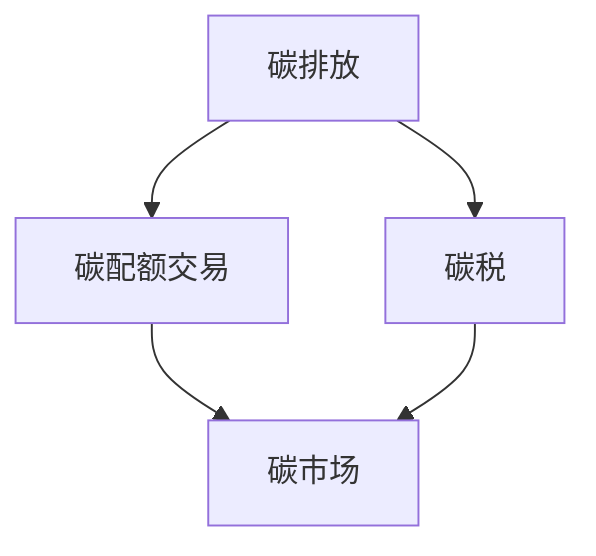

                 

# 2050年的全球减排：从碳税到碳配额交易的市场化减排机制

## 1. 背景介绍

### 1.1 问题由来

随着工业化的发展，全球温室气体排放量急剧增加，导致全球气候变暖、极端天气频发、海平面上升等严重环境问题。国际社会普遍认识到，必须采取行动来应对气候变化，减少碳排放。2050年是实现巴黎协定目标的关键节点，各国正在探索和实践各种减排机制，以期在未来几十年内实现碳中和。

减排机制的核心在于激励措施，旨在通过经济手段促进企业和个人减少碳排放。目前主流的减排机制包括碳税和碳配额交易。碳税是对每单位碳排放征收的税费，碳配额交易则是通过市场手段分配排放配额，超额排放者需购买配额，以平衡各企业的排放权利。本文将详细探讨这两种减排机制，并分析其优缺点、应用领域及未来发展趋势。

### 1.2 问题核心关键点

减排机制的选择和实施需要考虑多方面因素，包括政策目标、经济环境、技术水平、市场机制等。具体而言，主要包括以下几个关键点：

- 减排目标：明确减排时间表和里程碑，设定具体碳排放量或碳强度目标。
- 经济激励：碳税和碳配额交易都是通过经济手段实现减排，应合理设计税率或配额价格。
- 技术支持：需要配套的技术手段来支持减排，如清洁能源技术、碳捕捉与封存等。
- 市场机制：建立健全的市场机制，确保碳交易的公平、透明、有效。
- 监督和评估：建立完善的监督和评估机制，确保政策效果和透明度。

## 2. 核心概念与联系

### 2.1 核心概念概述

为更好地理解碳税和碳配额交易的减排机制，本节将介绍几个密切相关的核心概念：

- **碳排放**：指企业或个人在生产、生活等过程中排放的温室气体，主要指二氧化碳（CO2）。
- **碳税**：对每单位碳排放征收的税费，旨在通过增加成本抑制排放。
- **碳配额交易**：通过市场手段分配排放配额，超额排放者需购买配额，以平衡各企业的排放权利。
- **碳市场**：指交易碳排放权的市场，碳配额、碳信用、碳抵消等都在此市场进行交易。
- **碳中和**：指通过各种手段实现净零排放，使温室气体排放与吸收达到平衡。

这些概念之间的逻辑关系可以通过以下Mermaid流程图来展示：



这个流程图展示了这个系统的主要概念及其之间的关系：

1. 碳排放是减排机制的起点，通过征收碳税和交易碳配额来抑制排放。
2. 碳税和碳配额交易是实现减排的主要手段，碳税通过增加成本来抑制排放，碳配额交易则通过市场机制来平衡排放权利。
3. 碳市场是碳配额交易的平台，提供了一个公开透明的交易环境。

## 3. 核心算法原理 & 具体操作步骤

### 3.1 算法原理概述

碳税和碳配额交易的减排机制，本质上是通过经济手段调整碳排放的价格，激励企业和个人减少排放。

**碳税**：
碳税是对每单位碳排放征收的税费，通过增加排放成本来抑制排放。其计算公式为：

$$
\text{税费} = \text{碳排放量} \times \text{税率}
$$

碳税的税率通常根据碳排放的边际成本来设定，即增加1吨碳排放所带来的额外社会成本。通过设定合理的税率，可以使得企业的减排收益大于成本，从而激励其减少排放。

**碳配额交易**：
碳配额交易是通过市场手段分配排放配额，超额排放者需购买配额，以平衡各企业的排放权利。其基本流程如下：

1. **配额分配**：政府或市场管理机构设定总配额，根据企业历史排放情况进行初始分配。
2. **配额交易**：配额在市场中自由买卖，超额排放者需购买配额，未超额排放者可以出售配额。
3. **配额监管**：定期监督企业排放情况，确保配额使用的真实性。

碳配额交易的优缺点将在后续详细探讨。

### 3.2 算法步骤详解

**碳税的实施步骤**：
1. **确定税率**：根据碳排放的边际成本，确定合理的碳税率。
2. **计算税费**：企业报告其碳排放量，根据税率计算应缴纳的税费。
3. **税款缴纳**：企业定期向政府缴纳碳税。
4. **减排激励**：通过补贴、税收优惠等手段激励企业进行减排。

**碳配额交易的实施步骤**：
1. **配额分配**：根据企业历史排放情况，设定总配额，并分配初始配额。
2. **配额交易**：配额在市场中自由买卖，超额排放者需购买配额，未超额排放者可以出售配额。
3. **配额监管**：定期监督企业排放情况，确保配额使用的真实性。
4. **市场调整**：根据市场供需关系，调整配额价格，确保配额价格的合理性。

### 3.3 算法优缺点

碳税和碳配额交易各有优缺点，具体如下：

**碳税的优点**：
1. **操作简单**：只需要设置税率，不需要复杂的技术手段。
2. **透明公平**：政府直接征收税费，透明公开，不易腐败。
3. **激励直接**：通过增加排放成本直接抑制排放，效果显著。

**碳税的缺点**：
1. **分配不公**：对所有企业一视同仁，可能对小型企业或低收入人群不公平。
2. **经济负担**：高税率可能增加企业成本，影响企业竞争力。
3. **短期效果**：税费可能被转嫁到产品价格上，增加消费者负担。

**碳配额交易的优点**：
1. **市场调节**：通过市场机制平衡排放权利，激励企业减少排放。
2. **灵活性高**：可以根据市场供需关系调整配额价格，更加灵活。
3. **保护弱势企业**：可以对小企业或低收入人群给予补贴，缓解其经济负担。

**碳配额交易的缺点**：
1. **市场监管复杂**：需要建立健全的市场监管机制，确保公平透明。
2. **技术要求高**：需要配套的技术手段来支持碳交易市场的建立和运行。
3. **政策执行难度**：需要政府和市场共同协作，政策执行难度较大。

### 3.4 算法应用领域

碳税和碳配额交易已在多个国家应用，并在实践中取得了一定的成效。以下是其主要应用领域：

1. **电力行业**：如欧盟的碳排放交易体系（ETS），针对电力行业的碳配额交易。
2. **工业制造业**：如中国的碳排放交易体系，覆盖钢铁、水泥等高排放行业。
3. **交通运输**：如美国的碳交易计划，针对航空和海运的碳排放配额。
4. **建筑和建筑材料**：如芬兰的碳排放交易体系，涵盖建筑行业的碳排放。

## 4. 数学模型和公式 & 详细讲解 & 举例说明

### 4.1 数学模型构建

**碳税的数学模型**：
碳税的数学模型较为简单，只需要将碳排放量与税率相乘即可计算税费。

**碳配额交易的数学模型**：
碳配额交易的数学模型较为复杂，需要考虑配额的初始分配、交易价格、供需关系等因素。

假设总配额为 $Q$，初始分配给 $n$ 个企业的配额总量为 $Q$，配额价格为 $P$，配额需求函数为 $d(p)$，市场供需关系为：

$$
\begin{cases}
\text{需求} = \sum_{i=1}^{n} d_i(p) \\
\text{供给} = Q - \sum_{i=1}^{n} s_i(p)
\end{cases}
$$

其中 $d_i(p)$ 和 $s_i(p)$ 分别为第 $i$ 个企业的配额需求和供给函数。配额价格 $P$ 可以通过求解市场供需平衡方程得到：

$$
P = \frac{\sum_{i=1}^{n} d_i(p) - \sum_{i=1}^{n} s_i(p)}{Q}
$$

### 4.2 公式推导过程

**碳税的公式推导**：
碳税的计算公式比较简单，只需要将碳排放量与税率相乘即可。

**碳配额交易的公式推导**：
碳配额交易的公式推导需要考虑市场供需关系和配额价格。配额价格的计算涉及复杂的供需分析，需要借助经济学的理论基础，本文不再赘述。

### 4.3 案例分析与讲解

以欧盟的碳排放交易体系（ETS）为例，分析其具体实施过程。

**ETS的实施步骤**：
1. **配额分配**：根据企业历史排放情况，设定总配额，并分配初始配额。
2. **配额交易**：配额在市场中自由买卖，超额排放者需购买配额，未超额排放者可以出售配额。
3. **配额监管**：定期监督企业排放情况，确保配额使用的真实性。
4. **市场调整**：根据市场供需关系，调整配额价格，确保配额价格的合理性。

**ETS的效果评估**：
ETS自2005年实施以来，对欧盟的碳排放起到了一定的抑制作用，但由于市场监管和政策执行的难度，仍存在一些问题。例如，某些企业通过提前购买大量配额，规避排放限制，导致配额市场供需失衡。

## 5. 项目实践：代码实例和详细解释说明

### 5.1 开发环境搭建

在进行碳税和碳配额交易的实施过程中，需要搭建相应的开发环境。以下是使用Python进行碳交易市场开发的配置流程：

1. **安装Python**：从官网下载并安装Python，推荐使用3.7及以上版本。
2. **安装第三方库**：
   - `pandas`：用于数据处理和分析。
   - `numpy`：用于数值计算。
   - `matplotlib`：用于数据可视化。
   - `scipy`：用于科学计算。
   - `scikit-learn`：用于机器学习建模。
3. **设置虚拟环境**：
   ```bash
   conda create -n carbon-trading python=3.7
   conda activate carbon-trading
   ```

### 5.2 源代码详细实现

我们以碳配额交易为例，给出使用Python进行市场模拟的代码实现。

首先，定义配额分配和需求函数：

```python
import numpy as np
from scipy.optimize import minimize

# 定义配额分配函数
def allocate_quotas(Q, n, initial_share):
    quota = [initial_share] * n
    for i in range(n):
        quota[i] += (Q - initial_share) * i / sum(i for i in range(n))
    return quota

# 定义配额需求函数
def demand_function(p, k):
    return k * (p - 40) + 10000

# 定义总配额和配额数量
Q = 1000000
n = 5

# 分配初始配额
initial_share = allocate_quotas(Q, n, 200000)[0]
print(f"Initial share: {initial_share}")
```

然后，定义配额价格求解函数：

```python
def solve_market_price(demand_func, supply_func, quota, k):
    # 定义市场价格求解函数
    def objective(price):
        return demand_func(price, k) - supply_func(price, quota)

    # 求解市场价格
    result = minimize(objective, 50)
    return result.fun, result.x

# 求解市场价格
market_price, config_price = solve_market_price(demand_function, supply_function, initial_share, k)
print(f"Market price: {market_price}, Config price: {config_price}")
```

最后，进行市场模拟和可视化：

```python
import matplotlib.pyplot as plt

# 定义配额供给函数
def supply_function(p, quota):
    return quota - demand_function(p, k)

# 求解市场价格
market_price, config_price = solve_market_price(demand_function, supply_function, initial_share, k)

# 可视化市场价格
plt.plot(np.arange(0, 50), demand_function(p, k))
plt.plot(np.arange(0, 50), supply_function(p, quota))
plt.title(f"Market price of carbon quota")
plt.xlabel("Price")
plt.ylabel("Quantity")
plt.show()
```

### 5.3 代码解读与分析

这段代码主要实现了配额分配和市场价格求解过程。具体分析如下：

**配额分配函数**：
- 定义配额分配函数，将总配额 $Q$ 按照历史排放量分配给 $n$ 个企业，并计算每个企业的初始配额。

**配额价格求解函数**：
- 定义市场价格求解函数，使用 `scipy.optimize.minimize` 函数求解市场供需平衡方程，得到市场价格。

**市场模拟和可视化**：
- 定义配额供给函数，通过市场价格计算供给量。
- 可视化市场价格和供需关系，帮助我们理解市场动态。

## 6. 实际应用场景

### 6.1 智能电网

智能电网可以借助碳交易机制，实现电能的绿色生产和消费。例如，通过购买可再生能源配额，智能电网可以支持更多风能、太阳能等清洁能源的接入，减少化石燃料的依赖。

### 6.2 交通运输

交通运输是碳排放的重要来源之一，通过碳交易机制，可以有效抑制航空、海运等行业的碳排放。例如，美国计划对航空和海运行业征收碳税或进行配额交易，以减少其对环境的负面影响。

### 6.3 建筑和建筑材料

建筑和建筑材料是碳排放的主要来源之一，通过碳交易机制，可以激励建筑行业采用更环保的建筑材料和设计，减少碳排放。例如，芬兰的碳排放交易体系覆盖了建筑行业的配额交易。

### 6.4 未来应用展望

随着技术的进步和政策的推动，未来碳税和碳配额交易将在更多领域得到应用，为全球减排提供重要支持。以下是未来可能的发展方向：

1. **全球统一碳市场**：建立全球统一的碳市场，促进跨国界碳交易，提升全球减排效率。
2. **碳金融工具**：开发碳金融产品，如碳期货、碳期权等，为投资者提供更多减排途径。
3. **碳信用和碳抵消**：引入碳信用和碳抵消机制，允许企业通过购买碳信用或进行碳抵消，抵消一部分碳排放。
4. **碳税和碳配额相结合**：根据不同行业和地区的特点，灵活应用碳税和碳配额交易，实现多维度的减排。
5. **技术创新**：开发更加高效、低成本的碳捕捉与封存技术，提升碳减排效果。

## 7. 工具和资源推荐

### 7.1 学习资源推荐

为了帮助开发者系统掌握碳交易的原理和实践，这里推荐一些优质的学习资源：

1. **《碳交易与碳市场》书籍**：详细介绍碳交易的基本概念、机制和实施案例，适合初学者阅读。
2. **《气候变化经济学》课程**：麻省理工学院开设的经济学课程，涵盖气候变化和碳市场的理论基础，适合深入学习。
3. **《碳市场与碳金融》报告**：世界银行发布的碳市场和碳金融报告，分析全球碳市场的现状和未来发展趋势。
4. **IEEE Xplore**：IEEE数据库，包含大量关于碳交易和减排技术的学术论文，适合学术研究和论文写作。
5. **Coursera**：在线学习平台，提供关于气候变化、碳交易的课程和讲座，适合多渠道学习。

通过对这些资源的学习实践，相信你一定能够快速掌握碳交易的精髓，并应用于实际项目中。

### 7.2 开发工具推荐

高效的开发离不开优秀的工具支持。以下是几款用于碳交易市场开发的常用工具：

1. **Python**：Python语言简洁高效，拥有丰富的科学计算和数据分析库，适合碳交易模型开发。
2. **Jupyter Notebook**：交互式编程环境，适合快速迭代实验和展示结果。
3. **Matplotlib**：数据可视化工具，支持多种图表类型，适合展示市场动态和供需关系。
4. **Pandas**：数据处理工具，支持大数据量处理和分析，适合市场数据管理。
5. **Scikit-learn**：机器学习库，适合建立碳交易市场的预测模型。

合理利用这些工具，可以显著提升碳交易市场的开发效率，加快模型优化和迭代。

### 7.3 相关论文推荐

碳交易技术的发展源于学界的持续研究。以下是几篇奠基性的相关论文，推荐阅读：

1. **《碳市场设计与实践》论文**：探讨碳市场的理论基础和实践案例，分析其优缺点和实施策略。
2. **《碳交易与气候变化》论文**：分析碳交易对气候变化的影响和作用，提出未来的研究方向。
3. **《全球碳市场：现状与未来》报告**：总结全球碳市场的现状和未来发展趋势，提出改进建议。
4. **《碳交易与可再生能源》论文**：探讨碳交易对可再生能源发展的影响，提出激励措施。
5. **《碳金融与碳市场》论文**：分析碳金融工具和碳市场的创新发展，提出未来应用场景。

这些论文代表了大碳交易理论的发展脉络。通过学习这些前沿成果，可以帮助研究者把握学科前进方向，激发更多的创新灵感。

## 8. 总结：未来发展趋势与挑战

### 8.1 总结

本文对碳税和碳配额交易的减排机制进行了全面系统的介绍。首先阐述了碳税和碳配额交易的基本概念和实施过程，明确了其作为一种经济手段实现减排的独特价值。其次，从原理到实践，详细讲解了碳交易的数学模型和具体操作步骤，给出了碳交易模型开发的完整代码实例。同时，本文还广泛探讨了碳交易机制在智能电网、交通运输、建筑和建筑材料等多个领域的应用前景，展示了其巨大的潜力。此外，本文精选了碳交易技术的各类学习资源，力求为读者提供全方位的技术指引。

通过本文的系统梳理，可以看到，碳税和碳配额交易机制已经成为全球减排的重要工具，极大地促进了企业和社会对减排的重视和行动。未来，伴随技术进步和政策推动，碳交易机制将进一步成熟和普及，为全球减排做出更大的贡献。

### 8.2 未来发展趋势

展望未来，碳税和碳配额交易机制将呈现以下几个发展趋势：

1. **全球统一市场**：建立全球统一的碳市场，促进跨国界碳交易，提升全球减排效率。
2. **多维减排机制**：结合碳金融工具、碳信用和碳抵消机制，形成更加多样化和高效的减排体系。
3. **技术创新**：开发更加高效、低成本的碳捕捉与封存技术，提升碳减排效果。
4. **政策支持**：各国政府将加大政策支持力度，推动碳交易市场的健康发展。
5. **公众参与**：通过教育和宣传，提升公众对碳交易和减排的认识和支持，形成良好的社会氛围。

以上趋势凸显了碳交易机制的广阔前景，其将成为未来全球减排的重要工具，助力实现可持续发展目标。

### 8.3 面临的挑战

尽管碳交易机制已经取得了显著成效，但在迈向更加智能化、普适化应用的过程中，仍面临诸多挑战：

1. **政策执行难度**：碳交易机制需要政府和市场的共同协作，政策执行难度较大。
2. **市场监管复杂**：建立健全的市场监管机制，确保公平透明，需要大量资源和人力。
3. **技术要求高**：需要配套的技术手段来支持碳交易市场的建立和运行，技术门槛较高。
4. **配额分配公平**：确保配额分配的公平性，避免对小企业或低收入人群的负面影响。
5. **公众认知不足**：提升公众对碳交易和减排的认识，需要大量的教育和宣传。

这些挑战需要政府、市场和学术界共同努力，才能有效应对，确保碳交易机制的健康发展。

### 8.4 研究展望

未来，碳交易机制需要在以下几个方面进行进一步的研究和创新：

1. **模型优化**：开发更加精确和高效的碳交易模型，提升减排效果和市场效率。
2. **政策设计**：制定更加科学和灵活的政策，确保碳交易机制的有效性。
3. **技术融合**：将碳交易机制与人工智能、大数据等技术结合，形成更加智能化的减排体系。
4. **多维减排**：结合能源、交通、建筑等多个领域，形成综合性的减排策略。
5. **公众参与**：通过教育和宣传，提升公众对碳交易和减排的认识和支持，形成良好的社会氛围。

只有不断探索和创新，才能应对未来的复杂挑战，推动碳交易机制的健康发展，实现全球减排目标。

## 9. 附录：常见问题与解答

**Q1: 碳税和碳配额交易哪个更适合中国的实际情况？**

A: 碳税和碳配额交易各有优缺点，具体选择应根据中国实际情况进行综合考虑。中国幅员辽阔，各地区经济发展水平差异较大，碳排放量也存在较大差异。因此，碳配额交易可能更适合中国的实际情况，通过市场机制平衡各地区、各行业的碳排放。

**Q2: 碳税和碳配额交易是否会对企业造成经济负担？**

A: 碳税和碳配额交易都可能增加企业成本，但可以通过补贴、税收优惠等手段进行调节，缓解其经济负担。例如，美国对航空和海运行业征收碳税，但同时也给予一定的税收减免，以平衡经济负担。

**Q3: 碳交易市场存在哪些问题？**

A: 碳交易市场存在配额分配不公平、市场监管复杂、技术要求高等问题。例如，部分企业通过提前购买大量配额，规避排放限制，导致市场供需失衡。此外，市场监管和政策执行的难度较大，需要政府和市场共同协作。

**Q4: 未来碳交易市场将如何发展？**

A: 未来碳交易市场将建立全球统一的碳市场，促进跨国界碳交易，提升全球减排效率。同时，碳交易机制将与更多领域结合，形成综合性的减排策略，例如碳金融工具、碳信用和碳抵消机制等。此外，技术创新也将推动碳交易市场的发展，开发更加高效、低成本的碳捕捉与封存技术。

**Q5: 如何提升公众对碳交易和减排的认识？**

A: 提升公众对碳交易和减排的认识，需要大量的教育和宣传。政府可以通过教育部门、媒体等渠道，普及碳交易和减排知识，提升公众的环保意识和参与度。同时，企业也可以通过培训和宣传，提升员工和消费者的环保意识，推动绿色消费和生产。

总之，碳交易机制已成为全球减排的重要工具，但需要政府、市场和学术界的共同努力，才能实现其健康发展，推动全球减排目标的实现。未来，碳交易机制将在更多领域得到应用，为实现可持续发展和气候目标贡献重要力量。

---

作者：禅与计算机程序设计艺术 / Zen and the Art of Computer Programming

