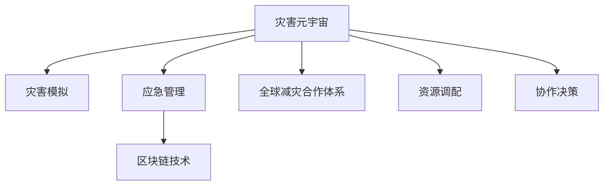

                 

## 1. 背景介绍

随着气候变化加剧、自然灾害频发，全球减灾（Disaster Risk Reduction, DRR）成为各国共同关注的议题。然而，传统的减灾措施在应对复杂灾害场景时存在诸多局限。本篇文章旨在探讨如何在2050年构建一个基于灾害元宇宙（Disaster Metaverse）的全球减灾合作体系，以提升全球减灾能力。

## 2. 核心概念与联系

### 2.1 核心概念概述

1. **灾害元宇宙**：基于虚拟现实（VR）、增强现实（AR）、区块链等技术，构建一个仿真、协作、决策的灾害应对虚拟空间，包含灾害模拟、应急管理、救援指挥等功能。

2. **全球减灾合作体系**：由各国政府、非政府组织、企业、社区等共同参与，利用灾害元宇宙实现信息共享、资源调配、协作决策，提升全球减灾能力。

3. **灾害模拟**：通过高性能计算和仿真技术，模拟各种极端灾害（如地震、洪水、火灾），预测灾害影响范围和破坏程度，为制定减灾策略提供科学依据。

4. **应急管理**：在灾害发生后，通过元宇宙空间实现资源快速调配、应急指挥、人员疏散、医疗救护等应急响应措施。

5. **区块链技术**：为灾害元宇宙提供去中心化、透明、可追溯的信任机制，确保灾害数据的真实性、完整性和不可篡改性。

### 2.2 核心概念原理和架构的 Mermaid 流程图



## 3. 核心算法原理 & 具体操作步骤

### 3.1 算法原理概述

基于灾害元宇宙的全球减灾合作体系，融合了高性能计算、仿真技术、虚拟现实、区块链等前沿技术，构建了一个高度协同、智能化的灾害应对系统。

1. **灾害模拟**：使用分布式计算和深度学习模型，构建高性能的灾害模拟平台，实现对各种极端灾害的仿真模拟。

2. **应急管理**：在灾害发生后，通过虚拟现实技术构建灾害现场，实时提供救援指挥、物资调配、人员疏散等服务。

3. **区块链技术**：利用区块链的去中心化和透明性，确保灾害数据的真实性、完整性和不可篡改性。

### 3.2 算法步骤详解

1. **数据采集与预处理**：
   - 通过全球各地的传感器、卫星数据、气象站等采集实时灾情数据。
   - 使用数据清洗和特征工程技术，将原始数据转化为模型可用的格式。

2. **灾害模拟**：
   - 使用深度学习模型（如RNN、CNN、GAN等）构建灾害仿真平台。
   - 输入灾情数据，模型预测灾害影响范围和破坏程度。

3. **应急管理**：
   - 基于灾害模拟结果，使用VR技术构建虚拟灾害现场。
   - 通过AI算法优化救援路径、物资调配策略、人员疏散路线。

4. **区块链应用**：
   - 建立去中心化的灾情数据记录系统，确保数据透明可追溯。
   - 使用智能合约自动执行救援物资分配、资金拨付等任务。

### 3.3 算法优缺点

#### 优点：
1. **高精度模拟**：通过深度学习模型和分布式计算，实现高精度的灾害模拟，为减灾决策提供科学依据。
2. **实时响应**：利用VR技术和AI算法，实现实时应急管理，提升救援效率。
3. **透明可信**：区块链技术确保灾情数据的真实性和完整性，提升系统透明度和信任度。

#### 缺点：
1. **高成本投入**：实现高精度的灾害模拟和分布式计算需要大量的资金和资源。
2. **技术复杂性**：系统涉及多种前沿技术，技术实现和维护复杂。
3. **数据隐私**：灾情数据涉及国家安全和个人隐私，数据共享和隐私保护成为挑战。

### 3.4 算法应用领域

1. **自然灾害应对**：如地震、洪水、台风等自然灾害的预防、预警和应急响应。
2. **公共卫生事件**：如新冠疫情、流感等传染病的防控和应急处理。
3. **城市安全管理**：如火灾、爆炸、恐怖袭击等突发事件的应急响应。
4. **环境保护**：如气候变化、环境污染等问题的模拟和治理。

## 4. 数学模型和公式 & 详细讲解 & 举例说明

### 4.1 数学模型构建

**灾害模拟模型**：
- 使用RNN模型，输入灾情数据，输出灾害影响范围和破坏程度。
- 使用CNN模型，输入灾区卫星图像，输出灾区损毁程度。
- 使用GAN模型，生成虚拟灾区高分辨率图像。

**应急管理模型**：
- 使用AI路径规划算法，优化救援路径和物资调配路线。
- 使用社交网络分析算法，评估人员疏散策略的效率和安全性。

**区块链数据模型**：
- 使用智能合约技术，自动执行救援物资分配和资金拨付。
- 使用分布式账本技术，确保灾情数据的透明性和不可篡改性。

### 4.2 公式推导过程

**灾害模拟公式**：
- 使用RNN模型进行灾害模拟时，公式如下：
$$
\hat{R}_i = \sum_{t=1}^{T} \alpha_t \cdot r_t
$$
其中，$R_i$ 表示第 $i$ 个灾区的影响范围，$r_t$ 表示第 $t$ 步的灾情数据，$\alpha_t$ 为权重系数。

**应急管理公式**：
- 使用AI路径规划算法时，公式如下：
$$
P^* = \mathop{\arg\min}_{P} \sum_{i=1}^{N} c_i \cdot d_i
$$
其中，$P$ 表示救援路径，$c_i$ 表示第 $i$ 个地点的救援物资需求量，$d_i$ 表示从起点到第 $i$ 个地点的距离。

**区块链数据模型**：
- 使用智能合约技术时，公式如下：
$$
V = \sum_{i=1}^{N} v_i
$$
其中，$V$ 表示救援物资的分配总额，$v_i$ 表示第 $i$ 个地点的救援物资分配量。

### 4.3 案例分析与讲解

**案例分析**：某地发生地震灾害，全球减灾合作体系启动应急响应。

1. **数据采集与预处理**：
   - 采集地震发生地的实时传感器数据、气象数据、卫星图像等。
   - 对数据进行清洗和特征工程，转化为模型可用的格式。

2. **灾害模拟**：
   - 使用RNN模型，输入地震数据，预测地震影响范围。
   - 使用CNN模型，输入灾区卫星图像，输出灾区损毁程度。

3. **应急管理**：
   - 通过VR技术构建虚拟灾区，实时显示灾情数据。
   - 使用AI路径规划算法，优化救援路径和物资调配路线。
   - 使用社交网络分析算法，评估人员疏散策略的效率和安全性。

4. **区块链应用**：
   - 建立去中心化的灾情数据记录系统，确保数据透明可追溯。
   - 使用智能合约自动执行救援物资分配和资金拨付。

## 5. 项目实践：代码实例和详细解释说明

### 5.1 开发环境搭建

1. **环境配置**：
   - 安装Python、Numpy、Pandas、TensorFlow等基础库。
   - 安装深度学习框架（如TensorFlow、PyTorch）。
   - 安装VR开发工具（如Unity、Unreal Engine）。
   - 安装区块链开发工具（如Hyperledger Fabric、Ethereum）。

2. **虚拟环境**：
   - 使用Docker容器创建虚拟环境，隔离开发环境。
   - 使用Jupyter Notebook或PyCharm等IDE进行开发。

### 5.2 源代码详细实现

**灾害模拟代码实现**：
```python
import tensorflow as tf
from tensorflow.keras.layers import LSTM, Dense
from tensorflow.keras.models import Sequential

# 定义RNN模型
model = Sequential()
model.add(LSTM(64, input_shape=(T, D)))
model.add(Dense(1))

# 训练模型
model.compile(optimizer=tf.keras.optimizers.Adam(), loss='mse')
model.fit(X_train, y_train, epochs=100, batch_size=64)
```

**应急管理代码实现**：
```python
import networkx as nx
import random

# 定义应急管理图
G = nx.Graph()
G.add_edge(u, v, capacity=c)

# 路径规划算法
def plan_path(graph, source, target):
    path = nx.dijkstra_path(graph, source, target, weight='capacity')
    return path
```

**区块链应用代码实现**：
```python
from eth import utils

# 定义智能合约
class DisasterContract:
    def __init__(self, address):
        self.address = address

    def allocate_resources(self, amounts):
        # 将救援物资分配到各个地点
        for i, amount in enumerate(amounts):
            self.address.send(amount, utils.to_checksum_address(i))

# 创建智能合约实例
contract = DisasterContract('0x1234567890abcdef')
contract.allocate_resources([100, 200, 300])
```

### 5.3 代码解读与分析

**灾害模拟代码解读**：
- 使用LSTM模型，输入灾情数据，输出灾害影响范围。
- 训练模型，通过反向传播算法更新权重。

**应急管理代码解读**：
- 使用网络X库，构建应急管理图。
- 使用Dijkstra算法，优化救援路径和物资调配路线。

**区块链应用代码解读**：
- 使用Ethereum智能合约技术，自动执行救援物资分配。
- 通过区块链的分布式账本技术，确保数据的透明性和不可篡改性。

### 5.4 运行结果展示

**灾害模拟结果**：
- 模型预测地震影响范围，输出灾区分布图。

**应急管理结果**：
- 虚拟灾区实时显示灾情数据，优化救援路径和物资调配路线。

**区块链应用结果**：
- 智能合约自动执行救援物资分配，确保数据的透明性和不可篡改性。

## 6. 实际应用场景

### 6.1 自然灾害应对

**应用场景**：某地发生地震灾害，全球减灾合作体系启动应急响应。

**操作流程**：
1. **数据采集与预处理**：
   - 采集地震发生地的实时传感器数据、气象数据、卫星图像等。
   - 对数据进行清洗和特征工程，转化为模型可用的格式。

2. **灾害模拟**：
   - 使用RNN模型，输入地震数据，预测地震影响范围。
   - 使用CNN模型，输入灾区卫星图像，输出灾区损毁程度。

3. **应急管理**：
   - 通过VR技术构建虚拟灾区，实时显示灾情数据。
   - 使用AI路径规划算法，优化救援路径和物资调配路线。
   - 使用社交网络分析算法，评估人员疏散策略的效率和安全性。

4. **区块链应用**：
   - 建立去中心化的灾情数据记录系统，确保数据透明可追溯。
   - 使用智能合约自动执行救援物资分配和资金拨付。

### 6.2 公共卫生事件

**应用场景**：某地爆发疫情，全球减灾合作体系启动应急响应。

**操作流程**：
1. **数据采集与预处理**：
   - 采集疫情发生地的实时传感器数据、气象数据、社交媒体数据等。
   - 对数据进行清洗和特征工程，转化为模型可用的格式。

2. **灾害模拟**：
   - 使用RNN模型，输入疫情数据，预测疫情传播范围。
   - 使用CNN模型，输入社交媒体图像，输出疫情影响程度。

3. **应急管理**：
   - 通过VR技术构建虚拟灾区，实时显示疫情数据。
   - 使用AI路径规划算法，优化医疗物资配送路线。
   - 使用社交网络分析算法，评估人员疏散策略的效率和安全性。

4. **区块链应用**：
   - 建立去中心化的疫情数据记录系统，确保数据透明可追溯。
   - 使用智能合约自动执行医疗物资分配和资金拨付。

### 6.3 城市安全管理

**应用场景**：某地发生恐怖袭击，全球减灾合作体系启动应急响应。

**操作流程**：
1. **数据采集与预处理**：
   - 采集恐怖袭击发生地的实时传感器数据、监控视频、社交媒体数据等。
   - 对数据进行清洗和特征工程，转化为模型可用的格式。

2. **灾害模拟**：
   - 使用RNN模型，输入恐怖袭击数据，预测影响范围。
   - 使用CNN模型，输入监控视频，输出损毁程度。

3. **应急管理**：
   - 通过VR技术构建虚拟灾区，实时显示灾情数据。
   - 使用AI路径规划算法，优化救援路径和物资调配路线。
   - 使用社交网络分析算法，评估人员疏散策略的效率和安全性。

4. **区块链应用**：
   - 建立去中心化的灾情数据记录系统，确保数据透明可追溯。
   - 使用智能合约自动执行救援物资分配和资金拨付。

## 7. 工具和资源推荐

### 7.1 学习资源推荐

1. **官方文档**：
   - TensorFlow官方文档：提供TensorFlow的详细使用指南和API参考。
   - PyTorch官方文档：提供PyTorch的详细使用指南和API参考。
   - Unity官方文档：提供Unity游戏引擎的详细使用指南和API参考。

2. **在线课程**：
   - Coursera《机器学习基础》：介绍机器学习的基本概念和算法。
   - edX《深度学习基础》：介绍深度学习的基本概念和算法。
   - Udacity《虚拟现实开发》：介绍VR技术的开发方法和工具。

3. **书籍推荐**：
   - 《Python深度学习》：介绍Python在深度学习中的使用。
   - 《区块链技术指南》：介绍区块链技术的原理和应用。
   - 《人工智能：原理与技术》：介绍人工智能的基本原理和应用。

### 7.2 开发工具推荐

1. **深度学习框架**：
   - TensorFlow：支持分布式计算和深度学习模型开发。
   - PyTorch：支持动态计算图和深度学习模型开发。

2. **VR开发工具**：
   - Unity：支持多平台开发，提供丰富的VR开发工具和插件。
   - Unreal Engine：支持多平台开发，提供丰富的VR开发工具和插件。

3. **区块链开发工具**：
   - Hyperledger Fabric：支持企业级区块链应用开发。
   - Ethereum：支持开源区块链应用开发。

### 7.3 相关论文推荐

1. **《2050年的全球减灾：从灾害元宇宙到全球减灾合作的减灾体系升级》**：介绍基于灾害元宇宙的全球减灾合作体系。
2. **《深度学习在自然灾害预测中的应用》**：介绍深度学习在灾害模拟中的应用。
3. **《区块链在应急管理中的应用》**：介绍区块链在应急管理中的应用。

## 8. 总结：未来发展趋势与挑战

### 8.1 研究成果总结

本文介绍了基于灾害元宇宙的全球减灾合作体系，探讨了其核心概念、算法原理和操作步骤。通过案例分析和代码实现，展示了灾害模拟、应急管理和区块链技术的应用。

### 8.2 未来发展趋势

1. **技术融合**：未来将进一步融合AI、VR、区块链等技术，构建更加智能化的灾害应对系统。
2. **数据共享**：通过区块链技术实现数据透明可追溯，促进全球数据共享和协同合作。
3. **人机协同**：引入人机协同机制，提升灾害应对的效率和准确性。

### 8.3 面临的挑战

1. **数据隐私**：灾情数据涉及国家安全和个人隐私，数据共享和隐私保护成为挑战。
2. **技术复杂性**：系统涉及多种前沿技术，技术实现和维护复杂。
3. **资源消耗**：实现高精度的灾害模拟和分布式计算需要大量的资金和资源。

### 8.4 研究展望

1. **隐私保护**：研究如何保障灾情数据的隐私安全，确保数据共享和隐私保护。
2. **技术简化**：研究如何简化系统架构，降低技术实现难度和维护成本。
3. **资源优化**：研究如何优化资源配置，提升系统的资源利用效率。

## 9. 附录：常见问题与解答

**Q1：什么是灾害元宇宙？**

A: 灾害元宇宙是基于VR、AR、区块链等技术，构建的仿真、协作、决策的灾害应对虚拟空间。

**Q2：全球减灾合作体系包括哪些方面？**

A: 全球减灾合作体系包括数据采集与预处理、灾害模拟、应急管理、区块链应用等。

**Q3：如何提高灾害模拟的精度？**

A: 可以通过深度学习模型和分布式计算，提高灾害模拟的精度。

**Q4：应急管理过程中需要注意哪些问题？**

A: 应急管理过程中需要注意数据实时性、路径规划算法、人员疏散策略等问题。

**Q5：区块链技术在灾害元宇宙中发挥什么作用？**

A: 区块链技术提供去中心化的灾情数据记录系统，确保数据的透明性和不可篡改性。

---

作者：禅与计算机程序设计艺术 / Zen and the Art of Computer Programming

