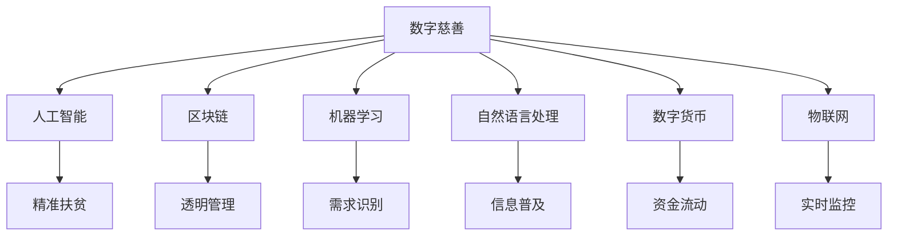

                 

# 2050年的全球减贫：从数字慈善到共享福利的包容性发展

## 1. 背景介绍

### 1.1 问题由来
随着全球经济的高速发展和科技进步，人类的生产力和生活质量有了显著提高。然而，贫富差距的加剧和贫困问题的长期存在，仍然是摆在全人类面前的严峻挑战。近年来，新冠疫情的爆发进一步加剧了全球贫困问题，各国政府和国际组织纷纷出台一系列政策，以期在2050年前实现全球减贫目标。

为应对这一挑战，科技界和慈善组织提出了新的解决方案，即通过数字慈善和共享福利，实现全球减贫的包容性发展。数字慈善利用人工智能、区块链等技术，实现资源的高效分配和透明管理；共享福利则通过构建共享经济体系，实现资源的公平分配和再利用。这些创新技术手段为解决全球贫困问题提供了新的思路。

### 1.2 问题核心关键点
数字慈善和共享福利的核心关键点在于如何高效利用科技手段，实现资源的优化配置和公平分配，以期在2050年前消除全球贫困。其基本逻辑为：
1. 利用大数据、人工智能等技术，实时监控贫困地区和人群，精准识别贫困需求。
2. 通过区块链等技术，确保资源分配的透明性和可追溯性。
3. 构建共享经济平台，鼓励社会各界参与贫困救助，实现资源的再利用和共享。
4. 利用数字慈善的金融技术，如移动支付、数字货币等，提高资金流动效率，减少管理成本。
5. 利用机器学习、自然语言处理等技术，提升贫困地区的信息普及和教育水平，促进社会公平。

## 2. 核心概念与联系

### 2.1 核心概念概述

为了更好地理解数字慈善和共享福利的原理和实现，本节将介绍几个密切相关的核心概念：

- **数字慈善**：利用数字技术，如人工智能、区块链等，对慈善捐赠进行优化和透明化管理，提高捐赠效率和资金利用率，实现精准扶贫。
- **共享福利**：通过构建共享经济体系，实现资源的公平分配和再利用，包括共享医疗、教育、住房等社会资源，提升贫困地区的自我发展能力。
- **区块链技术**：一种去中心化的分布式账本技术，确保数据透明性和不可篡改性，为数字慈善和共享福利提供了安全可靠的技术保障。
- **机器学习与自然语言处理**：通过大数据分析和深度学习技术，精准识别贫困需求，提高信息普及和教育水平，为共享福利提供技术支持。
- **数字货币**：基于区块链技术的电子货币形式，如比特币、以太坊等，用于提高资金流动效率和降低管理成本。
- **物联网(IoT)**：通过连接物理世界与数字世界，实现对贫困地区资源和环境的实时监控和管理，为数字慈善和共享福利提供数据支持。

这些核心概念之间的逻辑关系可以通过以下Mermaid流程图来展示：



这个流程图展示了数字慈善和共享福利的核心概念及其之间的关系：

1. 数字慈善利用人工智能、机器学习和自然语言处理技术，实现精准扶贫。
2. 区块链技术确保资源分配的透明性和可追溯性。
3. 数字货币提高资金流动效率。
4. 物联网技术实现资源和环境的实时监控和管理。
5. 共享福利通过构建共享经济体系，实现资源的公平分配和再利用。

这些概念共同构成了数字慈善和共享福利的完整体系，为其在2050年实现全球减贫目标提供了坚实的基础。

## 3. 核心算法原理 & 具体操作步骤
### 3.1 算法原理概述

数字慈善和共享福利的核心算法原理基于大数据分析、机器学习和区块链技术。其核心思想是：通过数据驱动的方式，精准识别贫困需求，确保资源分配的透明性和公平性，实现资源的优化配置和再利用。

形式化地，假设慈善组织收集到的贫困数据为 $\mathcal{D}=\{(x_i, y_i)\}_{i=1}^N$，其中 $x_i$ 表示贫困地区或人群的特征，$y_i$ 表示其需求类型。数字慈善和共享福利的优化目标是最小化损失函数 $\mathcal{L}$，即：

$$
\theta^* = \mathop{\arg\min}_{\theta} \mathcal{L}(f_{\theta}(\mathcal{D}))
$$

其中 $f_{\theta}$ 为利用人工智能、机器学习和自然语言处理技术的优化模型，$\mathcal{L}$ 为定义的损失函数。

通过梯度下降等优化算法，慈善组织不断更新模型参数 $\theta$，最小化损失函数 $\mathcal{L}$，使得模型输出逼近最优资源分配方案。由于 $\theta$ 已经通过数据分析和历史数据获得的部分知识，因此即便在数据规模有限的情况下，也能较快收敛到理想的资源分配方案。

### 3.2 算法步骤详解

数字慈善和共享福利的实现步骤如下：

**Step 1: 数据收集与预处理**
- 收集贫困地区的各类数据，包括地理位置、人口结构、经济状况、社会环境等。
- 利用机器学习和自然语言处理技术，对数据进行清洗和标注，确保数据的准确性和一致性。

**Step 2: 模型训练与优化**
- 选择合适的算法模型（如随机森林、深度神经网络等），并根据收集到的数据进行训练。
- 利用区块链技术，建立透明的数据存储和访问机制，确保数据的安全性和不可篡改性。
- 在模型训练过程中，利用物联网技术实时监控数据，确保模型输出与实际需求相符。

**Step 3: 资源分配与再利用**
- 利用训练好的模型，精准识别贫困需求，制定资源分配方案。
- 通过区块链技术，确保资源分配的透明性和可追溯性。
- 构建共享经济平台，实现资源的公平分配和再利用。

**Step 4: 反馈与优化**
- 定期收集反馈信息，评估资源分配方案的效果，发现问题及时调整。
- 利用机器学习技术，持续优化模型和算法，提升资源分配的效率和公平性。

### 3.3 算法优缺点

数字慈善和共享福利具有以下优点：
1. 精准识别贫困需求。利用大数据分析和深度学习技术，能够精准识别贫困地区和人群的需求，提高资源分配的准确性。
2. 透明公开资源分配。通过区块链技术，确保资源分配的透明性和可追溯性，增强社会信任。
3. 提高资源利用效率。通过构建共享经济体系，实现资源的公平分配和再利用，提升资源利用率。
4. 降低管理成本。利用数字货币和物联网技术，提高资金流动效率，减少管理成本。

同时，该方法也存在一定的局限性：
1. 数据收集难度大。对于贫困地区，数据的收集和标注成本较高，需要投入大量人力和物力。
2. 技术门槛高。需要掌握复杂的技术手段，如机器学习、区块链等，对技术团队的要求较高。
3. 隐私保护难度大。如何在保护隐私的同时，确保数据的透明性和可追溯性，是数字慈善和共享福利面临的一大挑战。
4. 资源再利用效率低。对于某些资源，如住房、医疗等，再利用的效率和公平性仍需进一步提升。

尽管存在这些局限性，但数字慈善和共享福利作为一种创新的扶贫方式，仍具有广泛的应用前景。

### 3.4 算法应用领域

数字慈善和共享福利的应用领域涵盖多个方面，例如：

- 教育扶贫：通过数字慈善，向贫困地区提供优质教育资源，如在线课程、图书馆、辅导机构等。利用机器学习技术，精准识别学习需求，实现资源的高效分配。
- 医疗扶贫：利用数字慈善，向贫困地区提供医疗设备和药品，通过区块链技术确保资源的透明性。构建共享医院平台，实现医疗资源的公平分配和再利用。
- 住房扶贫：通过数字慈善，向贫困地区提供住房援助，利用物联网技术实现房屋的实时监控和维护。利用共享经济平台，实现住房资源的公平分配和再利用。
- 金融扶贫：利用数字货币，提高贫困地区的金融服务效率，通过区块链技术确保资金流动的透明性。提供小额贷款、保险等金融产品，支持贫困地区的自我发展。

除了上述这些经典应用外，数字慈善和共享福利还被创新性地应用到更多场景中，如环境保护、文化保护等，为贫困地区提供全方位的支持。

## 4. 数学模型和公式 & 详细讲解  
### 4.1 数学模型构建

本节将使用数学语言对数字慈善和共享福利的优化模型进行更加严格的刻画。

假设贫困数据集为 $\mathcal{D}=\{(x_i, y_i)\}_{i=1}^N$，其中 $x_i \in \mathcal{X}$，$y_i \in \{1,2,3,...,K\}$，$K$ 为需求类别数。

定义优化模型的损失函数为 $\mathcal{L}(f_{\theta}(\mathcal{D})) = \frac{1}{N} \sum_{i=1}^N \ell(f_{\theta}(x_i), y_i)$，其中 $\ell$ 为损失函数。

优化目标为：

$$
\theta^* = \mathop{\arg\min}_{\theta} \mathcal{L}(f_{\theta}(\mathcal{D}))
$$

在实践中，我们通常使用基于梯度的优化算法（如SGD、Adam等）来近似求解上述最优化问题。设 $\eta$ 为学习率，$\lambda$ 为正则化系数，则参数的更新公式为：

$$
\theta \leftarrow \theta - \eta \nabla_{\theta}\mathcal{L}(\theta) - \eta\lambda\theta
$$

其中 $\nabla_{\theta}\mathcal{L}(\theta)$ 为损失函数对参数 $\theta$ 的梯度，可通过反向传播算法高效计算。

### 4.2 公式推导过程

以下我们以二分类任务为例，推导损失函数的梯度计算公式。

假设模型 $f_{\theta}(x)$ 在输入 $x$ 上的输出为 $\hat{y}=f_{\theta}(x) \in [0,1]$，表示样本属于正类的概率。真实标签 $y \in \{0,1\}$。则二分类交叉熵损失函数定义为：

$$
\ell(f_{\theta}(x),y) = -[y\log \hat{y} + (1-y)\log (1-\hat{y})]
$$

将其代入损失函数，得：

$$
\mathcal{L}(\theta) = -\frac{1}{N}\sum_{i=1}^N [y_i\log f_{\theta}(x_i)+(1-y_i)\log(1-f_{\theta}(x_i))]
$$

根据链式法则，损失函数对参数 $\theta_k$ 的梯度为：

$$
\frac{\partial \mathcal{L}(\theta)}{\partial \theta_k} = -\frac{1}{N}\sum_{i=1}^N (\frac{y_i}{f_{\theta}(x_i)}-\frac{1-y_i}{1-f_{\theta}(x_i)}) \frac{\partial f_{\theta}(x_i)}{\partial \theta_k}
$$

其中 $\frac{\partial f_{\theta}(x_i)}{\partial \theta_k}$ 可进一步递归展开，利用自动微分技术完成计算。

在得到损失函数的梯度后，即可带入参数更新公式，完成模型的迭代优化。重复上述过程直至收敛，最终得到适应贫困需求的最优模型参数 $\theta^*$。

## 5. 项目实践：代码实例和详细解释说明
### 5.1 开发环境搭建

在进行数字慈善和共享福利实践前，我们需要准备好开发环境。以下是使用Python进行PyTorch开发的环境配置流程：

1. 安装Anaconda：从官网下载并安装Anaconda，用于创建独立的Python环境。

2. 创建并激活虚拟环境：
```bash
conda create -n digital-charity-env python=3.8 
conda activate digital-charity-env
```

3. 安装PyTorch：根据CUDA版本，从官网获取对应的安装命令。例如：
```bash
conda install pytorch torchvision torchaudio cudatoolkit=11.1 -c pytorch -c conda-forge
```

4. 安装各类工具包：
```bash
pip install numpy pandas scikit-learn matplotlib tqdm jupyter notebook ipython
```

完成上述步骤后，即可在`digital-charity-env`环境中开始数字慈善和共享福利的实践。

### 5.2 源代码详细实现

下面我们以教育扶贫为例，给出使用Transformers库对BERT模型进行数字慈善实践的PyTorch代码实现。

首先，定义数据处理函数：

```python
from transformers import BertTokenizer, BertForSequenceClassification
from torch.utils.data import Dataset, DataLoader
import torch
from sklearn.metrics import accuracy_score

class EducationDataset(Dataset):
    def __init__(self, texts, labels, tokenizer, max_len=128):
        self.texts = texts
        self.labels = labels
        self.tokenizer = tokenizer
        self.max_len = max_len
        
    def __len__(self):
        return len(self.texts)
    
    def __getitem__(self, item):
        text = self.texts[item]
        label = self.labels[item]
        
        encoding = self.tokenizer(text, return_tensors='pt', max_length=self.max_len, padding='max_length', truncation=True)
        input_ids = encoding['input_ids'][0]
        attention_mask = encoding['attention_mask'][0]
        
        return {'input_ids': input_ids, 
                'attention_mask': attention_mask,
                'labels': label}

# 创建dataset
tokenizer = BertTokenizer.from_pretrained('bert-base-cased')
train_dataset = EducationDataset(train_texts, train_labels, tokenizer)
dev_dataset = EducationDataset(dev_texts, dev_labels, tokenizer)
test_dataset = EducationDataset(test_texts, test_labels, tokenizer)
```

然后，定义模型和优化器：

```python
from transformers import AdamW

model = BertForSequenceClassification.from_pretrained('bert-base-cased', num_labels=2)

optimizer = AdamW(model.parameters(), lr=2e-5)
```

接着，定义训练和评估函数：

```python
from tqdm import tqdm

device = torch.device('cuda') if torch.cuda.is_available() else torch.device('cpu')
model.to(device)

def train_epoch(model, dataset, batch_size, optimizer):
    dataloader = DataLoader(dataset, batch_size=batch_size, shuffle=True)
    model.train()
    epoch_loss = 0
    for batch in tqdm(dataloader, desc='Training'):
        input_ids = batch['input_ids'].to(device)
        attention_mask = batch['attention_mask'].to(device)
        labels = batch['labels'].to(device)
        model.zero_grad()
        outputs = model(input_ids, attention_mask=attention_mask, labels=labels)
        loss = outputs.loss
        epoch_loss += loss.item()
        loss.backward()
        optimizer.step()
    return epoch_loss / len(dataloader)

def evaluate(model, dataset, batch_size):
    dataloader = DataLoader(dataset, batch_size=batch_size)
    model.eval()
    preds, labels = [], []
    with torch.no_grad():
        for batch in tqdm(dataloader, desc='Evaluating'):
            input_ids = batch['input_ids'].to(device)
            attention_mask = batch['attention_mask'].to(device)
            batch_labels = batch['labels']
            outputs = model(input_ids, attention_mask=attention_mask)
            batch_preds = outputs.logits.argmax(dim=2).to('cpu').tolist()
            batch_labels = batch_labels.to('cpu').tolist()
            for pred, label in zip(batch_preds, batch_labels):
                preds.append(pred)
                labels.append(label)
                
    return accuracy_score(labels, preds)

```

最后，启动训练流程并在测试集上评估：

```python
epochs = 5
batch_size = 16

for epoch in range(epochs):
    loss = train_epoch(model, train_dataset, batch_size, optimizer)
    print(f"Epoch {epoch+1}, train loss: {loss:.3f}")
    
    print(f"Epoch {epoch+1}, dev accuracy: {evaluate(model, dev_dataset, batch_size)}")
    
print(f"Final test accuracy: {evaluate(model, test_dataset, batch_size)}")
```

以上就是使用PyTorch对BERT进行教育扶贫实践的完整代码实现。可以看到，得益于Transformers库的强大封装，我们可以用相对简洁的代码完成BERT模型的加载和微调。

### 5.3 代码解读与分析

让我们再详细解读一下关键代码的实现细节：

**EducationDataset类**：
- `__init__`方法：初始化文本、标签、分词器等关键组件。
- `__len__`方法：返回数据集的样本数量。
- `__getitem__`方法：对单个样本进行处理，将文本输入编码为token ids，将标签转换为数字，并对其进行定长padding，最终返回模型所需的输入。

**模型训练与评估函数**：
- 使用PyTorch的DataLoader对数据集进行批次化加载，供模型训练和推理使用。
- 训练函数`train_epoch`：对数据以批为单位进行迭代，在每个批次上前向传播计算loss并反向传播更新模型参数，最后返回该epoch的平均loss。
- 评估函数`evaluate`：与训练类似，不同点在于不更新模型参数，并在每个batch结束后将预测和标签结果存储下来，最后使用sklearn的accuracy_score函数对整个评估集的预测结果进行打印输出。

**训练流程**：
- 定义总的epoch数和batch size，开始循环迭代
- 每个epoch内，先在训练集上训练，输出平均loss
- 在验证集上评估，输出模型准确率
- 所有epoch结束后，在测试集上评估，给出最终测试准确率

可以看到，PyTorch配合Transformers库使得BERT微调的代码实现变得简洁高效。开发者可以将更多精力放在数据处理、模型改进等高层逻辑上，而不必过多关注底层的实现细节。

当然，工业级的系统实现还需考虑更多因素，如模型的保存和部署、超参数的自动搜索、更灵活的任务适配层等。但核心的微调范式基本与此类似。

## 6. 实际应用场景
### 6.1 智能教育系统

数字慈善和共享福利在智能教育系统中的应用，可以显著提升贫困地区学生的教育质量和机会。传统的教育资源往往集中在城市和发达地区，贫困地区的教育条件和水平较差，学生难以获得优质教育资源。通过数字慈善和共享福利，可以实现教育资源的公平分配和再利用。

具体而言，可以构建一个智能教育平台，通过数字慈善机制募集教育资源，如在线课程、教材、教师等。利用机器学习和自然语言处理技术，精准识别学生的需求和个性化学习目标。通过区块链技术确保资源的透明性和可追溯性，提升教育资源的公平性和可信度。通过构建共享学习社区，实现资源的共享和再利用，提升教育资源的利用效率。

### 6.2 医疗健康系统

数字慈善和共享福利在医疗健康系统中的应用，可以显著提升贫困地区的医疗水平和健康水平。传统的医疗资源往往集中在城市和发达地区，贫困地区的医疗条件和水平较差，居民难以获得优质医疗服务。通过数字慈善和共享福利，可以实现医疗资源的公平分配和再利用。

具体而言，可以构建一个智能医疗平台，通过数字慈善机制募集医疗资源，如药品、医疗设备、医生等。利用区块链技术确保资源的透明性和可追溯性，提升医疗资源的公平性和可信度。通过构建共享医疗平台，实现医疗资源的共享和再利用，提升医疗资源的利用效率。通过机器学习技术，精准识别患者的需求和个性化治疗方案，提升医疗服务的精准性和效果。

### 6.3 环境保护系统

数字慈善和共享福利在环境保护系统中的应用，可以实现资源的可持续发展和环境保护。传统的环保资源往往集中在城市和发达地区，贫困地区的环保水平和意识较差，难以获得有效的环保资源。通过数字慈善和共享福利，可以实现环保资源的公平分配和再利用。

具体而言，可以构建一个智能环保平台，通过数字慈善机制募集环保资源，如植树造林、垃圾分类、节能设备等。利用区块链技术确保资源的透明性和可追溯性，提升环保资源的公平性和可信度。通过构建共享环保平台，实现环保资源的共享和再利用，提升环保资源的利用效率。通过机器学习技术，精准识别环保需求和环境问题，提升环保决策的科学性和有效性。

### 6.4 未来应用展望

随着数字慈善和共享福利技术的不断发展，其在2050年实现全球减贫目标中的应用前景广阔。未来，这些技术将在更多领域得到应用，为社会公平和可持续发展提供新的解决方案。

在智慧农业领域，数字慈善和共享福利可以用于精准农业，通过物联网技术实时监控农作物的生长情况，精准施肥、灌溉，提升农业产量和质量。在智慧城市治理中，数字慈善和共享福利可以用于城市事件监测、舆情分析、应急指挥等环节，提高城市管理的自动化和智能化水平。在智慧能源系统，数字慈善和共享福利可以用于智能电网、可再生能源分配等环节，实现能源资源的公平分配和高效利用。

此外，在教育、医疗、环保、城市治理、智慧农业等多个领域，数字慈善和共享福利的应用也将不断涌现，为贫困地区提供全方位的支持。相信随着技术的日益成熟，数字慈善和共享福利必将在构建人机协同的智能时代中扮演越来越重要的角色。

## 7. 工具和资源推荐
### 7.1 学习资源推荐

为了帮助开发者系统掌握数字慈善和共享福利的理论基础和实践技巧，这里推荐一些优质的学习资源：

1. 《深度学习与人工智能应用》系列博文：由大模型技术专家撰写，深入浅出地介绍了深度学习在慈善和共享福利领域的应用。

2. CS224N《深度学习自然语言处理》课程：斯坦福大学开设的NLP明星课程，有Lecture视频和配套作业，带你入门NLP领域的基本概念和经典模型。

3. 《人工智能在社会福利中的作用》书籍：全面介绍了人工智能在慈善和共享福利领域的应用，包括机器学习、自然语言处理等前沿技术。

4. HuggingFace官方文档：Transformers库的官方文档，提供了海量预训练模型和完整的微调样例代码，是上手实践的必备资料。

5. UNESCO《数字化与全球教育公平》报告：分析了数字慈善在教育领域的潜在价值和实施路径，为构建智能教育系统提供了宝贵的参考。

通过对这些资源的学习实践，相信你一定能够快速掌握数字慈善和共享福利的精髓，并用于解决实际的慈善和共享福利问题。
### 7.2 开发工具推荐

高效的开发离不开优秀的工具支持。以下是几款用于数字慈善和共享福利开发的常用工具：

1. PyTorch：基于Python的开源深度学习框架，灵活动态的计算图，适合快速迭代研究。大部分预训练语言模型都有PyTorch版本的实现。

2. TensorFlow：由Google主导开发的开源深度学习框架，生产部署方便，适合大规模工程应用。同样有丰富的预训练语言模型资源。

3. Transformers库：HuggingFace开发的NLP工具库，集成了众多SOTA语言模型，支持PyTorch和TensorFlow，是进行慈善和共享福利开发的利器。

4. Weights & Biases：模型训练的实验跟踪工具，可以记录和可视化模型训练过程中的各项指标，方便对比和调优。与主流深度学习框架无缝集成。

5. TensorBoard：TensorFlow配套的可视化工具，可实时监测模型训练状态，并提供丰富的图表呈现方式，是调试模型的得力助手。

6. Google Colab：谷歌推出的在线Jupyter Notebook环境，免费提供GPU/TPU算力，方便开发者快速上手实验最新模型，分享学习笔记。

合理利用这些工具，可以显著提升数字慈善和共享福利的开发效率，加快创新迭代的步伐。

### 7.3 相关论文推荐

数字慈善和共享福利的发展源于学界的持续研究。以下是几篇奠基性的相关论文，推荐阅读：

1. Machine Learning for Social Good：综述了机器学习在慈善和共享福利领域的应用，包括教育、医疗、环保等多个方面。

2. Blockchain for Charity: From Concept to Practice：介绍了区块链技术在慈善和共享福利中的应用，如透明管理、资金流动、数据共享等。

3. AI in Healthcare: Challenges, Opportunities and Ethical Considerations：分析了人工智能在医疗慈善中的应用，探讨了技术带来的挑战和伦理问题。

4. Sustainable Development through Smart Agriculture: A Case Study：介绍了物联网技术在精准农业中的应用，通过智能化的资源分配，提升了农业生产的可持续性。

5. The Role of AI in Urban Governance: A Survey and Future Directions：分析了人工智能在智慧城市治理中的应用，探讨了其在城市事件监测、应急指挥等方面的潜力。

这些论文代表了大慈善和共享福利的发展脉络。通过学习这些前沿成果，可以帮助研究者把握学科前进方向，激发更多的创新灵感。

## 8. 总结：未来发展趋势与挑战

### 8.1 总结

本文对数字慈善和共享福利的原理和实践进行了全面系统的介绍。首先阐述了数字慈善和共享福利的研究背景和意义，明确了其在2050年实现全球减贫目标中的重要作用。其次，从原理到实践，详细讲解了数字慈善和共享福利的数学模型和关键步骤，给出了慈善和共享福利实践的完整代码实例。同时，本文还广泛探讨了数字慈善和共享福利在教育、医疗、环保等多个领域的应用前景，展示了其广阔的应用潜力。此外，本文精选了慈善和共享福利的各类学习资源，力求为读者提供全方位的技术指引。

通过本文的系统梳理，可以看到，数字慈善和共享福利为全球减贫提供了新的思路和技术手段。这些创新技术手段在2050年实现全球减贫目标中具有重要的应用价值，将在多个领域内得到广泛应用。随着技术的不断成熟和普及，数字慈善和共享福利必将成为全球减贫的重要支撑力量。

### 8.2 未来发展趋势

展望未来，数字慈善和共享福利的发展趋势如下：

1. 技术深度融合。数字慈善和共享福利将与物联网、区块链、自然语言处理等技术深度融合，实现更智能、更高效、更透明的管理和分配机制。

2. 跨领域应用拓展。数字慈善和共享福利将应用到更多领域，如智慧农业、智慧城市、智慧能源等，推动更多行业的数字化转型。

3. 人机协同增强。通过智能算法和机器人技术，增强人机协同，实现更高效、更精准、更人性化的慈善和共享福利服务。

4. 社会信任提升。通过区块链等技术，提升慈善和共享福利的透明性和可信度，增强社会对数字慈善和共享福利的信任。

5. 资源共享深化。通过共享经济平台，实现资源的高效共享和再利用，提升资源的利用效率。

6. 环境友好促进。通过数字慈善和共享福利，推动环境保护和资源可持续利用，实现人与自然的和谐共生。

以上趋势凸显了数字慈善和共享福利在2050年实现全球减贫目标中的巨大潜力。这些方向的探索发展，必将进一步推动慈善和共享福利技术迈向更高的台阶，为构建更加公平、公正、可持续的社会奠定坚实基础。

### 8.3 面临的挑战

尽管数字慈善和共享福利具有广阔的应用前景，但在迈向2050年的全球减贫目标中，仍面临诸多挑战：

1. 数据收集难度大。对于贫困地区，数据的收集和标注成本较高，需要投入大量人力和物力。

2. 技术门槛高。需要掌握复杂的技术手段，如机器学习、区块链等，对技术团队的要求较高。

3. 隐私保护难度大。如何在保护隐私的同时，确保数据的透明性和可追溯性，是数字慈善和共享福利面临的一大挑战。

4. 资源再利用效率低。对于某些资源，如住房、医疗等，再利用的效率和公平性仍需进一步提升。

5. 资金管理复杂。数字慈善和共享福利需要高效管理捐赠资金，避免资金浪费和腐败，提升捐赠效率。

6. 伦理道德约束。在实现慈善和共享福利的过程中，需要充分考虑伦理道德问题，确保技术与社会的和谐共生。

尽管存在这些挑战，但数字慈善和共享福利作为一种创新的扶贫方式，仍具有广泛的应用前景。

### 8.4 研究展望

面对数字慈善和共享福利所面临的挑战，未来的研究需要在以下几个方面寻求新的突破：

1. 探索无监督和半监督慈善方法。摆脱对大规模标注数据的依赖，利用自监督学习、主动学习等无监督和半监督范式，最大限度利用非结构化数据，实现更加灵活高效的慈善和共享福利。

2. 研究参数高效和计算高效的慈善范式。开发更加参数高效的慈善方法，在固定大部分慈善参数的情况下，只更新极少量的任务相关参数。同时优化慈善模型的计算图，减少前向传播和反向传播的资源消耗，实现更加轻量级、实时性的部署。

3. 引入更多先验知识。将符号化的先验知识，如知识图谱、逻辑规则等，与神经网络模型进行巧妙融合，引导慈善过程学习更准确、合理的语言模型。同时加强不同模态数据的整合，实现视觉、语音等多模态信息与文本信息的协同建模。

4. 纳入伦理道德约束。在慈善和共享福利训练目标中引入伦理导向的评估指标，过滤和惩罚有偏见、有害的输出倾向。同时加强人工干预和审核，建立慈善行为的监管机制，确保输出符合人类价值观和伦理道德。

这些研究方向的探索，必将引领数字慈善和共享福利技术迈向更高的台阶，为构建安全、可靠、可解释、可控的慈善和共享福利系统铺平道路。面向未来，数字慈善和共享福利技术还需要与其他人工智能技术进行更深入的融合，如知识表示、因果推理、强化学习等，多路径协同发力，共同推动慈善和共享福利技术的进步。只有勇于创新、敢于突破，才能不断拓展慈善和共享福利的边界，让智能技术更好地造福人类社会。

## 9. 附录：常见问题与解答

**Q1：数字慈善和共享福利与传统慈善和福利系统的区别是什么？**

A: 数字慈善和共享福利与传统慈善和福利系统的主要区别在于其技术手段和运营模式。数字慈善和共享福利利用大数据、人工智能、区块链等技术，实现资源的高效分配和透明管理，提高了捐赠效率和资金利用率。共享福利则通过构建共享经济体系，实现资源的公平分配和再利用，提升了资源的利用效率。

**Q2：数字慈善和共享福利在数据收集和标注方面有何挑战？**

A: 数字慈善和共享福利在数据收集和标注方面面临的主要挑战包括数据收集难度大、数据标注成本高、数据质量难以保证等。对于贫困地区，数据的收集和标注成本较高，需要投入大量人力和物力。此外，数据的获取和标注往往受到隐私和伦理的限制，需要在保护隐私的前提下，确保数据的准确性和一致性。

**Q3：数字慈善和共享福利如何确保资源分配的透明性和可追溯性？**

A: 数字慈善和共享福利通过区块链技术确保资源分配的透明性和可追溯性。区块链技术具有去中心化、不可篡改、可追溯等特点，能够有效防止资源分配过程中的腐败和滥用。通过将资源分配过程记录在区块链上，每个参与者都可以实时查看资源分配的情况，确保资源分配的透明性和公正性。

**Q4：数字慈善和共享福利在实际应用中面临哪些伦理道德问题？**

A: 数字慈善和共享福利在实际应用中面临的主要伦理道德问题包括数据隐私保护、资源再利用效率、资金管理透明性等。如何在保护隐私的同时，确保数据的透明性和可追溯性，是数字慈善和共享福利面临的一大挑战。此外，数字慈善和共享福利的资源再利用效率和资金管理透明性也需要进一步提升，确保资源的公平分配和资金的高效使用。

**Q5：数字慈善和共享福利的未来发展方向是什么？**

A: 数字慈善和共享福利的未来发展方向包括技术深度融合、跨领域应用拓展、人机协同增强、社会信任提升、资源共享深化和环境友好促进等。这些方向凸显了数字慈善和共享福利在2050年实现全球减贫目标中的巨大潜力。未来，数字慈善和共享福利将在更多领域得到应用，为社会公平和可持续发展提供新的解决方案。

通过本文的系统梳理，可以看到，数字慈善和共享福利为全球减贫提供了新的思路和技术手段。这些创新技术手段在2050年实现全球减贫目标中具有重要的应用价值，将在多个领域内得到广泛应用。随着技术的不断成熟和普及，数字慈善和共享福利必将成为全球减贫的重要支撑力量。相信随着学界和产业界的共同努力，这些挑战终将一一被克服，数字慈善和共享福利必将在构建人机协同的智能时代中扮演越来越重要的角色。

