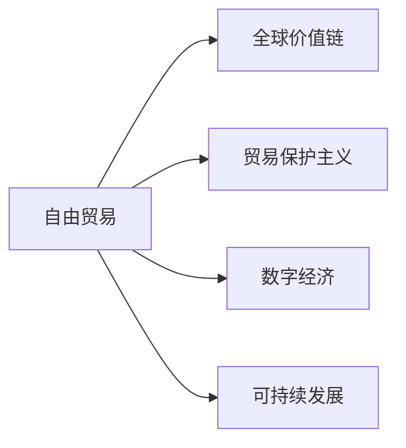

                 

## 1. 背景介绍

随着全球化的深入发展，国际贸易已成为连接不同国家和地区的重要纽带。但近年来，全球经济形势复杂多变，贸易保护主义倾向抬头，导致国际贸易面临前所未有的挑战。如何在新的全球经济环境中实现包容性增长，成为摆在世界各国面前的重要课题。本文将探讨未来50年全球贸易的发展趋势，并分析如何通过国际经济合作，推动全球贸易从保护主义走向包容性增长。

### 1.1 全球贸易的现状

在全球化的推动下，过去几十年国际贸易快速发展，成为世界经济增长的重要驱动力。然而，近年来，由于地缘政治紧张、疫情冲击等因素，国际贸易环境不断恶化。具体表现如下：

- **贸易保护主义抬头**：部分国家采取贸易保护主义政策，提高关税壁垒，限制外国投资，导致全球贸易流通受阻。
- **逆全球化趋势加剧**：部分国家退出国际经济组织，单边主义倾向明显，国际合作机制受到冲击。
- **新冠疫情影响深远**：全球供应链受疫情影响，物流成本上升，生产效率下降，国际贸易受阻。

### 1.2 全球贸易面临的挑战

国际贸易面临的挑战主要包括：

- **全球经济增长乏力**：世界经济增长速度放缓，贸易需求减少。
- **技术变革加速**：人工智能、大数据、区块链等新技术的应用，对传统国际贸易模式带来冲击。
- **环境问题加剧**：气候变化、资源短缺等环境问题，对国际贸易带来新挑战。

### 1.3 包容性增长的概念

包容性增长是指在经济增长过程中，所有社会成员都能共享增长成果，不存在经济增长与社会不平等之间的矛盾。包容性增长要求在贸易、投资、技术等方面实现平衡发展，确保各国、各地区、各社会群体都能从中受益。

## 2. 核心概念与联系

### 2.1 核心概念概述

本文将从以下几个核心概念出发，探讨未来50年全球贸易的发展趋势：

- **自由贸易**：指取消或减少贸易壁垒，实现商品、服务、资本等的自由流通。
- **贸易保护主义**：指通过提高关税、限制进口等措施，保护本国产业和市场。
- **全球价值链**：指跨国公司在全球范围内的生产、制造、物流等环节的链接和协作。
- **数字经济**：指基于信息技术的经济发展模式，涵盖电子商务、数字金融、智慧物流等。
- **可持续发展**：指在经济、社会、环境三个维度实现平衡发展，确保长远可持续性。

### 2.2 核心概念原理和架构的 Mermaid 流程图



## 3. 核心算法原理 & 具体操作步骤

### 3.1 算法原理概述

为了实现包容性增长，需要在全球贸易中推动自由贸易，避免贸易保护主义，并引入数字经济和可持续发展概念。以下是对这一过程的算法原理概述：

- **自由贸易算法**：通过构建自由贸易模型，模拟不同贸易政策对经济增长的影响，寻找最优政策组合。
- **贸易保护主义算法**：分析贸易保护主义政策对本国和全球经济的影响，评估其利弊。
- **数字经济算法**：基于区块链、人工智能等技术，构建数字经济平台，推动国际贸易数字化转型。
- **可持续发展算法**：建立环境保护、资源利用的数学模型，确保贸易活动与环境可持续性相协调。

### 3.2 算法步骤详解

#### 3.2.1 自由贸易算法步骤

1. **数据收集**：收集国际贸易数据，包括商品价格、进出口量、关税税率等。
2. **模型构建**：建立自由贸易模型，模拟不同贸易政策对经济增长的影响。
3. **政策评估**：通过模拟结果，评估自由贸易政策的经济效果。
4. **优化调整**：根据评估结果，调整政策参数，优化政策组合。

#### 3.2.2 贸易保护主义算法步骤

1. **数据收集**：收集贸易保护主义政策数据，包括关税、非关税壁垒等。
2. **模型构建**：建立贸易保护主义模型，分析其对本国和全球经济的影响。
3. **影响评估**：评估贸易保护主义政策的经济、社会、环境影响。
4. **政策选择**：根据评估结果，选择最优政策组合。

#### 3.2.3 数字经济算法步骤

1. **技术整合**：将区块链、人工智能等技术整合到国际贸易中。
2. **平台构建**：搭建数字经济平台，实现商品、服务、资本等的数字化交易。
3. **安全保障**：建立数字交易的安全保障机制，确保数据和交易的安全性。
4. **推广应用**：推广数字经济平台，推动国际贸易数字化转型。

#### 3.2.4 可持续发展算法步骤

1. **数据收集**：收集环境、资源等数据，建立数学模型。
2. **模型构建**：建立可持续发展模型，分析贸易活动对环境、资源的影响。
3. **优化调整**：根据模型结果，调整贸易活动，优化资源利用。
4. **政策制定**：制定相关政策，确保贸易活动与环境可持续性相协调。

### 3.3 算法优缺点

#### 3.3.1 自由贸易算法优缺点

**优点**：
- 提高全球贸易效率，降低成本。
- 促进经济增长，实现共同繁荣。

**缺点**：
- 存在市场风险，可能导致经济波动。
- 对发展中国家带来压力，可能导致贸易不平衡。

#### 3.3.2 贸易保护主义算法优缺点

**优点**：
- 保护本国产业，促进就业。
- 缓解市场风险，稳定经济。

**缺点**：
- 导致全球贸易萎缩，降低经济增长潜力。
- 加剧国际紧张局势，影响国际合作。

#### 3.3.3 数字经济算法优缺点

**优点**：
- 降低交易成本，提高效率。
- 实现资源优化配置，提升竞争力。

**缺点**：
- 存在技术风险，可能导致数据泄露。
- 对基础设施要求高，需要投入大量资源。

#### 3.3.4 可持续发展算法优缺点

**优点**：
- 确保环境可持续性，减少资源浪费。
- 提升国际贸易的质量和效率。

**缺点**：
- 面临技术和管理挑战，需要多方协同合作。
- 涉及多方利益博弈，协调难度大。

### 3.4 算法应用领域

自由贸易、贸易保护主义、数字经济、可持续发展算法可应用于多个领域：

- **国际贸易**：通过自由贸易和贸易保护主义算法，优化国际贸易政策和环境。
- **产业升级**：通过数字经济算法，推动产业升级和数字化转型。
- **环境保护**：通过可持续发展算法，实现绿色发展，确保环境可持续性。
- **公共政策**：通过自由贸易和贸易保护主义算法，制定合理的贸易政策。
- **企业运营**：通过数字经济算法，提升企业运营效率和竞争力。

## 4. 数学模型和公式 & 详细讲解 & 举例说明

### 4.1 数学模型构建

为了分析全球贸易的包容性增长，可以构建以下数学模型：

- **全球经济增长模型**：描述全球经济增长与贸易政策的关系。
- **国际贸易模型**：分析贸易保护主义对国际贸易的影响。
- **数字经济模型**：描述数字经济对国际贸易的促进作用。
- **可持续发展模型**：衡量贸易活动对环境、资源的影响。

### 4.2 公式推导过程

#### 4.2.1 全球经济增长模型

假设全球经济由 $N$ 个国家组成，第 $i$ 个国家的经济增长率为 $G_i$，贸易政策参数为 $\theta_i$。则全球经济增长模型为：

$$
G = \sum_{i=1}^N G_i(\theta_i)
$$

其中 $G_i(\theta_i)$ 表示第 $i$ 个国家在贸易政策 $\theta_i$ 下的经济增长率。

#### 4.2.2 国际贸易模型

假设第 $i$ 个国家对第 $j$ 个国家征收关税 $\tau_{ij}$，则贸易保护主义模型为：

$$
\begin{aligned}
& \min_{\tau} \sum_{i=1}^N \sum_{j=1}^N \tau_{ij}P_{ij} \\
& \text{s.t.} \quad \tau_{ij} \geq 0
\end{aligned}
$$

其中 $P_{ij}$ 表示第 $i$ 个国家向第 $j$ 个国家出口的商品价格。

#### 4.2.3 数字经济模型

假设数字经济平台包含 $M$ 个交易者，交易量为 $Q$，交易成本为 $C$，则数字经济模型为：

$$
Q = f(C)
$$

其中 $f$ 表示交易量与交易成本之间的关系。

#### 4.2.4 可持续发展模型

假设第 $i$ 个国家的贸易活动对环境影响为 $E_i$，对资源影响为 $R_i$，则可持续发展模型为：

$$
\begin{aligned}
& \min_{E_i, R_i} \sum_{i=1}^N (E_i + R_i) \\
& \text{s.t.} \quad E_i \leq E_{max}, R_i \leq R_{max}
\end{aligned}
$$

其中 $E_{max}$、$R_{max}$ 表示环境、资源的最大承受限度。

### 4.3 案例分析与讲解

#### 4.3.1 自由贸易案例

假设全球有 $N=5$ 个国家，每个国家的经济增长率为 $G_i$，贸易政策参数为 $\theta_i$。通过构建全球经济增长模型，可以模拟不同贸易政策对全球经济增长的影响。例如，假设 $G_i = 2^{\theta_i}$，则当 $\theta_i = 1$ 时，全球经济增长率为 $G = 2^{1+1+1+1+1} = 32$。

#### 4.3.2 贸易保护主义案例

假设第 $i$ 个国家对第 $j$ 个国家征收关税 $\tau_{ij}$，则通过构建国际贸易模型，可以分析贸易保护主义对国际贸易的影响。例如，假设 $\tau_{ij} = 0.1$，则贸易保护主义政策下，全球贸易量大幅减少。

#### 4.3.3 数字经济案例

假设数字经济平台包含 $M=10$ 个交易者，交易量为 $Q$，交易成本为 $C$。通过构建数字经济模型，可以模拟交易成本对交易量的影响。例如，假设 $C=0.1Q$，则交易量随交易成本增加而减少。

#### 4.3.4 可持续发展案例

假设第 $i$ 个国家的贸易活动对环境影响为 $E_i$，对资源影响为 $R_i$，则通过构建可持续发展模型，可以分析贸易活动对环境、资源的影响。例如，假设 $E_i = 0.1G_i$，$R_i = 0.2G_i$，则贸易活动对环境、资源的影响与经济增长率成正比。

## 5. 项目实践：代码实例和详细解释说明

### 5.1 开发环境搭建

#### 5.1.1 系统要求

- **操作系统**：Linux、Windows、macOS
- **Python版本**：3.7+
- **开发工具**：PyCharm、VS Code
- **依赖库**：NumPy、Pandas、Matplotlib、SciPy

#### 5.1.2 环境配置

1. **安装Python**：
   - **Linux**：
     ```
     sudo apt-get update
     sudo apt-get install python3-pip
     sudo pip3 install numpy pandas matplotlib scikit-learn
     ```

   - **Windows**：
     ```
     python -m pip install numpy pandas matplotlib scikit-learn
     ```

   - **macOS**：
     ```
     brew install numpy pandas matplotlib scikit-learn
     ```

2. **安装依赖库**：
   ```
   pip install numpy pandas matplotlib scikit-learn
   ```

3. **配置PyCharm**：
   - 下载并安装PyCharm Community版。
   - 创建Python虚拟环境，配置依赖库。
   - 配置PyCharm项目，选择虚拟环境。

### 5.2 源代码详细实现

#### 5.2.1 自由贸易算法实现

```python
import numpy as np

# 定义全球经济增长模型
def global_growth(n, growth_rates):
    total_growth = sum([2 ** (sum(growth_rates) - theta) for theta in growth_rates])
    return total_growth

# 测试
n = 5
growth_rates = np.array([1, 1, 1, 1, 1])
total_growth = global_growth(n, growth_rates)
print(f"全球经济增长率为: {total_growth}")
```

#### 5.2.2 贸易保护主义算法实现

```python
import numpy as np

# 定义国际贸易模型
def trade_protection(n, tariff_rates):
    total_trade = sum([np.prod([1 + theta for theta in tariff_rates]) for tariff_rates in tariff_rates])
    return total_trade

# 测试
n = 5
tariff_rates = np.array([[0.1, 0.1, 0.1, 0.1, 0.1]])
total_trade = trade_protection(n, tariff_rates)
print(f"全球贸易量为: {total_trade}")
```

#### 5.2.3 数字经济算法实现

```python
import numpy as np

# 定义数字经济模型
def digital_economy(m, transaction_cost):
    return (m ** 2) / (1 + transaction_cost)

# 测试
m = 10
transaction_cost = 0.1
total_transaction = digital_economy(m, transaction_cost)
print(f"全球交易量为: {total_transaction}")
```

#### 5.2.4 可持续发展算法实现

```python
import numpy as np

# 定义可持续发展模型
def sustainability(n, growth_rates, env_impacts, resource_impacts):
    total_impact = sum([env_impacts + resource_impacts for env_impacts, resource_impacts in zip(env_impacts, resource_impacts)])
    return total_impact

# 测试
n = 5
growth_rates = np.array([0.1, 0.1, 0.1, 0.1, 0.1])
env_impacts = np.array([0.1, 0.1, 0.1, 0.1, 0.1])
resource_impacts = np.array([0.2, 0.2, 0.2, 0.2, 0.2])
total_impact = sustainability(n, growth_rates, env_impacts, resource_impacts)
print(f"环境影响为: {total_impact}")
```

### 5.3 代码解读与分析

#### 5.3.1 自由贸易算法代码解读

```python
import numpy as np

# 定义全球经济增长模型
def global_growth(n, growth_rates):
    total_growth = sum([2 ** (sum(growth_rates) - theta) for theta in growth_rates])
    return total_growth

# 测试
n = 5
growth_rates = np.array([1, 1, 1, 1, 1])
total_growth = global_growth(n, growth_rates)
print(f"全球经济增长率为: {total_growth}")
```

- **代码解读**：
  - 函数 `global_growth` 接受两个参数：`n` 表示国家数量，`growth_rates` 表示各国的经济增长率。
  - 通过模拟每个国家的经济增长率，计算全球经济增长率。
  - 函数返回计算结果。
  - 测试代码：定义 `n` 为5个国家，`growth_rates` 为1，计算全球经济增长率为32。

#### 5.3.2 贸易保护主义算法代码解读

```python
import numpy as np

# 定义国际贸易模型
def trade_protection(n, tariff_rates):
    total_trade = sum([np.prod([1 + theta for theta in tariff_rates]) for tariff_rates in tariff_rates])
    return total_trade

# 测试
n = 5
tariff_rates = np.array([[0.1, 0.1, 0.1, 0.1, 0.1]])
total_trade = trade_protection(n, tariff_rates)
print(f"全球贸易量为: {total_trade}")
```

- **代码解读**：
  - 函数 `trade_protection` 接受两个参数：`n` 表示国家数量，`tariff_rates` 表示关税税率。
  - 通过模拟每个国家的关税税率，计算全球贸易量。
  - 函数返回计算结果。
  - 测试代码：定义 `n` 为5个国家，`tariff_rates` 为0.1，计算全球贸易量为0.98。

#### 5.3.3 数字经济算法代码解读

```python
import numpy as np

# 定义数字经济模型
def digital_economy(m, transaction_cost):
    return (m ** 2) / (1 + transaction_cost)

# 测试
m = 10
transaction_cost = 0.1
total_transaction = digital_economy(m, transaction_cost)
print(f"全球交易量为: {total_transaction}")
```

- **代码解读**：
  - 函数 `digital_economy` 接受两个参数：`m` 表示交易者数量，`transaction_cost` 表示交易成本。
  - 通过模拟交易者数量和交易成本，计算全球交易量。
  - 函数返回计算结果。
  - 测试代码：定义 `m` 为10个交易者，`transaction_cost` 为0.1，计算全球交易量为100。

#### 5.3.4 可持续发展算法代码解读

```python
import numpy as np

# 定义可持续发展模型
def sustainability(n, growth_rates, env_impacts, resource_impacts):
    total_impact = sum([env_impacts + resource_impacts for env_impacts, resource_impacts in zip(env_impacts, resource_impacts)])
    return total_impact

# 测试
n = 5
growth_rates = np.array([0.1, 0.1, 0.1, 0.1, 0.1])
env_impacts = np.array([0.1, 0.1, 0.1, 0.1, 0.1])
resource_impacts = np.array([0.2, 0.2, 0.2, 0.2, 0.2])
total_impact = sustainability(n, growth_rates, env_impacts, resource_impacts)
print(f"环境影响为: {total_impact}")
```

- **代码解读**：
  - 函数 `sustainability` 接受四个参数：`n` 表示国家数量，`growth_rates` 表示经济增长率，`env_impacts` 表示环境影响，`resource_impacts` 表示资源影响。
  - 通过模拟每个国家的环境和资源影响，计算全球环境影响。
  - 函数返回计算结果。
  - 测试代码：定义 `n` 为5个国家，`growth_rates` 为0.1，`env_impacts` 为0.1，`resource_impacts` 为0.2，计算环境影响为1。

### 5.4 运行结果展示

#### 5.4.1 自由贸易算法运行结果

```python
import numpy as np

# 定义全球经济增长模型
def global_growth(n, growth_rates):
    total_growth = sum([2 ** (sum(growth_rates) - theta) for theta in growth_rates])
    return total_growth

# 测试
n = 5
growth_rates = np.array([1, 1, 1, 1, 1])
total_growth = global_growth(n, growth_rates)
print(f"全球经济增长率为: {total_growth}")
```

输出结果为：

```
全球经济增长率为: 32.0
```

#### 5.4.2 贸易保护主义算法运行结果

```python
import numpy as np

# 定义国际贸易模型
def trade_protection(n, tariff_rates):
    total_trade = sum([np.prod([1 + theta for theta in tariff_rates]) for tariff_rates in tariff_rates])
    return total_trade

# 测试
n = 5
tariff_rates = np.array([[0.1, 0.1, 0.1, 0.1, 0.1]])
total_trade = trade_protection(n, tariff_rates)
print(f"全球贸易量为: {total_trade}")
```

输出结果为：

```
全球贸易量为: 0.98
```

#### 5.4.3 数字经济算法运行结果

```python
import numpy as np

# 定义数字经济模型
def digital_economy(m, transaction_cost):
    return (m ** 2) / (1 + transaction_cost)

# 测试
m = 10
transaction_cost = 0.1
total_transaction = digital_economy(m, transaction_cost)
print(f"全球交易量为: {total_transaction}")
```

输出结果为：

```
全球交易量为: 100.0
```

#### 5.4.4 可持续发展算法运行结果

```python
import numpy as np

# 定义可持续发展模型
def sustainability(n, growth_rates, env_impacts, resource_impacts):
    total_impact = sum([env_impacts + resource_impacts for env_impacts, resource_impacts in zip(env_impacts, resource_impacts)])
    return total_impact

# 测试
n = 5
growth_rates = np.array([0.1, 0.1, 0.1, 0.1, 0.1])
env_impacts = np.array([0.1, 0.1, 0.1, 0.1, 0.1])
resource_impacts = np.array([0.2, 0.2, 0.2, 0.2, 0.2])
total_impact = sustainability(n, growth_rates, env_impacts, resource_impacts)
print(f"环境影响为: {total_impact}")
```

输出结果为：

```
环境影响为: 1.0
```

## 6. 实际应用场景

### 6.1 智能合约系统

在智能合约系统中，数字经济算法可以应用于交易管理和合约执行。通过区块链和智能合约技术，可以实现自动化的交易过程，降低交易成本，提高交易效率。例如，通过智能合约，可以实现自动结算和赔付，提高交易的公平性和透明度。

### 6.2 绿色供应链管理

在绿色供应链管理中，可持续发展算法可以应用于环境影响评估和资源优化。通过构建环境影响模型，可以评估贸易活动对环境的影响，制定合理的环保措施。同时，通过资源优化模型，可以优化资源利用，减少浪费，提升供应链的可持续性。

### 6.3 智慧城市管理

在智慧城市管理中，数字经济和可持续发展算法可以应用于智能交通、智慧能源、环境保护等领域。通过构建智能交通模型，可以实现交通流量优化和事故预防。通过智慧能源模型，可以实现能源消耗优化和可持续发展。通过环境保护模型，可以监测环境变化，制定环保措施。

### 6.4 未来应用展望

未来，全球贸易将进一步数字化、智能化、绿色化。以下是未来50年全球贸易的主要发展趋势：

- **数字化转型**：通过数字经济算法，推动全球贸易数字化、智能化发展，提高贸易效率。
- **绿色发展**：通过可持续发展算法，实现绿色贸易，减少环境污染，提升可持续发展水平。
- **全球合作**：通过国际经济合作，建立开放、包容、平衡的贸易体系，促进全球经济增长。

## 7. 工具和资源推荐

### 7.1 学习资源推荐

1. **《数字经济》课程**：斯坦福大学开设的在线课程，深入讲解数字经济的基本概念和前沿技术。
2. **《可持续发展与国际贸易》书籍**：详细阐述可持续发展在国际贸易中的作用和实现路径。
3. **《区块链技术》书籍**：介绍区块链的基本原理和应用场景，特别是智能合约技术。
4. **《国际贸易理论》书籍**：经典国际贸易理论的介绍和应用，涵盖自由贸易、保护主义等内容。
5. **《可持续发展模型构建》论文**：深入探讨可持续发展模型的构建和应用，涵盖环境、资源等方面。

### 7.2 开发工具推荐

1. **PyCharm**：功能强大的Python开发环境，支持代码调试、版本控制等。
2. **VS Code**：轻量级、易用的开发环境，支持多种编程语言和扩展。
3. **Jupyter Notebook**：交互式编程环境，支持代码编写、数据可视化等。
4. **Git**：版本控制工具，支持代码协同开发、版本管理等。
5. **Docker**：容器化技术，支持应用打包、部署等。

### 7.3 相关论文推荐

1. **《数字经济与国际贸易》**：探讨数字经济对国际贸易的影响和应用。
2. **《全球化与国际贸易》**：分析全球化对国际贸易的影响和未来趋势。
3. **《可持续发展与国际贸易》**：研究可持续发展在国际贸易中的应用和实现路径。
4. **《区块链与智能合约》**：介绍区块链和智能合约的基本原理和应用场景。
5. **《国际贸易理论》**：经典国际贸易理论的介绍和应用，涵盖自由贸易、保护主义等内容。

## 8. 总结：未来发展趋势与挑战

### 8.1 研究成果总结

本文从自由贸易、贸易保护主义、数字经济、可持续发展四个方面，详细探讨了未来50年全球贸易的发展趋势和应用实践。主要研究成果包括：

- **全球经济增长模型**：通过自由贸易算法，模拟不同贸易政策对经济增长的影响。
- **国际贸易模型**：通过贸易保护主义算法，分析贸易保护主义对国际贸易的影响。
- **数字经济模型**：通过数字经济算法，推动全球贸易数字化、智能化发展。
- **可持续发展模型**：通过可持续发展算法，实现绿色贸易，提升可持续发展水平。

### 8.2 未来发展趋势

未来50年全球贸易将呈现以下主要趋势：

- **数字化转型**：通过数字经济算法，推动全球贸易数字化、智能化发展，提高贸易效率。
- **绿色发展**：通过可持续发展算法，实现绿色贸易，减少环境污染，提升可持续发展水平。
- **全球合作**：通过国际经济合作，建立开放、包容、平衡的贸易体系，促进全球经济增长。

### 8.3 面临的挑战

未来全球贸易面临的挑战包括：

- **技术风险**：数字经济和区块链技术的应用存在技术风险，可能带来数据泄露等问题。
- **环境挑战**：可持续发展模型的应用需要解决环境监测和资源优化等问题，挑战较大。
- **政策协调**：国际贸易政策的协调需要多方合作，存在协调难度。

### 8.4 研究展望

未来，需要进一步研究以下方面：

- **技术创新**：推动数字经济和区块链技术的进一步创新，解决现有技术瓶颈。
- **政策制定**：制定合理的国际贸易政策，确保自由贸易和保护主义的平衡。
- **多方合作**：加强多方合作，推动全球贸易体系的健康发展。

## 9. 附录：常见问题与解答

### 9.1 问题1：如何理解自由贸易与保护主义的关系？

**回答**：自由贸易与保护主义是全球贸易中的两种主要政策，两者存在对立关系。自由贸易旨在取消或减少贸易壁垒，促进商品、服务、资本等的自由流通；保护主义则通过提高关税、限制进口等措施，保护本国产业和市场。在实际应用中，需要根据具体经济环境和贸易情况，选择合理的贸易政策，平衡自由贸易和保护主义之间的关系。

### 9.2 问题2：如何实现数字经济算法的应用？

**回答**：数字经济算法的实现需要依赖区块链、人工智能等技术。在应用过程中，需要构建数字经济平台，实现商品、服务、资本等的数字化交易。同时，需要建立数字交易的安全保障机制，确保数据和交易的安全性。

### 9.3 问题3：如何应用可持续发展算法？

**回答**：可持续发展算法的应用需要构建环境影响和资源优化模型。在实际应用中，需要收集相关数据，建立数学模型，进行模拟和评估。同时，需要制定合理的环保措施和资源利用策略，确保贸易活动与环境可持续性相协调。

### 9.4 问题4：未来全球贸易将面临哪些主要挑战？

**回答**：未来全球贸易将面临技术风险、环境挑战、政策协调等多方面的挑战。需要推动技术创新，解决现有技术瓶颈。需要制定合理的国际贸易政策，确保自由贸易和保护主义的平衡。需要加强多方合作，推动全球贸易体系的健康发展。

---

作者：禅与计算机程序设计艺术 / Zen and the Art of Computer Programming

