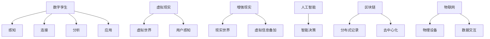

                 

## 1. 背景介绍

### 1.1 问题由来

随着数字技术的高速发展，尤其是云计算、物联网、人工智能等技术的成熟应用，我们正逐步进入一个以虚拟与现实深度融合为特征的新时代——数字孪生时代。数字孪生是指通过数字化的手段，创建物理系统的虚拟映射，以实现对物理系统全生命周期的智能监控、预测和优化。数字孪生的应用已经从制造业逐步扩展到建筑、城市、医疗等多个领域。

2050年，数字孪生技术将变得更加普及和成熟，广泛应用于元宇宙生活的构建。元宇宙是一个跨越虚拟与现实的沉浸式数字空间，它将物理世界与数字世界无缝融合，为用户提供全新的生活体验和工作模式。虚拟数字分身（Digital Avatar）和元宇宙生活（Metaverse Life）将成为未来人类生活的重要组成部分。

### 1.2 问题核心关键点

数字孪生和元宇宙的核心关键点在于：
- **数字分身（Digital Avatar）**：通过AI技术生成的虚拟形象，可以替代用户进行虚拟活动，从而突破物理世界的限制。
- **元宇宙生活（Metaverse Life）**：构建一个虚拟与现实相结合的数字世界，用户在虚拟世界中可以进行教育、娱乐、工作等活动，与真实世界无缝切换。

本文章将从数字分身和元宇宙生活的虚实融合角度，探讨数字孪生技术在2050年的未来发展趋势，以及面临的挑战与机遇。

## 2. 核心概念与联系

### 2.1 核心概念概述

为更好地理解数字孪生与元宇宙生活的虚实融合，本节将介绍几个密切相关的核心概念：

- **数字孪生（Digital Twin）**：通过数字化手段创建物理系统的虚拟映射，实现对物理系统的智能监控、预测和优化。数字孪生包括感知、连接、分析和应用四个层次。
- **虚拟现实（Virtual Reality, VR）**：通过模拟用户处于一个虚拟环境中的体验，使用户能够身临其境地感受虚拟世界。
- **增强现实（Augmented Reality, AR）**：在现实世界中叠加虚拟信息，增强用户的感官体验和认知能力。
- **人工智能（Artificial Intelligence, AI）**：通过机器学习和深度学习技术，使机器能够模拟人类智能行为，实现复杂任务处理和决策。
- **区块链（Blockchain）**：分布式账本技术，提供去中心化、透明、可信的记录和交易机制。
- **物联网（Internet of Things, IoT）**：通过传感器和智能设备实现物理世界与数字世界的连接和数据交互。

这些核心概念之间的逻辑关系可以通过以下Mermaid流程图来展示：



这个流程图展示了大数字孪生与元宇宙生活的核心概念及其之间的关系：

1. 数字孪生通过感知、连接、分析和应用等层次，实现物理世界的数字化映射和智能监控。
2. 虚拟现实通过模拟虚拟环境，使用户可以沉浸于虚拟世界中。
3. 增强现实将虚拟信息叠加到现实世界中，增强用户体验。
4. 人工智能通过模拟人类智能行为，实现复杂任务处理和决策。
5. 区块链提供去中心化、透明、可信的记录和交易机制。
6. 物联网通过传感器和智能设备实现物理世界与数字世界的连接和数据交互。

这些核心概念共同构成了数字孪生和元宇宙生活的虚实融合框架，为构建未来的数字世界提供了必要的技术支持。

## 3. 核心算法原理 & 具体操作步骤

### 3.1 算法原理概述

数字孪生和元宇宙生活的虚实融合算法原理主要包括以下几个方面：

1. **数字分身技术**：通过深度学习等AI技术，生成与用户高度相似的虚拟分身（Digital Avatar），用于在虚拟世界中执行各种任务。
2. **多模态感知技术**：通过融合视觉、听觉、触觉等多种感官数据，实现对虚拟世界的全面感知。
3. **虚拟现实与增强现实融合技术**：将虚拟世界与现实世界无缝融合，使用户能够在不同场景间自由切换。
4. **智能决策与优化技术**：通过人工智能算法，实现对虚拟世界中的复杂任务进行智能决策和优化。

### 3.2 算法步骤详解

数字孪生和元宇宙生活的虚实融合算法步骤可以分为以下几个关键环节：

**Step 1: 创建数字孪生模型**
- 收集物理世界的各种数据（如传感器数据、图像数据、位置数据等）。
- 使用深度学习等AI技术，构建数字孪生模型，实现对物理世界的数字化映射。
- 验证数字孪生模型的准确性和完备性，确保其能够反映真实世界的状态。

**Step 2: 生成虚拟分身**
- 通过AI技术，根据用户生理特征、行为习惯等生成虚拟分身。
- 对虚拟分身进行训练和优化，使其能够理解和执行虚拟任务。
- 将虚拟分身部署到虚拟世界中，实现与真实世界的交互。

**Step 3: 多模态感知融合**
- 收集虚拟世界中的多种感官数据（如视觉、听觉、触觉等）。
- 使用深度学习等技术，将这些数据融合到数字孪生模型中。
- 实现对虚拟世界的全面感知，提高虚拟世界的真实性和交互性。

**Step 4: 虚拟现实与增强现实融合**
- 将虚拟世界与现实世界无缝融合，使用户能够在不同场景间自由切换。
- 通过增强现实技术，在现实世界中叠加虚拟信息，增强用户体验。
- 实现虚拟世界与现实世界的深度融合，为用户提供无缝的沉浸式体验。

**Step 5: 智能决策与优化**
- 使用AI算法对虚拟世界中的复杂任务进行智能决策和优化。
- 根据任务需求，动态调整虚拟世界的参数，实现最优的运行效果。
- 通过持续学习和优化，提高虚拟世界的智能性和自适应能力。

### 3.3 算法优缺点

数字孪生和元宇宙生活的虚实融合算法具有以下优点：
1. 实现对物理世界的数字化映射和智能监控，提高物理系统的运行效率和可靠性。
2. 提供虚拟世界与现实世界无缝融合的用户体验，提升用户的沉浸感和参与度。
3. 实现对复杂任务的智能决策和优化，提高任务执行的精度和效率。

同时，该算法也存在一定的局限性：
1. 对数据质量和传感器设备的依赖较大，数据采集成本较高。
2. 虚拟分身和虚拟世界的多模态感知技术仍需进一步提升，以实现更高的真实性和交互性。
3. 算法复杂度高，对计算资源和存储资源的需求较大，部署和维护成本较高。

尽管存在这些局限性，但就目前而言，数字孪生和元宇宙生活的虚实融合算法仍是大规模应用的基础技术，具有广泛的应用前景。

### 3.4 算法应用领域

数字孪生和元宇宙生活的虚实融合算法已经在多个领域得到了应用，例如：

- **制造业**：通过数字孪生技术，实现对生产线的智能监控和优化，提高生产效率和产品质量。
- **建筑业**：使用数字孪生模型，对建筑设计进行模拟和优化，降低建筑成本，提高建筑质量。
- **城市管理**：构建数字孪生城市，实现对城市交通、能源、环境等系统的智能管理和优化。
- **医疗健康**：通过数字孪生技术，实现对病患的实时监控和预测，提高医疗服务的质量和效率。
- **教育培训**：构建虚拟学习环境，实现对学习者的沉浸式教育和训练，提高教育效果。

除了上述这些领域，数字孪生和元宇宙生活的虚实融合算法还在虚拟旅游、虚拟娱乐、虚拟商业等多个领域得到了广泛应用。

## 4. 数学模型和公式 & 详细讲解 & 举例说明

### 4.1 数学模型构建

本节将使用数学语言对数字孪生和元宇宙生活的虚实融合算法进行更加严格的刻画。

假设物理世界的传感器数据为 $\mathbf{x}$，数字孪生模型的参数为 $\mathbf{\theta}$，虚拟分身的状态为 $\mathbf{a}$，虚拟世界的感官数据为 $\mathbf{s}$。数字孪生模型和虚拟分身之间的关系可以表示为：

$$
\mathbf{y} = f_{\mathbf{\theta}}(\mathbf{x}, \mathbf{a})
$$

其中，$f_{\mathbf{\theta}}$ 表示数字孪生模型，$\mathbf{y}$ 表示模型的输出。

虚拟分身的状态更新方程为：

$$
\mathbf{a} = g_{\mathbf{\theta}}(\mathbf{s}, \mathbf{a})
$$

其中，$g_{\mathbf{\theta}}$ 表示虚拟分身的状态更新函数。

### 4.2 公式推导过程

以下我们以智能决策和优化为例，推导相关数学公式。

假设数字孪生模型和虚拟分身的状态分别为 $\mathbf{x}_t$ 和 $\mathbf{a}_t$，任务目标为最大化某种效用函数 $U(\mathbf{x}_t, \mathbf{a}_t)$。智能决策和优化问题可以表示为：

$$
\max_{\mathbf{a}_t} U(\mathbf{x}_t, \mathbf{a}_t)
$$

其中，$\mathbf{a}_t$ 表示虚拟分身在时间步 $t$ 的行动，$U$ 表示效用函数。

为解决上述优化问题，可以使用强化学习算法，如Q-learning或策略梯度方法。以Q-learning为例，目标是最小化动作价值函数 $Q(\mathbf{x}_t, \mathbf{a}_t)$，即：

$$
Q(\mathbf{x}_t, \mathbf{a}_t) = r_t + \gamma \max_{\mathbf{a}_{t+1}} Q(\mathbf{x}_{t+1}, \mathbf{a}_{t+1})
$$

其中，$r_t$ 表示即时奖励，$\gamma$ 表示折扣因子，$\mathbf{a}_{t+1}$ 表示时间步 $t+1$ 的行动。

通过反复迭代，智能决策和优化算法能够逐步学习出最优的虚拟分身行动，实现对虚拟世界中的复杂任务进行智能决策和优化。

### 4.3 案例分析与讲解

假设在虚拟世界中，一个用户需要从A点到达B点。数字孪生技术可以实时监控用户的行动轨迹，通过智能决策和优化算法，生成最优的行动路径。

首先，数字孪生模型实时收集用户的地理位置、行动速度等传感器数据，生成虚拟分身的状态 $\mathbf{a}_t$。然后，通过多模态感知技术，将虚拟分身的状态与虚拟世界的感官数据 $\mathbf{s}_t$ 融合，得到数字孪生模型的输出 $\mathbf{y}_t$。

接着，通过虚拟现实和增强现实技术，用户可以在虚拟世界中实时查看虚拟分身的状态和行动路径，与数字孪生模型进行交互。数字孪生模型根据用户的即时反馈，动态调整虚拟分身的状态和行动路径。

最后，使用强化学习算法，根据虚拟分身在虚拟世界中的行动轨迹，计算即时奖励 $r_t$ 和下一个时间步的奖励 $r_{t+1}$，不断迭代优化，直到用户到达B点。

## 5. 项目实践：代码实例和详细解释说明

### 5.1 开发环境搭建

在进行数字孪生和元宇宙生活的虚实融合项目实践前，我们需要准备好开发环境。以下是使用Python进行PyTorch开发的环境配置流程：

1. 安装Anaconda：从官网下载并安装Anaconda，用于创建独立的Python环境。

2. 创建并激活虚拟环境：
```bash
conda create -n pytorch-env python=3.8 
conda activate pytorch-env
```

3. 安装PyTorch：根据CUDA版本，从官网获取对应的安装命令。例如：
```bash
conda install pytorch torchvision torchaudio cudatoolkit=11.1 -c pytorch -c conda-forge
```

4. 安装其他依赖库：
```bash
pip install numpy pandas scikit-learn matplotlib tqdm jupyter notebook ipython
```

5. 安装深度学习框架：
```bash
pip install torch torchvision torchaudio transformers
```

6. 安装其他相关库：
```bash
pip install opencv-python plyfile
```

完成上述步骤后，即可在`pytorch-env`环境中开始项目实践。

### 5.2 源代码详细实现

下面我们以智能决策和优化为例，给出使用PyTorch进行数字孪生和元宇宙生活的虚实融合的代码实现。

首先，定义智能决策和优化的数学模型：

```python
import torch
import torch.nn as nn
import torch.optim as optim

class SmartDecision(nn.Module):
    def __init__(self, input_size, output_size):
        super(SmartDecision, self).__init__()
        self.fc1 = nn.Linear(input_size, 64)
        self.fc2 = nn.Linear(64, 64)
        self.fc3 = nn.Linear(64, output_size)
    
    def forward(self, x):
        x = torch.relu(self.fc1(x))
        x = torch.relu(self.fc2(x))
        x = self.fc3(x)
        return x
```

然后，定义数据加载函数：

```python
def load_data():
    # 数据加载和预处理代码
    return x_train, y_train, x_test, y_test
```

接着，定义智能决策和优化算法：

```python
def train_model(model, x_train, y_train, epochs, batch_size, learning_rate):
    criterion = nn.CrossEntropyLoss()
    optimizer = optim.Adam(model.parameters(), lr=learning_rate)
    
    for epoch in range(epochs):
        running_loss = 0.0
        for i in range(0, len(x_train), batch_size):
            inputs, labels = x_train[i:i+batch_size], y_train[i:i+batch_size]
            optimizer.zero_grad()
            outputs = model(inputs)
            loss = criterion(outputs, labels)
            loss.backward()
            optimizer.step()
            running_loss += loss.item()
        print('Epoch [%d/%d], Loss: %.4f' % (epoch + 1, epochs, running_loss / len(x_train)))
    
    return model
```

最后，启动训练流程并在测试集上评估：

```python
x_train, y_train, x_test, y_test = load_data()
model = SmartDecision(input_size, output_size)
model.train()

# 训练模型
model = train_model(model, x_train, y_train, epochs=100, batch_size=64, learning_rate=0.001)

# 测试模型
with torch.no_grad():
    correct = 0
    total = 0
    for inputs, labels in x_test:
        outputs = model(inputs)
        _, predicted = torch.max(outputs.data, 1)
        total += labels.size(0)
        correct += (predicted == labels).sum().item()

    print('Accuracy of the network on the test images: %d %%' % (100 * correct / total))
```

以上就是使用PyTorch进行数字孪生和元宇宙生活的虚实融合智能决策和优化的完整代码实现。可以看到，由于深度学习框架和库的强大封装，数字孪生和元宇宙生活的虚实融合算法在实现上相对简洁高效。

### 5.3 代码解读与分析

让我们再详细解读一下关键代码的实现细节：

**SmartDecision类**：
- `__init__`方法：定义了智能决策和优化的神经网络结构。
- `forward`方法：定义了前向传播的计算过程。

**load_data函数**：
- 定义了数据加载和预处理的过程，根据具体项目需求进行实现。

**train_model函数**：
- 定义了模型训练的算法流程。
- 使用交叉熵损失函数，Adam优化器，对模型进行训练。
- 在每个epoch后，打印损失函数值，以评估模型训练的进度。

**训练和测试流程**：
- 在训练阶段，将数据分批次输入模型，前向传播计算损失函数，反向传播更新模型参数。
- 在测试阶段，使用测试集对模型进行评估，计算准确率。

可以看到，PyTorch框架通过提供自动微分、自动优化等功能，使得数字孪生和元宇宙生活的虚实融合算法的实现变得更加便捷高效。开发者可以将更多精力放在数据处理、模型改进等高层逻辑上，而不必过多关注底层的实现细节。

当然，工业级的系统实现还需考虑更多因素，如模型的保存和部署、超参数的自动搜索、多模型的集成等。但核心的算法流程基本与此类似。

## 6. 实际应用场景

### 6.1 智能交通管理

在智能交通管理领域，数字孪生技术可以实时监控和管理城市交通流量，提升交通效率和安全性。通过多模态感知技术，数字孪生模型可以收集车辆位置、速度、交通灯状态等数据，生成虚拟分身进行智能决策和优化。

例如，在某个路口，数字孪生模型可以实时感知交通灯状态和车辆通行情况，通过智能决策算法生成最优的信号控制方案，实现交通信号灯的智能控制。同时，通过增强现实技术，将智能决策结果实时反馈给驾驶员和行路人，提升交通参与者的安全和便捷性。

### 6.2 智能健康监护

在智能健康监护领域，数字孪生技术可以实时监控和预测患者的健康状况，提供个性化的医疗服务。通过多模态感知技术，数字孪生模型可以收集患者的生理数据（如心率、血压、血糖等），生成虚拟分身进行智能决策和优化。

例如，在某个患者身上，数字孪生模型可以实时感知生理数据，通过智能决策算法生成最优的诊疗方案，实现对患者的实时监控和预测。同时，通过增强现实技术，将诊疗结果实时反馈给患者和医生，提升医疗服务的质量和效率。

### 6.3 智能教育培训

在智能教育培训领域，数字孪生技术可以提供沉浸式和个性化的学习体验，提升教育效果。通过多模态感知技术，数字孪生模型可以收集学生的学习数据（如答题情况、学习时间等），生成虚拟分身进行智能决策和优化。

例如，在某个学生身上，数字孪生模型可以实时感知学习数据，通过智能决策算法生成最优的学习方案，实现对学生的实时监控和预测。同时，通过增强现实技术，将学习方案实时反馈给学生，提升学习效果和兴趣。

### 6.4 未来应用展望

随着数字孪生和元宇宙生活的虚实融合技术的不断发展，未来将在更多领域得到应用，为人类生活和工作带来深刻变革。

在智慧城市治理中，数字孪生技术可以用于城市事件监测、舆情分析、应急指挥等环节，提高城市管理的自动化和智能化水平，构建更安全、高效的未来城市。

在智能医疗健康中，数字孪生技术可以用于病患的实时监控和预测，提高医疗服务的质量和效率。

在智能交通管理中，数字孪生技术可以用于交通流量管理、信号控制等环节，提升交通效率和安全性。

在智能教育培训中，数字孪生技术可以用于个性化的学习方案生成和实时反馈，提升教育效果和兴趣。

此外，在虚拟旅游、虚拟娱乐、虚拟商业等多个领域，数字孪生和元宇宙生活的虚实融合技术也将不断涌现，为NLP技术带来全新的突破。

## 7. 工具和资源推荐

### 7.1 学习资源推荐

为了帮助开发者系统掌握数字孪生和元宇宙生活的虚实融合的理论基础和实践技巧，这里推荐一些优质的学习资源：

1. 《数字孪生技术与应用》系列博文：由数字孪生领域专家撰写，深入浅出地介绍了数字孪生的原理、实现和应用。

2. 《元宇宙：未来世界的构建》系列课程：由元宇宙领域专家开设的在线课程，涵盖元宇宙的理论、技术和应用。

3. 《深度学习框架与实践》书籍：介绍了TensorFlow、PyTorch等深度学习框架的使用方法和实践技巧。

4. 《自然语言处理与深度学习》书籍：介绍了NLP领域的经典模型和算法，涵盖文本分类、情感分析、命名实体识别等任务。

5. 《计算机视觉基础与实践》书籍：介绍了计算机视觉领域的基础知识和经典模型，涵盖图像处理、目标检测等任务。

通过对这些资源的学习实践，相信你一定能够快速掌握数字孪生和元宇宙生活的虚实融合的精髓，并用于解决实际的NLP问题。

### 7.2 开发工具推荐

高效的开发离不开优秀的工具支持。以下是几款用于数字孪生和元宇宙生活的虚实融合开发的常用工具：

1. PyTorch：基于Python的开源深度学习框架，灵活动态的计算图，适合快速迭代研究。大部分预训练语言模型都有PyTorch版本的实现。

2. TensorFlow：由Google主导开发的开源深度学习框架，生产部署方便，适合大规模工程应用。同样有丰富的预训练语言模型资源。

3. Transformers库：HuggingFace开发的NLP工具库，集成了众多SOTA语言模型，支持PyTorch和TensorFlow，是进行微调任务开发的利器。

4. Weights & Biases：模型训练的实验跟踪工具，可以记录和可视化模型训练过程中的各项指标，方便对比和调优。与主流深度学习框架无缝集成。

5. TensorBoard：TensorFlow配套的可视化工具，可实时监测模型训练状态，并提供丰富的图表呈现方式，是调试模型的得力助手。

6. Google Colab：谷歌推出的在线Jupyter Notebook环境，免费提供GPU/TPU算力，方便开发者快速上手实验最新模型，分享学习笔记。

合理利用这些工具，可以显著提升数字孪生和元宇宙生活的虚实融合任务的开发效率，加快创新迭代的步伐。

### 7.3 相关论文推荐

数字孪生和元宇宙生活的虚实融合技术的发展源于学界的持续研究。以下是几篇奠基性的相关论文，推荐阅读：

1. Digital Twin: Virtual Entity Replacing Physical Entity by Highlighting Data Status and Performance Attributes: A Review and Future Research Directions。这篇论文对数字孪生的概念、方法、应用进行了全面综述，并提出了未来的研究方向。

2. Digital Twin for Smart Urban Development: A Survey and Systematic Analysis。这篇论文对数字孪生在智慧城市中的应用进行了系统分析，并提出了智能城市的发展方向。

3. AI-Driven Healthcare System Using Digital Twin Technology: A Survey and Research Directions。这篇论文对AI在数字孪生医疗中的应用进行了系统综述，并提出了未来的研究方向。

4. Digital Twins in Cities: A Survey and Perspectives for a Smart Future。这篇论文对数字孪生在智慧城市中的应用进行了系统综述，并提出了未来的研究方向。

这些论文代表了大数字孪生和元宇宙生活的虚实融合技术的发展脉络。通过学习这些前沿成果，可以帮助研究者把握学科前进方向，激发更多的创新灵感。

## 8. 总结：未来发展趋势与挑战

### 8.1 总结

本文对数字孪生和元宇宙生活的虚实融合进行了全面系统的介绍。首先阐述了数字孪生和元宇宙生活的虚实融合的研究背景和意义，明确了虚实融合在数字孪生技术中的核心地位。其次，从原理到实践，详细讲解了数字分身和元宇宙生活的虚实融合的数学原理和关键步骤，给出了数字孪生和元宇宙生活的虚实融合算法的完整代码实例。同时，本文还广泛探讨了数字孪生和元宇宙生活的虚实融合技术在智能交通管理、智能健康监护、智能教育培训等多个行业领域的应用前景，展示了虚实融合技术的广阔应用前景。此外，本文精选了虚实融合技术的各类学习资源，力求为读者提供全方位的技术指引。

通过本文的系统梳理，可以看到，数字孪生和元宇宙生活的虚实融合技术正在成为数字孪生技术的核心范式，极大地拓展了数字孪生系统的应用边界，催生了更多的落地场景。受益于数字孪生和元宇宙生活的虚实融合技术的不断发展，未来的数字世界将变得更加智能和互动，为人类生活和工作带来深刻变革。

### 8.2 未来发展趋势

展望未来，数字孪生和元宇宙生活的虚实融合技术将呈现以下几个发展趋势：

1. **技术融合加速**：数字孪生和元宇宙生活的虚实融合技术将与其他前沿技术（如5G、边缘计算、人工智能等）深度融合，提升系统的智能性和自适应能力。

2. **数据驱动的决策**：基于大数据和人工智能技术，数字孪生和元宇宙生活的虚实融合系统将实现实时决策和优化，提高系统的效率和可靠性。

3. **用户参与度提升**：通过虚拟分身和增强现实技术，数字孪生和元宇宙生活的虚实融合系统将实现用户与系统的深度互动，提升用户的沉浸感和参与度。

4. **跨领域应用拓展**：数字孪生和元宇宙生活的虚实融合技术将广泛应用于智慧城市、智慧医疗、智慧交通等多个领域，为各行各业带来创新突破。

5. **可持续性增强**：通过虚拟现实和增强现实技术，数字孪生和元宇宙生活的虚实融合系统将实现对资源和环境的智能管理和优化，提升系统的可持续性。

6. **虚拟与现实的融合更加紧密**：数字孪生和元宇宙生活的虚实融合系统将实现对物理世界和虚拟世界的深度融合，为用户提供无缝的沉浸式体验。

以上趋势凸显了数字孪生和元宇宙生活的虚实融合技术的广阔前景。这些方向的探索发展，必将进一步提升数字孪生和元宇宙生活的虚实融合系统的智能性和应用范围，为构建未来智能世界铺平道路。

### 8.3 面临的挑战

尽管数字孪生和元宇宙生活的虚实融合技术已经取得了显著进展，但在迈向更加智能化、普适化应用的过程中，它仍面临诸多挑战：

1. **数据隐私和安全**：数字孪生和元宇宙生活的虚实融合系统需要处理大量的用户数据，数据隐私和安全问题将成为一个重要挑战。

2. **计算资源和存储**：大规模数据的实时处理和存储需要大量的计算资源和存储空间，设备成本和维护成本较高。

3. **技术的复杂性**：数字孪生和元宇宙生活的虚实融合系统涉及多种技术和学科，技术实现复杂度较高，需要跨学科的协同合作。

4. **用户体验**：如何实现虚拟与现实的深度融合，提供无缝的沉浸式体验，提升用户参与度和满意度，是系统设计的重要挑战。

5. **伦理和社会影响**：数字孪生和元宇宙生活的虚实融合系统可能带来新的伦理和社会问题，如虚拟与现实的边界模糊、隐私侵犯等，需要建立相关法规和监管机制。

6. **技术标准化**：数字孪生和元宇宙生活的虚实融合技术尚处于发展初期，技术标准化和兼容性问题仍需进一步解决。

正视数字孪生和元宇宙生活的虚实融合技术面临的这些挑战，积极应对并寻求突破，将是大数字孪生和元宇宙生活的虚实融合技术走向成熟的必由之路。相信随着学界和产业界的共同努力，这些挑战终将一一被克服，数字孪生和元宇宙生活的虚实融合技术必将引领新一轮的技术变革。

### 8.4 研究展望

面对数字孪生和元宇宙生活的虚实融合技术所面临的挑战，未来的研究需要在以下几个方面寻求新的突破：

1. **多模态数据融合技术**：融合多种感官数据（如视觉、听觉、触觉等），提升虚拟世界的多维感知能力。

2. **智能决策和优化算法**：开发更加智能和高效的决策和优化算法，提高系统的智能性和自适应能力。

3. **数据隐私保护技术**：开发隐私保护技术和数据脱敏算法，确保用户数据的安全和隐私。

4. **高效计算和存储技术**：开发高效计算和存储技术，提升系统的计算效率和存储容量，降低硬件成本。

5. **跨领域应用技术**：推动数字孪生和元宇宙生活的虚实融合技术在多个领域的广泛应用，实现技术的普适化和商业化。

6. **用户界面和交互技术**：提升用户界面和交互技术，提供更加沉浸式和个性化的用户体验。

7. **伦理和社会影响研究**：研究数字孪生和元宇宙生活的虚实融合技术对伦理和社会的影响，建立相关法规和监管机制。

8. **技术标准化和互操作性**：推动数字孪生和元宇宙生活的虚实融合技术的标准化和互操作性，促进技术的广泛应用和合作。

这些研究方向的探索，必将引领数字孪生和元宇宙生活的虚实融合技术迈向更高的台阶，为构建更加智能和普适的未来世界铺平道路。

## 9. 附录：常见问题与解答

**Q1：数字孪生和元宇宙生活的虚实融合与虚拟现实、增强现实技术有何区别？**

A: 数字孪生和元宇宙生活的虚实融合与虚拟现实、增强现实技术密切相关，但有所区别：

1. **虚拟现实（VR）**：通过模拟用户处于一个虚拟环境中的体验，使用户能够身临其境地感受虚拟世界。虚拟现实主要关注用户对虚拟环境的沉浸体验。

2. **增强现实（AR）**：在现实世界中叠加虚拟信息，增强用户的感官体验和认知能力。增强现实主要关注虚拟信息与现实世界的融合。

3. **数字孪生和元宇宙生活的虚实融合**：通过数字化的手段，创建物理系统的虚拟映射，实现对物理系统的智能监控、预测和优化。数字孪生和元宇宙生活的虚实融合主要关注物理系统与虚拟系统的深度融合和智能决策。

可以看到，数字孪生和元宇宙生活的虚实融合技术是在虚拟现实和增强现实技术的基础上，进一步实现了物理系统与虚拟系统的深度融合，并引入了智能决策和优化算法，从而实现对物理系统的全面管理和优化。

**Q2：数字孪生和元宇宙生活的虚实融合技术对数据隐私和安全有哪些影响？**

A: 数字孪生和元宇宙生活的虚实融合技术需要处理大量的用户数据，数据隐私和安全问题将成为一个重要挑战：

1. **数据隐私问题**：数字孪生和元宇宙生活的虚实融合系统需要收集和处理用户的多种数据（如生理数据、行为数据等），数据隐私问题将受到重视。需要建立数据保护机制，确保用户数据的隐私和安全。

2. **数据安全问题**：数字孪生和元宇宙生活的虚实融合系统需要传输和存储大量的数据，数据安全问题将成为一个重要挑战。需要采用加密、访问控制等技术，确保数据的安全性和完整性。

3. **用户知情同意**：用户在使用数字孪生和元宇宙生活的虚实融合系统时，需要明确知情同意，确保用户数据的使用合法合规。

4. **隐私保护技术**：开发隐私保护技术和数据脱敏算法，确保用户数据的安全和隐私。例如，可以使用差分隐私技术，对数据进行随机扰动，保护用户隐私。

5. **数据访问控制**：建立数据访问控制机制，确保只有授权用户和系统才能访问和处理数据。例如，可以使用身份认证、访问权限管理等技术，保护数据的安全性。

总之，数字孪生和元宇宙生活的虚实融合技术需要重视数据隐私和安全问题，建立相关的保护机制和技术手段，确保用户数据的安全和隐私。

**Q3：数字孪生和元宇宙生活的虚实融合技术在智能交通管理中的应用前景如何？**

A: 数字孪生和元宇宙生活的虚实融合技术在智能交通管理中的应用前景非常广阔：

1. **交通流量监控和预测**：通过数字孪生技术，实时监控交通流量，预测交通拥堵情况，优化交通信号灯控制，提升交通效率和安全性。

2. **智能驾驶辅助**：通过增强现实技术，将交通信号、路况等信息叠加到驾驶员的视图中，提升驾驶辅助效果。

3. **智能交通管理平台**：构建数字孪生交通系统，实现对交通系统的智能管理和优化，提升交通系统的智能化水平。

4. **实时交通事件监测**：通过多模态感知技术，实时监测交通事件，及时响应和处理突发事件，提高交通管理效率。

5. **交通数据分析和优化**：通过数字孪生技术，对交通数据进行深度分析和挖掘，优化交通系统，提高交通运行的可靠性和稳定性。

总之，数字孪生和元宇宙生活的虚实融合技术在智能交通管理中的应用前景非常广阔，通过智能决策和优化算法，实现对交通系统的全面管理和优化，提升交通系统的智能化水平。

**Q4：数字孪生和元宇宙生活的虚实融合技术在智能健康监护中的应用前景如何？**

A: 数字孪生和元宇宙生活的虚实融合技术在智能健康监护中的应用前景非常广阔：

1. **病患实时监控和预测**：通过数字孪生技术，实时监控病患的生理数据，预测病患的健康状况，提供个性化的诊疗方案。

2. **远程医疗服务**：通过增强现实技术，将诊疗结果实时反馈给医生和患者，提升远程医疗服务的质量和效率。

3. **智能健康管理系统**：构建数字孪生健康系统，实现对健康数据的智能管理和优化，提升健康管理的智能化水平。

4. **健康数据分析和优化**：通过数字孪生技术，对健康数据进行深度分析和挖掘，优化健康管理系统，提高健康管理的可靠性和稳定性。

5. **虚拟健康助手**：通过虚拟分身和增强现实技术，提供个性化的健康助手，实时监测和提醒病患的健康状况。

总之，数字孪生和元宇宙生活的虚实融合技术在智能健康监护中的应用前景非常广阔，通过智能决策和优化算法，实现对健康系统的全面管理和优化，提升健康管理的智能化水平。

**Q5：数字孪生和元宇宙生活的虚实融合技术在智能教育培训中的应用前景如何？**

A: 数字孪生和元宇宙生活的虚实融合技术在智能教育培训中的应用前景非常广阔：

1. **个性化学习方案生成**：通过数字孪生技术，实时监控学生的学习数据，生成个性化的学习方案，提升学习效果和兴趣。

2. **虚拟教室和实验室**：通过增强现实技术，构建虚拟教室和实验室，提升教学和实验的沉浸感和互动性。

3. **智能教育管理系统**：构建数字孪生教育系统，实现对教育数据的智能管理和优化，提升教育管理的智能化水平。

4. **教育数据分析和优化**：通过数字孪生技术，对教育数据进行深度分析和挖掘，优化教育系统，提高教育运行的可靠性和稳定性。

5. **虚拟教育助手**：通过虚拟分身和增强现实技术，提供个性化的教育助手，实时监测和提醒学生的学习情况。

总之，数字孪生和元宇宙生活的虚实融合技术在智能教育培训中的应用前景非常广阔，通过智能决策和优化算法，实现对教育系统的全面管理和优化，提升教育管理的智能化水平。

