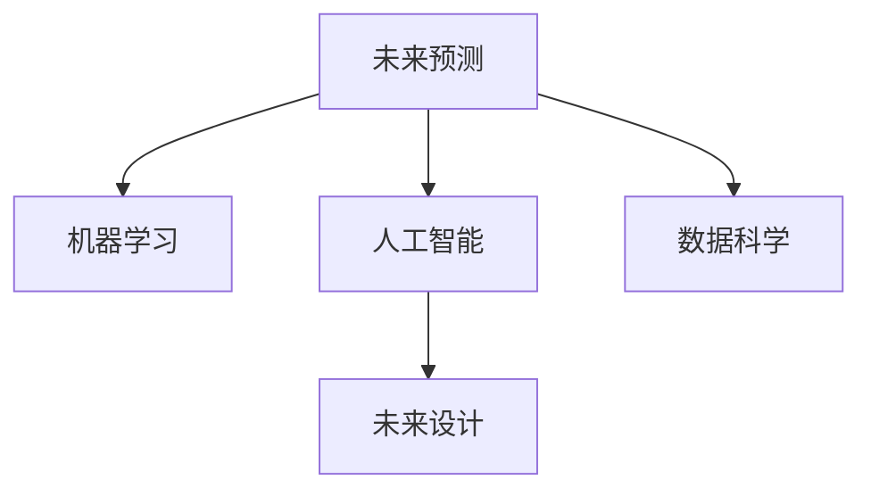

                 

# 2050年的未来学：从预测未来到设计未来的前瞻性思维

> 关键词：未来预测, 未来设计, 人工智能, 机器学习, 数据科学, 科技创新

## 1. 背景介绍

### 1.1 问题由来

在数字化、信息化、智能化的时代浪潮下，我们生活在一个前所未有的信息爆炸和变革加速的时期。科技创新正以前所未有的速度改变着人类的生活方式、工作方式和社会结构。从智能手机、物联网到区块链、大数据，每一项技术的进步都在重塑着我们的未来。然而，这些技术的出现和应用并不是孤立的，它们相互交织、相互影响，共同推动着社会的进步和变革。在这样的背景下，对未来的研究和思考变得尤为重要，只有具备前瞻性思维，才能真正把握未来的发展方向，从而设计出适应未来趋势的产品和服务。

### 1.2 问题核心关键点

未来学（Futurology）是一门探讨人类未来可能发展的学科。它包括预测未来的技术和趋势，以及设计未来的创新和应用。未来学不仅关注短期内的变化，更着眼于长期的、结构性的变革。在本博文中，我们将结合人工智能（AI）、机器学习（ML）、数据科学（DS）等前沿技术，探讨如何通过数据驱动的方式，预测未来趋势，并设计适应未来需求的创新技术。

## 2. 核心概念与联系

### 2.1 核心概念概述

要理解未来学，首先需要明确几个核心概念：

- **未来预测**：通过历史数据、趋势分析、模型预测等方法，对未来可能的趋势和变化进行预测。
- **未来设计**：基于未来预测的结果，设计出新的技术、产品、服务，以满足未来的需求和挑战。
- **人工智能**：一种通过模拟人类智能行为的技术，包括机器学习、自然语言处理、计算机视觉等领域。
- **机器学习**：一种使计算机能够自动学习和改进的技术，通过数据驱动的方式进行模型训练。
- **数据科学**：涉及数据的收集、处理、分析和可视化等步骤，旨在发现数据中的规律和趋势。

这些概念之间的逻辑关系可以通过以下Mermaid流程图来展示：



这个流程图展示了未来预测、人工智能、机器学习、数据科学和未来设计之间的逻辑关系：

1. **未来预测**：通过对历史数据和趋势的分析，使用机器学习和数据科学的方法，预测未来的发展方向和趋势。
2. **机器学习**：作为未来预测的核心技术之一，机器学习能够自动地从数据中学习规律，进行预测和分类。
3. **人工智能**：在预测和设计未来产品和服务时，人工智能通过自然语言处理、计算机视觉等技术，实现智能决策和自动化处理。
4. **数据科学**：通过数据收集、处理和分析，为机器学习和人工智能提供支撑，发现数据中的潜在规律和趋势。
5. **未来设计**：基于未来预测的结果，设计出新的技术、产品、服务，以适应未来的需求和挑战。

这些概念共同构成了未来学的核心框架，帮助我们从数据和技术的角度，预测和设计未来的趋势和应用。

## 3. 核心算法原理 & 具体操作步骤

### 3.1 算法原理概述

未来学的预测和设计过程，涉及大量的数据分析、模型训练和算法优化。以下是对这一过程的算法原理概述：

- **数据收集**：从各种渠道收集历史数据，包括经济指标、社会事件、技术进展等。
- **数据预处理**：对收集到的数据进行清洗、归一化、特征工程等预处理步骤，确保数据的准确性和可用性。
- **模型构建**：根据历史数据和预测目标，选择合适的模型，如回归模型、时间序列模型、神经网络模型等，进行训练和优化。
- **结果分析**：对模型预测结果进行分析和评估，发现数据中的规律和趋势。
- **未来设计**：根据预测结果和未来趋势，设计出新的技术、产品、服务，以满足未来的需求和挑战。

### 3.2 算法步骤详解

以下是未来学预测和设计过程的具体操作步骤：

**Step 1: 数据收集**

收集与未来预测相关的历史数据，包括但不限于：

- **经济数据**：GDP增长率、失业率、通货膨胀率等。
- **社会数据**：人口增长、城市化率、教育水平等。
- **技术数据**：科技发明、专利申请、技术投资等。

数据收集的渠道包括政府统计数据、企业报告、研究论文、社交媒体等。

**Step 2: 数据预处理**

对收集到的数据进行清洗、归一化、特征工程等预处理步骤：

- **数据清洗**：处理缺失值、异常值、重复值等问题，确保数据的完整性和一致性。
- **数据归一化**：将不同来源的数据统一到相同的量纲和范围，便于模型处理。
- **特征工程**：从原始数据中提取有意义的特征，如统计特征、趋势特征、季节特征等。

**Step 3: 模型构建**

选择合适的模型进行训练和优化：

- **回归模型**：如线性回归、多项式回归、决策树回归等，用于预测连续型变量。
- **时间序列模型**：如ARIMA、SARIMA、LSTM等，用于预测时间序列数据。
- **神经网络模型**：如卷积神经网络（CNN）、循环神经网络（RNN）、长短期记忆网络（LSTM）等，用于复杂的非线性预测。

**Step 4: 结果分析**

对模型预测结果进行分析和评估：

- **性能评估**：使用均方误差（MSE）、平均绝对误差（MAE）等指标评估模型预测的准确性。
- **趋势分析**：通过可视化工具如Matplotlib、Seaborn等，对预测结果进行趋势分析和可视化。
- **假设检验**：使用假设检验方法如t检验、F检验等，验证模型预测的可靠性。

**Step 5: 未来设计**

基于预测结果和未来趋势，设计新的技术、产品、服务：

- **技术方案设计**：如自动驾驶技术、智能家居系统、可穿戴设备等。
- **产品和服务设计**：如智能客服、智能推荐系统、虚拟助手等。
- **商业模式设计**：如数据驱动的营销策略、订阅制服务等。

### 3.3 算法优缺点

未来学预测和设计过程的优点包括：

- **数据驱动**：基于大量的历史数据和趋势分析，预测结果具有较高的准确性。
- **跨学科融合**：结合经济学、社会学、技术学等领域的知识，设计出更全面、创新的应用。
- **灵活性高**：可以根据具体需求和目标，灵活选择不同的模型和算法，适应不同的预测和设计场景。

同时，这一过程也存在一些缺点：

- **数据获取难度大**：历史数据获取可能受到限制，导致数据不完整或不准确。
- **模型复杂度高**：高维数据的处理和复杂模型的训练，需要较高的计算资源和专业知识。
- **结果不确定性**：未来的变化存在不确定性，预测结果可能与实际情况存在偏差。

### 3.4 算法应用领域

未来学的预测和设计过程可以应用于多个领域：

- **经济预测**：预测经济增长、通货膨胀、就业率等，为政府和企业提供决策依据。
- **社会预测**：预测人口变化、城市化趋势、教育发展等，为公共政策制定提供参考。
- **技术预测**：预测新技术的兴起和应用，为科技公司提供方向指导。
- **环境预测**：预测气候变化、资源枯竭、环境污染等，为环境保护提供科学依据。

## 4. 数学模型和公式 & 详细讲解 & 举例说明

### 4.1 数学模型构建

在未来的预测和设计过程中，数学模型扮演着至关重要的角色。以下是一个简单的回归模型的构建过程：

假设我们要预测房价$y$，已知影响房价的因素包括房屋面积$x_1$、房屋位置$x_2$、房屋年龄$x_3$等，可以得到线性回归模型：

$$
y = \beta_0 + \beta_1x_1 + \beta_2x_2 + \beta_3x_3 + \epsilon
$$

其中，$\beta_0$为截距，$\beta_1$、$\beta_2$、$\beta_3$为回归系数，$\epsilon$为随机误差。

### 4.2 公式推导过程

以下是对上述线性回归模型的详细推导过程：

1. **假设条件**：
   - 数据$(x_i, y_i)$，其中$x_i = (x_{i1}, x_{i2}, x_{i3})$，$y_i$为房价。
   - 假设回归函数为线性，即$y = \beta_0 + \beta_1x_1 + \beta_2x_2 + \beta_3x_3 + \epsilon$。
   - 假设误差$\epsilon$服从均值为0、方差为$\sigma^2$的高斯分布，即$\epsilon \sim N(0, \sigma^2)$。

2. **最小二乘法**：
   - 使用最小二乘法估计$\beta_0$、$\beta_1$、$\beta_2$、$\beta_3$。
   - 最小化总误差平方和$SSE = \sum_{i=1}^n(y_i - \hat{y}_i)^2$，其中$\hat{y}_i = \beta_0 + \beta_1x_{i1} + \beta_2x_{i2} + \beta_3x_{i3}$。
   - 求偏导数，得到：
   $$
   \frac{\partial SSE}{\partial \beta_0} = -2\sum_{i=1}^n(y_i - \hat{y}_i)
   $$
   $$
   \frac{\partial SSE}{\partial \beta_1} = -2\sum_{i=1}^n(x_{i1} - \overline{x_1})(y_i - \hat{y}_i)
   $$
   $$
   \frac{\partial SSE}{\partial \beta_2} = -2\sum_{i=1}^n(x_{i2} - \overline{x_2})(y_i - \hat{y}_i)
   $$
   $$
   \frac{\partial SSE}{\partial \beta_3} = -2\sum_{i=1}^n(x_{i3} - \overline{x_3})(y_i - \hat{y}_i)
   $$
   - 令偏导数为0，解方程组：
   $$
   \begin{cases}
   \frac{\partial SSE}{\partial \beta_0} = 0 \\
   \frac{\partial SSE}{\partial \beta_1} = 0 \\
   \frac{\partial SSE}{\partial \beta_2} = 0 \\
   \frac{\partial SSE}{\partial \beta_3} = 0
   \end{cases}
   $$
   - 得到：
   $$
   \beta_0 = \frac{1}{n}\sum_{i=1}^ny_i - \beta_1\overline{x_1} - \beta_2\overline{x_2} - \beta_3\overline{x_3}
   $$
   $$
   \beta_1 = \frac{\sum_{i=1}^n(x_{i1} - \overline{x_1})(y_i - \hat{y}_i)}{\sum_{i=1}^n(x_{i1} - \overline{x_1})^2}
   $$
   $$
   \beta_2 = \frac{\sum_{i=1}^n(x_{i2} - \overline{x_2})(y_i - \hat{y}_i)}{\sum_{i=1}^n(x_{i2} - \overline{x_2})^2}
   $$
   $$
   \beta_3 = \frac{\sum_{i=1}^n(x_{i3} - \overline{x_3})(y_i - \hat{y}_i)}{\sum_{i=1}^n(x_{i3} - \overline{x_3})^2}
   $$

### 4.3 案例分析与讲解

假设我们有一组房屋销售数据，包括房屋面积、房屋位置、房屋年龄和房价等，可以使用上述线性回归模型进行预测。

**数据集**：

|房屋面积 (m²)|房屋位置|房屋年龄 (年)|房价 (万美元)|
|---|---|---|---|
|2000|市中心|10|100|
|1500|郊区|15|50|
|2500|市中心|5|200|
|1200|郊区|20|80|
|1800|市中心|15|160|
|...

**模型训练**：

- 将数据标准化，得到标准化后的数据。
- 使用最小二乘法估计回归系数$\beta_0$、$\beta_1$、$\beta_2$、$\beta_3$。
- 使用训练好的模型对新数据进行预测。

**结果分析**：

- 评估预测结果的准确性，计算均方误差（MSE）、平均绝对误差（MAE）等指标。
- 可视化预测结果，绘制房价与房屋面积、位置、年龄的散点图和回归线。

通过这个案例，我们可以看到线性回归模型在房价预测中的应用，以及数据标准化、最小二乘法等数学工具在模型训练和评估中的作用。

## 5. 项目实践：代码实例和详细解释说明

### 5.1 开发环境搭建

在进行未来预测和设计实践前，我们需要准备好开发环境。以下是使用Python进行PyTorch开发的环境配置流程：

1. 安装Anaconda：从官网下载并安装Anaconda，用于创建独立的Python环境。

2. 创建并激活虚拟环境：
```bash
conda create -n pytorch-env python=3.8 
conda activate pytorch-env
```

3. 安装PyTorch：根据CUDA版本，从官网获取对应的安装命令。例如：
```bash
conda install pytorch torchvision torchaudio cudatoolkit=11.1 -c pytorch -c conda-forge
```

4. 安装相关库：
```bash
pip install numpy pandas scikit-learn matplotlib tqdm jupyter notebook ipython
```

完成上述步骤后，即可在`pytorch-env`环境中开始未来预测和设计的实践。

### 5.2 源代码详细实现

以下是一个简单的房价预测的代码实现，使用PyTorch框架和线性回归模型。

```python
import torch
import torch.nn as nn
import torch.optim as optim
import pandas as pd
import numpy as np
import matplotlib.pyplot as plt

class LinearRegression(nn.Module):
    def __init__(self, input_dim):
        super(LinearRegression, self).__init__()
        self.linear = nn.Linear(input_dim, 1)

    def forward(self, x):
        return self.linear(x)

def load_data(file_path):
    data = pd.read_csv(file_path)
    x = data[['area', 'location', 'age']].values
    y = data['price'].values
    x = (x - np.mean(x, axis=0)) / np.std(x, axis=0)
    y = (y - np.mean(y)) / np.std(y)
    return x, y

def train_model(model, optimizer, x_train, y_train, x_valid, y_valid, epochs=100, batch_size=32):
    criterion = nn.MSELoss()
    train_losses = []
    valid_losses = []
    for epoch in range(epochs):
        optimizer.zero_grad()
        for i in range(0, len(x_train), batch_size):
            batch_x = x_train[i:i+batch_size]
            batch_y = y_train[i:i+batch_size]
            output = model(batch_x)
            loss = criterion(output, torch.tensor(batch_y, dtype=torch.float32))
            loss.backward()
            optimizer.step()
        train_losses.append(loss.item())
        with torch.no_grad():
            valid_output = model(x_valid)
            valid_loss = criterion(valid_output, torch.tensor(y_valid, dtype=torch.float32))
            valid_losses.append(valid_loss.item())
    return train_losses, valid_losses

def evaluate_model(train_losses, valid_losses):
    plt.plot(train_losses, label='train loss')
    plt.plot(valid_losses, label='valid loss')
    plt.legend()
    plt.show()

def predict房价(input_dim):
    x = np.random.randn(10, input_dim)
    y_hat = model(x)
    return y_hat.item()

# 加载数据
x_train, y_train = load_data('train.csv')
x_valid, y_valid = load_data('valid.csv')

# 定义模型
input_dim = x_train.shape[1]
model = LinearRegression(input_dim)

# 定义优化器
optimizer = optim.SGD(model.parameters(), lr=0.01)

# 训练模型
train_losses, valid_losses = train_model(model, optimizer, x_train, y_train, x_valid, y_valid)

# 评估模型
evaluate_model(train_losses, valid_losses)

# 预测房价
y_hat = predict房价(input_dim)
print('Predicted Price: $%.2f' % y_hat)
```

### 5.3 代码解读与分析

让我们再详细解读一下关键代码的实现细节：

**load_data函数**：
- 读取CSV文件中的数据。
- 对数据进行标准化处理。
- 返回标准化后的特征数据和目标数据。

**LinearRegression类**：
- 定义线性回归模型，包含一个线性层。
- 实现前向传播函数，返回模型输出。

**train_model函数**：
- 定义损失函数（均方误差）。
- 训练模型，通过最小化损失函数更新模型参数。
- 记录训练损失和验证损失。

**evaluate_model函数**：
- 绘制训练损失和验证损失的对比图。
- 通过可视化结果，评估模型性能。

**predict房价函数**：
- 随机生成输入数据。
- 使用训练好的模型进行预测。
- 输出预测结果。

通过这个代码实现，我们可以看到使用PyTorch进行线性回归模型训练和评估的基本步骤。开发者可以根据具体需求，进一步优化模型的架构和训练策略，以达到更好的预测效果。

## 6. 实际应用场景

### 6.1 智能交通系统

未来的交通系统将更加智能化、自动化和网络化。智能交通系统可以通过数据分析和预测，实现交通流量的动态调控，减少拥堵和事故发生率。例如：

- **交通流量预测**：通过收集历史交通数据，使用时间序列模型或深度学习模型，预测未来的交通流量变化。
- **路径优化**：根据预测结果，优化交通信号灯控制和路线规划，实现交通流量最优分配。
- **事故预警**：通过实时监测和预测，及时发现并预警潜在的事故风险，减少事故损失。

### 6.2 智慧医疗

未来的医疗系统将更加智能化和个性化。智慧医疗可以通过数据分析和预测，实现精准诊断和治疗方案的优化。例如：

- **疾病预测**：通过收集历史病历和健康数据，使用机器学习模型，预测患者可能患上的疾病。
- **治疗方案优化**：根据预测结果，推荐个性化的治疗方案，提高治疗效果。
- **药物研发**：通过大数据分析和模拟实验，预测药物的效果和副作用，加速新药研发进程。

### 6.3 智能制造

未来的制造业将更加智能化和自动化。智能制造可以通过数据分析和预测，实现生产效率的提升和资源的优化配置。例如：

- **生产预测**：通过收集历史生产数据，使用时间序列模型或神经网络模型，预测未来的生产需求和产量。
- **供应链优化**：根据预测结果，优化供应链管理，减少库存成本和生产延误。
- **设备维护**：通过实时监测和预测，及时发现设备故障和维护需求，提高设备利用率。

### 6.4 未来应用展望

随着未来预测和设计技术的不断发展，未来的应用场景将更加多样化和广泛化。未来学的应用领域将包括但不限于：

- **智能城市**：通过数据分析和预测，优化城市管理和服务，提升城市运行效率和居民生活质量。
- **智慧农业**：通过数据分析和预测，优化农作物种植和农业生产，提高农业生产效率和质量。
- **金融科技**：通过数据分析和预测，优化金融服务和产品，提升金融机构的竞争力和客户满意度。
- **环境保护**：通过数据分析和预测，优化环境保护措施，减少环境污染和资源浪费。

## 7. 工具和资源推荐

### 7.1 学习资源推荐

为了帮助开发者系统掌握未来学、人工智能、机器学习和数据科学的相关知识，这里推荐一些优质的学习资源：

1. 《人工智能基础》系列博文：由大模型技术专家撰写，深入浅出地介绍了人工智能的基础概念和核心技术。

2. 《机器学习实战》书籍：通过实战案例，系统讲解了机器学习的基本流程和应用方法。

3. 《Python数据科学手册》书籍：涵盖了数据科学领域的核心知识和技能，包括数据处理、统计分析、机器学习等。

4. Kaggle平台：提供大量的数据集和竞赛，供开发者进行数据科学和机器学习的学习和实践。

5. Coursera课程：斯坦福大学等知名学府开设的在线课程，提供系统化的课程内容和丰富的实践机会。

通过对这些资源的学习实践，相信你一定能够快速掌握未来学、人工智能、机器学习和数据科学的精髓，并用于解决未来的实际问题。

### 7.2 开发工具推荐

高效的开发离不开优秀的工具支持。以下是几款用于未来预测和设计开发的常用工具：

1. Jupyter Notebook：开源的交互式编程环境，支持多种编程语言和库，便于数据探索和模型训练。

2. TensorFlow：由Google主导开发的深度学习框架，提供了丰富的模型和工具，支持分布式计算和自动微分。

3. PyTorch：由Facebook主导开发的深度学习框架，提供了灵活的计算图和自动微分，适合科研和工程应用。

4. Weights & Biases：模型训练的实验跟踪工具，可以记录和可视化模型训练过程中的各项指标，方便对比和调优。

5. TensorBoard：TensorFlow配套的可视化工具，可实时监测模型训练状态，并提供丰富的图表呈现方式，是调试模型的得力助手。

6. Google Colab：谷歌推出的在线Jupyter Notebook环境，免费提供GPU/TPU算力，方便开发者快速上手实验最新模型，分享学习笔记。

合理利用这些工具，可以显著提升未来预测和设计任务的开发效率，加快创新迭代的步伐。

### 7.3 相关论文推荐

未来学的预测和设计过程涉及大量的数学和统计知识。以下是几篇奠基性的相关论文，推荐阅读：

1. SVM：支持向量机（Support Vector Machine）：提出了一种有效的分类算法，广泛应用于模式识别和机器学习领域。

2. KNN：K最近邻（K-Nearest Neighbors）：提出了一种基于相似度度量的分类算法，广泛应用于数据挖掘和统计学习领域。

3. 随机森林：随机森林（Random Forest）：提出了一种集成学习算法，通过随机抽取样本和特征，提升分类准确性和泛化能力。

4. CNN：卷积神经网络（Convolutional Neural Network）：提出了一种图像处理和分类的深度学习模型，广泛应用于计算机视觉领域。

5. RNN：循环神经网络（Recurrent Neural Network）：提出了一种序列数据处理的深度学习模型，广泛应用于自然语言处理领域。

6. LSTM：长短期记忆网络（Long Short-Term Memory）：提出了一种能够处理长序列数据的深度学习模型，广泛应用于时间序列预测和自然语言处理领域。

这些论文代表了大数据预测和设计技术的发展脉络。通过学习这些前沿成果，可以帮助研究者把握学科前进方向，激发更多的创新灵感。

## 8. 总结：未来发展趋势与挑战

### 8.1 总结

本文对未来学的预测和设计过程进行了全面系统的介绍。首先阐述了未来学在数字化、信息化、智能化的时代浪潮中的重要性和应用价值。其次，从原理到实践，详细讲解了未来学预测和设计的数学模型和关键步骤，给出了未来预测和设计代码实例。同时，本文还广泛探讨了未来学在智能交通、智慧医疗、智能制造等多个行业领域的应用前景，展示了未来学技术的广阔前景。

通过本文的系统梳理，可以看到，未来学的预测和设计过程涉及大量的数据分析、模型训练和算法优化。这一过程需要开发者具备扎实的数学基础和丰富的编程经验。只有在数据、模型、算法、工具等各环节进行全面优化，才能真正实现未来学技术的价值。

### 8.2 未来发展趋势

展望未来，未来学预测和设计技术将呈现以下几个发展趋势：

1. **数据量不断增大**：随着互联网和物联网的普及，数据量将呈指数级增长。大数据技术将为未来学提供更丰富的数据资源。

2. **模型复杂度提升**：随着深度学习技术的发展，未来学将更多地采用复杂模型进行预测和设计。神经网络、卷积神经网络、循环神经网络等深度学习模型将逐步取代传统统计模型。

3. **实时化应用普及**：随着物联网和5G技术的发展，未来学将更多地应用于实时数据处理和预测，实现对动态环境的实时响应。

4. **多模态数据融合**：未来的数据将不仅仅局限于单一类型，还将涉及语音、图像、视频等多种模态。未来学将更多地融合多模态数据，实现更加全面的预测和设计。

5. **跨领域应用广泛**：未来学将不仅仅局限于某个单一领域，而是广泛应用于经济、社会、科技、环境等多个领域，推动跨领域的技术创新。

6. **自动化水平提高**：随着自动学习技术和智能算法的发展，未来学将更多地实现自动化预测和设计，减少人工干预和复杂性。

### 8.3 面临的挑战

尽管未来学预测和设计技术已经取得了瞩目成就，但在迈向更加智能化、普适化应用的过程中，它仍面临诸多挑战：

1. **数据获取难度大**：高质量的数据获取成本高，且数据的真实性和完备性难以保障。如何获取和处理海量、高质量的数据，将是未来学面临的重要挑战。

2. **模型复杂度提升**：复杂的深度学习模型需要较高的计算资源和专业知识。如何在资源有限的情况下，训练和优化大规模模型，将是一大难题。

3. **结果不确定性**：未来的变化存在不确定性，预测结果可能与实际情况存在偏差。如何提高模型的鲁棒性和泛化能力，将是一大挑战。

4. **隐私保护问题**：未来的数据往往涉及个人隐私和敏感信息。如何在保护隐私的前提下，获取和处理数据，将是一大难题。

5. **伦理和道德问题**：未来的预测和设计结果可能带来伦理和道德问题，如对隐私的侵害、对社会的不公平等。如何平衡技术进步和伦理道德，将是一大挑战。

6. **技术可解释性不足**：未来的模型往往复杂且黑盒化，难以解释其内部工作机制和决策逻辑。如何提高模型的可解释性，将是未来学面临的重要挑战。

### 8.4 研究展望

面对未来学预测和设计面临的种种挑战，未来的研究需要在以下几个方面寻求新的突破：

1. **自动化预测和设计**：开发更多自动化预测和设计工具，减少人工干预和复杂性。

2. **多模态数据融合**：研发更加高效的多模态数据融合算法，提升预测和设计的效果。

3. **隐私保护技术**：研究和应用更多的隐私保护技术，确保数据处理的合法性和合规性。

4. **伦理和道德约束**：引入伦理和道德约束，确保未来学技术的社会价值和伦理合规性。

5. **模型可解释性**：研究和应用更多的可解释性技术，提高未来学模型的透明性和可解释性。

6. **跨领域融合**：推动未来学与经济学、社会学、法学等多学科的交叉融合，提升预测和设计的全面性和深度。

这些研究方向的探索，必将引领未来学预测和设计技术迈向更高的台阶，为构建安全、可靠、可解释、可控的智能系统铺平道路。面向未来，未来学技术还需要与其他人工智能技术进行更深入的融合，如知识表示、因果推理、强化学习等，多路径协同发力，共同推动自然语言理解和智能交互系统的进步。

## 9. 附录：常见问题与解答

**Q1：未来学的核心价值是什么？**

A: 未来学的核心价值在于通过数据分析和预测，提前掌握未来的变化趋势，为决策提供科学依据。未来学的应用领域包括经济预测、社会预测、技术预测等，能够帮助政府、企业和社会各界更好地应对未来的挑战和机遇。

**Q2：未来学的预测和设计过程有哪些关键步骤？**

A: 未来学的预测和设计过程包括以下关键步骤：

1. 数据收集：收集与未来预测相关的历史数据。

2. 数据预处理：对数据进行清洗、归一化、特征工程等预处理步骤，确保数据的准确性和可用性。

3. 模型构建：选择合适的模型进行训练和优化，如回归模型、时间序列模型、神经网络模型等。

4. 结果分析：对模型预测结果进行分析和评估，发现数据中的规律和趋势。

5. 未来设计：基于预测结果和未来趋势，设计新的技术、产品、服务，以满足未来的需求和挑战。

**Q3：未来学的未来发展趋势是什么？**

A: 未来学的未来发展趋势包括：

1. 数据量不断增大：随着互联网和物联网的普及，数据量将呈指数级增长。

2. 模型复杂度提升：随着深度学习技术的发展，未来学将更多地采用复杂模型进行预测和设计。

3. 实时化应用普及：随着物联网和5G技术的发展，未来学将更多地应用于实时数据处理和预测，实现对动态环境的实时响应。

4. 多模态数据融合：未来的数据将不仅仅局限于单一类型，还将涉及语音、图像、视频等多种模态。

5. 跨领域应用广泛：未来学将广泛应用于经济、社会、科技、环境等多个领域，推动跨领域的技术创新。

**Q4：未来学面临的主要挑战是什么？**

A: 未来学面临的主要挑战包括：

1. 数据获取难度大：高质量的数据获取成本高，且数据的真实性和完备性难以保障。

2. 模型复杂度提升：复杂的深度学习模型需要较高的计算资源和专业知识。

3. 结果不确定性：未来的变化存在不确定性，预测结果可能与实际情况存在偏差。

4. 隐私保护问题：未来的数据往往涉及个人隐私和敏感信息。

5. 伦理和道德问题：未来的预测和设计结果可能带来伦理和道德问题，如对隐私的侵害、对社会的不公平等。

6. 技术可解释性不足：未来的模型往往复杂且黑盒化，难以解释其内部工作机制和决策逻辑。

**Q5：未来学的应用领域有哪些？**

A: 未来学的应用领域包括但不限于：

1. 智能交通系统：通过数据分析和预测，实现交通流量的动态调控，减少拥堵和事故发生率。

2. 智慧医疗：通过数据分析和预测，实现精准诊断和治疗方案的优化。

3. 智能制造：通过数据分析和预测，实现生产效率的提升和资源的优化配置。

4. 智能城市：通过数据分析和预测，优化城市管理和服务，提升城市运行效率和居民生活质量。

5. 智慧农业：通过数据分析和预测，优化农作物种植和农业生产，提高农业生产效率和质量。

6. 金融科技：通过数据分析和预测，优化金融服务和产品，提升金融机构的竞争力和客户满意度。

7. 环境保护：通过数据分析和预测，优化环境保护措施，减少环境污染和资源浪费。

---

作者：禅与计算机程序设计艺术 / Zen and the Art of Computer Programming

