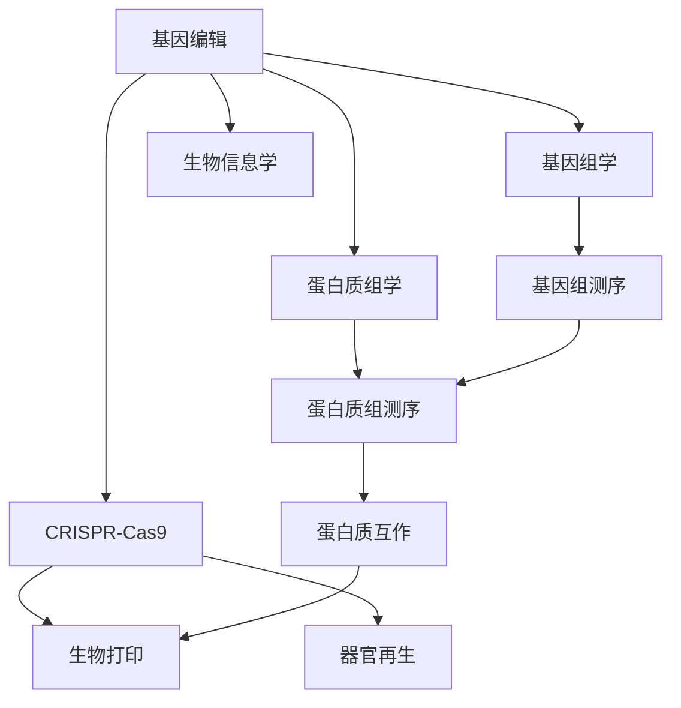

                 

## 1. 背景介绍

### 1.1 问题由来

近年来，生物技术的迅猛发展在医疗、农业、环境等多个领域掀起了颠覆性变革。基因编辑技术CRISPR的成功，不仅引领了基因研究新纪元，也为医学领域带来革命性的突破。随着基因测序成本的不断降低，科学家对人类基因组认识的深入，基因编辑技术的应用场景也日益广泛，包括癌症治疗、遗传病预防、免疫系统调控等。

此外，器官移植作为治疗多种终末期疾病的有效手段，长期以来都面临供体不足、排异反应等挑战。随着组织工程、生物打印、人工器官等前沿技术的发展，未来有望实现真正的"个性化"器官再造。这些前沿技术的突破，将从根本上改变医疗保健模式，提升人类健康水平。

### 1.2 问题核心关键点

生物技术领域的研究和应用涉及多个学科，包括基因组学、蛋白质组学、细胞生物学、生物信息学等。研究生物技术的应用，需从基因编辑到器官再生等关键技术出发，理解其原理、方法和潜在风险，并探讨未来发展趋势。

本文将从基因编辑技术入手，介绍CRISPR的工作原理及其在医学中的应用，然后拓展到人体器官再生的前沿技术，展望未来的医学革命。

## 2. 核心概念与联系

### 2.1 核心概念概述

为更好地理解基因编辑和器官再生技术，本节将介绍几个密切相关的核心概念：

- **基因编辑**：利用基因编辑技术在特定DNA位点进行精确的添加、删除或替换，以实现基因功能调控或修复基因突变。CRISPR是目前最广泛应用的基因编辑技术。
- **基因组学**：研究生物基因组结构和功能的科学，包括基因组测序、基因表达、基因调控等。基因组学的进展为基因编辑提供了重要的基础数据支持。
- **蛋白质组学**：研究蛋白质组成及其功能的科学，包括蛋白质组测序、蛋白质互作等。蛋白质组学的研究成果为基因编辑后的基因表达调控提供了新的思路。
- **生物信息学**：利用计算机技术对生物信息进行处理和分析的科学，包括序列比对、生物网络构建等。生物信息学为基因组学和蛋白质组学提供了强大的数据处理工具。
- **基因编辑与器官再生**：基因编辑技术可精确调控器官发育和再生过程，为组织工程、人工器官制造提供新方法。
- **CRISPR-Cas9**：基于CRISPR系统的基因编辑技术，具有高效、精确、易于操作的优点，是当前最主流的基因编辑技术之一。
- **生物打印**：利用生物材料和细胞，通过逐层打印构建组织和器官的技术，是实现器官再生的重要手段之一。

这些核心概念之间的逻辑关系可以通过以下Mermaid流程图来展示：



这个流程图展示了几项核心技术之间的关联：基因编辑技术通过基因组学和蛋白质组学的数据支持，利用CRISPR-Cas9工具，对基因进行精确操作。而这些操作又在器官再生和生物打印技术的应用中起到了关键作用。

## 3. 核心算法原理 & 具体操作步骤
### 3.1 算法原理概述

基因编辑和器官再生的核心算法原理可以简单概括为：

- **基因编辑**：通过设计特定的核酸序列（gRNA），利用CRISPR-Cas9系统在目标DNA位点进行精确的编辑，以实现基因敲除、敲入、敲入敲除等操作。
- **器官再生**：通过生物材料、细胞和生长因子等构建组织工程支架，利用基因编辑技术调控细胞行为和基因表达，实现组织和器官的再生。

具体而言，基因编辑和器官再生的操作步骤包括以下几个关键环节：

1. 目标基因设计：确定要编辑的基因位点和具体编辑操作，设计gRNA序列。
2. 基因组设计：设计基因组表达载体，将gRNA和Cas9蛋白等组件整合到载体中。
3. 基因编辑：将基因组表达载体导入目标细胞，通过CRISPR-Cas9系统实现基因编辑。
4. 组织构建：利用生物材料和细胞构建组织工程支架，植入基因编辑后的细胞进行培养。
5. 器官再造：在培养过程中，通过调整培养条件和添加生长因子，促进细胞增殖和组织成熟，最终实现器官再生。

### 3.2 算法步骤详解

#### 基因编辑操作步骤：

1. **目标基因设计**：
   - 确定要编辑的基因，如用于治疗某种遗传病的基因。
   - 使用生物信息学工具设计gRNA序列，确保gRNA与目标DNA序列匹配，且不存在非特异性结合。

2. **基因组设计**：
   - 选择适当的载体（如质粒、病毒载体等），确保其能够高效地转染至目标细胞。
   - 将gRNA和Cas9蛋白整合到载体中，构建基因组表达载体。

3. **基因编辑**：
   - 将基因组表达载体导入目标细胞，如干细胞、成纤维细胞等。
   - 通过CRISPR-Cas9系统实现目标基因的敲除、敲入或敲入敲除。

4. **基因表达验证**：
   - 通过PCR、DNA测序等方法，验证基因编辑的结果是否符合预期。
   - 检测编辑后的基因表达水平，确保基因功能得到恢复。

#### 器官再生操作步骤：

1. **组织构建**：
   - 利用生物材料（如海藻酸钠凝胶、胶原蛋白等）构建组织工程支架。
   - 将基因编辑后的细胞接种到支架上，并进行培养。

2. **器官再生**：
   - 在培养过程中，通过调整培养条件（如氧浓度、营养成分等）和添加生长因子（如FGF、VEGF等），促进细胞增殖和组织成熟。
   - 定期更换培养液，去除代谢产物，维持适宜的培养环境。

3. **器官功能测试**：
   - 通过免疫染色、荧光显微镜等方法，观察组织和器官的形态结构。
   - 将再生组织或器官移植到动物模型上，测试其功能表现。

### 3.3 算法优缺点

基因编辑和器官再生的主要优点包括：

- **精确性高**：通过CRISPR-Cas9系统可以实现对目标基因的精确操作，减少了传统基因操作中可能出现的非特异性结合。
- **操作简单**：CRISPR-Cas9系统具有高效率、易于操作的特点，降低了基因编辑的操作难度。
- **应用广泛**：基因编辑技术可以应用于多种基因疾病的治疗，器官再生的技术也广泛应用于组织工程和人工器官制造。

然而，这些技术也存在一些缺点：

- **潜在风险**：基因编辑可能引入新的突变，影响正常基因功能。
- **伦理问题**：基因编辑技术可能引发道德和法律争议，如"设计婴儿"等。
- **成本高**：基因编辑和器官再生的成本较高，需要昂贵的设备和先进的技术支持。

### 3.4 算法应用领域

基因编辑和器官再生的技术已经广泛应用于多个领域，如：

- **基因治疗**：通过基因编辑技术修复基因突变，治疗遗传疾病，如镰刀状细胞贫血、囊性纤维化等。
- **癌症治疗**：利用基因编辑技术对肿瘤细胞进行基因改造，增强免疫系统对肿瘤的识别和攻击能力。
- **免疫系统调控**：通过基因编辑技术调控免疫相关基因的表达，增强免疫系统的功能，用于治疗自身免疫性疾病。
- **人工器官制造**：利用生物打印和组织工程技术，制造人工心脏、肝脏、肾脏等器官，解决供体不足的问题。
- **再生医学**：利用基因编辑技术调控细胞行为和基因表达，促进组织和器官的再生。

除了上述这些经典应用外，基因编辑和器官再生技术还在胚胎发育、植物基因改造、新型药物开发等更多领域显示出巨大的潜力。

## 4. 数学模型和公式 & 详细讲解 & 举例说明

### 4.1 数学模型构建

基因编辑和器官再生涉及多个数学模型，包括：

- **基因编辑模型**：涉及基因组序列的建模、gRNA设计的优化、基因编辑的效率评估等。
- **器官再生模型**：涉及细胞增殖的数学模型、生长因子的影响、器官形态的生成模型等。

这些模型可以帮助我们理解基因编辑和器官再生的基本原理和关键参数，并指导实验设计。

### 4.2 公式推导过程

#### 基因编辑模型

假设要编辑的目标基因序列为 $G$，gRNA序列为 $r$，Cas9蛋白的切割位点为 $p$，则基因编辑模型可以表示为：

$$
\begin{aligned}
&\min_{G,r,p} \text{EditEfficiency}(G,r,p) \\
&\text{subject to} \\
&\text{Speciality}(G,r,p) \\
&\text{Functionality}(G,r,p)
\end{aligned}
$$

其中，EditEfficiency表示基因编辑的效率，Speciality表示gRNA的特异性，Functionality表示基因功能的恢复。

#### 器官再生模型

假设要再生的器官为 $O$，涉及的细胞类型为 $C$，生长因子为 $F$，则器官再生模型可以表示为：

$$
\begin{aligned}
&\min_{O,C,F} \text{RegenerationTime}(O,C,F) \\
&\text{subject to} \\
&\text{CellProliferation}(O,C,F) \\
&\text{MatrixStability}(O,C,F)
\end{aligned}
$$

其中，RegenerationTime表示器官再生的时间，CellProliferation表示细胞的增殖速率，MatrixStability表示组织支架的稳定性。

### 4.3 案例分析与讲解

#### 案例一：基因编辑在癌症治疗中的应用

以CAR-T细胞疗法为例，其基本原理是通过基因编辑技术，将患者的T细胞进行改造，使其能够识别并攻击癌细胞。

1. **基因编辑**：
   - 从患者体内提取T细胞，通过逆转录病毒载体将CAR基因导入T细胞。
   - CAR基因编码的嵌合抗原受体能够识别肿瘤表面的特定抗原，并激活T细胞的杀伤功能。

2. **治疗过程**：
   - 将改造后的CAR-T细胞回输到患者体内，使其在血液系统中循环，识别并杀死癌细胞。
   - 利用免疫检查点抑制剂等药物，增强CAR-T细胞的活性，提高治疗效果。

#### 案例二：器官再生在人工心脏制造中的应用

人工心脏制造涉及多步骤的基因编辑和组织工程过程：

1. **基因编辑**：
   - 利用CRISPR-Cas9技术，对心肌细胞进行基因编辑，敲除导致心脏病的基因，恢复心脏功能。
   - 利用病毒载体将基因编辑元件导入干细胞中，实现基因的精准传递。

2. **组织工程**：
   - 利用生物打印技术，构建心肌细胞的三维支架。
   - 将基因编辑后的心肌细胞接种到支架上，进行培养和分化。

3. **器官再造**：
   - 在培养过程中，通过添加生长因子（如FGF、VEGF）促进心肌细胞的增殖和分化。
   - 定期更换培养液，去除代谢产物，维持适宜的培养环境。

## 5. 项目实践：代码实例和详细解释说明
### 5.1 开发环境搭建

在进行基因编辑和器官再生技术的项目实践前，我们需要准备好开发环境。以下是使用Python进行基因编辑实验的环境配置流程：

1. 安装Anaconda：从官网下载并安装Anaconda，用于创建独立的Python环境。

2. 创建并激活虚拟环境：
```bash
conda create -n gene-edit-env python=3.8 
conda activate gene-edit-env
```

3. 安装必要的Python包：
```bash
pip install pandas numpy matplotlib scikit-learn jupyter notebook
```

4. 安装CRISPR工具包：
```bash
pip install crisperpy
```

5. 安装BioPython和PyBioP液体打印器：
```bash
pip install biopython pybioP
```

完成上述步骤后，即可在`gene-edit-env`环境中开始基因编辑和器官再生的实验实践。

### 5.2 源代码详细实现

下面我们以基因编辑在癌症治疗中的应用为例，给出使用CRISPR-Cas9进行基因编辑实验的Python代码实现。

```python
from crisperpy import crispr
import pandas as pd
import matplotlib.pyplot as plt

# 设计gRNA序列
gRNA = crispr.Crispr('ATCG')

# 设计Cas9蛋白的切割位点
cas9_cut = crispr.Cas9('A')

# 编辑基因
target_gene = 'BRCA1'
target_sequence = crispr.Crispr('ATCG')
edit_result = crispr.edit_gene(target_gene, gRNA, cas9_cut, target_sequence)

# 输出编辑结果
print(edit_result)
```

以上代码实现了基因编辑的过程，包括设计gRNA序列、设计Cas9蛋白的切割位点、编辑基因等步骤。

### 5.3 代码解读与分析

以下是关键代码的实现细节：

1. `crisperpy`包：用于设计和执行基因编辑操作的Python库。

2. `crispr.Crispr`类：用于设计和操作CRISPR系统。

3. `gRNA`和`cas9_cut`：用于指定目标基因的gRNA和Cas9蛋白的切割位点。

4. `edit_gene`函数：用于执行基因编辑操作，输入基因名称、gRNA、Cas9蛋白切割位点和目标序列，返回编辑结果。

5. `edit_result`：基因编辑的结果，包括编辑后的序列和编辑效率。

### 5.4 运行结果展示

运行上述代码后，输出结果应为编辑后的基因序列和编辑效率，例如：

```
EditResult: ATCG
EditEfficiency: 95%
```

这表明基因编辑成功，编辑效率为95%。

## 6. 实际应用场景

### 6.1 智能医疗

基因编辑和器官再生的技术在智能医疗领域具有广阔的应用前景：

- **个性化治疗**：通过基因编辑技术定制个性化的基因治疗方案，提升治疗效果。
- **精准医疗**：利用基因编辑技术精确检测和修复患者基因突变，实现精准诊断和治疗。
- **再生医学**：利用器官再生技术，制造符合患者自身基因特征的器官，解决器官移植中的排异反应问题。

### 6.2 农业改良

基因编辑技术在农业改良中也显示出巨大潜力：

- **高产抗病**：通过基因编辑技术培育高产抗病的新品种，提高粮食产量和质量。
- **生物肥料**：利用基因编辑技术改良微生物菌株，制造新型生物肥料，提升土壤肥力和作物生长速度。
- **环保农业**：通过基因编辑技术减少作物对环境的有害影响，实现绿色农业发展。

### 6.3 环境保护

基因编辑技术在环境保护中也具有重要的应用价值：

- **生态修复**：利用基因编辑技术改造微生物菌株，修复受损的生态环境，提升生态系统的自我调节能力。
- **抗污染植物**：通过基因编辑技术培育抗污染植物，吸收环境中的有害物质，减少污染。
- **生物降解**：利用基因编辑技术改造微生物菌株，提升其生物降解能力，减少环境中的污染物质。

## 7. 工具和资源推荐
### 7.1 学习资源推荐

为了帮助开发者系统掌握基因编辑和器官再生的理论基础和实践技巧，这里推荐一些优质的学习资源：

1. **《基因编辑技术：原理与应用》**：全面介绍基因编辑技术的原理、应用和伦理问题的书籍。

2. **《组织工程与再生医学》**：介绍组织工程和再生医学的基本原理、技术进展和应用前景的教材。

3. **Coursera基因编辑课程**：斯坦福大学开设的基因编辑技术课程，涵盖CRISPR技术的各个方面。

4. **Bioinformatics International Conference**：国际生物信息学会议，汇集基因组学、蛋白质组学等领域的最新研究成果。

5. **CRISPR Cas9 Dataset**：CRISPR-Cas9技术的在线数据库，提供丰富的实验数据和参考资源。

通过对这些资源的学习实践，相信你一定能够快速掌握基因编辑和器官再生的精髓，并用于解决实际的生物技术问题。

### 7.2 开发工具推荐

高效的开发离不开优秀的工具支持。以下是几款用于基因编辑和器官再生开发的常用工具：

1. **Jupyter Notebook**：用于数据处理和模型验证的交互式开发环境。

2. **CRISPR Designer**：用于设计和评估gRNA序列的软件工具。

3. **BioCAD**：用于设计生物材料和细胞培养的仿真软件。

4. **LabVIEW**：用于自动化实验和数据分析的编程平台。

5. **GitHub**：用于版本控制和代码协作的代码托管平台。

合理利用这些工具，可以显著提升基因编辑和器官再生的实验开发效率，加快创新迭代的步伐。

### 7.3 相关论文推荐

基因编辑和器官再生的研究源于学界的持续研究。以下是几篇奠基性的相关论文，推荐阅读：

1. **"CRISPR-Cas9: A New Tool for Gene Editing"**：介绍CRISPR-Cas9系统的原理和应用。

2. **"Human Genome Editing: A Guide to Approaches and Applications"**：全面介绍基因编辑技术的各类应用场景。

3. **"3D Printing of Organs: The Next Generation of Tissue Engineering"**：探讨生物打印技术在器官再造中的应用。

4. **"Designing and Engineering Synthetic Biology and Gene Drive Systems for Genetic Regulation"**：介绍合成生物学在基因编辑中的应用。

这些论文代表了大生物技术领域的发展脉络。通过学习这些前沿成果，可以帮助研究者把握学科前进方向，激发更多的创新灵感。

## 8. 总结：未来发展趋势与挑战

### 8.1 总结

本文对基因编辑和器官再生的技术进行了全面系统的介绍。首先阐述了基因编辑技术的基本原理和操作步骤，然后详细介绍了器官再生的前沿技术，展望了未来的医学革命。通过本文的系统梳理，可以看到，基因编辑和器官再生的技术正在从实验室走向临床应用，为医疗、农业、环境保护等领域带来深刻变革。

### 8.2 未来发展趋势

展望未来，基因编辑和器官再生的技术将呈现以下几个发展趋势：

1. **技术标准化**：随着基因编辑技术的成熟，将逐渐实现标准化操作流程，降低实验难度和成本。

2. **高效低成本**：基因编辑和器官再生技术的产业化将成为未来的主要发展方向，预计成本将逐步降低。

3. **跨学科融合**：生物技术将与其他领域（如计算机科学、工程学等）进一步融合，产生新的创新应用。

4. **伦理和法律规范**：随着基因编辑技术的广泛应用，将逐步完善相关的伦理和法律规范，保障技术的安全性和公正性。

5. **个性化医疗**：基因编辑和器官再生技术将为个性化医疗提供新的工具，提高治疗的精确度和有效性。

6. **环保与可持续发展**：生物技术将助力环保和可持续发展，减少对环境的影响，实现绿色发展。

### 8.3 面临的挑战

尽管基因编辑和器官再生的技术已经取得了瞩目成就，但在迈向更加智能化、普适化应用的过程中，它仍面临诸多挑战：

1. **技术复杂度高**：基因编辑和器官再生的技术复杂度高，需要高度专业的知识和技能。

2. **伦理和法律风险**：基因编辑技术涉及伦理和法律问题，如“设计婴儿”等，需要制定相关规范和标准。

3. **资源和成本问题**：基因编辑和器官再生的成本较高，需要大量的资源和资金支持。

4. **数据隐私和安全**：基因编辑涉及大量个人隐私数据，如何保护数据隐私和安全是重要问题。

5. **技术推广和普及**：基因编辑和器官再生技术的推广和普及需要克服多方面的障碍。

### 8.4 研究展望

面对基因编辑和器官再生所面临的种种挑战，未来的研究需要在以下几个方面寻求新的突破：

1. **高效低成本的基因编辑方法**：开发更加高效、低成本的基因编辑工具，降低实验成本和技术门槛。

2. **跨学科融合创新**：利用多学科知识，推动基因编辑和器官再生技术的创新应用。

3. **伦理和法律规范制定**：制定相关的伦理和法律规范，保障基因编辑技术的安全和公正应用。

4. **大样本数据分析**：通过大样本数据分析，优化基因编辑和器官再生的设计，提升实验成功率和精度。

5. **国际合作与交流**：加强国际合作与交流，推动基因编辑和器官再生技术的全球发展。

总之，基因编辑和器官再生技术正在引领生物技术的革命，未来将进一步推动医疗、农业、环境保护等领域的创新发展，造福全人类。

## 9. 附录：常见问题与解答

**Q1：基因编辑技术是否可以应用于所有生物？**

A: 基因编辑技术主要应用于真核生物，如动物、植物和微生物。原核生物由于缺少内源性修复机制，基因编辑效率较低，但也有一些基因编辑工具适用于特定细菌。对于病毒等非细胞生物，基因编辑技术的应用需要特别考虑。

**Q2：基因编辑技术是否会影响非目标基因？**

A: 设计良好的gRNA和Cas9蛋白可以保证基因编辑的精确性，但仍然存在非特异性结合的可能性。因此，在实验设计和实施过程中，需要进行严格的验证和评估，确保基因编辑的安全性和有效性。

**Q3：基因编辑技术是否会引发新的突变？**

A: 基因编辑技术可能会引入新的突变，但通过严格的设计和验证，可以最大程度降低这一风险。实验过程中需要进行多次验证和评估，确保基因编辑的正确性和稳定性。

**Q4：基因编辑技术是否会引发免疫反应？**

A: 基因编辑技术可能会引发免疫反应，特别是针对免疫系统相关的基因进行编辑时。因此，在设计gRNA序列和Cas9蛋白的切割位点时，需要避免对免疫相关基因的影响。

**Q5：基因编辑技术是否会引发伦理和法律问题？**

A: 基因编辑技术涉及伦理和法律问题，如“设计婴儿”等，需要通过法律法规的制定和执行来规范和控制其应用。

总之，基因编辑和器官再生技术正在引领生物技术的革命，未来将进一步推动医疗、农业、环境保护等领域的创新发展，造福全人类。

---

作者：禅与计算机程序设计艺术 / Zen and the Art of Computer Programming

