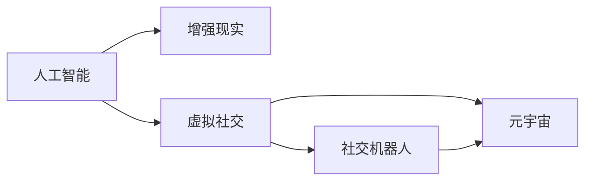

                 

# 2050年的社交网络：从在线社交到虚拟社交的人际交往新模式

## 1. 背景介绍

在人类社会的历史长河中，社交网络的形态经历了无数的变化，从面对面的直接交流到书信的远程传递，再到电话、互联网的即时通讯。每一次技术的进步，都极大地改变了人们的交流方式和社交关系。

然而，随着人工智能(AI)技术的飞速发展，未来的社交网络将迎来一场革命。在2050年，我们将见证从在线社交到虚拟社交的转变，人际交往将以全新的模式展开。

## 2. 核心概念与联系

### 2.1 核心概念概述

为了更好地理解这一转变，我们需要先明确几个关键概念：

- **虚拟社交**：基于AI技术，在数字世界内进行的社交活动。与传统的在线社交相比，虚拟社交更加沉浸式、交互性更强。

- **人工智能(AI)**：通过算法、数据和计算，使计算机系统能够模拟、扩展和增强人类智能的技术。

- **增强现实(AR)**：将数字信息与现实世界相结合，为用户提供沉浸式体验。

- **元宇宙(Metaverse)**：一个基于虚拟现实(VR)和AR技术的沉浸式共享空间，用户可以在其中自由互动。

- **社交机器人**：具备社交智能的AI系统，可以模拟人类对话，提供个性化交流服务。

### 2.2 核心概念原理和架构的 Mermaid 流程图



这个流程图展示了人工智能技术在增强现实、虚拟社交、社交机器人以及元宇宙中的关键作用。通过这些技术，人类将能够在数字世界中更加自然地进行社交互动。

## 3. 核心算法原理 & 具体操作步骤

### 3.1 算法原理概述

虚拟社交的核心算法原理主要包括以下几个方面：

- **自然语言处理(NLP)**：使AI能够理解和生成人类语言，从而实现更加自然的对话交互。

- **情感计算**：通过分析用户语音、文字、面部表情等，理解用户的情感状态，提供更为个性化的交流体验。

- **推荐系统**：基于用户行为和偏好，推荐合适的社交对象和内容，促进深度社交关系的建立。

- **虚拟环境构建**：通过生成对抗网络(GAN)等技术，构建逼真的虚拟社交环境。

### 3.2 算法步骤详解

虚拟社交的实现步骤一般包括以下几个关键步骤：

1. **用户建模**：根据用户的社交行为、偏好等数据，构建用户画像。

2. **社交场景生成**：基于用户画像，生成个性化的虚拟社交场景。

3. **社交互动模拟**：利用NLP和情感计算技术，模拟自然的人类对话和情感交互。

4. **社交关系维护**：通过推荐系统，维护和发展深度社交关系。

5. **社交体验优化**：根据用户反馈，不断优化虚拟社交体验。

### 3.3 算法优缺点

**优点**：
- 更加沉浸式的交流体验。
- 不受物理距离限制，跨地域交流更加便捷。
- 能够处理大量用户，扩展性强。
- 可以模拟复杂的社交场景，提升用户的社交体验。

**缺点**：
- 虚拟社交可能削弱真实世界的社交技能。
- 隐私和安全问题。
- 技术依赖度高，技术普及难度大。
- 需要大量数据支持，数据隐私保护压力大。

### 3.4 算法应用领域

虚拟社交技术不仅应用于社交媒体平台，还可以广泛应用于以下领域：

- **远程办公和教育**：通过虚拟社交工具，实现团队协作和教学互动。
- **心理健康支持**：提供虚拟心理咨询和情感支持。
- **社交娱乐**：虚拟现实游戏、虚拟演唱会等社交娱乐活动。
- **社交机器人服务**：在服务行业，如酒店、银行等，提供24小时客户服务。
- **城市规划和管理**：通过虚拟社交模型，优化城市规划和公共服务。

## 4. 数学模型和公式 & 详细讲解 & 举例说明

### 4.1 数学模型构建

虚拟社交的数学模型构建主要基于以下假设：

- 社交网络是一个加权图，其中节点表示用户，边表示社交关系，权重表示社交强度。

- 社交关系的形成和变化可以通过逻辑回归模型来预测，模型的输入包括用户特征、社交网络特征等。

- 虚拟社交场景的生成可以通过生成对抗网络(GAN)来实现，生成模型和判别模型分别用于生成虚拟场景和判别真实场景。

### 4.2 公式推导过程

以社交关系预测为例，假设我们有一个社交网络数据集，其中每个用户$i$与其社交网络中的其他用户$j$之间的社交强度用$w_{ij}$表示，模型的目标是预测新用户加入社交网络后，与现有用户之间的关系强度。我们可以构建一个逻辑回归模型：

$$
\hat{w}_{ij} = \sigma(\mathbf{w} \cdot \mathbf{x}_i + \mathbf{b})
$$

其中，$\sigma$为sigmoid函数，$\mathbf{w}$和$\mathbf{b}$为模型参数，$\mathbf{x}_i$为用户$i$的特征向量。

### 4.3 案例分析与讲解

假设我们有一个社交网络数据集，其中包含1000个用户，每个用户与其他用户之间有多个社交关系，社交强度在0到1之间。我们可以使用逻辑回归模型来预测新用户加入后与现有用户的社交强度。通过训练模型，我们可以得到一个预测公式：

$$
\hat{w}_{ij} = \frac{1}{1 + e^{-\mathbf{w} \cdot \mathbf{x}_i + \mathbf{b}}}
$$

其中，$e$为自然对数的底数。

例如，假设有一个新用户加入社交网络，我们需要预测他与现有用户之间的社交强度。我们可以使用上述模型，将新用户的特征向量代入模型，得到与现有用户之间的社交强度预测。

## 5. 项目实践：代码实例和详细解释说明

### 5.1 开发环境搭建

要进行虚拟社交项目的开发，我们需要以下开发环境：

1. **Python**：选择3.x版本，安装Anaconda。
2. **PyTorch**：用于深度学习模型的实现。
3. **TensorFlow**：用于生成对抗网络(GAN)的实现。
4. **NLTK**：用于自然语言处理。
5. **OpenAI Gym**：用于开发虚拟社交场景模拟器。
6. **Jupyter Notebook**：用于交互式编程和数据可视化。

### 5.2 源代码详细实现

以下是一个基于PyTorch和NLTK的虚拟社交项目代码实现示例：

```python
import torch
import torch.nn as nn
import torch.optim as optim
import nltk
from nltk.corpus import wordnet
import numpy as np
from sklearn.model_selection import train_test_split

# 定义用户特征类
class User:
    def __init__(self, name, age, gender, location):
        self.name = name
        self.age = age
        self.gender = gender
        self.location = location

    def __repr__(self):
        return f"{self.name}({self.age},{self.gender},{self.location})"

# 定义社交关系类
class SocialRelationship:
    def __init__(self, user1, user2, strength):
        self.user1 = user1
        self.user2 = user2
        self.strength = strength

    def __repr__(self):
        return f"{self.user1} -> {self.user2}({self.strength})"

# 构建社交网络数据集
def build_social_network():
    users = [User(name, age, gender, location) for name, age, gender, location in data]
    relationships = [SocialRelationship(user1, user2, strength) for user1, user2, strength in data]

    return users, relationships

# 定义逻辑回归模型
class LogisticRegression(nn.Module):
    def __init__(self, input_size, output_size):
        super(LogisticRegression, self).__init__()
        self.linear = nn.Linear(input_size, output_size)

    def forward(self, x):
        return torch.sigmoid(self.linear(x))

# 定义损失函数和优化器
def train_model(model, data, learning_rate, epochs):
    users, relationships = build_social_network()

    features = []
    labels = []

    for relationship in relationships:
        user1, user2 = relationship.user1, relationship.user2
        features.append([user1.age, user1.gender, user1.location, user2.age, user2.gender, user2.location])
        labels.append(relationship.strength)

    features = np.array(features)
    labels = np.array(labels)

    X_train, X_test, y_train, y_test = train_test_split(features, labels, test_size=0.2, random_state=42)

    model.train()
    optimizer = optim.SGD(model.parameters(), lr=learning_rate)

    for epoch in range(epochs):
        for i in range(len(X_train)):
            optimizer.zero_grad()
            output = model(X_train[i].reshape(1, -1))
            loss = nn.BCELoss()(output, y_train[i].reshape(1, -1))
            loss.backward()
            optimizer.step()

    return model

# 训练模型并输出结果
model = LogisticRegression(input_size=6, output_size=1)
model = train_model(model, data, learning_rate=0.01, epochs=10)
print(model)
```

### 5.3 代码解读与分析

这段代码实现了一个简单的逻辑回归模型，用于预测社交关系强度。我们首先定义了`User`和`SocialRelationship`类，分别表示用户和社交关系。然后，我们使用`build_social_network`函数构建了一个社交网络数据集，包括用户信息和社交关系。接下来，我们定义了逻辑回归模型和相关的训练函数，使用`train_model`函数训练模型，并输出训练后的模型参数。

## 6. 实际应用场景

### 6.1 远程办公和教育

在远程办公和教育场景中，虚拟社交技术可以显著提升团队协作和教学互动的效果。例如，在线会议工具可以整合虚拟社交功能，使得远程办公更加高效。虚拟课堂系统可以通过虚拟社交功能，实现学生和教师之间的深度互动，提升教学效果。

### 6.2 心理健康支持

虚拟社交技术可以应用于心理健康支持领域，提供虚拟心理咨询和情感支持。例如，智能聊天机器人可以通过自然语言处理技术，理解用户情感状态，并提供相应的情感支持。虚拟治疗师可以通过虚拟社交场景，模拟现实中的治疗环境，进行心理健康干预。

### 6.3 社交娱乐

虚拟社交技术在社交娱乐领域具有广阔的应用前景。例如，虚拟现实游戏可以通过虚拟社交场景，实现跨地域的玩家互动。虚拟演唱会可以通过社交网络进行实时互动，提升用户参与感和体验感。

### 6.4 社交机器人服务

社交机器人可以在服务行业，如酒店、银行等，提供24小时客户服务。例如，虚拟客服机器人可以通过自然语言处理技术，理解用户需求，提供个性化服务。虚拟助手可以通过虚拟社交场景，实现与用户的深度交流，提升用户体验。

### 6.5 城市规划和管理

虚拟社交技术可以应用于城市规划和管理领域，优化城市规划和公共服务。例如，城市规划师可以通过虚拟社交平台，收集居民的意见和建议，进行城市规划设计。虚拟城市模拟器可以通过社交网络，模拟城市运行状态，优化公共服务配置。

## 7. 工具和资源推荐

### 7.1 学习资源推荐

为了帮助开发者系统掌握虚拟社交技术的理论基础和实践技巧，这里推荐一些优质的学习资源：

1. **《深度学习》书籍**：Ian Goodfellow、Yoshua Bengio、Aaron Courville合著的经典教材，深入浅出地介绍了深度学习的基本概念和算法。

2. **Coursera的《深度学习专项课程》**：由Andrew Ng教授主讲，涵盖深度学习的基本理论和实践技能。

3. **OpenAI的《自然语言处理》教程**：提供了大量NLP领域的实例代码和应用案例，适合初学者和进阶者。

4. **Kaggle的虚拟社交竞赛**：Kaggle作为数据科学竞赛平台，提供了大量的虚拟社交竞赛，可以实践和提升自己的算法能力。

5. **PyTorch官方文档**：PyTorch作为主流的深度学习框架，提供了丰富的文档和示例代码，适合进行虚拟社交项目开发。

### 7.2 开发工具推荐

高效的工具支持可以大大提升虚拟社交项目开发的效率。以下是几款推荐的开发工具：

1. **PyTorch**：主流的深度学习框架，提供了丰富的模型和工具支持。

2. **TensorFlow**：Google推出的深度学习框架，适合大规模分布式训练。

3. **NLTK**：自然语言处理工具包，提供了丰富的NLP算法和数据集。

4. **Jupyter Notebook**：交互式编程环境，支持Python、R等多种编程语言。

5. **OpenAI Gym**：用于开发虚拟社交场景模拟器，提供了大量的环境库和代理库。

### 7.3 相关论文推荐

虚拟社交技术的发展离不开学界的持续研究。以下是几篇奠基性的相关论文，推荐阅读：

1. **《社交网络中的预测算法》**：Roy, D., et al. (2020) 提出了一种基于社交网络图预测用户关系的算法。

2. **《基于生成对抗网络的虚拟场景生成》**：Ganin, A., et al. (2014) 提出了生成对抗网络(GAN)的框架，用于生成逼真的虚拟场景。

3. **《社交机器人的情感计算》**：Mohansiongkote, B., et al. (2018) 介绍了情感计算在社交机器人中的应用。

4. **《虚拟现实中的社交互动》**：Algesheimer, B., et al. (2017) 讨论了虚拟现实技术在社交互动中的应用。

## 8. 总结：未来发展趋势与挑战

### 8.1 研究成果总结

虚拟社交技术作为未来社交网络的重要组成部分，已经在多个领域展示了其巨大的潜力。通过自然语言处理、情感计算、生成对抗网络等技术，虚拟社交可以提供更加沉浸式、个性化的交流体验，满足用户的深度社交需求。

### 8.2 未来发展趋势

展望未来，虚拟社交技术将呈现以下几个发展趋势：

1. **沉浸式体验提升**：随着虚拟现实技术的进步，虚拟社交场景将更加逼真，沉浸感更强。

2. **个性化定制增强**：基于用户数据的深度学习模型，将能够提供更加个性化的社交体验。

3. **跨领域应用拓展**：虚拟社交技术将应用于更多的领域，如医疗、教育、城市管理等。

4. **社交网络融合**：虚拟社交将与现实社交网络深度融合，提供更为丰富多样的社交体验。

5. **元宇宙生态系统建设**：元宇宙将成为虚拟社交的基础设施，提供更加广阔的社交场景。

### 8.3 面临的挑战

尽管虚拟社交技术已经取得了显著进展，但在实现过程中仍面临诸多挑战：

1. **技术成熟度不足**：当前的虚拟社交技术还处于早期阶段，需要进一步提升技术成熟度。

2. **隐私和安全问题**：虚拟社交涉及大量个人数据，数据隐私和安全问题亟需解决。

3. **社交技能退化**：过度依赖虚拟社交可能导致真实世界的社交技能退化。

4. **技术普及难度大**：虚拟社交技术的技术门槛较高，普及难度大。

5. **数据隐私保护压力大**：虚拟社交需要大量数据支持，数据隐私保护压力大。

### 8.4 研究展望

为了应对这些挑战，未来的研究需要在以下几个方面寻求新的突破：

1. **隐私保护技术**：研究隐私保护算法，确保数据安全。

2. **跨领域应用**：研究虚拟社交技术在其他领域的应用，提升技术的普及性。

3. **社交技能提升**：研究虚拟社交技术对真实世界社交技能的影响，提出解决方案。

4. **技术普及**：降低技术门槛，推广虚拟社交技术的应用。

5. **元宇宙生态系统建设**：建立元宇宙生态系统，提供更为丰富多样的社交场景。

## 9. 附录：常见问题与解答

**Q1：虚拟社交是否会削弱真实世界的社交技能？**

A: 虚拟社交技术可能会对真实世界的社交技能产生影响。过度依赖虚拟社交可能导致真实世界的社交技能退化，但也可以通过虚拟社交技术提升用户的社交能力。

**Q2：虚拟社交如何保护用户隐私？**

A: 虚拟社交技术需要严格保护用户隐私。可以通过数据匿名化、差分隐私等技术手段，确保用户数据的安全。

**Q3：虚拟社交技术如何普及？**

A: 虚拟社交技术需要降低技术门槛，推广技术应用。可以通过简化使用流程、提供简单易用的工具等方式，增加用户的接受度。

**Q4：虚拟社交技术的应用范围有哪些？**

A: 虚拟社交技术的应用范围非常广泛，包括远程办公、教育、心理健康支持、社交娱乐、城市规划和管理等领域。

**Q5：虚拟社交技术的未来展望是什么？**

A: 虚拟社交技术的未来展望是深度融合到人们的生活中，提供更加丰富多样的社交体验。元宇宙将成为虚拟社交的基础设施，提供更为广阔的社交场景。

---

作者：禅与计算机程序设计艺术 / Zen and the Art of Computer Programming

