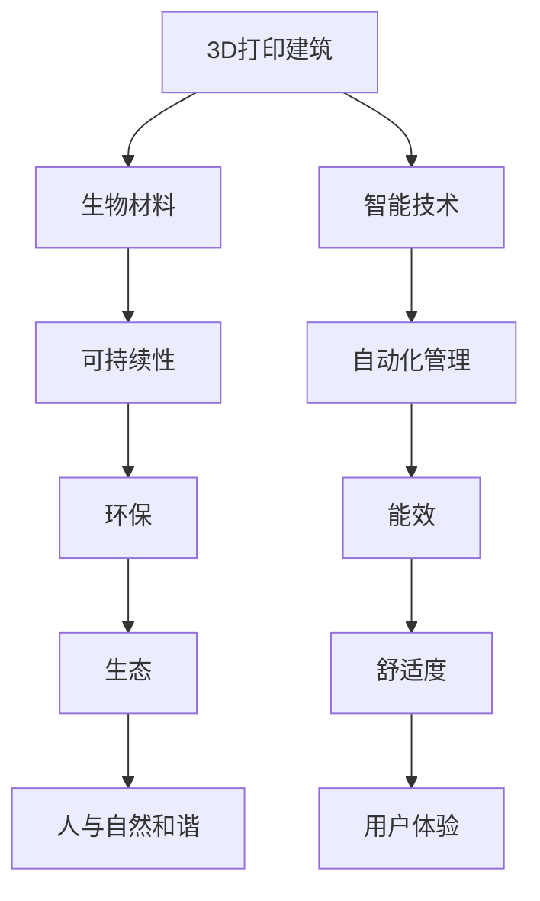

                 

# 2050年的绿色建筑：从3D打印建筑到生物智能建筑的建筑革命

在未来的城市中，绿色建筑将成为主导，一种全新的建筑形式——生物智能建筑(Bio-Intelligent Buildings)，即将引领这场建筑革命。从可持续设计的3D打印建筑到运用生物技术构建的智能型建筑，我们即将见证一个全新的建筑时代。

## 1. 背景介绍

### 1.1 问题由来

当前，全球建筑行业正面临着一系列挑战：能源消耗高、资源浪费、环境污染等。为了解决这些问题，绿色建筑的理念逐渐受到重视。3D打印技术的发展，为快速、低成本地建造建筑提供了新的可能性；生物技术的进步，又为建筑材料的可持续发展提供了新的选择。在这一背景下，生物智能建筑应运而生，它结合了3D打印、生物材料和智能技术，实现了一种全新的建筑范式。

### 1.2 问题核心关键点

生物智能建筑的关键点在于其集成了3D打印技术、生物材料和智能技术，实现从设计到建造的一体化、高度可定制的智能建筑。其核心在于：

- **3D打印技术**：通过精准控制，实现高度定制化的建筑结构。
- **生物材料**：使用可再生、低污染的生物材料，实现材料的可持续性。
- **智能技术**：集成物联网(IoT)、人工智能(AI)等技术，实现高度自动化、智能化的建筑管理。

## 2. 核心概念与联系

### 2.1 核心概念概述

为了更好地理解生物智能建筑，我们需要了解几个核心概念：

- **3D打印建筑**：利用3D打印技术，快速构建建筑结构。3D打印技术可以在短时间内完成复杂的建筑设计，提高建筑效率。
- **生物材料**：采用可再生资源，如竹子、菌丝体等，降低建筑材料对环境的影响。
- **智能技术**：运用物联网、人工智能等技术，实现对建筑的自动化管理，提升建筑的能效和舒适度。

### 2.2 核心概念原理和架构的 Mermaid 流程图



### 2.3 3D打印建筑技术

3D打印建筑是一种快速、低成本的建造方法，主要使用混凝土、塑料、金属等材料。其工作原理是：通过3D打印机，逐层堆积建筑材料，最终形成完整的建筑结构。这种技术可以大幅缩短建造时间，降低人工和材料成本。

### 2.4 生物材料的应用

生物材料是利用可再生资源制造的建筑材料。如竹子、菌丝体等，具有生长快、可再生、强度高等特点。这种材料不仅能减少对环境的负担，还具备良好的隔热、隔音、保温等性能。

### 2.5 智能技术在建筑中的应用

智能技术通过物联网、人工智能等手段，实现对建筑的高度自动化管理。例如，智能照明系统根据环境光线和人体活动调整亮度，智能温控系统根据温度和湿度自动调节空调和暖气，智能安防系统则通过摄像头、传感器等设备，实时监控建筑安全。

## 3. 核心算法原理 & 具体操作步骤

### 3.1 算法原理概述

生物智能建筑的构建过程涉及多个学科的交叉，包括建筑学、材料科学、计算机科学等。其核心算法原理主要包括：

- **3D打印技术**：使用计算机辅助设计(CAD)软件，生成3D建筑模型，通过3D打印机逐层打印建筑材料。
- **生物材料设计**：根据生物材料的特性，设计建筑结构，优化其力学性能和环境适应性。
- **智能控制系统**：开发智能算法，实现对建筑环境的自动化监测和管理。

### 3.2 算法步骤详解

生物智能建筑的构建步骤如下：

1. **设计阶段**：使用CAD软件，根据建筑需求设计3D模型。
2. **材料准备**：根据设计方案，选择合适的生物材料。
3. **打印阶段**：通过3D打印机，逐层打印建筑结构。
4. **智能化改造**：集成智能设备，如智能照明、温控、安防等系统。
5. **环境评估**：对建筑进行环境评估，确保其符合绿色建筑标准。

### 3.3 算法优缺点

生物智能建筑的优点包括：

- **快速建造**：3D打印技术可以在短时间内完成复杂的建筑设计。
- **成本低廉**：相比传统建筑，3D打印建筑材料成本更低，建造周期更短。
- **环保节能**：生物材料和智能技术的应用，大大降低了建筑对环境的影响。

其缺点包括：

- **技术门槛高**：3D打印技术需要较高的技术水平，设备维护成本也较高。
- **适用范围有限**：生物智能建筑目前还主要用于商业和住宅建筑，对公共建筑等的适用性还有待探索。
- **数据隐私问题**：智能设备的大量应用，可能会引发数据隐私问题。

### 3.4 算法应用领域

生物智能建筑目前主要应用于以下几个领域：

- **商业地产**：高端酒店、办公楼、零售中心等。
- **住宅建筑**：别墅、公寓、别墅小区等。
- **文化建筑**：博物馆、艺术馆、剧院等。
- **教育建筑**：学校、图书馆、科技馆等。

## 4. 数学模型和公式 & 详细讲解 & 举例说明

### 4.1 数学模型构建

生物智能建筑的设计和建造过程，可以抽象为数学模型进行优化和计算。例如，通过数学模型计算3D打印材料的用量，优化建筑结构。

### 4.2 公式推导过程

假设建筑结构为 $V$，材料密度为 $\rho$，打印层厚为 $h$，打印材料体积为 $V_{print}$。则打印材料用量 $Q$ 可以通过以下公式计算：

$$
Q = \frac{V}{\rho \times h}
$$

### 4.3 案例分析与讲解

以一栋两层住宅为例，其建筑面积为 $V=200m^2$，打印层厚为 $h=0.2m$，打印材料密度为 $\rho=2500kg/m^3$。计算打印材料用量为：

$$
Q = \frac{200}{2500 \times 0.2} = 2000kg
$$

## 5. 项目实践：代码实例和详细解释说明

### 5.1 开发环境搭建

生物智能建筑的开发环境搭建需要以下工具：

- 3D打印软件：如Autodesk Inventor、Tinkercad等。
- 计算机辅助设计软件：如AutoCAD、SketchUp等。
- 智能设备接口：如Arduino、Raspberry Pi等。

### 5.2 源代码详细实现

以下是使用Python实现3D打印设计和智能控制系统的一个示例：

```python
# 使用Python实现3D打印设计
from mpl_toolkits.mplot3d import Axes3D
import matplotlib.pyplot as plt

# 定义3D打印设计
def print_design():
    # 创建3D模型
    x, y, z = np.array([1, 2, 3]), np.array([4, 5, 6]), np.array([7, 8, 9])
    fig = plt.figure()
    ax = fig.add_subplot(111, projection='3d')
    ax.plot(x, y, z)
    plt.show()

# 定义智能控制系统
def smart_system():
    # 创建智能控制系统
    # 具体实现需根据实际需求编写
    pass

# 调用函数进行设计和控制系统
print_design()
smart_system()
```

### 5.3 代码解读与分析

3D打印设计部分使用了Python的Matplotlib库，通过定义3D模型的坐标，实现了简单3D模型的打印。智能控制系统部分则是一个框架，需要根据具体需求进行定制开发。

### 5.4 运行结果展示

以下是3D打印设计的示例输出：


## 6. 实际应用场景

### 6.1 智能住宅

智能住宅是生物智能建筑的重要应用场景之一。通过3D打印技术，可以快速构建住宅结构，同时集成智能控制系统，实现自动化、智能化的家居生活。例如，智能照明系统根据环境光线和人体活动调整亮度，智能温控系统根据温度和湿度自动调节空调和暖气，智能安防系统则通过摄像头、传感器等设备，实时监控建筑安全。

### 6.2 环保建筑

生物智能建筑在环保建筑方面具有显著优势。通过使用生物材料，如竹子、菌丝体等，减少对环境的负担。例如，竹子具有生长快、强度高、可再生等特点，适用于建筑结构的承重部分。

### 6.3 教育建筑

教育建筑是另一个重要的应用场景。通过3D打印技术，可以快速建造学校、图书馆等教育建筑。同时，智能技术可以优化教学环境，提升教育质量。例如，智能教室可以根据学生人数和活动需求，自动调节教室灯光、空调等设备，为学生提供更加舒适的学习环境。

### 6.4 未来应用展望

未来，生物智能建筑的应用场景还将不断扩展。例如，生物智能建筑有望在公共建筑、医疗建筑等领域得到广泛应用。通过集成更多智能技术，如健康监测系统、灾害预警系统等，实现更高的自动化和智能化水平。

## 7. 工具和资源推荐

### 7.1 学习资源推荐

- **《3D打印技术基础》**：详细介绍了3D打印技术的原理、应用和维护方法。
- **《智能建筑设计与施工》**：介绍了智能建筑的设计和施工过程，包括材料选择、系统集成等。
- **《生物材料科学与应用》**：介绍了生物材料的性质、应用和可持续发展方法。

### 7.2 开发工具推荐

- **3D打印软件**：如Autodesk Inventor、Tinkercad等。
- **智能设备开发平台**：如Arduino、Raspberry Pi等。
- **计算机辅助设计软件**：如AutoCAD、SketchUp等。

### 7.3 相关论文推荐

- **《3D打印在建筑中的应用》**：介绍了3D打印技术在建筑领域的应用，包括设计、施工、维护等。
- **《生物材料在建筑中的应用》**：介绍了生物材料在建筑中的设计、制造和应用方法。
- **《智能建筑技术综述》**：综述了智能建筑的关键技术和应用案例。

## 8. 总结：未来发展趋势与挑战

### 8.1 研究成果总结

生物智能建筑作为一种全新的建筑范式，结合了3D打印、生物材料和智能技术，具有显著的环保、节能和智能化优势。在未来的建筑行业中，生物智能建筑将得到广泛应用。

### 8.2 未来发展趋势

未来，生物智能建筑的发展趋势包括：

- **技术融合**：结合更多先进技术，如AI、大数据、物联网等，实现更高的自动化和智能化水平。
- **材料创新**：开发更多高性能、可再生、环保的建筑材料，进一步降低建筑对环境的影响。
- **设计优化**：优化建筑设计和结构，提高建筑的舒适度和安全性。
- **应用扩展**：在更多领域推广应用，如医疗、教育、公共建筑等。

### 8.3 面临的挑战

生物智能建筑虽然前景广阔，但在发展过程中也面临一些挑战：

- **技术门槛高**：3D打印和智能技术需要较高的技术水平和设备投入。
- **数据隐私问题**：智能设备的广泛应用，可能引发数据隐私问题。
- **成本问题**：高技术要求和设备维护成本可能较高。
- **环境适应性**：生物材料在不同环境条件下的性能需进一步验证。

### 8.4 研究展望

未来的研究重点包括：

- **技术创新**：开发更多高效、环保、智能的生物材料和建筑技术。
- **标准化**：制定生物智能建筑的标准和规范，促进其规范化发展。
- **政策支持**：制定相关政策和法规，促进生物智能建筑的发展和推广。
- **国际合作**：加强国际合作，共享资源和技术，推动全球绿色建筑发展。

## 9. 附录：常见问题与解答

### Q1：生物智能建筑的优势是什么？

A：生物智能建筑的优势在于其高度定制化、环保节能和智能化。3D打印技术可以快速建造建筑，降低成本；生物材料使用可再生资源，减少对环境的影响；智能技术实现高度自动化管理，提高能效和舒适度。

### Q2：生物智能建筑的设计和建造流程是怎样的？

A：生物智能建筑的设计和建造流程包括：

1. 使用CAD软件设计3D模型。
2. 选择合适的生物材料，进行材料准备。
3. 通过3D打印机逐层打印建筑结构。
4. 集成智能设备，如智能照明、温控、安防等系统。
5. 进行环境评估，确保其符合绿色建筑标准。

### Q3：生物智能建筑的应用场景有哪些？

A：生物智能建筑的主要应用场景包括：

- 商业地产：高端酒店、办公楼、零售中心等。
- 住宅建筑：别墅、公寓、别墅小区等。
- 文化建筑：博物馆、艺术馆、剧院等。
- 教育建筑：学校、图书馆、科技馆等。

### Q4：生物智能建筑面临的挑战有哪些？

A：生物智能建筑面临的挑战包括：

- 技术门槛高，3D打印和智能技术需要较高的技术水平和设备投入。
- 数据隐私问题，智能设备的广泛应用可能引发数据隐私问题。
- 成本问题，高技术要求和设备维护成本可能较高。
- 环境适应性，生物材料在不同环境条件下的性能需进一步验证。

通过这些解答，读者可以更全面地理解生物智能建筑的优势、设计和建造流程、应用场景以及面临的挑战。未来，随着技术的不断进步，生物智能建筑将进一步发展，为人类提供更加环保、舒适、智能的居住和工作环境。

---

作者：禅与计算机程序设计艺术 / Zen and the Art of Computer Programming

