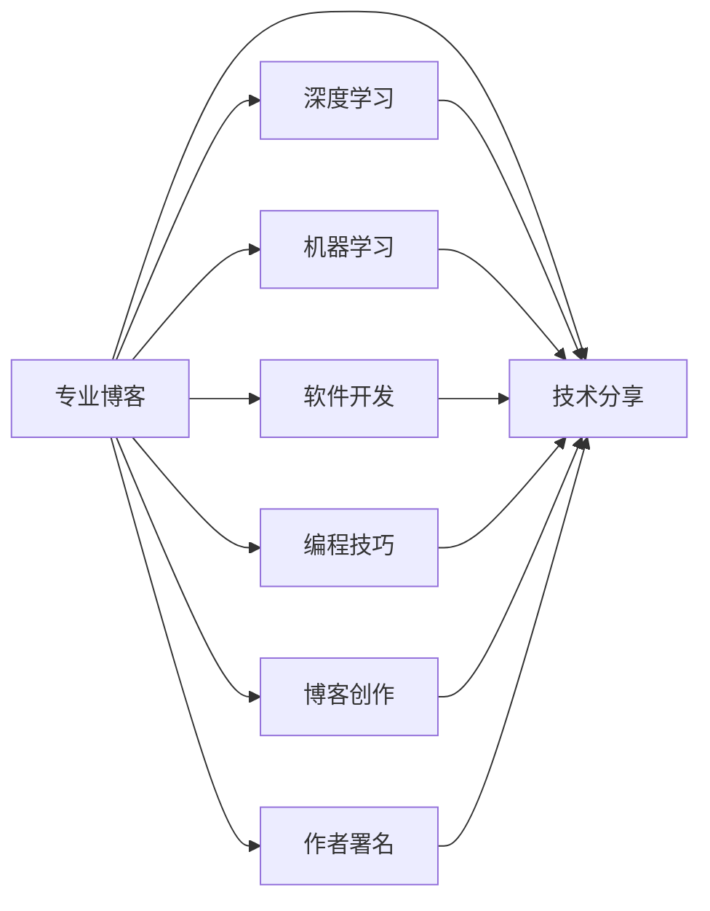

                 

# 建立专业博客：深度分享你的知识和见解

> 关键词：专业博客,深度学习,机器学习,软件开发,编程技巧,博客创作,技术分享,作者署名

## 1. 背景介绍

### 1.1 问题由来
在现代社会，信息爆炸的时代，专业知识的分享变得尤为重要。无论是专业人士还是爱好者，都需要一个平台来展现他们的知识，同时也能从其他人的分享中获益。专业的博客，特别是技术博客，成为了一个理想的知识共享与交流的场所。

本文将详细探讨如何建立一份专业的技术博客，以便深入分享你的知识和见解，同时提供实用的技巧和建议，帮助其他技术爱好者提升自身能力。

## 2. 核心概念与联系

### 2.1 核心概念概述

为便于理解，本文将介绍几个与博客建立和运营相关的核心概念及其相互联系。

- **专业博客**：指专注于某个技术领域，提供深入分析、实战经验分享、最新技术趋势报道的博客。其内容通常包含技术文章、项目案例、代码实现、技术解读等。
- **深度学习**：指利用人工神经网络解决复杂问题的学习方式，广泛应用于图像识别、自然语言处理、推荐系统等领域。
- **机器学习**：通过算法和统计模型，让计算机从数据中自动学习和改进，包括监督学习、无监督学习、强化学习等。
- **软件开发**：涵盖软件开发流程、代码编写、软件测试、部署发布等全链条的活动。
- **编程技巧**：指提高编程效率、代码质量、软件性能的实用方法和工具。
- **博客创作**：涉及博客内容规划、撰写、编辑、发布等过程。
- **技术分享**：通过博客、讲座、文章等形式，将专业知识传播给更广泛的人群。
- **作者署名**：博客文章的原创者，通常以真实姓名或网名形式出现，用以表明文章知识产权。

这些核心概念通过Mermaid流程图表示其相互联系：



这个流程图展示了专业博客与其他技术领域的紧密联系，以及技术分享如何贯穿其中。

## 3. 核心算法原理 & 具体操作步骤

### 3.1 算法原理概述

建立专业博客的核心算法原理可以总结为以下几个步骤：

1. **内容规划**：确定博客的主题和定位，确保内容具有独特性和深度。
2. **内容创作**：撰写高质量的博客文章，分析问题，提出解决方案。
3. **技术审核**：通过社区审核、同行评审等手段，确保内容的准确性和创新性。
4. **发布与优化**：选择合适的平台，持续发布新内容，并根据反馈进行优化。

这些步骤共同构成了一个系统性的博客建立流程。

### 3.2 算法步骤详解

#### 3.2.1 内容规划

**步骤一：确定博客主题**
- 选择你最熟悉的领域，如深度学习、机器学习、软件开发等。
- 考虑受众的需求和兴趣，确保内容具有实用性和可读性。

**步骤二：内容编排**
- 制定博客的发布计划，定期发布新内容。
- 确定内容的分级和结构，如基础教程、进阶指南、实战案例等。

#### 3.2.2 内容创作

**步骤一：撰写文章**
- 使用清晰、简洁、结构化的语言撰写技术文章。
- 结合实例和代码片段，增加文章的实战性和可操作性。
- 重视文章的可读性，如适当插入图片、标题、列表等。

**步骤二：技术审核**
- 通过社区审核、同行评审等方式，确保内容的准确性和创新性。
- 接受反馈，不断优化文章质量。

#### 3.2.3 发布与优化

**步骤一：选择合适的平台**
- 根据受众和内容类型，选择适合的博客平台，如Medium、CSDN、知乎等。
- 考虑平台的特性，如访问量、用户活跃度、社区氛围等。

**步骤二：发布与推广**
- 定期更新博客，保持内容新鲜。
- 通过社交媒体、邮件列表等方式推广博客，增加曝光度。

**步骤三：持续优化**
- 根据用户反馈和数据分析，优化内容策略和博客平台。
- 不断学习新的技术，提升自身能力，保持博客内容的前沿性和实用性。

### 3.3 算法优缺点

建立专业博客的算法有以下优点：
1. **知识共享**：通过博客平台，可以将专业知识传播给更广泛的人群，促进技术交流。
2. **个人品牌**：通过持续的高质量内容输出，建立个人品牌，吸引更多关注和认可。
3. **社区互动**：博客平台通常支持评论和讨论，可以与读者进行互动交流。

同时，也存在一些局限：
1. **时间成本**：内容创作和维护需要投入大量时间和精力。
2. **技术门槛**：需要具备一定的技术写作和平台运营能力。
3. **商业风险**：商业广告和赞助可能影响内容客观性和独立性。

尽管存在这些局限，但总体而言，建立专业博客是一个提升个人品牌、促进知识共享的有效途径。

### 3.4 算法应用领域

专业博客的应用领域非常广泛，涵盖了多个技术领域，例如：

- **深度学习**：分享深度学习算法、框架、实战项目等。
- **机器学习**：讨论机器学习模型、数据预处理、特征工程等。
- **软件开发**：介绍软件开发流程、编程技巧、代码实现等。
- **编程技巧**：提供高效编码、代码优化、工具使用等技巧。
- **技术分享**：传播最新的技术趋势、学术研究、开源项目等。

以上领域只是冰山一角，任何与技术相关的知识都可以通过博客进行分享和传播。

## 4. 数学模型和公式 & 详细讲解 & 举例说明

### 4.1 数学模型构建

本节将使用数学语言对建立专业博客的流程进行更加严谨的描述。

假设博客内容 $C$ 包含了 $n$ 篇技术文章，每篇内容 $c_i$ 的质量可以通过 $q_i$ 来表示，且 $q_i$ 服从某种分布，博客平台的整体质量 $Q$ 可以表示为 $Q = \frac{1}{n}\sum_{i=1}^n q_i$。

博客平台的用户满意度 $U$ 依赖于平台的质量和内容的相关性，可以表示为：

$$
U = Q \times r
$$

其中 $r$ 为内容的相关性系数，$0 \leq r \leq 1$，$1$ 表示完全相关，$0$ 表示完全不相关。

### 4.2 公式推导过程

博客平台的用户访问量 $V$ 可以表示为：

$$
V = f(Q, r)
$$

其中 $f$ 为访问量与平台质量、内容相关性的函数，具体形式需要根据平台特性和用户行为进行建模。

### 4.3 案例分析与讲解

假设某博客平台的访问量 $V$ 与平台质量 $Q$ 和内容相关性 $r$ 的关系为 $V = Q \times r^2$。如果平台质量不变，内容相关性提高 $10\%$，则访问量将增加 $20\%$。这表明提高内容质量对于吸引用户具有重要意义。

## 5. 项目实践：代码实例和详细解释说明

### 5.1 开发环境搭建

在建立博客前，需要准备开发环境。以下是Python环境搭建的步骤：

1. 安装Python：从官网下载并安装最新版本的Python。
2. 安装必要的库：如Flask、Jinja2等，用于博客的搭建和发布。

```bash
pip install flask jinja2
```

3. 搭建开发环境：创建一个虚拟环境，以便隔离开发和生产环境。

```bash
python -m venv dev
source dev/bin/activate
```

### 5.2 源代码详细实现

以下是使用Flask搭建博客平台的Python代码实现：

```python
from flask import Flask, render_template, request

app = Flask(__name__)

@app.route('/')
def index():
    return render_template('index.html')

@app.route('/about')
def about():
    return render_template('about.html')

@app.route('/contact')
def contact():
    return render_template('contact.html')

if __name__ == '__main__':
    app.run(debug=True)
```

### 5.3 代码解读与分析

代码中，`Flask` 框架用于构建博客平台。通过定义不同的路由，展示主页、关于页和联系页。`render_template` 方法用于渲染 HTML 模板，并动态展示内容。

### 5.4 运行结果展示

运行上述代码，即可启动一个本地的 Flask 服务器。在浏览器中访问 `localhost:5000`，即可在浏览器中看到搭建好的博客页面。

## 6. 实际应用场景

### 6.1 智能开发工具

专业博客可以在智能开发工具中发挥重要作用，如GitHub、Stack Overflow等平台，通过代码注释、README文件等方式嵌入博客链接，帮助用户快速理解项目背景和实现细节。

### 6.2 在线教育

技术博客在在线教育中也有着重要的地位，通过博客分享课程内容、学习笔记、编程案例等，帮助学习者提升技术水平。

### 6.3 技术支持

企业可以通过博客发布技术支持文档，帮助用户解决实际问题，提升用户满意度和品牌形象。

### 6.4 未来应用展望

随着技术的不断进步，专业博客的应用场景将更加广泛，例如：

- **AR/VR技术**：通过增强现实和虚拟现实技术，提供沉浸式学习体验。
- **NLP技术**：通过自然语言处理技术，自动生成博客摘要、推荐相关文章等。
- **AI技术**：使用AI技术，自动分析用户行为，推荐个性化内容。

这些新兴技术的应用将进一步丰富博客平台的功能和用户体验。

## 7. 工具和资源推荐

### 7.1 学习资源推荐

为帮助读者提升博客创作能力，以下是一些优质的学习资源：

1. **《技术博客入门》**：详细介绍博客创作的基本步骤和技巧。
2. **《Python Web开发实战》**：通过实战案例，讲解Flask、Django等Web开发框架的使用。
3. **《内容营销》**：分析博客内容创作和营销策略，提升内容影响力。
4. **《SEO优化》**：讲解博客搜索引擎优化技巧，提升搜索引擎排名。
5. **《编程规范与风格》**：介绍编程规范和风格，提升代码质量。

### 7.2 开发工具推荐

以下是一些常用的开发工具：

1. **Flask**：轻量级Web开发框架，适合搭建博客平台。
2. **Django**：全功能的Web框架，适合大型博客平台。
3. **GitHub Pages**：基于GitHub的免费博客托管平台。
4. **WordPress**：全球最大的博客平台，支持多种主题和插件。

### 7.3 相关论文推荐

以下是几篇与博客建立和运营相关的论文，推荐阅读：

1. **《博客内容推荐系统研究》**：介绍基于协同过滤和深度学习的博客内容推荐方法。
2. **《博客SEO优化策略》**：分析博客搜索引擎优化技巧，提升搜索引擎排名。
3. **《博客社区互动研究》**：探讨博客社区互动机制，提高用户参与度。

## 8. 总结：未来发展趋势与挑战

### 8.1 总结

本文从多个维度探讨了如何建立和运营专业博客，包括核心概念、算法原理、具体操作步骤等。通过案例分析和数学模型，展示了博客建立和运营的具体方法。本文还介绍了博客在不同场景中的应用，以及未来发展的趋势和挑战。

通过本文的系统梳理，可以看到，建立和运营专业博客不仅需要扎实的技术基础，还需要持续的学习和优化。只有在内容质量、平台运营、用户互动等方面不断努力，才能建立起有影响力的技术博客。

### 8.2 未来发展趋势

展望未来，专业博客的发展趋势可能包括以下几个方面：

1. **内容多样化**：博客内容将涵盖更多技术领域，如区块链、物联网、人工智能等。
2. **平台集成**：博客平台将与更多技术工具和平台集成，如代码托管、在线教育、技术支持等。
3. **社区生态**：博客平台将形成一个更加活跃的社区生态，促进技术交流和合作。

### 8.3 面临的挑战

尽管博客在技术分享和知识传播方面具有重要价值，但建立和运营博客也面临诸多挑战：

1. **时间成本**：博客内容创作和维护需要大量时间和精力。
2. **技术门槛**：需要具备一定的技术写作和平台运营能力。
3. **商业风险**：商业广告和赞助可能影响内容客观性和独立性。

### 8.4 研究展望

未来的研究应关注以下几个方面：

1. **内容自动化生成**：通过AI技术，自动生成博客内容摘要、推荐相关文章等。
2. **用户行为分析**：使用AI技术，分析用户行为，提升用户参与度和满意度。
3. **社区互动优化**：优化社区互动机制，提升用户互动质量和粘性。

这些研究方向的探索，将进一步推动专业博客的发展，使其成为技术交流和知识传播的重要平台。

## 9. 附录：常见问题与解答

**Q1: 如何提升博客的访问量？**

A: 提升博客访问量的方法包括：
- 优化SEO：使用SEO技巧，提高博客在搜索引擎中的排名。
- 推广博客：通过社交媒体、邮件列表等方式推广博客。
- 定期更新：保持博客内容新鲜，吸引更多用户访问。

**Q2: 如何提升博客内容的质量？**

A: 提升博客内容质量的方法包括：
- 深入研究：对所选技术领域进行深入研究，确保内容的专业性和实用性。
- 结合实例：结合代码实例和实战案例，增加内容的可操作性和实战性。
- 同行评审：通过社区审核、同行评审等方式，确保内容的准确性和创新性。

**Q3: 如何选择博客平台？**

A: 选择博客平台时，应考虑以下因素：
- 用户需求：选择适合目标用户需求的平台。
- 功能特性：选择具备所需功能的平台，如评论、广告等。
- 社区氛围：选择社区活跃、用户互动良好的平台。

**Q4: 如何管理博客平台？**

A: 博客平台的管理包括：
- 内容更新：定期更新博客内容，保持内容新鲜。
- 用户互动：积极与用户互动，回复评论和留言。
- 数据分析：使用数据分析工具，优化博客运营策略。

**Q5: 如何保护博客内容的版权？**

A: 保护博客内容版权的方法包括：
- 版权声明：在博客文章中添加版权声明，明确文章版权归属。
- 使用CC协议：使用CC协议，允许他人分享和修改内容，但需保留版权声明。
- 法律咨询：遇到版权问题时，咨询法律专业人士，确保合法权益。

本文通过系统性的介绍和分析，希望能为技术爱好者提供全面的博客建立和运营指导。通过不断学习和实践，建立自己的技术博客，不仅可以提升个人技术水平，还能为技术社区贡献自己的力量。愿每位技术爱好者都能通过博客分享自己的知识和见解，推动技术的进步和传播。

