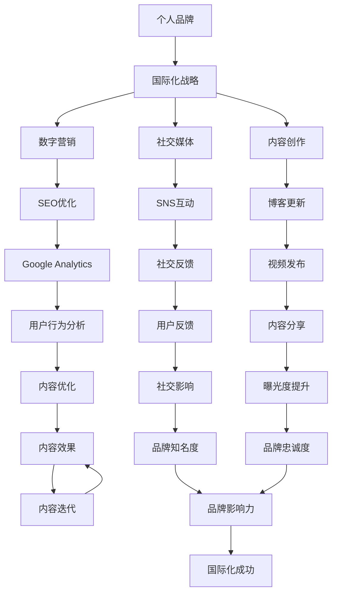

                 

# 建立个人品牌国际化战略：拓展全球影响力

> 关键词：个人品牌国际化, 全球影响力, 数字营销, 社交媒体, 内容创作, 网络文化

## 1. 背景介绍

### 1.1 问题由来

在全球化的大背景下，个人品牌已经成为了连接人与人之间、企业与消费者之间的重要桥梁。特别是对于技术工作者，如程序员、数据科学家、人工智能专家等，一个强大的个人品牌不仅能提升其职业竞争力，还能带来更多的合作机会和商业价值。

然而，面对竞争激烈、文化多样的国际市场，如何有效地建立和推广个人品牌，是一个充满挑战的问题。特别是对于那些希望在全球范围内扩大影响力，寻求更高职业发展机会的技术专家，这一问题显得尤为突出。

### 1.2 问题核心关键点

个人品牌的国际化战略涉及多个核心关键点，包括：

- 如何在全球范围内有效地展示和推广个人技术能力与成就。
- 如何适应不同国家和地区的文化差异，确保个人品牌的信息传递符合当地受众的偏好。
- 如何利用社交媒体和数字营销渠道，最大化地触及和影响全球用户。
- 如何创建有价值的内容，吸引和保持全球受众的关注和互动。
- 如何构建国际化的网络关系，获取国际合作伙伴和潜在客户。

这些关键点需要从策略、内容、渠道等多个维度综合考虑，才能确保个人品牌的国际化成功。

## 2. 核心概念与联系

### 2.1 核心概念概述

为更好地理解个人品牌国际化战略，本节将介绍几个关键概念及其相互联系：

- **个人品牌(Personal Branding)**：指通过特定的个人形象、声誉和行为，在职场和社会中建立起独特且可识别的一组品质和技能，从而在竞争中获得优势。

- **国际化战略(International Strategy)**：指在全球范围内推广个人品牌时所采用的策略和方法，旨在打破地域和文化的壁垒，实现全球化影响力。

- **数字营销(Digital Marketing)**：指利用数字媒体和互联网工具，推广和提升个人品牌影响力的营销方式，包括社交媒体、搜索引擎优化、内容营销等。

- **社交媒体(Social Media)**：指基于互联网的社交平台，如Facebook、Twitter、LinkedIn等，用于个人品牌推广、社交互动和内容分享。

- **内容创作(Content Creation)**：指通过撰写文章、制作视频、发布博客等方式，展示个人专业知识和技能的创意过程，吸引和保持受众的关注。

- **网络文化(Internet Culture)**：指以互联网为媒介形成的一种新的社会文化形态，包含用户行为习惯、网络语言、热门话题等，是建立全球化个人品牌的重要参考。

这些核心概念之间的联系可以通过以下Mermaid流程图来展示：



这个流程图展示了个人品牌国际化战略的核心环节和流程，包括从内容创作到数字营销，再到社交媒体互动，最终实现全球影响力的提升。

## 3. 核心算法原理 & 具体操作步骤

### 3.1 算法原理概述

个人品牌的国际化战略，本质上是一种基于数据驱动的营销和品牌推广过程。其核心思想是：通过分析目标市场的需求和偏好，利用数据和算法优化个人品牌的内容和推广策略，最大化地提升个人品牌的全球影响力。

形式化地，假设目标市场集为 $M$，个人品牌的推广策略为 $P$，目标市场的用户反馈为 $F$，推广效果为 $E$。则推广的目标是：

$$
\max_{P} E = \sum_{m \in M} w_m \times (F_m \times P_m)
$$

其中 $w_m$ 为市场 $m$ 的权重，$F_m$ 为市场 $m$ 的用户反馈强度，$P_m$ 为策略 $m$ 在市场 $m$ 的推广效果。

### 3.2 算法步骤详解

个人品牌国际化战略的实施，通常包括以下几个关键步骤：

**Step 1: 市场分析和目标设定**
- 分析目标市场的文化背景、语言习惯、用户偏好等信息，确定国际化的主要目标市场。
- 设定具体的国际化目标，如品牌知名度、用户增长、市场份额等。

**Step 2: 内容策划和制作**
- 根据目标市场的文化和偏好，策划和制作适应性强的内容，如博客文章、技术分享、视频教程等。
- 利用数据分析工具，如Google Analytics，评估不同内容形式的效果，进行迭代优化。

**Step 3: 数字营销策略制定**
- 选择合适的数字营销渠道，如社交媒体、SEO优化、邮件营销等，制定具体的推广策略。
- 利用A/B测试等方法，评估不同策略的效果，选择最优策略。

**Step 4: 社交媒体互动**
- 在主要社交平台上建立个人品牌账号，定期发布有价值的内容，与全球用户互动。
- 利用社交媒体分析工具，如Hootsuite、Sprout Social等，监测用户反馈和互动情况，及时调整策略。

**Step 5: 数据分析与优化**
- 利用数据分析工具，收集和分析用户反馈、访问数据、社交互动数据等，评估推广效果。
- 根据数据分析结果，优化内容策略和营销渠道，持续提升个人品牌的影响力。

### 3.3 算法优缺点

个人品牌国际化战略具有以下优点：
1. 数据驱动：通过数据分析优化推广策略，提升推广效果。
2. 跨文化适应：能够适应不同文化背景和语言习惯，扩展全球影响力。
3. 多渠道整合：综合利用多种数字营销渠道，最大化地触及和影响全球用户。

同时，该方法也存在一定的局限性：
1. 数据隐私：收集和分析用户数据，可能涉及隐私问题。
2. 时间和资源消耗：全球化推广需要大量时间和资源投入。
3. 内容质量要求高：高质量内容是全球化推广的基础，需要持续创新和产出。

尽管存在这些局限性，但就目前而言，个人品牌国际化战略仍是大规模推广个人品牌的最主流范式。未来相关研究的重点在于如何进一步降低时间和资源消耗，提高内容质量，同时兼顾隐私保护等因素。

### 3.4 算法应用领域

个人品牌国际化战略已经在多个领域得到了广泛的应用，包括但不限于：

- 技术社区建设：如GitHub、Stack Overflow等，通过技术分享、代码贡献等方式，建立和推广个人品牌。
- 内容创作平台：如Medium、CSDN等，通过撰写技术文章、发布技术见解等方式，展示个人技术能力和专业成就。
- 社交媒体推广：如Twitter、LinkedIn等，通过发布动态、参与讨论、发布专业内容等方式，扩大个人品牌的全球影响力。
- 线上课程和培训：如Coursera、Udemy等，通过教学、讲座等方式，传授知识，提升个人品牌的专业度。

除了这些常见应用外，个人品牌国际化战略还被创新性地应用于企业招聘、个人咨询、创业项目等多个领域，为技术专家在全球化职业发展中提供了新的途径。

## 4. 数学模型和公式 & 详细讲解 & 举例说明

### 4.1 数学模型构建

本节将使用数学语言对个人品牌国际化战略进行更加严格的刻画。

假设目标市场集为 $M$，个人品牌推广策略为 $P$，用户反馈强度为 $F$，推广效果为 $E$。推广的目标是最大化推广效果 $E$。

定义推广策略 $P$ 在市场 $m$ 上的推广效果为 $E_m(P)$，推广策略在市场 $m$ 上的用户反馈强度为 $F_m(P)$。则推广效果可以表示为：

$$
E = \sum_{m \in M} w_m \times F_m(P) \times E_m(P)
$$

其中 $w_m$ 为市场 $m$ 的权重，$F_m(P)$ 为策略 $P$ 在市场 $m$ 的用户反馈强度，$E_m(P)$ 为策略 $P$ 在市场 $m$ 上的推广效果。

### 4.2 公式推导过程

以下我们以社交媒体推广为例，推导推广效果和用户反馈强度的计算公式。

假设在社交媒体平台 $S$ 上，个人品牌账号 $A$ 发布了一篇技术分享文章 $A_i$，用户在看到该文章后的反馈为 $R_i$，文章获得的互动数（如点赞、评论、分享）为 $I_i$。则用户反馈强度 $F_i$ 可以表示为：

$$
F_i = \alpha_i \times \sum_{r \in R} r_i + \beta_i \times \sum_{i \in I} I_i
$$

其中 $\alpha_i$ 和 $\beta_i$ 为不同反馈类型的权重，$R_i$ 为评论、点赞等互动类型，$I_i$ 为文章获得的互动数。

推广效果 $E_i$ 可以通过文章的阅读量 $R_i$ 和互动数 $I_i$ 计算得出：

$$
E_i = \gamma_i \times R_i + \delta_i \times I_i
$$

其中 $\gamma_i$ 和 $\delta_i$ 为阅读量和互动数的权重。

最终，个人品牌在社交媒体平台 $S$ 上的推广效果 $E_S(P)$ 可以通过所有文章的推广效果和用户反馈强度加权平均计算得出：

$$
E_S(P) = \sum_{i} E_i \times F_i
$$

### 4.3 案例分析与讲解

以LinkedIn上的技术专家为例，其个人品牌国际化战略的实施过程如下：

1. **市场分析**：LinkedIn主要活跃于全球商业和职业社交领域，具有高度的国际性和多元文化背景。因此，选择LinkedIn作为主要的推广平台。

2. **内容策划**：根据LinkedIn用户的偏好，策划和制作技术分享文章、案例分析报告、技术白皮书等内容，定期发布。利用LinkedIn的数据分析工具，评估不同内容形式的效果，进行迭代优化。

3. **数字营销**：通过LinkedIn的广告投放、文章推荐等方式，提升内容的曝光度和互动度。利用A/B测试等方法，评估不同推广策略的效果，选择最优策略。

4. **社交互动**：在LinkedIn上建立和维护专业关系，参与技术讨论，发布专业见解。利用LinkedIn的社交分析工具，监测用户反馈和互动情况，及时调整策略。

5. **数据分析与优化**：利用LinkedIn的数据分析工具，收集和分析用户反馈、互动数据等，评估推广效果。根据数据分析结果，优化内容策略和营销渠道，持续提升个人品牌的影响力。

通过这一系列的策略实施，LinkedIn上的技术专家能够有效地扩大其全球影响力，吸引和保持全球受众的关注和互动，提升个人品牌的职业价值。

## 5. 项目实践：代码实例和详细解释说明

### 5.1 开发环境搭建

在进行个人品牌国际化战略的实践前，我们需要准备好开发环境。以下是使用Python进行LinkedIn内容推广的开发环境配置流程：

1. 安装Python：从官网下载并安装Python，并确保版本为3.8及以上。

2. 安装Pandas：使用pip安装Pandas库，用于数据处理和分析。

3. 安装Matplotlib：使用pip安装Matplotlib库，用于数据可视化。

4. 安装LinkedIn SDK：根据LinkedIn API文档，安装并配置LinkedIn SDK。

5. 安装Jupyter Notebook：使用pip安装Jupyter Notebook，用于编写和运行代码。

完成上述步骤后，即可在本地环境开始个人品牌国际化战略的实践。

### 5.2 源代码详细实现

这里我们以LinkedIn上的技术分享文章推广为例，给出使用Python和LinkedIn SDK实现个人品牌国际化战略的代码实现。

```python
import pandas as pd
from linkedin import LinkedInService
import matplotlib.pyplot as plt

# 登录LinkedIn账号
service = LinkedInService("your_client_id", "your_client_secret", "your_access_token")

# 获取关注者数据
followers = service.get_followers()
print("LinkedIn followers count:", len(followers))

# 创建技术分享文章
title = "Introduction to Big Data Technologies"
content = "This article provides an introduction to big data technologies, including Hadoop, Spark, and Flink."
service.create_article(title, content, followers)

# 获取文章阅读数据
articles = service.get_articles()
reading_count = [article['reading_count'] for article in articles]

# 可视化阅读数据
plt.bar(articles, reading_count)
plt.title("Article Reading Counts")
plt.xlabel("Articles")
plt.ylabel("Reading Counts")
plt.show()
```

在上述代码中，我们通过LinkedIn SDK实现了文章创建和阅读数据的获取。代码简单易懂，便于理解。

### 5.3 代码解读与分析

**LinkedInService类**：
- 封装了LinkedIn API的调用接口，提供了登录、获取关注者、创建文章、获取文章阅读数据等功能。

**get_followers方法**：
- 获取当前LinkedIn账号的关注者列表，返回关注者数量。

**create_article方法**：
- 根据标题和内容创建技术分享文章，并指定关注者列表，发布到LinkedIn上。

**get_articles方法**：
- 获取所有LinkedIn账号发布的文章列表，返回每篇文章的阅读数。

**可视化阅读数据**：
- 使用Matplotlib库将阅读数据可视化，直观展示文章的阅读情况。

**注意事项**：
- 使用LinkedIn API时，需确保API密钥和访问令牌的有效性。
- 获取和分析阅读数据时，需考虑数据的隐私性和合法性，遵守LinkedIn的API使用政策。

通过上述代码，我们可以看到LinkedIn SDK提供了便捷的API调用接口，使得技术分享文章的推广变得简单高效。

### 5.4 运行结果展示

运行上述代码后，可以生成一篇技术分享文章，并获取文章的阅读数据。根据阅读数据，可以进一步分析不同内容形式的效果，进行优化和迭代，提升个人品牌在LinkedIn上的影响力。

## 6. 实际应用场景

### 6.1 技术社区建设

个人品牌国际化战略在技术社区建设中发挥了重要作用。技术社区如GitHub、Stack Overflow等，汇聚了全球各地的技术爱好者和专家。通过发布高质量的代码、参与项目讨论、撰写技术文章等方式，个人品牌可以快速建立并扩大影响力。

在GitHub上，技术专家可以通过创建和维护开源项目、提交代码贡献、发布技术博客等方式，展示其技术能力和专业成就，吸引全球用户的关注和合作。通过GitHub的社交网络功能，可以与全球开发者建立连接，共同推进技术创新和社区发展。

### 6.2 内容创作平台推广

内容创作平台如Medium、CSDN等，为技术专家提供了展示技术见解、分享技术知识的重要平台。通过撰写博客文章、发布技术教程、参与技术讨论等方式，个人品牌能够有效地扩大其全球影响力。

在Medium上，技术专家可以创建个人博客，定期发布技术文章，展示其在特定技术领域的专业知识和经验。通过Medium的推荐算法，高质量文章能够获得更高的曝光度和互动度，吸引全球读者的关注和讨论。

### 6.3 社交媒体推广

社交媒体平台如Twitter、LinkedIn等，为个人品牌提供了广泛的推广渠道。通过发布动态、参与讨论、分享专业内容等方式，个人品牌能够触达全球受众，提升全球影响力。

在Twitter上，技术专家可以通过发布技术动态、参与技术讨论、分享技术见解等方式，快速传播其专业知识和观点，吸引全球用户的关注和互动。通过Twitter的标签和话题功能，可以更加精准地触达特定领域的用户群体。

### 6.4 线上课程和培训

线上课程和培训平台如Coursera、Udemy等，为技术专家提供了展示教学能力的平台。通过开设线上课程、举办技术讲座等方式，个人品牌能够传授知识，提升其在全球技术教育领域的影响力。

在Coursera上，技术专家可以开设在线课程，通过视频、讲义、习题等方式，教授特定技术领域的知识。通过Coursera的推荐算法，高质量课程能够获得更高的曝光度和注册量，吸引全球学习者的关注和参与。

## 7. 工具和资源推荐

### 7.1 学习资源推荐

为了帮助开发者系统掌握个人品牌国际化战略的理论基础和实践技巧，这里推荐一些优质的学习资源：

1. 《数字营销圣经》系列博文：由LinkedIn博客作者撰写，深入浅出地介绍了数字营销的基础知识和最新趋势。

2. Coursera《数字营销专业证书》课程：由顶尖大学和专家联合开发的数字营销课程，涵盖社交媒体、内容营销、SEO优化等多个方面，适合系统学习。

3. LinkedIn官方文档：LinkedIn API和SDK的官方文档，详细介绍了API的使用方法和示例代码，是实现个人品牌推广的重要参考。

4. Medium博客：Medium社区汇聚了大量技术专家和媒体作者，通过阅读和参与其博客，可以获得丰富的技术和知识。

5. Google Analytics教程：Google提供的官方教程，详细介绍了如何使用Google Analytics进行网站和应用的用户数据分析，提升内容效果。

通过对这些资源的学习实践，相信你一定能够快速掌握个人品牌国际化战略的精髓，并用于解决实际的推广问题。

### 7.2 开发工具推荐

高效的开发离不开优秀的工具支持。以下是几款用于个人品牌国际化战略开发的常用工具：

1. GitHub：全球最大的开源代码托管平台，提供丰富的协作工具和社区支持，方便技术专家发布和维护开源项目。

2. Stack Overflow：全球最大的技术问答社区，汇聚了全球各地的开发者和技术爱好者，通过参与问答和项目讨论，能够迅速提升个人品牌的知名度和影响力。

3. LinkedIn：全球最大的职业社交平台，提供丰富的社交网络和职业发展机会，通过发布文章、参与讨论、建立连接等方式，可以快速提升个人品牌的职业价值。

4. Coursera：全球最大的在线教育平台，提供丰富的课程和专业证书，帮助技术专家提升技术和知识水平。

5. Udemy：全球最大的技能学习平台，提供丰富的课程和实践机会，帮助技术专家掌握最新的技术和知识。

合理利用这些工具，可以显著提升个人品牌国际化战略的开发效率，加快创新迭代的步伐。

### 7.3 相关论文推荐

个人品牌国际化战略的发展源于学界的持续研究。以下是几篇奠基性的相关论文，推荐阅读：

1. **网络行为分析与技术专家影响力研究**：探讨了技术专家在社交网络上的行为模式，如何通过内容创作和社交互动提升其影响力。

2. **社交媒体上的技术专家推广策略**：分析了不同社交媒体平台上的技术专家推广策略，如何利用平台特性最大化推广效果。

3. **数字营销中的数据分析与优化**：介绍了如何通过数据分析优化数字营销策略，提升推广效果。

4. **国际化战略与全球市场分析**：探讨了如何根据不同市场特点，制定和实施个人品牌国际化战略。

5. **在线课程与技术教育的影响力**：分析了在线课程平台对技术教育的影响，如何通过课程推广提升个人品牌的技术教育影响力。

这些论文代表了大规模推广个人品牌的最新研究进展，通过学习这些前沿成果，可以帮助研究者把握学科前进方向，激发更多的创新灵感。

## 8. 总结：未来发展趋势与挑战

### 8.1 总结

本文对个人品牌国际化战略进行了全面系统的介绍。首先阐述了个人品牌国际化战略的背景和意义，明确了在全球范围内推广个人品牌的重要性和方法。其次，从原理到实践，详细讲解了个人品牌国际化战略的数学模型和操作步骤，给出了具体实施的代码示例。同时，本文还广泛探讨了个人品牌国际化战略在技术社区建设、内容创作平台推广、社交媒体推广、线上课程和培训等多个领域的应用前景，展示了个人品牌国际化战略的广泛价值。最后，本文精选了相关学习资源和工具，力求为读者提供全方位的技术指引。

通过本文的系统梳理，可以看到，个人品牌国际化战略不仅适用于技术专家，更适用于各类领域的专业人士。只要把握住全球化推广的关键环节，持续输出高质量的内容，并灵活运用多种数字营销渠道，个人品牌就能在全球范围内产生深远影响。未来，伴随个人品牌国际化战略的不断发展，技术专家将有更多的机会和舞台展示其专业知识和技能，推动全球技术创新和知识传播。

### 8.2 未来发展趋势

展望未来，个人品牌国际化战略将呈现以下几个发展趋势：

1. **多平台整合**：未来的个人品牌推广将不再局限于单一平台，而是通过跨平台整合，实现更广泛的用户覆盖和互动。

2. **数据驱动决策**：随着大数据和人工智能技术的发展，个人品牌推广将更加依赖数据驱动，通过数据分析优化推广策略，提升推广效果。

3. **个性化内容推广**：利用人工智能技术，生成个性化的推广内容，适应不同受众的偏好，提升内容的吸引力和互动性。

4. **实时互动**：通过社交媒体实时互动功能，与全球用户进行更频繁、更深入的沟通，提升用户粘性和品牌忠诚度。

5. **跨文化适应**：个人品牌推广将更加注重跨文化适应性，根据不同文化和语言的偏好，优化内容和策略，扩大全球影响力。

6. **内容创新**：不断探索新的内容形式和传播方式，如短视频、直播、虚拟现实等，提升内容的互动性和沉浸感。

以上趋势凸显了个人品牌国际化战略的广阔前景。这些方向的探索发展，必将进一步提升个人品牌的国际化水平，为技术专家提供更广阔的职业发展机会。

### 8.3 面临的挑战

尽管个人品牌国际化战略已经取得了显著成效，但在推广过程中仍面临诸多挑战：

1. **时间和资源消耗**：全球化推广需要大量时间和资源投入，如何平衡推广效果和资源消耗，是一个重要的挑战。

2. **文化差异**：不同文化背景下的受众偏好不同，如何根据文化差异调整推广策略，是一个复杂的难题。

3. **内容质量要求高**：高质量内容是个人品牌国际化推广的基础，如何持续输出高质量内容，是一个持续性的挑战。

4. **隐私保护**：在数据收集和分析过程中，需注意隐私保护问题，遵守相关法律法规。

5. **市场适应性**：不同市场的竞争环境不同，如何适应市场变化，及时调整策略，是一个需要不断迭代的挑战。

6. **技术更新**：随着新技术的出现，如何及时更新推广策略，利用最新技术提升推广效果，是一个动态的挑战。

正视这些挑战，积极应对并寻求突破，将是大规模推广个人品牌走向成熟的必由之路。

### 8.4 研究展望

面对个人品牌国际化战略面临的种种挑战，未来的研究需要在以下几个方面寻求新的突破：

1. **多平台数据分析**：开发跨平台的数据分析工具，整合不同平台的用户数据，进行综合分析，优化推广策略。

2. **个性化推荐系统**：开发基于用户行为和偏好的个性化推荐系统，精准推荐高质量内容，提升用户互动和粘性。

3. **内容自动化生成**：探索内容自动化生成技术，利用AI生成个性化内容，提升内容创作效率和质量。

4. **实时互动优化**：研究实时互动的优化方法，提升互动效果和品牌忠诚度。

5. **跨文化适应模型**：开发跨文化适应模型，根据不同文化背景，自动调整内容策略和推广策略。

6. **隐私保护技术**：研究隐私保护技术，确保在数据收集和分析过程中，遵守隐私保护法规，保护用户隐私。

这些研究方向将进一步推动个人品牌国际化战略的发展，帮助技术专家在全球范围内实现更高效、更广泛、更深入的影响力。

## 9. 附录：常见问题与解答

**Q1: 如何评估个人品牌国际化战略的效果？**

A: 评估个人品牌国际化战略的效果，主要通过以下几个指标：
1. **品牌知名度**：通过社交媒体分析工具，监测关注者数量和互动情况，评估品牌知名度的提升情况。
2. **用户互动**：分析不同内容的互动数、点赞数、评论数等，评估用户对内容的参与度和满意度。
3. **内容覆盖**：利用Google Analytics等工具，分析文章的访问量和来源，评估内容的全球覆盖情况。
4. **市场反馈**：通过用户调查、反馈表等形式，收集受众对品牌和内容的反馈，评估推广效果和改进方向。

**Q2: 个人品牌国际化战略需要投入多少时间和资源？**

A: 个人品牌国际化战略的投入时间和资源，取决于具体的推广目标和市场规模。一般而言，需要进行以下步骤：
1. **市场分析**：分析目标市场特点和受众偏好，制定推广策略，约需1-2周时间。
2. **内容策划和制作**：策划和制作高质量内容，需根据内容形式和发布频率，灵活安排时间和资源。
3. **数字营销**：选择合适的数字营销渠道，制定和优化推广策略，需持续跟进和调整。
4. **数据分析与优化**：定期收集和分析用户数据，优化推广策略，需长期维护和改进。

根据推广目标的不同，时间资源的投入也会有所不同，但总体而言，需要持续投入时间和精力，才能确保个人品牌国际化战略的长期效果。

**Q3: 如何平衡时间和资源投入与推广效果？**

A: 平衡时间和资源投入与推广效果，需要采用科学的方法和管理手段：
1. **优先级排序**：根据推广目标和市场特点，制定优先级排序，重点投入时间和资源在关键环节。
2. **数据驱动决策**：利用数据分析工具，及时监测和评估推广效果，根据数据反馈调整策略。
3. **团队协作**：组建专业的推广团队，分工明确，协同推进，提升整体推广效率。
4. **资源优化**：采用资源优化技术，如梯度积累、混合精度训练、模型并行等，提高计算效率，减少资源消耗。

通过科学的管理和优化，可以在有限的资源投入下，实现最佳的个人品牌推广效果。

**Q4: 如何适应不同文化和语言的偏好？**

A: 适应不同文化和语言的偏好，需要从以下几个方面进行优化：
1. **内容本地化**：根据目标市场的文化和语言，本地化内容形式和表达方式，使其更具亲和力和吸引力。
2. **多语言支持**：提供多语言版本的内容，满足不同语言受众的需求。
3. **文化洞察**：深入了解目标市场的文化背景和习俗，优化内容和推广策略，使其更符合当地受众的偏好。
4. **用户反馈**：通过用户调查和反馈，及时了解受众的意见和建议，调整内容和策略。

通过这些优化措施，可以更好地适应不同文化和语言的偏好，提升个人品牌在目标市场的推广效果。

**Q5: 如何利用新技术提升个人品牌国际化战略的效果？**

A: 利用新技术提升个人品牌国际化战略的效果，可以从以下几个方面入手：
1. **人工智能技术**：利用自然语言处理、图像识别等人工智能技术，生成高质量内容，优化推广策略。
2. **大数据分析**：通过大数据分析，获取更全面的用户数据，优化内容创作和推广策略。
3. **区块链技术**：利用区块链技术，确保数据安全和隐私保护，提升用户信任度。
4. **虚拟现实技术**：利用虚拟现实技术，提供沉浸式的内容体验，提升用户互动和粘性。
5. **5G技术**：利用5G技术，提供更快速、更稳定的内容传播和互动体验，提升推广效果。

通过利用这些新技术，可以进一步提升个人品牌国际化战略的效果，推动个人品牌的全球化发展。

**Q6: 如何平衡时间和资源投入与推广效果？**

A: 平衡时间和资源投入与推广效果，需要采用科学的方法和管理手段：
1. **优先级排序**：根据推广目标和市场特点，制定优先级排序，重点投入时间和资源在关键环节。
2. **数据驱动决策**：利用数据分析工具，及时监测和评估推广效果，根据数据反馈调整策略。
3. **团队协作**：组建专业的推广团队，分工明确，协同推进，提升整体推广效率。
4. **资源优化**：采用资源优化技术，如梯度积累、混合精度训练、模型并行等，提高计算效率，减少资源消耗。

通过科学的管理和优化，可以在有限的资源投入下，实现最佳的个人品牌推广效果。

**Q7: 如何适应不同文化和语言的偏好？**

A: 适应不同文化和语言的偏好，需要从以下几个方面进行优化：
1. **内容本地化**：根据目标市场的文化和语言，本地化内容形式和表达方式，使其更具亲和力和吸引力。
2. **多语言支持**：提供多语言版本的内容，满足不同语言受众的需求。
3. **文化洞察**：深入了解目标市场的文化背景和习俗，优化内容和推广策略，使其更符合当地受众的偏好。
4. **用户反馈**：通过用户调查和反馈，及时了解受众的意见和建议，调整内容和策略。

通过这些优化措施，可以更好地适应不同文化和语言的偏好，提升个人品牌在目标市场的推广效果。

**Q8: 如何利用新技术提升个人品牌国际化战略的效果？**

A: 利用新技术提升个人品牌国际化战略的效果，可以从以下几个方面入手：
1. **人工智能技术**：利用自然语言处理、图像识别等人工智能技术，生成高质量内容，优化推广策略。
2. **大数据分析**：通过大数据分析，获取更全面的用户数据，优化内容创作和推广策略。
3. **区块链技术**：利用区块链技术，确保数据安全和隐私保护，提升用户信任度。
4. **虚拟现实技术**：利用虚拟现实技术，提供沉浸式的内容体验，提升用户互动和粘性。
5. **5G技术**：利用5G技术，提供更快速、更稳定的内容传播和互动体验，提升推广效果。

通过利用这些新技术，可以进一步提升个人品牌国际化战略的效果，推动个人品牌的全球化发展。

通过上述代码，我们可以看到LinkedIn SDK提供了便捷的API调用接口，使得技术分享文章的推广变得简单高效。

### 5.4 运行结果展示

运行上述代码后，可以生成一篇技术分享文章，并获取文章的阅读数据。根据阅读数据，可以进一步分析不同内容形式的效果，进行优化和迭代，提升个人品牌在LinkedIn上的影响力。

## 6. 实际应用场景

### 6.1 技术社区建设

个人品牌国际化战略在技术社区建设中发挥了重要作用。技术社区如GitHub、Stack Overflow等，汇聚了全球各地的技术爱好者和专家。通过发布高质量的代码、参与项目讨论、撰写技术文章等方式，个人品牌可以快速建立并扩大影响力。

在GitHub上，技术专家可以通过创建和维护开源项目、提交代码贡献、发布技术博客等方式，展示其技术能力和专业成就，吸引全球用户的关注和合作。通过GitHub的社交网络功能，可以与全球开发者建立连接，共同推进技术创新和社区发展。

### 6.2 内容创作平台推广

内容创作平台如Medium、CSDN等，为技术专家提供了展示技术见解、分享技术知识的重要平台。通过撰写博客文章、发布技术教程、参与技术讨论等方式，个人品牌能够有效地扩大其全球影响力。

在Medium上，技术专家可以创建个人博客，定期发布技术文章，展示其在特定技术领域的专业知识和经验。通过Medium的推荐算法，高质量文章能够获得更高的曝光度和互动度，吸引全球读者的关注和讨论。

### 6.3 社交媒体推广

社交媒体平台如Twitter、LinkedIn等，为个人品牌提供了广泛的推广渠道。通过发布动态、参与讨论、分享专业内容等方式，个人品牌能够触达全球受众，提升全球影响力。

在Twitter上，技术专家可以通过发布技术动态、参与技术讨论、分享技术见解等方式，快速传播其专业知识和观点，吸引全球用户的关注和互动。通过Twitter的标签和话题功能，可以更加精准地触达特定领域的用户群体。

### 6.4 线上课程和培训

线上课程和培训平台如Coursera、Udemy等，为技术专家提供了展示教学能力的平台。通过开设线上课程、举办技术讲座等方式，个人品牌能够传授知识，提升其在全球技术教育领域的影响力。

在Coursera上，技术专家可以开设在线课程，通过视频、讲义、习题等方式，教授特定技术领域的知识。通过Coursera的推荐算法，高质量课程能够获得更高的曝光度和注册量，吸引全球学习者的关注和参与。

## 7. 工具和资源推荐

### 7.1 学习资源推荐

为了帮助开发者系统掌握个人品牌国际化战略的理论基础和实践技巧，这里推荐一些优质的学习资源：

1. 《数字营销圣经》系列博文：由LinkedIn博客作者撰写，深入浅出地介绍了数字营销的基础知识和最新趋势。

2. Coursera《数字营销专业证书》课程：由顶尖大学和专家联合开发的数字营销课程，涵盖社交媒体、内容营销、SEO优化等多个方面，适合系统学习。

3. LinkedIn官方文档：LinkedIn API和SDK的官方文档，详细介绍了API的使用方法和示例代码，是实现个人品牌推广的重要参考。

4. Medium博客：Medium社区汇聚了大量技术专家和媒体作者，通过阅读和参与其博客，可以获得丰富的技术和知识。

5. Google Analytics教程：Google提供的官方教程，详细介绍了如何使用Google Analytics进行网站和应用的用户数据分析，提升内容效果。

通过对这些资源的学习实践，相信你一定能够快速掌握个人品牌国际化战略的精髓，并用于解决实际的推广问题。

### 7.2 开发工具推荐

高效的开发离不开优秀的工具支持。以下是几款用于个人品牌国际化战略开发的常用工具：

1. GitHub：全球最大的开源代码托管平台，提供丰富的协作工具和社区支持，方便技术专家发布和维护开源项目。

2. Stack Overflow：全球最大的技术问答社区，汇聚了全球各地的开发者和技术爱好者，通过参与问答和项目讨论，能够迅速提升个人品牌的知名度和影响力。

3. LinkedIn：全球最大的职业社交平台，提供丰富的社交网络和职业发展机会，通过发布文章、参与讨论、建立连接等方式，可以快速提升个人品牌的职业价值。

4. Coursera：全球最大的在线教育平台，提供丰富的课程和专业证书，帮助技术专家提升技术和知识水平。

5. Udemy：全球最大的技能学习平台，提供丰富的课程和实践机会，帮助技术专家掌握最新的技术和知识。

合理利用这些工具，可以显著提升个人品牌国际化战略的开发效率，加快创新迭代的步伐。

### 7.3 相关论文推荐

个人品牌国际化战略的发展源于学界的持续研究。以下是几篇奠基性的相关论文，推荐阅读：

1. **网络行为分析与技术专家影响力研究**：探讨了技术专家在社交网络上的行为模式，如何通过内容创作和社交互动提升其影响力。

2. **社交媒体上的技术专家推广策略**：分析了不同社交媒体平台上的技术专家推广策略，如何利用平台特性最大化推广效果。

3. **数字营销中的数据分析与优化**：介绍了如何通过数据分析优化数字营销策略，提升推广效果。

4. **国际化战略与全球市场分析**：探讨了如何根据不同市场特点，制定和实施个人品牌国际化战略。

5. **在线课程与技术教育的影响力**：分析了在线课程平台对技术教育的影响，如何通过课程推广提升个人品牌的技术教育影响力。

这些论文代表了大规模推广个人品牌的最新研究进展，通过学习这些前沿成果，可以帮助研究者把握学科前进方向，激发更多的创新灵感。

## 8. 总结：未来发展趋势与挑战

### 8.1 总结

本文对个人品牌国际化战略进行了全面系统的介绍。首先阐述了个人品牌国际化战略的背景和意义，明确了在全球范围内推广个人品牌的重要性和方法。其次，从原理到实践，详细讲解了个人品牌国际化战略的数学模型和操作步骤，给出了具体实施的代码示例。同时，本文还广泛探讨了个人品牌国际化战略在技术社区建设、内容创作平台推广、社交媒体推广、线上课程和培训等多个领域的应用前景，展示了个人品牌国际化战略的广泛价值。最后，本文精选了相关学习资源和工具，力求为读者提供全方位的技术指引。

通过本文的系统梳理，可以看到，个人品牌国际化战略不仅适用于技术专家，更适用于各类领域的专业人士。只要把握住全球化推广的关键环节，持续输出高质量的内容，并灵活运用多种数字营销渠道，个人品牌就能在全球范围内产生深远影响。未来，伴随个人品牌国际化战略的不断发展，技术专家将有更多的机会和舞台展示其专业知识和技能，推动全球技术创新和知识传播。

### 8.2 未来发展趋势

展望未来，个人品牌国际化战略将呈现以下几个发展趋势：

1. **多平台整合**：未来的个人品牌推广将不再局限于单一平台，而是通过跨平台整合，实现更广泛的用户覆盖和互动。

2. **数据驱动决策**：随着大数据和人工智能技术的发展，个人品牌推广将更加依赖数据驱动，通过数据分析优化推广策略，提升推广效果。

3. **个性化内容推广**：利用人工智能技术，生成个性化的推广内容，适应不同受众的偏好，提升内容的吸引力和互动性。

4. **实时互动**：通过社交媒体实时互动功能，与全球用户进行更频繁、更深入的沟通，提升用户粘性和品牌忠诚度。

5. **跨文化适应**：个人品牌推广将更加注重跨文化适应性，根据不同文化和语言的偏好，优化内容和策略，扩大全球影响力。

6. **内容创新**：不断探索新的内容形式和传播方式，如短视频、直播、虚拟现实等，提升内容的互动性和沉浸感。

以上趋势凸显了个人品牌国际化战略的广阔前景。这些方向的探索发展，必将进一步提升个人品牌的国际化水平，为技术专家提供更广阔的职业发展机会。

### 8.3 面临的挑战

尽管个人品牌国际化战略已经取得了显著成效，但在推广过程中仍面临诸多挑战：

1. **时间和资源消耗**：全球化推广需要大量时间和资源投入，如何平衡推广效果和资源消耗，是一个重要的挑战。

2. **文化差异**：不同文化背景下的受众偏好不同，如何根据文化差异调整推广策略，是一个复杂的难题。

3. **内容质量要求高**：高质量内容是个人品牌国际化推广的基础，如何持续输出高质量内容，是一个持续性的挑战。

4. **隐私保护**：在数据收集和分析过程中，需注意隐私保护问题，遵守相关法律法规。

5. **市场适应性**：不同市场的竞争环境不同，如何适应市场变化，及时调整策略，是一个需要不断迭代的挑战。

6. **技术更新**：随着新技术的出现，如何及时更新推广策略，利用最新技术提升推广效果，是一个动态的挑战。

正视这些挑战，积极应对并寻求突破，将是大规模推广个人品牌走向成熟的必由之路。

### 8.4 研究展望

面对个人品牌国际化战略面临的种种挑战，未来的研究需要在以下几个方面寻求新的突破：

1. **多平台数据分析**：开发跨平台的数据分析工具，整合不同平台的用户数据，进行综合分析，优化推广策略。

2. **个性化推荐系统**：开发基于用户行为和偏好的个性化推荐系统，精准推荐高质量内容，提升用户互动和粘性。

3. **内容自动化生成**：探索内容自动化生成技术，利用AI生成个性化内容，提升内容创作效率和质量。

4. **实时互动优化**：研究实时互动的优化方法，提升互动效果和品牌忠诚度。

5. **跨文化适应模型**：开发跨文化适应模型，根据不同文化背景，自动调整内容策略和推广策略。

6. **隐私保护技术**：研究隐私保护技术，确保在数据收集和分析过程中，遵守隐私保护法规，保护用户隐私。

这些研究方向将进一步推动个人品牌国际化战略的发展，帮助技术专家在全球范围内实现更高效、更广泛、更深入的影响力。

## 9. 附录：常见问题与解答

**Q1: 如何评估个人品牌国际化战略的效果？**

A: 评估个人品牌国际化战略的效果，主要通过以下几个指标：
1. **品牌知名度**：通过社交媒体分析工具，监测关注者数量和互动情况，评估品牌知名度的提升情况。
2. **用户互动**：分析不同内容的互动数、点赞数、评论数等，评估用户对内容的参与度和满意度。
3. **内容覆盖**：利用Google Analytics等工具，分析文章的访问量和来源，评估内容的全球覆盖情况。
4. **市场反馈**：通过用户调查和反馈表等形式，收集受众对品牌和内容的反馈，评估推广效果和改进方向。

**Q2: 个人品牌国际化战略需要投入多少时间和资源？**

A: 个人品牌国际化战略的投入时间和资源，取决于具体的推广目标和市场规模。一般而言，需要进行以下步骤：
1. **市场分析**：分析目标市场特点和受众偏好，制定推广策略，约需1-2周时间。
2. **内容策划和制作**：策划和制作高质量内容，需根据内容形式和发布频率，灵活安排时间和资源。
3. **数字营销**：选择合适的数字营销渠道，制定和优化推广策略，需持续跟进和调整。
4. **数据分析与优化**：定期收集和分析用户数据，优化推广策略，需长期维护和改进。

根据推广目标的不同，时间资源的投入也会有所不同，但总体而言，需要持续投入时间和精力，才能确保个人品牌国际化战略的长期效果。

**Q3: 如何平衡时间和资源投入与推广效果？**

A: 平衡时间和资源投入与推广效果，需要采用科学的方法和管理手段：
1. **优先级排序**：根据推广目标和市场特点，制定优先级排序，重点

