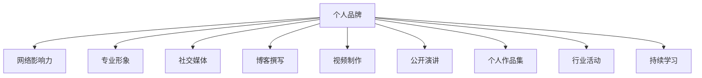

                 

# 建立个人品牌的步骤和技巧

> 关键词：个人品牌, 网络影响力, 专业形象, 社交媒体, 博客撰写, 视频制作, 公开演讲, 个人作品集, 行业活动, 持续学习

## 1. 背景介绍

在当今竞争激烈的市场环境中，建立强大的个人品牌能够显著提升个人在行业内的影响力和知名度。无论是求职者、创业者，还是自由职业者，拥有独特的个人品牌都能带来更多的机会和资源。本文将全面介绍建立个人品牌的关键步骤和技巧，帮助读者塑造并提升个人形象，在职业发展中取得成功。

### 1.1 问题由来

在互联网时代，个人品牌建设已成为职业发展的核心竞争力之一。通过在社交媒体、博客、视频平台等渠道发布高质量内容，个人品牌不仅能吸引潜在雇主、合作伙伴的注意，还能在求职、创业、咨询等不同场景中发挥重要作用。

### 1.2 问题核心关键点

建立个人品牌的关键在于以下几个方面：
- **一致性**：在所有渠道保持一致的品牌形象，包括个人形象、风格、价值观等。
- **内容质量**：发布高质量、有深度、有价值的内容，以吸引受众。
- **互动性**：积极与受众互动，建立长期稳定的关系。
- **差异化**：突出个人特色，构建独一无二的品牌形象。
- **持续性**：个人品牌的建立和提升是一个长期过程，需要持续投入时间和精力。

## 2. 核心概念与联系

### 2.1 核心概念概述

本节将介绍几个与个人品牌建设密切相关的核心概念：

- **个人品牌**：指个人在特定领域内通过特定行为和表现形成的独特形象，包括专业技能、知识背景、价值观等。

- **网络影响力**：指个人在社交媒体、博客、视频平台等网络渠道上的关注度和影响力。

- **专业形象**：指个人在专业领域的形象和地位，包括但不限于教育背景、工作经验、发表作品等。

- **社交媒体**：指各种网络平台，如Twitter、LinkedIn、Instagram等，是个人品牌建设的重要渠道。

- **博客撰写**：通过发布高质量技术文章或行业分析，展示专业知识和见解。

- **视频制作**：通过发布视频教程、演讲等，以视觉方式展示个人专业能力和风采。

- **公开演讲**：通过在行业会议、研讨会等公开场合发表演讲，提升个人知名度和影响力。

- **个人作品集**：收集并展示个人在各种项目和任务中的成功案例和作品。

- **行业活动**：参加行业会议、讲座、培训等活动，扩大个人影响力和人脉资源。

- **持续学习**：不断更新知识和技能，保持与行业发展同步。

这些核心概念之间的逻辑关系可以通过以下Mermaid流程图来展示：

这个流程图展示了个体品牌建设的核心概念及其之间的关系：

1. 个人品牌通过网络影响力、专业形象等多方面的表现来塑造和推广。
2. 社交媒体、博客撰写、视频制作等渠道是个人品牌建设的重要工具。
3. 公开演讲、行业活动、个人作品集等展示方式能够进一步增强个人品牌的可见性和可信度。
4. 持续学习则是个人品牌持续成长和更新的重要保障。

## 3. 核心算法原理 & 具体操作步骤

### 3.1 算法原理概述

建立个人品牌的过程，本质上是通过一系列有策略的行为和内容发布，在目标受众中建立一致、独特、有价值的影响形象。具体来说，可以通过以下步骤实现：

1. **确定目标受众**：明确个人品牌的定位和目标受众群体。
2. **选择品牌渠道**：选择合适的社交媒体、博客、视频等渠道进行品牌推广。
3. **制定内容策略**：规划发布内容的类型、频率和传播方式。
4. **内容创作与发布**：创作高质量、有深度、有价值的内容，并定期发布。
5. **互动与反馈**：积极与受众互动，及时回应反馈，建立良好关系。
6. **持续优化**：根据受众反馈和数据分析结果，不断优化个人品牌形象和内容策略。

### 3.2 算法步骤详解

以下详细讲解建立个人品牌的具体操作步骤：

#### 3.2.1 确定目标受众

明确个人品牌的定位和目标受众是成功建立个人品牌的前提。以下是具体步骤：

1. **分析自身优势**：识别自己在技术、经验、知识等方面的优势和独特之处。
2. **研究市场需求**：分析目标受众的需求和关注点，确定自身品牌的价值主张。
3. **设定品牌定位**：根据自身优势和市场需求，设定明确的品牌定位和核心价值。

#### 3.2.2 选择品牌渠道

选择合适的品牌推广渠道，可以最大化提升个人品牌的影响力。以下是常见品牌渠道及其特点：

1. **社交媒体平台**：如LinkedIn、Twitter、Instagram等，适合广泛传播和互动。
2. **专业博客**：如Medium、CSDN等，适合深度文章和知识分享。
3. **视频平台**：如YouTube、Bilibili等，适合视觉展示和技术讲解。
4. **公开演讲和行业活动**：如TEDx、行业会议等，适合展示个人魅力和专业能力。
5. **个人作品集网站**：如个人GitHub、Behance等，适合展示项目和技术作品。

#### 3.2.3 制定内容策略

制定有策略的内容发布计划，可以确保品牌信息的一致性和有效传播。以下是内容策略的关键要素：

1. **内容类型**：根据受众需求和自身优势，选择适合的内容类型，如技术文章、教程视频、行业分析等。
2. **发布频率**：设定合理的发布频率，确保品牌信息持续传递。
3. **内容质量**：确保每篇/每个视频内容都有深度和价值，避免低质量内容损害品牌形象。
4. **传播方式**：选择适合的传播方式，如博客文章分享、视频平台上传、社交媒体发布等。

#### 3.2.4 内容创作与发布

创作高质量、有深度、有价值的内容，是建立个人品牌的关键。以下是具体步骤：

1. **选题和规划**：根据目标受众需求和自身优势，规划内容选题和结构。
2. **创作与编辑**：撰写或制作内容，并进行细致的编辑和校对。
3. **发布和宣传**：选择合适的渠道发布内容，并采取适当措施进行宣传，吸引更多关注。
4. **互动和反馈**：积极与受众互动，回应评论和反馈，建立良好关系。

#### 3.2.5 互动与反馈

积极与受众互动，可以增强品牌影响力和受众粘性。以下是具体步骤：

1. **回应评论**：及时回复受众评论，展示对受众的关注和尊重。
2. **建立社群**：通过建立微信群、QQ群等社群，加强与受众的互动和联系。
3. **定期互动**：定期举办直播、问答等活动，保持与受众的互动。

#### 3.2.6 持续优化

持续优化个人品牌形象和内容策略，是确保品牌长期健康发展的重要保障。以下是具体步骤：

1. **数据分析**：利用数据分析工具，跟踪受众反馈和互动数据，评估品牌效果。
2. **调整策略**：根据数据分析结果，调整内容策略和发布计划。
3. **学习与进步**：持续学习新技术、新知识，不断提升自身专业水平。

### 3.3 算法优缺点

建立个人品牌的方法有其优点和局限性：

**优点**：

1. **提升知名度**：通过高质量内容发布，吸引大量关注，提升个人在行业内的知名度。
2. **增强可信度**：通过实际案例和技术分享，展示专业能力和知识深度，增强受众信任感。
3. **扩大人脉**：通过积极互动和社群建立，扩大人脉资源，结识更多同行和合作伙伴。

**缺点**：

1. **时间成本高**：内容创作和渠道推广需要大量时间和精力，短期内难以见效。
2. **资源投入大**：高质量内容创作需要专业技能和时间，初期资源投入较大。
3. **效果不稳定**：个人品牌的建立和提升受多种因素影响，效果不一定稳定。

### 3.4 算法应用领域

建立个人品牌的方法广泛应用于以下几个领域：

1. **求职与面试**：通过建立专业形象和展示作品集，提升求职成功率和面试表现。
2. **创业与投资**：通过打造个人品牌，吸引投资者关注，获取更多创业资源和资金。
3. **咨询与顾问**：通过展示专业知识和经验，增强客户信任，提升咨询效果和业务量。
4. **学术研究与教学**：通过发表高质量论文和参加行业活动，提升学术影响力和教学效果。
5. **自由职业与独立开发**：通过建立品牌形象，吸引更多客户和项目合作机会。

## 4. 数学模型和公式 & 详细讲解 & 举例说明

### 4.1 数学模型构建

在建立个人品牌的过程中，虽然没有严格的数学模型，但可以通过一些关键指标来评估和优化品牌效果。以下是几个关键指标及其数学模型：

1. **关注度（Followers）**：指在社交媒体平台上关注者数量，可以反映品牌的可见度和影响力。
2. **参与度（Engagement）**：指受众与内容的互动程度，包括点赞、评论、分享等行为，可以反映内容的吸引力和受众粘性。
3. **转化率（Conversion Rate）**：指关注者或受众转化为潜在客户或合作伙伴的比例，可以反映品牌的实际效果。
4. **点击率（Click-Through Rate, CTR）**：指内容被点击的比例，可以反映内容的质量和吸引力。

### 4.2 公式推导过程

以关注度为例，关注度可以通过以下数学模型进行推导：

$$
\text{Followers} = f(\text{Content Quality}, \text{Channel Choice}, \text{Interaction Strategy})
$$

其中：

- **Content Quality**：内容质量，包括内容深度、原创性、技术性等。
- **Channel Choice**：渠道选择，包括渠道的受众数量、互动方式等。
- **Interaction Strategy**：互动策略，包括与受众的互动频率、互动内容等。

通过分析这些因素，可以制定更加有效的品牌推广策略。

### 4.3 案例分析与讲解

以下是一个建立个人品牌的成功案例分析：

**案例背景**：李明是一名软件工程师，希望通过建立个人品牌提升自己在技术界的知名度和影响力。

**步骤分析**：

1. **确定目标受众**：李明确定目标受众为软件开发者、技术爱好者和雇主。
2. **选择品牌渠道**：李明选择GitHub、Medium、Twitter等平台进行品牌推广。
3. **制定内容策略**：李明制定了每月发布3篇技术文章和每周分享一次技术视频的内容策略。
4. **内容创作与发布**：李明在GitHub上发布项目代码和文档，在Medium上撰写深度技术文章，在Twitter上分享最新技术动态和思考。
5. **互动与反馈**：李明积极回应受众评论和提问，建立社群与受众互动。
6. **持续优化**：李明根据数据分析结果调整内容策略和发布计划，不断提升个人品牌形象。

通过以上步骤，李明成功地建立了个人品牌，不仅在技术界获得了广泛认可，还吸引了多家大公司的面试机会。

## 5. 项目实践：代码实例和详细解释说明

### 5.1 开发环境搭建

在进行个人品牌建立的过程中，需要选择合适的开发环境。以下是一些常用的开发环境及其搭建方法：

1. **开发工具**：如VSCode、Sublime Text等，提供高效的内容创作和编辑功能。
2. **版本控制**：如Git、SVN等，确保内容创作的版本管理和协作。
3. **云服务**：如GitHub、Medium等，提供内容发布和存储平台。
4. **数据分析**：如Google Analytics、YouTube Analytics等，跟踪品牌效果和受众互动。

### 5.2 源代码详细实现

以下是个人品牌建立过程中常用的代码实现方法：

1. **社交媒体接口**：通过调用社交媒体API，实现内容的自动发布和互动管理。
2. **数据分析脚本**：使用Python、R等语言编写脚本，进行受众数据分析和内容效果评估。
3. **内容创作工具**：使用Markdown、LaTeX等工具，提高内容创作效率和质量。

### 5.3 代码解读与分析

在代码实现过程中，需要关注以下关键点：

1. **API调用**：确保API调用正确无误，保证内容的及时发布和互动管理。
2. **数据处理**：对受众数据进行清洗和分析，提取有价值的信息。
3. **内容优化**：根据数据分析结果，优化内容策略和发布计划。

### 5.4 运行结果展示

在个人品牌建立过程中，可以通过以下方式展示运行结果：

1. **关注者数量**：定期统计社交媒体上的关注者数量，评估品牌知名度。
2. **互动数据**：统计受众的点赞、评论、分享等互动数据，评估内容吸引力和受众粘性。
3. **点击率**：跟踪内容点击率，评估内容质量和受众兴趣。

## 6. 实际应用场景

### 6.1 求职与面试

在求职过程中，建立强大的个人品牌可以显著提升求职成功率和面试表现。以下是具体步骤：

1. **建立专业形象**：通过发布技术文章、项目案例等，展示自己的技术能力和项目经验。
2. **展示作品集**：在GitHub等平台展示个人项目和技术实现，吸引潜在雇主的注意。
3. **参与行业活动**：参加行业会议、讲座等活动，展示个人魅力和专业能力。

### 6.2 创业与投资

在创业过程中，建立个人品牌可以吸引更多投资者和合作伙伴的关注。以下是具体步骤：

1. **打造商业案例**：通过撰写商业计划书、发布产品演示视频等，展示商业理念和技术优势。
2. **参加创业大赛**：参加各种创业比赛和活动，展示项目成果和商业前景。
3. **建立社群**：通过建立社群和社交媒体账号，扩大人脉资源，结识更多投资者和合作伙伴。

### 6.3 咨询与顾问

在咨询和顾问业务中，建立个人品牌可以增强客户信任和提升咨询效果。以下是具体步骤：

1. **展示专业知识**：通过撰写行业分析文章、发布技术讲座视频等，展示专业知识和经验。
2. **发布案例研究**：发布成功案例和项目报告，展示实际效果和业务成果。
3. **参与行业活动**：参加行业会议、讲座等活动，建立行业声誉和人际关系。

### 6.4 学术研究与教学

在学术研究和教学中，建立个人品牌可以提升学术影响力和教学效果。以下是具体步骤：

1. **发表论文**：在学术期刊、会议等平台发布研究成果，展示学术成就。
2. **教学资源共享**：在博客、视频平台等渠道分享教学资源和经验，帮助学生和同行。
3. **参与学术活动**：参加学术会议、讲座等活动，扩大学术影响力和人脉资源。

### 6.5 未来应用展望

随着技术的发展，个人品牌建立的方法和工具将不断更新和优化。以下是未来应用展望：

1. **多模态品牌推广**：结合文本、图像、视频等多种形式，增强品牌影响力和吸引力。
2. **AI辅助品牌建设**：利用AI技术进行内容生成、数据分析和互动管理，提高品牌建设效率。
3. **元宇宙品牌推广**：在虚拟世界中进行品牌推广，扩大品牌影响力，吸引更多关注。

## 7. 工具和资源推荐

### 7.1 学习资源推荐

为了帮助读者系统掌握建立个人品牌的方法和技巧，这里推荐一些优质的学习资源：

1. **《打造个人品牌》书籍**：系统介绍个人品牌建设的步骤、方法和技巧，适合初学者和进阶读者。
2. **《社交媒体营销》课程**：由行业专家开设的社交媒体营销课程，涵盖社交媒体的各个方面。
3. **《内容营销》博客**：提供高质量的内容营销策略和案例分析，适合内容创作者和企业品牌经理。
4. **《数据分析入门》课程**：介绍常用的数据分析工具和技巧，适合品牌经理和运营人员。
5. **《数字营销》课程**：涵盖数字营销的各个方面，包括SEO、SEM、社交媒体等，适合品牌经理和营销人员。

通过对这些资源的学习实践，相信读者一定能够快速掌握建立个人品牌的方法和技巧，并用于提升自身职业发展和竞争力。

### 7.2 开发工具推荐

在进行个人品牌建立的过程中，选择合适的开发工具可以显著提升效率和效果。以下是一些常用的开发工具及其特点：

1. **GitHub**：代码托管平台，支持版本控制、协作和项目管理。
2. **Medium**：内容发布平台，支持博客文章、图片、视频等内容的发布。
3. **YouTube**：视频平台，支持高质量视频内容的发布和管理。
4. **Twitter**：社交媒体平台，适合快速发布和互动。
5. **Google Analytics**：数据分析工具，提供详细的受众数据和分析报告。

### 7.3 相关论文推荐

建立个人品牌的技术和理论不断发展和更新，以下是几篇奠基性的相关论文，推荐阅读：

1. **《网络品牌建设》论文**：介绍网络品牌建设的理论基础和实践方法，适合品牌经理和市场营销人员。
2. **《内容营销策略》论文**：深入探讨内容营销的理论和策略，适合内容创作者和企业品牌经理。
3. **《数字营销趋势》论文**：分析数字营销的最新趋势和技术，适合品牌经理和营销人员。
4. **《社交媒体分析》论文**：介绍社交媒体分析的原理和方法，适合社交媒体营销人员和数据分析师。

## 8. 总结：未来发展趋势与挑战

### 8.1 研究成果总结

建立个人品牌的方法和技巧已经得到了广泛的应用和认可。通过内容创作、渠道推广、互动反馈等步骤，个人品牌可以显著提升知名度、可信度和影响力。

### 8.2 未来发展趋势

展望未来，个人品牌建立将呈现以下几个发展趋势：

1. **多渠道融合**：个人品牌推广将结合多种渠道，如社交媒体、博客、视频、公开演讲等，全面提升品牌效果。
2. **技术工具创新**：利用AI、大数据等技术，进行内容生成、数据分析和互动管理，提高品牌建设效率。
3. **元宇宙品牌推广**：在虚拟世界中进行品牌推广，扩大品牌影响力，吸引更多关注。

### 8.3 面临的挑战

尽管个人品牌建立已经取得了显著成果，但在迈向更加智能化、普适化应用的过程中，仍面临诸多挑战：

1. **资源投入大**：高质量内容创作和渠道推广需要大量时间和精力，初期资源投入较大。
2. **效果不稳定**：个人品牌的建立和提升受多种因素影响，效果不一定稳定。
3. **技术门槛高**：利用AI、大数据等技术进行品牌推广，需要较高的技术门槛。
4. **内容质量要求高**：高质量的内容是建立品牌的基础，但创作高质量内容需要较高的专业技能。

### 8.4 研究展望

面对个人品牌建立所面临的挑战，未来的研究需要在以下几个方面寻求新的突破：

1. **自动化内容创作**：利用AI技术进行内容生成和优化，减少人工投入，提高内容质量。
2. **数据分析工具优化**：开发更高效、易用的数据分析工具，提升品牌效果评估和优化。
3. **多渠道融合策略**：探索多渠道融合的最佳策略，最大化提升品牌效果。
4. **元宇宙品牌推广技术**：研究和探索元宇宙品牌推广技术，提升品牌在虚拟世界的可见度和互动性。

## 9. 附录：常见问题与解答

**Q1：建立个人品牌需要投入大量时间和精力，是否有快速见效的方法？**

A: 建立个人品牌是一个长期的过程，短期内难以见效。但可以通过以下快速见效的方法提升品牌效果：
1. **选择合适的渠道**：在受众集中、互动活跃的渠道发布内容，如Twitter、LinkedIn等。
2. **利用现有资源**：通过已有的人脉和资源，快速扩大品牌影响力。
3. **定期互动**：积极与受众互动，建立良好关系，快速提升品牌知名度。

**Q2：如何在内容创作和渠道推广中保持一致性？**

A: 内容创作和渠道推广的一致性是建立个人品牌的关键。以下是具体方法：
1. **品牌形象设计**：设计统一的Logo、颜色、字体等品牌形象元素，确保品牌形象一致。
2. **内容风格统一**：在内容创作中保持一致的写作风格、语言特点等，确保内容风格一致。
3. **渠道选择一致**：选择适合品牌定位的渠道进行推广，确保渠道一致。
4. **定期更新**：定期更新品牌形象和内容策略，保持品牌新鲜感。

**Q3：如何利用数据分析提升品牌效果？**

A: 利用数据分析可以显著提升品牌效果。以下是具体方法：
1. **受众分析**：通过数据分析工具，了解受众的兴趣、需求和行为特点，制定有针对性的内容策略。
2. **效果评估**：定期评估品牌效果，如关注者数量、互动数据等，调整策略和优化内容。
3. **反馈改进**：根据受众反馈，不断优化内容和互动方式，提升受众满意度。

**Q4：如何处理品牌推广中的负面评价？**

A: 负面评价是品牌推广中难以避免的，但可以通过以下方法处理：
1. **及时回应**：积极回应负面评价，解释原因并给出解决方案，避免事态扩大。
2. **公开澄清**：通过公开声明等方式，澄清误解，避免负面影响。
3. **持续改进**：根据负面评价，持续改进品牌形象和内容策略，提升品牌形象。

**Q5：如何平衡品牌推广和日常工作？**

A: 平衡品牌推广和日常工作需要合理的规划和分配时间。以下是具体方法：
1. **时间管理**：合理安排时间，确保品牌推广和日常工作都能得到充分的关注。
2. **团队协作**：组建品牌团队，分工合作，提高品牌推广效率。
3. **自动化工具**：利用自动化工具进行内容发布和数据分析，减少人工投入。

总之，建立个人品牌需要持续投入时间和精力，但通过合理规划和有效工具，可以显著提高品牌推广效率和效果。希望本文能够帮助读者在职业发展中取得成功。

---

作者：禅与计算机程序设计艺术 / Zen and the Art of Computer Programming

