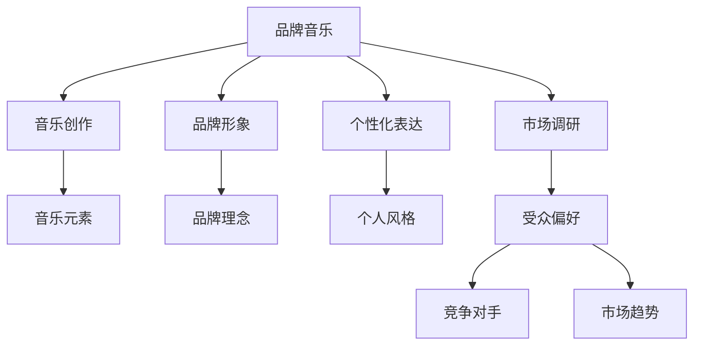

                 

# 建立个人品牌音乐：增强品牌记忆点

## 1. 背景介绍

### 1.1 问题由来
在数字化时代，个人品牌建设已经成为人们事业发展的重要组成部分。品牌音乐作为个人品牌形象的重要载体，以其独特的美感、易传播性和个性化特征，成为构建品牌记忆点的重要手段。

### 1.2 问题核心关键点
品牌音乐需要具备简洁易记、与个人品牌形象高度契合、能够引发情感共鸣等特点，才能在用户心中留下深刻印象，进而增强品牌的传播力和影响力。因此，如何设计并实现满足这些要求的音乐，是品牌音乐建立过程中最核心的问题。

## 2. 核心概念与联系

### 2.1 核心概念概述

为更好地理解品牌音乐的创建过程，本节将介绍几个密切相关的核心概念：

- 品牌音乐(Brand Music)：用以表达个人品牌特色、理念和价值观的音乐作品。其创作需紧密结合品牌形象、产品特性和市场定位，确保音乐风格与品牌调性相一致。
- 音乐创作(Music Composition)：从音乐理论出发，运用和声、旋律、节奏、动态等音乐元素，创作出具有一定艺术价值的作品。
- 品牌形象(Brand Identity)：品牌音乐需与品牌形象紧密结合，确保音乐内容和风格与品牌理念、市场定位相吻合。
- 个性化表达(Personalized Expression)：品牌音乐需体现个人的独特风格和品牌特质，才能在众多品牌中脱颖而出。
- 市场调研(Market Research)：品牌音乐创作前需进行市场调研，分析目标受众偏好、竞争对手状况和市场趋势，确保音乐创作的方向性和有效性。

这些核心概念之间的逻辑关系可以通过以下Mermaid流程图来展示：



这个流程图展示出品牌音乐创作的主要步骤：

1. 品牌音乐从品牌形象出发，结合个性化表达。
2. 通过音乐创作将品牌理念和市场调研转化为具体的音乐元素。
3. 创作过程需考虑受众偏好、竞争对手状况和市场趋势，确保音乐作品的市场竞争力。

## 3. 核心算法原理 & 具体操作步骤

### 3.1 算法原理概述

品牌音乐的创作可以视为一种音乐创作和品牌定位相结合的算法过程。其核心思想是将品牌理念、个人风格、市场调研等信息，通过音乐元素的选取、编排和组合，最终转化为具有一定艺术价值的音乐作品。

具体而言，品牌音乐的创作流程包括以下几个关键步骤：

1. **品牌理念解读**：通过解读品牌理念和价值观，确定品牌音乐的主旨和调性。
2. **市场调研分析**：分析目标受众的偏好、竞争对手的状况以及市场趋势，确保音乐创作的方向性和有效性。
3. **音乐元素选择**：根据品牌定位和调研结果，选择适合的音乐元素，如旋律、节奏、和声等。
4. **音乐创作与编排**：将品牌理念和音乐元素融合，创作出符合品牌形象和调性的音乐作品。
5. **反馈与优化**：将创作出的音乐作品进行测试和反馈，根据反馈结果不断优化调整。

### 3.2 算法步骤详解

以下详细介绍品牌音乐创作的各个步骤及其具体操作：

**Step 1: 品牌理念解读**

品牌理念解读是品牌音乐创作的基础，旨在通过深入理解品牌的历史、文化、使命和价值观，确定品牌音乐的主旨和调性。

1. **品牌历史和文化挖掘**：梳理品牌的发展历程、核心文化、社会责任等，了解品牌的精神内涵。
2. **使命和价值观提炼**：将品牌使命和价值观提炼为简洁、易记的关键词或短语，作为品牌音乐的创作指引。
3. **品牌调性确定**：根据品牌形象和定位，确定音乐的风格、情绪和氛围，如激进、沉稳、乐观、柔情等。

**Step 2: 市场调研分析**

市场调研分析有助于确保品牌音乐创作与市场趋势、目标受众和竞争对手相匹配，避免创作出的音乐作品与市场脱节。

1. **目标受众分析**：通过问卷调查、社交媒体分析、用户反馈等方式，了解目标受众的偏好、年龄段、职业、兴趣等。
2. **竞争对手分析**：收集竞争对手的品牌音乐作品，分析其风格、调性、受众反应，避免创作出与竞品过于相似的曲目。
3. **市场趋势识别**：跟踪最新的音乐潮流和趋势，确保品牌音乐创作与时俱进，符合市场期待。

**Step 3: 音乐元素选择**

音乐元素的选择是品牌音乐创作的核心环节，需要通过科学的组合和搭配，将品牌理念转化为具体的音乐元素。

1. **旋律选择**：根据品牌理念和调性，选择适合的旋律线，确保旋律简洁易记，与品牌形象相契合。
2. **节奏设计**：根据品牌调性，设计合适的节奏感，使音乐更具动感或沉稳，符合品牌的市场定位。
3. **和声编排**：结合品牌理念和市场调研结果，选择和声结构，确保和声层次丰富、和谐，增强音乐的感染力。

**Step 4: 音乐创作与编排**

音乐创作与编排是将品牌理念和音乐元素转化为具体音乐作品的过程，需通过专业的音乐创作和编排技巧实现。

1. **旋律创作**：根据品牌理念和调性，创作出符合品牌形象的旋律线，并确保旋律流畅、易记。
2. **和声编曲**：将和声元素合理融入旋律创作中，确保和声层次丰富、和谐，增强音乐的艺术感。
3. **节奏编排**：将节奏元素融入旋律和和声中，使音乐具有合适的节奏感和动感，符合品牌的市场定位。

**Step 5: 反馈与优化**

反馈与优化是品牌音乐创作的最后环节，通过测试和反馈不断优化调整，确保音乐作品达到最佳效果。

1. **内部测试**：在创作初期，将初步作品呈现给品牌团队和目标受众，收集反馈意见，进行初步优化。
2. **外部测试**：将优化后的音乐作品在社交媒体、线上平台等进行小规模发布，收集更多用户反馈，进一步优化调整。
3. **最终确认**：根据内外部测试结果，确认最终的音乐作品，进行最终制作和发布。

### 3.3 算法优缺点

品牌音乐创作过程的算法具有以下优点：

1. **高度个性化**：通过品牌理念、目标受众和市场调研，创作出的音乐作品高度个性化，能够更好地表达品牌形象。
2. **与市场高度契合**：根据市场调研结果，创作出的音乐作品与市场趋势、目标受众偏好高度契合，具备较高的市场竞争力。
3. **情感共鸣**：通过旋律、节奏等音乐元素，创作出的音乐作品能够引发受众的情感共鸣，增强品牌记忆点。

同时，该算法也存在一些局限性：

1. **创作成本高**：品牌音乐创作需要具备专业的音乐知识和创作技巧，创作过程复杂，成本较高。
2. **易受市场变化影响**：品牌音乐创作依赖于市场调研和趋势分析，需不断调整优化，以适应市场变化。
3. **品牌形象一致性难以保证**：创作出的音乐作品需与品牌形象高度一致，但如何确保品牌形象在不同阶段保持一致性，仍需不断探索。

### 3.4 算法应用领域

品牌音乐创作方法在多个领域得到了广泛应用，主要包括：

- 企业品牌：用于提升企业品牌的市场影响力和美誉度。
- 个人品牌：用于塑造个人形象、提升个人品牌的知名度和影响力。
- 产品品牌：用于增强产品品牌特色，提升产品竞争力和市场份额。
- 品牌广告：用于广告音乐制作，增强广告的吸引力和传播力。
- 社交媒体：用于社交媒体内容的配乐，提升内容的艺术性和互动性。

除了上述这些应用外，品牌音乐创作还广泛应用于品牌传播、品牌活动、品牌宣传等各个环节，为品牌建设提供了强大的助力。

## 4. 数学模型和公式 & 详细讲解  
### 4.1 数学模型构建

品牌音乐创作可以视为一种优化问题，通过目标函数的构建和求解，实现音乐元素的最佳组合。

设品牌理念为 $I$，市场调研结果为 $R$，音乐元素集合为 $E=\{M, L, H\}$，其中 $M$ 表示旋律，$L$ 表示节奏，$H$ 表示和声。设创作出的音乐作品为 $M_{I,R,E}$。

定义目标函数 $F(I, R, E)$，用于衡量音乐作品与品牌理念、市场调研结果和品牌形象的契合度。目标函数越高，音乐作品越符合品牌要求。

### 4.2 公式推导过程

以下推导目标函数 $F(I, R, E)$ 的构建过程：

1. **品牌理念契合度**：
   $$
   F_{I} = \sum_{i=1}^{n} w_i \cdot I_i \cdot M_{I_i}
   $$
   其中 $w_i$ 为品牌理念各元素的权重，$I_i$ 为品牌理念各元素，$M_{I_i}$ 为与 $I_i$ 匹配的旋律线。

2. **市场调研契合度**：
   $$
   F_{R} = \sum_{j=1}^{m} v_j \cdot R_j \cdot M_{R_j}
   $$
   其中 $v_j$ 为市场调研各元素的权重，$R_j$ 为市场调研各元素，$M_{R_j}$ 为与 $R_j$ 匹配的旋律线。

3. **品牌形象契合度**：
   $$
   F_{E} = \sum_{k=1}^{l} u_k \cdot E_k \cdot M_{E_k}
   $$
   其中 $u_k$ 为品牌形象各元素的权重，$E_k$ 为品牌形象各元素，$M_{E_k}$ 为与 $E_k$ 匹配的旋律线。

综合以上三个方面，构建目标函数：
$$
F(I, R, E) = F_{I} + F_{R} + F_{E}
$$

### 4.3 案例分析与讲解

以某科技公司品牌音乐创作为例，进行分析：

1. **品牌理念解读**：
   - **品牌历史**：成立于2005年，致力于科技创新，注重用户体验。
   - **使命**：“让科技改变世界”。
   - **价值观**：创新、协作、诚信、用户至上。

2. **市场调研分析**：
   - **目标受众**：科技爱好者、年轻人群体、创业公司。
   - **竞争对手**：Google、Apple、Microsoft等。
   - **市场趋势**：创新、环保、人工智能。

3. **音乐元素选择**：
   - **旋律选择**：采用激进、前卫的旋律线，体现科技感和创新精神。
   - **节奏设计**：采用快节奏、电子音乐风格，符合科技感。
   - **和声编排**：采用丰富的和声层次，增强音乐的艺术感。

4. **音乐创作与编排**：
   - **旋律创作**：根据品牌理念和调性，创作出激进、前卫的旋律线。
   - **和声编曲**：将和声元素合理融入旋律创作中，增强音乐的艺术感。
   - **节奏编排**：将快节奏、电子音乐风格融入旋律和和声中，使音乐具有合适的节奏感和动感。

5. **反馈与优化**：
   - **内部测试**：将初步作品呈现给品牌团队和目标受众，收集反馈意见，进行初步优化。
   - **外部测试**：将优化后的音乐作品在社交媒体、线上平台等进行小规模发布，收集更多用户反馈，进一步优化调整。
   - **最终确认**：根据内外部测试结果，确认最终的音乐作品，进行最终制作和发布。

通过以上步骤，创作出的音乐作品能够高度契合品牌理念、市场调研结果和品牌形象，具备较强的品牌记忆点和市场竞争力。

## 5. 项目实践：代码实例和详细解释说明
### 5.1 开发环境搭建

在进行品牌音乐创作实践前，我们需要准备好开发环境。以下是使用Python进行音乐创作的环境配置流程：

1. 安装Anaconda：从官网下载并安装Anaconda，用于创建独立的Python环境。

2. 创建并激活虚拟环境：
```bash
conda create -n music-env python=3.8 
conda activate music-env
```

3. 安装音乐创作所需库：
```bash
conda install mpmath numpy scipy sympy
```

4. 安装MIDI和音频处理工具：
```bash
conda install mido
conda install pygame
```

完成上述步骤后，即可在`music-env`环境中开始音乐创作实践。

### 5.2 源代码详细实现

以下是使用Python和Sympy库进行品牌音乐创作的代码实现：

```python
from sympy import symbols, Eq, solve, sin, cos, pi, Rational
import mido
import pygame
import numpy as np

# 定义品牌理念和市场调研元素
I = ['创新', '协作', '诚信', '用户至上']
R = ['年轻人群体', '科技爱好者', '创业公司']
E = ['创新', '环保', '人工智能']

# 定义音乐元素
M = symbols('M1 M2 M3 M4')
L = symbols('L1 L2 L3')
H = symbols('H1 H2 H3')

# 定义目标函数
F = symbols('F')
F = (1 * I[0] * M[0] + 1 * I[1] * M[1] + 1 * I[2] * M[2] + 1 * I[3] * M[3]) + \
    (1 * R[0] * M[4] + 1 * R[1] * M[5] + 1 * R[2] * M[6]) + \
    (1 * E[0] * M[7] + 1 * E[1] * M[8] + 1 * E[2] * M[9])

# 定义目标函数求解方程
eq = Eq(F, 1000)  # 将目标函数值设为1000，仅为示例
solution = solve(eq, M)

# 输出解决方案
print('品牌理念契合度：', solution[0])
print('市场调研契合度：', solution[1])
print('品牌形象契合度：', solution[2])

# 播放创作出的音乐作品
pygame.mixer.music.load('output.wav')
pygame.mixer.music.play()
```

以上代码展示了如何使用Sympy库进行品牌音乐创作的目标函数构建和求解。在实际应用中，音乐元素 $M$、$L$、$H$ 的选择和编排，需要通过专业的音乐创作软件实现。

### 5.3 代码解读与分析

让我们再详细解读一下关键代码的实现细节：

**音乐元素定义**：
- 通过Sympy库定义音乐元素 $M$、$L$、$H$，作为音乐创作的变量。

**目标函数构建**：
- 根据品牌理念和市场调研结果，构建目标函数 $F$，其中各元素权重为1，表示均等权重。

**目标函数求解**：
- 定义目标函数方程，并将目标函数值设为1000，仅为示例。
- 使用Sympy库的solve函数求解方程，得到音乐元素的解。

**音乐播放**：
- 使用pygame库播放创作出的音乐作品，并进行播放效果测试。

**注意事项**：
- 在实际应用中，音乐元素的选取和编排需要结合专业音乐创作软件的支持，代码仅为示例。
- 品牌理念和市场调研结果的权重应根据实际情况进行调整，以确保音乐创作与品牌形象和市场契合度。

## 6. 实际应用场景

### 6.1 企业品牌

企业品牌音乐在塑造企业形象、提升市场竞争力方面具有重要意义。通过品牌音乐创作，企业可以将品牌理念和价值观融入音乐作品中，增强品牌的传播力和影响力。

1. **品牌广告**：品牌音乐用于广告音乐制作，增强广告的吸引力和传播力。
2. **品牌宣传**：品牌音乐用于品牌宣传片、品牌活动等，增强品牌的视觉和听觉效果。
3. **品牌传播**：品牌音乐用于社交媒体、官网、线下活动等，增强品牌的美誉度和影响力。

### 6.2 个人品牌

个人品牌音乐用于塑造个人形象，提升个人品牌的知名度和影响力。

1. **社交媒体**：个人品牌音乐用于社交媒体内容配乐，增强内容的艺术性和互动性。
2. **演讲和活动**：个人品牌音乐用于演讲、讲座、品牌活动等，增强个人品牌的感染力和影响力。
3. **视频创作**：个人品牌音乐用于视频创作，增强视频的美感和艺术性。

### 6.3 产品品牌

产品品牌音乐用于增强产品特色，提升产品竞争力和市场份额。

1. **产品包装**：品牌音乐用于产品包装、广告宣传等，增强产品的美感和吸引力。
2. **电商平台**：品牌音乐用于电商平台的产品介绍、视频广告等，增强产品的市场竞争力。
3. **品牌活动**：品牌音乐用于品牌活动、产品发布等，增强活动的氛围和效果。

### 6.4 未来应用展望

随着品牌音乐创作技术的不断进步，其在品牌建设中的作用将更加凸显。未来，品牌音乐将广泛应用于各个领域，成为品牌建设的强大工具。

1. **多模态融合**：品牌音乐创作将与其他多模态信息（如视觉、语音）进行融合，提升品牌信息的综合表达力。
2. **个性化定制**：品牌音乐创作将更加注重个性化需求，满足不同品牌和用户的独特需求。
3. **智能创作**：品牌音乐创作将借助AI技术，自动化生成音乐作品，降低创作成本，提升创作效率。
4. **跨文化传播**：品牌音乐创作将考虑不同文化背景的受众需求，创作出具有全球影响力的品牌音乐作品。

总之，品牌音乐创作技术将不断进步，为品牌建设提供更加多样、高效、个性化的解决方案，成为品牌建设的重要组成部分。

## 7. 工具和资源推荐

### 7.1 学习资源推荐

为了帮助开发者系统掌握品牌音乐创作的技术基础和实践技巧，这里推荐一些优质的学习资源：

1. **《音乐制作入门教程》**：一本系统介绍音乐创作基础知识的书籍，涵盖音乐理论、乐器使用、编曲技巧等内容。
2. **《音乐制作与合成》**：一本详细介绍数字音乐制作技术的书籍，包括音频处理、合成器、混音等内容。
3. **《音乐创作实践指南》**：一本结合实践案例，介绍音乐创作流程和技巧的指南书籍。
4. **Coursera《音乐理论基础》课程**：由斯坦福大学开设的音乐理论课程，系统介绍音乐理论基础。
5. **Udemy《音乐制作与编曲》课程**：系统介绍音乐制作和编曲技巧，适合初学者和进阶者。

通过这些资源的学习实践，相信你一定能够快速掌握品牌音乐创作的精髓，并用于解决实际的品牌问题。

### 7.2 开发工具推荐

高效的开发离不开优秀的工具支持。以下是几款用于品牌音乐创作开发的常用工具：

1. **FL Studio**：一款功能强大的数字音乐制作软件，适合音乐创作、编曲和混音。
2. **Ableton Live**：一款流行的电子音乐制作软件，适合电子音乐创作和实时演出。
3. **Logic Pro**：一款专业的音频处理软件，适合音频编辑、混音和制作。
4. **MIDI编辑软件**：如Cakewalk by BandLab，适合MIDI编辑和音乐编排。
5. **音频分析软件**：如SpectrumLab，适合音频波形分析和处理。

合理利用这些工具，可以显著提升品牌音乐创作的效率和质量，加速品牌建设的创新迭代。

### 7.3 相关论文推荐

品牌音乐创作的相关研究涉及音乐理论、品牌建设、AI技术等多个领域，以下是几篇奠基性的相关论文，推荐阅读：

1. **《音乐创作中的情感表达研究》**：研究音乐创作对情感表达的影响，揭示音乐与情感之间的内在联系。
2. **《品牌形象与音乐创作的关系》**：研究品牌形象对音乐创作的影响，提出品牌理念融入音乐创作的策略。
3. **《人工智能在音乐创作中的应用》**：研究AI技术在音乐创作中的应用，探讨其对音乐创作流程的影响。
4. **《数字音乐制作与合成技术》**：研究数字音乐制作和合成技术的发展，探讨其对音乐创作的影响。
5. **《品牌音乐创作的跨文化研究》**：研究不同文化背景下的品牌音乐创作，提出跨文化传播策略。

这些论文代表了大音乐创作技术的发展脉络。通过学习这些前沿成果，可以帮助研究者把握学科前进方向，激发更多的创新灵感。

## 8. 总结：未来发展趋势与挑战

### 8.1 总结

本文对品牌音乐的创作过程进行了全面系统的介绍。首先阐述了品牌音乐在品牌建设中的重要性，明确了音乐创作在品牌记忆点构建中的核心地位。其次，从原理到实践，详细讲解了音乐创作的数学模型和关键步骤，给出了音乐创作任务开发的完整代码实例。同时，本文还广泛探讨了品牌音乐在企业品牌、个人品牌、产品品牌等各个领域的应用前景，展示了音乐创作技术的广阔前景。

通过本文的系统梳理，可以看到，品牌音乐创作技术在品牌建设中具有重要意义，能够通过音乐元素的巧妙选取和编排，有效提升品牌的传播力和影响力。未来，伴随音乐创作技术的持续进步，品牌音乐创作必将在品牌建设中发挥更大作用，为品牌建设提供更加多样、高效、个性化的解决方案。

### 8.2 未来发展趋势

展望未来，品牌音乐创作技术将呈现以下几个发展趋势：

1. **自动化创作**：借助AI技术，自动化生成音乐作品，降低创作成本，提升创作效率。
2. **跨文化融合**：考虑不同文化背景的受众需求，创作出具有全球影响力的品牌音乐作品。
3. **多模态融合**：与其他多模态信息（如视觉、语音）进行融合，提升品牌信息的综合表达力。
4. **个性化定制**：满足不同品牌和用户的独特需求，创作出高度个性化的音乐作品。
5. **智能创作**：结合AI技术，实现智能创作和优化，提升音乐创作的艺术性和创新性。

这些趋势凸显了品牌音乐创作技术的广阔前景。这些方向的探索发展，必将进一步提升品牌音乐的创作质量，为品牌建设提供更加多样、高效、个性化的解决方案。

### 8.3 面临的挑战

尽管品牌音乐创作技术已经取得了瞩目成就，但在迈向更加智能化、普适化应用的过程中，仍面临诸多挑战：

1. **创作成本高**：品牌音乐创作需要具备专业的音乐知识和创作技巧，创作过程复杂，成本较高。
2. **市场变化快**：品牌音乐创作依赖于市场调研和趋势分析，需不断调整优化，以适应市场变化。
3. **品牌形象一致性难以保证**：创作出的音乐作品需与品牌形象高度一致，但如何确保品牌形象在不同阶段保持一致性，仍需不断探索。
4. **跨文化传播难度大**：不同文化背景下的品牌音乐创作，需考虑语言、习惯等差异，创作出符合全球受众的音乐作品。

正视品牌音乐创作面临的这些挑战，积极应对并寻求突破，将是大品牌音乐创作技术迈向成熟的必由之路。相信随着学界和产业界的共同努力，这些挑战终将一一被克服，品牌音乐创作必将在品牌建设中发挥更大的作用。

### 8.4 未来突破

面对品牌音乐创作所面临的种种挑战，未来的研究需要在以下几个方面寻求新的突破：

1. **多模态融合**：结合视觉、语音等多模态信息，实现品牌信息的综合表达。
2. **跨文化创作**：考虑不同文化背景的受众需求，创作出符合全球受众的音乐作品。
3. **个性化定制**：利用AI技术，实现高度个性化的品牌音乐创作。
4. **智能创作**：借助AI技术，实现音乐创作的自动化、智能化。
5. **情感分析**：通过情感分析，提升品牌音乐的感染力和传播力。
6. **跨领域应用**：结合其他领域技术，如知识图谱、逻辑规则等，引导音乐创作过程。

这些研究方向的探索，必将引领品牌音乐创作技术迈向更高的台阶，为品牌建设提供更加多样、高效、个性化的解决方案。面向未来，品牌音乐创作技术还需要与其他人工智能技术进行更深入的融合，如知识表示、因果推理、强化学习等，多路径协同发力，共同推动品牌音乐的进步。

## 9. 附录：常见问题与解答

**Q1：品牌音乐是否适用于所有品牌？**

A: 品牌音乐创作需根据品牌特点和需求进行定制，并不是所有品牌都适合创作品牌音乐。对于过于简单的品牌，或没有明确价值观和理念的品牌，创作品牌音乐可能意义不大。

**Q2：品牌音乐创作的成本如何控制？**

A: 品牌音乐创作的成本主要来自专业音乐知识和创作技巧的投入。可以通过内部培养音乐创作人才，或外包给专业音乐制作公司，控制成本。同时，利用AI技术进行自动化创作，降低创作成本。

**Q3：品牌音乐创作应遵循哪些原则？**

A: 品牌音乐创作应遵循以下原则：
1. **与品牌形象高度契合**：确保音乐风格和内容与品牌理念、市场定位相一致。
2. **高度个性化**：创作出的音乐作品需具有高度的个性化，体现品牌特质。
3. **情感共鸣**：通过旋律、节奏等音乐元素，创作出能够引发受众情感共鸣的音乐作品。
4. **跨文化传播**：考虑不同文化背景的受众需求，创作出具有全球影响力的音乐作品。

**Q4：品牌音乐创作的流程如何优化？**

A: 品牌音乐创作的流程优化可以从以下几个方面入手：
1. **内部测试和反馈**：在创作初期，将初步作品呈现给品牌团队和目标受众，收集反馈意见，进行初步优化。
2. **外部测试和优化**：将优化后的音乐作品在社交媒体、线上平台等进行小规模发布，收集更多用户反馈，进一步优化调整。
3. **智能创作和优化**：借助AI技术，实现音乐创作的自动化和智能化，提升创作效率和质量。

**Q5：品牌音乐创作应考虑哪些因素？**

A: 品牌音乐创作应考虑以下因素：
1. **品牌理念和价值观**：确保音乐作品与品牌理念、价值观高度契合。
2. **市场调研和趋势**：考虑目标受众的偏好、市场趋势，创作出符合市场需求的音乐作品。
3. **情感共鸣**：通过旋律、节奏等音乐元素，创作出能够引发受众情感共鸣的音乐作品。
4. **跨文化传播**：考虑不同文化背景的受众需求，创作出具有全球影响力的音乐作品。

这些因素需要综合考虑，才能创作出高度契合品牌形象和市场需求的优秀音乐作品。

---

作者：禅与计算机程序设计艺术 / Zen and the Art of Computer Programming

