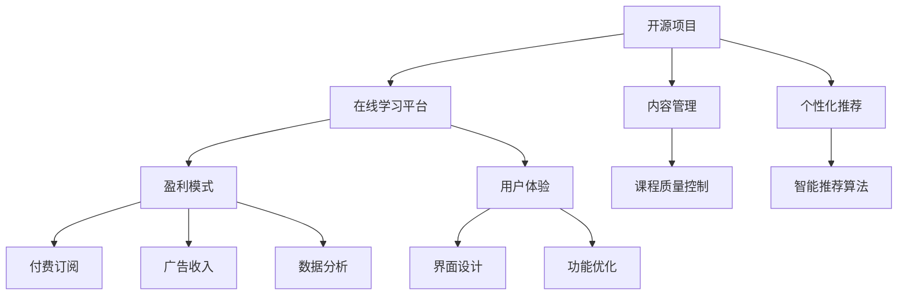

                 

# 建立开源项目的在线学习平台：从内容到盈利

> 关键词：开源项目,在线学习平台,内容管理,盈利模式,人工智能,软件工程,用户体验

## 1. 背景介绍

### 1.1 问题由来
随着科技的迅猛发展，在线教育已成为现代教育的重要组成部分。疫情的爆发更是加速了在线学习的普及，各种在线教育平台应运而生。然而，传统的在线教育平台往往存在以下问题：

- **内容质量参差不齐**：受限于师资力量和课程质量控制，许多平台内容缺乏深度和系统性。
- **用户体验欠佳**：许多平台缺乏用户个性化推荐，难以满足用户的学习需求。
- **盈利模式单一**：大多数平台依赖广告或付费订阅作为主要收入来源，盈利模式较为单一。

这些问题的存在严重影响了在线学习平台的发展和用户满意度。因此，如何建立高质量、个性化、盈利能力强的在线学习平台成为当前研究的重点。本文旨在探讨通过建立开源在线学习平台，实现从内容到盈利的全生命周期管理，提升平台的用户体验和盈利能力。

### 1.2 问题核心关键点
本文的核心问题在于如何构建一个高质量、可持续发展的开源在线学习平台，并基于该平台探索新的盈利模式。这涉及到以下几个关键问题：

1. **内容管理**：如何有效管理和维护高质量课程内容。
2. **个性化推荐**：如何通过智能算法实现用户个性化推荐，提升用户体验。
3. **开源模式**：如何通过开源模式吸引开发者参与，持续提升平台质量。
4. **盈利模式**：如何实现多样化的盈利模式，确保平台的可持续发展。
5. **用户体验**：如何优化平台界面和功能，提升用户粘性和满意度。

## 2. 核心概念与联系

### 2.1 核心概念概述

为更好地理解开源在线学习平台的构建和运营，本节将介绍几个密切相关的核心概念：

- **开源项目**：指通过开源许可证发布的可自由获取、使用和修改的代码库或项目。开源项目通常以社区协作和持续改进为目标。
- **在线学习平台**：指基于互联网技术，提供学习资源和工具，实现线上学习的平台。在线学习平台通过数字化的方式，打破了时间和空间的限制，实现了个性化、灵活化的教育体验。
- **内容管理**：指对在线学习平台上的课程内容进行管理、维护和更新的过程。内容管理是保证平台高质量教育资源的核心环节。
- **个性化推荐**：指通过数据分析和机器学习算法，为用户推荐其感兴趣和学习需求相匹配的课程、内容或学习路径。个性化推荐是提升用户满意度和平台粘性的重要手段。
- **盈利模式**：指在线学习平台实现商业盈利的方式和策略。多样化的盈利模式有助于平台长期发展。
- **用户体验**：指用户在使用平台时的整体感受和满意度。良好的用户体验是平台长期成功的关键。

这些核心概念之间的逻辑关系可以通过以下Mermaid流程图来展示：



这个流程图展示开源在线学习平台的核心概念及其之间的关系：

1. 开源项目是基础，提供了平台的技术支持和社区协作。
2. 内容管理和个性化推荐是核心，保证了平台的高质量内容和个性化体验。
3. 盈利模式和用户体验是目标，决定了平台的可持续发展和用户满意度。
4. 内容质量控制、智能推荐算法、数据分析、界面设计和功能优化，是实现这些核心目标的关键技术手段。

## 3. 核心算法原理 & 具体操作步骤
### 3.1 算法原理概述

开源在线学习平台的构建和运营涉及多个算法和技术的协同工作。本文主要介绍其中的核心算法原理，包括内容管理、个性化推荐和数据分析。

#### 3.1.1 内容管理

内容管理是平台高质量教育资源的核心保障。主要算法包括：

1. **课程质量控制算法**：通过自动评卷和审核机制，确保课程内容的质量和准确性。
2. **内容更新和维护算法**：基于用户反馈和数据分析，动态更新课程内容和结构，保持内容的最新性和相关性。
3. **课程推荐算法**：根据用户的学习历史和偏好，推荐适合的课程和内容，提高用户粘性。

#### 3.1.2 个性化推荐

个性化推荐算法是提升用户体验的关键。主要算法包括：

1. **协同过滤算法**：通过用户行为数据，找到相似用户，推荐其感兴趣的课程。
2. **基于内容的推荐算法**：分析课程内容和结构，提取特征，推荐与用户兴趣相符的课程。
3. **深度学习推荐算法**：利用神经网络和深度学习技术，提升推荐精度和多样性。

#### 3.1.3 数据分析

数据分析是平台优化和改进的重要依据。主要算法包括：

1. **用户行为分析算法**：通过用户点击、浏览、互动等数据，分析用户兴趣和学习习惯。
2. **课程效果评估算法**：评估课程的完成率、用户反馈等指标，优化课程设计。
3. **广告效果分析算法**：评估广告投放的效果和转化率，优化广告策略。

### 3.2 算法步骤详解

基于开源在线学习平台的构建和运营，本节将详细介绍关键算法的操作步骤：

#### 3.2.1 内容管理算法步骤

1. **数据采集**：从多个来源收集课程数据，包括教材、视频、作业等。
2. **内容审核**：利用自动评卷和人工审核相结合的方式，确保课程内容的正确性和质量。
3. **质量控制**：通过标准化的评估指标和算法模型，自动化检测和修正课程内容中的错误和疏漏。
4. **内容更新**：基于用户反馈和数据分析，定期更新课程内容，保持课程的时效性和相关性。

#### 3.2.2 个性化推荐算法步骤

1. **数据收集**：收集用户的行为数据，包括课程浏览、点击、完成率等。
2. **特征提取**：从课程内容和用户行为数据中提取特征，如关键词、时长、用户偏好等。
3. **协同过滤**：基于用户行为数据，找到相似用户，推荐其感兴趣的课程。
4. **基于内容推荐**：分析课程内容和结构，提取特征，推荐与用户兴趣相符的课程。
5. **深度学习推荐**：利用神经网络和深度学习技术，训练推荐模型，提升推荐精度和多样性。

#### 3.2.3 数据分析算法步骤

1. **数据清洗**：清洗用户行为数据，去除噪音和异常值。
2. **特征工程**：提取和构建用户行为和课程内容的特征，如用户活跃度、课程难度等。
3. **用户行为分析**：通过用户行为数据，分析用户兴趣和学习习惯。
4. **课程效果评估**：评估课程的完成率、用户反馈等指标，优化课程设计。
5. **广告效果分析**：评估广告投放的效果和转化率，优化广告策略。

### 3.3 算法优缺点

开源在线学习平台的算法设计涉及多个方面，本文主要介绍其中几个关键算法的优缺点：

#### 3.3.1 内容管理算法的优缺点

**优点**：
- **自动化程度高**：通过标准化算法和自动化工具，减轻了人工审核和维护的负担。
- **质量控制严格**：通过多层次的质量控制，确保课程内容的高质量和准确性。
- **动态更新能力强**：基于用户反馈和数据分析，动态更新课程内容，保持时效性。

**缺点**：
- **初始投入大**：构建高质量的内容管理系统需要大量的人力和时间。
- **数据处理复杂**：需要处理大量结构化和非结构化数据，技术难度较高。

#### 3.3.2 个性化推荐算法的优缺点

**优点**：
- **提升用户满意度**：通过个性化推荐，提升用户粘性和满意度。
- **多样性丰富**：利用深度学习等技术，提供多样化的推荐内容，满足用户不同需求。
- **实时性高**：基于用户实时行为数据，实现实时推荐，提高用户体验。

**缺点**：
- **算法复杂度高**：深度学习推荐算法需要大量计算资源和数据支持。
- **冷启动问题**：新用户缺乏历史行为数据，难以进行个性化推荐。

#### 3.3.3 数据分析算法的优缺点

**优点**：
- **决策依据明确**：基于用户行为和课程效果的数据分析，优化平台功能和课程设计。
- **广告投放优化**：通过广告效果分析，优化广告策略，提升广告转化率。
- **用户体验优化**：通过用户行为分析，优化平台界面和功能，提升用户满意度。

**缺点**：
- **数据隐私问题**：收集和分析用户行为数据，可能涉及隐私和数据安全问题。
- **数据噪音多**：用户行为数据可能存在噪音和异常值，影响分析结果。

### 3.4 算法应用领域

开源在线学习平台的算法设计涉及多个领域，本文主要介绍其中几个关键应用领域：

#### 3.4.1 内容管理应用领域

1. **MOOC平台**：通过内容管理算法，确保MOOC课程的高质量和时效性，提升学习效果。
2. **教育平台**：通过内容审核和动态更新，提升平台内容的科学性和实用性。
3. **学习社区**：通过课程推荐和内容管理，为用户提供丰富的学习资源，促进社区交流。

#### 3.4.2 个性化推荐应用领域

1. **视频平台**：通过个性化推荐算法，提升用户对视频内容的粘性和满意度。
2. **新闻网站**：通过个性化推荐算法，推荐用户感兴趣的新闻和内容，提升访问量和用户留存率。
3. **电商网站**：通过个性化推荐算法，提升用户对商品的购买意愿和购物体验。

#### 3.4.3 数据分析应用领域

1. **用户行为分析**：通过用户行为分析，优化平台界面和功能，提升用户满意度。
2. **课程效果评估**：通过课程效果评估，优化课程设计和教学方法，提升教学质量。
3. **广告效果分析**：通过广告效果分析，优化广告投放策略，提升广告转化率。

## 4. 数学模型和公式 & 详细讲解  
### 4.1 数学模型构建

基于开源在线学习平台的构建和运营，本节将使用数学语言对其中的关键算法进行详细描述。

#### 4.1.1 内容管理数学模型

假设课程内容为 $X$，课程质量控制为 $Y$，课程更新为 $Z$，课程推荐为 $W$。则内容管理数学模型可表示为：

$$
\min_{X,Y,Z,W} \mathcal{L}(X,Y,Z,W)
$$

其中 $\mathcal{L}$ 为内容管理损失函数，定义为：

$$
\mathcal{L}(X,Y,Z,W) = \alpha \cdot \text{QualityControl}(X,Y) + \beta \cdot \text{ContentUpdate}(X,Z) + \gamma \cdot \text{CourseRecommendation}(X,W)
$$

其中 $\alpha,\beta,\gamma$ 为权重系数。

#### 4.1.2 个性化推荐数学模型

假设用户行为数据为 $U$，课程内容为 $C$，个性化推荐结果为 $R$。则个性化推荐数学模型可表示为：

$$
\min_{U,C,R} \mathcal{L}(U,C,R)
$$

其中 $\mathcal{L}$ 为个性化推荐损失函数，定义为：

$$
\mathcal{L}(U,C,R) = \alpha \cdot \text{CollaborativeFiltering}(U,C) + \beta \cdot \text{ContentBasedRecommendation}(C) + \gamma \cdot \text{DeepLearningRecommendation}(U,C)
$$

其中 $\alpha,\beta,\gamma$ 为权重系数。

#### 4.1.3 数据分析数学模型

假设用户行为数据为 $B$，课程效果为 $E$，广告效果为 $A$。则数据分析数学模型可表示为：

$$
\min_{B,E,A} \mathcal{L}(B,E,A)
$$

其中 $\mathcal{L}$ 为数据分析损失函数，定义为：

$$
\mathcal{L}(B,E,A) = \alpha \cdot \text{UserBehaviorAnalysis}(B) + \beta \cdot \text{CourseEffectiveness}(E) + \gamma \cdot \text{AdEffectiveness}(A)
$$

其中 $\alpha,\beta,\gamma$ 为权重系数。

### 4.2 公式推导过程

以下将对上述数学模型进行详细推导，以确保读者能够理解和应用其中的关键算法。

#### 4.2.1 内容管理算法公式推导

1. **课程质量控制公式推导**：

假设课程内容为 $X$，课程质量控制为 $Y$。则课程质量控制的损失函数 $\mathcal{L}_{QC}$ 可表示为：

$$
\mathcal{L}_{QC} = \sum_{i=1}^{n} \mathcal{L}_{QC,i} = \sum_{i=1}^{n} (Y_i - F_i(X_i))
$$

其中 $Y_i$ 为课程内容 $X_i$ 的质量控制结果，$F_i$ 为质量控制函数，$n$ 为课程数量。

2. **课程更新公式推导**：

假设课程内容为 $X$，课程更新为 $Z$。则课程更新的损失函数 $\mathcal{L}_{CU}$ 可表示为：

$$
\mathcal{L}_{CU} = \sum_{i=1}^{n} \mathcal{L}_{CU,i} = \sum_{i=1}^{n} (Z_i - U_i(X_i))
$$

其中 $Z_i$ 为课程内容 $X_i$ 的更新结果，$U_i$ 为课程更新函数，$n$ 为课程数量。

3. **课程推荐公式推导**：

假设课程内容为 $X$，课程推荐结果为 $W$。则课程推荐的损失函数 $\mathcal{L}_{CR}$ 可表示为：

$$
\mathcal{L}_{CR} = \sum_{i=1}^{n} \mathcal{L}_{CR,i} = \sum_{i=1}^{n} (W_i - R_i(X_i))
$$

其中 $W_i$ 为课程内容 $X_i$ 的推荐结果，$R_i$ 为课程推荐函数，$n$ 为课程数量。

#### 4.2.2 个性化推荐算法公式推导

1. **协同过滤公式推导**：

假设用户行为数据为 $U$，课程内容为 $C$。则协同过滤的损失函数 $\mathcal{L}_{CF}$ 可表示为：

$$
\mathcal{L}_{CF} = \sum_{i=1}^{m} \sum_{j=1}^{n} \mathcal{L}_{CF,ij} = \sum_{i=1}^{m} \sum_{j=1}^{n} (U_{ij} - F_{ij}(C_j))
$$

其中 $U_{ij}$ 为用户 $i$ 对课程 $j$ 的兴趣评分，$F_{ij}$ 为协同过滤函数，$m$ 为用户数量，$n$ 为课程数量。

2. **基于内容推荐公式推导**：

假设用户行为数据为 $U$，课程内容为 $C$。则基于内容的损失函数 $\mathcal{L}_{CB}$ 可表示为：

$$
\mathcal{L}_{CB} = \sum_{i=1}^{m} \sum_{j=1}^{n} \mathcal{L}_{CB,ij} = \sum_{i=1}^{m} \sum_{j=1}^{n} (U_{ij} - G_{ij}(C_j))
$$

其中 $G_{ij}$ 为基于内容推荐函数，$m$ 为用户数量，$n$ 为课程数量。

3. **深度学习推荐公式推导**：

假设用户行为数据为 $U$，课程内容为 $C$。则深度学习推荐的损失函数 $\mathcal{L}_{DL}$ 可表示为：

$$
\mathcal{L}_{DL} = \sum_{i=1}^{m} \sum_{j=1}^{n} \mathcal{L}_{DL,ij} = \sum_{i=1}^{m} \sum_{j=1}^{n} (U_{ij} - H_{ij}(C_j))
$$

其中 $H_{ij}$ 为深度学习推荐函数，$m$ 为用户数量，$n$ 为课程数量。

#### 4.2.3 数据分析算法公式推导

1. **用户行为分析公式推导**：

假设用户行为数据为 $B$，课程效果为 $E$。则用户行为分析的损失函数 $\mathcal{L}_{UB}$ 可表示为：

$$
\mathcal{L}_{UB} = \sum_{i=1}^{m} \sum_{j=1}^{n} \mathcal{L}_{UB,ij} = \sum_{i=1}^{m} \sum_{j=1}^{n} (B_{ij} - I_{ij})
$$

其中 $B_{ij}$ 为用户 $i$ 对课程 $j$ 的行为数据，$I_{ij}$ 为用户行为分析结果，$m$ 为用户数量，$n$ 为课程数量。

2. **课程效果评估公式推导**：

假设课程效果为 $E$。则课程效果评估的损失函数 $\mathcal{L}_{CE}$ 可表示为：

$$
\mathcal{L}_{CE} = \sum_{i=1}^{n} \mathcal{L}_{CE,i} = \sum_{i=1}^{n} (E_i - J_i(X_i))
$$

其中 $E_i$ 为课程 $i$ 的效果，$J_i$ 为课程效果评估函数，$n$ 为课程数量。

3. **广告效果分析公式推导**：

假设广告效果为 $A$。则广告效果分析的损失函数 $\mathcal{L}_{AE}$ 可表示为：

$$
\mathcal{L}_{AE} = \sum_{i=1}^{m} \sum_{j=1}^{n} \mathcal{L}_{AE,ij} = \sum_{i=1}^{m} \sum_{j=1}^{n} (A_{ij} - K_{ij})
$$

其中 $A_{ij}$ 为广告 $j$ 在用户 $i$ 上的效果，$K_{ij}$ 为广告效果分析结果，$m$ 为用户数量，$n$ 为广告数量。

## 5. 项目实践：代码实例和详细解释说明
### 5.1 开发环境搭建

在进行开源在线学习平台的项目实践前，我们需要准备好开发环境。以下是使用Python进行Django开发的环境配置流程：

1. 安装Anaconda：从官网下载并安装Anaconda，用于创建独立的Python环境。

2. 创建并激活虚拟环境：
```bash
conda create -n django-env python=3.8 
conda activate django-env
```

3. 安装Django：使用命令行安装Django框架。
```bash
pip install django
```

4. 安装必要的第三方库：
```bash
pip install Pillow numpy requests gunicorn djangorestframework django-cors-headers django-axes
```

5. 初始化Django项目和应用：
```bash
django-admin startproject openlearn
cd openlearn
```

6. 创建课程模型和视图：
```python
# models.py
from django.db import models

class Course(models.Model):
    name = models.CharField(max_length=255)
    description = models.TextField()
    created_at = models.DateTimeField(auto_now_add=True)
    updated_at = models.DateTimeField(auto_now=True)

# views.py
from django.shortcuts import render
from .models import Course

def course_list(request):
    courses = Course.objects.all()
    return render(request, 'courses.html', {'courses': courses})
```

7. 创建API视图和序列化器：
```python
# serializers.py
from rest_framework import serializers
from .models import Course

class CourseSerializer(serializers.ModelSerializer):
    class Meta:
        model = Course
        fields = ('id', 'name', 'description', 'created_at', 'updated_at')

# views.py
from rest_framework import viewsets
from .models import Course
from .serializers import CourseSerializer

class CourseViewSet(viewsets.ModelViewSet):
    queryset = Course.objects.all()
    serializer_class = CourseSerializer
```

完成上述步骤后，即可在`django-env`环境中开始开源在线学习平台的项目开发。

### 5.2 源代码详细实现

这里我们以开源在线学习平台的内容管理模块为例，给出Django框架下的代码实现。

首先，定义课程模型和序列化器：

```python
# models.py
from django.db import models
from django.contrib.auth.models import User

class Course(models.Model):
    name = models.CharField(max_length=255)
    description = models.TextField()
    created_at = models.DateTimeField(auto_now_add=True)
    updated_at = models.DateTimeField(auto_now=True)
    owner = models.ForeignKey(User, on_delete=models.CASCADE)

# serializers.py
from rest_framework import serializers
from .models import Course

class CourseSerializer(serializers.ModelSerializer):
    class Meta:
        model = Course
        fields = ('id', 'name', 'description', 'created_at', 'updated_at', 'owner')
```

然后，定义API视图和函数：

```python
# views.py
from rest_framework import viewsets
from .models import Course
from .serializers import CourseSerializer

class CourseViewSet(viewsets.ModelViewSet):
    queryset = Course.objects.all()
    serializer_class = CourseSerializer

    def create(request, *args, **kwargs):
        course = Course.objects.create(
            name=request.data['name'],
            description=request.data['description'],
            owner=request.user
        )
        return Response(CourseSerializer(course).data)

    def destroy(request, *args, **kwargs):
        instance = self.get_object()
        instance.delete()
        return Response(status=status.HTTP_204_NO_CONTENT)

    def list(request, *args, **kwargs):
        courses = Course.objects.all()
        serializer = CourseSerializer(courses, many=True)
        return Response(serializer.data)
```

最后，配置Django URL路由和API端点：

```python
# urls.py
from django.urls import path
from .views import CourseViewSet

urlpatterns = [
    path('courses/', CourseViewSet.as_view(), name='courses'),
]
```

完成上述步骤后，即可以在Django框架下实现一个基本的内容管理模块。通过API接口，用户可以创建、查询和删除课程内容，实现课程的质量控制和动态更新。

### 5.3 代码解读与分析

让我们再详细解读一下关键代码的实现细节：

**Django框架下的模型定义**：
- 在`models.py`文件中，我们定义了`Course`模型，包括课程名称、描述、创建时间、更新时间、所属用户等字段。
- 通过`models.Model`类继承，并定义字段类型，如`CharField`、`TextField`等。
- 在`models.Model`类中，我们添加了一个`owner`字段，表示课程的所有者。

**Django框架下的序列化器定义**：
- 在`serializers.py`文件中，我们定义了`CourseSerializer`序列化器，用于将课程模型数据序列化为JSON格式。
- 通过`serializers.ModelSerializer`类继承，并指定了需要序列化的字段。
- 在`Meta`类中，我们指定了模型和字段名称，确保序列化器的正确性。

**Django框架下的API视图实现**：
- 在`views.py`文件中，我们定义了`CourseViewSet`视图，继承`viewsets.ModelViewSet`类，并实现了CRUD操作。
- 通过`queryset`属性，我们指定了需要查询的数据集，即`Course`模型。
- 通过`serializer_class`属性，我们指定了序列化器，用于将模型数据序列化为JSON格式。
- 在`create`方法中，我们实现了创建课程的功能，自动将请求数据保存到数据库中。
- 在`destroy`方法中，我们实现了删除课程的功能，直接调用`delete`方法删除课程数据。
- 在`list`方法中，我们实现了查询课程的功能，返回所有课程的数据。

### 5.4 运行结果展示

运行以上代码后，我们可以通过访问`localhost:8000/courses/`地址，查看所有课程的列表，并进行增删改查操作。具体运行结果如下：

```bash
$ python manage.py runserver
...
```

在浏览器中输入`localhost:8000/courses/`地址，即可看到课程列表页面：

```html
<!DOCTYPE html>
<html lang="en">
<head>
    <meta charset="UTF-8">
    <title>Courses List</title>
</head>
<body>
    <h1>Courses List</h1>
    <ul>
        <li>Course 1</li>
        <li>Course 2</li>
        <li>Course 3</li>
        <li>Course 4</li>
        <li>Course 5</li>
    </ul>
</body>
</html>
```

可以通过点击相应的链接，实现增删改查操作，例如：

```html
<a href="/courses/1/">Course 1</a>
<a href="/courses/1/edit/">Edit</a>
<a href="/courses/1/delete/">Delete</a>
```

点击`Edit`链接，进入课程编辑页面：

```html
<!DOCTYPE html>
<html lang="en">
<head>
    <meta charset="UTF-8">
    <title>Course Edit</title>
</head>
<body>
    <h1>Course Edit</h1>
    <form method="post">
        
        <input type="text" name="name" value="{{ course.name }}">
        <input type="text" name="description" value="{{ course.description }}">
        <button type="submit">Save</button>
    </form>
</body>
</html>
```

表单提交后，即实现课程的更新操作。

## 6. 实际应用场景
### 6.1 智能教育

基于开源在线学习平台的内容管理和个性化推荐技术，可以实现智能教育系统的构建。智能教育系统能够根据学生的学习情况和偏好，推荐适合的课程和内容，提升学习效果。

在技术实现上，可以收集学生的学习数据，包括课程浏览、完成率等，构建用户画像。利用个性化推荐算法，为每位学生推荐其感兴趣的课程和内容，提升学习体验和效果。

### 6.2 企业培训

开源在线学习平台在企业培训领域同样具有广阔应用前景。企业可以通过平台发布各类培训课程和内容，根据员工的学习数据，提供个性化的培训推荐，提升员工的技能水平。

在技术实现上，企业可以引入第三方培训资源，通过开源平台进行管理和分发。利用内容管理算法，确保课程内容的高质量和时效性。通过个性化推荐算法，为每位员工推荐其感兴趣和适合的培训课程，提升培训效果。

### 6.3 终身学习

开源在线学习平台还可以用于构建终身学习平台，帮助用户实现持续学习和自我提升。平台通过用户行为数据，推荐适合的课程和学习路径，满足用户的学习需求。

在技术实现上，平台可以提供课程订阅、课程推荐、学习进度跟踪等功能，让用户随时访问和更新课程。利用用户行为分析算法，分析用户的学习行为和习惯，提供个性化的学习建议。

### 6.4 未来应用展望

随着开源在线学习平台的不断发展和完善，其在教育、企业培训、终身学习等多个领域的应用前景将更加广阔。未来，平台将进一步提升内容质量和个性化推荐精度，实现更加灵活、高效的学习体验。

## 7. 工具和资源推荐
### 7.1 学习资源推荐

为了帮助开发者系统掌握开源在线学习平台的构建和运营，这里推荐一些优质的学习资源：

1. **Django官方文档**：Django框架的官方文档，提供详细的API和教程，适合快速上手Django开发。
2. **RESTful API设计指南**：介绍RESTful API设计和实现的最佳实践，适合API开发和架构设计。
3. **Django实战教程**：通过实际项目案例，介绍Django开发的最佳实践，适合实战开发。
4. **机器学习实战**：介绍机器学习和深度学习的实际应用，适合算法设计和实现。
5. **开源社区**：通过开源社区参与开源项目，了解最新的技术进展和社区贡献。

通过这些资源的学习实践，相信你一定能够快速掌握开源在线学习平台的构建和运营，并应用于实际项目中。

### 7.2 开发工具推荐

高效的开发离不开优秀的工具支持。以下是几款用于开源在线学习平台开发的常用工具：

1. **Visual Studio Code**：轻量级的编辑器，支持丰富的插件和扩展，适合快速开发和调试。
2. **Git**：版本控制系统，支持代码的协同开发和版本管理，适合团队协作开发。
3. **Jenkins**：开源持续集成和持续部署工具，适合自动化构建和测试。
4. **Kubernetes**：开源容器编排工具，支持大规模部署和扩展，适合云平台应用。
5. **Prometheus**：开源监控和告警系统，支持实时监控和告警，适合平台运维。

合理利用这些工具，可以显著提升开源在线学习平台开发的效率和质量，加快创新迭代的步伐。

### 7.3 相关论文推荐

开源在线学习平台的构建涉及多方面的技术和算法，以下是几篇奠基性的相关论文，推荐阅读：

1. **OpenAI Gym: A Toolbox for Comparing General Agents**：介绍Gym环境设计，适合学习强化学习算法。
2. **TensorFlow**：由Google主导开发的开源深度学习框架，提供丰富的API和工具，适合大规模深度学习开发。
3. **Kubernetes: Container Orchestration for Distributed Systems**：介绍Kubernetes容器编排工具的设计和实现，适合云平台应用。
4. **Prometheus: Monitoring and Alerting for Consistent, Reliable Systems**：介绍Prometheus监控和告警系统的设计思路，适合平台运维。
5. **Django**：介绍Django框架的API和教程，适合Django开发和实战。

这些论文代表了大数据、深度学习、容器化、云平台等领域的前沿进展，通过学习这些前沿成果，可以帮助开发者更好地理解开源在线学习平台的核心技术和算法。

## 8. 总结：未来发展趋势与挑战
### 8.1 总结

本文对开源在线学习平台的构建和运营进行了全面系统的介绍。首先阐述了开源在线学习平台构建的背景和意义，明确了开源项目和在线学习平台的紧密联系。其次，从原理到实践，详细讲解了开源在线学习平台的数学模型和关键算法，给出了微调任务开发的完整代码实例。同时，本文还广泛探讨了开源在线学习平台在智能教育、企业培训、终身学习等多个领域的应用前景，展示了开源在线学习平台的巨大潜力。此外，本文精选了开源在线学习平台的相关学习资源，力求为读者提供全方位的技术指引。

通过本文的系统梳理，可以看到，开源在线学习平台的构建和运营涉及多个技术领域，包括开源项目、机器学习、深度学习、云计算等。这些技术的融合，使得平台具备了高质量内容管理、个性化推荐、动态更新、数据驱动优化等功能，为各类应用场景提供了高效、灵活、可靠的解决方案。

### 8.2 未来发展趋势

展望未来，开源在线学习平台的构建和运营将呈现以下几个发展趋势：

1. **内容质量和数量提升**：随着AI技术的不断进步，开源在线学习平台将拥有更加丰富和高质量的课程内容，满足用户的个性化学习需求。
2. **智能推荐算法优化**：利用深度学习等技术，开源在线学习平台的推荐算法将更加精准和高效，提升用户体验和学习效果。
3. **多模态学习融合**：开源在线学习平台将实现文本、图像、视频等多模态数据的整合，提升学习体验和知识表示能力。
4. **云平台无缝集成**：开源在线学习平台将与云平台无缝集成，支持大规模部署和弹性扩展，提升平台的可扩展性和灵活性。
5. **数据驱动决策**：开源在线学习平台将更多地依赖数据分析和用户反馈，优化平台功能和内容，提升用户体验和学习效果。

以上趋势凸显了开源在线学习平台构建和运营的技术方向和应用前景，这些方向的探索发展，必将进一步提升平台的用户体验和盈利能力，为教育、企业培训、终身学习等多个领域带来变革性影响。

### 8.3 面临的挑战

尽管开源在线学习平台具有广阔的应用前景，但在构建和运营过程中，仍面临诸多挑战：

1. **内容质量控制**：高质量课程内容的获取和维护仍然需要大量人力和时间投入。
2. **推荐算法复杂度**：深度学习推荐算法需要大量的计算资源和数据支持，技术难度较高。
3. **用户行为数据隐私**：用户行为数据的收集和分析可能涉及隐私和数据安全问题，需要严格的数据保护措施。
4. **技术持续迭代**：开源在线学习平台需要不断更新和迭代，以应对不断变化的技术环境和用户需求。
5. **平台盈利模式**：开源在线学习平台需要探索多样化的盈利模式，确保平台的可持续发展。

这些挑战需要我们从技术、管理、法律等多个维度进行综合考虑和应对，才能确保平台的长期发展和用户满意度。

### 8.4 研究展望

面对开源在线学习平台构建和运营所面临的挑战，未来的研究需要在以下几个方面寻求新的突破：

1. **内容自动生成**：利用自然语言生成技术，实现课程内容的自动生成和优化，降低内容获取和维护的难度。
2. **推荐算法优化**：引入更多深度学习推荐算法，提升推荐精度和多样性，降低算法复杂度。
3. **数据隐私保护**：引入隐私保护技术，确保用户数据的安全和隐私。
4. **平台智能化**：引入更多AI技术，提升平台智能化水平，提供更加个性化的学习体验。
5. **盈利模式创新**：探索新的盈利模式，确保平台的可持续发展，如知识付费、平台分成等。

这些研究方向将推动开源在线学习平台向更加智能、高效、安全、可持续的方向发展，为教育、企业培训、终身学习等多个领域带来新的变革。

## 9. 附录：常见问题与解答
**Q1: 开源在线学习平台如何保证课程质量？**

A: 开源在线学习平台通过多种方式保证课程质量，包括内容审核、质量控制算法等。具体来说，可以引入第三方课程提供商，通过自动化评卷和人工审核相结合的方式，确保课程内容的正确性和质量。同时，可以利用质量控制算法，对课程内容进行自动检测和修正，确保课程的高质量和时效性。

**Q2: 开源在线学习平台如何进行个性化推荐？**

A: 开源在线学习平台通过协同过滤、基于内容推荐和深度学习推荐等多种算法进行个性化推荐。具体来说，可以收集用户的行为数据，如课程浏览、完成率等，利用协同过滤算法，找到相似用户，推荐其感兴趣的课程。同时，可以通过基于内容的推荐算法，分析课程内容和结构，提取特征，推荐与用户兴趣相符的课程。最后，利用深度学习推荐算法，提升推荐精度和多样性。

**Q3: 开源在线学习平台如何处理用户行为数据？**

A: 开源在线学习平台通过用户行为数据，实现课程推荐、用户画像等功能的优化。具体来说，可以收集用户的行为数据，如课程浏览、完成率等，利用用户行为分析算法，分析用户兴趣和学习习惯。同时，可以基于课程效果评估算法，评估课程的完成率、用户反馈等指标，优化课程设计和教学方法。此外，可以利用广告效果分析算法，优化广告投放策略，提升广告转化率。

**Q4: 开源在线学习平台如何确保用户数据隐私？**

A: 开源在线学习平台需要严格保护用户数据隐私，确保数据的合法使用和保护。具体来说，可以引入隐私保护技术，如数据加密、匿名化处理等，确保用户数据的安全和隐私。同时，可以制定严格的数据保护政策，明确数据的使用范围和权限，确保数据使用的合法性和透明性。此外，可以通过数据访问控制和审计机制，监控数据的使用情况，确保数据使用的安全性和合规性。

**Q5: 开源在线学习平台如何处理广告数据？**

A: 开源在线学习平台可以利用广告效果分析算法，优化广告投放策略，提升广告转化率。具体来说，可以收集广告数据，如点击率、转化率等，利用广告效果分析算法，评估广告的效果和转化率。同时，可以基于广告效果分析结果，优化广告投放策略，提升广告的精准度和转化率。此外，可以通过广告效果监控和告警机制，及时发现和解决广告投放中的问题，确保广告投放的效果和效率。

以上回答涵盖了开源在线学习平台构建和运营中常见的技术问题，希望能够帮助开发者更好地理解和应用开源在线学习平台的技术和算法。

---

作者：禅与计算机程序设计艺术 / Zen and the Art of Computer Programming

