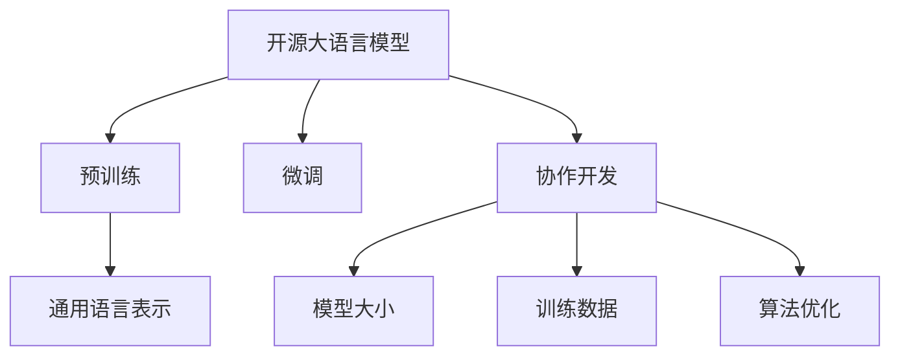

                 

# 开源 LLM：共享和协作开发

## 1. 背景介绍

### 1.1 问题由来

近年来，大语言模型（Large Language Model, LLM）在自然语言处理（NLP）领域取得了显著的进展，涌现出诸如GPT-3、BERT、T5等高性能模型。这些模型通过大规模无标签文本数据预训练，学习到丰富的语言知识，能够在各种NLP任务上取得优异的性能。然而，由于预训练和微调过程的高成本，以及模型部署的复杂性，这些模型往往难以在开源社区和产业界得到广泛传播和应用。

### 1.2 问题核心关键点

开源大语言模型的共享和协作开发成为当前大模型应用的重要方向。通过开源社区和工业界的合作，可以实现大模型的高效部署、快速迭代和广泛应用。这对加速NLP技术的产业化进程，推动人工智能技术的普及，具有重要意义。

然而，开源大语言模型共享和协作开发也面临一些挑战，如模型大小、训练数据、算法优化等。本文将深入探讨这些关键问题，并提出一些可行的解决方案，以期为开源大语言模型的共享和协作开发提供指导。

## 2. 核心概念与联系

### 2.1 核心概念概述

为更好地理解开源大语言模型的共享和协作开发，本节将介绍几个密切相关的核心概念：

- 开源大语言模型(Open Source Large Language Model, LLM)：通过开源社区合作开发的通用语言模型，其源代码、参数和训练数据都对外公开，便于其他开发者基于此进行研究和应用。

- 预训练(Pre-training)：指在大规模无标签文本语料上，通过自监督学习任务训练通用语言模型的过程。预训练使得模型学习到语言的通用表示。

- 微调(Fine-tuning)：指在预训练模型的基础上，使用下游任务的少量标注数据，通过有监督学习优化模型在特定任务上的性能。

- 协作开发(Collaborative Development)：指多个人或团队共同开发一个项目，通过代码库、文档和社区讨论等形式进行协作。

- 模型大小(Model Size)：指大语言模型中参数的数量和模型的复杂度，通常以参数数量G或参数密度P表示。

- 训练数据(Training Data)：指用于预训练或微调的文本数据集，其质量和多样性直接影响模型性能。

- 算法优化(Algorithm Optimization)：指在大模型微调过程中，优化模型的训练算法，如Adam、Adafactor等，以提高模型训练和推理的速度和效率。

这些核心概念之间的逻辑关系可以通过以下Mermaid流程图来展示：



这个流程图展示了大语言模型的核心概念及其之间的关系：

1. 开源大语言模型通过预训练获得基础能力。
2. 微调是对预训练模型进行任务特定的优化，以提升模型性能。
3. 协作开发是开源社区和产业界共同参与项目开发的形式，促进模型和算法的不断进步。
4. 模型大小和训练数据直接影响模型的预训练和微调效果。
5. 算法优化则提升模型训练和推理的效率。

这些概念共同构成了大语言模型的学习和应用框架，使其能够在各种场景下发挥强大的语言理解和生成能力。通过理解这些核心概念，我们可以更好地把握大语言模型的工作原理和优化方向。

## 3. 核心算法原理 & 具体操作步骤

### 3.1 算法原理概述

开源大语言模型的共享和协作开发，本质上是一个有组织的、高效的大模型开发和应用过程。其核心思想是：通过开源社区和工业界的合作，将预训练模型和微调方法公开，使更多开发者能够基于此进行研究和应用，同时不断收集反馈和改进模型。

形式化地，假设开源大语言模型为 $M_{\theta}$，其中 $\theta$ 为预训练得到的模型参数。给定下游任务 $T$ 的标注数据集 $D=\{(x_i, y_i)\}_{i=1}^N$，协作开发的优化目标是最小化经验风险，即找到最优参数：

$$
\theta^* = \mathop{\arg\min}_{\theta} \mathcal{L}(M_{\theta},D)
$$

其中 $\mathcal{L}$ 为针对任务 $T$ 设计的损失函数，用于衡量模型预测输出与真实标签之间的差异。常见的损失函数包括交叉熵损失、均方误差损失等。

### 3.2 算法步骤详解

开源大语言模型的共享和协作开发一般包括以下几个关键步骤：

**Step 1: 准备预训练模型和数据集**
- 选择合适的预训练语言模型 $M_{\theta}$ 作为初始化参数，如 BERT、GPT 等。
- 准备下游任务 $T$ 的标注数据集 $D$，划分为训练集、验证集和测试集。一般要求标注数据与预训练数据的分布不要差异过大。

**Step 2: 发布模型和数据**
- 将预训练模型和训练数据上传到开源社区或云平台，提供便捷的访问接口，如Github、GitLab等。
- 发布模型架构和代码示例，提供详细的文档和API接口说明，帮助开发者理解和使用模型。

**Step 3: 社区协作开发**
- 建立开源社区或论坛，鼓励开发者基于此模型进行研究和应用。
- 组织定期的线上线下活动，如Workshop、Meetup等，促进开发者之间的交流和合作。
- 提供代码贡献指南和贡献者代码审查机制，确保代码质量和项目健康发展。

**Step 4: 模型迭代和改进**
- 收集社区开发者对模型的反馈，进行模型微调和优化。
- 不断更新模型和代码库，修复已知问题和引入新功能。
- 发布新版本模型，提供详细的更新日志和版本说明。

**Step 5: 推广和应用**
- 将开源模型部署到云平台或本地服务器，提供便捷的服务接口。
- 在实际应用场景中进行测试和验证，展示开源模型的价值。
- 通过学术论文、技术博客等形式，分享模型应用经验和创新成果。

以上是开源大语言模型共享和协作开发的一般流程。在实际应用中，还需要根据具体项目的特点，对开发过程的各个环节进行优化设计，如改进训练目标函数，引入更多的正则化技术，搜索最优的超参数组合等，以进一步提升模型性能。

### 3.3 算法优缺点

开源大语言模型的共享和协作开发方法具有以下优点：
1. 促进技术传播：通过开源社区的协作，大语言模型能够快速传播到更多用户和开发者手中，加速NLP技术的产业化进程。
2. 减少重复劳动：多方合作开发，可以减少单个开发者在模型训练和微调上的重复劳动，提高开发效率。
3. 促进创新：开源社区汇聚了来自不同背景和领域的开发者，能够产生更多创新思路和算法优化。
4. 增加用户信任：开源模型具有透明度和可验证性，用户可以更好地理解和信任模型。

同时，该方法也存在一些局限性：
1. 缺乏统一标准：不同的开源社区和工业界有不同的标准和规范，可能导致模型和代码不一致。
2. 依赖社区活跃度：社区的活跃度和参与度直接影响模型的迭代和改进速度。
3. 版权和法律问题：开源模型需要考虑版权和法律问题，确保数据的合规使用。
4. 技术门槛较高：开源模型需要较高的技术能力和时间投入，可能对一些开发者不太友好。

尽管存在这些局限性，但就目前而言，开源大语言模型的共享和协作开发仍然是大模型应用的重要方向。未来相关研究的重点在于如何进一步降低技术门槛，促进更多的开发者参与，同时兼顾版权和法律问题。

### 3.4 算法应用领域

开源大语言模型的共享和协作开发已经在NLP领域得到了广泛的应用，覆盖了几乎所有常见任务，例如：

- 文本分类：如情感分析、主题分类、意图识别等。通过微调使模型学习文本-标签映射。
- 命名实体识别：识别文本中的人名、地名、机构名等特定实体。通过微调使模型掌握实体边界和类型。
- 关系抽取：从文本中抽取实体之间的语义关系。通过微调使模型学习实体-关系三元组。
- 问答系统：对自然语言问题给出答案。将问题-答案对作为微调数据，训练模型学习匹配答案。
- 机器翻译：将源语言文本翻译成目标语言。通过微调使模型学习语言-语言映射。
- 文本摘要：将长文本压缩成简短摘要。将文章-摘要对作为微调数据，使模型学习抓取要点。
- 对话系统：使机器能够与人自然对话。将多轮对话历史作为上下文，微调模型进行回复生成。

除了上述这些经典任务外，开源大语言模型也被创新性地应用到更多场景中，如可控文本生成、常识推理、代码生成、数据增强等，为NLP技术带来了全新的突破。随着预训练模型和开源社区的持续演进，相信开源大语言模型必将在更多领域得到应用，为NLP技术的发展注入新的动力。

## 4. 数学模型和公式 & 详细讲解 & 举例说明

### 4.1 数学模型构建

本节将使用数学语言对开源大语言模型的共享和协作开发过程进行更加严格的刻画。

记开源大语言模型为 $M_{\theta}$，其中 $\theta$ 为模型参数。假设微调任务的训练集为 $D=\{(x_i,y_i)\}_{i=1}^N, x_i \in \mathcal{X}, y_i \in \mathcal{Y}$。

定义模型 $M_{\theta}$ 在数据样本 $(x,y)$ 上的损失函数为 $\ell(M_{\theta}(x),y)$，则在数据集 $D$ 上的经验风险为：

$$
\mathcal{L}(\theta) = \frac{1}{N} \sum_{i=1}^N \ell(M_{\theta}(x_i),y_i)
$$

微调的优化目标是最小化经验风险，即找到最优参数：

$$
\theta^* = \mathop{\arg\min}_{\theta} \mathcal{L}(\theta)
$$

在实践中，我们通常使用基于梯度的优化算法（如SGD、Adam等）来近似求解上述最优化问题。设 $\eta$ 为学习率，$\lambda$ 为正则化系数，则参数的更新公式为：

$$
\theta \leftarrow \theta - \eta \nabla_{\theta}\mathcal{L}(\theta) - \eta\lambda\theta
$$

其中 $\nabla_{\theta}\mathcal{L}(\theta)$ 为损失函数对参数 $\theta$ 的梯度，可通过反向传播算法高效计算。

### 4.2 公式推导过程

以下我们以二分类任务为例，推导交叉熵损失函数及其梯度的计算公式。

假设模型 $M_{\theta}$ 在输入 $x$ 上的输出为 $\hat{y}=M_{\theta}(x) \in [0,1]$，表示样本属于正类的概率。真实标签 $y \in \{0,1\}$。则二分类交叉熵损失函数定义为：

$$
\ell(M_{\theta}(x),y) = -[y\log \hat{y} + (1-y)\log (1-\hat{y})]
$$

将其代入经验风险公式，得：

$$
\mathcal{L}(\theta) = -\frac{1}{N}\sum_{i=1}^N [y_i\log M_{\theta}(x_i)+(1-y_i)\log(1-M_{\theta}(x_i))]
$$

根据链式法则，损失函数对参数 $\theta_k$ 的梯度为：

$$
\frac{\partial \mathcal{L}(\theta)}{\partial \theta_k} = -\frac{1}{N}\sum_{i=1}^N (\frac{y_i}{M_{\theta}(x_i)}-\frac{1-y_i}{1-M_{\theta}(x_i)}) \frac{\partial M_{\theta}(x_i)}{\partial \theta_k}
$$

其中 $\frac{\partial M_{\theta}(x_i)}{\partial \theta_k}$ 可进一步递归展开，利用自动微分技术完成计算。

在得到损失函数的梯度后，即可带入参数更新公式，完成模型的迭代优化。重复上述过程直至收敛，最终得到适应下游任务的最优模型参数 $\theta^*$。

## 5. 项目实践：代码实例和详细解释说明

### 5.1 开发环境搭建

在进行开源大语言模型的共享和协作开发前，我们需要准备好开发环境。以下是使用Python进行PyTorch开发的环境配置流程：

1. 安装Anaconda：从官网下载并安装Anaconda，用于创建独立的Python环境。

2. 创建并激活虚拟环境：
```bash
conda create -n pytorch-env python=3.8 
conda activate pytorch-env
```

3. 安装PyTorch：根据CUDA版本，从官网获取对应的安装命令。例如：
```bash
conda install pytorch torchvision torchaudio cudatoolkit=11.1 -c pytorch -c conda-forge
```

4. 安装Transformers库：
```bash
pip install transformers
```

5. 安装各类工具包：
```bash
pip install numpy pandas scikit-learn matplotlib tqdm jupyter notebook ipython
```

完成上述步骤后，即可在`pytorch-env`环境中开始开发实践。

### 5.2 源代码详细实现

下面我以一个简单的开源NLP项目为例，给出使用Transformers库对开源BERT模型进行协作开发的PyTorch代码实现。

首先，定义一个简单的NER任务的数据处理函数：

```python
from transformers import BertTokenizer
from torch.utils.data import Dataset
import torch

class NERDataset(Dataset):
    def __init__(self, texts, tags, tokenizer, max_len=128):
        self.texts = texts
        self.tags = tags
        self.tokenizer = tokenizer
        self.max_len = max_len
        
    def __len__(self):
        return len(self.texts)
    
    def __getitem__(self, item):
        text = self.texts[item]
        tags = self.tags[item]
        
        encoding = self.tokenizer(text, return_tensors='pt', max_length=self.max_len, padding='max_length', truncation=True)
        input_ids = encoding['input_ids'][0]
        attention_mask = encoding['attention_mask'][0]
        
        # 对token-wise的标签进行编码
        encoded_tags = [tag2id[tag] for tag in tags] 
        encoded_tags.extend([tag2id['O']] * (self.max_len - len(encoded_tags)))
        labels = torch.tensor(encoded_tags, dtype=torch.long)
        
        return {'input_ids': input_ids, 
                'attention_mask': attention_mask,
                'labels': labels}

# 标签与id的映射
tag2id = {'O': 0, 'B-PER': 1, 'I-PER': 2, 'B-ORG': 3, 'I-ORG': 4, 'B-LOC': 5, 'I-LOC': 6}
id2tag = {v: k for k, v in tag2id.items()}

# 创建dataset
tokenizer = BertTokenizer.from_pretrained('bert-base-cased')

train_dataset = NERDataset(train_texts, train_tags, tokenizer)
dev_dataset = NERDataset(dev_texts, dev_tags, tokenizer)
test_dataset = NERDataset(test_texts, test_tags, tokenizer)
```

然后，定义模型和优化器：

```python
from transformers import BertForTokenClassification, AdamW

model = BertForTokenClassification.from_pretrained('bert-base-cased', num_labels=len(tag2id))

optimizer = AdamW(model.parameters(), lr=2e-5)
```

接着，定义训练和评估函数：

```python
from torch.utils.data import DataLoader
from tqdm import tqdm
from sklearn.metrics import classification_report

device = torch.device('cuda') if torch.cuda.is_available() else torch.device('cpu')
model.to(device)

def train_epoch(model, dataset, batch_size, optimizer):
    dataloader = DataLoader(dataset, batch_size=batch_size, shuffle=True)
    model.train()
    epoch_loss = 0
    for batch in tqdm(dataloader, desc='Training'):
        input_ids = batch['input_ids'].to(device)
        attention_mask = batch['attention_mask'].to(device)
        labels = batch['labels'].to(device)
        model.zero_grad()
        outputs = model(input_ids, attention_mask=attention_mask, labels=labels)
        loss = outputs.loss
        epoch_loss += loss.item()
        loss.backward()
        optimizer.step()
    return epoch_loss / len(dataloader)

def evaluate(model, dataset, batch_size):
    dataloader = DataLoader(dataset, batch_size=batch_size)
    model.eval()
    preds, labels = [], []
    with torch.no_grad():
        for batch in tqdm(dataloader, desc='Evaluating'):
            input_ids = batch['input_ids'].to(device)
            attention_mask = batch['attention_mask'].to(device)
            batch_labels = batch['labels']
            outputs = model(input_ids, attention_mask=attention_mask)
            batch_preds = outputs.logits.argmax(dim=2).to('cpu').tolist()
            batch_labels = batch_labels.to('cpu').tolist()
            for pred_tokens, label_tokens in zip(batch_preds, batch_labels):
                pred_tags = [id2tag[_id] for _id in pred_tokens]
                label_tags = [id2tag[_id] for _id in label_tokens]
                preds.append(pred_tags[:len(label_tags)])
                labels.append(label_tags)
                
    print(classification_report(labels, preds))
```

最后，启动训练流程并在测试集上评估：

```python
epochs = 5
batch_size = 16

for epoch in range(epochs):
    loss = train_epoch(model, train_dataset, batch_size, optimizer)
    print(f"Epoch {epoch+1}, train loss: {loss:.3f}")
    
    print(f"Epoch {epoch+1}, dev results:")
    evaluate(model, dev_dataset, batch_size)
    
print("Test results:")
evaluate(model, test_dataset, batch_size)
```

以上就是使用PyTorch对开源BERT模型进行协作开发的完整代码实现。可以看到，得益于Transformers库的强大封装，我们可以用相对简洁的代码完成开源模型的加载和协作开发。

### 5.3 代码解读与分析

让我们再详细解读一下关键代码的实现细节：

**NERDataset类**：
- `__init__`方法：初始化文本、标签、分词器等关键组件。
- `__len__`方法：返回数据集的样本数量。
- `__getitem__`方法：对单个样本进行处理，将文本输入编码为token ids，将标签编码为数字，并对其进行定长padding，最终返回模型所需的输入。

**tag2id和id2tag字典**：
- 定义了标签与数字id之间的映射关系，用于将token-wise的预测结果解码回真实的标签。

**训练和评估函数**：
- 使用PyTorch的DataLoader对数据集进行批次化加载，供模型训练和推理使用。
- 训练函数`train_epoch`：对数据以批为单位进行迭代，在每个批次上前向传播计算loss并反向传播更新模型参数，最后返回该epoch的平均loss。
- 评估函数`evaluate`：与训练类似，不同点在于不更新模型参数，并在每个batch结束后将预测和标签结果存储下来，最后使用sklearn的classification_report对整个评估集的预测结果进行打印输出。

**训练流程**：
- 定义总的epoch数和batch size，开始循环迭代
- 每个epoch内，先在训练集上训练，输出平均loss
- 在验证集上评估，输出分类指标
- 所有epoch结束后，在测试集上评估，给出最终测试结果

可以看到，PyTorch配合Transformers库使得开源模型的协作开发变得简洁高效。开发者可以将更多精力放在数据处理、模型改进等高层逻辑上，而不必过多关注底层的实现细节。

当然，工业级的系统实现还需考虑更多因素，如模型的保存和部署、超参数的自动搜索、更灵活的任务适配层等。但核心的协作开发范式基本与此类似。

## 6. 实际应用场景
### 6.1 智能客服系统

基于开源大语言模型的协作开发，可以构建更为高效、灵活的智能客服系统。传统客服往往需要配备大量人力，高峰期响应缓慢，且一致性和专业性难以保证。通过开源社区的协作开发，可以利用开源模型进行快速部署和优化，实现智能客服的7x24小时服务。

在技术实现上，可以收集企业内部的历史客服对话记录，将问题和最佳答复构建成监督数据，在此基础上对开源模型进行协作开发和微调。协作开发过程中，开发者可以根据自己的经验和需求，灵活修改和优化模型，实现更符合企业需求的智能客服系统。同时，开源社区可以不断收集新的对话记录，持续更新模型，保持服务质量。

### 6.2 金融舆情监测

金融机构需要实时监测市场舆论动向，以便及时应对负面信息传播，规避金融风险。传统的人工监测方式成本高、效率低，难以应对网络时代海量信息爆发的挑战。通过开源社区的协作开发，可以构建基于开源模型的金融舆情监测系统。

具体而言，可以收集金融领域相关的新闻、报道、评论等文本数据，并对其进行主题标注和情感标注。在此基础上对开源模型进行协作开发和微调，使其能够自动判断文本属于何种主题，情感倾向是正面、中性还是负面。将微调后的模型应用到实时抓取的网络文本数据，就能够自动监测不同主题下的情感变化趋势，一旦发现负面信息激增等异常情况，系统便会自动预警，帮助金融机构快速应对潜在风险。

### 6.3 个性化推荐系统

当前的推荐系统往往只依赖用户的历史行为数据进行物品推荐，无法深入理解用户的真实兴趣偏好。通过开源社区的协作开发，可以利用开源模型进行个性化推荐系统的构建。

在实践中，可以收集用户浏览、点击、评论、分享等行为数据，提取和用户交互的物品标题、描述、标签等文本内容。将文本内容作为模型输入，用户的后续行为（如是否点击、购买等）作为监督信号，在此基础上对开源模型进行协作开发和微调。微调后的模型能够从文本内容中准确把握用户的兴趣点。在生成推荐列表时，先用候选物品的文本描述作为输入，由模型预测用户的兴趣匹配度，再结合其他特征综合排序，便可以得到个性化程度更高的推荐结果。

### 6.4 未来应用展望

随着开源大语言模型协作开发的不断发展，其在NLP领域的应用前景将更加广阔。

在智慧医疗领域，开源模型可以应用于医学问答、病历分析、药物研发等，提升医疗服务的智能化水平，辅助医生诊疗，加速新药开发进程。

在智能教育领域，开源模型可应用于作业批改、学情分析、知识推荐等方面，因材施教，促进教育公平，提高教学质量。

在智慧城市治理中，开源模型可应用于城市事件监测、舆情分析、应急指挥等环节，提高城市管理的自动化和智能化水平，构建更安全、高效的未来城市。

此外，在企业生产、社会治理、文娱传媒等众多领域，开源模型也将不断得到应用，为经济社会发展注入新的动力。相信随着开源社区和工业界的共同努力，开源大语言模型必将在构建人机协同的智能时代中扮演越来越重要的角色。

## 7. 工具和资源推荐
### 7.1 学习资源推荐

为了帮助开发者系统掌握开源大语言模型的共享和协作开发的技术基础和实践技巧，这里推荐一些优质的学习资源：

1. 《Transformer从原理到实践》系列博文：由大模型技术专家撰写，深入浅出地介绍了Transformer原理、BERT模型、协作开发等前沿话题。

2. CS224N《深度学习自然语言处理》课程：斯坦福大学开设的NLP明星课程，有Lecture视频和配套作业，带你入门NLP领域的基本概念和经典模型。

3. 《Natural Language Processing with Transformers》书籍：Transformers库的作者所著，全面介绍了如何使用Transformers库进行NLP任务开发，包括协作开发在内的诸多范式。

4. HuggingFace官方文档：Transformers库的官方文档，提供了海量预训练模型和完整的协作开发样例代码，是上手实践的必备资料。

5. CLUE开源项目：中文语言理解测评基准，涵盖大量不同类型的中文NLP数据集，并提供了基于协作开发的baseline模型，助力中文NLP技术发展。

通过对这些资源的学习实践，相信你一定能够快速掌握开源大语言模型的协作开发精髓，并用于解决实际的NLP问题。
###  7.2 开发工具推荐

高效的开发离不开优秀的工具支持。以下是几款用于开源大语言模型协作开发的常用工具：

1. PyTorch：基于Python的开源深度学习框架，灵活动态的计算图，适合快速迭代研究。大部分预训练语言模型都有PyTorch版本的实现。

2. TensorFlow：由Google主导开发的开源深度学习框架，生产部署方便，适合大规模工程应用。同样有丰富的预训练语言模型资源。

3. Transformers库：HuggingFace开发的NLP工具库，集成了众多SOTA语言模型，支持PyTorch和TensorFlow，是进行协作开发开发的利器。

4. Weights & Biases：模型训练的实验跟踪工具，可以记录和可视化模型训练过程中的各项指标，方便对比和调优。与主流深度学习框架无缝集成。

5. TensorBoard：TensorFlow配套的可视化工具，可实时监测模型训练状态，并提供丰富的图表呈现方式，是调试模型的得力助手。

6. Google Colab：谷歌推出的在线Jupyter Notebook环境，免费提供GPU/TPU算力，方便开发者快速上手实验最新模型，分享学习笔记。

合理利用这些工具，可以显著提升开源大语言模型协作开发的开发效率，加快创新迭代的步伐。

### 7.3 相关论文推荐

开源大语言模型协作开发的发展源于学界的持续研究。以下是几篇奠基性的相关论文，推荐阅读：

1. Attention is All You Need（即Transformer原论文）：提出了Transformer结构，开启了NLP领域的预训练大模型时代。

2. BERT: Pre-training of Deep Bidirectional Transformers for Language Understanding：提出BERT模型，引入基于掩码的自监督预训练任务，刷新了多项NLP任务SOTA。

3. Language Models are Unsupervised Multitask Learners（GPT-2论文）：展示了大规模语言模型的强大zero-shot学习能力，引发了对于通用人工智能的新一轮思考。

4. Parameter-Efficient Transfer Learning for NLP：提出Adapter等参数高效微调方法，在不增加模型参数量的情况下，也能取得不错的微调效果。

5. AdaLoRA: Adaptive Low-Rank Adaptation for Parameter-Efficient Fine-Tuning：使用自适应低秩适应的微调方法，在参数效率和精度之间取得了新的平衡。

这些论文代表了大语言模型协作开发的发展脉络。通过学习这些前沿成果，可以帮助研究者把握学科前进方向，激发更多的创新灵感。

## 8. 总结：未来发展趋势与挑战

### 8.1 总结

本文对开源大语言模型的协作开发方法进行了全面系统的介绍。首先阐述了开源大语言模型和协作开发的研究背景和意义，明确了协作开发在拓展预训练模型应用、提升下游任务性能方面的独特价值。其次，从原理到实践，详细讲解了协作开发的数学原理和关键步骤，给出了协作开发任务开发的完整代码实例。同时，本文还广泛探讨了协作开发方法在智能客服、金融舆情、个性化推荐等多个行业领域的应用前景，展示了协作开发范式的巨大潜力。此外，本文精选了协作开发技术的各类学习资源，力求为开发者提供全方位的技术指引。

通过本文的系统梳理，可以看到，开源大语言模型的协作开发方法正在成为NLP领域的重要范式，极大地拓展了预训练语言模型的应用边界，催生了更多的落地场景。受益于大规模语料的预训练和协作开发，开源模型以更低的时间和标注成本，在小样本条件下也能取得不俗的效果，有力推动了NLP技术的产业化进程。未来，伴随预训练语言模型和开源社区的持续演进，相信开源大语言模型协作开发必将在更多领域得到应用，为NLP技术的发展注入新的动力。

### 8.2 未来发展趋势

展望未来，开源大语言模型的协作开发技术将呈现以下几个发展趋势：

1. 模型规模持续增大。随着算力成本的下降和数据规模的扩张，预训练语言模型的参数量还将持续增长。超大规模语言模型蕴含的丰富语言知识，有望支撑更加复杂多变的下游任务协作开发。

2. 协作开发更加广泛。开源社区的活跃度和参与度将进一步提升，更多开发者将基于此进行协作开发，实现技术共享和进步。

3. 模型可解释性增强。开源社区将更注重模型的可解释性，提高算法的透明性和可验证性，为应用场景带来更好的保障。

4. 持续学习成为常态。随着数据分布的不断变化，协作开发的模型也需要持续学习新知识以保持性能。如何在不遗忘原有知识的同时，高效吸收新样本信息，将成为重要的研究课题。

5. 开源项目更加规范化。开源社区将制定更多的项目规范和标准，确保协作开发的质量和一致性。

6. 跨领域协作更加紧密。开源社区将更多地与跨领域的开发者合作，推动技术的融合和创新。

以上趋势凸显了开源大语言模型协作开发技术的广阔前景。这些方向的探索发展，必将进一步提升NLP系统的性能和应用范围，为人类认知智能的进化带来深远影响。

### 8.3 面临的挑战

尽管开源大语言模型的协作开发技术已经取得了瞩目成就，但在迈向更加智能化、普适化应用的过程中，它仍面临着诸多挑战：

1. 缺乏统一标准。不同的开源社区和工业界有不同的标准和规范，可能导致模型和代码不一致。

2. 依赖社区活跃度。社区的活跃度和参与度直接影响模型的迭代和改进速度。

3. 版权和法律问题。开源模型需要考虑版权和法律问题，确保数据的合规使用。

4. 技术门槛较高。开源模型需要较高的技术能力和时间投入，可能对一些开发者不太友好。

尽管存在这些局限性，但就目前而言，开源大语言模型的协作开发仍然是大模型应用的重要方向。未来相关研究的重点在于如何进一步降低技术门槛，促进更多的开发者参与，同时兼顾版权和法律问题。

### 8.4 研究展望

面对开源大语言模型协作开发所面临的种种挑战，未来的研究需要在以下几个方面寻求新的突破：

1. 探索无监督和半监督协作开发方法。摆脱对大规模标注数据的依赖，利用自监督学习、主动学习等无监督和半监督范式，最大限度利用非结构化数据，实现更加灵活高效的协作开发。

2. 研究参数高效和计算高效的协作开发范式。开发更加参数高效的协作开发方法，在固定大部分预训练参数的同时，只更新极少量的任务相关参数。同时优化协作开发模型的计算图，减少前向传播和反向传播的资源消耗，实现更加轻量级、实时性的部署。

3. 引入更多先验知识。将符号化的先验知识，如知识图谱、逻辑规则等，与神经网络模型进行巧妙融合，引导协作开发过程学习更准确、合理的语言模型。同时加强不同模态数据的整合，实现视觉、语音等多模态信息与文本信息的协同建模。

4. 纳入伦理道德约束。在协作开发目标中引入伦理导向的评估指标，过滤和惩罚有偏见、有害的输出倾向。同时加强人工干预和审核，建立模型行为的监管机制，确保输出符合人类价值观和伦理道德。

这些研究方向的探索，必将引领开源大语言模型协作开发技术迈向更高的台阶，为构建安全、可靠、可解释、可控的智能系统铺平道路。面向未来，开源大语言模型协作开发技术还需要与其他人工智能技术进行更深入的融合，如知识表示、因果推理、强化学习等，多路径协同发力，共同推动自然语言理解和智能交互系统的进步。只有勇于创新、敢于突破，才能不断拓展语言模型的边界，让智能技术更好地造福人类社会。

## 9. 附录：常见问题与解答

**Q1：开源大语言模型协作开发是否适用于所有NLP任务？**

A: 开源大语言模型的协作开发在大多数NLP任务上都能取得不错的效果，特别是对于数据量较小的任务。但对于一些特定领域的任务，如医学、法律等，仅仅依靠通用语料预训练的模型可能难以很好地适应。此时需要在特定领域语料上进一步预训练，再进行协作开发和微调，才能获得理想效果。此外，对于一些需要时效性、个性化很强的任务，如对话、推荐等，协作开发方法也需要针对性的改进优化。

**Q2：协作开发过程中如何选择合适的学习率？**

A: 协作开发的学习率一般要比预训练时小1-2个数量级，如果使用过大的学习率，容易破坏预训练权重，导致过拟合。一般建议从1e-5开始调参，逐步减小学习率，直至收敛。也可以使用warmup策略，在开始阶段使用较小的学习率，再逐渐过渡到预设值。需要注意的是，不同的优化器(如Adam、Adafactor等)以及不同的学习率调度策略，可能需要设置不同的学习率阈值。

**Q3：协作开发过程中如何避免灾难性遗忘？**

A: 避免灾难性遗忘的方法包括：
1. 数据增强：通过回译、近义替换等方式扩充训练集
2. 正则化：使用L2正则、Dropout、Early Stopping等防止模型过度适应小规模训练集
3. 参数高效微调：只调整少量参数(如Adapter、Prefix等)，减小过拟合风险
4. 多模型集成：训练多个协作开发模型，取平均输出，抑制过拟合

这些策略往往需要根据具体任务和数据特点进行灵活组合。只有在数据、模型、训练、推理等各环节进行全面优化，才能最大限度地避免协作开发过程中模型性能的下降。

**Q4：协作开发过程中如何降低技术门槛？**

A: 降低技术门槛的方法包括：
1. 提供详细的文档和代码示例，帮助开发者理解和使用模型
2. 建立开源社区或论坛，鼓励开发者基于此模型进行研究和应用
3. 提供代码贡献指南和贡献者代码审查机制，确保代码质量和项目健康发展
4. 简化模型和代码的部署流程，使其易于快速部署和测试

通过这些措施，可以吸引更多的开发者参与协作开发，促进模型的不断改进和优化。

**Q5：协作开发过程中如何确保模型安全？**

A: 确保模型安全的方法包括：
1. 在协作开发目标中引入伦理导向的评估指标，过滤和惩罚有偏见、有害的输出倾向
2. 加强人工干预和审核，建立模型行为的监管机制，确保输出符合人类价值观和伦理道德
3. 采用数据脱敏、访问鉴权等措施，保障数据和模型安全

这些措施可以有效地避免模型输出中的有害信息和偏见，确保模型的伦理和安全。

---

作者：禅与计算机程序设计艺术 / Zen and the Art of Computer Programming

