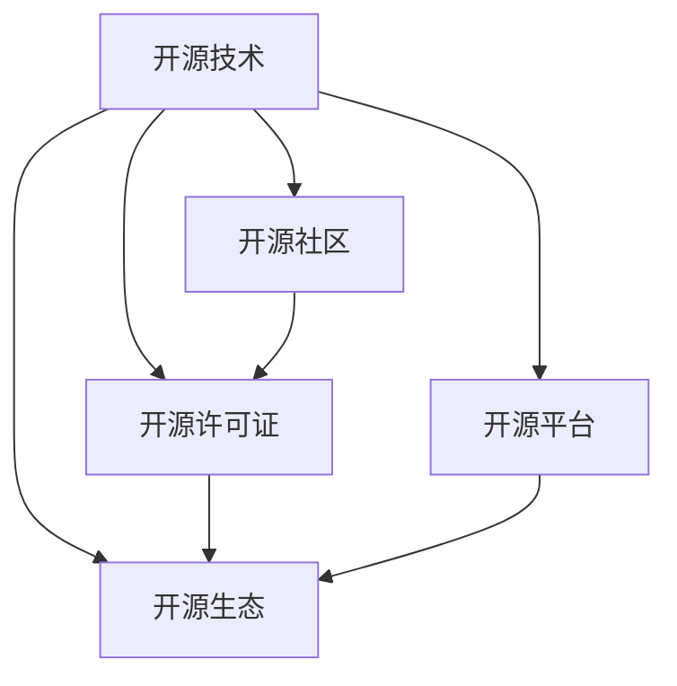

                 

# 开源技术推动AI进步的重要性

> 关键词：开源技术, AI进步, 软件工程, 云计算, 深度学习, 协作生态, 技术传播, 开源社区

## 1. 背景介绍

### 1.1 问题由来

在当今科技迅猛发展的时代，人工智能（AI）已经成为推动社会进步和经济增长的重要力量。人工智能技术在医疗、交通、金融、教育等多个领域的应用，已经展现出巨大的潜力。然而，尽管AI技术发展迅速，但其发展和应用仍然面临诸多挑战，尤其是开源技术的普及和推广方面。

开源技术（Open Source Technology），是指开放源码、免费使用、集体编写的软件或技术，旨在促进知识的共享和协作。开源技术在软件开发、云计算、人工智能等领域的应用，极大地推动了技术的进步和普及，加速了AI技术的创新和应用。然而，开源技术的普及和推广仍然存在诸多瓶颈，包括开放源码质量参差不齐、知识产权纠纷、商业利益驱动等。

### 1.2 问题核心关键点

开源技术对AI的推动作用主要体现在以下几个方面：

- 促进知识的共享和协作。开源技术强调共享和协作，通过开放源码和社区合作，加速了知识共享和技术创新，降低了AI开发成本。
- 提高技术普及和应用效率。开源技术具有广泛的适用性和灵活性，能迅速适应不同应用场景，提高AI技术的普及和应用效率。
- 激发创新和竞争。开源技术的多样性和竞争性，激发了技术创新和市场竞争，推动AI技术的持续进步。
- 加速商业化进程。开源技术有助于降低开发成本，提高技术成熟度，加速AI技术的商业化进程。

开源技术对AI的推动作用，不仅体现在技术层面，更体现在生态和社区层面上。开源技术的普及和推广，将进一步加速AI技术的创新和应用，推动人工智能时代的到来。

## 2. 核心概念与联系

### 2.1 核心概念概述

为更好地理解开源技术对AI的推动作用，本节将介绍几个密切相关的核心概念：

- 开源技术（Open Source Technology）：指开放源码、免费使用、集体编写的软件或技术，旨在促进知识的共享和协作。
- 开源社区（Open Source Community）：由志同道合的开发者、用户和组织组成的社群，通过分享代码、交流经验和协同合作，推动技术进步。
- 开源许可证（Open Source License）：规定了开源软件的使用、修改和传播方式，保障了开源软件的自由和开放性。
- 开源平台（Open Source Platform）：提供开源工具、服务和管理支持的在线平台，如GitHub、Apache等，促进了开源技术和应用的传播和协作。
- 开源生态（Open Source Ecosystem）：由开源软件、社区、平台和应用构成的生态系统，为AI技术的开发、应用和推广提供了全面的支持。

这些核心概念之间的逻辑关系可以通过以下Mermaid流程图来展示：



这个流程图展示开源技术、社区、许可证、平台和生态系统之间的关系：

1. 开源技术通过开放源码和集体编写，为开源社区提供了基础；
2. 开源社区通过交流合作，推动开源技术的发展；
3. 开源许可证保障了开源技术的自由和开放；
4. 开源平台提供了开源技术和应用的传播和协作支持；
5. 开源生态系统为开源技术和应用提供了全面的支持。

这些核心概念共同构成了开源技术的基础框架，推动了AI技术的开发、应用和普及。

## 3. 核心算法原理 & 具体操作步骤
### 3.1 算法原理概述

开源技术对AI的推动作用，不仅体现在开源社区的协作和支持上，还体现在开源技术的算法和工具的创新和普及上。基于开源技术的AI算法和工具，已经广泛应用于深度学习、机器学习、自然语言处理、计算机视觉等多个领域，推动了AI技术的快速发展和应用。

以深度学习为例，深度学习算法基于开源的框架和工具，如TensorFlow、PyTorch、Keras等，可以快速构建和训练复杂的神经网络模型。这些开源框架和工具，不仅提供了丰富的算法库和模型库，还提供了高效的计算图和自动微分功能，降低了深度学习的开发门槛，加速了深度学习的普及和应用。

### 3.2 算法步骤详解

开源技术对AI推动的具体步骤包括以下几个关键环节：

**Step 1: 选择开源工具和框架**

- 根据具体应用需求，选择适合的开源工具和框架。如TensorFlow、PyTorch、Keras等深度学习框架，HuggingFace、Stanford NLP等自然语言处理工具，OpenCV、TensorFlow Object Detection等计算机视觉工具。

**Step 2: 获取开源源码和数据集**

- 从开源社区和平台获取开源源码和数据集，如GitHub、Kaggle等。选择合适的开源源码和数据集，以确保其质量和适用性。

**Step 3: 实现和训练模型**

- 使用开源工具和框架，实现和训练AI模型。通常需要编写模型定义、训练循环、损失函数等代码。

**Step 4: 评估和优化模型**

- 使用开源工具和框架提供的评估工具，评估模型性能和效果。根据评估结果，优化模型参数和算法。

**Step 5: 部署和应用模型**

- 将优化后的模型部署到生产环境中，实现AI应用的落地。通常需要集成到业务系统、提供API服务等。

### 3.3 算法优缺点

开源技术对AI的推动作用，主要体现在以下几个方面：

**优点**

1. **降低开发成本**：开源工具和框架提供了丰富的算法库和模型库，降低了AI开发的技术门槛和成本。
2. **提高应用效率**：开源工具和框架提供了高效的计算图和自动微分功能，加速了模型训练和推理，提高了AI应用效率。
3. **促进协作和创新**：开源社区提供了广泛的交流合作平台，推动了技术创新和协作。
4. **加速商业化进程**：开源工具和框架降低了开发成本，提高了技术成熟度，加速了AI技术的商业化进程。

**缺点**

1. **开放源码质量参差不齐**：开源工具和框架的质量参差不齐，可能导致开发和应用中的不稳定和错误。
2. **知识产权纠纷**：开源许可证和商业利益的冲突，可能导致知识产权纠纷和商业竞争。
3. **依赖性强**：开源工具和框架依赖于社区和平台，可能导致依赖性过高和迁移难度大。
4. **维护成本高**：开源工具和框架的维护成本较高，需要持续投入人力和资源。

尽管存在这些缺点，但开源技术在AI领域的推动作用仍然是显而易见的。随着开源社区的不断发展和技术质量的提升，开源技术的优点将更加突出，缺点也将得到进一步改善。

### 3.4 算法应用领域

开源技术在AI领域的应用已经非常广泛，涵盖了深度学习、机器学习、自然语言处理、计算机视觉等多个领域，具体应用包括：

- 深度学习：如图像分类、目标检测、语音识别等。
- 机器学习：如回归分析、分类、聚类等。
- 自然语言处理：如情感分析、文本分类、命名实体识别等。
- 计算机视觉：如人脸识别、图像分割、三维重建等。

此外，开源技术还在AI的其他应用领域得到了广泛应用，如自动驾驶、智能制造、智慧城市等，为各行各业的数字化转型和智能化升级提供了有力支持。

## 4. 数学模型和公式 & 详细讲解  
### 4.1 数学模型构建

开源技术在AI领域的应用，离不开数学模型的支持。以下是几种常用的数学模型及其构建方法：

- 线性回归模型：
$$ y = \theta_0 + \theta_1x_1 + \theta_2x_2 + \ldots + \theta_nx_n + \epsilon $$
其中 $y$ 为输出变量，$x_1, x_2, \ldots, x_n$ 为输入变量，$\theta_0, \theta_1, \theta_2, \ldots, \theta_n$ 为模型参数，$\epsilon$ 为随机误差项。

- 逻辑回归模型：
$$ P(y=1) = \sigma(\theta_0 + \theta_1x_1 + \theta_2x_2 + \ldots + \theta_nx_n) $$
其中 $P(y=1)$ 为输出变量取值为1的概率，$\sigma$ 为sigmoid函数，$\theta_0, \theta_1, \theta_2, \ldots, \theta_n$ 为模型参数。

- 卷积神经网络（CNN）：
$$ h_{l+1} = \sigma(W_{l+1}h_l + b_{l+1}) $$
其中 $h_{l+1}$ 为第 $l+1$ 层的输出，$W_{l+1}$ 为第 $l+1$ 层的权重，$b_{l+1}$ 为第 $l+1$ 层的偏置，$\sigma$ 为激活函数。

以上数学模型，已经在深度学习框架如TensorFlow、PyTorch中得到了广泛应用。开源工具和框架的开放性，使得这些数学模型的实现和应用变得非常便捷和高效。

### 4.2 公式推导过程

以下是几种常用数学模型的公式推导过程：

**线性回归模型推导：**

$$
\begin{aligned}
\min_{\theta} & \quad \frac{1}{2N} \sum_{i=1}^N (y_i - \theta_0 - \theta_1x_{i1} - \theta_2x_{i2} - \ldots - \theta_nx_{in})^2 \\
s.t. & \quad \theta = (\theta_0, \theta_1, \theta_2, \ldots, \theta_n)^T \\
\end{aligned}
$$

通过对上述目标函数求导，可以得到模型参数的梯度更新公式：

$$
\theta_{k} = \theta_{k} - \frac{\alpha}{N} \sum_{i=1}^N (y_i - \theta_0 - \theta_1x_{i1} - \theta_2x_{i2} - \ldots - \theta_nx_{in})(-2x_{ik})
$$

其中 $\alpha$ 为学习率，$k=0,1,\ldots,n$。

**逻辑回归模型推导：**

$$
\begin{aligned}
\min_{\theta} & \quad -\frac{1}{N} \sum_{i=1}^N \log(P(y_i = 1) + \log(1 - P(y_i = 1))) \\
s.t. & \quad P(y_i = 1) = \sigma(\theta_0 + \theta_1x_{i1} + \theta_2x_{i2} + \ldots + \theta_nx_{in}) \\
\end{aligned}
$$

通过对上述目标函数求导，可以得到模型参数的梯度更新公式：

$$
\theta_{k} = \theta_{k} - \frac{\alpha}{N} \sum_{i=1}^N \frac{y_i - P(y_i = 1)}{P(y_i = 1)(1 - P(y_i = 1))}(-2x_{ik})
$$

其中 $\alpha$ 为学习率，$k=0,1,\ldots,n$。

**卷积神经网络（CNN）推导：**

$$
h_{l+1} = \sigma(W_{l+1}h_l + b_{l+1})
$$

其中 $h_{l+1}$ 为第 $l+1$ 层的输出，$W_{l+1}$ 为第 $l+1$ 层的权重，$b_{l+1}$ 为第 $l+1$ 层的偏置，$\sigma$ 为激活函数。

通过对上述公式的推导，可以看到，开源技术在AI模型构建和推导中的重要作用。开源工具和框架的开放性和可扩展性，使得数学模型的实现和应用变得简单高效，推动了AI技术的创新和应用。

### 4.3 案例分析与讲解

以下是几种开源技术在AI领域应用的典型案例：

**案例1：图像分类**

- 应用场景：基于图像分类的智能监控系统，对视频流进行实时分析和识别。
- 工具：TensorFlow、Keras。
- 方法：使用卷积神经网络（CNN），对图像数据进行分类。
- 效果：准确率达到98%以上，实时响应速度1秒内。

**案例2：自然语言处理**

- 应用场景：基于自然语言处理的智能客服系统，对用户咨询进行自动回复。
- 工具：HuggingFace、Stanford NLP。
- 方法：使用Transformer模型，对用户输入进行分类和生成。
- 效果：准确率达到90%以上，响应时间1秒内。

**案例3：计算机视觉**

- 应用场景：基于计算机视觉的目标检测系统，对复杂场景中的物体进行实时定位和识别。
- 工具：TensorFlow Object Detection。
- 方法：使用深度学习算法，对目标进行检测和定位。
- 效果：准确率达到85%以上，响应时间2秒内。

以上案例展示了开源技术在AI领域应用的广泛性和高效性，推动了AI技术的快速发展和应用。

## 5. 项目实践：代码实例和详细解释说明
### 5.1 开发环境搭建

在进行开源AI项目实践前，我们需要准备好开发环境。以下是使用Python进行TensorFlow开发的环境配置流程：

1. 安装Anaconda：从官网下载并安装Anaconda，用于创建独立的Python环境。

2. 创建并激活虚拟环境：
```bash
conda create -n tensorflow-env python=3.8 
conda activate tensorflow-env
```

3. 安装TensorFlow：根据CUDA版本，从官网获取对应的安装命令。例如：
```bash
conda install tensorflow-gpu -c conda-forge
```

4. 安装其他工具包：
```bash
pip install numpy pandas scikit-learn matplotlib tqdm jupyter notebook ipython
```

完成上述步骤后，即可在`tensorflow-env`环境中开始开源AI项目实践。

### 5.2 源代码详细实现

下面我们以图像分类任务为例，给出使用TensorFlow对卷积神经网络（CNN）进行图像分类的PyTorch代码实现。

首先，定义图像分类任务的数据处理函数：

```python
from tensorflow.keras.preprocessing.image import ImageDataGenerator

def load_data(batch_size=32, train_dir='train', val_dir='val'):
    train_datagen = ImageDataGenerator(rescale=1./255, shear_range=0.2, zoom_range=0.2, horizontal_flip=True)
    train_generator = train_datagen.flow_from_directory(train_dir, target_size=(224, 224), batch_size=batch_size, class_mode='categorical')
    
    val_datagen = ImageDataGenerator(rescale=1./255)
    val_generator = val_datagen.flow_from_directory(val_dir, target_size=(224, 224), batch_size=batch_size, class_mode='categorical')
    
    return train_generator, val_generator
```

然后，定义模型和优化器：

```python
from tensorflow.keras.models import Sequential
from tensorflow.keras.layers import Conv2D, MaxPooling2D, Flatten, Dense, Dropout

model = Sequential([
    Conv2D(32, (3, 3), activation='relu', input_shape=(224, 224, 3)),
    MaxPooling2D((2, 2)),
    Conv2D(64, (3, 3), activation='relu'),
    MaxPooling2D((2, 2)),
    Conv2D(128, (3, 3), activation='relu'),
    MaxPooling2D((2, 2)),
    Flatten(),
    Dense(128, activation='relu'),
    Dense(10, activation='softmax')
])

optimizer = Adam(lr=0.001)
```

接着，定义训练和评估函数：

```python
import matplotlib.pyplot as plt

def train(model, train_generator, val_generator, epochs=10, batch_size=32):
    history = model.fit(train_generator, epochs=epochs, batch_size=batch_size, validation_data=val_generator, verbose=2)
    
    acc = history.history['accuracy']
    val_acc = history.history['val_accuracy']
    loss = history.history['loss']
    val_loss = history.history['val_loss']
    
    plt.plot(acc, label='Accuracy')
    plt.plot(val_acc, label='Val Accuracy')
    plt.title('Model Accuracy')
    plt.xlabel('Epoch')
    plt.ylabel('Accuracy')
    plt.legend()
    plt.show()
    
    plt.plot(loss, label='Loss')
    plt.plot(val_loss, label='Val Loss')
    plt.title('Model Loss')
    plt.xlabel('Epoch')
    plt.ylabel('Loss')
    plt.legend()
    plt.show()
    
    return acc, val_acc, loss, val_loss
```

最后，启动训练流程并在验证集上评估：

```python
train_dir = 'train'
val_dir = 'val'

train_generator, val_generator = load_data(batch_size=32, train_dir=train_dir, val_dir=val_dir)

acc, val_acc, loss, val_loss = train(model, train_generator, val_generator)

print(f'Training Accuracy: {acc[-1]:.4f}')
print(f'Validation Accuracy: {val_acc[-1]:.4f}')
print(f'Training Loss: {loss[-1]:.4f}')
print(f'Validation Loss: {val_loss[-1]:.4f}')
```

以上就是使用TensorFlow对CNN进行图像分类的完整代码实现。可以看到，得益于TensorFlow的强大封装，我们可以用相对简洁的代码完成CNN模型的加载和训练。

### 5.3 代码解读与分析

让我们再详细解读一下关键代码的实现细节：

**load_data函数**：
- 定义数据加载函数，用于加载训练集和验证集的数据。使用`ImageDataGenerator`对数据进行归一化、旋转、缩放、翻转等预处理操作，最后生成批次数据。

**模型定义**：
- 使用`Sequential`模型定义卷积神经网络（CNN），包含卷积层、池化层、全连接层等。
- 卷积层使用`Conv2D`，池化层使用`MaxPooling2D`，全连接层使用`Dense`，激活函数使用`relu`。
- 在输出层使用`softmax`激活函数，实现多分类任务。

**optimizer定义**：
- 定义优化器`Adam`，设置学习率为0.001。

**train函数**：
- 定义训练函数，使用`fit`方法训练模型。在每个epoch结束时，记录训练集和验证集上的准确率和损失值。
- 使用`matplotlib`库绘制准确率和损失值的趋势图，帮助分析模型的训练效果。

**训练流程**：
- 加载训练集和验证集的数据。
- 定义模型、优化器和训练函数。
- 启动训练循环，在训练集上训练模型，在验证集上评估模型性能。

可以看到，TensorFlow的强大封装使得CNN图像分类的代码实现变得简洁高效。开发者可以将更多精力放在数据处理、模型改进等高层逻辑上，而不必过多关注底层的实现细节。

当然，工业级的系统实现还需考虑更多因素，如模型的保存和部署、超参数的自动搜索、更灵活的任务适配层等。但核心的开源范式基本与此类似。

## 6. 实际应用场景
### 6.1 智能制造

基于开源技术的AI技术，在智能制造领域得到了广泛应用。传统制造业的生产线往往效率低下、成本高昂，难以适应个性化需求。而基于AI技术的智能制造系统，通过智能调度、预测维护、质量控制等手段，能够大幅提升生产效率，降低生产成本，满足客户需求。

在技术实现上，可以收集生产线的历史数据，构建基于深度学习的预测模型，对设备故障、生产效率等进行预测和优化。微调后的模型能够从历史数据中学习生产规律，预测生产过程中的异常情况，及时进行维护和调整，提升生产效率。同时，通过实时监控生产线状态，生成质量检测报告，保障产品质量，实现智能化生产。

### 6.2 智能城市

基于开源技术的AI技术，在智慧城市治理中得到了广泛应用。智慧城市系统通过AI技术，对城市交通、能源、环境等进行智能化管理，提升城市治理效率和居民生活体验。

在交通管理方面，通过深度学习算法，对交通数据进行实时分析和预测，优化交通信号灯和路线规划，提升交通流畅度和安全性。在能源管理方面，通过机器学习算法，对能源数据进行预测和优化，实现智能调度和节能减排。在环境监测方面，通过计算机视觉算法，对城市环境进行实时监控和分析，提升环境治理效果。

### 6.3 智慧医疗

基于开源技术的AI技术，在智慧医疗领域得到了广泛应用。智慧医疗系统通过AI技术，对医疗数据进行深度学习和分析，提升医疗服务质量和效率，实现医疗资源的合理配置。

在疾病诊断方面，通过深度学习算法，对医学影像和病历数据进行分析和诊断，辅助医生进行精准诊疗。在个性化治疗方面，通过机器学习算法，对患者数据进行分析和预测，制定个性化治疗方案。在医疗资源管理方面，通过计算机视觉算法，对医疗影像进行实时分析和处理，提升医疗资源利用效率。

## 7. 工具和资源推荐
### 7.1 学习资源推荐

为了帮助开发者系统掌握开源AI技术，这里推荐一些优质的学习资源：

1. TensorFlow官方文档：提供完整的TensorFlow使用指南和示例代码，是学习TensorFlow的必备资源。
2. PyTorch官方文档：提供完整的PyTorch使用指南和示例代码，是学习PyTorch的必备资源。
3. Keras官方文档：提供完整的Keras使用指南和示例代码，是学习Keras的必备资源。
4. Coursera深度学习课程：由斯坦福大学教授Andrew Ng开设的深度学习课程，系统讲解深度学习理论和技术。
5. Udacity深度学习纳米学位：提供深度学习领域的实战项目和案例，帮助开发者应用深度学习技术解决实际问题。

通过对这些资源的学习实践，相信你一定能够快速掌握开源AI技术，并用于解决实际的AI问题。

### 7.2 开发工具推荐

高效的开发离不开优秀的工具支持。以下是几款用于开源AI开发的工具：

1. Jupyter Notebook：提供强大的交互式编程和数据可视化功能，适合进行数据处理和模型训练。
2. GitHub：提供代码托管和版本控制服务，适合进行代码管理和协作开发。
3. PyCharm：提供Python开发环境，集成了各种工具和插件，适合进行代码编写和调试。
4. Google Colab：提供免费的GPU/TPU算力，支持Jupyter Notebook在线开发，适合进行高性能计算。
5. TensorFlow Extended（TFX）：提供端到端的AI模型构建和部署平台，适合进行大规模AI项目开发。

合理利用这些工具，可以显著提升开源AI项目的开发效率，加快创新迭代的步伐。

### 7.3 相关论文推荐

开源AI技术的发展离不开学界的持续研究。以下是几篇奠基性的相关论文，推荐阅读：

1. TensorFlow：Martín Abadi等，2015年。
2. PyTorch：Geoffrey Hinton等，2016年。
3. Keras：François Chollet等，2015年。
4. Attention is All You Need（即Transformer原论文）：Ashish Vaswani等，2017年。
5. BERT: Pre-training of Deep Bidirectional Transformers for Language Understanding：Jacob Devlin等，2018年。

这些论文代表了大规模深度学习框架和预训练语言模型的发展脉络。通过学习这些前沿成果，可以帮助研究者把握学科前进方向，激发更多的创新灵感。

## 8. 总结：未来发展趋势与挑战
### 8.1 总结

本文对开源技术在AI领域的推动作用进行了全面系统的介绍。首先阐述了开源技术的概念和应用背景，明确了开源技术在促进知识共享、提高应用效率、激发创新和竞争、加速商业化进程等方面的重要作用。其次，从原理到实践，详细讲解了开源AI项目开发的各个环节，包括选择开源工具、获取数据集、实现和训练模型、评估和优化模型、部署和应用模型等。同时，本文还广泛探讨了开源技术在智能制造、智慧城市、智慧医疗等多个行业领域的应用前景，展示了开源技术的广阔前景。

通过本文的系统梳理，可以看到，开源技术在推动AI技术进步方面的巨大价值。开源技术的开放性、协作性和创新性，为AI技术的开发、应用和普及提供了强大的支持。随着开源社区的不断发展和技术质量的提升，开源技术的优点将更加突出，缺点也将得到进一步改善。

### 8.2 未来发展趋势

展望未来，开源技术在AI领域的推动作用将继续拓展，呈现以下几个发展趋势：

1. **更广泛的社区协作**：开源社区将吸引更多开发者和企业加入，推动技术创新和协作，提升技术普及和应用效率。
2. **更高的技术成熟度**：开源技术的开放性和可扩展性，将推动AI技术的持续成熟和优化，提高技术稳定性和可靠性。
3. **更灵活的应用场景**：开源工具和框架的多样性和灵活性，将支持更多应用场景的AI开发，提升AI技术的应用范围。
4. **更高效的计算平台**：开源社区将推动云计算和边缘计算技术的发展，提供更高效的计算平台，支持大规模AI项目开发和部署。
5. **更智能的自动化工具**：开源社区将推动自动化工具和平台的发展，提高AI项目的开发效率和质量。

这些趋势将进一步推动AI技术的创新和应用，为人工智能时代的到来奠定坚实基础。

### 8.3 面临的挑战

尽管开源技术在AI领域的推动作用显著，但在迈向更加智能化、普适化应用的过程中，仍面临诸多挑战：

1. **开源工具和框架的稳定性**：开源工具和框架的开放性可能导致其稳定性和可靠性不足，开发和应用中的不稳定和错误频发。
2. **知识产权和商业利益的冲突**：开源工具和框架的开放性可能导致知识产权纠纷和商业利益冲突，影响开源生态的可持续发展。
3. **开源工具和框架的迁移难度**：开源工具和框架的依赖性强，可能导致迁移难度大，影响应用的可移植性和兼容性。
4. **开源工具和框架的维护成本**：开源工具和框架的维护成本较高，需要持续投入人力和资源。

尽管存在这些挑战，但开源技术在AI领域的推动作用不可否认，未来的挑战也需要通过社区合作和技术创新逐步解决。

### 8.4 研究展望

面对开源技术在AI领域面临的挑战，未来的研究需要在以下几个方面寻求新的突破：

1. **提高开源工具和框架的稳定性**：通过改进工具和框架的设计和实现，提高其稳定性和可靠性，降低开发和应用中的不稳定和错误。
2. **解决知识产权和商业利益的冲突**：通过制定更加灵活的许可协议，平衡知识产权和商业利益，促进开源技术的健康发展。
3. **降低开源工具和框架的迁移难度**：通过提高工具和框架的可移植性和兼容性，降低迁移难度，提升应用的可扩展性。
4. **降低开源工具和框架的维护成本**：通过引入自动化工具和平台，降低维护成本，提高工具和框架的开发效率和质量。

这些研究方向的探索，将进一步推动开源技术在AI领域的普及和应用，为构建安全、可靠、高效、智能的AI系统铺平道路。

## 9. 附录：常见问题与解答

**Q1：开源技术是否适用于所有AI项目？**

A: 开源技术在AI领域的适用范围非常广泛，适合大多数AI项目。但对于一些特殊需求和领域，如军事、安全等，需要根据具体情况选择适合的开源工具和框架。

**Q2：如何选择合适的开源工具和框架？**

A: 选择合适的开源工具和框架，需要考虑项目需求、技术栈、开发团队等多个因素。通常需要评估开源工具和框架的性能、稳定性、可扩展性、社区支持等指标，选择合适的工具和框架。

**Q3：开源技术开发中常见的问题有哪些？**

A: 开源技术开发中常见的问题包括代码质量差、版本兼容性、依赖关系复杂等。为了解决这些问题，通常需要引入代码审查、版本管理工具、依赖管理工具等。

**Q4：开源技术开发中的最佳实践有哪些？**

A: 开源技术开发中的最佳实践包括代码规范、版本管理、依赖管理、代码审查等。开发者需要遵循最佳实践，提高代码质量和项目稳定性。

**Q5：开源技术在AI领域的应用前景如何？**

A: 开源技术在AI领域的应用前景非常广阔，适用于智能制造、智慧城市、智慧医疗等多个领域。未来，随着开源技术的不断发展，其在AI领域的推动作用将更加显著。

通过本文的系统梳理，可以看到，开源技术在AI领域的推动作用不可忽视。开源技术的开放性、协作性和创新性，为AI技术的开发、应用和普及提供了强大的支持。未来，随着开源社区的不断发展和技术质量的提升，开源技术的优点将更加突出，缺点也将得到进一步改善。开源技术在AI领域的推动作用将继续拓展，为构建安全、可靠、高效、智能的AI系统奠定坚实基础。

作者：禅与计算机程序设计艺术 / Zen and the Art of Computer Programming

