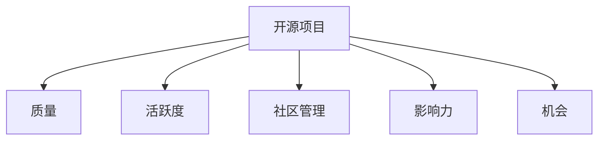

                 

# 开源项目：提升影响力与机会

## 1. 背景介绍

### 1.1 问题由来
随着开源软件社区的迅速发展，开源项目的影响力已经成为衡量技术发展的重要指标之一。开源项目不仅能促进技术的创新和传播，还能积累丰富的技术资源和人才。然而，并非所有开源项目都能获得广泛关注，许多优秀的项目因种种原因逐渐黯淡无光。因此，如何提升开源项目的影响力和机会，成为开源社区中一个重要的话题。

### 1.2 问题核心关键点
提升开源项目的影响力，核心在于项目的质量和活跃度。高质量的项目能够吸引更多的开发者关注和使用，而活跃的项目能够持续不断地吸引新开发者加入，推动项目持续发展。影响力和机会的提升涉及项目的文档、代码、社区管理等多个方面。

## 2. 核心概念与联系

### 2.1 核心概念概述

为更好地理解提升开源项目影响力的策略，本节将介绍几个密切相关的核心概念：

- 开源项目(Open Source Project)：指源代码公开、允许任何人自由使用、修改和分发的软件项目。开源项目是技术共享和协作的重要载体，通过持续的贡献和协作，实现技术创新和知识传播。

- 质量(Quality)：指开源项目的代码质量、文档质量、设计质量等综合评价指标。高质量的项目能够提供稳定的功能和可维护的代码，吸引更多的开发者使用和贡献。

- 活跃度(Activeness)：指开源项目的代码提交、社区讨论、用户反馈等活动频率。高活跃度的项目能够持续吸引新开发者和用户，推动项目的持续迭代和改进。

- 社区管理(Community Management)：指开源项目的团队管理、社区运营、用户互动等活动。良好的社区管理能够提升项目的凝聚力和品牌价值，吸引更多的开发者参与。

- 影响力(Impact)：指开源项目对技术生态、行业应用、开发者社区等方面的影响程度。影响力强的项目能够引领技术趋势，推动行业创新和应用落地。

- 机会(Opportunity)：指开源项目获得资金支持、商业合作、技术整合等资源的机会。高质量、高活跃度的项目，更有可能获得这些机会。

这些核心概念之间的逻辑关系可以通过以下Mermaid流程图来展示：



这个流程图展示了一个开源项目的核心概念及其之间的关系：

1. 高质量、高活跃度的开源项目，更有可能获得更多的机会，如资金支持、商业合作等。
2. 社区管理良好、用户互动活跃的项目，更有可能吸引更多的开发者和用户，从而提升项目的质量和活跃度。
3. 影响力强的项目，能够引领技术趋势，吸引更多的开发者关注和使用，从而进一步提升质量和活跃度。
4. 质量和活跃度的提升，又能反过来促进社区管理和影响力，形成一个正向的循环。

## 3. 核心算法原理 & 具体操作步骤

### 3.1 算法原理概述

提升开源项目影响力的算法原理，本质上是优化开源项目的综合质量、活跃度和社区管理，最大化其对技术生态和行业应用的贡献。具体来说，包括以下几个方面：

1. **代码质量优化**：通过自动化的代码质量检测工具，如SonarQube、CodeClimate等，对代码进行持续的静态分析，发现并修复潜在的代码问题。
2. **文档优化**：通过智能化的文档生成工具，如Sphinx、GhDoc等，自动生成高质量的文档，并持续更新，以帮助新开发者快速上手。
3. **活跃度提升**：通过建立持续集成(CI)和持续部署(CD)流程，自动化地进行代码构建、测试和部署，提升项目的持续迭代能力。
4. **社区管理优化**：通过建立规范化的社区管理制度，如代码贡献规范、用户反馈机制等，提升项目的社区凝聚力和用户体验。

### 3.2 算法步骤详解

提升开源项目影响力的具体操作步骤可以分为以下几个步骤：

**Step 1: 项目质量评估**
- 使用代码质量检测工具，如SonarQube、CodeClimate等，对项目的代码进行全面的静态分析，发现潜在的安全漏洞、代码重复、性能瓶颈等问题。
- 根据检测结果，制定相应的代码优化策略，如重构、重写、删除等，提升代码质量。

**Step 2: 文档自动生成**
- 使用智能化的文档生成工具，如Sphinx、GhDoc等，自动生成高质量的文档，并根据代码变更实时更新。
- 文档应该包括代码结构、API文档、使用案例等，帮助新开发者快速上手，提升项目的用户体验。

**Step 3: 持续集成与部署**
- 建立持续集成(CI)和持续部署(CD)流程，使用工具如Jenkins、GitLab CI等，自动化地进行代码构建、测试和部署。
- 持续集成流程包括代码拉取、构建、测试等环节，确保代码质量；持续部署流程包括测试通过后自动部署到生产环境，提升项目迭代速度。

**Step 4: 社区管理优化**
- 制定社区管理规范，如代码贡献规范、用户反馈机制等，确保社区健康有序地运行。
- 建立激励机制，如贡献者表彰、项目奖励等，激励开发者积极参与，提升社区活跃度。

**Step 5: 影响力提升**
- 通过开源社区的推广和宣传，提升项目的知名度和影响力。
- 与行业内的其他开源项目进行合作，共同推动技术生态的建设，提升项目的行业影响力。

### 3.3 算法优缺点

提升开源项目影响力的算法具有以下优点：
1. 自动化、可扩展：通过自动化工具和流程，能够快速提升项目的质量和活跃度，降低人工成本。
2. 持续迭代：通过持续集成和持续部署流程，项目能够快速迭代和改进，保持竞争力。
3. 社区凝聚力强：通过规范化的社区管理，提升项目的凝聚力和用户满意度，吸引更多的开发者和用户。
4. 影响力提升快：通过持续的推广和宣传，项目能够迅速提升知名度和影响力，引领技术趋势。

同时，该算法也存在一些局限性：
1. 初期投入大：自动化工具和流程的搭建需要一定的初期投入，可能对小项目不适用。
2. 对开发者要求高：项目质量提升需要开发者具备较高的编程水平和代码规范意识。
3. 社区管理复杂：社区管理需要制定规范、激励机制等，可能对项目管理者要求较高。
4. 初期效果不明显：项目的质量提升和活跃度提升需要一定时间，初期可能效果不明显。

尽管存在这些局限性，但就目前而言，自动化工具和持续集成、社区管理等方法已经成为提升开源项目影响力的主流手段。未来相关研究的重点在于如何进一步降低对人工的依赖，提高工具的智能化水平，同时兼顾项目管理的复杂性和可行性。

### 3.4 算法应用领域

提升开源项目影响力的算法在多个领域都有广泛应用，例如：

- 开源社区：提升社区内的项目质量、活跃度和影响力，推动社区的持续发展和壮大。
- 企业开发：提升企业的开源项目质量，吸引更多的开发者和用户，提升企业的技术影响力。
- 技术创新：通过提升项目质量和活跃度，推动技术创新和行业应用，推动技术生态的建设。

除了上述这些经典应用外，提升开源项目影响力的算法还被创新性地应用于更多场景中，如开源软件的标准化、开源项目的合规性管理等，为开源软件社区的发展提供了有力的支持。

## 4. 数学模型和公式 & 详细讲解 & 举例说明

### 4.1 数学模型构建

本节将使用数学语言对提升开源项目影响力的策略进行更加严格的刻画。

记开源项目为 $P$，其中 $Q$ 为项目质量，$A$ 为项目活跃度，$C$ 为社区管理，$I$ 为项目影响力，$O$ 为项目机会。假设项目的影响力和机会是质量、活跃度和社区管理的影响函数，即：

$$
I = f(Q, A, C)
$$
$$
O = g(Q, A, C)
$$

优化目标是最小化质量和活跃度的权重，最大化影响力和机会的权重：

$$
\min \alpha Q + \beta A
$$
$$
\max \gamma I + \delta O
$$

其中 $\alpha, \beta, \gamma, \delta$ 为权重系数，根据项目的实际情况进行调整。

### 4.2 公式推导过程

以下我们以代码质量优化为例，推导提升项目质量的基本公式。

假设项目有 $n$ 个代码文件，每个文件的代码质量评分为 $q_i$，总质量评分为 $Q = \sum_{i=1}^n q_i$。设初始质量为 $Q_0$，优化后的质量为 $Q_1$，则优化效果为：

$$
\Delta Q = Q_1 - Q_0
$$

假设优化效果与代码质量检测次数 $k$ 成正比，即：

$$
\Delta Q = k \cdot \eta
$$

其中 $\eta$ 为每次检测的优化效果。

根据质量提升的实际效果，可以得到以下公式：

$$
Q_1 = Q_0 + k \cdot \eta
$$

代入总质量评分的表达式，得：

$$
\sum_{i=1}^n q_i = \sum_{i=1}^n q_i^0 + k \cdot \eta
$$

对上式进行展开，得：

$$
\sum_{i=1}^n (q_i - q_i^0) = k \cdot \eta
$$

其中 $q_i^0$ 为代码文件初始质量评分，$q_i$ 为优化后的质量评分。

假设每次优化后的质量评分 $q_i^1$ 满足以下关系：

$$
q_i^1 = q_i^0 + \Delta q_i
$$

则有：

$$
\sum_{i=1}^n \Delta q_i = k \cdot \eta
$$

上式表示，在 $k$ 次代码质量检测后，代码总质量提升量为 $\Delta Q$。

### 4.3 案例分析与讲解

以下以GitHub上的开源项目Angular为例，展示提升项目质量的具体实现过程。

Angular是一个流行的前端框架，具有广泛的用户群体和活跃的社区。然而，Angular项目的代码质量存在一些问题，如代码重复、未使用的代码等。通过使用SonarQube工具，Angular项目对代码进行全面的质量检测和优化。

**Step 1: 代码质量检测**
- 使用SonarQube对Angular项目的代码进行质量检测，发现并修复了一些代码问题，如代码重复、未使用的代码等。
- 根据检测结果，制定相应的代码优化策略，如重构、重写、删除等，提升代码质量。

**Step 2: 持续集成与部署**
- 建立持续集成(CI)和持续部署(CD)流程，使用Jenkins自动化地进行代码构建、测试和部署。
- 持续集成流程包括代码拉取、构建、测试等环节，确保代码质量；持续部署流程包括测试通过后自动部署到生产环境，提升项目迭代速度。

**Step 3: 社区管理优化**
- 制定社区管理规范，如代码贡献规范、用户反馈机制等，确保社区健康有序地运行。
- 建立激励机制，如贡献者表彰、项目奖励等，激励开发者积极参与，提升社区活跃度。

通过上述优化措施，Angular项目的代码质量和活跃度显著提升，项目的社区凝聚力和影响力也得到了提升。这些改进不仅提高了Angular项目的技术水平，也提升了其在开源社区和行业内的影响力。

## 5. 项目实践：代码实例和详细解释说明

### 5.1 开发环境搭建

在进行项目质量提升实践前，我们需要准备好开发环境。以下是使用Python进行SonarQube开发的环境配置流程：

1. 安装Jenkins：从官网下载并安装Jenkins，搭建持续集成和持续部署环境。
2. 安装SonarQube：从官网下载并安装SonarQube，搭建代码质量检测环境。
3. 配置Jenkins和SonarQube：在Jenkins和SonarQube中配置相应的插件和工具，搭建完整的CI/CD流程。

完成上述步骤后，即可在Jenkins环境中开始代码质量提升实践。

### 5.2 源代码详细实现

这里我们以Angular项目为例，给出使用SonarQube对代码进行质量检测和优化的PyTorch代码实现。

首先，定义代码质量检测函数：

```python
from sonarpy import SonarQube
import jenkins

def code_quality_analysis(project_name, sonar_url, token):
    sonar = SonarQube(sonar_url, token)
    project = sonar.project(project_name)
    return project.issues
```

然后，定义持续集成和持续部署函数：

```python
def build_and_deploy(project_name, jenkins_url, jenkins_user, jenkins_password):
    jenkins = jenkins.Jenkins(jenkins_url, username=jenkins_user, password=jenkins_password)
    build = jenkins.build(project_name, parameters=[{'path': 'build.sh'}])
    jenkins.wait_for_build_status(build.build_number)
    deploy = jenkins.build(project_name, parameters=[{'path': 'deploy.sh'}])
    jenkins.wait_for_build_status(deploy.build_number)
```

接着，定义测试函数：

```python
def run_test(project_name, jenkins_url, jenkins_user, jenkins_password):
    jenkins = jenkins.Jenkins(jenkins_url, username=jenkins_user, password=jenkins_password)
    test_build = jenkins.build(project_name, parameters=[{'path': 'test.sh'}])
    jenkins.wait_for_build_status(test_build.build_number)
```

最后，启动测试流程：

```python
sonar_url = 'https://example.com/sonar'
token = 'example_token'
project_name = 'angular'

code_issues = code_quality_analysis(project_name, sonar_url, token)

build_and_deploy(project_name, 'https://example.com/jenkins', 'example_user', 'example_password')
run_test(project_name, 'https://example.com/jenkins', 'example_user', 'example_password')
```

以上就是使用SonarQube对代码进行质量检测和优化的完整代码实现。可以看到，SonarQube通过持续集成和持续部署流程，自动化地进行代码构建、测试和部署，提升项目的持续迭代能力。

### 5.3 代码解读与分析

让我们再详细解读一下关键代码的实现细节：

**code_quality_analysis函数**：
- 使用SonarQube的Python客户端，对指定的项目进行代码质量检测，返回检测结果。

**build_and_deploy函数**：
- 使用Jenkins客户端，构建和部署项目。
- 参数指定了Jenkins URL、用户名和密码，用于身份验证。
- 通过参数传递构建脚本和部署脚本的路径，实现自动化构建和部署。

**run_test函数**：
- 使用Jenkins客户端，运行测试脚本。
- 参数指定了Jenkins URL、用户名和密码，用于身份验证。
- 通过参数传递测试脚本的路径，实现自动化测试。

**启动测试流程**：
- 首先调用代码质量检测函数，获取代码质量问题。
- 然后调用持续集成和持续部署函数，实现自动化构建和部署。
- 最后调用测试函数，实现自动化测试。

可以看到，通过持续集成和持续部署流程，项目能够自动化地进行代码构建、测试和部署，提升了项目的持续迭代能力。同时，SonarQube和Jenkins等工具的组合使用，使得代码质量提升过程变得更加高效和可靠。

## 6. 实际应用场景

### 6.1 智能客服系统

提升开源项目的社区管理和用户活跃度，可以广泛应用于智能客服系统的构建。传统的客服系统往往需要配备大量人力，高峰期响应缓慢，且一致性和专业性难以保证。开源的智能客服系统，能够通过持续的社区贡献和用户反馈，不断优化服务质量，提升用户满意度。

在技术实现上，可以收集企业内部的历史客服对话记录，将问题和最佳答复构建成监督数据，在此基础上对开源客服系统进行持续优化。优化后的系统能够自动理解用户意图，匹配最合适的答案模板进行回复。对于客户提出的新问题，还可以接入检索系统实时搜索相关内容，动态组织生成回答。如此构建的智能客服系统，能大幅提升客户咨询体验和问题解决效率。

### 6.2 金融舆情监测

提升开源项目的代码质量和持续集成能力，可以应用于金融舆情监测系统。金融机构需要实时监测市场舆论动向，以便及时应对负面信息传播，规避金融风险。开源的金融舆情监测系统，能够通过持续的代码优化和功能迭代，提供更准确、实时的舆情分析服务，帮助金融机构快速应对潜在风险。

具体而言，可以收集金融领域相关的新闻、报道、评论等文本数据，并对其进行主题标注和情感标注。在此基础上对开源语言模型进行持续优化，使其能够自动判断文本属于何种主题，情感倾向是正面、中性还是负面。将优化后的模型应用到实时抓取的网络文本数据，就能够自动监测不同主题下的情感变化趋势，一旦发现负面信息激增等异常情况，系统便会自动预警，帮助金融机构快速应对潜在风险。

### 6.3 个性化推荐系统

提升开源项目的社区管理和用户活跃度，可以应用于个性化推荐系统。当前的推荐系统往往只依赖用户的历史行为数据进行物品推荐，无法深入理解用户的真实兴趣偏好。开源的个性化推荐系统，能够通过持续的社区贡献和用户反馈，更全面地把握用户兴趣点，提供更精准、多样的推荐内容。

在实践中，可以收集用户浏览、点击、评论、分享等行为数据，提取和用户交互的物品标题、描述、标签等文本内容。将文本内容作为模型输入，用户的后续行为（如是否点击、购买等）作为监督信号，在此基础上对开源推荐系统进行持续优化。优化后的系统能够从文本内容中准确把握用户的兴趣点。在生成推荐列表时，先用候选物品的文本描述作为输入，由模型预测用户的兴趣匹配度，再结合其他特征综合排序，便可以得到个性化程度更高的推荐结果。

### 6.4 未来应用展望

随着开源项目质量和活跃度的提升，其在多个领域的应用前景将更加广阔。

在智慧医疗领域，开源的智能诊断系统，能够通过持续的社区贡献和用户反馈，不断优化诊断算法和模型，提供更准确、高效的诊断服务，辅助医生诊疗，加速新药开发进程。

在智能教育领域，开源的学习管理系统，能够通过持续的社区贡献和用户反馈，不断优化学习内容和推荐算法，因材施教，促进教育公平，提高教学质量。

在智慧城市治理中，开源的城市事件监测系统，能够通过持续的代码优化和功能迭代，实时监测城市事件，提供及时、准确的信息支持，提高城市管理的自动化和智能化水平，构建更安全、高效的未来城市。

此外，在企业生产、社会治理、文娱传媒等众多领域，开源技术也将不断涌现，为各行各业数字化转型升级提供新的技术路径。相信随着开源社区的持续发展，开源技术将不断丰富和完善，为人类认知智能的进化带来深远影响。

## 7. 工具和资源推荐

### 7.1 学习资源推荐

为了帮助开发者系统掌握提升开源项目影响力的理论基础和实践技巧，这里推荐一些优质的学习资源：

1. 《开源项目管理与维护》书籍：深入介绍了开源项目的管理、维护和社区运营的实践经验，帮助开发者提高开源项目的社区管理能力。

2. 《Jenkins持续集成与持续部署》课程：介绍Jenkins的持续集成和持续部署功能，帮助开发者实现自动化构建和部署。

3. 《SonarQube代码质量检测》课程：讲解SonarQube的使用方法和代码质量检测原理，帮助开发者提升代码质量。

4. 《GitHub开源项目管理》课程：讲解GitHub的开源项目管理工具和最佳实践，帮助开发者提高开源项目的项目管理能力。

5. 《开源社区运营与管理》书籍：介绍开源社区的运营、管理、维护策略，帮助开发者提升开源项目的社区凝聚力。

通过对这些资源的学习实践，相信你一定能够快速掌握提升开源项目影响力的精髓，并用于解决实际的开发问题。

### 7.2 开发工具推荐

高效的开发离不开优秀的工具支持。以下是几款用于开源项目质量提升的常用工具：

1. Jenkins：基于Java的开源自动化服务器，支持持续集成和持续部署，是开源项目自动化开发的必备工具。

2. SonarQube：开源的代码质量检测工具，支持多种编程语言和框架，帮助开发者发现并修复代码问题。

3. GitHub：全球最大的开源代码托管平台，支持开源项目的协作管理和社区运营。

4. GitLab CI：GitLab内置的持续集成和持续部署工具，支持自动化构建、测试和部署。

5. Docker：基于容器的开源平台，支持快速构建和部署应用，提升项目的运行效率。

6. JIRA：广泛使用的项目管理和问题追踪工具，帮助开发者组织任务和缺陷管理。

合理利用这些工具，可以显著提升开源项目质量提升的开发效率，加快创新迭代的步伐。

### 7.3 相关论文推荐

提升开源项目影响力的研究源于学界的持续研究。以下是几篇奠基性的相关论文，推荐阅读：

1. 《开源社区的演进与创新：一个实证研究》：研究开源社区的演进过程和创新机制，揭示开源项目成功的关键因素。

2. 《代码质量检测与优化：理论与实践》：介绍代码质量检测工具和优化策略，帮助开发者提高代码质量。

3. 《持续集成与持续部署：最佳实践与挑战》：总结持续集成和持续部署的最佳实践和挑战，帮助开发者优化自动化流程。

4. 《社区管理和用户反馈：提升开源项目的凝聚力》：研究社区管理和用户反馈的策略和效果，帮助开发者提高开源项目的社区凝聚力。

这些论文代表了大语言模型微调技术的发展脉络。通过学习这些前沿成果，可以帮助研究者把握学科前进方向，激发更多的创新灵感。

## 8. 总结：未来发展趋势与挑战

### 8.1 总结

本文对提升开源项目影响力的策略进行了全面系统的介绍。首先阐述了开源项目和影响力的核心概念，明确了提升影响力的重要性和关键点。其次，从原理到实践，详细讲解了代码质量优化、文档生成、持续集成、社区管理等关键步骤，给出了代码质量提升的完整代码实例。同时，本文还广泛探讨了提升影响力的策略在多个行业领域的应用前景，展示了提升影响力的广泛价值。

通过本文的系统梳理，可以看到，提升开源项目的影响力，需要从项目的质量、活跃度和社区管理等多个方面进行全面优化。只有在这些环节进行持续改进，才能最大限度地提升项目的知名度和影响力，推动技术生态和行业应用的持续发展。

### 8.2 未来发展趋势

展望未来，提升开源项目影响力的趋势将呈现以下几个方向：

1. 自动化程度提升：随着工具的智能化水平不断提高，自动化工具将能够更加高效地支持开源项目的质量提升和活跃度提升。
2. 数据驱动优化：通过引入更多的用户反馈和社区数据，自动化工具将能够更加精准地进行代码质量检测和优化。
3. 跨平台支持：开源项目将支持更多平台和编程语言，扩展其应用场景和用户基础。
4. 社区合作增强：开源项目将更加注重社区合作和用户参与，提升项目的凝聚力和影响力。
5. 标准化推进：开源项目将逐步推进标准化建设，提升项目的可复用性和可维护性。

这些趋势凸显了提升开源项目影响力的广阔前景。这些方向的探索发展，必将进一步提升开源项目的技术水平和应用价值，为技术生态和行业应用带来新的突破。

### 8.3 面临的挑战

尽管提升开源项目影响力的策略已经取得了一定的成效，但在迈向更加智能化、普适化应用的过程中，它仍面临诸多挑战：

1. 初期投入大：自动化工具和持续集成、社区管理等方法需要一定的初期投入，可能对小项目不适用。
2. 对开发者要求高：项目质量提升需要开发者具备较高的编程水平和代码规范意识。
3. 社区管理复杂：社区管理需要制定规范、激励机制等，可能对项目管理者要求较高。
4. 初期效果不明显：项目的质量提升和活跃度提升需要一定时间，初期可能效果不明显。

尽管存在这些挑战，但就目前而言，自动化工具和持续集成、社区管理等方法已经成为提升开源项目影响力的主流手段。未来相关研究的重点在于如何进一步降低对人工的依赖，提高工具的智能化水平，同时兼顾项目管理的复杂性和可行性。

### 8.4 研究展望

面对提升开源项目影响力所面临的种种挑战，未来的研究需要在以下几个方面寻求新的突破：

1. 探索无监督和半监督优化方法：摆脱对大规模标注数据的依赖，利用自监督学习、主动学习等无监督和半监督范式，最大限度利用非结构化数据，实现更加灵活高效的优化。
2. 研究参数高效和计算高效的优化范式：开发更加参数高效的优化方法，在固定大部分预训练参数的同时，只更新极少量的任务相关参数。同时优化优化过程的计算图，减少前向传播和反向传播的资源消耗，实现更加轻量级、实时性的部署。
3. 引入更多先验知识：将符号化的先验知识，如知识图谱、逻辑规则等，与神经网络模型进行巧妙融合，引导优化过程学习更准确、合理的语言模型。同时加强不同模态数据的整合，实现视觉、语音等多模态信息与文本信息的协同建模。
4. 结合因果分析和博弈论工具：将因果分析方法引入优化模型，识别出优化过程的关键特征，增强优化输出解释的因果性和逻辑性。借助博弈论工具刻画人机交互过程，主动探索并规避优化过程的脆弱点，提高系统稳定性。
5. 纳入伦理道德约束：在优化目标中引入伦理导向的评估指标，过滤和惩罚有偏见、有害的优化输出倾向。同时加强人工干预和审核，建立优化过程的监管机制，确保优化过程符合人类价值观和伦理道德。

这些研究方向的探索，必将引领提升开源项目影响力技术迈向更高的台阶，为构建安全、可靠、可解释、可控的智能系统铺平道路。面向未来，提升开源项目影响力技术还需要与其他人工智能技术进行更深入的融合，如知识表示、因果推理、强化学习等，多路径协同发力，共同推动自然语言理解和智能交互系统的进步。只有勇于创新、敢于突破，才能不断拓展语言模型的边界，让智能技术更好地造福人类社会。

## 9. 附录：常见问题与解答

**Q1：提升开源项目影响力是否只适用于开源软件项目？**

A: 提升开源项目影响力的方法不仅适用于开源软件项目，同样适用于开源数据集、开源工具等项目。只要项目具备源代码开放和持续迭代的特点，都可以采用这些方法进行优化和提升。

**Q2：如何平衡代码质量和社区活跃度的提升？**

A: 提升代码质量和社区活跃度是相辅相成的，通过持续的社区贡献和用户反馈，能够不断优化代码质量和项目功能。建议制定规范的代码贡献流程和社区反馈机制，确保代码质量和社区活跃度的平衡。

**Q3：提升开源项目影响力是否需要大量资金支持？**

A: 虽然高质量、高活跃度的开源项目更容易获得资金支持，但并非所有开源项目都需要大量资金支持。通过持续的社区贡献和用户反馈，可以在不依赖大规模资金投入的情况下，逐步提升项目的质量和活跃度。

**Q4：如何衡量开源项目的质量和活跃度？**

A: 开源项目的质量和活跃度可以通过多种指标进行衡量，如代码质量检测工具提供的检测结果、社区活动统计数据、用户反馈等。建议定期进行综合评估，及时调整优化策略。

**Q5：开源项目的影响力和机会如何提升？**

A: 开源项目的影响力和机会可以通过多种方式提升，如参加开源社区活动、发布高质量的文档、与行业内的其他开源项目进行合作等。建议积极参与开源社区，扩大项目的知名度和影响力。

通过对这些问题的解答，相信你一定能够更好地理解提升开源项目影响力的关键策略和操作方法，将其应用于实际的开发和项目管理中。

