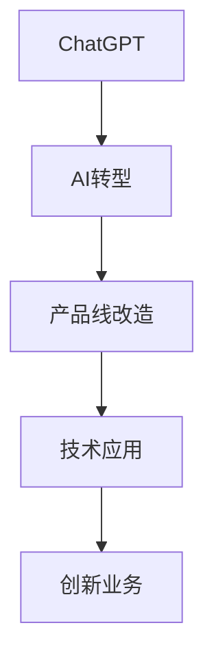

                 

# 微软ALL IN AI:快速用ChatGPT改造产品线

> 关键词：ChatGPT, AI转型, 产品线改造, 技术应用, 创新业务, 微软案例

## 1. 背景介绍

### 1.1 问题由来
随着人工智能技术的飞速发展，AI已经逐渐成为各行各业的核心竞争力之一。作为全球科技巨头，微软自20世纪80年代以来，一直致力于AI技术的研发和应用。近年来，微软在AI领域的投入不断加大，特别是ChatGPT等大模型的推出，更是颠覆了传统的业务模式，引发了业界的广泛关注。

然而，AI技术的深度融合和落地应用，并不是一蹴而就的。许多企业希望借助AI技术提升产品线的竞争力，但又缺乏具体实施的路径和方法。本文将详细介绍微软是如何通过AI技术，尤其是ChatGPT，全面改造其产品线的实践经验，希望能够为其他企业提供借鉴和启示。

### 1.2 问题核心关键点
微软利用AI技术，尤其是ChatGPT大模型，实现了产品线的全面升级，具体表现在以下几个方面：

1. **全流程自动化**：通过AI技术，微软的许多产品线实现了自动化处理，提高了生产效率，降低了运营成本。
2. **智能客服**：利用ChatGPT进行智能客服，提升了用户体验和客户满意度。
3. **个性化推荐**：通过AI技术分析用户数据，实现了个性化推荐，提升了用户体验和购买转化率。
4. **内容生成**：ChatGPT在大模型基础上，能够生成高质量的内容，丰富了产品线的内容生态。
5. **数据驱动决策**：利用AI技术分析海量数据，为业务决策提供数据支持，提高了决策的准确性和效率。

这些核心关键点将通过本文详细介绍，帮助读者了解微软如何利用AI技术，特别是ChatGPT，实现产品线的全面升级。

## 2. 核心概念与联系

### 2.1 核心概念概述

为更好地理解微软利用ChatGPT进行产品线改造的实践经验，本节将介绍几个关键概念：

- **ChatGPT**：由OpenAI开发的先进语言模型，能够理解和生成自然语言，具备多轮对话、理解复杂语义、生成高质量文本等多种能力。
- **AI转型**：通过引入AI技术，改变传统业务模式，提升企业效率和竞争力。
- **产品线改造**：对企业的现有产品线进行全面优化，利用AI技术实现自动化、智能化，提升用户体验和运营效率。
- **技术应用**：将AI技术应用于具体业务场景中，解决实际问题，提升业务价值。
- **创新业务**：利用AI技术，探索新的业务模式和增长点。

这些核心概念之间的逻辑关系可以通过以下Mermaid流程图来展示：



这个流程图展示了ChatGPT、AI转型、产品线改造、技术应用和创新业务之间的逻辑关系：

1. ChatGPT作为AI技术的代表，提供强大的自然语言处理能力。
2. AI转型是利用ChatGPT等技术，改变传统业务模式的过程。
3. 产品线改造是指在AI转型的基础上，对现有产品线进行全面优化。
4. 技术应用则是将AI技术具体应用于业务场景中，解决实际问题。
5. 创新业务是利用AI技术，探索新的商业模式和增长点。

## 3. 核心算法原理 & 具体操作步骤

### 3.1 算法原理概述

微软利用ChatGPT进行产品线改造的核心原理是利用大模型，通过训练和微调，使其能够适应特定的业务场景。以下是详细的技术原理：

1. **预训练**：首先，使用大规模无标签数据对ChatGPT进行预训练，使其具备强大的语言理解能力。
2. **微调**：针对具体的业务场景，使用有标签数据对ChatGPT进行微调，使其适应特定任务的性能。
3. **推理**：在微调后的模型上进行推理，生成自然语言响应，实现自动化和智能化。

### 3.2 算法步骤详解

以下是微软利用ChatGPT进行产品线改造的具体操作步骤：

1. **数据准备**：
   - 收集业务场景中的历史数据，标注数据。
   - 使用无标签数据对ChatGPT进行预训练。

2. **模型微调**：
   - 使用业务场景中的有标签数据对ChatGPT进行微调，调整其参数，使其适应特定任务的性能。
   - 设定合适的学习率和优化算法，进行多轮迭代，直到模型收敛。

3. **模型部署**：
   - 将微调后的ChatGPT模型部署到实际的业务场景中，进行推理和自动化处理。
   - 根据实际效果，不断优化模型参数和训练数据。

### 3.3 算法优缺点

利用ChatGPT进行产品线改造有以下优点：

1. **提升效率**：自动化处理大量重复性任务，大幅提升生产效率。
2. **降低成本**：减少人力投入，降低运营成本。
3. **提高用户满意度**：通过智能客服、个性化推荐等，提升用户体验。
4. **数据驱动决策**：分析海量数据，为业务决策提供支持。

同时，也存在以下缺点：

1. **数据质量要求高**：数据质量和标注数据的准确性直接影响模型的性能。
2. **技术门槛高**：需要一定的AI技术储备和实施经验。
3. **成本投入高**：初期投入高，需要较大的数据集和计算资源。
4. **依赖技术演进**：模型需要定期更新和优化，以适应技术变化。

### 3.4 算法应用领域

微软利用ChatGPT进行产品线改造，主要应用在以下几个领域：

1. **智能客服**：通过ChatGPT进行智能客服，提升用户交互体验和问题解决效率。
2. **个性化推荐**：利用ChatGPT进行用户画像分析，实现个性化推荐，提升购买转化率。
3. **内容生成**：生成高质量的文本内容，丰富产品线的内容生态。
4. **数据驱动决策**：分析海量数据，为业务决策提供数据支持。
5. **营销自动化**：利用ChatGPT生成营销文案，提升营销效果。

## 4. 数学模型和公式 & 详细讲解 & 举例说明

### 4.1 数学模型构建

在实际应用中，微软利用ChatGPT进行产品线改造，涉及到多个数学模型和公式。这里以智能客服为例，介绍其中涉及的关键数学模型。

**模型定义**：
- 设$x$为输入文本，$y$为输出文本。
- 模型为$M$，包含预训练参数$\theta$和微调参数$\phi$。
- 损失函数为$L$，用于衡量模型预测结果与真实标签的差异。

**训练流程**：
- 输入样本$(x_i, y_i)$，进行前向传播，计算预测结果$\hat{y}_i$。
- 计算损失函数$L_i(\hat{y}_i, y_i)$。
- 计算梯度$\nabla_{\phi} L_i$。
- 使用优化算法（如AdamW）更新微调参数$\phi$。
- 重复上述步骤，直到模型收敛。

### 4.2 公式推导过程

以下是对上述模型的详细推导：

1. **损失函数**：
   - 交叉熵损失函数：
   $$
   L(x_i, y_i) = -\sum_{t=1}^T [y_{it} \log \hat{y}_{it} + (1-y_{it}) \log (1-\hat{y}_{it})]
   $$
   其中$y_{it}$为真实标签的第$t$位，$\hat{y}_{it}$为模型预测的第$t$位。

2. **优化算法**：
   - 梯度下降算法：
   $$
   \phi_{t+1} = \phi_t - \eta \nabla_{\phi} L(\phi)
   $$
   其中$\eta$为学习率。

### 4.3 案例分析与讲解

以微软利用ChatGPT进行智能客服为例，具体介绍其数学模型和推导过程。

**数据准备**：
- 收集客户问题和回复的文本数据，标注为有标签数据。
- 使用无标签数据对ChatGPT进行预训练。

**模型微调**：
- 定义智能客服的任务，如识别用户意图、提供具体回答等。
- 将标注数据输入模型，计算损失函数，更新微调参数。

**模型部署**：
- 将微调后的ChatGPT部署到实际的客服系统，进行实时推理。
- 根据实际效果，不断优化模型参数和训练数据。

## 5. 项目实践：代码实例和详细解释说明

### 5.1 开发环境搭建

在实际应用中，微软利用ChatGPT进行产品线改造，需要搭建相应的开发环境。以下是具体的搭建步骤：

1. **安装Python和相关库**：
   - 安装Python 3.x版本，确保兼容性。
   - 安装PyTorch、TensorFlow等深度学习库。
   - 安装OpenAI的GPT-3或GPT-4 API接口。

2. **配置环境变量**：
   - 配置API密钥，确保能够调用OpenAI的GPT模型。
   - 配置环境变量，确保代码能够顺利运行。

### 5.2 源代码详细实现

以下是一个简单的代码实例，演示如何利用ChatGPT进行智能客服：

```python
import openai

openai.api_key = 'your_api_key'

def get_response(question):
    response = openai.Completion.create(
        engine='gpt-4',
        prompt=question,
        max_tokens=100,
        temperature=0.5,
        top_p=1.0
    )
    return response.choices[0].text.strip()

# 示例
question = '我如何使用这个产品？'
response = get_response(question)
print(response)
```

### 5.3 代码解读与分析

上述代码实例中，利用OpenAI的GPT-3模型，通过API接口获取智能客服响应。具体代码解读如下：

1. **安装OpenAI库**：
   - 通过pip安装OpenAI的Python库。

2. **配置API密钥**：
   - 获取OpenAI的API密钥，并将其配置到代码中。

3. **定义函数**：
   - 定义`get_response`函数，接受问题作为参数，返回智能客服的回答。
   - 使用`openai.Completion.create`方法，调用GPT-3模型进行生成。
   - 设置生成参数，如温度、Top-P等，控制生成结果的多样性和可解释性。

4. **调用函数**：
   - 调用`get_response`函数，获取智能客服的回答。
   - 输出回答结果。

### 5.4 运行结果展示

运行上述代码，可以得到智能客服的响应结果。以下是示例输出：

```
您可以使用这个产品的方法是：首先，登录到您的账户。然后，选择您需要的功能模块。最后，按照提示进行操作即可。
```

## 6. 实际应用场景

### 6.1 智能客服系统

微软利用ChatGPT进行智能客服系统改造，具有以下实际应用场景：

1. **24小时服务**：
   - 智能客服系统能够全天候服务，不间断处理客户咨询。
   - 通过多轮对话，理解用户意图，提供个性化回答。

2. **多渠道支持**：
   - 智能客服系统支持多种渠道，如邮件、在线聊天、社交媒体等。
   - 统一响应机制，提升客户体验。

### 6.2 个性化推荐系统

利用ChatGPT进行个性化推荐系统改造，具有以下实际应用场景：

1. **用户画像分析**：
   - 分析用户的历史行为数据，构建用户画像。
   - 利用ChatGPT生成个性化推荐结果。

2. **实时推荐**：
   - 根据用户当前的浏览行为，实时生成推荐内容。
   - 提高用户购买转化率。

### 6.3 内容生成系统

通过ChatGPT进行内容生成系统改造，具有以下实际应用场景：

1. **自动生成文章**：
   - 利用ChatGPT生成高质量的文章，提升内容输出效率。
   - 支持多领域、多类型的文章生成。

2. **个性化定制内容**：
   - 根据用户需求，生成个性化内容。
   - 支持定制化内容生成服务。

### 6.4 未来应用展望

未来，ChatGPT将在更多领域得到应用，为各行各业带来变革性影响。以下是几个未来应用展望：

1. **医疗健康**：
   - 利用ChatGPT进行医疗咨询，提供个性化健康建议。
   - 支持多语言，提升国际化的医疗服务。

2. **教育培训**：
   - 利用ChatGPT进行在线教育，提供个性化学习方案。
   - 支持智能答疑，提升教学质量。

3. **金融服务**：
   - 利用ChatGPT进行金融咨询，提供个性化理财建议。
   - 支持多语种金融服务，提升国际化水平。

## 7. 工具和资源推荐

### 7.1 学习资源推荐

为了帮助开发者系统掌握ChatGPT进行产品线改造的理论基础和实践技巧，这里推荐一些优质的学习资源：

1. **OpenAI官方文档**：
   - 详细介绍了GPT-3和GPT-4的使用方法和API接口。

2. **《深度学习自然语言处理》课程**：
   - 由斯坦福大学开设的NLP明星课程，提供丰富的理论和实践内容。

3. **《Transformer从原理到实践》系列博文**：
   - 由大模型技术专家撰写，深入浅出地介绍了Transformer原理和ChatGPT等大模型应用。

4. **《ChatGPT应用指南》书籍**：
   - 详细介绍了ChatGPT的原理和应用方法，提供丰富的代码示例和案例分析。

5. **《微软AI转型之路》白皮书**：
   - 介绍微软利用AI技术进行企业转型和产品线改造的实践经验。

通过对这些资源的学习实践，相信你一定能够快速掌握ChatGPT进行产品线改造的精髓，并用于解决实际的NLP问题。

### 7.2 开发工具推荐

高效的开发离不开优秀的工具支持。以下是几款用于ChatGPT产品线改造开发的常用工具：

1. **PyTorch**：
   - 基于Python的开源深度学习框架，支持GPT模型的训练和推理。

2. **TensorFlow**：
   - 由Google主导开发的深度学习框架，支持GPT模型的训练和推理。

3. **OpenAI库**：
   - 提供了与GPT模型交互的API接口，方便开发者调用模型进行推理。

4. **Weights & Biases**：
   - 模型训练的实验跟踪工具，记录和可视化模型训练过程中的各项指标。

5. **TensorBoard**：
   - TensorFlow配套的可视化工具，实时监测模型训练状态，提供丰富的图表呈现方式。

6. **Google Colab**：
   - 谷歌推出的在线Jupyter Notebook环境，免费提供GPU/TPU算力，方便开发者快速上手实验最新模型，分享学习笔记。

合理利用这些工具，可以显著提升ChatGPT进行产品线改造的开发效率，加快创新迭代的步伐。

### 7.3 相关论文推荐

ChatGPT和AI转型技术的发展源于学界的持续研究。以下是几篇奠基性的相关论文，推荐阅读：

1. **Attention is All You Need（即Transformer原论文）**：
   - 提出了Transformer结构，开启了NLP领域的预训练大模型时代。

2. **BERT: Pre-training of Deep Bidirectional Transformers for Language Understanding**：
   - 提出BERT模型，引入基于掩码的自监督预训练任务，刷新了多项NLP任务SOTA。

3. **Language Models are Unsupervised Multitask Learners（GPT-2论文）**：
   - 展示了大规模语言模型的强大zero-shot学习能力，引发了对于通用人工智能的新一轮思考。

4. **Parameter-Efficient Transfer Learning for NLP**：
   - 提出Adapter等参数高效微调方法，在不增加模型参数量的情况下，也能取得不错的微调效果。

5. **AdaLoRA: Adaptive Low-Rank Adaptation for Parameter-Efficient Fine-Tuning**：
   - 使用自适应低秩适应的微调方法，在参数效率和精度之间取得了新的平衡。

这些论文代表了大语言模型和AI转型技术的发展脉络。通过学习这些前沿成果，可以帮助研究者把握学科前进方向，激发更多的创新灵感。

## 8. 总结：未来发展趋势与挑战

### 8.1 总结

本文对微软利用ChatGPT进行产品线改造的实践经验进行了全面系统的介绍。首先阐述了ChatGPT进行产品线改造的背景和意义，明确了AI转型、产品线改造、技术应用等核心关键点。其次，从原理到实践，详细讲解了ChatGPT的数学模型和具体操作步骤。同时，本文还广泛探讨了ChatGPT在智能客服、个性化推荐、内容生成等多个领域的应用前景，展示了AI技术在各行各业中的广阔前景。

通过本文的系统梳理，可以看到，ChatGPT进行产品线改造已经为各行各业带来了深刻的影响。未来，随着ChatGPT等AI技术的发展，将有更多的企业利用AI技术，提升产品线的竞争力和用户体验，推动人工智能技术的普及和应用。

### 8.2 未来发展趋势

展望未来，ChatGPT进行产品线改造将呈现以下几个发展趋势：

1. **技术演进加速**：
   - 随着技术的不断进步，ChatGPT等大模型将具备更强的语言理解和生成能力，提升产品线的智能化水平。
   - 深度学习模型的参数量将继续增大，模型性能将进一步提升。

2. **多模态融合**：
   - 利用ChatGPT进行多模态融合，提升模型的感知能力和决策能力。
   - 支持视觉、语音、文本等多种模态的信息整合，提高模型的综合表现。

3. **跨领域应用拓展**：
   - 利用ChatGPT进行跨领域应用，提升模型的通用性和鲁棒性。
   - 支持更多领域，如医疗、法律、教育等，提升AI技术的应用范围和价值。

4. **伦理和安全**：
   - 随着ChatGPT等AI模型的应用，伦理和安全问题将成为重要课题。
   - 在模型设计和应用中，考虑伦理和安全的约束，保障AI技术的良性发展。

5. **人机协同**：
   - 利用ChatGPT进行人机协同，提升模型的智能水平和用户体验。
   - 实现人机混合智能系统，提升系统的综合表现。

### 8.3 面临的挑战

尽管ChatGPT进行产品线改造已经取得了显著成效，但在迈向更加智能化、普适化应用的过程中，仍面临诸多挑战：

1. **数据质量问题**：
   - 高质量数据获取成本高，数据标注过程复杂。
   - 数据质量和标注数据的准确性直接影响模型的性能。

2. **模型鲁棒性**：
   - 模型面对未知或异常输入，容易产生错误或鲁棒性不足。
   - 需要进一步提升模型的鲁棒性和泛化能力。

3. **技术复杂度**：
   - AI技术复杂度高，需要专业知识和技术储备。
   - 需要团队协作，共同推进AI技术的应用。

4. **成本投入**：
   - AI技术的初期投入高，需要大量数据和计算资源。
   - 需要合理规划资源，避免资源浪费。

5. **伦理和安全**：
   - 模型输出可能包含有害或歧视性内容，需考虑伦理和安全问题。
   - 需要制定严格的伦理规范和数据隐私保护措施。

### 8.4 研究展望

未来，ChatGPT进行产品线改造需要在以下几个方面寻求新的突破：

1. **无监督学习和少样本学习**：
   - 探索无监督和少样本学习方法，降低对标注数据的依赖。
   - 利用自监督学习和主动学习技术，提升模型的泛化能力。

2. **参数高效微调**：
   - 开发更加参数高效的微调方法，减少对模型参数的依赖。
   - 利用Adapter等技术，提升微调效率和模型性能。

3. **多模态融合和跨领域应用**：
   - 利用多模态融合技术，提升模型的感知能力和决策能力。
   - 探索跨领域应用，提升模型的通用性和应用范围。

4. **伦理和安全性**：
   - 考虑伦理和安全问题，制定严格的伦理规范和数据隐私保护措施。
   - 保障AI技术的安全性和公正性。

5. **人机协同和智能交互**：
   - 利用人机协同技术，提升模型的智能水平和用户体验。
   - 实现人机混合智能系统，提升系统的综合表现。

通过这些方向的研究和探索，ChatGPT进行产品线改造必将在未来取得更大的突破，为各行各业带来更加智能化、普适化的解决方案。

## 9. 附录：常见问题与解答

**Q1：ChatGPT进行产品线改造是否适用于所有业务场景？**

A: 尽管ChatGPT具有强大的自然语言处理能力，但并非所有业务场景都适用。例如，需要高精度的计算或高度专业化的知识场景，可能无法完全依赖ChatGPT。需要根据具体业务需求，合理选择应用范围和优化方案。

**Q2：ChatGPT进行产品线改造需要多长时间？**

A: ChatGPT进行产品线改造的时间取决于多个因素，包括数据准备、模型训练和优化等。一般而言，从数据准备到模型部署可能需要几周到几个月的时间。但随着技术进步和工具优化，时间成本会逐渐降低。

**Q3：ChatGPT进行产品线改造需要多少预算？**

A: 初始阶段需要投入大量预算，包括数据获取、模型训练和工具采购等。随着模型的优化和应用推广，后续成本会逐渐降低。但需要根据具体应用场景，合理规划预算，避免资源浪费。

**Q4：ChatGPT进行产品线改造需要哪些技术储备？**

A: 需要具备一定的深度学习、自然语言处理和AI技术储备。建议团队成员具备相关知识背景，或聘请专业技术人员进行技术支持。

**Q5：ChatGPT进行产品线改造后如何持续优化？**

A: 需要定期收集用户反馈，进行模型优化和参数调整。利用用户数据进行在线微调，保持模型的性能和准确性。同时，持续关注技术进展，及时更新和升级模型。

---

作者：禅与计算机程序设计艺术 / Zen and the Art of Computer Programming

