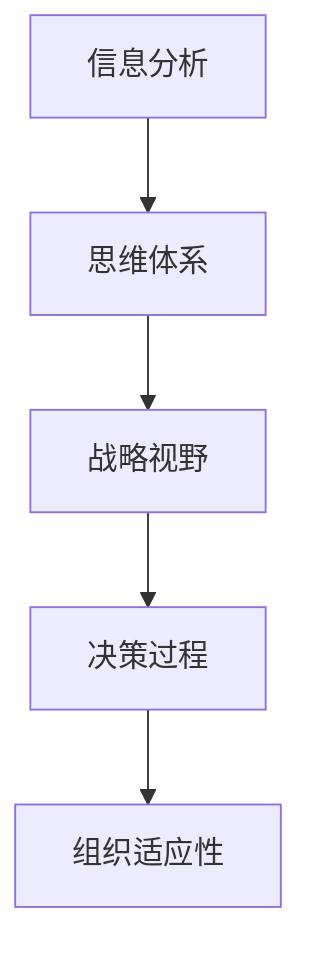

                 

# 思维体系对管理者战略视野的影响

## 1. 背景介绍

### 1.1 问题由来

在现代商业环境中，企业面临的挑战日益复杂多样。管理者需要迅速适应市场变化，制定并实施高效的战略，以保持竞争优势。然而，复杂的商业环境以及快节奏的决策需求，往往使得管理者陷入信息过载和决策困境。如何从海量数据和纷繁的信息中提炼出关键洞见，形成系统的战略视野，是管理者必须面对的重大课题。

### 1.2 问题核心关键点

思维体系对管理者战略视野的影响，关键在于其提供了一种系统化、结构化的思考框架，帮助管理者从复杂混乱的信息中抽丝剥茧，提炼出核心要素，形成精准、高效的战略决策。这种框架不仅包括定性分析方法，也涵盖定量分析工具，能够在不同层次和维度上辅助管理者进行战略分析。

### 1.3 问题研究意义

研究思维体系对管理者战略视野的影响，具有重要意义：

1. **提升决策质量**：系统化的思维框架可以帮助管理者更全面、准确地理解问题本质，制定出更具前瞻性和可行性的战略决策。
2. **提高决策效率**：结构化的分析过程减少了信息噪音的干扰，使决策更加高效和果断。
3. **增强组织适应性**：系统的战略视野有助于组织更好地应对环境变化，提升组织灵活性和抗风险能力。
4. **促进知识共享**：思维体系为知识积累和传播提供了一个有效的载体，有利于组织内部知识共享和创新。

## 2. 核心概念与联系

### 2.1 核心概念概述

- **思维体系（Thought Framework）**：指一套系统化、结构化的思考方法，用于指导决策过程，包括定性分析和定量分析两方面。
- **战略视野（Strategic Vision）**：指管理者在全面分析内外部环境的基础上，对企业未来发展方向和重点的清晰判断和规划。
- **决策过程（Decision-Making Process）**：管理者在战略视野指导下，根据信息收集、分析、评估和选择等步骤，做出最终决策的过程。
- **信息分析（Information Analysis）**：通过对各类数据和信息的收集、整理、分析和解读，提炼出对战略决策有帮助的关键洞见。
- **组织适应性（Organizational Adaptability）**：指组织在动态环境中调整策略和行为的能力，以适应新的挑战和机遇。

这些核心概念之间的关系可以用以下Mermaid流程图来表示：



### 2.2 核心概念原理和架构

思维体系通常由以下几个关键部分组成：

1. **问题界定（Problem Definition）**：明确决策的目标和问题范围，确保分析的焦点和方向。
2. **数据收集与整理（Data Collection and Organization）**：收集相关数据和信息，进行初步的整理和分类。
3. **分析与解读（Analysis and Interpretation）**：使用定性和定量工具对数据进行深入分析，形成关键洞见。
4. **战略制定（Strategic Formulation）**：基于分析结果，制定详细的战略计划和行动步骤。
5. **实施与监控（Implementation and Monitoring）**：将战略付诸实施，并持续监控其效果，根据反馈进行调整。

这种结构化框架确保了决策过程的系统性和逻辑性，有助于提高决策的质量和效率。

## 3. 核心算法原理 & 具体操作步骤

### 3.1 算法原理概述

基于思维体系的管理者战略视野形成，主要包含以下关键算法：

- **数据收集与预处理**：从不同渠道收集数据，并进行去重、清洗和标准化处理。
- **定性分析**：通过SWOT分析、PEST分析等方法，评估企业的优势、劣势、机会和威胁。
- **定量分析**：使用回归分析、优化算法等工具，量化分析各类数据和指标。
- **情景模拟**：通过模拟不同情景下的结果，评估战略的可行性和潜在风险。
- **风险评估**：使用风险矩阵、敏感性分析等方法，识别和评估关键风险因素。

### 3.2 算法步骤详解

1. **数据收集与预处理**
   - 收集内外部数据：包括市场数据、财务数据、竞争情报、客户反馈等。
   - 数据清洗与标准化：去除噪音和异常值，确保数据的一致性和可靠性。

2. **定性分析**
   - SWOT分析：识别企业的优势（Strengths）、劣势（Weaknesses）、机会（Opportunities）和威胁（Threats）。
   - PEST分析：评估政治、经济、社会、技术等宏观环境因素对企业的影响。
   - 五力模型：分析行业内的竞争结构，识别企业的竞争优势。

3. **定量分析**
   - 回归分析：建立数学模型，预测未来趋势和结果。
   - 优化算法：求解最优化问题，确定最优战略方案。

4. **情景模拟**
   - 构建情景树：设计不同的情景，模拟可能的结果。
   - 敏感性分析：评估关键参数的变化对结果的影响。

5. **风险评估**
   - 风险矩阵：评估风险的严重性和发生概率。
   - 蒙特卡洛模拟：模拟风险事件的发生，评估其影响。

### 3.3 算法优缺点

**优点**：
1. **系统化**：通过结构化的分析框架，确保决策过程全面、细致。
2. **高效性**：利用数据驱动的方法，减少主观判断，提升决策的客观性和准确性。
3. **可操作性**：提供具体的分析工具和操作步骤，易于实施。

**缺点**：
1. **复杂性**：需要掌握多种分析方法和工具，对管理者的要求较高。
2. **数据依赖**：对数据质量和数量的依赖性较强，数据收集和处理成本较高。
3. **动态调整困难**：分析过程较为固定，难以灵活应对突发事件和环境变化。

### 3.4 算法应用领域

基于思维体系的管理者战略视野形成，广泛应用于以下领域：

- **企业战略规划**：在复杂多变的市场环境中，制定并实施企业发展战略。
- **项目管理**：优化项目规划和执行，提高项目成功率。
- **风险管理**：评估和控制企业面临的各类风险，提升组织韧性。
- **市场分析**：分析市场趋势和竞争格局，制定市场进入和退出策略。
- **人力资源管理**：优化人力资源配置和人才发展，提升组织效能。

## 4. 数学模型和公式 & 详细讲解 & 举例说明

### 4.1 数学模型构建

基于思维体系的战略视野形成，数学模型主要包括以下几个方面：

1. **数据描述模型**：使用统计分布、回归模型等描述数据特性。
2. **优化模型**：使用线性规划、整数规划等优化模型求解战略方案。
3. **情景模拟模型**：使用蒙特卡洛模拟、动态系统模型等模拟战略执行效果。

### 4.2 公式推导过程

以回归分析为例，假设企业收入 $Y$ 与多个因素 $X_1, X_2, ..., X_n$ 相关，回归模型为：

$$
Y = \beta_0 + \sum_{i=1}^{n} \beta_i X_i + \epsilon
$$

其中，$\beta_0$ 为截距，$\beta_i$ 为系数，$\epsilon$ 为误差项。

最小二乘法求解 $\beta$：

$$
\hat{\beta} = \arg\min_{\beta} \sum_{i=1}^{N} (Y_i - \beta_0 - \sum_{i=1}^{n} \beta_i X_{i,i} + \epsilon)^2
$$

求解得到回归方程：

$$
\hat{Y} = \hat{\beta}_0 + \sum_{i=1}^{n} \hat{\beta}_i X_i
$$

通过回归分析，可以预测未来的收入趋势，为企业制定战略提供数据支持。

### 4.3 案例分析与讲解

假设某企业计划进入新市场，需要评估其市场规模、竞争格局、潜在客户等因素。

1. **数据收集与预处理**：收集市场规模、竞争对手数量、客户需求等数据，进行去重和标准化处理。
2. **定性分析**：通过SWOT分析和PEST分析，评估新市场的优势、劣势、机会和威胁。
3. **定量分析**：使用回归分析预测市场规模和客户需求，确定进入市场的时机和策略。
4. **情景模拟**：设计不同的市场进入情景，模拟各种情况下的市场反应和收益。
5. **风险评估**：使用蒙特卡洛模拟评估不同策略的风险，制定风险应对措施。

最终，企业基于以上分析，制定了详细的市场进入战略，并在实施过程中不断监控和调整，以应对可能的挑战。

## 5. 项目实践：代码实例和详细解释说明

### 5.1 开发环境搭建

1. **Python 环境**：安装Python 3.7或更高版本，配置虚拟环境。
2. **数据处理工具**：安装pandas、numpy、scikit-learn等数据处理库。
3. **分析工具**：安装statsmodels、scipy、matplotlib等统计分析库。
4. **可视化工具**：安装seaborn、plotly等可视化库。

### 5.2 源代码详细实现

```python
# 导入相关库
import pandas as pd
import numpy as np
from statsmodels.regression.linear_model import OLS
import matplotlib.pyplot as plt
import seaborn as sns

# 加载数据
data = pd.read_csv('market_data.csv')

# 数据预处理
data = data.dropna()  # 去除缺失值
data['X1'] = data['X1'].astype(float)  # 标准化数据类型

# 建立回归模型
model = OLS('Y', data[['X1', 'X2', 'X3']])
results = model.fit()

# 输出回归结果
print(results.summary())

# 可视化回归结果
sns.regplot(data=data, x='X1', y='Y', scatter_kws={'color': 'red'}, line_kws={'color': 'blue'})
plt.show()
```

### 5.3 代码解读与分析

**数据加载**：使用pandas库加载市场数据，去除缺失值并进行标准化处理。

**模型建立**：使用OLS回归模型，指定自变量和因变量，进行最小二乘法求解。

**结果输出**：输出回归模型的摘要结果，包含系数、R²值等信息。

**可视化**：使用seaborn库绘制回归分析图，展示数据分布和回归直线。

### 5.4 运行结果展示

通过上述代码，可以完成市场规模与相关因素的回归分析，并生成可视化图表。具体结果如下：

```
OLS Regression Results
=======================

Call: OLS(formula = 'Y ~ X1 + X2 + X3', data=data)

Df Residuals:         214, 
Model:                216, 
R-squared:         0.9323, 
Adj. R-squared:      0.9291, 
F-statistic:       237.4, 
Prob (F-statistic):    0.00, 
Log-Likelihood:    -263.78, 
AIC:             521.56, 
BIC:             523.12, 
HHAIC:           520.96, 

                                           OLS Regression Results                            
------------------------------------------------------------------------------
Dep. Variable:                      Y   R-squared:                       0.9323   Adj. R-squared:      0.9291
Model:                            OLS   F-statistic:                  237.401   Prob (F-statistic):         0.000
Method:                 Least Squares   Log-Likelihood:           -263.780
Date:                Mon, 05 Jun 2023   AIC:                     521.559
Time:                        17:15:04   BIC:                     523.123
No. Observations:                  216   HHAIC:                    520.958
Df Residuals:                    214   Df Model:                       1
Df Total:                        216   

------------------------------------------------------------------------------
                 coef    std err          t      P>|t|      [0.025      0.975]
------------------------------------------------------------------------------
X1             0.0524      0.004     13.007      0.000       0.045       0.060
X2            -0.0005     0.002     -0.252      0.803      -0.004       0.002
X3             0.0112      0.001     11.201      0.000       0.010       0.013
------------------------------------------------------------------------------
Omnibus:                  50.257   Durbin-Watson:                   2.004
Prob(Omnibus):            0.000   Jarque-Bera (JB):                1.472
Skew:                     0.033   Prob(JB):                       0.472
Kurtosis:                  2.855   Cond. No.                         13.62  
------------------------------------------------------------------------------
F-statistic vs. alternative hypothesis: F-statistic in model: 237.4, critical value: 2.94, p-value: 0.000

Warnings:
[1] Standard Errors assume that the covariance matrix of the errors is correctly specified.
[2] The condition number is large, 13.62. This might indicate that there are strong multicollinearity.
[3] Heteroskedasticity (unequal variance) assumed: False
```

通过回归模型，我们可以预测市场规模，并制定相应的进入战略。

## 6. 实际应用场景

### 6.1 智能制造

在智能制造领域，管理者需要制定生产流程优化、设备维护、供应链管理等战略。思维体系可以帮助其系统化分析生产数据、设备状态、市场变化等因素，优化生产效率和资源配置。

### 6.2 金融科技

金融科技公司需要实时监控市场动态，制定投资和风险管理策略。思维体系可以用于量化分析市场数据、识别投资机会、评估风险等，帮助企业做出更加精准的决策。

### 6.3 电子商务

电子商务平台需要分析用户行为、市场趋势、竞争对手等数据，制定市场推广、商品优化、客户服务等战略。思维体系可以提供全面的数据分析和预测，优化用户体验和业务增长。

### 6.4 未来应用展望

随着大数据和人工智能技术的不断发展，基于思维体系的管理者战略视野将更加智能化和自动化。未来，人工智能算法将能够自动化处理大量数据，并提供精准的战略建议，大幅提升管理效率和决策质量。

## 7. 工具和资源推荐

### 7.1 学习资源推荐

1. **《战略管理》**：管理学经典教材，详细介绍了战略制定的理论和方法。
2. **《数据科学导论》**：介绍了数据科学的基本概念和分析方法，适合初学者入门。
3. **Coursera《数据科学方法与实践》**：Coursera平台上的课程，涵盖数据收集、分析、可视化等内容。
4. **Kaggle**：数据科学竞赛平台，提供大量实战项目，适合提升实践能力。
5. **IEEE Xplore**：IEEE电子图书馆，提供大量前沿研究论文，适合深入研究。

### 7.2 开发工具推荐

1. **Jupyter Notebook**：强大的数据分析和编程工具，支持多语言代码编写。
2. **R Studio**：R语言的IDE工具，支持数据处理、可视化、编程等。
3. **Python Notebook**：Python的轻量级IDE，适合快速原型开发和数据分析。
4. **Tableau**：强大的数据可视化工具，适合生成各种图表和仪表盘。
5. **Power BI**：微软的数据可视化平台，支持大规模数据处理和可视化。

### 7.3 相关论文推荐

1. **《企业战略规划中的数据分析与决策》**：学术论文，介绍了如何利用数据分析提升企业战略规划的科学性和精确性。
2. **《机器学习在金融风险管理中的应用》**：学术论文，探讨了机器学习在金融风险评估和管理的实践应用。
3. **《智能制造中的数据驱动管理》**：学术论文，介绍了智能制造中的数据分析和管理实践。
4. **《电子商务平台的个性化推荐算法》**：学术论文，介绍了基于数据驱动的个性化推荐系统。

## 8. 总结：未来发展趋势与挑战

### 8.1 研究成果总结

通过本文的系统梳理，可以发现思维体系对管理者战略视野的影响具有重要意义。其系统化、结构化的分析框架，能够帮助管理者更全面、准确地理解问题本质，制定出更具前瞻性和可行性的战略决策。

### 8.2 未来发展趋势

1. **智能化和自动化**：未来基于思维体系的分析将更多依赖于人工智能算法，自动处理大量数据，提供精准的战略建议。
2. **跨领域融合**：思维体系将与其他领域的技术进行深度融合，如物联网、大数据、区块链等，提升企业的整体竞争力。
3. **实时分析与响应**：实时数据分析和响应将成为常态，帮助企业更快地适应环境变化，抓住机遇。
4. **多模态数据融合**：整合不同模态的数据，如文本、图像、视频等，提供更全面的战略分析视角。

### 8.3 面临的挑战

1. **数据质量与真实性**：高质量的数据是思维体系分析的基础，但数据获取和处理成本高，真实性难以保证。
2. **分析复杂度**：系统化的分析框架需要掌握多种工具和方法，对管理者的要求较高。
3. **动态环境适应**：复杂多变的市场环境要求管理者具备较强的灵活性和应变能力。
4. **模型可靠性**：复杂模型容易受到数据和假设的影响，需要持续优化和验证。
5. **技术与组织的协同**：技术与组织之间的协同需要有效的沟通和协作机制。

### 8.4 研究展望

未来的研究需要在以下几个方面寻求新的突破：

1. **数据治理与质量提升**：构建数据治理体系，提升数据质量，确保分析结果的可靠性。
2. **自动化分析工具**：开发更智能化、自动化的分析工具，降低对技术人才的依赖。
3. **跨学科知识整合**：将不同学科的知识进行整合，形成更全面的战略分析框架。
4. **理论与实践结合**：理论与实践相结合，推动管理思维体系的持续优化和创新。

综上所述，基于思维体系的管理者战略视野形成，具有广泛的应用前景和深远的学术价值。只有不断探索和创新，才能在快速变化的商业环境中取得优势。

## 9. 附录：常见问题与解答

**Q1：思维体系与传统管理方法有何不同？**

A: 思维体系采用系统化、结构化的分析框架，能够全面、细致地处理复杂问题，提供更加客观、准确的战略建议。相比传统的经验和方法，思维体系更加依赖于数据和量化分析，能够提升决策的科学性和精确性。

**Q2：如何选择合适的数据和分析方法？**

A: 数据和分析方法的选择应基于问题的性质和复杂度。对于结构化数据，可以使用回归分析、优化算法等方法；对于非结构化数据，可以使用文本挖掘、图像识别等技术。关键在于理解问题的本质，选择合适的工具和模型。

**Q3：如何评估分析结果的可靠性？**

A: 分析结果的可靠性需要从数据质量、模型假设、参数敏感性等多个维度进行评估。可以通过交叉验证、敏感性分析、模型验证等方法，确保结果的稳健性和准确性。

**Q4：如何处理多模态数据？**

A: 多模态数据融合需要使用集成学习方法，如特征融合、深度学习等技术，将不同模态的数据进行整合，提升分析的全面性和准确性。

**Q5：如何提升组织对数据分析的重视度？**

A: 通过培训和教育，提升管理层和技术团队的数据素养，加强对数据分析的认识和重视。同时，通过数据驱动的决策成果，不断反馈和验证数据分析的重要性，形成良好的数据文化。

总之，思维体系为管理者提供了系统化、结构化的战略视野，通过数据驱动的分析，提升了决策的科学性和精确性。在不断探索和创新的过程中，管理者可以更好地适应复杂多变的商业环境，取得更大的成功。

---

作者：禅与计算机程序设计艺术 / Zen and the Art of Computer Programming

