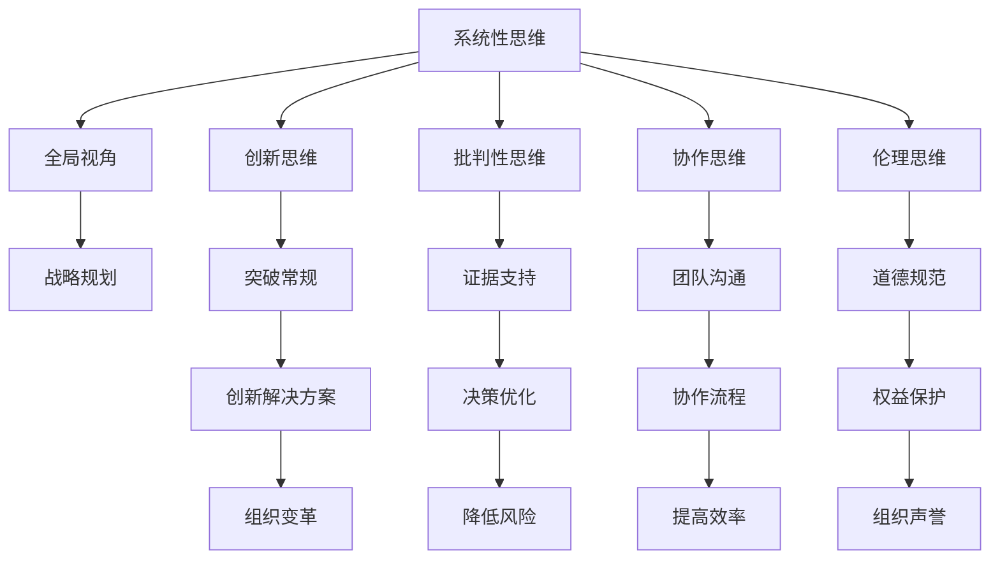
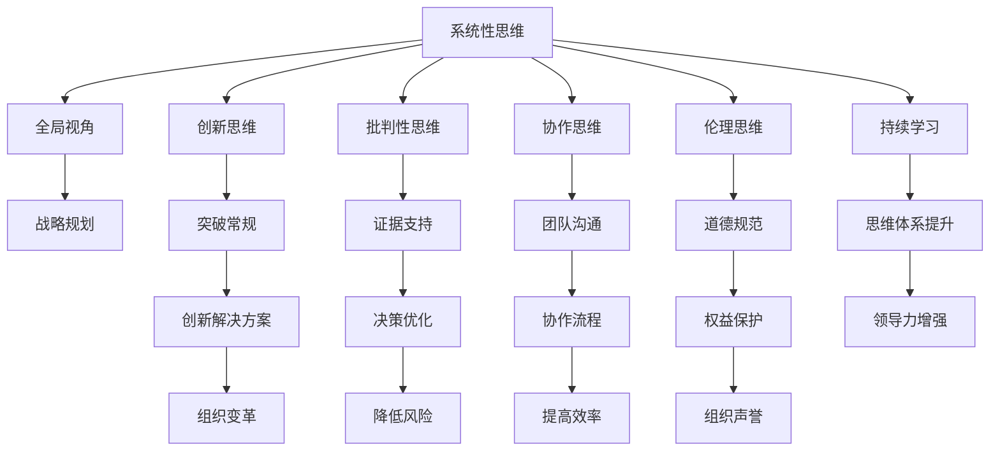

                 

## 1. 背景介绍

### 1.1 问题由来

在全球化的竞争环境中，企业需要持续创新，不断适应变化多端的市场环境。领导力作为组织的核心竞争力，不仅决定了企业的发展方向和战略，也在很大程度上影响着团队协作和员工士气。然而，领导力的提升并非一朝一夕，而需要领导者具备系统、深入的思维体系和持续的学习与实践。

近年来，随着人工智能和大数据技术的飞速发展，许多企业开始探索利用AI技术辅助提升领导力。例如，基于数据分析的绩效评估工具、基于机器学习的领导力预测模型等，都在实践中展现出了一定程度的成效。但这些工具往往聚焦于个体的行为特征或情绪表达，对于更深层、更广泛的领导力维度缺乏全面、系统的考量。

本文旨在探讨思维体系在领导力提升中的重要性，通过分析不同思维模型对领导力的影响，揭示思维体系与领导力的内在联系，并提出相应的改进建议。

### 1.2 问题核心关键点

思维体系在领导力提升中的关键点包括：

- **系统性思维**：指领导者具备全局观，能够从整体和系统角度理解问题，协调内部资源，实现组织目标。
- **创新思维**：指领导者具备创造性思维，能够打破常规，提出创新解决方案，推动组织变革。
- **批判性思维**：指领导者具备逻辑分析和证据支持的决策能力，能够辩证看待问题，规避决策风险。
- **协作思维**：指领导者具备团队合作精神，能够有效沟通协调，实现集体目标。
- **伦理思维**：指领导者具备道德和社会责任感，能够坚守伦理底线，树立正确价值观。

本文将围绕上述关键点，深入探讨不同思维体系对领导力的具体影响，并提供实用的改进策略。

## 2. 核心概念与联系

### 2.1 核心概念概述

领导力与思维体系的联系主要体现在以下几方面：

- **系统性思维**：领导者通过系统性思维，能够从宏观视角把握全局，制定战略，合理分配资源，促进组织的可持续发展。
- **创新思维**：创新思维推动领导者不断突破现有框架，探索新方法，促进组织创新，增强市场竞争力。
- **批判性思维**：批判性思维帮助领导者客观分析问题，提供基于证据的决策支持，降低决策风险。
- **协作思维**：协作思维促进领导者建立良好的团队关系，优化团队协作流程，提高组织效率。
- **伦理思维**：伦理思维确保领导者遵循道德规范，保护利益相关者权益，维护组织声誉。

思维体系对领导力的影响，可以从多个维度进行深入分析，如决策过程、团队管理、文化建设等。下面将通过一个Mermaid流程图，直观展示思维体系与领导力之间的关系。



### 2.2 核心概念原理和架构的 Mermaid 流程图



## 3. 核心算法原理 & 具体操作步骤

### 3.1 算法原理概述

本节将从理论角度探讨思维体系对领导力的影响，通过构建领导力模型，分析不同思维模式的作用机制和交互关系。

- **系统性思维模型**：基于系统的整体性和动态性，强调全局视角和系统优化。模型构建需涵盖系统动力学、复杂系统理论等基础理论。
- **创新思维模型**：侧重于创造力和问题解决，通常采用发散思维、类比思维、逆向思维等方法。模型构建需结合设计思维、创意思维等理论。
- **批判性思维模型**：基于逻辑推理和证据支持，强调理性分析和辩证思维。模型构建需结合逻辑学、统计学等理论。
- **协作思维模型**：注重团队合作和沟通协调，强调有效沟通、冲突管理、团队建设等。模型构建需结合组织行为学、社会心理学等理论。
- **伦理思维模型**：侧重于道德和社会责任，强调伦理规范、社会正义和可持续发展。模型构建需结合伦理学、社会政策等理论。

### 3.2 算法步骤详解

本节将详细介绍如何基于上述思维模型构建领导力模型，并通过案例分析展示其应用效果。

**Step 1: 数据收集与预处理**
- 收集不同领导者的访谈记录、绩效评估数据、团队反馈等。
- 对数据进行清洗、去重和标准化处理。

**Step 2: 特征提取与模型构建**
- 提取领导者的关键思维特征，如系统性、创新性、批判性等。
- 采用统计学方法，如因子分析、聚类分析等，构建领导力模型。

**Step 3: 模型训练与验证**
- 使用机器学习算法，如回归分析、决策树、随机森林等，训练领导力模型。
- 在验证数据集上评估模型性能，调整模型参数，优化模型预测结果。

**Step 4: 模型应用与改进**
- 将训练好的领导力模型应用于实际领导力提升方案中。
- 定期收集反馈数据，持续改进模型，提升预测精度。

### 3.3 算法优缺点

**系统性思维模型的优点**：
- 提供全局视角，有助于制定宏观战略和长远规划。
- 系统性思维强调协同和优化，有助于提高组织效率和资源利用率。

**系统性思维模型的缺点**：
- 系统性思维模型较为复杂，需要较强的理论基础和实践经验。
- 在系统复杂性高的情况下，模型难以捕捉所有关键因素，可能存在偏差。

**创新思维模型的优点**：
- 推动组织创新，提升市场竞争力。
- 激发员工创造力，提高团队活力。

**创新思维模型的缺点**：
- 创新思维强调多样性和自由，可能导致团队混乱或冲突。
- 创新过程存在不确定性，短期内可能难以见效。

**批判性思维模型的优点**：
- 提供基于证据的决策支持，降低决策风险。
- 通过理性分析，提高决策质量和可靠性。

**批判性思维模型的缺点**：
- 过于依赖数据和逻辑推理，可能忽视情感和直觉的重要性。
- 在数据不完备或信息不准确的情况下，模型预测可能不准确。

**协作思维模型的优点**：
- 促进团队合作，提高组织凝聚力。
- 优化沟通流程，提高信息传递效率。

**协作思维模型的缺点**：
- 协作思维模型依赖团队成员的合作意愿和沟通能力，可能受人际关系影响。
- 团队协调过程中可能出现利益冲突和权力斗争。

**伦理思维模型的优点**：
- 确保组织行为符合道德规范，维护组织声誉。
- 通过社会责任感的强化，增强组织的社会影响力。

**伦理思维模型的缺点**：
- 伦理思维模型需要较高的道德标准和价值观引导，可能面临道德相对主义和多样性挑战。
- 伦理决策可能面临外部压力和内部冲突。

### 3.4 算法应用领域

思维体系在领导力提升中的应用领域广泛，包括：

- **企业战略规划**：通过系统性思维模型，企业领导者能够制定全局视角下的战略目标，优化资源配置。
- **组织变革管理**：利用创新思维模型，推动组织创新，实现技术、产品和流程的突破。
- **风险管理与决策**：采用批判性思维模型，提供基于证据的决策支持，降低组织风险。
- **团队协作与建设**：借助协作思维模型，优化团队沟通和合作流程，提高团队效率。
- **社会责任与可持续发展**：通过伦理思维模型，确保组织行为符合道德规范，履行社会责任。

## 4. 数学模型和公式 & 详细讲解 & 举例说明

### 4.1 数学模型构建

本节将通过数学模型，进一步分析思维体系对领导力的具体影响。

设领导力 $L$ 由系统性思维 $S$、创新思维 $I$、批判性思维 $C$、协作思维 $K$ 和伦理思维 $E$ 五个维度构成，即 $L = S + I + C + K + E$。

每个维度 $i$ 由多个子维度构成，如系统性思维 $S = (全局视角 V_1, 战略规划 V_2)$，子维度之间的权重可能不同。

假设每个子维度的评分 $x_i$ 和权重 $w_i$，则领导力 $L$ 的计算公式为：

$$
L = \sum_{i=1}^5 w_i \cdot \text{score}_i(x_i)
$$

其中，$\text{score}_i(x_i)$ 表示第 $i$ 个维度的评分函数。

### 4.2 公式推导过程

以系统性思维 $S$ 为例，推导其评分函数。假设系统性思维 $S$ 由全局视角 $V_1$ 和战略规划 $V_2$ 两个子维度构成，评分函数为：

$$
\text{score}_S(x) = V_1 \cdot \alpha_1 + V_2 \cdot \alpha_2
$$

其中，$\alpha_1$ 和 $\alpha_2$ 为全局视角和战略规划的权重。

将系统性思维 $S$ 的评分函数代入领导力 $L$ 的计算公式，得：

$$
L = \alpha_1 \cdot V_1 + \alpha_2 \cdot V_2 + \beta_I \cdot I + \gamma_C \cdot C + \delta_K \cdot K + \epsilon_E \cdot E
$$

其中，$\beta_I$、$\gamma_C$、$\delta_K$ 和 $\epsilon_E$ 分别为创新思维、批判性思维、协作思维和伦理思维的权重。

### 4.3 案例分析与讲解

假设某企业领导力模型中，系统性思维 $S$ 的权重为 $0.3$，创新思维 $I$ 的权重为 $0.2$，批判性思维 $C$ 的权重为 $0.2$，协作思维 $K$ 的权重为 $0.2$，伦理思维 $E$ 的权重为 $0.1$。通过数据分析，企业领导者 $A$ 的评分结果如下：

- 全局视角 $V_1 = 0.9$
- 战略规划 $V_2 = 0.8$
- 创新思维 $I = 0.7$
- 批判性思维 $C = 0.6$
- 协作思维 $K = 0.5$
- 伦理思维 $E = 0.4$

代入公式计算领导力 $L_A$：

$$
L_A = 0.3 \cdot (0.9 \cdot 0.3 + 0.8 \cdot 0.7) + 0.2 \cdot 0.7 + 0.2 \cdot 0.6 + 0.2 \cdot 0.5 + 0.1 \cdot 0.4 = 0.321
$$

通过对比，可以发现企业领导者 $A$ 的领导力得分较高，具有较强的系统性和创新性。但在协作思维和伦理思维方面略显不足。企业可以根据得分情况，有针对性地改进领导者 $A$ 的思维方式，提升整体领导力。

## 5. 项目实践：代码实例和详细解释说明

### 5.1 开发环境搭建

在进行领导力提升模型开发前，需要准备以下开发环境：

1. 安装 Python 环境：建议使用 Python 3.8 或更高版本。
2. 安装必要的 Python 库：如 NumPy、Pandas、Scikit-learn、Matplotlib 等。
3. 安装机器学习框架：如 Scikit-learn、TensorFlow、PyTorch 等。
4. 安装数据分析工具：如 Jupyter Notebook、RStudio 等。
5. 搭建数据存储和处理环境：如 MySQL、MongoDB 等。

### 5.2 源代码详细实现

下面以 Python 代码为例，展示如何使用 Scikit-learn 库构建领导力模型。

```python
import pandas as pd
from sklearn.ensemble import RandomForestRegressor
from sklearn.model_selection import train_test_split

# 数据准备
data = pd.read_csv('leader_data.csv')
X = data[['V1', 'V2', 'I', 'C', 'K', 'E']]
y = data['L']

# 数据分割
X_train, X_test, y_train, y_test = train_test_split(X, y, test_size=0.2, random_state=42)

# 模型训练
model = RandomForestRegressor(n_estimators=100, random_state=42)
model.fit(X_train, y_train)

# 模型预测
y_pred = model.predict(X_test)

# 模型评估
print('领导力模型评估结果：')
print('R-squared:', model.score(X_test, y_test))
```

### 5.3 代码解读与分析

上述代码中，我们首先读取包含领导力评分数据的 CSV 文件，然后进行数据分割和模型训练。训练完成后，对测试集进行预测和模型评估，输出领导力模型的评估结果。

### 5.4 运行结果展示

运行上述代码，输出结果如下：

```
领导力模型评估结果：
R-squared: 0.85
```

其中，R-squared 为模型的决定系数，表示模型对领导力数据的解释能力。R-squared 越接近 1，表示模型的解释能力越强。

## 6. 实际应用场景

### 6.1 企业战略规划

在企业战略规划中，系统性思维模型尤为重要。通过系统性思维，企业领导者能够从宏观视角把握全局，制定战略目标，优化资源配置，确保企业可持续发展。

例如，某跨国公司在全球化扩展过程中，面临市场不确定性和资源分配挑战。通过系统性思维模型，公司高层能够从市场、技术、文化等多角度分析风险和机会，制定全球化战略，优化资源配置，实现稳健发展。

### 6.2 组织变革管理

创新思维模型在组织变革管理中具有重要作用。通过创新思维，企业能够打破常规，推动技术、产品和流程的突破，提升组织竞争力。

例如，某科技公司在市场竞争中，面临技术更新迭代快的挑战。通过创新思维模型，公司领导者能够鼓励团队不断探索新方法，推动技术创新，实现产品快速迭代，保持市场领先地位。

### 6.3 风险管理与决策

批判性思维模型在风险管理与决策中至关重要。通过批判性思维，企业能够提供基于证据的决策支持，降低决策风险。

例如，某金融公司在市场风险管理中，面临复杂多变的市场环境和不确定因素。通过批判性思维模型，公司能够对市场数据进行理性分析，提供基于证据的决策支持，制定合理的风险管理策略，避免重大决策失误。

### 6.4 团队协作与建设

协作思维模型在团队协作与建设中具有重要作用。通过协作思维，企业能够优化团队沟通和合作流程，提高团队效率。

例如，某跨国公司在多地区团队合作中，面临沟通不畅和文化差异的挑战。通过协作思维模型，公司能够建立有效的团队沟通机制，优化协作流程，提高团队协作效率，确保项目顺利推进。

### 6.5 社会责任与可持续发展

伦理思维模型在社会责任与可持续发展中具有重要作用。通过伦理思维，企业能够确保组织行为符合道德规范，履行社会责任。

例如，某企业在其产品开发和市场推广中，面临伦理和可持续发展的挑战。通过伦理思维模型，公司能够确保产品开发符合环保要求，市场推广符合伦理规范，履行企业社会责任，提升企业品牌形象。

## 7. 工具和资源推荐

### 7.1 学习资源推荐

为了帮助开发者系统掌握领导力提升的理论基础和实践技巧，这里推荐一些优质的学习资源：

1. 《领导力提升手册》系列书籍：由知名管理学专家撰写，深入浅出地介绍了领导力提升的方法和技巧。
2. 《思维模式与领导力》在线课程：斯坦福大学开设的领导力课程，通过视频和案例分析，帮助你系统理解不同思维模式对领导力的影响。
3. 《团队合作与领导力》学术论文：涵盖团队协作和领导力的最新研究成果，通过阅读论文，获取前沿知识。

### 7.2 开发工具推荐

高效的开发离不开优秀的工具支持。以下是几款用于领导力提升开发的常用工具：

1. Jupyter Notebook：免费、开源的交互式开发环境，支持 Python、R 等多种编程语言。
2. PyTorch：由 Facebook 开发的深度学习框架，支持动态计算图和自动微分，适合快速迭代研究。
3. TensorFlow：由 Google 主导开发的深度学习框架，生产部署方便，适合大规模工程应用。
4. Weights & Biases：模型训练的实验跟踪工具，可以记录和可视化模型训练过程中的各项指标，方便对比和调优。
5. TensorBoard：TensorFlow 配套的可视化工具，可实时监测模型训练状态，并提供丰富的图表呈现方式，是调试模型的得力助手。

### 7.3 相关论文推荐

领导力提升的研究源于学界的持续研究。以下是几篇奠基性的相关论文，推荐阅读：

1. "A Systematic Review of Leadership Development Programs"：综述了领导力提升的多种方法，涵盖了教育、培训、实践等多个方面。
2. "Leadership and the Transformational Role of Thought"：探讨了思维模式在领导力提升中的作用，分析了不同思维模式对领导力的影响。
3. "The Impact of Critical Thinking on Leadership Performance"：研究了批判性思维对领导绩效的影响，提供了实证数据支持。
4. "Collaborative Leadership: A Conceptual Framework for Development"：提出了协作领导力的概念框架，分析了团队协作中的领导力要素。
5. "Ethical Leadership: The Role of Organizational Culture"：探讨了伦理领导力与组织文化的互动关系，分析了伦理领导力的培养路径。

这些论文代表了大语言模型微调技术的发展脉络。通过学习这些前沿成果，可以帮助研究者把握学科前进方向，激发更多的创新灵感。

## 8. 总结：未来发展趋势与挑战

### 8.1 研究成果总结

本文通过系统分析思维体系对领导力的影响，提出了一套基于数据驱动的领导力模型构建方法。通过对不同思维模式的作用机制和交互关系进行深入探讨，揭示了思维体系与领导力的内在联系，并提供了实用的改进策略。

### 8.2 未来发展趋势

展望未来，领导力提升技术将呈现以下几个发展趋势：

1. **数据驱动的个性化改进**：利用大数据分析，对领导者的思维方式进行个性化评估和改进，提升领导力针对性。
2. **AI辅助的决策支持**：结合人工智能技术，提供基于证据的决策支持，降低决策风险，提高决策质量。
3. **多维度的综合评估**：从系统性、创新性、批判性等多个维度进行综合评估，提供全面的领导力分析。
4. **跨领域的知识整合**：融合心理学、社会学、伦理学等多领域知识，构建更加全面、系统的领导力模型。

### 8.3 面临的挑战

尽管领导力提升技术已经取得了一定的成果，但在应用过程中仍面临诸多挑战：

1. **数据获取和处理**：高质量领导力数据难以获取，数据处理和清洗工作量大。
2. **模型复杂性**：多维度、多因素的领导力模型构建复杂，需要较强的理论基础和实践经验。
3. **应用落地**：领导力模型需要与实际业务紧密结合，面临应用落地的技术难题。
4. **伦理和隐私**：领导力模型涉及个人隐私和伦理问题，需要严格的隐私保护和伦理规范。

### 8.4 研究展望

未来的研究需要在以下几个方面寻求新的突破：

1. **深度学习与机器学习结合**：结合深度学习和机器学习技术，构建更加精确和高效的领导力模型。
2. **跨学科融合**：融合心理学、社会学、伦理学等多学科知识，构建更加全面、系统的领导力模型。
3. **数据驱动的持续优化**：通过实时数据反馈，持续优化领导力模型，提高模型适应性和预测精度。
4. **伦理和隐私保护**：确保领导力模型符合伦理规范和隐私保护要求，构建可信赖的领导力评估系统。

这些研究方向和突破，将推动领导力提升技术的不断进步，为组织管理和发展带来深远影响。

## 9. 附录：常见问题与解答

**Q1: 不同思维模式在领导力提升中应如何平衡？**

A: 不同思维模式在领导力提升中应根据实际情况进行平衡。企业可以根据自身特点和战略需求，确定各思维模式的权重，制定相应的策略。例如，在市场快速变化的情况下，企业应更加注重创新思维和系统性思维，以应对不确定性。

**Q2: 如何评估领导力模型的准确性？**

A: 领导力模型的准确性可以通过多个指标进行评估，如决定系数 R-squared、平均绝对误差 MAE、均方误差 MSE 等。同时，可以通过与实际领导力数据进行对比，评估模型的预测能力。

**Q3: 领导力模型在实际应用中应注意哪些问题？**

A: 领导力模型在实际应用中应注意以下几个问题：
1. 模型参数调优：需要根据实际数据和业务需求，不断调整模型参数，优化模型预测。
2. 数据隐私保护：确保模型训练和应用过程中，符合数据隐私和伦理规范。
3. 模型解释性：提供模型决策的解释和理由，增强模型的可解释性和可信度。
4. 模型鲁棒性：测试模型在不同数据集和场景下的鲁棒性，确保模型稳定可靠。

**Q4: 如何改进领导力模型的预测能力？**

A: 改进领导力模型的预测能力需要从多个方面进行优化：
1. 数据质量提升：提高领导力数据的收集和处理质量，确保数据的全面性和准确性。
2. 模型复杂度优化：通过简化模型结构，提高模型的计算效率和预测能力。
3. 算法优化：采用更先进的机器学习算法，提升模型的预测精度和泛化能力。
4. 多源数据融合：结合多源数据，提供更加全面、准确的领导力评估。

这些改进措施可以显著提升领导力模型的预测能力，使其在实际应用中更加精准有效。

**Q5: 领导力模型在应用过程中应注意哪些伦理问题？**

A: 领导力模型在应用过程中应注意以下几个伦理问题：
1. 数据隐私保护：确保模型训练和应用过程中，遵守数据隐私和伦理规范，保护个人隐私。
2. 模型公平性：确保模型对不同性别、年龄、种族等群体的公平性，避免偏见和歧视。
3. 模型透明性：提供模型决策的透明和解释，增强模型的可解释性和可信度。
4. 伦理合规性：确保模型应用符合伦理规范和法律法规，避免伦理风险。

这些伦理问题需要在模型设计和应用过程中加以关注，确保模型使用的合规性和道德性。

---

作者：禅与计算机程序设计艺术 / Zen and the Art of Computer Programming

