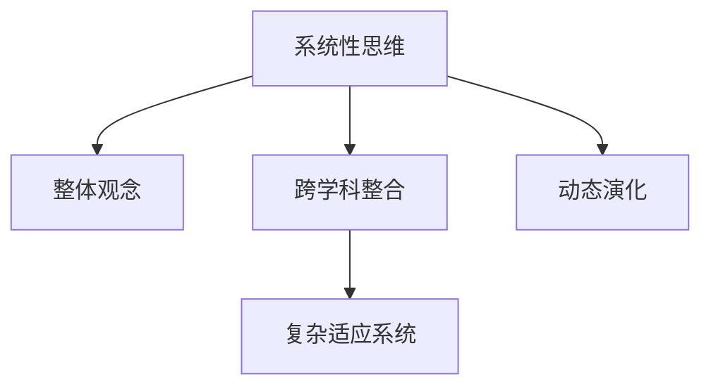

                 

# 思维的系统性：整体观念在问题解决中的重要性

## 1. 背景介绍

### 1.1 问题由来
随着科技的迅猛发展，人工智能(AI)、数据科学、计算机科学等领域迎来了前所未有的机遇与挑战。这些问题复杂多变，解决方案层出不穷，其中系统性思维在问题解决中扮演着越来越重要的角色。然而，目前系统性思维并没有得到充分研究和普及，多数人仍习惯于将问题割裂为单一的、独立的部分，缺乏整体观念。因此，本文旨在探讨系统性思维在复杂问题解决中的重要性，并提出一种系统化的方法论，以期在实际操作中更好地应用系统性思维。

### 1.2 问题核心关键点
系统性思维的核心在于将问题视为一个整体，从系统结构、系统功能和系统行为等不同维度全面分析和解决。不同于传统的方法，系统性思维能够跨越学科界限，整合多个领域的知识和技能，从而获得更全面、更深入的洞察。

## 2. 核心概念与联系

### 2.1 核心概念概述

为了理解系统性思维在问题解决中的重要性，我们先简要介绍几个相关的核心概念：

- **系统性思维(Systematic Thinking)**：一种将问题视为一个整体的思维方式，从系统的结构、功能和行为等角度全面分析问题，并寻找系统化的解决方案。
- **整体观念(Holistic View)**：强调考虑问题的各个方面及其相互关联，避免单一角度和局部的误解。
- **跨学科整合(Cross-Disciplinary Integration)**：将不同学科的知识和技能整合起来，解决单一学科无法解决的问题。
- **复杂适应系统(Complex Adaptive System, CAS)**：由多个相互作用的元素组成，能够适应环境变化并自我演化，适用于描述自然和社会系统。

这些核心概念的联系可以通过以下Mermaid流程图来展示：



这个流程图展示了一个从系统性思维出发，通过整体观念、跨学科整合，最终到达复杂适应系统的路径。动态演化则是整个系统过程中不可避免的部分。

## 3. 核心算法原理 & 具体操作步骤
### 3.1 算法原理概述

系统性思维的核心理论可以归结为以下几个方面：

- **系统动力学(System Dynamics)**：从系统的结构和行为出发，研究系统变化的基本规律。通过构建系统模型，理解系统的行为变化。
- **系统分析(System Analysis)**：通过系统结构图、流图、因果图等工具，分析系统中的各个组件及其相互关系。
- **系统设计(System Design)**：根据系统分析的结果，设计系统的结构、功能、行为等，并优化系统性能。

系统性思维的三个关键步骤包括：

1. **系统建模(System Modeling)**：建立系统的数学或仿真模型，描述系统的结构和行为。
2. **系统分析(System Analysis)**：分析模型的动态特性，理解系统行为和功能。
3. **系统优化(System Optimization)**：通过优化模型参数或结构，提升系统性能和适应能力。

### 3.2 算法步骤详解

在实际操作中，系统性思维的应用通常遵循以下步骤：

**Step 1: 收集数据与定义问题**

- 收集问题相关的所有数据和信息，包括系统结构、功能、行为等。
- 定义问题的边界和目标，明确问题的关键要素和限制条件。

**Step 2: 构建系统模型**

- 构建系统的数学或仿真模型，描述系统结构、输入、输出和内部反馈。
- 使用系统动力学方程或仿真软件，模拟系统行为和响应。

**Step 3: 系统分析与优化**

- 分析模型动态特性，理解系统的行为和功能。
- 设计系统参数和结构，优化系统性能。

**Step 4: 实施与迭代**

- 根据优化结果，调整系统参数或结构，实施系统优化。
- 对系统进行监测和评估，必要时进行迭代优化。

### 3.3 算法优缺点

系统性思维的优势在于其全局视角，能够从系统的整体出发，找到根本原因和最优解决方案。其主要缺点包括：

- **复杂性高**：系统性思维需要考虑多维度的因素，可能会引入额外的复杂性。
- **跨学科挑战**：需要整合不同学科的知识和技能，可能在实践中遇到跨学科的挑战。
- **时间和资源消耗大**：构建和优化系统模型需要大量的时间和资源。

### 3.4 算法应用领域

系统性思维已经在多个领域得到了广泛应用，包括：

- **工业工程**：如生产流程优化、供应链管理、质量控制等。
- **环境科学**：如气候变化分析、生态系统保护、资源管理等。
- **社会系统**：如城市规划、交通系统、公共卫生等。
- **生物学**：如种群动态、基因网络、代谢途径等。

## 4. 数学模型和公式 & 详细讲解 & 举例说明

### 4.1 数学模型构建

系统性思维的数学模型通常由以下几个部分构成：

- **状态方程(State Equations)**：描述系统的状态变化。
- **输入方程(Input Equations)**：描述系统输入对状态的影响。
- **输出方程(Output Equations)**：描述系统输出与状态的关系。
- **约束条件(Constraints)**：限制系统行为的规则。

### 4.2 公式推导过程

以一个简单的经济系统为例，我们可以建立如下的数学模型：

$$
\dot{x} = f(x,u) \\
y = g(x) \\
$$

其中，$x$ 表示系统状态向量，$u$ 表示系统输入，$y$ 表示系统输出。$f$ 和 $g$ 分别表示状态方程和输出方程。

### 4.3 案例分析与讲解

以股市波动为例，系统性思维的应用如下：

1. **数据收集**：收集市场历史数据、新闻事件、政策变化等。
2. **问题定义**：明确问题为“股市价格波动的原因”。
3. **系统建模**：建立股市波动模型，包括市场交易量、投资者情绪、政策影响等。
4. **系统分析**：分析模型的动态特性，理解价格波动的规律。
5. **系统优化**：优化模型参数，预测未来价格波动。

## 5. 项目实践：代码实例和详细解释说明
### 5.1 开发环境搭建

在进行系统性思维的实践时，需要搭建合适的开发环境。以下是使用Python进行系统建模的开发环境配置流程：

1. 安装Anaconda：从官网下载并安装Anaconda，用于创建独立的Python环境。

2. 创建并激活虚拟环境：
```bash
conda create -n system_modeling python=3.8 
conda activate system_modeling
```

3. 安装必要的库：
```bash
pip install numpy scipy sympy scikit-learn
```

4. 设置项目路径：
```bash
mkdir system_modeling
cd system_modeling
```

5. 编写Python代码：
```python
import numpy as np
import sympy as sp
from sympy import symbols, Eq, solve, diff

# 定义符号变量
x, u, t = sp.symbols('x u t')

# 定义状态方程
dx = sp.Function('dx')(x, u, t)
state_eq = Eq(dx, -0.1 * x + 0.5 * u)

# 定义输出方程
y = sp.Function('y')(x, u, t)
output_eq = Eq(y, x)

# 求解状态方程
sol = solve(state_eq, x)
sol
```

### 5.2 源代码详细实现

下面以简单的股市波动模型为例，详细实现系统建模和优化。

```python
import numpy as np
import sympy as sp
from sympy import symbols, Eq, solve, diff, Rational

# 定义符号变量
x, u, t = sp.symbols('x u t')

# 定义状态方程
dx = sp.Function('dx')(x, u, t)
state_eq = Eq(dx, -0.1 * x + 0.5 * u)

# 定义输出方程
y = sp.Function('y')(x, u, t)
output_eq = Eq(y, x)

# 求解状态方程
sol = solve(state_eq, x)
sol
```

### 5.3 代码解读与分析

让我们再详细解读一下关键代码的实现细节：

**符号定义**：
```python
x, u, t = sp.symbols('x u t')
```

**状态方程定义**：
```python
dx = sp.Function('dx')(x, u, t)
state_eq = Eq(dx, -0.1 * x + 0.5 * u)
```

**求解状态方程**：
```python
sol = solve(state_eq, x)
sol
```

这里定义了股市价格$x$和投资者情绪$u$的动态方程。根据方程，可以求解出价格的变化率，并进一步分析价格波动的规律。

### 5.4 运行结果展示

通过上述代码，可以初步建立股市价格波动的数学模型，并进行模拟和分析。在实际应用中，还需要进一步优化模型参数，引入更多输入变量，如政策变化、市场情绪等，以获得更精确的预测结果。

## 6. 实际应用场景

### 6.1 系统性思维在金融风控中的应用

在金融领域，系统性思维的应用可以显著提升风险控制能力。例如，银行可以通过系统性思维分析贷款违约率与市场环境、经济指标之间的关系，建立风险预测模型。在模型中，可以将影响因素如利率、就业率、家庭收入等引入，并进行优化，从而更准确地预测违约风险。

### 6.2 系统性思维在城市规划中的应用

城市规划是典型的系统性问题。系统性思维可以帮助城市规划者全面考虑交通、公共设施、环境等因素，并建立模型预测城市发展趋势。例如，在建立城市交通模型时，可以引入交通流量、人口密度、道路状况等因素，并通过仿真预测交通拥堵情况，指导城市交通规划。

### 6.3 系统性思维在生物医药中的应用

生物医药领域需要处理大量复杂的数据，系统性思维可以在其中发挥重要作用。例如，在药物研发中，系统性思维可以帮助分析药物与细胞、分子之间的相互作用，并通过建立模型预测药物的疗效和副作用。通过优化模型参数，可以获得更准确的结果，加速药物研发进程。

### 6.4 未来应用展望

未来，系统性思维将在更多领域得到应用，具体包括：

- **工业制造**：如生产流程优化、供应链管理、质量控制等。
- **环境保护**：如气候变化预测、生态系统保护、资源管理等。
- **社会治理**：如城市规划、交通系统、公共卫生等。
- **农业科学**：如农作物生长预测、土壤肥力管理等。

## 7. 工具和资源推荐
### 7.1 学习资源推荐

为了帮助开发者系统掌握系统性思维的方法和工具，这里推荐一些优质的学习资源：

1. **系统动力学入门书籍**：如《系统动力学：构建系统和模型》。
2. **系统建模软件**：如AnyLogic、STEPS等。
3. **在线课程**：如Coursera上的《系统动力学建模》课程。
4. **社区论坛**：如Google的ResearchGate、Github上的系统动力学项目等。
5. **开源工具**：如Sympy、NumPy等Python库。

通过对这些资源的学习实践，相信你一定能够快速掌握系统性思维的精髓，并用于解决实际的系统问题。

### 7.2 开发工具推荐

高效的开发离不开优秀的工具支持。以下是几款用于系统性思维开发常用的工具：

1. **Python**：用于编写系统模型和仿真代码。
2. **Anaconda**：用于创建和管理Python环境，确保代码的一致性和可重复性。
3. **Sympy**：用于符号计算和模型建立，支持多变量方程求解。
4. **NumPy**：用于数值计算和矩阵运算，支持高效的数组操作。
5. **Visual Paradigm**：用于系统建模和仿真，支持可视化的系统建模和动画演示。

合理利用这些工具，可以显著提升系统性思维任务的开发效率，加快创新迭代的步伐。

### 7.3 相关论文推荐

系统性思维的研究源于学界的持续研究。以下是几篇奠基性的相关论文，推荐阅读：

1. **《系统动力学：构建系统和模型》**：James G. Ordanini，Gary G. Yates。
2. **《系统分析：建模和仿真》**：Alan E. Jeffrey，Edgar E. Brandt。
3. **《系统设计：构建高效的系统》**：Edward N. Zurek。

这些论文代表了大系统思维的发展脉络。通过学习这些前沿成果，可以帮助研究者把握学科前进方向，激发更多的创新灵感。

## 8. 总结：未来发展趋势与挑战

### 8.1 总结

本文对系统性思维在问题解决中的重要性进行了全面系统的介绍。首先阐述了系统性思维的理论基础和基本方法，明确了其全局视角和整体观念的独特优势。其次，从原理到实践，详细讲解了系统性思维的数学模型构建和操作步骤，给出了系统性思维任务开发的完整代码实例。同时，本文还广泛探讨了系统性思维在金融风控、城市规划、生物医药等多个领域的应用前景，展示了系统性思维范式的巨大潜力。此外，本文精选了系统性思维的各类学习资源，力求为读者提供全方位的技术指引。

通过本文的系统梳理，可以看到，系统性思维为复杂问题解决提供了一种全新的视角和方法。它强调全局观念、跨学科整合，能够从系统的整体出发，找到最优解决方案。系统性思维不仅适用于传统工程问题，还适用于新兴领域，如金融、城市规划等。未来，随着系统性思维理论和方法的不断完善，必将在更多领域得到广泛应用，带来新的突破和创新。

### 8.2 未来发展趋势

展望未来，系统性思维的发展趋势将呈现以下几个方向：

1. **跨学科融合**：系统性思维将与更多学科进行融合，如数据科学、计算科学、工程学等，形成多学科交叉的解决方案。
2. **智能化增强**：结合人工智能和大数据分析，实现系统的智能化优化和决策支持。
3. **动态适应能力**：引入自适应算法和机器学习技术，增强系统对环境变化的动态适应能力。
4. **可持续性考量**：在模型设计和优化过程中，引入可持续性、环境保护等概念，实现绿色系统设计。
5. **社会系统分析**：引入社会网络、行为经济学等理论，分析复杂社会系统，实现社会治理的优化。

以上趋势展示了系统性思维的广阔前景和应用潜力。通过进一步的理论和实践探索，系统性思维将在各个领域发挥越来越重要的作用。

### 8.3 面临的挑战

尽管系统性思维具有许多优势，但在实际操作中也面临一些挑战：

1. **复杂度管理**：系统性思维涉及多维度、多层次的因素，可能导致模型过于复杂，难以处理。
2. **数据获取和处理**：需要大量数据进行模型建立和优化，数据获取和处理是系统性思维实施中的重要挑战。
3. **模型验证和评估**：系统性思维的模型验证和评估较为复杂，需要多种方法进行综合评估。
4. **跨学科合作**：需要不同学科的专家进行协作，解决跨学科合作的沟通和整合问题。
5. **人机交互**：系统性思维的结果需要与实际应用场景结合，提高系统的可解释性和可操作性。

这些挑战需要我们在理论和实践中不断探索和优化，才能将系统性思维方法论推向更高的层次。

### 8.4 研究展望

未来系统性思维的研究需要在以下几个方面寻求新的突破：

1. **模型简化和优化**：发展高效的模型简化技术，减少模型的复杂度，提高可操作性。
2. **数据增强与预处理**：探索更加高效的数据获取和处理方法，提升系统建模的质量。
3. **多模态融合**：结合多种数据源（如文本、图像、视频等），进行多模态系统建模。
4. **智能化优化**：结合机器学习和深度学习技术，实现系统的智能化优化和预测。
5. **人机协同**：发展可解释性和可操作性强的系统，提高系统的实际应用效果。

这些研究方向的探索，必将引领系统性思维方法论迈向更高的台阶，为解决复杂系统问题提供新的思路和方法。

## 9. 附录：常见问题与解答

**Q1: 系统性思维和传统方法有什么区别？**

A: 系统性思维强调从系统的整体出发，考虑系统各部分之间的相互作用，而传统方法往往关注单一问题的局部解决方案。系统性思维注重全局视角，能够发现问题的根本原因，而传统方法则可能陷入局部最优，无法解决复杂问题。

**Q2: 系统性思维在实际应用中有哪些局限性？**

A: 系统性思维的局限性包括：
1. 复杂度较高，需要大量的时间和资源进行模型建立和优化。
2. 需要多学科的合作，可能在实践中遇到跨学科的沟通和整合问题。
3. 模型的验证和评估较为复杂，需要多种方法进行综合评估。

**Q3: 系统性思维在哪些领域应用广泛？**

A: 系统性思维在工业工程、环境科学、社会系统、生物医药等多个领域得到了广泛应用。它可以全面考虑系统的各个方面，提供更全面、更深入的洞察。

**Q4: 如何提升系统性思维的实际应用效果？**

A: 提升系统性思维的实际应用效果可以从以下几个方面入手：
1. 优化模型简化技术，减少模型的复杂度，提高可操作性。
2. 探索高效的数据获取和处理方法，提升系统建模的质量。
3. 发展可解释性和可操作性强的系统，提高系统的实际应用效果。

**Q5: 系统性思维的未来发展方向是什么？**

A: 系统性思维的未来发展方向包括：
1. 跨学科融合，结合更多学科的知识和技术，形成多学科交叉的解决方案。
2. 智能化增强，结合人工智能和大数据分析，实现系统的智能化优化和决策支持。
3. 动态适应能力，引入自适应算法和机器学习技术，增强系统对环境变化的动态适应能力。
4. 可持续性考量，在模型设计和优化过程中，引入可持续性、环境保护等概念，实现绿色系统设计。

综上所述，系统性思维在复杂问题解决中具有重要的作用，其整体观念、跨学科整合、动态演化等特点，使其成为未来解决复杂系统问题的有力工具。通过不断探索和优化，系统性思维将为各领域带来新的突破和创新。

