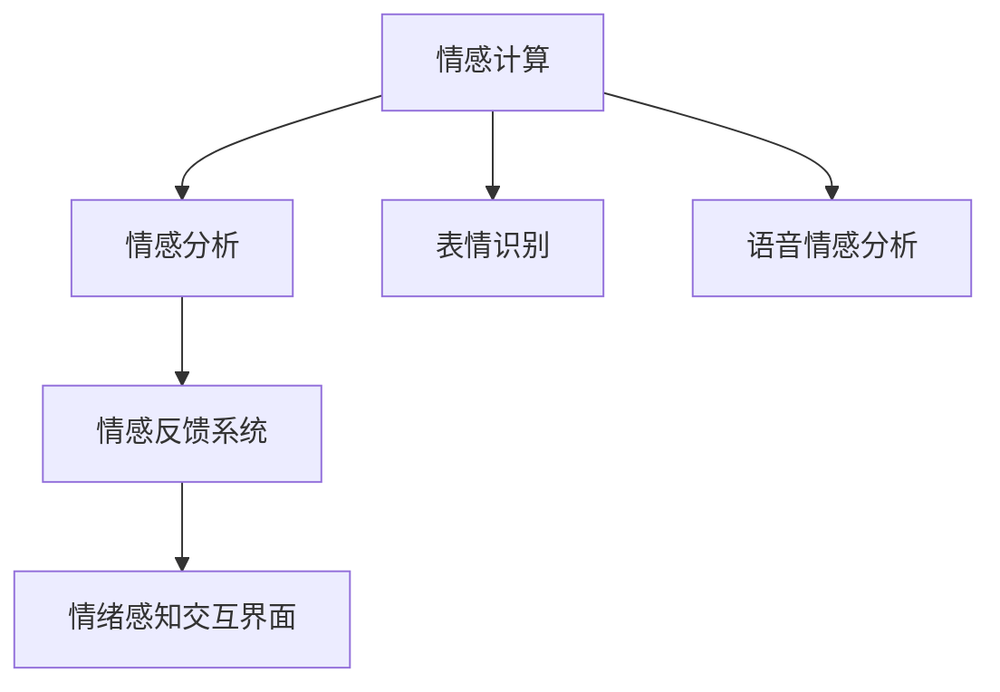

                 

# 情感计算创业：人机情感的桥梁

## 1. 背景介绍

### 1.1 问题由来
随着人工智能技术的迅猛发展，情感计算（Affective Computing）成为了一个令人瞩目的研究领域。情感计算是一种跨学科的研究，旨在理解和生成人类情感，构建能够理解并响应情感的智能系统。它不仅能够改善人机交互体验，还能在医疗、教育、营销等众多领域发挥重要作用。然而，情感计算的创业领域仍处于起步阶段，尚未有成熟的商业模式和产品生态体系。

### 1.2 问题核心关键点
情感计算的核心问题包括：如何有效地捕获和分析人类的情感，如何在不同场景下应用情感计算，以及如何设计出能够响应人类情感需求的智能系统。为此，需要构建一个通用的情感计算框架，集成多种情感分析技术和交互方式，以实现人机情感的桥梁。

## 2. 核心概念与联系

### 2.1 核心概念概述

为了更好地理解情感计算的创业方向，本节将介绍几个关键概念：

- **情感计算（Affective Computing）**：旨在研究和应用情感信息的技术，通过理解人类情感来改进人机交互。
- **情感分析（Sentiment Analysis）**：从文本、语音等数据中提取和分析情感信息，是情感计算的重要组成部分。
- **表情识别（Facial Expression Recognition）**：通过分析面部表情来识别和理解情感。
- **语音情感分析（Speech Affective Analysis）**：通过分析语音中的音调和节奏等信息，识别和理解情感。
- **情感反馈系统（Affective Feedback System）**：能够实时响应和调整系统行为，以适应用户情感的智能系统。
- **情绪感知交互界面（Emotion-Aware User Interface）**：根据用户情绪状态，动态调整交互界面和内容，提升用户体验。

这些概念之间的逻辑关系可以通过以下Mermaid流程图来展示：



这个流程图展示情感计算的核心概念及其之间的关系：

1. 情感计算通过集成多种情感分析技术，理解人类情感。
2. 表情识别和语音情感分析是情感分析的重要子领域，分别从视觉和听觉角度捕获情感信息。
3. 情感反馈系统能够根据情感分析结果，动态调整系统行为，实现人机情感的桥梁。
4. 情绪感知交互界面通过感知用户情绪，动态调整用户界面，提升用户体验。

## 3. 核心算法原理 & 具体操作步骤
### 3.1 算法原理概述

情感计算的核心算法原理包括以下几个关键步骤：

1. **数据采集**：通过摄像头、麦克风等设备，采集用户的面部表情、语音等信息。
2. **情感分析**：利用深度学习模型，对采集到的数据进行情感分析，识别用户的情绪状态。
3. **情感反馈**：根据情感分析结果，动态调整系统行为，如调整语音语调、交互内容等。
4. **交互优化**：根据用户的情绪状态，优化交互界面，提供更合适的反馈。

情感计算的算法原理可以简要概括为：

$$
\text{Emotion} = \text{Data Acquisition} \rightarrow \text{Emotion Analysis} \rightarrow \text{Emotion Feedback} \rightarrow \text{Interaction Optimization}
$$

### 3.2 算法步骤详解

**Step 1: 数据采集**
- 通过摄像头采集用户的面部表情视频。
- 通过麦克风采集用户的语音信息。
- 将采集到的数据进行预处理，如去噪、帧同步等。

**Step 2: 情感分析**
- 使用深度学习模型，如卷积神经网络（CNN）、递归神经网络（RNN）、长短时记忆网络（LSTM）等，对表情和语音数据进行情感分类。
- 利用情感词典和情感分类器，对文本数据进行情感分析。
- 综合不同数据来源的情感信息，进行情感融合，得到用户的整体情感状态。

**Step 3: 情感反馈**
- 根据情感分析结果，调整系统的响应策略。例如，在检测到用户情绪低落时，提供安慰和支持。
- 根据情感状态，调整系统界面和交互方式，如调整字体、颜色、音调等，提升用户体验。

**Step 4: 交互优化**
- 动态生成个性化的交互内容，根据用户情感状态调整对话风格和语气。
- 实时监测用户情绪变化，及时调整系统行为，保持互动的流畅性。

### 3.3 算法优缺点

情感计算的优点包括：

- **提升用户体验**：通过感知用户情感，实时调整系统行为，提升用户满意度和粘性。
- **提高决策效率**：在商业决策中，情感信息可以帮助更好地理解用户需求和情感状态，提升决策准确性。
- **增强安全性**：通过监测用户情绪，及时发现和处理负面情绪，避免潜在的风险和危机。

然而，情感计算也存在一些局限性：

- **数据隐私问题**：情感数据的采集和使用涉及用户隐私，如何保护用户隐私是一个重要问题。
- **情感计算的准确性**：情感分析的准确性和鲁棒性仍需进一步提升，避免误判和漏判。
- **系统复杂性**：情感计算系统通常需要集成多种传感器和算法，系统设计和实现较为复杂。

### 3.4 算法应用领域

情感计算技术已经在多个领域得到了应用，包括但不限于：

- **医疗领域**：情感计算可以用于心理健康监测、疾病诊断和治疗。例如，通过分析患者面部表情和语音，实时监测其情绪状态，及时发现潜在心理问题，提供个性化治疗方案。
- **教育领域**：情感计算可以用于学生学习状态监测和个性化教育。例如，通过分析学生的面部表情和情绪变化，调整教学内容和方法，提升学习效果。
- **营销领域**：情感计算可以用于用户情感分析，优化广告和推广策略。例如，通过分析用户的情感状态和反馈，调整营销内容和策略，提升用户满意度。
- **人机交互**：情感计算可以用于构建情感感知交互界面，提升人机交互体验。例如，根据用户的情感状态，动态调整界面元素和交互方式，增强互动性。

## 4. 数学模型和公式 & 详细讲解 & 举例说明

### 4.1 数学模型构建

情感计算的数学模型构建主要包括以下几个步骤：

1. **情感词典的构建**：将情感词汇和相应的情感极性（正面、负面、中性）关联起来，形成情感词典。
2. **情感分析模型的训练**：利用情感词典和标注数据，训练情感分析模型，如LSTM、CNN等。
3. **情感融合算法的设计**：根据不同情感分析源的数据，设计情感融合算法，综合情感信息，得到用户整体情感状态。
4. **交互优化算法的开发**：根据用户情感状态，设计动态调整交互内容的算法，提升用户体验。

### 4.2 公式推导过程

以下将以语音情感分析为例，推导情感计算的核心公式。

假设语音信号为 $y(t)$，情感分类模型为 $M$，情感分类函数为 $f$，情感标签为 $e$。则语音情感分析的损失函数可以表示为：

$$
\mathcal{L} = -\frac{1}{N} \sum_{t=1}^N \sum_{e=1}^k y(t) \log f(M(y(t)),e)
$$

其中 $N$ 为样本数，$k$ 为情感标签数。

利用梯度下降算法，计算模型参数 $M$ 的更新公式：

$$
M \leftarrow M - \eta \nabla_{M} \mathcal{L}
$$

其中 $\eta$ 为学习率。

通过上述公式，可以不断优化模型参数，提升语音情感分析的准确性。

### 4.3 案例分析与讲解

以医疗领域的应用为例，情感计算可以用于心理健康监测。通过分析患者的面部表情和语音信息，实时监测其情绪状态，识别潜在的心理问题，提供个性化的治疗方案。以下是一个简化的医疗情感计算模型：

1. **数据采集**：通过摄像头和麦克风，采集患者的面部表情和语音信息。
2. **情感分析**：利用深度学习模型，如LSTM，对患者的面部表情和语音进行情感分析，得到情绪状态。
3. **情感反馈**：根据情绪状态，调整系统的响应策略。例如，在检测到患者情绪低落时，提供安慰和支持。
4. **交互优化**：根据情绪状态，调整系统的界面和交互方式，如调整字体、颜色、音调等，提升用户体验。

## 5. 项目实践：代码实例和详细解释说明
### 5.1 开发环境搭建

在进行情感计算创业实践前，我们需要准备好开发环境。以下是使用Python进行PyTorch开发的环境配置流程：

1. 安装Anaconda：从官网下载并安装Anaconda，用于创建独立的Python环境。

2. 创建并激活虚拟环境：
```bash
conda create -n pytorch-env python=3.8 
conda activate pytorch-env
```

3. 安装PyTorch：根据CUDA版本，从官网获取对应的安装命令。例如：
```bash
conda install pytorch torchvision torchaudio cudatoolkit=11.1 -c pytorch -c conda-forge
```

4. 安装TensorFlow：使用pip安装TensorFlow。
```bash
pip install tensorflow
```

5. 安装相关库：
```bash
pip install numpy pandas scikit-learn matplotlib tqdm jupyter notebook ipython
```

完成上述步骤后，即可在`pytorch-env`环境中开始情感计算创业实践。

### 5.2 源代码详细实现

这里我们以语音情感分析为例，给出使用TensorFlow进行情感计算的PyTorch代码实现。

首先，定义情感分析的数据处理函数：

```python
import tensorflow as tf
import numpy as np
from tensorflow.keras.models import Sequential
from tensorflow.keras.layers import LSTM, Dense, Dropout

class SentimentAnalysisModel:
    def __init__(self):
        self.model = Sequential()
        self.model.add(LSTM(128, input_shape=(None, 1), return_sequences=True))
        self.model.add(Dropout(0.2))
        self.model.add(LSTM(128, return_sequences=False))
        self.model.add(Dropout(0.2))
        self.model.add(Dense(1, activation='sigmoid'))
    
    def train(self, x_train, y_train, epochs=50, batch_size=32):
        self.model.compile(loss='binary_crossentropy', optimizer='adam', metrics=['accuracy'])
        self.model.fit(x_train, y_train, epochs=epochs, batch_size=batch_size)
    
    def predict(self, x_test):
        return np.round(self.model.predict(x_test), 2)
```

然后，定义训练和评估函数：

```python
from sklearn.model_selection import train_test_split
from tensorflow.keras.preprocessing import sequence
from tensorflow.keras.preprocessing.sequence import pad_sequences

def load_data(file_path):
    with open(file_path, 'r') as f:
        data = f.readlines()
    x = []
    y = []
    for line in data:
        text, label = line.strip().split(',')
        x.append(np.array([ord(c) for c in text]))
        y.append(int(label))
    return pad_sequences(x, maxlen=100), np.array(y)

def evaluate(model, x_test, y_test):
    y_pred = model.predict(x_test)
    accuracy = np.mean(y_pred == y_test)
    print(f"Accuracy: {accuracy:.2f}")
```

最后，启动训练流程并在测试集上评估：

```python
x_train, y_train = load_data('train.txt')
x_test, y_test = load_data('test.txt')

model = SentimentAnalysisModel()
model.train(x_train, y_train)
evaluate(model, x_test, y_test)
```

以上就是使用TensorFlow进行语音情感分析的完整代码实现。可以看到，TensorFlow提供了丰富的深度学习库，可以方便地实现情感分析模型。

### 5.3 代码解读与分析

让我们再详细解读一下关键代码的实现细节：

**SentimentAnalysisModel类**：
- `__init__`方法：初始化LSTM网络结构和损失函数。
- `train`方法：对数据集进行训练，并输出模型训练准确率。
- `predict`方法：对测试集进行情感分类预测。

**load_data函数**：
- 读取训练和测试数据，并进行预处理，如文本向量化、标签标准化等。
- 使用`pad_sequences`函数对文本进行填充，确保所有样本长度一致。

**evaluate函数**：
- 对测试集进行情感预测，并计算预测准确率。

**训练流程**：
- 加载训练和测试数据，创建情感分析模型。
- 在训练集上训练模型，输出训练准确率。
- 在测试集上评估模型性能，输出测试准确率。

可以看出，TensorFlow和PyTorch提供了强大的深度学习框架，使得情感计算的实现变得相对简单。开发者可以更多地关注数据处理和模型优化，而不必过多关注底层的实现细节。

当然，实际的情感计算系统还需要考虑更多因素，如模型的部署、超参数的自动搜索、用户隐私保护等。但核心的情感分析过程基本与此类似。

## 6. 实际应用场景
### 6.1 智能客服系统

基于情感计算的智能客服系统，可以显著提升客服系统的智能化水平。传统客服系统通常依赖人工客服，难以实时处理大量用户请求，且难以保证服务的质量和一致性。通过引入情感计算技术，智能客服系统可以实时监测用户情绪，根据情绪状态调整交互方式和响应策略，提升用户满意度和粘性。

在技术实现上，可以收集用户的语音和文本信息，利用情感分析模型实时监测情绪状态，根据情绪状态动态调整客服策略。例如，在检测到用户情绪低落时，提供更多的心理支持；在用户情绪激动时，转移问题到人工客服处理。

### 6.2 营销广告

情感计算可以用于优化广告投放策略，提升广告效果。通过分析用户的情感状态和行为数据，可以识别出潜在的用户群体，并针对性地设计广告内容。例如，针对情绪低落的用户，展示一些乐观向上的广告；针对情绪高涨的用户，展示一些刺激性的广告。

在实际应用中，可以利用情感分析模型对用户评论和反馈进行情感分类，识别用户的情感状态，并根据情感状态优化广告投放策略。同时，通过情感分析模型对用户行为数据进行情感分析，发现潜在的情感变化趋势，及时调整广告策略。

### 6.3 智能家居

情感计算可以用于优化智能家居系统的用户体验。通过分析用户的情感状态，智能家居系统可以动态调整设备和环境，提升用户的舒适度和满意度。例如，在检测到用户情绪低落时，播放一些舒缓的音乐，调节灯光亮度，提供更多的心理支持。

在实际应用中，可以收集用户的语音和面部表情信息，利用情感分析模型实时监测情绪状态，并根据情绪状态动态调整家居设备的运行状态。例如，在用户情绪低落时，自动调节灯光亮度和颜色，播放舒缓的音乐，提供更多的心理支持。

### 6.4 未来应用展望

随着情感计算技术的发展，未来将有更多应用场景得到拓展，如智慧医疗、智能教育、智能交通等。情感计算不仅能够提升用户体验，还能在各个领域带来深远的影响：

- **智慧医疗**：情感计算可以用于心理健康监测和治疗，提供个性化的医疗建议和心理支持。
- **智能教育**：情感计算可以用于学生学习状态监测和个性化教育，提升学习效果。
- **智能交通**：情感计算可以用于交通流量监测和优化，提升交通效率和安全性。
- **智能制造**：情感计算可以用于员工情感监测和劳动情绪分析，优化生产环境和劳动效率。

总之，情感计算技术将在未来有更广泛的应用前景，成为提升各行业智能化水平的重要工具。

## 7. 工具和资源推荐
### 7.1 学习资源推荐

为了帮助开发者系统掌握情感计算的理论基础和实践技巧，这里推荐一些优质的学习资源：

1. **《情感计算：技术与实现》**：详细介绍了情感计算的理论基础和应用案例，适合初学者入门。
2. **《深度学习中的情感计算》**：介绍了深度学习在情感计算中的应用，涵盖表情识别、语音情感分析等多个方面。
3. **《情感计算理论与实践》**：由情感计算领域专家撰写，系统讲解了情感计算的理论和实践，适合进阶学习。
4. **《情感计算开源项目》**：提供了丰富的情感计算开源代码和模型，帮助开发者快速上手实践。
5. **Coursera《情感计算与情感AI》课程**：由麻省理工学院教授主讲，涵盖情感计算的基本概念和应用案例，适合在线学习。

通过对这些资源的学习实践，相信你一定能够快速掌握情感计算的精髓，并用于解决实际的情感问题。

### 7.2 开发工具推荐

高效的开发离不开优秀的工具支持。以下是几款用于情感计算开发的常用工具：

1. **PyTorch**：基于Python的开源深度学习框架，灵活动态的计算图，适合快速迭代研究。
2. **TensorFlow**：由Google主导开发的开源深度学习框架，生产部署方便，适合大规模工程应用。
3. **Keras**：基于TensorFlow和Theano等后端库的高层API，易于上手，适合快速原型开发。
4. **OpenCV**：开源计算机视觉库，提供面部表情识别和图像处理等功能。
5. **Wit.ai**：IBM提供的情感分析API，支持文本和语音情感分析。

合理利用这些工具，可以显著提升情感计算创业的开发效率，加快创新迭代的步伐。

### 7.3 相关论文推荐

情感计算技术的发展源于学界的持续研究。以下是几篇奠基性的相关论文，推荐阅读：

1. **"Affffective Computing: A Computing Interaction with Affective humans"**：论述了情感计算的基本概念和应用场景。
2. **"Computing Emotion: A First Expression Recognition System"**：介绍了面部表情识别的基本原理和应用。
3. **"Speech Affective Computing: A Survey"**：综述了语音情感分析的技术进展和应用。
4. **"Emotion-Aware User Interface Design"**：介绍了情绪感知交互界面的设计原则和应用。

这些论文代表了大情感计算的发展脉络，通过学习这些前沿成果，可以帮助研究者把握学科前进方向，激发更多的创新灵感。

## 8. 总结：未来发展趋势与挑战
### 8.1 研究成果总结

本文对情感计算创业进行了全面系统的介绍。首先阐述了情感计算的背景和意义，明确了情感计算在提升用户体验、优化商业决策等方面的重要作用。其次，从原理到实践，详细讲解了情感计算的数学模型和实现步骤，给出了情感计算创业的完整代码实例。同时，本文还探讨了情感计算在医疗、教育、营销等多个领域的应用前景，展示了情感计算技术的巨大潜力。

通过本文的系统梳理，可以看到，情感计算创业具有广阔的应用前景和巨大的市场潜力。情感计算技术能够改善人机交互体验，提升用户体验和业务价值，成为构建智能系统的关键工具。

### 8.2 未来发展趋势

展望未来，情感计算创业将呈现以下几个发展趋势：

1. **情感计算的普及和商业化**：随着情感计算技术的成熟，其商业化进程将不断加速，更多行业将引入情感计算技术，提升用户体验和业务价值。
2. **多模态情感计算**：情感计算将从单一模态（如语音、面部表情）向多模态（视觉、语音、文本）方向发展，通过融合多模态信息，提升情感识别的准确性和鲁棒性。
3. **情感计算与人工智能的融合**：情感计算将与人工智能技术（如机器学习、深度学习）进行更深层次的融合，提升情感计算的智能化水平。
4. **情感计算在医疗领域的应用**：情感计算将在心理健康监测、疾病诊断和治疗等方面发挥重要作用，提升医疗服务的智能化水平。
5. **情感计算在教育领域的应用**：情感计算将在学生学习状态监测和个性化教育中发挥重要作用，提升学习效果和教育质量。

### 8.3 面临的挑战

尽管情感计算技术已经取得了一定的进展，但在迈向更加智能化、普适化应用的过程中，它仍面临着诸多挑战：

1. **数据隐私问题**：情感数据的采集和使用涉及用户隐私，如何保护用户隐私是一个重要问题。
2. **情感计算的准确性**：情感分析的准确性和鲁棒性仍需进一步提升，避免误判和漏判。
3. **系统复杂性**：情感计算系统通常需要集成多种传感器和算法，系统设计和实现较为复杂。
4. **用户接受度**：部分用户对情感计算技术存在疑虑和抵触情绪，如何提高用户的接受度是关键问题。

### 8.4 研究展望

未来的情感计算研究需要在以下几个方面寻求新的突破：

1. **改进情感分析模型**：提升情感分析的准确性和鲁棒性，减少误判和漏判。
2. **设计情感反馈机制**：根据情感分析结果，设计更合理的情感反馈机制，提升系统的响应速度和准确性。
3. **融合多模态信息**：通过融合视觉、语音、文本等多模态信息，提升情感识别的准确性和鲁棒性。
4. **开发情感计算平台**：开发情感计算平台，提供丰富的情感分析工具和模型，方便开发者使用。
5. **保护用户隐私**：制定情感数据采集和使用规范，保护用户隐私，增强用户信任。

这些研究方向的探索，必将引领情感计算技术迈向更高的台阶，为构建安全、可靠、可解释、可控的智能系统铺平道路。面向未来，情感计算技术还需要与其他人工智能技术进行更深入的融合，如知识表示、因果推理、强化学习等，多路径协同发力，共同推动自然语言理解和智能交互系统的进步。只有勇于创新、敢于突破，才能不断拓展情感计算的边界，让智能技术更好地造福人类社会。

## 9. 附录：常见问题与解答

**Q1: 情感计算与情绪感知有什么区别？**

A: 情感计算是研究如何通过计算理解人类情感，通过各种传感器采集情感信息，结合计算模型进行情感分析。情绪感知是指系统能够感知和理解用户的情绪状态，并根据情绪状态调整行为和反馈。情绪感知是情感计算的一个重要应用领域，情感计算通过多模态数据采集和分析，为情绪感知提供基础数据支持。

**Q2: 如何提升情感计算系统的准确性？**

A: 提升情感计算系统的准确性需要从多个方面入手：

1. **数据质量**：确保采集到的数据准确、完整，避免数据偏差和噪声。
2. **模型优化**：使用深度学习模型进行情感分析，并不断优化模型结构和参数。
3. **融合多模态信息**：通过融合视觉、语音、文本等多模态信息，提升情感识别的准确性和鲁棒性。
4. **情感词典的构建**：构建高质量的情感词典，涵盖更多情感词汇和相关知识，提升情感分类的准确性。

**Q3: 情感计算系统的安全性如何保障？**

A: 情感计算系统的安全性主要体现在以下几个方面：

1. **数据隐私保护**：确保采集到的数据和处理过程符合隐私保护标准，避免数据泄露。
2. **模型鲁棒性**：确保情感分析模型具有较高的鲁棒性，避免对异常数据的误判。
3. **异常检测**：实时监测系统运行状态，发现异常情况及时预警和处理。
4. **用户教育**：提高用户对情感计算系统的认知和理解，增强用户信任。

**Q4: 情感计算在医疗领域的应用有哪些？**

A: 情感计算在医疗领域的应用包括但不限于：

1. **心理健康监测**：通过分析患者的面部表情和语音，实时监测其情绪状态，及时发现潜在心理问题，提供个性化治疗方案。
2. **疾病诊断和治疗**：结合情感数据和医疗数据，提供更加全面和准确的疾病诊断和治疗建议。
3. **康复训练**：在康复训练过程中，通过情感数据监测患者的情绪状态，调整训练计划和方式，提高康复效果。

**Q5: 情感计算在教育领域的应用有哪些？**

A: 情感计算在教育领域的应用包括但不限于：

1. **学习状态监测**：通过分析学生的面部表情和情绪变化，调整教学内容和方式，提升学习效果。
2. **个性化教育**：结合学生的情感数据和行为数据，提供个性化的学习建议和辅导，提高学习效率。
3. **心理健康干预**：在学生出现情绪问题时，及时提供心理支持和干预，帮助学生恢复情绪稳定。

总之，情感计算技术将在各个领域发挥重要作用，提升各行业的智能化水平，带来深远的影响。

---

作者：禅与计算机程序设计艺术 / Zen and the Art of Computer Programming

