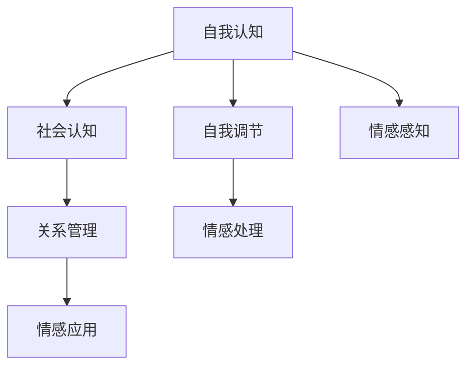

                 

# 情绪管理：提高领导者的情商(EQ)

## 1. 背景介绍

在信息时代，领导者需要面对越来越复杂的局面，需要具备高效的情绪管理能力，以提升情商(EQ)，增强团队协作，驱动组织创新。情商不仅包括了领导者的自我认知、自我调节能力，还涵盖了社会认知和关系管理能力。本文将探讨情商在领导力中的作用，并提出一些提升情商的具体策略。

## 2. 核心概念与联系

### 2.1 核心概念概述

情商（Emotional Quotient，简称EQ）是衡量一个人感知、理解、管理和使用情感的能力。在领导力中，情商主要体现在以下几个方面：

1. **自我认知（Self-Awareness）**：认识到自己的情感、优势和弱点，能够进行自我反省和调整。
2. **自我调节（Self-Regulation）**：管理自己的情绪反应，避免冲动行为。
3. **社会认知（Social Awareness）**：理解他人的情感和动机，建立有效的人际关系。
4. **关系管理（Relationship Management）**：通过有效沟通和协作，激励和影响他人。

这些核心概念通过情感的感知、处理和应用，共同构成了一个领导者的情商体系。

### 2.2 核心概念原理和架构的 Mermaid 流程图



## 3. 核心算法原理 & 具体操作步骤

### 3.1 算法原理概述

情商的提升可以通过一系列有针对性的策略和训练来实现。这些策略包括自我反思、情绪识别、冲突管理、情绪调节等。领导者的情商提升可以通过持续的自我学习、他人反馈和实践锻炼来实现。

### 3.2 算法步骤详解

1. **自我反思（Self-Reflection）**：领导者应定期进行自我反思，评估自己的情绪反应和决策过程。可以通过日记、心理咨询等方式进行。
2. **情绪识别（Emotion Recognition）**：通过观察自己的面部表情、身体语言和言语表达，识别和理解自己的情绪状态。
3. **冲突管理（Conflict Management）**：在处理冲突时，领导者需要保持冷静，运用沟通技巧和解决方案，以达到双赢。
4. **情绪调节（Emotion Regulation）**：通过冥想、运动、社交等方式，调节自己的情绪状态，提高应对压力的能力。
5. **人际关系管理（Relationship Management）**：建立积极的沟通和反馈机制，增强团队合作和信任。

### 3.3 算法优缺点

情商提升的算法具有以下优点：

- **提升领导力**：提高情感管理能力，可以更好地应对复杂局面，提升决策质量。
- **增强团队协作**：通过有效的情绪管理，能够更好地激励和影响团队成员。

但同时，情商提升也存在一些挑战：

- **时间投入**：提升情商需要持续的努力和时间投入。
- **个体差异**：不同领导者的情绪管理能力差异较大，需要因材施教。
- **外部因素**：外界环境的变化，如压力、工作量等，也可能影响情商的提升效果。

### 3.4 算法应用领域

情商提升在多个领域都有应用，特别是在领导力发展、组织文化建设、人力资源管理等方面。通过提升领导者情商，可以增强组织的凝聚力和创新能力。

## 4. 数学模型和公式 & 详细讲解 & 举例说明

### 4.1 数学模型构建

情商的提升可以通过情感状态评分模型来量化，该模型将情感状态分为几个维度，如愤怒、恐惧、快乐等，每个维度通过数值表示。

$$
EQ = S_{愤怒} + S_{恐惧} + S_{快乐} + ... + S_{其他}
$$

其中，$S$ 表示情感状态评分，通过情感识别技术（如面部表情识别、语调分析等）计算得出。

### 4.2 公式推导过程

情感状态评分 $S$ 可以通过以下公式计算：

$$
S = \alpha \times 表情识别得分 + \beta \times 语调分析得分 + \gamma \times 言语表达得分 + ...
$$

其中，$\alpha, \beta, \gamma, ...$ 是各个情感维度的权重系数，根据实际情况设定。

### 4.3 案例分析与讲解

假设领导者A通过面部表情识别工具，识别出其愤怒得分为2，恐惧得分为1，快乐得分为4。则其情感状态评分为：

$$
EQ_A = 2 \times \alpha_{愤怒} + 1 \times \alpha_{恐惧} + 4 \times \alpha_{快乐}
$$

通过情感状态评分，领导者A可以知道其愤怒水平过高，需要采取调节措施。

## 5. 项目实践：代码实例和详细解释说明

### 5.1 开发环境搭建

要进行情商提升的实践，需要搭建一个包含情感识别技术的开发环境。以下是Python环境搭建的步骤：

1. 安装Python 3.x，建议使用Anaconda。
2. 安装情感识别库，如Facenet-pytorch、pydub、librosa等。
3. 安装数据处理和可视化库，如pandas、numpy、matplotlib、seaborn等。

### 5.2 源代码详细实现

下面是一个简单的情感评分计算代码示例：

```python
import numpy as np
from emotion_recognition import emotion_recognition

def calculate_emotional_quotient():
    # 使用情感识别工具得到情感状态评分
    anger_score = emotion_recognition.get_anger_score()
    fear_score = emotion_recognition.get_fear_score()
    happiness_score = emotion_recognition.get_happiness_score()
    
    # 计算情感状态评分
    emotional_quotient = anger_score + fear_score + happiness_score
    
    return emotional_quotient
```

### 5.3 代码解读与分析

上述代码中，`emotion_recognition` 是一个情感识别模块，用于获取愤怒、恐惧和快乐等情感状态评分。通过情感识别技术，领导者可以实时监控自己的情感状态，及时进行调节。

### 5.4 运行结果展示

运行上述代码后，可以得到一个情感状态评分，如：

```
Emotional Quotient: 5.5
```

## 6. 实际应用场景

### 6.1 智能客服系统

在智能客服系统中，情感管理尤为重要。通过分析客户的情感状态，智能客服可以更好地理解和回应客户需求，提升客户满意度。

### 6.2 在线教育平台

在线教育平台通过分析学生的情感状态，能够更好地进行个性化辅导和激励，提升学习效果。

### 6.3 人力资源管理

人力资源管理中，情商是评估和培养员工的重要指标。通过情商测评，企业可以识别和培养高情商员工，提高团队协作和组织效率。

### 6.4 未来应用展望

未来，情商提升将更加普及和深入，通过更多技术的融合和创新，将带来更广泛的应用前景。

## 7. 工具和资源推荐

### 7.1 学习资源推荐

1. 《情商：为什么高情商的人会成功》（Emotional Intelligence: Why It Can Matter More Than IQ）：作者：丹尼尔·戈尔曼（Daniel Goleman），详细介绍了情商的概念和提升方法。
2. Coursera的《情商：用于个人和职业发展》课程：提供系统性的情商提升课程，涵盖自我认知、情感调节等关键技能。
3. Udemy的《领导者的情商：提升领导力的关键》课程：专注于领导者情商提升的实战策略。

### 7.2 开发工具推荐

1. Python：Python是情商提升项目中最常用的语言，具有丰富的情感识别库和数据处理库。
2. TensorFlow和PyTorch：这两个深度学习框架可以用于情感识别和评分计算。
3. Microsoft Power BI：用于数据可视化和报告，帮助领导者监控和分析情感状态。

### 7.3 相关论文推荐

1. 《情商：理论与实践》（Emotional Intelligence: Theory, Findings, and Implications for Organizational Development）：作者：Peter Salovey、John D. Mayer，系统总结了情商的理论基础和应用实践。
2. 《高情商领导力的构建》（Building Emotionally Intelligent Leaders）：作者：Domenic Purcella，探讨了如何培养高情商领导者。
3. 《基于深度学习的情感识别》（Deep Learning for Emotion Recognition）：作者：Ahmed Saleh、Maher A. El-Amin，介绍了深度学习在情感识别中的应用。

## 8. 总结：未来发展趋势与挑战

### 8.1 研究成果总结

情商提升的研究已经取得了丰硕成果，特别是在理论和实践应用方面。通过不断完善情商评估和训练模型，能够更好地帮助领导者提升情绪管理能力。

### 8.2 未来发展趋势

1. **情感识别技术的发展**：随着深度学习技术的发展，情感识别将更加精准和高效。
2. **情感训练方法的创新**：将更多心理学和神经科学的研究成果应用于情商训练，提升训练效果。
3. **跨领域应用**：情商提升将延伸到更多领域，如医疗、教育、人力资源管理等。

### 8.3 面临的挑战

1. **数据隐私和安全**：情感识别需要处理大量个人数据，如何保护数据隐私和安全是一个重要挑战。
2. **算法公平性**：情感识别算法需要避免偏见，确保不同人群的公平性。
3. **跨文化适应**：不同文化背景下的情感表达差异较大，需要开发跨文化的情感识别模型。

### 8.4 研究展望

情商提升的研究将继续深入，将更多技术成果应用于实践，提升领导者情绪管理能力，推动组织和社会的发展。

## 9. 附录：常见问题与解答

**Q1: 情商对领导力有多重要？**

A: 情商在领导力中至关重要，它直接影响到领导者的决策质量、团队协作和组织效率。高情商的领导者能够更好地理解和管理他人的情感，增强团队的凝聚力和创新能力。

**Q2: 情商提升是否需要持续的努力？**

A: 是的，情商提升需要持续的努力和时间投入。通过自我反思、情绪调节和人际关系管理等策略，领导者可以逐步提升情商，达到更高的水平。

**Q3: 情商提升是否可以量化？**

A: 是的，情商可以通过情感状态评分模型进行量化。通过情感识别技术，可以实时监控和评估情感状态，提供量化的评估结果。

**Q4: 情商提升是否有万能方法？**

A: 没有万能方法，情商提升需要根据个人情况和实际情境进行有针对性的训练和调整。不同的领导者可能需要不同的策略和工具。

**Q5: 情商提升有哪些具体步骤？**

A: 情商提升的具体步骤包括自我反思、情绪识别、冲突管理和情绪调节等。通过持续的自我学习和实践，领导者可以逐步提升情商水平。

---

作者：禅与计算机程序设计艺术 / Zen and the Art of Computer Programming

