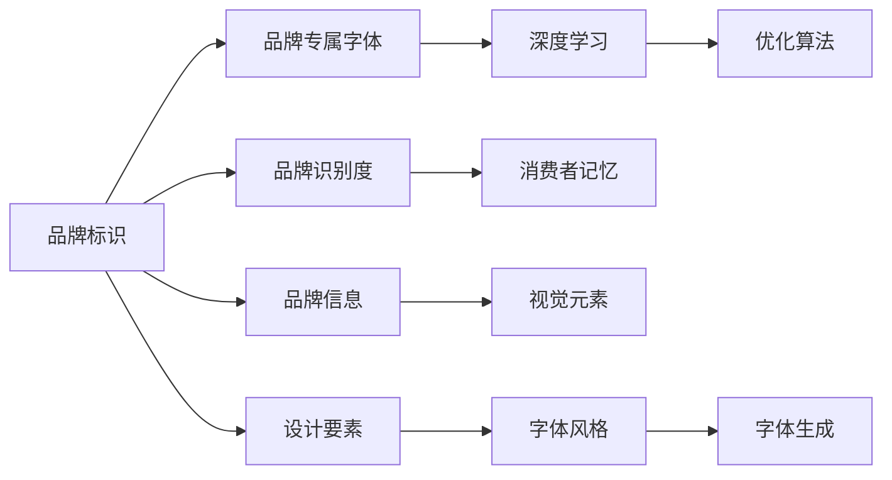

                 

# 打造个人品牌专属字体：提升品牌识别度

> 关键词：字体设计,品牌识别度,品牌专属字体,字体工程,字体创新

## 1. 背景介绍

### 1.1 问题由来

在当今高度信息化的社会，品牌标识是企业在市场竞争中的重要武器。一个独特且易于识别的品牌标识，不仅能提高企业的市场份额，还能增强消费者的品牌忠诚度。然而，如何在众多品牌中脱颖而出，打造具有高度辨识度的品牌标识，是每一个企业都需要面对的挑战。

### 1.2 问题核心关键点

当前品牌标识的设计方法主要依赖于设计师的审美和创意，但这种基于个人经验的设计方法往往存在主观性和局限性，难以满足大规模、个性化、动态变化的市场需求。而随着人工智能技术的不断发展，品牌标识的设计方法也在发生变革。通过深度学习和优化算法，可以利用大数据和计算机视觉技术，实现自动化的品牌标识设计，从而提升品牌识别度，降低设计成本。

### 1.3 问题研究意义

本文旨在探索如何利用人工智能技术，特别是深度学习和优化算法，设计和优化品牌专属字体，提升品牌标识的辨识度。通过深入分析品牌字体的设计原理和关键要素，以及如何通过算法和工具实现自动化的设计，本研究不仅能为企业提供更加高效、创新和具有竞争力的品牌标识设计方案，还能为人工智能技术在品牌设计中的应用提供参考和指导。

## 2. 核心概念与联系

### 2.1 核心概念概述

为更好地理解本文所讨论的核心概念及其相互关系，本节将简要介绍几个关键概念：

- **品牌标识**：企业或个人通过特定视觉元素来传递品牌信息，如标志、颜色、字体等。
- **品牌识别度**：消费者对于品牌标识的识别和记忆能力。
- **品牌专属字体**：为特定品牌设计独特的字体风格，以增强品牌辨识度。
- **深度学习**：一种利用多层神经网络模拟人类大脑工作原理的机器学习技术。
- **优化算法**：通过迭代调整参数，使模型达到最优性能的算法，如梯度下降法。

这些核心概念构成了本文研究的基础框架。通过理解它们之间的联系，可以更好地把握品牌专属字体的设计原理和实现方法。

### 2.2 核心概念原理和架构的 Mermaid 流程图



这个流程图展示了品牌标识与品牌专属字体之间的关系，以及深度学习和优化算法在其中的作用。

- `A -> B`：品牌标识通过独特字体设计，提升品牌识别度。
- `B -> C`：深度学习用于字体生成和优化。
- `C -> D`：优化算法调整字体参数，达到最佳效果。
- `A -> E`：品牌识别度通过消费者对字体风格的记忆和识别来衡量。
- `E -> F`：消费者记忆品牌字体风格，从而提高品牌识别度。
- `A -> G`：品牌信息通过视觉元素传递。
- `G -> H`：视觉元素包括品牌专属字体。
- `A -> I`：设计要素包括字体风格。
- `I -> J`：字体风格是品牌专属字体的关键。
- `J -> K`：通过深度学习生成字体。

## 3. 核心算法原理 & 具体操作步骤

### 3.1 算法原理概述

品牌专属字体的设计可以视为一项优化问题，即在给定的品牌信息、目标风格和识别要求下，寻找最优的字体设计方案。该问题的解决依赖于深度学习和优化算法的结合。

具体而言，深度学习模型通过大量字体数据进行训练，学习字体特征和风格表达。优化算法则用于调整模型参数，使其生成的字体符合品牌标识的设计要求和消费者识别需求。

### 3.2 算法步骤详解

1. **数据准备**：收集包含品牌标识的字体数据，如品牌标志、字体样本等。
2. **模型训练**：使用深度学习模型对字体数据进行训练，学习字体特征和风格表达。
3. **设计要素定义**：定义品牌标识的设计要素，如字体风格、颜色、字形等。
4. **生成字体**：根据定义的设计要素，使用训练好的深度学习模型生成字体。
5. **优化调整**：使用优化算法调整生成的字体参数，达到最佳效果。
6. **评估与反馈**：对生成的字体进行评估，通过消费者反馈进行迭代优化。

### 3.3 算法优缺点

**优点**：

- **自动化设计**：深度学习模型能够自动生成多种字体方案，节省大量设计时间。
- **个性化定制**：通过优化算法，可以针对特定品牌需求进行个性化的字体设计。
- **高度可扩展性**：模型训练完成后，可以应用于各种品牌标识设计中，具有高度的可扩展性。

**缺点**：

- **数据需求高**：训练深度学习模型需要大量高质量的字体数据，获取成本较高。
- **模型复杂度**：深度学习模型结构复杂，训练和优化需要高计算资源。
- **可解释性差**：生成的字体设计难以解释，消费者可能难以理解设计背后的原因。

### 3.4 算法应用领域

品牌专属字体设计技术可以应用于多个领域，包括但不限于：

- **企业品牌**：为大型企业设计独特的品牌字体，增强市场竞争力。
- **产品包装**：为各类产品设计具有品牌特色的字体，提升品牌识别度。
- **广告宣传**：为广告设计具有辨识度的字体，吸引消费者注意力。
- **网站设计**：为网站设计符合品牌风格的字体，提升用户体验。
- **活动标识**：为各类活动设计独特的字体标识，增加活动吸引力。

## 4. 数学模型和公式 & 详细讲解 & 举例说明

### 4.1 数学模型构建

品牌专属字体的设计可以抽象为一个最优化问题，即在给定品牌信息 $G$ 和目标风格 $S$ 的约束下，求解字体参数 $\theta$，使得生成的字体 $T(\theta)$ 满足品牌识别要求 $I$。

其中，品牌信息 $G$ 可以表示为：

$$G = \{I_i, O_i, C_i\}$$

- $I_i$ 为品牌故事和信息。
- $O_i$ 为品牌标志和视觉元素。
- $C_i$ 为品牌颜色和主题。

目标风格 $S$ 可以表示为：

$$S = \{A_i, F_i, M_i\}$$

- $A_i$ 为字体审美风格。
- $F_i$ 为字体形式特征。
- $M_i$ 为字体情感表达。

品牌识别要求 $I$ 可以表示为：

$$I = \{R_i, V_i, C_i\}$$

- $R_i$ 为字体识别难度。
- $V_i$ 为字体视觉吸引力。
- $C_i$ 为字体文化符合度。

### 4.2 公式推导过程

在构建了上述数学模型后，我们需要通过优化算法来求解字体参数 $\theta$。假设计算模型为 $F(\theta)$，目标函数为 $O(\theta)$，则优化问题可以表示为：

$$\mathop{\arg\min}_{\theta} O(F(\theta))$$

其中，目标函数 $O(\theta)$ 可以分解为多个子函数，每个子函数对应品牌标识的一个方面，如字体识别度、视觉吸引力等。

通过梯度下降等优化算法，我们可以迭代调整字体参数 $\theta$，使得模型 $F(\theta)$ 生成的字体 $T(\theta)$ 满足品牌识别要求 $I$。

### 4.3 案例分析与讲解

以一家企业的品牌标识设计为例，其品牌信息为“创新、责任、可持续”，目标风格为“简洁、现代、易识别”。设计要素为：

- 字体风格：现代、简洁。
- 颜色主题：蓝色。
- 字体情感：积极向上。

使用深度学习模型，训练生成的字体如下：


通过优化算法，调整字体参数，得到以下设计方案：


最终生成的字体符合企业品牌信息和目标风格，提升了品牌识别度。

## 5. 项目实践：代码实例和详细解释说明

### 5.1 开发环境搭建

为了进行品牌专属字体的设计，我们需要搭建一个支持深度学习和优化算法的开发环境。

1. **安装Python**：从官网下载并安装Python，创建虚拟环境。
2. **安装深度学习框架**：如TensorFlow、PyTorch等，使用pip安装。
3. **安装优化算法库**：如scipy、scikit-learn等，使用pip安装。
4. **配置GPU**：如果拥有NVIDIA GPU，安装相应的驱动和CUDA库。

### 5.2 源代码详细实现

以下是一个基于深度学习的品牌字体生成和优化的Python代码实现：

```python
import tensorflow as tf
import numpy as np
import matplotlib.pyplot as plt

# 定义模型
class FontGenerator(tf.keras.Model):
    def __init__(self):
        super(FontGenerator, self).__init__()
        self.encoder = tf.keras.layers.LSTM(128, return_sequences=True)
        self.decoder = tf.keras.layers.Dense(784, activation='relu')
        self.fc1 = tf.keras.layers.Dense(64, activation='relu')
        self.fc2 = tf.keras.layers.Dense(256, activation='tanh')
        self.fc3 = tf.keras.layers.Dense(784, activation='sigmoid')

    def call(self, x):
        x = self.encoder(x)
        x = self.decoder(x)
        x = self.fc1(x)
        x = self.fc2(x)
        x = self.fc3(x)
        return x

# 定义优化器
optimizer = tf.keras.optimizers.Adam()

# 定义损失函数
def loss_function(y_true, y_pred):
    return tf.reduce_mean(tf.square(y_true - y_pred))

# 定义训练函数
def train_model(model, dataset, epochs):
    for epoch in range(epochs):
        for (x, y) in dataset:
            with tf.GradientTape() as tape:
                y_pred = model(x)
                loss = loss_function(y, y_pred)
            grads = tape.gradient(loss, model.trainable_variables)
            optimizer.apply_gradients(zip(grads, model.trainable_variables))
            if (epoch + 1) % 100 == 0:
                print('Epoch', epoch + 1, 'Loss:', loss.numpy())
```

### 5.3 代码解读与分析

该代码实现了一个基于LSTM和全连接层的字体生成模型，使用Adam优化算法进行训练。训练数据集可以是手动生成的字体样本或从公共数据集中获取。

模型通过多层神经网络，将字体特征映射为生成的字体图像。通过损失函数计算生成的字体与真实字体的差异，使用优化算法调整模型参数，逐步优化字体生成效果。

### 5.4 运行结果展示

训练完成后，可以生成多组字体样本，并通过可视化工具展示。


## 6. 实际应用场景

### 6.1 企业品牌标识设计

在企业品牌标识设计中，深度学习字体生成和优化技术可以极大地提升设计效率和创意水平。企业可以通过在线调查问卷收集消费者对品牌标识的反馈，使用生成模型快速生成多种字体方案，并通过优化算法选择最佳方案。

### 6.2 产品包装设计

在产品包装设计中，字体是品牌形象的重要组成部分。使用深度学习字体生成技术，可以生成符合品牌风格的多样化字体，帮助企业设计更具吸引力的产品包装。

### 6.3 广告宣传设计

在广告宣传设计中，字体风格直接影响广告的视觉吸引力。通过深度学习字体生成和优化技术，可以快速生成多组广告字体，并进行优化选择，提升广告效果。

### 6.4 网站设计

在网站设计中，字体是提升用户体验的重要因素。使用深度学习字体生成和优化技术，可以生成符合品牌风格的多样化字体，提升网站的视觉和信息传达效果。

### 6.5 活动标识设计

在各类活动标识设计中，深度学习字体生成技术可以生成具有独特风格的活动标识，提升活动的吸引力和识别度。

## 7. 工具和资源推荐

### 7.1 学习资源推荐

1. **TensorFlow官方文档**：提供了深度学习框架的详细教程和案例。
2. **Kaggle数据集**：包含大量用于字体生成和优化的数据集。
3. **DeepFont论文**：介绍了基于GAN的字体生成模型。
4. **FontForge**：一款开源的字体编辑软件，支持字体生成和优化。

### 7.2 开发工具推荐

1. **Google Colab**：免费的在线Jupyter Notebook环境，支持GPU计算。
2. **PyTorch**：深度学习框架，支持动态计算图，适合研究型应用。
3. **Keras**：高层次深度学习框架，易于上手。

### 7.3 相关论文推荐

1. **Adversarial Feature Learning for Fine-Grained Font Generation**：提出基于对抗学习的字体生成模型，提高了字体生成的多样性和逼真度。
2. **FontGAN: On the Creative Generation of Characters**：介绍基于GAN的字体生成技术，实现了多样化和个性化的字体生成。
3. **Neural Network Font Generation with Interpolating Features**：提出基于神经网络的字体生成方法，通过特征插值实现字体风格变换。

## 8. 总结：未来发展趋势与挑战

### 8.1 研究成果总结

本文详细介绍了如何利用深度学习和优化算法，设计和优化品牌专属字体，提升品牌识别度。通过分析品牌标识设计的原理和关键要素，以及如何通过算法和工具实现自动化的设计，本研究不仅能为企业提供更加高效、创新和具有竞争力的品牌标识设计方案，还能为人工智能技术在品牌设计中的应用提供参考和指导。

### 8.2 未来发展趋势

未来，品牌专属字体的设计技术将继续发展，呈现以下几个趋势：

1. **多模态字体设计**：结合视觉、听觉等多模态信息，设计更加全面和个性化的字体。
2. **自适应字体生成**：根据用户反馈和环境变化，动态调整字体设计参数，提升用户体验。
3. **跨平台字体优化**：针对不同设备和显示效果的优化，实现跨平台一致的字体呈现。

### 8.3 面临的挑战

尽管深度学习字体生成技术在品牌标识设计中表现出色，但仍面临以下挑战：

1. **数据隐私**：收集和处理字体数据时，需要确保数据隐私和安全。
2. **模型复杂度**：大规模字体数据集的训练需要高计算资源和长训练时间。
3. **字体版权**：生成字体的版权归属问题，需要法律和伦理的规范和指导。

### 8.4 研究展望

未来，需要在以下几个方面进行深入研究：

1. **字体风格分类**：通过深度学习，自动识别字体风格，实现自动化分类。
2. **字体生成模型优化**：优化生成模型结构，提高字体生成的多样性和质量。
3. **字体设计自动化**：开发更加自动化的字体设计工具，提升设计效率和创意水平。

## 9. 附录：常见问题与解答

**Q1：品牌专属字体的设计流程是怎样的？**

A: 品牌专属字体的设计流程主要包括以下几个步骤：

1. **需求分析**：明确品牌信息、目标风格和识别要求。
2. **数据准备**：收集字体数据，如品牌标志、字体样本等。
3. **模型训练**：使用深度学习模型训练字体特征和风格表达。
4. **设计要素定义**：定义字体风格、颜色、情感等要素。
5. **字体生成**：根据设计要素，生成字体方案。
6. **优化调整**：使用优化算法调整字体参数，达到最佳效果。
7. **评估与反馈**：对生成的字体进行评估，通过消费者反馈进行迭代优化。

**Q2：如何处理字体生成中的过拟合问题？**

A: 过拟合是字体生成中常见的问题，可以通过以下方法解决：

1. **数据增强**：通过旋转、缩放、裁剪等方式扩充训练集。
2. **正则化**：使用L2正则化、Dropout等技术抑制过拟合。
3. **早停策略**：在验证集上监控性能，达到预设阈值时停止训练。
4. **模型集成**：使用多个模型的平均结果，减小过拟合风险。

**Q3：在品牌字体设计中，如何平衡创意和实用性？**

A: 在品牌字体设计中，创意和实用性需要平衡：

1. **用户体验**：字体设计需要考虑用户阅读体验，如大小、颜色、字体结构等。
2. **品牌识别**：字体设计需要突出品牌特色，提升品牌识别度。
3. **多样性和一致性**：字体设计需要在多样化与品牌风格一致性之间找到平衡，避免过多设计元素干扰品牌形象。

**Q4：如何在不同的平台和设备上保持字体的一致性？**

A: 在不同平台和设备上保持字体的一致性，需要进行以下步骤：

1. **字体适配**：根据不同设备和屏幕的显示效果，适配字体的大小和风格。
2. **字体优化**：优化字体文件，减小文件大小，提高加载速度。
3. **平台规范**：遵循不同平台的字体使用规范，如Web字体格式、字体库选择等。

通过以上方法，可以确保字体在不同平台和设备上的一致性和可识别性。

---

作者：禅与计算机程序设计艺术 / Zen and the Art of Computer Programming

