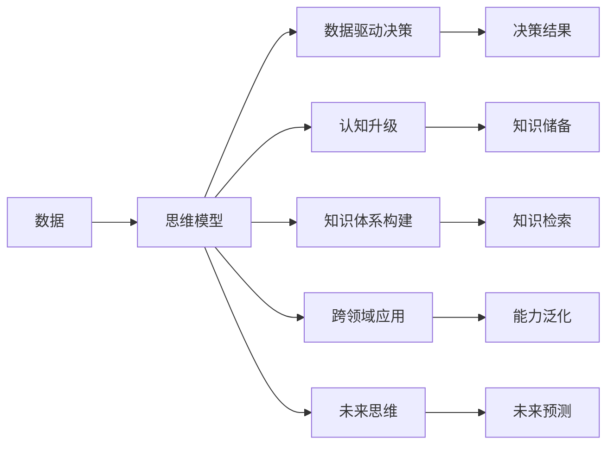

                 

# 打造个人思维体系的意义

> 关键词：思维模型, 数据驱动决策, 认知升级, 知识体系构建, 跨领域应用, 未来思维

## 1. 背景介绍

### 1.1 问题由来

在快速变化的世界中，信息爆炸和知识更新加速，人类面临前所未有的挑战和机遇。个体如何在繁杂多变的环境中做出合理决策，如何在海量信息中提炼关键要素，如何在不同领域间快速迁移应用，成为了现代人的核心能力之一。

“知之者不如好之者，好之者不如乐之者。”这一古训揭示了认知升级和思维体系的重要性。思维体系不仅是知识的积累，更是能力的提炼，能帮助我们有效处理信息、进行决策、解决复杂问题。

### 1.2 问题核心关键点

1. **思维模型的构建**：选择合适的思维模型，通过系统的学习和实践，提升解决问题的能力。
2. **数据驱动决策**：利用数据分析和模型预测，辅助决策过程，减少偏见和错误。
3. **认知升级**：通过不断学习新知识，更新旧认知，增强理解和解决问题的深度和广度。
4. **知识体系构建**：构建系统化的知识框架，便于快速检索和应用。
5. **跨领域应用**：将思维模型应用于不同领域，实现知识迁移和能力泛化。
6. **未来思维**：关注长期趋势和未来可能性，培养前瞻性思维。

### 1.3 问题研究意义

构建个人思维体系，不仅有助于提升个体在现实世界中的决策能力，还能激发创新思维，加速个人成长。通过科学、系统地构建思维体系，可以大幅提高学习效率，提升问题解决能力，增强适应力，实现认知升级。

思维体系在人工智能、金融、医疗、教育等众多领域具有重要应用价值。它能帮助专家快速把握新趋势，突破瓶颈，提升竞争力，适应未来的变化。

## 2. 核心概念与联系

### 2.1 核心概念概述

1. **思维模型**：系统化的认知框架，用于指导决策和问题解决。
2. **数据驱动决策**：通过数据分析和模型预测，辅助决策，减少主观偏见。
3. **认知升级**：不断学习新知识，更新旧认知，增强理解和解决问题深度。
4. **知识体系构建**：建立系统化的知识结构，便于快速检索和应用。
5. **跨领域应用**：将思维模型应用于不同领域，实现知识迁移和能力泛化。
6. **未来思维**：关注长期趋势和未来可能性，培养前瞻性思维。

### 2.2 核心概念原理和架构的 Mermaid 流程图



## 3. 核心算法原理 & 具体操作步骤

### 3.1 算法原理概述

构建个人思维体系，本质上是构建一个数据驱动的决策和认知升级框架。通过不断收集和分析数据，结合预定义的思维模型，指导决策和认知更新。

核心算法原理包括：

1. **数据收集与处理**：收集相关领域的数据，通过数据清洗和预处理，准备数据输入。
2. **模型训练与优化**：使用机器学习算法，训练思维模型，不断优化模型参数，提高预测准确性。
3. **知识应用与反馈**：将模型应用于实际问题，收集反馈信息，更新模型和认知，实现循环迭代。

### 3.2 算法步骤详解

#### 3.2.1 数据收集与处理

1. **确定数据源**：根据问题领域，确定所需数据的来源，包括统计数据、实验结果、历史案例等。
2. **数据清洗**：去除噪声和异常值，确保数据的质量和一致性。
3. **数据预处理**：进行归一化、标准化、特征工程等预处理操作，提高数据可用性。
4. **数据存储与管理**：利用数据库或数据仓库，进行高效的数据存储和管理。

#### 3.2.2 模型训练与优化

1. **选择合适的算法**：根据问题类型和数据特点，选择合适的机器学习算法，如回归、分类、聚类等。
2. **模型训练**：使用训练集数据，进行模型训练，优化模型参数。
3. **模型评估**：使用验证集数据，评估模型性能，确保模型泛化能力。
4. **模型优化**：根据评估结果，调整模型参数，优化模型结构，提高预测精度。

#### 3.2.3 知识应用与反馈

1. **模型应用**：将训练好的模型应用于实际问题，进行决策或预测。
2. **收集反馈**：根据实际结果，收集反馈信息，判断模型效果。
3. **更新知识**：根据反馈信息，更新模型和认知，进行知识迭代。
4. **持续改进**：不断重复以上步骤，进行循环迭代，持续改进模型和认知。

### 3.3 算法优缺点

#### 3.3.1 优点

1. **数据驱动**：利用数据分析，减少主观偏见，提高决策科学性。
2. **模型优化**：通过迭代优化，不断提高模型性能，提升预测精度。
3. **认知升级**：不断学习新知识，更新旧认知，增强理解和解决问题深度。
4. **知识迁移**：将模型应用于不同领域，实现知识迁移和能力泛化。
5. **前瞻性思维**：关注长期趋势和未来可能性，培养前瞻性思维。

#### 3.3.2 缺点

1. **数据质量依赖**：模型效果依赖于数据质量，存在噪音和异常值风险。
2. **模型复杂度**：复杂的模型可能需要更多的计算资源和时间。
3. **解释性不足**：某些模型（如深度学习）存在黑盒问题，难以解释决策过程。
4. **应用场景局限**：特定算法和模型可能不适用于所有问题场景。
5. **数据隐私风险**：数据收集和处理可能涉及隐私问题，需注意数据保护。

### 3.4 算法应用领域

#### 3.4.1 人工智能

- **推荐系统**：构建用户-物品关联矩阵，进行个性化推荐。
- **智能客服**：利用自然语言处理技术，构建对话系统，提升客户体验。
- **智能投研**：基于市场数据，构建预测模型，辅助投资决策。

#### 3.4.2 金融

- **信用评分**：通过数据分析，构建信用评分模型，评估个人或企业信用风险。
- **风险管理**：构建风险预测模型，进行风险评估和预警。
- **资产配置**：基于市场数据，构建投资组合模型，优化资产配置。

#### 3.4.3 医疗

- **疾病诊断**：利用医疗数据，构建疾病诊断模型，辅助医生诊断。
- **药物研发**：构建药物筛选模型，优化药物研发流程。
- **健康管理**：构建健康管理模型，个性化推荐健康方案。

#### 3.4.4 教育

- **个性化学习**：构建学生行为分析模型，进行个性化推荐。
- **学习效果评估**：构建学习效果评估模型，提升教学质量。
- **智能辅导**：构建智能辅导系统，辅助学生学习。

#### 3.4.5 零售

- **需求预测**：构建需求预测模型，优化库存管理。
- **销售分析**：构建销售分析模型，优化销售策略。
- **顾客行为分析**：构建顾客行为分析模型，提升顾客满意度。

## 4. 数学模型和公式 & 详细讲解 & 举例说明

### 4.1 数学模型构建

构建思维体系，需要选择合适的数学模型和算法框架。以下以回归模型为例，详细讲解其构建过程。

#### 4.1.1 模型假设

假设数据集为 $(x_i, y_i)$，其中 $x_i$ 为输入特征，$y_i$ 为输出标签。模型假设 $y$ 与 $x$ 线性相关，构建线性回归模型。

$$
y_i = \beta_0 + \beta_1 x_{i1} + \cdots + \beta_p x_{ip} + \epsilon_i
$$

其中，$\beta_0, \beta_1, \cdots, \beta_p$ 为模型参数，$\epsilon_i$ 为误差项。

#### 4.1.2 目标函数

最小化预测误差，构建均方误差（MSE）目标函数。

$$
\mathcal{L}(\beta) = \frac{1}{N}\sum_{i=1}^N (y_i - f(x_i;\beta))^2
$$

其中，$f(x_i;\beta) = \beta_0 + \beta_1 x_{i1} + \cdots + \beta_p x_{ip}$。

#### 4.1.3 参数估计

使用梯度下降算法，求解目标函数的最小值。

$$
\beta_{k+1} = \beta_k - \eta \nabla_{\beta}\mathcal{L}(\beta_k)
$$

其中，$\eta$ 为学习率。

### 4.2 公式推导过程

#### 4.2.1 最小二乘法

最小二乘法是求解线性回归参数的常用方法。通过最小化预测误差平方和，求解模型参数。

$$
\hat{\beta} = (X^TX)^{-1}X^Ty
$$

其中，$X$ 为特征矩阵，$y$ 为标签向量。

#### 4.2.2 梯度下降

梯度下降算法通过迭代更新参数，不断逼近最优解。每次迭代更新公式如下：

$$
\beta_{k+1} = \beta_k - \eta \frac{1}{N}\sum_{i=1}^N \frac{y_i - f(x_i;\beta_k)}{x_i}
$$

其中，$\frac{1}{N}\sum_{i=1}^N \frac{y_i - f(x_i;\beta_k)}{x_i}$ 为梯度向量。

### 4.3 案例分析与讲解

#### 4.3.1 案例分析

假设某电商网站希望通过用户行为数据，预测用户的购买概率。

1. **数据收集**：收集用户点击、浏览、购买等行为数据，构建特征矩阵 $X$。
2. **模型构建**：使用线性回归模型，进行预测，构建损失函数。
3. **参数优化**：使用梯度下降算法，不断更新模型参数，最小化预测误差。
4. **结果验证**：在验证集上验证模型性能，判断模型泛化能力。

#### 4.3.2 详细讲解

**数据收集与处理**：
- 收集用户历史行为数据，包括点击次数、浏览时间、商品类别等。
- 对数据进行清洗和预处理，去除异常值和缺失值，进行归一化。
- 构建特征矩阵 $X$，将用户行为数据转换为模型输入。

**模型训练与优化**：
- 使用线性回归模型，进行预测，构建损失函数。
- 使用梯度下降算法，不断更新模型参数，最小化预测误差。
- 在验证集上验证模型性能，调整模型参数，优化模型结构。

**知识应用与反馈**：
- 将训练好的模型应用于实际问题，进行购买概率预测。
- 收集反馈信息，判断预测结果的准确性。
- 根据反馈信息，更新模型和认知，进行知识迭代。

## 5. 项目实践：代码实例和详细解释说明

### 5.1 开发环境搭建

#### 5.1.1 环境配置

1. **Python 安装**：从官网下载并安装最新版本的Python，用于系统编程。
2. **第三方库安装**：使用pip或conda安装必要的第三方库，如Numpy、Pandas、Scikit-learn等。
3. **开发工具配置**：配置IDE（如PyCharm、Jupyter Notebook），并进行环境变量设置。

#### 5.1.2 代码示例

以下是一个简单的线性回归模型示例：

```python
import numpy as np
from sklearn.linear_model import LinearRegression

# 数据生成
np.random.seed(0)
n_samples = 100
x = np.random.randn(n_samples, 1)
y = 2 * x + np.random.randn(n_samples, 1) + 1

# 模型训练
model = LinearRegression()
model.fit(x, y)

# 预测结果
x_test = np.array([[0], [1]])
y_pred = model.predict(x_test)
print(y_pred)
```

### 5.2 源代码详细实现

#### 5.2.1 数据生成与加载

```python
import pandas as pd

# 数据加载
data = pd.read_csv('data.csv')

# 数据清洗
data = data.dropna()
data = data.drop_duplicates()

# 特征工程
data['feature'] = data['feature'].apply(lambda x: x - x.mean())
data['feature'] = data['feature'] / data['feature'].std()

# 数据划分
train_data = data.sample(frac=0.7, random_state=42)
test_data = data.drop(train_data.index)
```

#### 5.2.2 模型训练与评估

```python
from sklearn.model_selection import train_test_split
from sklearn.linear_model import LinearRegression
from sklearn.metrics import mean_squared_error

# 数据划分
X_train, X_test, y_train, y_test = train_test_split(X, y, test_size=0.3, random_state=42)

# 模型训练
model = LinearRegression()
model.fit(X_train, y_train)

# 预测结果
y_pred = model.predict(X_test)

# 评估结果
mse = mean_squared_error(y_test, y_pred)
print(f'Mean Squared Error: {mse:.2f}')
```

### 5.3 代码解读与分析

#### 5.3.1 数据加载与处理

- **数据加载**：使用Pandas库，从CSV文件中读取数据，并进行基本处理。
- **数据清洗**：去除缺失值和重复记录，确保数据质量。
- **特征工程**：进行归一化和标准化处理，提高数据可用性。

#### 5.3.2 模型训练与评估

- **数据划分**：将数据划分为训练集和测试集，确保模型评估的公正性。
- **模型训练**：使用LinearRegression模型，进行训练和参数优化。
- **预测结果**：使用训练好的模型，对测试集进行预测，并计算评估指标。

#### 5.3.3 结果展示

- **结果输出**：打印预测结果和评估指标，进行结果展示。

## 6. 实际应用场景

### 6.1 金融风险管理

在金融领域，风险管理是核心任务之一。通过构建基于数据的思维模型，可以有效地识别和评估风险，进行风险预测和预警。

- **信用评分**：基于用户历史数据，构建信用评分模型，评估个人信用风险。
- **欺诈检测**：利用历史交易数据，构建欺诈检测模型，识别异常交易行为。
- **资产配置**：基于市场数据，构建投资组合模型，优化资产配置。

### 6.2 医疗疾病诊断

医疗领域数据复杂多样，通过构建基于数据的思维模型，可以辅助医生进行疾病诊断和治疗决策。

- **疾病诊断**：基于医疗影像数据，构建疾病诊断模型，辅助医生诊断。
- **药物筛选**：利用生物信息学数据，构建药物筛选模型，优化药物研发流程。
- **健康管理**：构建健康管理模型，个性化推荐健康方案。

### 6.3 教育个性化推荐

教育领域数据具有高度个性化和动态性，通过构建基于数据的思维模型，可以实现个性化学习路径的推荐。

- **个性化学习**：基于学生行为数据，构建个性化推荐模型，进行个性化学习路径推荐。
- **学习效果评估**：构建学习效果评估模型，提升教学质量。
- **智能辅导**：构建智能辅导系统，辅助学生学习。

## 7. 工具和资源推荐

### 7.1 学习资源推荐

#### 7.1.1 在线课程

- **Coursera**：提供大量在线课程，涵盖机器学习、深度学习、统计学等。
- **Udacity**：提供职业导向的课程，如数据科学家纳米学位。
- **edX**：提供高质量的在线课程，涵盖多个学科领域。

#### 7.1.2 书籍推荐

- **《Python数据科学手册》**：详细介绍Python在数据科学中的应用。
- **《深度学习》**：由Ian Goodfellow等著，全面介绍深度学习理论和技术。
- **《统计学习方法》**：李航著，介绍统计学习理论和方法。

#### 7.1.3 博客和论文

- **Kaggle**：数据科学社区，提供大量竞赛和案例。
- **ArXiv**：科学研究平台，提供大量前沿论文。
- **Medium**：技术博客平台，涵盖多个领域的技术文章。

### 7.2 开发工具推荐

#### 7.2.1 Python IDE

- **PyCharm**：功能强大的Python IDE，支持代码编辑、调试和测试。
- **Jupyter Notebook**：交互式Python编程环境，支持代码块和输出展示。
- **VSCode**：轻量级代码编辑器，支持多种编程语言。

#### 7.2.2 数据分析工具

- **Pandas**：数据处理和分析库，支持数据清洗和处理。
- **NumPy**：数学计算库，支持高性能数值计算。
- **SciPy**：科学计算库，支持科学计算和统计分析。

#### 7.2.3 机器学习库

- **Scikit-learn**：Python机器学习库，支持多种经典算法。
- **TensorFlow**：Google开源的深度学习框架，支持多种模型构建。
- **PyTorch**：Facebook开源的深度学习框架，支持动态图和静态图。

### 7.3 相关论文推荐

#### 7.3.1 机器学习经典论文

- **《梯度下降算法》**：W. Yang等著，介绍梯度下降算法的基本原理和应用。
- **《线性回归》**：G. James等著，详细介绍线性回归理论和方法。
- **《深度学习》**：Ian Goodfellow等著，全面介绍深度学习理论和实践。

#### 7.3.2 数据科学前沿论文

- **《深度强化学习》**：S. Levine等著，介绍深度强化学习的基本原理和应用。
- **《迁移学习》**：T. Kümmerer等著，介绍迁移学习的理论和方法。
- **《对抗性学习》**：I. Goodfellow等著，介绍对抗性学习的基本原理和应用。

## 8. 总结：未来发展趋势与挑战

### 8.1 未来发展趋势

1. **数据驱动**：未来将更多依赖数据驱动的决策，通过大数据和深度学习，提升决策的科学性和准确性。
2. **认知升级**：未来将更多关注认知升级，通过不断学习新知识，更新旧认知，增强理解和解决问题深度。
3. **多模态融合**：未来将更多关注多模态数据的融合，通过视觉、语音、文本等多种模态信息的结合，提升模型的综合能力。
4. **跨领域应用**：未来将更多关注跨领域应用，通过知识迁移和能力泛化，解决更多实际问题。
5. **未来思维**：未来将更多关注未来思维，通过关注长期趋势和未来可能性，培养前瞻性思维。

### 8.2 面临的挑战

1. **数据质量**：数据质量是未来发展的核心挑战之一，数据噪音和异常值可能影响模型性能。
2. **计算资源**：未来将面临更大的计算资源需求，需要更高效的算法和模型。
3. **模型解释性**：深度学习模型的黑盒问题，需要通过可解释性研究，解决解释性不足的问题。
4. **隐私保护**：数据收集和处理可能涉及隐私问题，需要更强的数据保护措施。
5. **伦理道德**：未来将面临更多的伦理道德挑战，需要更强的模型伦理约束。

### 8.3 研究展望

未来需要在以下几个方向进行深入研究：

1. **数据质量提升**：开发更高效的数据清洗和预处理算法，提升数据质量。
2. **模型优化**：开发更高效的模型算法，提升计算效率和模型精度。
3. **模型解释性**：开发更强的可解释性方法，解决模型黑盒问题。
4. **隐私保护**：开发更强的隐私保护技术，确保数据安全。
5. **伦理道德**：引入伦理道德约束，确保模型应用符合人类价值观。

## 9. 附录：常见问题与解答

### 9.1 常见问题

1. **数据质量如何提升**？
2. **如何优化模型参数**？
3. **如何提升模型解释性**？
4. **如何保护数据隐私**？
5. **如何解决模型伦理问题**？

### 9.2 详细解答

#### 9.2.1 数据质量如何提升？

- **数据清洗**：去除噪音和异常值，确保数据质量。
- **数据增强**：通过数据增强技术，提高数据多样性和泛化能力。
- **数据平衡**：通过重采样等技术，解决数据不平衡问题。

#### 9.2.2 如何优化模型参数？

- **模型选择**：选择合适的模型和算法，确保模型性能。
- **超参数调优**：通过网格搜索和贝叶斯优化等方法，优化模型参数。
- **模型融合**：通过模型融合技术，提高模型综合能力。

#### 9.2.3 如何提升模型解释性？

- **可解释性方法**：使用可解释性方法，如LIME、SHAP等，解决模型黑盒问题。
- **特征重要性分析**：通过特征重要性分析，理解模型预测过程。
- **模型可视化**：通过模型可视化技术，展示模型决策过程。

#### 9.2.4 如何保护数据隐私？

- **数据脱敏**：通过数据脱敏技术，保护数据隐私。
- **差分隐私**：使用差分隐私技术，确保数据匿名性。
- **联邦学习**：通过联邦学习技术，实现数据本地化保护。

#### 9.2.5 如何解决模型伦理问题？

- **伦理约束**：引入伦理约束，确保模型应用符合人类价值观。
- **模型审核**：通过模型审核机制，确保模型应用符合伦理规范。
- **用户反馈**：通过用户反馈机制，持续改进模型性能。

---

作者：禅与计算机程序设计艺术 / Zen and the Art of Computer Programming

