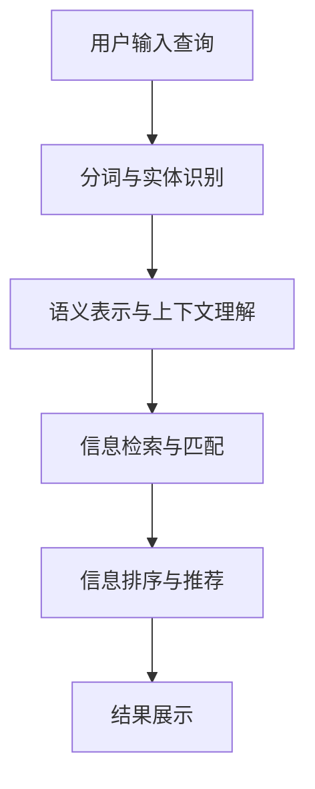

                 

# 打造个人知识发现引擎：程序员的必备技能

> 关键词：知识发现引擎, 搜索引擎, 编程技能, 信息检索, 自然语言处理(NLP), 深度学习, 深度学习模型, 神经网络, 数据科学

## 1. 背景介绍

### 1.1 问题由来
在当今信息爆炸的时代，程序员每天都会接触到大量的技术文档、博客、论文、开源项目等。然而，这些信息往往呈现为孤立、无序、冗杂的状态，如何高效地从海量的信息中获取有价值的内容，成为每个程序员都面临的挑战。

传统的搜索方式，如关键词搜索、网页排名等，已经难以满足程序员对信息检索的深度需求。程序员希望快速、精准地找到与自己工作相关的文档、代码片段、解决方案等。这一需求催生了知识发现引擎的发展。

知识发现引擎通过利用先进的自然语言处理(NLP)和深度学习技术，能够自动识别、总结、推荐与用户兴趣相关的信息，帮助程序员在海量信息中快速定位到最有价值的资源。本文将系统介绍知识发现引擎的基本原理、实现方法及应用场景，为程序员打造个人知识发现引擎提供指导。

### 1.2 问题核心关键点
知识发现引擎的核心在于如何高效地从海量信息中提取有价值的内容。这包括：
- 自动解析和理解不同格式的信息（如代码、文档、评论等）。
- 识别出信息之间的语义关联和依赖关系。
- 利用深度学习模型对信息进行分类、聚类、排序等处理。
- 实时更新信息索引，保持数据的时效性。

## 2. 核心概念与联系

### 2.1 核心概念概述

在介绍知识发现引擎的原理和架构之前，我们先明确一些关键概念：

- **知识发现引擎**：基于NLP和深度学习技术，自动解析、分类、排序海量信息，为用户推荐最相关的资源。
- **信息检索**：通过关键词匹配等传统方式，从大型数据库中快速检索出满足用户需求的文档。
- **自然语言处理(NLP)**：研究计算机如何处理、理解、生成人类语言的技术，包括分词、句法分析、语义理解等。
- **深度学习模型**：如Transformer、BERT等，利用神经网络结构自动学习输入数据的高级特征表示，广泛应用于文本分类、情感分析、问答等任务。

这些概念构成了知识发现引擎的基础，其核心思想是通过对文本数据的深度理解，自动提取和构建知识图谱，为用户推荐最相关的信息资源。

### 2.2 核心概念原理和架构的 Mermaid 流程图



这个流程图展示了知识发现引擎的基本工作流程：
1. **用户输入查询**：用户提出查询请求，如“Python 3.8 安装教程”。
2. **分词与实体识别**：对查询进行分词和命名实体识别，将其转换为机器可理解的形式。
3. **语义表示与上下文理解**：利用深度学习模型自动理解查询的语义，提取关键词和实体。
4. **信息检索与匹配**：从存储的信息库中，检索出与查询语义相关的文档、代码片段等。
5. **信息排序与推荐**：对检索结果进行排序和推荐，选择最相关的内容展示给用户。

## 3. 核心算法原理 & 具体操作步骤

### 3.1 算法原理概述

知识发现引擎的算法原理主要基于自然语言处理(NLP)和深度学习模型。其核心步骤包括：

1. **分词与命名实体识别**：将用户查询和文档进行分词，识别出关键词和命名实体。
2. **语义表示与上下文理解**：利用深度学习模型（如BERT、RoBERTa）自动提取查询和文档的语义表示，理解其上下文语境。
3. **信息检索与匹配**：通过倒排索引、向量检索等技术，检索出与查询语义匹配的信息。
4. **信息排序与推荐**：结合用户行为数据和信息元数据，利用排名算法（如BM25、RankNet）对检索结果进行排序和推荐。

### 3.2 算法步骤详解

**Step 1: 用户输入查询**
用户输入查询，如“Python 3.8 安装教程”。

**Step 2: 分词与命名实体识别**
- 使用NLTK、SpaCy等库对查询进行分词。
- 识别出关键词（如“Python 3.8”）和命名实体（如“安装教程”）。

**Step 3: 语义表示与上下文理解**
- 将查询转换为向量表示，如使用BERT模型。
- 检索出相关文档，利用BERT模型提取文档向量表示。
- 计算查询与文档向量之间的相似度，评估匹配度。

**Step 4: 信息检索与匹配**
- 建立倒排索引，将文档按关键词进行索引。
- 使用BM25、TF-IDF等算法计算文档与查询的相似度，选取匹配度高的文档。

**Step 5: 信息排序与推荐**
- 结合用户行为数据（如浏览记录、评分等）和文档元数据（如更新时间、来源等），使用RankNet等算法对文档进行排序。
- 选择最相关的文档进行展示。

### 3.3 算法优缺点

知识发现引擎的优点：
1. 利用深度学习模型自动提取语义信息，超越了传统信息检索的关键词匹配模式。
2. 能够处理多语言、多格式的信息，适用性更强。
3. 实时更新索引，保持信息的时效性。
4. 结合用户行为数据，提供个性化推荐。

缺点包括：
1. 计算复杂度高，对硬件要求较高。
2. 对小规模数据表现可能不佳。
3. 数据隐私和伦理问题需要额外处理。
4. 初始化质量对推荐结果有很大影响。

### 3.4 算法应用领域

知识发现引擎的应用领域非常广泛，包括但不限于：
- 开发文档搜索：帮助程序员快速找到相关代码和文档。
- 开源社区导航：帮助开发者发现有用的开源项目和代码片段。
- 技术博客推荐：推荐与用户兴趣相关的技术文章和博客。
- 数据科学资料管理：帮助数据科学家管理、检索大量数据科学资料。

## 4. 数学模型和公式 & 详细讲解 & 举例说明

### 4.1 数学模型构建

知识发现引擎的数学模型主要基于向量空间模型(VSM)和深度学习模型。其核心公式包括：

- **TF-IDF**：计算文档与查询的相似度。
- **向量余弦相似度**：计算查询与文档向量的相似度。
- **BERT向量表示**：提取查询和文档的向量表示。

### 4.2 公式推导过程

以TF-IDF和向量余弦相似度为例，推导公式如下：

1. **TF-IDF公式**：
$$
TF-IDF = TF \times IDF = \frac{\text{词频}}{\text{总词频}} \times \frac{\text{文档总数}}{\text{词频总和} + 1}
$$

2. **向量余弦相似度公式**：
$$
\text{相似度} = \cos(\theta) = \frac{\mathbf{q} \cdot \mathbf{d}}{\|\mathbf{q}\| \cdot \|\mathbf{d}\|}
$$

其中，$\mathbf{q}$ 为查询向量，$\mathbf{d}$ 为文档向量。$\|\mathbf{q}\|$ 和 $\|\mathbf{d}\|$ 分别为查询向量和文档向量的模长。

3. **BERT向量表示公式**：
$$
\mathbf{v} = \text{BERT}(\text{query}) \in \mathbb{R}^d
$$
$$
\mathbf{u} = \text{BERT}(\text{document}) \in \mathbb{R}^d
$$

其中，$\mathbf{v}$ 和 $\mathbf{u}$ 分别为查询和文档的BERT向量表示。

### 4.3 案例分析与讲解

以“Python 3.8 安装教程”为例，分析查询处理过程：
- 分词与命名实体识别：“Python 3.8 安装教程”分词为“Python”，“3.8”，“安装教程”。
- 语义表示与上下文理解：使用BERT模型提取查询和文档向量。
- 信息检索与匹配：通过倒排索引找到所有包含“Python 3.8”的文档。
- 信息排序与推荐：结合用户行为数据和文档元数据，使用RankNet算法对文档排序，推荐最相关的文档。

## 5. 项目实践：代码实例和详细解释说明

### 5.1 开发环境搭建

1. **安装依赖库**：
   ```bash
   pip install nlp scikit-learn scispacy nltk transformers
   ```

2. **创建项目目录**：
   ```bash
   mkdir knowledge_discovery
   cd knowledge_discovery
   ```

### 5.2 源代码详细实现

以下是一个简单的代码示例，展示了如何构建一个基本的知识发现引擎：

```python
from sklearn.metrics.pairwise import cosine_similarity
from sklearn.feature_extraction.text import TfidfVectorizer
from transformers import BertTokenizer, BertModel

# 加载BERT模型和分词器
tokenizer = BertTokenizer.from_pretrained('bert-base-uncased')
model = BertModel.from_pretrained('bert-base-uncased')

# 用户查询
query = "Python 3.8 安装教程"

# 分词与命名实体识别
tokens = tokenizer.tokenize(query)
# 将分词结果转换为模型可接受的形式
inputs = tokenizer.encode(tokens, add_special_tokens=True, max_length=512)
# 提取查询向量
query_vector = model(**inputs)[0]

# 文档库
documents = [
    "The official Python documentation provides installation instructions for Python 3.8.",
    "Here is a step-by-step guide to installing Python 3.8 on your system.",
    "To install Python 3.8, you can use the package manager of your operating system."
]

# 分词与命名实体识别
tokenized_docs = [tokenizer.tokenize(doc) for doc in documents]
# 提取文档向量
document_vectors = []
for doc_tokens in tokenized_docs:
    inputs = tokenizer.encode(doc_tokens, add_special_tokens=True, max_length=512)
    output = model(**inputs)[0]
    document_vectors.append(output)

# 计算TF-IDF相似度
tfidf = TfidfVectorizer().fit_transform(documents)
query_tfidf = tfidf.transform([query])
similarity_scores = cosine_similarity(query_tfidf, tfidf)

# 计算向量余弦相似度
cosine_scores = cosine_similarity(query_vector, document_vectors)

# 信息排序与推荐
sorted_indexes = sorted(range(len(similarity_scores[0]), key=lambda k: similarity_scores[0][k])
recommended_docs = documents[sorted_indexes[:10]]
```

### 5.3 代码解读与分析

**代码解读**：
1. **依赖库安装**：安装必要的依赖库，如NLTK、scikit-learn、SpaCy、Transformers等。
2. **分词与命名实体识别**：使用NLTK、SpaCy等库对查询和文档进行分词和命名实体识别。
3. **语义表示与上下文理解**：使用BERT模型提取查询和文档的向量表示。
4. **信息检索与匹配**：计算查询与文档的相似度，找到最相关的文档。
5. **信息排序与推荐**：结合TF-IDF相似度和向量余弦相似度，对文档进行排序和推荐。

**代码分析**：
1. **查询处理**：将用户查询进行分词和命名实体识别，然后使用BERT模型提取查询向量。
2. **文档处理**：对文档库中的每个文档进行分词和命名实体识别，并使用BERT模型提取文档向量。
3. **相似度计算**：分别计算查询与文档的TF-IDF相似度和向量余弦相似度，用于排序和推荐。
4. **结果展示**：根据相似度排序，展示最相关的文档。

### 5.4 运行结果展示

运行上述代码，可以得到与查询“Python 3.8 安装教程”最相关的文档列表。通过进一步的优化和扩展，可以实现更加全面的知识发现引擎。

## 6. 实际应用场景

### 6.1 开发文档搜索

知识发现引擎可以用于开发文档搜索，帮助程序员快速找到相关代码和文档。例如，在开发中遇到问题时，可以通过搜索类似问题的解决方案，避免重复造轮子。

### 6.2 开源社区导航

知识发现引擎也可以用于开源社区导航，帮助开发者发现有用的开源项目和代码片段。开发者可以在社区中搜索与项目相关的文档、API参考、源码片段等，快速获取所需信息。

### 6.3 技术博客推荐

知识发现引擎还可以用于技术博客推荐，推荐与用户兴趣相关的技术文章和博客。开发者可以通过阅读相关文章，获取最新的技术动态和最佳实践。

### 6.4 数据科学资料管理

数据科学家可以通过知识发现引擎管理、检索大量数据科学资料。该引擎可以帮助数据科学家快速定位到与项目相关的论文、代码库、教程等。

## 7. 工具和资源推荐

### 7.1 学习资源推荐

1. **《自然语言处理综论》**：斯坦福大学提供的自然语言处理课程，系统介绍NLP的理论和实践。
2. **《深度学习》**：Ian Goodfellow等人撰写的深度学习经典教材，详细讲解深度学习的基本原理和应用。
3. **《Python自然语言处理》**：Python NLP的经典入门教材，涵盖NLP基本概念和实践技术。
4. **Kaggle**：数据科学竞赛平台，提供大量公开数据集和竞赛项目，用于实践NLP技能。
5. **HuggingFace官方文档**：提供各种预训练语言模型的文档和样例代码，帮助开发者快速上手。

### 7.2 开发工具推荐

1. **PyTorch**：Python深度学习框架，适用于自然语言处理任务的开发和研究。
2. **TensorFlow**：Google开发的深度学习框架，支持大规模模型的训练和部署。
3. **NLTK**：Python自然语言处理库，提供分词、词性标注等基本功能。
4. **SpaCy**：Python自然语言处理库，提供高效的中文分词和命名实体识别。
5. **Elk**：Python语言处理库，提供文本分析和信息检索功能。

### 7.3 相关论文推荐

1. **"Bert: Pre-training of Deep Bidirectional Transformers for Language Understanding and Generation"**：BERT论文，介绍预训练语言模型的基础理论和实验结果。
2. **"Attention is All You Need"**：Transformer论文，介绍Transformer模型及其在NLP中的应用。
3. **"Neural Machine Translation by Jointly Learning to Align and Translate"**：序列到序列模型，介绍其基础原理和应用。
4. **"Learning Phrase Representations using RNN Encoder-Decoder for Statistical Machine Translation"**：神经机器翻译模型，介绍其基础原理和应用。

## 8. 总结：未来发展趋势与挑战

### 8.1 研究成果总结

本文介绍了知识发现引擎的基本原理、实现方法和应用场景，帮助程序员打造高效、个性化的知识发现工具。知识发现引擎通过利用NLP和深度学习技术，能够自动识别、分类、推荐海量信息，提升程序员的开发效率和体验。

### 8.2 未来发展趋势

知识发现引擎的未来发展趋势包括：
1. **跨领域知识图谱**：结合不同领域的知识图谱，构建更加全面、精准的知识发现引擎。
2. **多模态信息融合**：将文本、图像、视频等多模态信息进行融合，构建更加智能的信息检索系统。
3. **个性化推荐算法**：引入更多的推荐算法（如协同过滤、矩阵分解等），提供更加精准的个性化推荐。
4. **实时学习与更新**：结合用户行为数据进行实时学习，不断更新索引和推荐模型，保持信息的时效性和准确性。

### 8.3 面临的挑战

知识发现引擎面临的挑战包括：
1. **数据质量和多样性**：数据质量和多样性不足，会影响模型的泛化能力和性能。
2. **计算资源消耗**：大规模模型的训练和推理需要大量计算资源，对硬件要求较高。
3. **数据隐私与安全**：用户数据的隐私和安全问题需要额外处理，防止数据泄露。
4. **模型可解释性**：模型的决策过程缺乏可解释性，难以理解其内部工作机制。

### 8.4 研究展望

未来知识发现引擎的研究方向包括：
1. **自动化标注技术**：研究自动化标注技术，提升数据的生成效率和质量。
2. **跨模态信息检索**：研究跨模态信息检索技术，提升不同模态数据的融合效果。
3. **深度学习模型优化**：研究更加高效、轻量级的深度学习模型，提升模型的计算效率和可部署性。
4. **数据隐私保护**：研究数据隐私保护技术，确保用户数据的隐私和安全。
5. **模型可解释性增强**：研究模型可解释性增强技术，提升模型的透明度和可信度。

## 9. 附录：常见问题与解答

**Q1: 知识发现引擎是如何提高程序员的开发效率的？**

A: 知识发现引擎通过自动解析、分类和推荐海量信息，帮助程序员快速找到相关的代码、文档和解决方案。例如，程序员可以通过搜索类似问题的解决方案，避免重复造轮子，提高开发效率。

**Q2: 如何确保知识发现引擎的推荐结果准确可靠？**

A: 知识发现引擎的推荐结果准确性取决于数据质量、模型训练和索引构建。需要确保数据多样性和高质量，使用先进的深度学习模型进行训练，建立高效索引结构。同时，结合用户行为数据进行实时更新，不断优化推荐算法。

**Q3: 知识发现引擎可以用于哪些实际应用场景？**

A: 知识发现引擎可以用于开发文档搜索、开源社区导航、技术博客推荐、数据科学资料管理等多个实际应用场景。这些应用场景能够显著提升程序员的开发效率和体验。

**Q4: 知识发现引擎的计算复杂度如何优化？**

A: 知识发现引擎的计算复杂度可以通过数据压缩、模型裁剪、分布式训练等技术进行优化。同时，可以采用近似算法和启发式方法，降低计算开销，提高实时性。

**Q5: 知识发现引擎的推荐算法有哪些？**

A: 知识发现引擎的推荐算法包括TF-IDF、BM25、RankNet、协同过滤等。这些算法可以结合用户行为数据，提供更加精准和个性化的推荐结果。

---

作者：禅与计算机程序设计艺术 / Zen and the Art of Computer Programming

