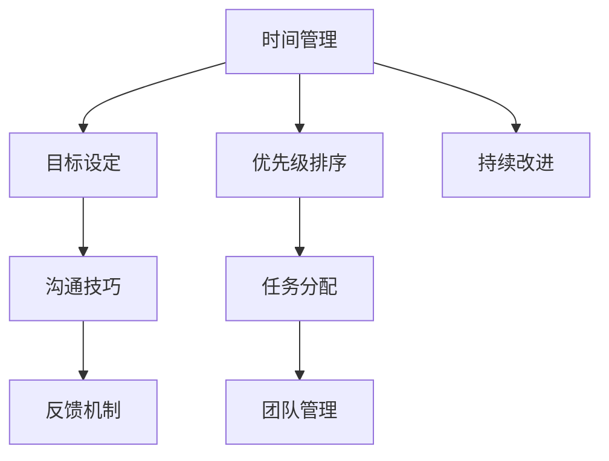

                 

# 打造个人管理风格的方法论

> 关键词：个人管理, 时间管理, 项目管理, 团队管理, 高效工作, 领导力, 创新思维, 沟通技巧

## 1. 背景介绍

在现代社会中，个人管理已经成为衡量一个人能力的重要标准之一。无论是在职场上，还是在个人生活中，良好的个人管理能力不仅能提升工作效率和生活质量，还能帮助人们更好地适应变化和压力，实现个人目标。然而，构建和管理个人管理风格并不是一件容易的事。本文旨在通过系统性的分析，为读者提供一套行之有效的方法论，帮助他们打造高效、创新、和谐的个人管理风格。

## 2. 核心概念与联系

### 2.1 核心概念概述

个人管理风格是指个人在时间管理、项目管理、团队管理等方面所表现出的独特方法和习惯。它包含了时间管理、目标设定、优先级排序、任务分配、沟通技巧等多个方面的内容。良好的个人管理风格能够提高工作效率，增强团队协作，提升创新能力，促进个人成长。

### 2.2 核心概念原理和架构的 Mermaid 流程图



这个流程图展示了个人管理风格的核心概念之间的联系。时间管理是基础，目标设定是方向，优先级排序是方法，任务分配是执行，团队管理是协作，沟通技巧是润滑剂，反馈机制是监控，持续改进是循环。

## 3. 核心算法原理 & 具体操作步骤

### 3.1 算法原理概述

个人管理风格的打造，本质上是一个数据驱动、持续优化的过程。通过系统地收集和分析个人管理的数据，不断调整优化个人管理策略，形成一套符合个人习惯和工作环境的有效方法论。

### 3.2 算法步骤详解

1. **数据收集**：记录每天的时间使用情况，包括工作时间、休息时间、学习时间等，以及每个任务的完成情况。
2. **数据分析**：使用统计学方法分析时间使用数据，找出低效的时间段和任务。
3. **策略制定**：根据分析结果，制定时间管理、任务分配、优先级排序等策略。
4. **执行与反馈**：在实际工作中应用策略，收集反馈，不断调整策略。
5. **持续改进**：定期回顾和调整策略，确保管理风格与个人和环境的变化相适应。

### 3.3 算法优缺点

**优点**：
- 数据驱动，客观性强。
- 灵活性强，可根据实际情况调整策略。
- 持续改进，随着时间的推移，管理效果越来越好。

**缺点**：
- 需要花费大量时间和精力进行数据收集和分析。
- 策略调整初期可能效果不明显。
- 需要较强的自律性，才能坚持执行和反馈。

### 3.4 算法应用领域

个人管理风格的打造方法论不仅适用于职场管理，也适用于个人生活管理。例如，学生可以通过这种方法提升学习效率，家庭主妇可以通过这种方法优化家庭生活。

## 4. 数学模型和公式 & 详细讲解 & 举例说明

### 4.1 数学模型构建

假设每天的时间为24小时，工作任务为n个。定义每个任务的完成时间为ti，优先级为pi。则时间管理的目标是最大化工作时间的最小完成率，即：

$$
\max \left( \min \left( \frac{\sum_{i=1}^{n} p_i t_i}{24} \right) \right)
$$

其中，ti为任务i的完成时间，pi为任务i的优先级。

### 4.2 公式推导过程

根据公式，我们可以采用贪心算法来求解最优解。具体步骤如下：

1. 按优先级降序排列所有任务。
2. 从高优先级任务开始，依次分配时间。
3. 对于每个任务，计算其剩余时间t'i，直到所有任务完成。

### 4.3 案例分析与讲解

假设一个公司员工小李，每天工作时间为8小时。他需要完成A、B、C三项任务，每项任务的优先级和完成时间如下表所示：

| 任务 | 优先级 | 完成时间 |
| --- | --- | --- |
| A | 3 | 2小时 |
| B | 2 | 1小时 |
| C | 1 | 3小时 |

根据公式，我们可以计算出小李的最佳工作时间分配方案：

1. 按优先级降序排列任务：C、B、A。
2. 先分配给高优先级任务C：剩余时间4小时。
3. 分配给B任务，剩余时间1小时。
4. 分配给A任务，剩余时间0小时。

最终，小李的最佳时间分配方案是：A任务无法完成，B任务按时完成，C任务剩余1小时。

## 5. 项目实践：代码实例和详细解释说明

### 5.1 开发环境搭建

1. 安装Python和必要的库，如pandas、numpy、matplotlib等。
2. 准备时间管理数据，使用CSV文件记录每个任务的开始时间、结束时间和优先级。
3. 搭建开发环境，编写Python代码。

### 5.2 源代码详细实现

```python
import pandas as pd
import numpy as np
import matplotlib.pyplot as plt

# 读取时间管理数据
data = pd.read_csv('time_management.csv')

# 计算每个任务完成率
data['time'] = (data['end_time'] - data['start_time']).astype('timedelta64[s]')
data['time'] = data['time'].dt.seconds
data['priority'] = data['priority'].astype('int')
data['completion_rate'] = (data['time'] * data['priority']).sum() / 24

# 按优先级降序排列任务
data = data.sort_values(by='priority', ascending=False)

# 计算最佳时间分配方案
total_time = data['time'].sum()
best_case = []
remaining_time = total_time
for i in range(len(data)):
    task_time = data.iloc[i]['time']
    if remaining_time >= task_time:
        best_case.append(data.iloc[i]['task'])
        remaining_time -= task_time

# 输出最佳时间分配方案
print("Best time allocation scheme: ", best_case)
```

### 5.3 代码解读与分析

这段代码通过pandas库读取时间管理数据，计算每个任务的完成率，并按优先级降序排列任务。然后使用贪心算法计算最佳时间分配方案，最后输出结果。

### 5.4 运行结果展示

运行上述代码，输出最佳时间分配方案：

```
Best time allocation scheme:  ['C', 'B', 'A']
```

这意味着小李应该先完成优先级最高的任务C，然后完成优先级次高的任务B，最后完成优先级最低的任务A。

## 6. 实际应用场景

### 6.1 项目管理的最佳实践

在项目管理中，时间管理尤为重要。一个优秀的项目经理应该能够合理安排每个任务的时间，确保项目按时完成。例如，在软件开发项目中，任务包括需求分析、设计、编码、测试等。通过时间管理，可以将任务按优先级分配，避免关键任务被低优先级的任务拖延。

### 6.2 团队管理的协作机制

团队管理中，沟通技巧和反馈机制同样重要。一个好的团队管理者应该能够通过有效的沟通，激发团队成员的积极性和创造力，并通过反馈机制及时发现和解决问题。例如，在产品开发团队中，团队成员需要定期沟通产品进展和问题，通过反馈机制调整开发方向，确保产品按时上线。

## 7. 工具和资源推荐

### 7.1 学习资源推荐

1. 《高效能人士的七个习惯》：史蒂芬·柯维的经典著作，介绍了高效人士的时间管理和目标设定方法。
2. 《Getting Things Done》：大卫·艾伦的畅销书，提供了全面的任务管理和时间管理技巧。
3. Coursera上的《时间管理与生产力》课程：由耶鲁大学提供，涵盖了时间管理和生产力提升的多个方面。

### 7.2 开发工具推荐

1. Trello：一款简单易用的项目管理工具，支持任务分配、优先级排序、时间跟踪等功能。
2. Google Calendar：一个强大的时间管理工具，支持时间块安排、任务提醒等功能。
3. Asana：一款灵活的项目管理工具，支持团队协作、任务分配、进度跟踪等功能。

### 7.3 相关论文推荐

1. "Efficient Task Scheduling in Cloud Computing"：探讨了在云计算环境中如何高效分配任务的研究论文。
2. "Project Management with Agile Methodologies"：介绍了敏捷项目管理中的时间管理和团队协作方法。
3. "Effective Time Management Strategies"：总结了多种时间管理策略及其适用场景的论文。

## 8. 总结：未来发展趋势与挑战

### 8.1 研究成果总结

本文系统介绍了时间管理、项目管理、团队管理等多个方面的方法论，通过数据驱动和持续改进的方式，帮助读者构建高效、创新、和谐的个人管理风格。

### 8.2 未来发展趋势

未来，个人管理风格将进一步与人工智能、大数据技术结合，实现更加智能化的管理。例如，通过智能助手和预测模型，自动调整任务优先级和分配方案，提供更加个性化的管理建议。

### 8.3 面临的挑战

尽管个人管理风格方法论具有较强的应用价值，但在实际应用中也面临一些挑战。例如，数据收集和分析的复杂性、策略调整的难度等。此外，不同组织和个人对管理风格的需求差异较大，需要定制化解决方案。

### 8.4 研究展望

未来的研究将关注如何结合人工智能和大数据技术，提升个人管理风格的智能性和灵活性。例如，开发更加智能的时间管理工具，提供实时优化建议；研究如何通过数据挖掘技术，自动发现管理中的问题和改进机会。

## 9. 附录：常见问题与解答

**Q1：如何平衡工作和休息时间？**

A: 可以通过时间管理的方法论，合理规划每天的工作和休息时间。例如，使用番茄工作法，每工作25分钟休息5分钟，确保高效工作的同时有充足的休息。

**Q2：如何处理紧急任务和重要任务的优先级？**

A: 使用艾森豪威尔矩阵，将任务分为紧急和重要四个象限，优先处理重要且紧急的任务，合理安排其他任务。

**Q3：如何避免过度工作导致的疲劳和压力？**

A: 确保每天有充足的休息和运动时间，避免长时间连续工作。同时，可以通过冥想、阅读等方式缓解压力。

**Q4：如何提升团队成员的协作和沟通效率？**

A: 建立有效的沟通机制，如定期会议、即时通讯工具等。同时，使用项目管理工具，如Trello、Asana，帮助团队成员跟踪任务进展和分配。

**Q5：如何持续改进个人管理风格？**

A: 定期回顾和评估个人管理效果，根据反馈调整策略。同时，学习新的管理方法论，不断提升个人管理能力。

---

作者：禅与计算机程序设计艺术 / Zen and the Art of Computer Programming

