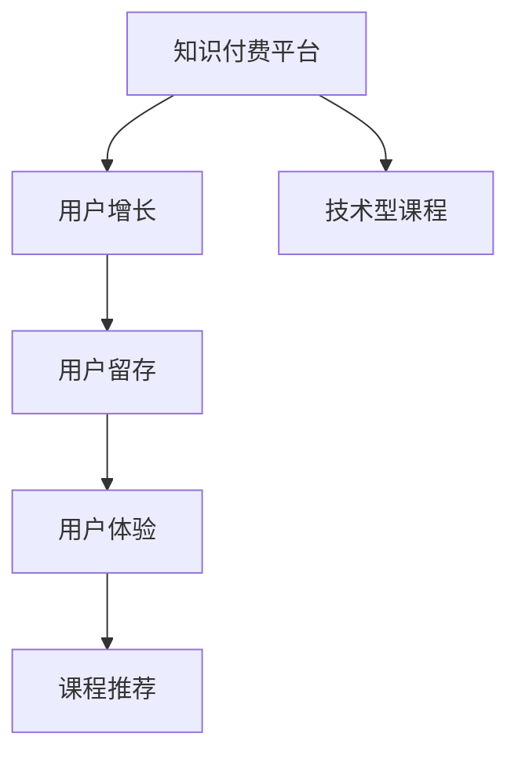

                 

# 打造技术型知识付费平台的用户运营

> 关键词：技术型知识付费平台,用户运营,用户增长,用户留存,用户体验,课程推荐

## 1. 背景介绍

随着互联网的普及，知识付费平台逐渐成为用户获取知识和技能的重要途径。尤其是技术型知识付费平台，如Coursera、Udacity、edX等，提供了海量的技术课程和实战项目，帮助用户提升技术能力，满足职业发展需求。但随着市场竞争的加剧，如何在用户获取和留存上实现突破，成为平台运营的关键问题。本文将从用户运营的视角，探讨如何打造技术型知识付费平台的用户运营体系，提升用户增长和留存率，提供优质的用户体验，并实现精准的课程推荐。

## 2. 核心概念与联系

### 2.1 核心概念概述

为更好地理解技术型知识付费平台的用户运营，本节将介绍几个密切相关的核心概念：

- 知识付费平台：基于互联网的在线教育平台，提供付费课程、实战项目、技术社区等资源，满足用户对技术技能的学习需求。
- 用户增长：指通过市场推广、渠道拓展等手段，吸引新用户注册、登录和购买课程，以扩大用户基数。
- 用户留存：指通过产品迭代、用户关怀等手段，提升用户在平台上的活跃度和忠诚度，避免用户流失。
- 用户体验：指用户在使用平台时的满意度、便利性、互动性等综合评价。
- 课程推荐：指通过算法和技术手段，为不同用户推荐合适的课程，提升课程的参与率和转化率。

这些核心概念之间的逻辑关系可以通过以下Mermaid流程图来展示：



这个流程图展示了几大核心概念之间的逻辑关系：

1. 知识付费平台是整个用户运营体系的基础，提供知识服务。
2. 用户增长旨在通过各种手段吸引更多用户，扩大平台影响力。
3. 用户留存是确保用户长期活跃的关键，需不断优化用户体验和产品功能。
4. 用户体验直接影响用户的满意度和留存率，是用户运营的重要指标。
5. 课程推荐通过个性化推荐算法，提升用户参与度和课程转化率。

## 3. 核心算法原理 & 具体操作步骤
### 3.1 算法原理概述

技术型知识付费平台的用户运营，主要围绕用户增长、用户留存和课程推荐三个方面展开。其核心算法原理主要包括以下几个方面：

- 用户增长：利用A/B测试、转化率优化、用户细分等方法，最大化提升新用户转化率和平台知名度。
- 用户留存：通过用户行为分析、情感分析、流失预警等技术，优化用户体验，提升用户粘性。
- 课程推荐：采用协同过滤、基于内容的推荐算法、深度学习等技术，实现精准的课程推荐，提升用户满意度。

### 3.2 算法步骤详解

基于上述核心算法原理，下面详细介绍技术型知识付费平台的用户运营具体操作步骤：

**Step 1: 数据收集与处理**

1. **用户行为数据收集**：通过埋点、日志等手段，收集用户在平台上的行为数据，如注册信息、课程学习进度、购买记录、评分反馈等。

2. **用户人口统计学信息**：收集用户的基本信息，如年龄、性别、职业、技术背景等，用于用户分群和个性化推荐。

3. **课程数据处理**：收集课程的详细信息，如课程名称、描述、教学视频、作业、讨论区等，用于内容分析和推荐。

4. **预处理与特征工程**：对收集的数据进行清洗、去重、归一化等预处理操作，同时进行特征提取和工程，如将用户行为数据转换为特征向量。

**Step 2: 用户增长优化**

1. **流量获取策略**：通过SEO、社交媒体推广、内容营销等方式，获取流量并引导用户注册和登录。

2. **A/B测试**：将不同的营销策略、产品设计进行A/B测试，找出最优方案，如注册流程简化、免费课程引流、新手指南等。

3. **用户细分**：基于用户行为和人口统计学信息，对用户进行细分，识别潜在的高价值用户和忠诚用户，实现精准营销。

4. **流失预警**：通过分析用户行为数据，建立流失预测模型，识别可能流失的用户，进行挽留干预，如发送提醒邮件、提供专属优惠等。

**Step 3: 用户留存优化**

1. **用户体验优化**：对平台界面、交互、内容呈现等进行优化，提升用户体验，如页面加载速度、课程UI设计、互动功能等。

2. **学习路径规划**：通过用户行为数据分析，设计科学的课程学习路径，帮助用户更好地掌握技术知识和实战技能。

3. **学习激励机制**：建立学习激励体系，如打卡奖励、学习积分、证书颁发等，提升用户的学习动力和参与度。

4. **社群互动**：搭建技术社区和讨论区，鼓励用户交流分享，提供技术支持，增强用户归属感和参与感。

**Step 4: 课程推荐优化**

1. **协同过滤算法**：基于用户历史行为数据，计算用户间的相似度，推荐与用户兴趣相关的课程。

2. **基于内容的推荐**：通过分析课程内容和用户行为，提取关键特征，进行内容相似度匹配，推荐相关课程。

3. **深度学习模型**：利用深度学习模型，如基于神经网络的推荐系统，实现更精准的用户画像和课程推荐，提升推荐效果。

4. **多臂老虎机算法**：在推荐系统中引入多臂老虎机算法，动态调整推荐策略，平衡探索和利用，提升推荐多样性和准确性。

### 3.3 算法优缺点

技术型知识付费平台的用户运营方法具有以下优点：

- **精准化运营**：通过用户行为分析和个性化推荐，实现精准的用户增长和课程推荐，提升用户满意度和平台黏性。
- **数据驱动**：依赖用户行为数据和模型算法，持续优化运营策略，确保用户运营效果的稳定和提升。
- **多样化推荐**：结合协同过滤、基于内容的推荐和深度学习等多种推荐算法，提供多层次、多维度的课程推荐服务。

同时，这些方法也存在一定的局限性：

- **数据隐私问题**：在数据收集和处理过程中，可能涉及用户隐私和数据安全问题，需要严格遵守数据保护法规。
- **算法复杂度**：用户增长和留存的优化方法较为复杂，需要综合考虑多方面的因素，开发和维护成本较高。
- **模型泛化能力**：推荐算法需要依赖大量数据进行训练，模型泛化能力可能受到新数据和新场景的限制。

## 4. 数学模型和公式 & 详细讲解 & 举例说明

### 4.1 数学模型构建

本节将使用数学语言对技术型知识付费平台的用户运营过程进行更加严格的刻画。

假设平台拥有用户集合 $U$，课程集合 $C$，每个用户 $u \in U$ 对每个课程 $c \in C$ 有一个评分 $r_{uc}$，即 $r_{uc} \in [1, 5]$。

定义用户行为序列 $\mathcal{B}_u = \{c_1, c_2, ..., c_t\}$，表示用户 $u$ 访问课程的时间顺序。

### 4.2 公式推导过程

**协同过滤推荐算法**：

协同过滤算法基于用户和课程之间的相似度计算，进行推荐。设用户 $u$ 和用户 $v$ 的相似度为 $s_{uv}$，计算方式为：

$$
s_{uv} = \frac{\sum_{c \in C} r_{uc}r_{vc}}{\sqrt{\sum_{c \in C} r_{uc}^2} \sqrt{\sum_{c \in C} r_{vc}^2}}
$$

推荐给用户 $u$ 的课程 $c$ 的评分预测值为：

$$
\hat{r}_{uc} = \frac{\sum_{v \in U} s_{uv}r_{vc}}{\sum_{v \in U} s_{uv}}
$$

**基于内容的推荐算法**：

基于内容的推荐算法基于课程和用户行为之间的特征匹配，进行推荐。设课程 $c$ 和用户行为 $b$ 之间的相似度为 $s_{cb}$，计算方式为：

$$
s_{cb} = \frac{\sum_{f} a_{cf}d_{bf}}{\sqrt{\sum_{f} a_{cf}^2}\sqrt{\sum_{f} d_{bf}^2}}
$$

其中 $a_{cf}$ 表示课程 $c$ 中包含特征 $f$ 的权重，$d_{bf}$ 表示用户行为 $b$ 中包含特征 $f$ 的权重。

课程 $c$ 的评分预测值为：

$$
\hat{r}_{bc} = \sum_{f} a_{cf}d_{bf}
$$

### 4.3 案例分析与讲解

**案例分析**：

以某技术型知识付费平台为例，假设平台有10万名用户和5000门课程。

**协同过滤推荐**：
- 对每个用户计算与其他用户的相似度，找出与其相似度最高的10名用户。
- 计算这些用户评分过的课程，推荐给目标用户。
- 利用反向传播算法，不断优化相似度计算方式和推荐策略，提升推荐效果。

**基于内容的推荐**：
- 提取每门课程的关键特征，如课程名称、描述、技术栈等。
- 提取每个用户的关键行为特征，如访问时间、学习时长、评分等。
- 计算课程和用户行为之间的相似度，推荐与用户兴趣相关的课程。
- 利用深度学习模型，如神经网络，学习特征之间的复杂关系，提升推荐精度。

## 5. 项目实践：代码实例和详细解释说明
### 5.1 开发环境搭建

在进行用户运营实践前，我们需要准备好开发环境。以下是使用Python进行Flask开发的开发环境配置流程：

1. 安装Anaconda：从官网下载并安装Anaconda，用于创建独立的Python环境。

2. 创建并激活虚拟环境：
```bash
conda create -n flask-env python=3.8 
conda activate flask-env
```

3. 安装Flask：
```bash
pip install Flask
```

4. 安装相关依赖：
```bash
pip install pandas numpy scikit-learn scikit-optimize tqdm 
```

5. 运行测试代码：
```bash
python main.py
```

### 5.2 源代码详细实现

下面以协同过滤算法为例，给出使用Python和Flask进行协同过滤推荐系统的实现。

```python
from flask import Flask, request, jsonify
import pandas as pd
import numpy as np
from scipy.sparse import csr_matrix
from sklearn.metrics.pairwise import cosine_similarity

app = Flask(__name__)

@app.route('/recommend', methods=['POST'])
def recommend():
    user_id = request.json['user_id']
    num_recommendations = request.json['num_recommendations']
    
    # 加载用户行为数据
    data = pd.read_csv('user_behavior.csv')
    user_rated_courses = data[data['user_id'] == user_id]['course_id'].tolist()
    
    # 计算相似度矩阵
    course_rated_by_users = data[data['course_id'].isin(user_rated_courses)]['user_id'].tolist()
    user_rated_by_courses = data[data['user_id'].isin(course_rated_by_users)]['course_id'].tolist()
    course_matrix = csr_matrix([1 for _ in user_rated_by_courses], shape=(len(course_rated_by_courses), len(user_rated_by_courses)))
    user_matrix = csr_matrix([1 for _ in course_rated_by_users], shape=(len(course_rated_by_users), len(course_rated_by_users)))
    similarity_matrix = cosine_similarity(user_matrix, course_matrix).T
    
    # 计算推荐课程
    recommended_courses = [course for course in data['course_id'].tolist() if course not in user_rated_courses]
    scores = [sum(similarity_matrix[user_rated_courses.index(user_id)] * similarity_matrix[user_rated_courses.index(user_id)].T) for user_rated_courses in recommended_courses]
    recommended_scores = pd.Series(scores, index=recommended_courses).argsort()[::-1].tolist()
    recommended_courses = recommended_courses[recommended_scores]
    
    # 返回推荐结果
    return jsonify({'recommendations': recommended_courses[:num_recommendations]})

if __name__ == '__main__':
    app.run(debug=True)
```

### 5.3 代码解读与分析

**Flask框架**：
- Flask是一个轻量级的Python Web框架，适合快速开发Web应用。

**协同过滤算法**：
- 通过读取用户行为数据，计算用户对课程的评分，构建用户-课程的评分矩阵。
- 计算用户-课程矩阵的余弦相似度，得到用户对课程的相似度矩阵。
- 根据用户对课程的评分和相似度矩阵，计算推荐分数，选择高分数的课程作为推荐结果。

### 5.4 运行结果展示

运行上述代码，可以在本地启动Web服务，通过API接口获取推荐结果。具体步骤如下：

1. 运行`python main.py`启动Web服务。

2. 访问`http://localhost:5000/recommend`，以POST方式发送请求，包括`user_id`和`num_recommendations`。

3. 服务返回JSON格式的推荐结果，包含推荐课程的ID。

## 6. 实际应用场景
### 6.1 智慧教育

智慧教育领域是知识付费平台的重要应用场景之一。通过个性化推荐算法，智慧教育平台可以根据学生的学习行为和兴趣，推荐适合的课程和资源，帮助学生提升学习效果，实现个性化学习。

在实践中，智慧教育平台可以收集学生的学习记录、作业成绩、讨论参与度等数据，构建用户画像，进行个性化推荐。同时，通过学习路径规划和智能答疑系统，提升学生的学习体验，促进教育公平和质量提升。

### 6.2 企业培训

企业培训平台也是技术型知识付费平台的重要应用领域。通过用户运营，企业培训平台可以提升员工的技术技能，提升企业的竞争力。

在实践中，企业培训平台可以收集员工的学习行为数据、课程反馈、学习进度等，构建员工画像，进行个性化推荐。同时，通过课程内容优化和学习激励机制，提升员工的学习动力和参与度，帮助企业实现人才的持续培养和提升。

### 6.3 技术社区

技术社区是知识付费平台的重要组成部分，旨在构建技术交流和知识分享的平台，促进技术的传播和创新。

在实践中，技术社区可以收集用户的学习行为数据、讨论互动数据等，构建用户画像，进行个性化推荐。同时，通过专家讲座、技术沙龙、在线访谈等活动，提升社区的活跃度和用户参与度，构建技术交流的良性生态。

### 6.4 未来应用展望

随着知识付费平台的发展，用户运营将更加智能化、精细化。未来，知识付费平台将结合更多先进技术，如大数据、人工智能、区块链等，提供更加个性化的服务。

- **大数据分析**：通过分析海量用户数据，构建精细化的用户画像，进行精准的用户增长和课程推荐。
- **人工智能**：结合自然语言处理、计算机视觉等技术，提升推荐系统的准确性和多样性。
- **区块链技术**：利用区块链技术，保障数据的透明性和安全性，提升用户信任和平台可信度。

## 7. 工具和资源推荐
### 7.1 学习资源推荐

为了帮助开发者系统掌握知识付费平台的用户运营的理论基础和实践技巧，这里推荐一些优质的学习资源：

1. 《用户增长实战》系列博文：由用户增长专家撰写，涵盖用户增长的各个方面，包括用户增长策略、A/B测试、用户细分等。

2. 《用户体验设计》课程：斯坦福大学开设的UX设计课程，涵盖用户研究、设计思维、原型设计等，帮助开发者提升用户运营能力。

3. 《推荐系统实战》书籍：全面介绍了推荐系统算法和工程实践，涵盖协同过滤、基于内容的推荐、深度学习等多种推荐算法。

4. Coursera和edX等在线教育平台：提供丰富的用户运营和推荐系统课程，涵盖各种前沿技术和实践案例。

5. Udacity和Udemy等在线教育平台：提供用户增长和个性化推荐系统的实战项目，帮助开发者通过实践提升技能。

通过对这些资源的学习实践，相信你一定能够快速掌握知识付费平台用户运营的精髓，并用于解决实际的运营问题。

### 7.2 开发工具推荐

高效的开发离不开优秀的工具支持。以下是几款用于知识付费平台用户运营开发的常用工具：

1. Flask：轻量级的Python Web框架，适合快速开发Web应用。支持RESTful API，方便与前端系统集成。

2. Python：灵活强大的编程语言，支持丰富的第三方库和框架，适合数据处理和算法实现。

3. Scikit-learn：强大的机器学习库，支持各种推荐算法和数据预处理操作。

4. Pandas：强大的数据处理库，支持数据清洗、归一化和特征工程等。

5. SciPy：科学计算库，支持各种数学计算和优化算法。

6. TensorFlow和PyTorch：流行的深度学习框架，支持各种深度学习算法和模型优化。

合理利用这些工具，可以显著提升知识付费平台用户运营的开发效率，加快创新迭代的步伐。

### 7.3 相关论文推荐

用户运营和推荐系统领域的研究源于学界的持续研究。以下是几篇奠基性的相关论文，推荐阅读：

1. "User Growth: The Science of Personalization"：讲解了用户增长的核心原则和方法，帮助平台提升用户增长和留存率。

2. "Recommender Systems: The Textbook"：全面介绍了推荐系统的算法和工程实践，涵盖协同过滤、基于内容的推荐、深度学习等多种推荐算法。

3. "Advances in Knowledge-Tracing"：讲解了知识追踪方法，帮助平台提升用户学习效果和课程推荐精度。

4. "Collaborative Filtering for Implicit Feedback Datasets"：讲解了协同过滤算法在推荐系统中的应用，介绍了各种协同过滤方法的优势和劣势。

5. "Deep Learning for Recommender Systems: A Survey and New Perspectives"：全面综述了深度学习在推荐系统中的应用，介绍了各种深度学习模型的优缺点和适用场景。

这些论文代表了大用户运营和推荐系统的发展脉络。通过学习这些前沿成果，可以帮助研究者把握学科前进方向，激发更多的创新灵感。

## 8. 总结：未来发展趋势与挑战
### 8.1 总结

本文对技术型知识付费平台的用户运营进行了全面系统的介绍。首先阐述了用户运营在平台发展中的关键作用，明确了用户运营在用户增长、用户留存和课程推荐等方面的重要价值。其次，从算法原理到具体实现，详细讲解了用户运营的具体操作步骤和方法，并通过案例分析和代码实现，展示了用户运营在实际应用中的具体实践。

通过本文的系统梳理，可以看到，技术型知识付费平台的用户运营是一个系统性工程，涉及用户增长、用户留存、课程推荐等多个环节，依赖多种算法和技术的综合应用。用户运营的成功与否，直接关系到平台的健康发展和用户体验的提升。

### 8.2 未来发展趋势

展望未来，技术型知识付费平台的用户运营将呈现以下几个发展趋势：

1. **个性化推荐**：随着深度学习和大数据分析技术的进步，个性化推荐将更加精准和多样，提升用户满意度和平台黏性。

2. **实时推荐**：利用流数据处理技术，实现实时推荐系统，满足用户即时需求，提升用户体验。

3. **多模态推荐**：结合文本、图像、音频等多种数据源，提升推荐系统的多样性和准确性。

4. **社交推荐**：利用社交网络关系，实现用户间的推荐扩散，提升推荐效果和用户互动。

5. **智能营销**：通过智能营销系统，实现精准的用户增长和转化，提升平台的市场竞争力。

这些趋势凸显了用户运营技术的发展方向，预示着未来知识付费平台的用户运营将更加智能化、精细化。

### 8.3 面临的挑战

尽管技术型知识付费平台的用户运营已经取得了显著成效，但在迈向更加智能化、普适化应用的过程中，它仍面临诸多挑战：

1. **数据质量问题**：用户行为数据的质量直接影响推荐系统的准确性，数据缺失、噪声等问题需要持续优化。

2. **推荐系统算法复杂度**：推荐算法的设计和优化复杂度较高，需要综合考虑多方面的因素，开发和维护成本较高。

3. **用户隐私保护**：在数据收集和处理过程中，可能涉及用户隐私和数据安全问题，需要严格遵守数据保护法规。

4. **用户体验**：推荐系统的算法和界面设计需要平衡推荐效果和用户体验，避免过度的推荐干扰和用户反感。

5. **技术演进速度**：用户运营技术和算法需要持续更新和优化，以适应新数据和新场景的变化，技术演进速度较快。

### 8.4 研究展望

面对用户运营面临的这些挑战，未来的研究需要在以下几个方面寻求新的突破：

1. **数据治理**：建立数据质量治理机制，确保数据完整性、准确性和安全性。

2. **算法优化**：探索更高效、更简单的推荐算法，降低算法复杂度和开发成本。

3. **隐私保护**：研究数据匿名化、差分隐私等技术，保护用户隐私和数据安全。

4. **用户体验优化**：优化推荐系统的界面设计和推荐策略，提升用户体验和推荐效果。

5. **技术演进**：跟踪和应用最新的技术进展，如深度学习、大数据分析、区块链等，提升推荐系统的效果和性能。

这些研究方向的探索，必将引领用户运营技术迈向更高的台阶，为知识付费平台的发展提供更坚实的基础。面向未来，用户运营需要不断探索和创新，才能在激烈的竞争中保持领先地位，实现可持续的发展。

## 9. 附录：常见问题与解答

**Q1：知识付费平台的用户增长和留存，关键因素有哪些？**

A: 知识付费平台的用户增长和留存关键因素包括：

1. **产品质量**：课程内容质量、师资力量、学习体验等直接影响用户满意度。

2. **营销策略**：通过SEO、社交媒体推广、内容营销等方式获取流量和用户。

3. **用户界面**：平台界面设计、交互体验等直接影响用户的使用感受和留存率。

4. **推荐系统**：精准的课程推荐和个性化的学习路径设计，提升用户的学习效果和平台黏性。

5. **用户互动**：通过社区讨论、问答互动等方式，增强用户间的交流和参与感，提升用户留存率。

6. **激励机制**：建立学习激励体系，如打卡奖励、学习积分、证书颁发等，提升用户的学习动力和参与度。

**Q2：如何提高知识付费平台的推荐系统效果？**

A: 提高知识付费平台的推荐系统效果，可以采取以下措施：

1. **数据质量提升**：通过数据清洗、去重、归一化等预处理操作，提升数据质量。

2. **特征工程优化**：进行详细的特征工程，提取关键特征，如用户行为、课程特征、用户画像等。

3. **算法优化**：选择合适的推荐算法，如协同过滤、基于内容的推荐、深度学习等，优化算法参数和模型结构。

4. **模型融合**：结合多种推荐算法，如协同过滤和基于内容的推荐，提升推荐效果的多样性和准确性。

5. **实时更新**：利用流数据处理技术，实现实时推荐系统，提升推荐的时效性和用户体验。

6. **用户反馈**：收集用户反馈，优化推荐算法和策略，提升用户满意度和平台黏性。

**Q3：知识付费平台的课程推荐系统如何实现？**

A: 知识付费平台的课程推荐系统可以通过以下步骤实现：

1. **数据收集**：收集用户行为数据、课程数据、用户人口统计学信息等。

2. **特征提取**：对收集的数据进行清洗、去重、归一化等预处理操作，同时进行特征提取和工程，如将用户行为数据转换为特征向量。

3. **模型训练**：选择合适的推荐算法，如协同过滤、基于内容的推荐、深度学习等，进行模型训练和参数优化。

4. **实时推荐**：利用流数据处理技术，实现实时推荐系统，提升推荐的时效性和用户体验。

5. **效果评估**：通过A/B测试、用户反馈等手段，评估推荐系统的效果，不断优化算法和策略。

**Q4：知识付费平台的个性化推荐算法有哪些？**

A: 知识付费平台的个性化推荐算法主要包括以下几种：

1. **协同过滤算法**：基于用户行为和物品评分，计算用户和物品之间的相似度，进行推荐。

2. **基于内容的推荐**：通过分析课程和用户行为之间的特征匹配，进行推荐。

3. **深度学习算法**：利用深度神经网络，学习特征之间的复杂关系，进行推荐。

4. **多臂老虎机算法**：在推荐系统中引入多臂老虎机算法，动态调整推荐策略，平衡探索和利用。

5. **混合推荐算法**：结合多种推荐算法，提升推荐效果的多样性和准确性。

这些算法各有所长，可以根据具体场景选择合适的推荐算法。

**Q5：知识付费平台的用户运营需要关注哪些指标？**

A: 知识付费平台的用户运营需要关注以下指标：

1. **用户增长**：新用户注册数、新用户激活率、用户留存率等，反映平台的市场推广效果和用户吸引力。

2. **用户留存**：日活跃用户数、月活跃用户数、用户流失率等，反映用户的持续使用情况和平台黏性。

3. **用户行为**：课程学习进度、课程评分、课程完成率等，反映用户的学习效果和满意度。

4. **课程推荐**：推荐课程的点击率、参与率、转化率等，反映推荐系统的效果和用户体验。

5. **用户反馈**：用户评分、用户评论、用户建议等，反映用户对平台的满意度和建议。

通过关注这些指标，可以全面了解平台的用户运营情况，不断优化运营策略，提升用户体验和平台竞争力。

---

作者：禅与计算机程序设计艺术 / Zen and the Art of Computer Programming

