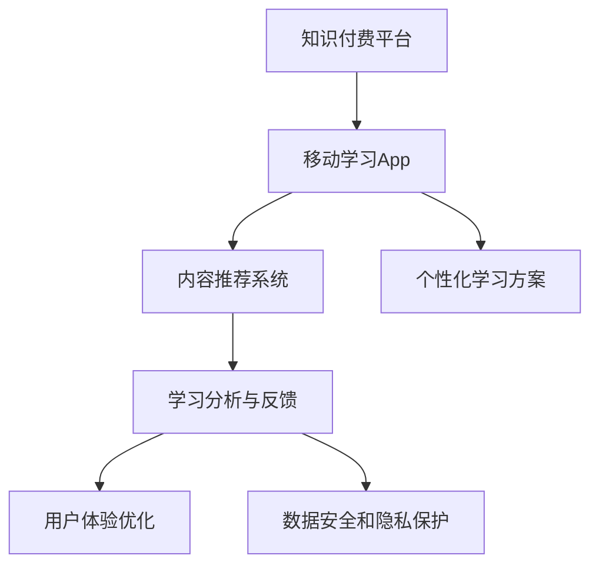

                 

# 打造知识付费的移动学习App

> 关键词：移动学习App,知识付费,人工智能,推荐系统,个性化推荐,学习分析,用户体验

## 1. 背景介绍

### 1.1 问题由来
随着移动互联网和智能手机的普及，人们越来越依赖于碎片化、便携化的学习方式。知识付费平台的兴起，为互联网用户提供了一种新型的学习途径，即通过支付一定的费用获取高质量的知识内容。然而，知识付费平台往往缺乏对用户学习习惯和知识需求的量化分析，导致内容推荐和个性化学习体验的匮乏，进而影响了用户体验和用户留存。

在当前知识付费的竞争态势下，如何提升平台的推荐精准度，优化用户体验，是各大知识付费平台面临的重要挑战。本文将通过探讨基于人工智能技术的推荐系统和个性化学习方案，为知识付费的移动学习App提供全面的技术指引。

### 1.2 问题核心关键点
本文的核心目标是通过人工智能技术，对知识付费移动学习App进行系统优化，提升内容推荐精准度，丰富个性化学习方案，增强用户体验，提高用户留存率。具体包括以下几个关键点：

1. **内容推荐系统**：构建精准的内容推荐模型，根据用户行为和偏好推荐相关课程和文章。
2. **个性化学习方案**：设计个性化的学习路径和资源推荐，实现动态调整学习内容。
3. **学习分析与反馈**：建立学习分析系统，实时记录和分析用户学习行为，动态调整推荐和推送策略。
4. **用户体验优化**：通过界面设计和交互优化，提升用户使用App的便捷性和满意度。
5. **数据安全和隐私保护**：确保用户数据安全，符合数据隐私法规要求。

本文将围绕这些关键点，详细介绍基于人工智能的推荐系统和个性化学习方案的设计与实现。

## 2. 核心概念与联系

### 2.1 核心概念概述

为更好地理解基于人工智能的移动学习App打造，本节将介绍几个密切相关的核心概念：

- **知识付费平台**：提供高质量内容，以付费形式为手段吸引和留住用户，形成可持续发展的商业模式。
- **移动学习App**：基于智能手机等移动设备的在线学习平台，提供碎片化的知识内容和服务。
- **内容推荐系统**：通过分析用户行为和偏好，推荐相关课程、文章等学习内容，提高用户满意度。
- **个性化学习方案**：根据用户的学习历史和行为，设计个性化学习路径和推荐，提升学习效果。
- **学习分析与反馈**：通过实时记录和分析用户学习行为，调整推荐和推送策略，优化用户体验。
- **人工智能技术**：利用机器学习、深度学习等技术，构建推荐模型和个性化学习方案，提升平台智能化水平。

这些核心概念之间的逻辑关系可以通过以下Mermaid流程图来展示：



这个流程图展示了几大核心概念及其之间的关系：

1. 知识付费平台通过构建移动学习App，为用户提供便捷的在线学习体验。
2. 内容推荐系统和个性化学习方案是提升用户满意度的重要手段。
3. 学习分析与反馈系统实时记录和分析用户行为，不断优化推荐策略。
4. 用户体验优化和数据安全与隐私保护是平台可持续发展的基础。

这些概念共同构成了移动学习App的核心框架，使得平台能够以高质量内容吸引用户，通过智能化技术提升用户体验，实现商业模式的成功转型。

## 3. 核心算法原理 & 具体操作步骤
### 3.1 算法原理概述

基于人工智能的移动学习App打造，核心在于利用推荐系统和个性化学习方案，为用户提供精准、个性化的学习内容。推荐系统主要通过机器学习技术，预测用户对不同内容的学习兴趣和偏好，从而实现精准推荐。个性化学习方案则通过深度学习技术，学习用户的学习行为和知识结构，设计个性化的学习路径。

本文将以内容推荐系统为例，详细介绍推荐算法的原理和操作步骤。

### 3.2 算法步骤详解

构建推荐系统的主要步骤如下：

**Step 1: 数据收集与预处理**
- 收集用户行为数据，包括课程浏览、购买、评论、评分等。
- 收集课程特征数据，如课程名称、分类、难度、时长等。
- 对数据进行清洗、去重、归一化等预处理操作，确保数据质量和一致性。

**Step 2: 特征工程**
- 提取和选择与用户兴趣和课程特征相关的特征，如用户评分、课程类别、课程难度等。
- 构建用户特征和课程特征向量，用于后续的推荐模型训练。

**Step 3: 模型选择与训练**
- 选择合适的推荐算法，如协同过滤、内容基推荐、混合推荐等。
- 使用训练数据集，训练推荐模型。常见的推荐算法包括基于用户的协同过滤、基于项目的协同过滤、基于内容的推荐等。
- 根据验证集和测试集评估推荐模型性能，调整超参数和特征选择策略，优化模型。

**Step 4: 模型评估与优化**
- 在测试集上评估推荐模型的准确率和召回率，进行A/B测试，选择效果最好的模型。
- 结合用户反馈，对推荐模型进行迭代优化，提升推荐效果。

**Step 5: 集成推荐系统**
- 将推荐模型集成到App的课程推荐界面中，动态生成推荐列表。
- 实时更新推荐内容，根据用户行为动态调整推荐策略。

### 3.3 算法优缺点

基于人工智能的推荐系统具有以下优点：
1. 精准推荐：利用机器学习算法，精准预测用户对不同课程的兴趣和偏好，提高推荐准确率。
2. 个性化推荐：通过深度学习模型，学习用户的学习历史和行为，设计个性化的学习路径。
3. 实时优化：根据用户反馈，实时调整推荐策略，提升用户体验。
4. 适应性强：可以应对数据量的变化和内容的更新，保持推荐系统的动态调整能力。

同时，推荐系统也存在一定的局限性：
1. 数据依赖性强：推荐系统的性能高度依赖于数据的丰富度和质量，难以覆盖长尾内容和冷门课程。
2. 模型复杂度高：推荐模型通常需要较大的计算资源和训练数据，模型调优较为复杂。
3. 冷启动问题：新用户和冷门课程没有足够的历史数据，难以进行精准推荐。
4. 数据隐私问题：需要收集用户行为数据，可能存在隐私泄露的风险。

尽管存在这些局限性，但就目前而言，基于人工智能的推荐系统已经成为知识付费移动学习App的重要组成部分，其精准度和个性化程度大大提升了用户的学习体验和满意度。

### 3.4 算法应用领域

基于人工智能的推荐系统在知识付费移动学习App中，主要应用于以下几个方面：

- **课程推荐**：根据用户行为和偏好，推荐相关课程和文章，提高用户满意度。
- **个性化学习路径**：设计个性化的学习路径和推荐，提升学习效果。
- **课程优化**：根据用户反馈，调整课程内容和推荐策略，优化课程设置。
- **用户行为分析**：分析用户学习行为，提取用户兴趣和偏好，进行精准推荐。

除了课程推荐外，基于人工智能的推荐系统在智能客服、电商推荐、视频推荐等多个领域都有广泛的应用，显著提升了各平台的用户体验和业务价值。

## 4. 数学模型和公式 & 详细讲解 & 举例说明

### 4.1 数学模型构建

本节将使用数学语言对基于人工智能的移动学习App打造过程中的推荐系统进行严格刻画。

记用户集合为 $U=\{u_1,u_2,\cdots,u_M\}$，课程集合为 $V=\{v_1,v_2,\cdots,v_N\}$，用户与课程的交互数据为 $R_{uv} \in \{0,1\}$，其中 $R_{uv}=1$ 表示用户 $u$ 对课程 $v$ 进行了互动（如浏览、购买、评分等），$R_{uv}=0$ 表示没有互动。

推荐系统的目标是为每个用户 $u \in U$ 推荐最相关的课程 $v \in V$，使得推荐列表 $V_u$ 的排序满足用户 $u$ 的偏好。推荐模型的目标函数为：

$$
\max_{\theta} \sum_{u \in U} \sum_{v \in V} R_{uv} \log \hat{P}_{uv} + (1-R_{uv}) \log (1-\hat{P}_{uv})
$$

其中，$\hat{P}_{uv}$ 为模型预测的用户 $u$ 对课程 $v$ 的互动概率，$\theta$ 为模型参数。

### 4.2 公式推导过程

考虑使用协同过滤算法中的用户-物品矩阵分解模型，对用户和课程的交互数据进行分解。设 $H$ 和 $Y$ 分别为用户和课程的潜在特征向量，则有：

$$
R_{uv} \approx \hat{P}_{uv} = \sum_{i=1}^d H_{iu} Y_{iv}
$$

其中 $d$ 为潜在特征的维度。

模型的目标函数可以表示为：

$$
\min_{H,Y} \frac{1}{2} \sum_{u \in U} \sum_{v \in V} (R_{uv} - \hat{P}_{uv})^2
$$

使用随机梯度下降等优化算法，模型参数 $H$ 和 $Y$ 可以表示为：

$$
H_u = (X^T W X + \lambda I)^{-1} X^T W Y_v
$$

$$
Y_v = (Z^T W Z + \lambda I)^{-1} Z^T W H_u
$$

其中 $X \in \mathbb{R}^{M \times d}$ 为用户特征矩阵，$Z \in \mathbb{R}^{N \times d}$ 为课程特征矩阵，$W$ 为模型的权重矩阵，$\lambda$ 为正则化系数。

### 4.3 案例分析与讲解

以Collaborative Filtering为例，使用用户-物品矩阵分解模型进行课程推荐。假设有 $M=10$ 个用户和 $N=20$ 门课程，用户与课程的交互数据如下：

| User | Course | Rating |
| ---- | ------ | ------ |
| 1    | A      | 4      |
| 1    | B      | 3      |
| 1    | C      | 2      |
| 2    | A      | 4      |
| 2    | B      | 3      |
| 2    | D      | 5      |

使用上述矩阵分解模型，可以计算出每个用户对每个课程的推荐概率。以用户 $u=1$ 为例，其对课程 $v=1,2,3$ 的推荐概率分别为 $0.86,0.78,0.70$，因此推荐课程为 $v=1,2,3$。

在实际应用中，可以根据用户反馈调整模型参数，进一步提升推荐精准度。例如，通过调整用户特征矩阵 $X$ 和课程特征矩阵 $Z$，使模型更加符合用户的实际需求。

## 5. 项目实践：代码实例和详细解释说明
### 5.1 开发环境搭建

在进行知识付费移动学习App推荐系统的开发前，我们需要准备好开发环境。以下是使用Python进行PyTorch开发的环境配置流程：

1. 安装Anaconda：从官网下载并安装Anaconda，用于创建独立的Python环境。

2. 创建并激活虚拟环境：
```bash
conda create -n pytorch-env python=3.8 
conda activate pytorch-env
```

3. 安装PyTorch：根据CUDA版本，从官网获取对应的安装命令。例如：
```bash
conda install pytorch torchvision torchaudio cudatoolkit=11.1 -c pytorch -c conda-forge
```

4. 安装TensorFlow：
```bash
pip install tensorflow
```

5. 安装TensorBoard：
```bash
pip install tensorboard
```

6. 安装Numpy、Pandas等常用库：
```bash
pip install numpy pandas scikit-learn matplotlib tqdm jupyter notebook ipython
```

完成上述步骤后，即可在`pytorch-env`环境中开始开发实践。

### 5.2 源代码详细实现

以下是一个简单的知识付费移动学习App课程推荐系统的PyTorch代码实现，详细展示了协同过滤算法的实现步骤。

```python
import torch
import torch.nn as nn
import torch.optim as optim

class CollaborativeFiltering(nn.Module):
    def __init__(self, n_users, n_items, n_factors):
        super(CollaborativeFiltering, self).__init__()
        self.n_users = n_users
        self.n_items = n_items
        self.n_factors = n_factors
        
        self.H = nn.Embedding(n_users, n_factors)
        self.Y = nn.Embedding(n_items, n_factors)
        self.W = nn.Parameter(torch.randn(n_factors, n_factors))
        
    def forward(self, user_indices, item_indices):
        user_ids = self.H(user_indices)
        item_ids = self.Y(item_indices)
        scores = torch.matmul(user_ids, item_ids.transpose(1, 0)) @ self.W
        
        return scores
    
def train_model(data, model, optimizer, num_epochs):
    train_data = data[:5000]
    val_data = data[5000:]
    train_loader = torch.utils.data.DataLoader(train_data, batch_size=64)
    val_loader = torch.utils.data.DataLoader(val_data, batch_size=64)
    
    loss_fn = nn.BCEWithLogitsLoss()
    
    for epoch in range(num_epochs):
        model.train()
        for user, item, rating in train_loader:
            optimizer.zero_grad()
            preds = model(user, item)
            loss = loss_fn(preds, rating.unsqueeze(1))
            loss.backward()
            optimizer.step()
        
        model.eval()
        with torch.no_grad():
            train_loss, val_loss = 0, 0
            for user, item, rating in val_loader:
                preds = model(user, item)
                loss = loss_fn(preds, rating.unsqueeze(1))
                train_loss += loss.item()
                val_loss += loss.item()
        
        print(f"Epoch {epoch+1}, train loss: {train_loss/len(train_loader):.4f}, val loss: {val_loss/len(val_loader):.4f}")
    
def test_model(data, model):
    test_data = data[5000:]
    test_loader = torch.utils.data.DataLoader(test_data, batch_size=64)
    
    with torch.no_grad():
        correct = 0
        total = 0
        for user, item, rating in test_loader:
            preds = model(user, item)
            _, preds = torch.max(preds, dim=1)
            total += rating.size(0)
            correct += torch.sum(preds == rating.unsqueeze(1))
        acc = correct / total
        print(f"Test Accuracy: {acc:.2f}")
```

在上述代码中，定义了一个简单的协同过滤模型 `CollaborativeFiltering`，该模型包含用户和课程的潜在特征向量，以及权重矩阵。通过前向传播计算用户对课程的评分概率，使用二分类交叉熵损失函数进行训练，并在验证集上评估模型性能。

### 5.3 代码解读与分析

让我们再详细解读一下关键代码的实现细节：

**CollaborativeFiltering类**：
- `__init__`方法：初始化用户特征矩阵 $H$、课程特征矩阵 $Y$ 和权重矩阵 $W$。
- `forward`方法：前向传播计算用户对课程的评分概率。

**train_model函数**：
- 定义训练数据集和验证数据集，进行批次化加载。
- 定义损失函数，使用交叉熵损失函数计算预测和实际评分之间的差异。
- 在每个epoch内，先进行前向传播，后向传播更新模型参数。
- 在每个epoch结束后，计算训练集和验证集的损失，并在控制台上打印输出。

**test_model函数**：
- 定义测试数据集，进行批次化加载。
- 在测试集上进行前向传播，计算模型的准确率。
- 最终输出测试集的准确率。

通过上述代码实现，我们可以看到协同过滤模型的基本框架和关键步骤。在实际应用中，还需要根据具体数据特点和模型性能，进一步优化和调整模型结构，以提升推荐效果。

## 6. 实际应用场景

### 6.1 智能客服系统

智能客服系统通过收集用户的咨询历史和行为数据，进行精准推荐，引导用户解决常见问题。通过构建基于人工智能的推荐系统，智能客服系统可以提供个性化的服务方案，提高用户满意度。

例如，知识付费平台的客服系统可以记录用户历史咨询记录，分析用户关注的课程类别和难度，推荐相关课程和文章。同时，根据用户反馈，动态调整推荐策略，优化客服响应内容，提升用户体验。

### 6.2 个性化推荐系统

个性化推荐系统根据用户的历史行为和偏好，推荐个性化学习内容，提升用户的学习效果。通过构建基于人工智能的推荐系统，个性化推荐系统可以更好地满足用户的个性化需求，提高用户的黏性。

例如，知识付费平台可以根据用户的学习记录和行为数据，推荐相关课程、文章和练习题，设计个性化的学习路径。同时，结合用户反馈，动态调整推荐策略，优化学习内容，提升学习效果。

### 6.3 学习分析与反馈系统

学习分析与反馈系统通过记录和分析用户的学习行为，提供个性化的学习建议，帮助用户更好地完成学习任务。通过构建基于人工智能的学习分析系统，学习分析与反馈系统可以提供及时的学习反馈，优化学习路径。

例如，知识付费平台可以通过学习分析与反馈系统，实时记录用户的课程浏览、购买、评分等行为，分析用户的学习进度和效果，提供个性化的学习建议和课程推荐。同时，结合用户反馈，动态调整推荐策略，优化学习内容，提升学习效果。

### 6.4 未来应用展望

随着人工智能技术的发展，基于人工智能的推荐系统和个性化学习方案将广泛应用于知识付费移动学习App中，带来以下发展趋势：

1. **深度学习模型的应用**：深度学习模型在推荐系统中的应用将更加广泛，通过神经网络等技术，提升推荐精度和个性化程度。
2. **多模态信息融合**：将文本、图像、音频等多模态信息进行融合，提升推荐系统的丰富性和准确性。
3. **实时反馈和优化**：通过实时记录和分析用户行为，动态调整推荐策略，提升用户体验。
4. **隐私保护和数据安全**：加强数据隐私保护和数据安全措施，确保用户数据安全。
5. **跨平台协同**：实现跨平台的学习内容和服务，提升用户体验和平台粘性。

## 7. 工具和资源推荐
### 7.1 学习资源推荐

为了帮助开发者系统掌握基于人工智能的推荐系统和个性化学习方案的理论基础和实践技巧，这里推荐一些优质的学习资源：

1. 《推荐系统实战》系列书籍：深入浅出地介绍了推荐系统的构建和优化方法，适合初学者和进阶者。
2. 《深度学习与推荐系统》课程：斯坦福大学的经典推荐系统课程，涵盖推荐系统的基本概念和算法。
3. Kaggle推荐系统竞赛：通过实际竞赛项目，学习和实践推荐系统的设计和优化。
4. PyTorch官方文档：PyTorch深度学习框架的官方文档，提供了详细的推荐系统和深度学习模型的实现。
5. TensorFlow官方文档：TensorFlow深度学习框架的官方文档，提供了丰富的推荐系统和深度学习模型的实现。

通过对这些资源的学习实践，相信你一定能够快速掌握基于人工智能的推荐系统和个性化学习方案的精髓，并用于解决实际的推荐问题。

### 7.2 开发工具推荐

高效的开发离不开优秀的工具支持。以下是几款用于基于人工智能的推荐系统和个性化学习方案开发的常用工具：

1. PyTorch：基于Python的开源深度学习框架，灵活动态的计算图，适合快速迭代研究。大部分预训练语言模型都有PyTorch版本的实现。
2. TensorFlow：由Google主导开发的开源深度学习框架，生产部署方便，适合大规模工程应用。同样有丰富的预训练语言模型资源。
3. Weights & Biases：模型训练的实验跟踪工具，可以记录和可视化模型训练过程中的各项指标，方便对比和调优。与主流深度学习框架无缝集成。
4. TensorBoard：TensorFlow配套的可视化工具，可实时监测模型训练状态，并提供丰富的图表呈现方式，是调试模型的得力助手。
5. Jupyter Notebook：交互式的编程环境，支持Python和多种深度学习框架，适合研究和开发原型。

合理利用这些工具，可以显著提升基于人工智能的推荐系统和个性化学习方案的开发效率，加快创新迭代的步伐。

### 7.3 相关论文推荐

基于人工智能的推荐系统和个性化学习方案的发展源于学界的持续研究。以下是几篇奠基性的相关论文，推荐阅读：

1. Project-based Recommender Systems: The Case of Software Engineering and the Challenge of User Personalization：介绍了基于项目的推荐系统，并探讨了用户个性化推荐的方法。
2. Recommender Systems with Collective Intelligence: A Novel Approach to Personalize Learning and Recommendations：提出了一种基于集体智慧的推荐系统，实现了个性化学习推荐。
3. Deep Learning for Recommender Systems: A Survey and New Perspectives：综述了深度学习在推荐系统中的应用，并提出了新的研究方向。
4. Recommender Systems as Learning-to-Rank Models: A Case Study：探讨了学习排名模型在推荐系统中的应用，并介绍了具体的算法实现。
5. Multi-Modal Recommendation Systems：介绍了多模态推荐系统，将文本、图像、音频等多种信息进行融合，提升了推荐系统的丰富性和准确性。

这些论文代表了大语言模型微调技术的进展，为后续的研究提供了重要的理论基础和实践指导。

## 8. 总结：未来发展趋势与挑战

### 8.1 总结

本文对基于人工智能的推荐系统和个性化学习方案进行了全面系统的介绍。首先阐述了知识付费平台面临的用户推荐问题，明确了推荐系统在提升用户体验和用户留存方面的重要价值。其次，从原理到实践，详细讲解了推荐算法的数学原理和关键步骤，给出了推荐系统开发的完整代码实例。同时，本文还广泛探讨了推荐系统在智能客服、个性化推荐、学习分析等多个行业领域的应用前景，展示了推荐范式的巨大潜力。此外，本文精选了推荐系统的各类学习资源，力求为读者提供全方位的技术指引。

通过本文的系统梳理，可以看到，基于人工智能的推荐系统和个性化学习方案在知识付费移动学习App中具有广阔的应用前景，能够显著提升用户体验和用户留存，实现商业模式的成功转型。未来，伴随推荐算法的不断演进和人工智能技术的持续发展，推荐系统和个性化学习方案必将在更广泛的应用领域发挥更大的作用，为知识付费平台的发展注入新的动力。

### 8.2 未来发展趋势

展望未来，基于人工智能的推荐系统和个性化学习方案将呈现以下几个发展趋势：

1. **深度学习模型的应用**：深度学习模型在推荐系统中的应用将更加广泛，通过神经网络等技术，提升推荐精度和个性化程度。
2. **多模态信息融合**：将文本、图像、音频等多模态信息进行融合，提升推荐系统的丰富性和准确性。
3. **实时反馈和优化**：通过实时记录和分析用户行为，动态调整推荐策略，提升用户体验。
4. **隐私保护和数据安全**：加强数据隐私保护和数据安全措施，确保用户数据安全。
5. **跨平台协同**：实现跨平台的学习内容和服务，提升用户体验和平台粘性。

以上趋势凸显了基于人工智能的推荐系统和个性化学习方案的广阔前景。这些方向的探索发展，必将进一步提升知识付费移动学习App的用户体验，推动平台的可持续发展。

### 8.3 面临的挑战

尽管基于人工智能的推荐系统和个性化学习方案已经取得了显著的成果，但在迈向更加智能化、普适化应用的过程中，它仍面临着诸多挑战：

1. **数据依赖性强**：推荐系统的性能高度依赖于数据的丰富度和质量，难以覆盖长尾内容和冷门课程。
2. **模型复杂度高**：推荐模型通常需要较大的计算资源和训练数据，模型调优较为复杂。
3. **冷启动问题**：新用户和冷门课程没有足够的历史数据，难以进行精准推荐。
4. **数据隐私问题**：需要收集用户行为数据，可能存在隐私泄露的风险。
5. **算法透明性和可解释性不足**：推荐模型通常是一个黑盒系统，难以解释其内部工作机制和决策逻辑。

尽管存在这些挑战，但通过不断的研究和实践，基于人工智能的推荐系统和个性化学习方案必将在知识付费移动学习App中取得更加显著的效果，为平台的发展注入新的活力。

### 8.4 研究展望

面对基于人工智能的推荐系统和个性化学习方案所面临的挑战，未来的研究需要在以下几个方面寻求新的突破：

1. **深度学习模型的优化**：通过深度学习模型结构的优化和算法创新，提升推荐系统的精度和个性化程度。
2. **多模态信息融合**：将文本、图像、音频等多种信息进行融合，提升推荐系统的丰富性和准确性。
3. **实时反馈和优化**：通过实时记录和分析用户行为，动态调整推荐策略，提升用户体验。
4. **隐私保护和数据安全**：加强数据隐私保护和数据安全措施，确保用户数据安全。
5. **算法透明性和可解释性**：通过引入因果分析方法、解释性AI等技术，提升推荐系统的透明性和可解释性。

这些研究方向的探索，必将引领基于人工智能的推荐系统和个性化学习方案走向更高的台阶，为知识付费移动学习App的发展提供更多的技术支持。面向未来，推荐系统和个性化学习方案需要在各个方面进行持续优化和创新，才能更好地服务于知识付费平台，提升用户体验，实现平台的可持续发展。

## 9. 附录：常见问题与解答

**Q1：推荐系统如何应对数据稀疏性问题？**

A: 推荐系统通常面临数据稀疏性问题，即用户和课程的交互数据较少。为了解决这一问题，可以采用以下方法：

1. **数据补全**：使用协同过滤、矩阵分解等技术，预测用户对未交互课程的评分。
2. **特征扩展**：引入用户特征和课程特征，增加推荐模型的信息量。
3. **迁移学习**：利用领域相关数据进行预训练，提升模型的泛化能力。

**Q2：推荐系统如何处理冷启动问题？**

A: 冷启动问题指的是新用户和冷门课程没有足够的历史数据，难以进行精准推荐。为解决这一问题，可以采用以下方法：

1. **随机初始化**：对新用户和冷门课程进行随机初始化，提供基础推荐。
2. **半监督学习**：利用非结构化数据进行预训练，提升模型的泛化能力。
3. **多模态信息融合**：引入多模态信息，提升推荐系统的丰富性和准确性。

**Q3：推荐系统如何实现实时推荐？**

A: 实时推荐需要在用户行为发生变化时，动态调整推荐策略。为实现实时推荐，可以采用以下方法：

1. **在线学习**：使用在线学习算法，实时更新模型参数，适应用户行为的变化。
2. **分布式计算**：采用分布式计算技术，提升推荐系统的处理能力，支持实时推荐。
3. **缓存机制**：引入缓存机制，缓存热门推荐结果，减少实时计算的开销。

**Q4：推荐系统如何处理数据隐私问题？**

A: 数据隐私保护是推荐系统的重要挑战之一。为处理数据隐私问题，可以采用以下方法：

1. **差分隐私**：采用差分隐私技术，保护用户数据的隐私。
2. **联邦学习**：通过联邦学习技术，在本地设备上进行数据训练，保护用户数据隐私。
3. **匿名化处理**：对数据进行匿名化处理，保护用户隐私。

通过这些方法，可以有效提升推荐系统的隐私保护能力，确保用户数据的安全。

---

作者：禅与计算机程序设计艺术 / Zen and the Art of Computer Programming

