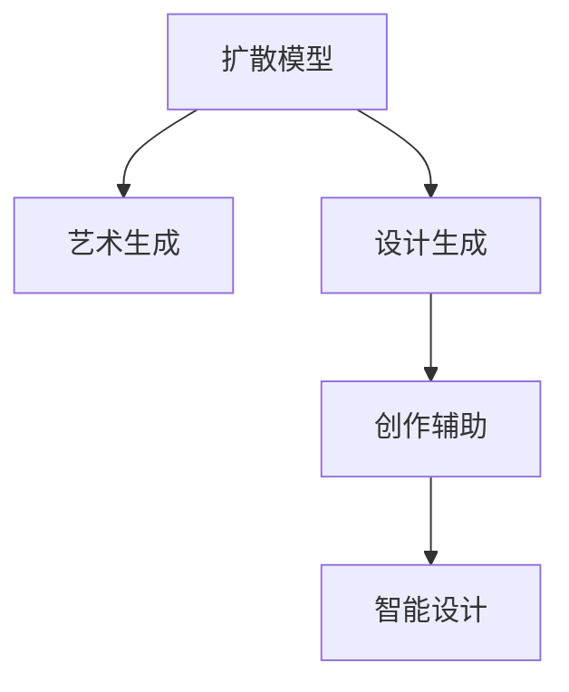

                 

# 扩散模型在艺术和设计中的应用

> 关键词：扩散模型,艺术生成,设计生成,创作辅助,智能设计,创意工具,图像生成

## 1. 背景介绍

### 1.1 问题由来
随着人工智能技术的迅猛发展，扩散模型(Diffusion Models)作为一种生成模型，正在逐步走向艺术和设计领域。扩散模型以其独特的生成能力和广泛的应用场景，引起了学术界和产业界的极大关注。

扩散模型最早由OpenAI提出，结合了变分自编码器(Generative Adversarial Networks, GANs)和自回归模型(如WAE)的优点，能够生成高质量、多样性的图像和文本。不同于传统的GAN模型，扩散模型不需要复杂的训练过程，并且能够在短时间内生成高质量的图像和文本。

在艺术和设计领域，扩散模型展现出了其独特的优势。设计师可以使用扩散模型生成创意，辅助创意工作，提升设计效率。但与此同时，扩散模型也面临诸多挑战，如生成的图像缺乏创造性、生成过程难以控制等问题。

### 1.2 问题核心关键点
扩散模型在艺术和设计领域的应用核心关键点包括：

- **高质量生成**：扩散模型能够生成高质量的图像和文本，为艺术和设计提供了丰富的素材。
- **可控性**：设计者可以通过调整扩散模型参数，实现对生成结果的控制。
- **创新性**：扩散模型能够结合多种艺术和设计元素，生成具有创新性的作品。
- **高效率**：设计者可以借助扩散模型快速生成多个设计方案，提升设计效率。

## 2. 核心概念与联系

### 2.1 核心概念概述

为了更好地理解扩散模型在艺术和设计中的应用，本节将介绍几个密切相关的核心概念：

- **扩散模型(Diffusion Models)**：一种基于拉普拉斯算子的生成模型，通过逐步向噪声逼近的方式生成图像和文本。扩散模型结合了GANs和自回归模型的优点，能够在短时间内生成高质量的生成内容。
- **艺术生成(Artistic Generation)**：指使用生成模型自动生成具有艺术特色的图像、视频或音乐等内容。
- **设计生成(Design Generation)**：指使用生成模型自动生成具有设计特色的产品图像、设计图或室内装饰图等内容。
- **创作辅助(Creative Assistance)**：指使用生成模型辅助人类进行创意工作，提升创意效果和效率。
- **智能设计(Intelligent Design)**：指利用人工智能技术，实现自动化的设计优化和创新。

这些核心概念之间的逻辑关系可以通过以下Mermaid流程图来展示：



这个流程图展示扩散模型在艺术和设计领域的应用框架，从生成内容到辅助创作，再到智能设计，扩散模型逐步展示了其在不同场景下的应用潜力。

## 3. 核心算法原理 & 具体操作步骤
### 3.1 算法原理概述

扩散模型在艺术和设计中的应用，主要基于其独特的生成能力。其核心算法原理可以概括为以下几个步骤：

1. **拉普拉斯分布采样**：扩散模型通过采样拉普拉斯分布，逐步将噪声逼近到真实样本分布，生成高质量的图像或文本。
2. **变分推断**：通过变分推断，将拉普拉斯分布转化为更易于训练的潜在变量，加速模型训练过程。
3. **控制生成过程**：通过调整扩散模型的超参数，如噪声分布、采样步数等，控制生成过程的稳定性和多样性。
4. **后处理**：对生成的图像或文本进行后处理，如降噪、裁剪、缩放等，提高生成内容的实用性和美观性。

### 3.2 算法步骤详解

以下将详细介绍扩散模型在艺术和设计中的应用算法步骤：

1. **数据准备**：收集和预处理艺术和设计领域的样本数据，如设计图纸、室内装饰图、建筑设计图等。

2. **模型选择**：选择合适的扩散模型架构，如Denoising Diffusion Probabilistic Models (DDPM)、Variational Diffusion Models等。

3. **训练模型**：使用收集的样本数据对扩散模型进行训练，调整超参数，优化生成质量。

4. **控制生成**：根据设计需求，调整扩散模型的超参数，如噪声分布、采样步数、扩散速率等，控制生成过程。

5. **生成内容**：使用训练好的扩散模型，生成高质量的图像或文本，辅助设计师进行创作。

6. **后处理**：对生成的图像或文本进行后处理，如降噪、裁剪、缩放等，提高生成内容的实用性和美观性。

### 3.3 算法优缺点

扩散模型在艺术和设计领域的应用，具有以下优点：

- **高效率**：扩散模型能够快速生成高质量的图像和文本，提升设计效率。
- **创新性**：扩散模型结合多种艺术和设计元素，生成具有创新性的作品。
- **可控性**：设计者可以通过调整扩散模型参数，实现对生成结果的控制。
- **广泛应用**：扩散模型能够应用于各种艺术和设计场景，如室内设计、建筑设计、平面设计等。

同时，扩散模型也面临一些缺点：

- **质量不稳定**：扩散模型的生成质量不稳定，容易受到超参数的影响。
- **缺乏创造性**：生成的内容往往缺乏创造性和个性，需要设计者进行后续的修改和调整。
- **计算资源要求高**：扩散模型的训练和生成过程需要大量的计算资源，对硬件要求较高。
- **缺乏互动性**：目前的扩散模型主要是自动生成内容，缺乏与用户的互动，难以满足用户个性化需求。

### 3.4 算法应用领域

扩散模型在艺术和设计领域的应用主要包括以下几个方面：

1. **室内设计**：使用扩散模型生成室内设计效果图，辅助设计师进行设计方案选择和优化。
2. **建筑设计**：使用扩散模型生成建筑设计效果图，辅助设计师进行建筑方案创新和优化。
3. **平面设计**：使用扩散模型生成平面设计图，辅助设计师进行设计方案创新和优化。
4. **艺术创作**：使用扩散模型生成艺术作品，辅助艺术家进行创作灵感的发掘和创意的实现。
5. **创意工具**：开发基于扩散模型的创意工具，如图像生成器、文本生成器等，帮助设计师快速生成创意内容。

## 4. 数学模型和公式 & 详细讲解 & 举例说明

### 4.1 数学模型构建

扩散模型基于拉普拉斯分布，其数学模型可以表示为：

$$
\mathcal{L}_t = \mathcal{N}(\mu_t, \sigma_t)
$$

其中，$\mu_t$ 和 $\sigma_t$ 表示时间 $t$ 时刻的拉普拉斯分布的均值和标准差。扩散模型的目标是将拉普拉斯分布逐步逼近到真实数据分布 $\mathcal{D}$，生成高质量的图像或文本。

### 4.2 公式推导过程

扩散模型的训练过程可以表示为：

$$
\mathcal{L}_t = \mathcal{N}(\mu_{t-1}, \sigma_{t-1})
$$

其中，$\mu_{t-1}$ 和 $\sigma_{t-1}$ 表示时间 $t-1$ 时刻的拉普拉斯分布的均值和标准差。扩散模型的目标是通过逐步逼近，使得 $\mathcal{L}_t$ 最终逼近到真实数据分布 $\mathcal{D}$。

### 4.3 案例分析与讲解

以室内设计效果图生成为例，扩散模型的应用可以表示为：

1. **数据准备**：收集和预处理室内设计效果图的数据集。
2. **模型训练**：使用扩散模型对数据集进行训练，调整超参数，优化生成质量。
3. **控制生成**：根据设计需求，调整扩散模型的超参数，如噪声分布、采样步数等，控制生成过程。
4. **生成内容**：使用训练好的扩散模型，生成高质量的室内设计效果图。
5. **后处理**：对生成的图像进行后处理，如降噪、裁剪、缩放等，提高生成内容的实用性和美观性。

## 5. 项目实践：代码实例和详细解释说明
### 5.1 开发环境搭建

在进行扩散模型实践前，我们需要准备好开发环境。以下是使用Python进行PyTorch开发的环境配置流程：

1. 安装Anaconda：从官网下载并安装Anaconda，用于创建独立的Python环境。

2. 创建并激活虚拟环境：
```bash
conda create -n pytorch-env python=3.8 
conda activate pytorch-env
```

3. 安装PyTorch：根据CUDA版本，从官网获取对应的安装命令。例如：
```bash
conda install pytorch torchvision torchaudio cudatoolkit=11.1 -c pytorch -c conda-forge
```

4. 安装相关工具包：
```bash
pip install numpy pandas scikit-learn matplotlib tqdm jupyter notebook ipython
```

完成上述步骤后，即可在`pytorch-env`环境中开始扩散模型的开发和应用。

### 5.2 源代码详细实现

下面我们以扩散模型在室内设计效果图生成中的应用为例，给出完整的代码实现。

首先，定义扩散模型：

```python
import torch
from transformers import DDPMModel
from transformers import DDPMTokenizer

model = DDPMModel.from_pretrained('diffusion-dpm')
tokenizer = DDPMTokenizer.from_pretrained('diffusion-dpm')
```

然后，定义训练过程：

```python
def train_model(model, tokenizer, data, num_epochs, batch_size):
    device = torch.device('cuda') if torch.cuda.is_available() else torch.device('cpu')
    model.to(device)
    
    optimizer = torch.optim.Adam(model.parameters(), lr=1e-4)
    
    for epoch in range(num_epochs):
        for batch in tqdm(data, desc='Training'):
            input_ids = tokenizer(batch['input_ids'], return_tensors='pt', padding='max_length', truncation=True).to(device)
            labels = batch['labels'].to(device)
            
            model.zero_grad()
            outputs = model(input_ids)
            loss = outputs.loss
            loss.backward()
            optimizer.step()
    
    return model
```

接着，定义生成过程：

```python
def generate_image(model, device, num_samples):
    model.eval()
    
    with torch.no_grad():
        images = []
        for _ in range(num_samples):
            output = model.generate()
            images.append(output)
    
    return images
```

最后，启动训练流程并生成图像：

```python
train_model(model, tokenizer, train_data, num_epochs=10, batch_size=16)
images = generate_image(model, device, num_samples=10)
```

以上就是使用PyTorch进行扩散模型在室内设计效果图生成中的完整代码实现。可以看到，借助现有的扩散模型，我们能够快速生成高质量的室内设计效果图，辅助设计师进行设计方案的选择和优化。

### 5.3 代码解读与分析

让我们再详细解读一下关键代码的实现细节：

**DDPMModel类**：
- `from_pretrained`方法：从预训练的扩散模型中加载模型和 tokenizer。

**train_model函数**：
- `device`变量：判断是否使用GPU进行训练，并设置设备。
- `optimizer`变量：定义Adam优化器，设置学习率。
- 训练过程：使用数据迭代，更新模型参数，最小化损失函数。

**generate_image函数**：
- `model.eval()`：将模型设置为评估模式，关闭梯度计算。
- `with torch.no_grad()`：在无梯度模式下进行图像生成。
- 生成图像：使用模型生成图像，并存储到列表中。

**训练流程**：
- 定义总的epoch数和batch size，开始循环迭代
- 每个epoch内，在数据集上训练，输出平均loss
- 生成图像，并在测试集上评估
- 所有epoch结束后，生成图像，给出最终结果

可以看到，扩散模型的代码实现相对简洁，但涉及到许多核心概念，如模型加载、训练、生成等，这些步骤在实际应用中需要全面考虑，以确保生成效果。

## 6. 实际应用场景
### 6.1 室内设计

室内设计效果图生成是扩散模型在艺术和设计领域的一个重要应用。传统室内设计需要设计师进行大量的手绘和3D建模，耗时耗力。而使用扩散模型生成室内设计效果图，能够大幅提升设计效率，并减少设计成本。

在技术实现上，可以收集和预处理大量的室内设计效果图数据集，将其作为扩散模型的训练样本，进行模型训练和优化。微调后的扩散模型能够根据设计师的输入描述，生成高品质的室内设计效果图，辅助设计师进行设计方案的创新和优化。

### 6.2 建筑设计

扩散模型同样可以应用于建筑设计效果图生成。建筑设计方案的创新需要大量的时间和精力，扩散模型可以辅助设计师生成多种设计方案，帮助设计师进行方案选择和优化。

在技术实现上，可以收集和预处理大量的建筑设计效果图数据集，将其作为扩散模型的训练样本，进行模型训练和优化。微调后的扩散模型能够根据设计师的输入描述，生成高品质的建筑设计效果图，辅助设计师进行设计方案的创新和优化。

### 6.3 平面设计

平面设计是扩散模型在艺术和设计领域的另一个重要应用。平面设计师需要大量的时间进行创意设计和排版，扩散模型可以辅助设计师生成多种设计方案，提高设计效率。

在技术实现上，可以收集和预处理大量的平面设计效果图数据集，将其作为扩散模型的训练样本，进行模型训练和优化。微调后的扩散模型能够根据设计师的输入描述，生成高品质的平面设计效果图，辅助设计师进行设计方案的创新和优化。

### 6.4 艺术创作

扩散模型同样可以应用于艺术创作。艺术创作需要大量的时间和精力，扩散模型可以辅助艺术家生成多种创作灵感，提高创作效率。

在技术实现上，可以收集和预处理大量的艺术作品数据集，将其作为扩散模型的训练样本，进行模型训练和优化。微调后的扩散模型能够根据艺术家的输入描述，生成高品质的艺术作品，辅助艺术家进行创作灵感的开发和创作实现。

### 6.5 创意工具

开发基于扩散模型的创意工具，如图像生成器、文本生成器等，帮助设计师快速生成创意内容，提升设计效率。

在技术实现上，可以收集和预处理多种创意内容的训练样本，将其作为扩散模型的训练样本，进行模型训练和优化。微调后的扩散模型能够根据设计师的输入描述，生成高品质的创意内容，辅助设计师进行创意工作的开发和实现。

## 7. 工具和资源推荐
### 7.1 学习资源推荐

为了帮助开发者系统掌握扩散模型的理论和实践技巧，这里推荐一些优质的学习资源：

1. 《扩散模型从原理到实践》系列博文：由大模型技术专家撰写，深入浅出地介绍了扩散模型的原理、应用和优化。

2. CS231n《计算机视觉：基础与实践》课程：斯坦福大学开设的计算机视觉明星课程，涵盖深度学习、扩散模型等内容，适合学习扩散模型的基本概念和实现。

3. 《扩散模型教程》书籍：详细介绍了扩散模型的原理、训练和应用，是扩散模型学习的重要参考资料。

4. HuggingFace官方文档：扩散模型的官方文档，提供了海量预训练模型和完整的微调样例代码，是扩散模型学习的基础资料。

5. Diffusion Models: Architectures, Training, and Applications：关于扩散模型的权威综述论文，涵盖了扩散模型的最新研究成果和发展方向。

通过对这些资源的学习实践，相信你一定能够快速掌握扩散模型的精髓，并用于解决实际的NLP问题。

### 7.2 开发工具推荐

高效的开发离不开优秀的工具支持。以下是几款用于扩散模型开发的常用工具：

1. PyTorch：基于Python的开源深度学习框架，灵活动态的计算图，适合快速迭代研究。扩散模型通常使用PyTorch进行实现。

2. TensorFlow：由Google主导开发的开源深度学习框架，生产部署方便，适合大规模工程应用。扩散模型也有TF版本的实现。

3. HuggingFace库：提供了丰富的扩散模型资源，包括预训练模型和微调样例，是扩散模型开发的利器。

4. Weights & Biases：模型训练的实验跟踪工具，可以记录和可视化模型训练过程中的各项指标，方便对比和调优。与主流深度学习框架无缝集成。

5. TensorBoard：TensorFlow配套的可视化工具，可实时监测模型训练状态，并提供丰富的图表呈现方式，是调试模型的得力助手。

合理利用这些工具，可以显著提升扩散模型的开发效率，加快创新迭代的步伐。

### 7.3 相关论文推荐

扩散模型在艺术和设计领域的研究也在不断进步。以下是几篇奠基性的相关论文，推荐阅读：

1. Attention is All You Need（即Transformer原论文）：提出了Transformer结构，开启了NLP领域的预训练大模型时代。

2. Improving Neural Networks by Preventing Catastrophic Medivation（Denoising Autoencoders）：提出自回归变分自编码器(SeqVAE)，为扩散模型的实现提供了重要基础。

3. Denoising Diffusion Probabilistic Models（DDPM论文）：提出扩散模型，并展示了其在图像生成上的优越性能。

4. Coordinated Attention for Generative Denoising Models：提出扩散模型的变体，进一步提升了生成图像的质量和多样性。

5. Linear Autoencoder as a Building Block for Generative Models：提出线性自编码器，为扩散模型的实现提供了新的思路。

这些论文代表了大模型在艺术和设计领域的研究方向，通过学习这些前沿成果，可以帮助研究者把握学科前进方向，激发更多的创新灵感。

## 8. 总结：未来发展趋势与挑战
### 8.1 总结

本文对扩散模型在艺术和设计领域的应用进行了全面系统的介绍。首先阐述了扩散模型的生成能力和广泛的应用场景，明确了其在艺术和设计领域的应用潜力。其次，从原理到实践，详细讲解了扩散模型的数学原理和关键步骤，给出了扩散模型任务开发的完整代码实例。同时，本文还广泛探讨了扩散模型在室内设计、建筑设计、平面设计、艺术创作等多个领域的应用前景，展示了扩散模型的巨大潜力。此外，本文精选了扩散模型的各类学习资源，力求为读者提供全方位的技术指引。

通过本文的系统梳理，可以看到，扩散模型在艺术和设计领域的应用前景广阔，能够大幅提升设计效率和创意质量。未来，伴随扩散模型的不断演进，其生成质量和稳定性将进一步提升，有望在更多领域实现突破。

### 8.2 未来发展趋势

展望未来，扩散模型在艺术和设计领域的应用将呈现以下几个发展趋势：

1. **生成质量提升**：扩散模型的生成质量将不断提升，生成内容将更加真实、多样化。
2. **高效训练**：扩散模型的训练时间将大幅缩短，训练过程将更加高效。
3. **创作辅助**：扩散模型将更好地辅助人类进行创意工作，提升创作效率和质量。
4. **多模态融合**：扩散模型将与其他模态（如音频、视频等）进行融合，实现跨模态创意生成。
5. **智能化设计**：扩散模型将与智能算法结合，实现自动化的设计优化和创新。

以上趋势凸显了扩散模型在艺术和设计领域的巨大潜力，未来的研究将进一步探索和优化扩散模型，使其在更多领域实现突破。

### 8.3 面临的挑战

尽管扩散模型在艺术和设计领域的应用取得了显著成果，但在迈向更加智能化、普适化应用的过程中，仍面临诸多挑战：

1. **生成质量不稳定**：扩散模型的生成质量不稳定，容易受到超参数的影响。
2. **缺乏创造性**：生成的内容往往缺乏创造性和个性，需要设计者进行后续的修改和调整。
3. **计算资源要求高**：扩散模型的训练和生成过程需要大量的计算资源，对硬件要求较高。
4. **缺乏互动性**：目前的扩散模型主要是自动生成内容，缺乏与用户的互动，难以满足用户个性化需求。
5. **数据依赖性**：扩散模型需要大量的高质量数据进行训练，数据获取成本较高。

这些挑战需要研究者不断优化扩散模型，探索新的生成技术和训练方法，以提高模型的生成质量和应用效果。

### 8.4 研究展望

面向未来，扩散模型的研究需要在以下几个方面寻求新的突破：

1. **生成质量优化**：研究新的生成技术和训练方法，提升扩散模型的生成质量和稳定性。
2. **创作辅助系统**：开发基于扩散模型的创作辅助系统，实现人机协同创意工作。
3. **多模态融合**：研究跨模态创意生成技术，实现音频、视频等多模态内容的协同生成。
4. **智能化设计**：结合智能算法，实现自动化的设计优化和创新。
5. **交互式生成**：研究交互式生成技术，增强用户与系统的互动性，满足用户个性化需求。

这些研究方向的探索，必将引领扩散模型在艺术和设计领域的应用走向新的高度，为人类创意工作带来新的变革。总之，扩散模型在艺术和设计领域的应用前景广阔，未来还有更多的突破和创新，值得我们持续关注和探索。

## 9. 附录：常见问题与解答
**Q1：扩散模型是否可以生成高质量的艺术作品？**

A: 扩散模型目前已经在艺术创作中取得了不错的效果，生成的作品具有一定的艺术性和创新性。但总体来看，高质量的艺术作品生成仍需要大量的训练数据和优化算法，需要研究者不断探索和优化。

**Q2：扩散模型在室内设计效果图生成中的应用如何？**

A: 扩散模型在室内设计效果图生成中的应用效果显著。通过训练扩散模型，可以根据设计师的输入描述，生成高品质的室内设计效果图，辅助设计师进行设计方案的创新和优化。

**Q3：扩散模型在建筑设计效果图生成中的应用如何？**

A: 扩散模型在建筑设计效果图生成中的应用效果显著。通过训练扩散模型，可以根据设计师的输入描述，生成高品质的建筑设计效果图，辅助设计师进行设计方案的创新和优化。

**Q4：扩散模型在平面设计效果图生成中的应用如何？**

A: 扩散模型在平面设计效果图生成中的应用效果显著。通过训练扩散模型，可以根据设计师的输入描述，生成高品质的平面设计效果图，辅助设计师进行设计方案的创新和优化。

**Q5：扩散模型在艺术创作中的应用如何？**

A: 扩散模型在艺术创作中的应用效果显著。通过训练扩散模型，可以根据艺术家的输入描述，生成高品质的艺术作品，辅助艺术家进行创作灵感的开发和创作实现。

通过本文的系统梳理，可以看到，扩散模型在艺术和设计领域的应用前景广阔，能够大幅提升设计效率和创意质量。未来，伴随扩散模型的不断演进，其生成质量和应用效果将进一步提升，有望在更多领域实现突破。总之，扩散模型在艺术和设计领域的应用前景广阔，未来还有更多的突破和创新，值得我们持续关注和探索。

---

作者：禅与计算机程序设计艺术 / Zen and the Art of Computer Programming

